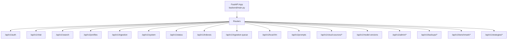
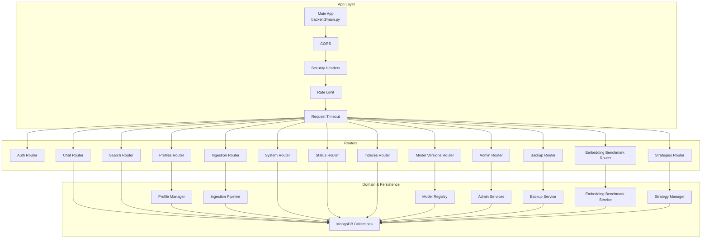
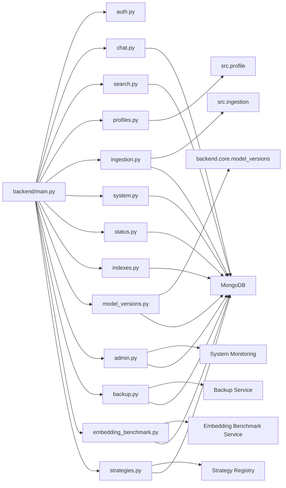
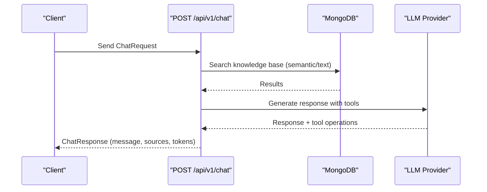
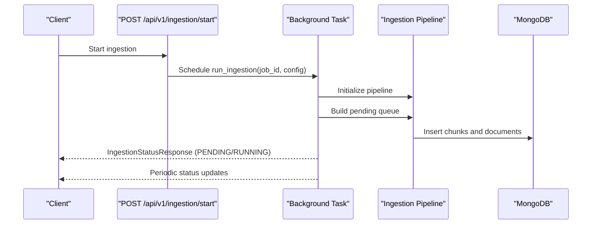
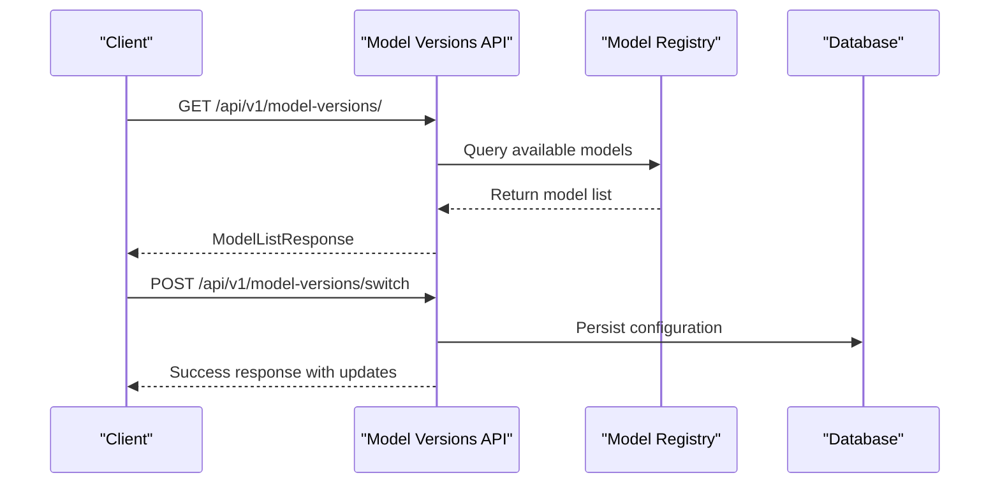
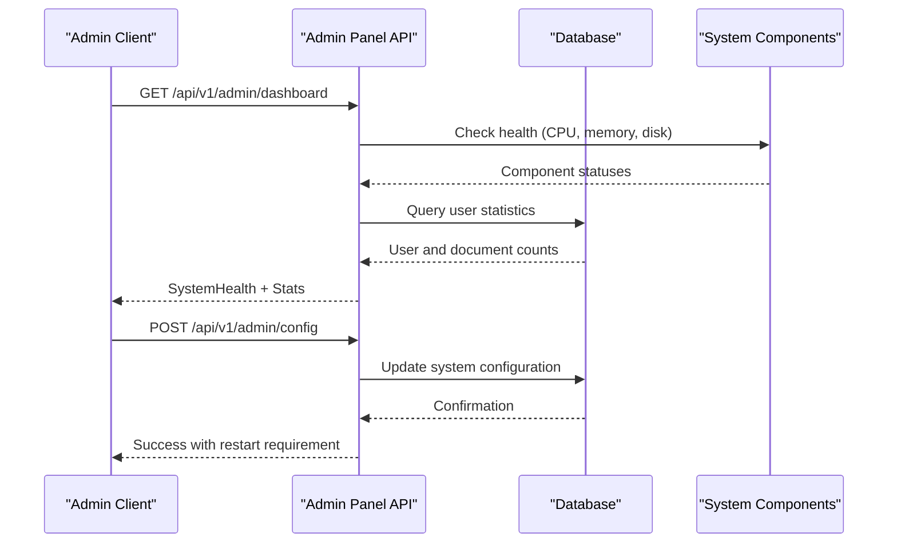
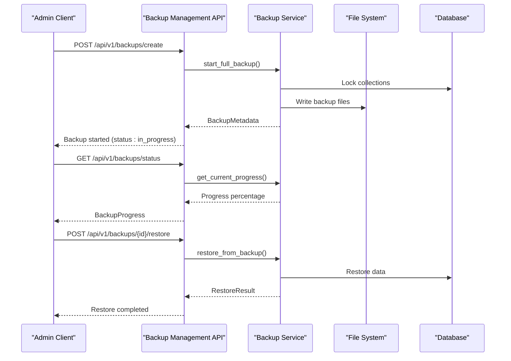
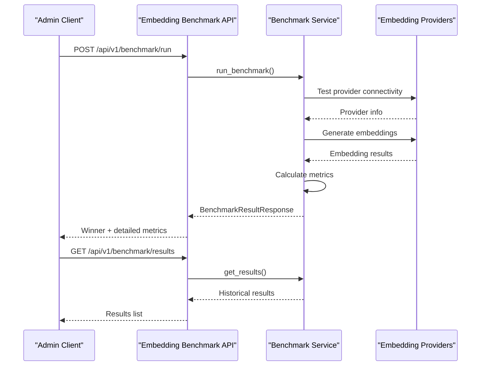
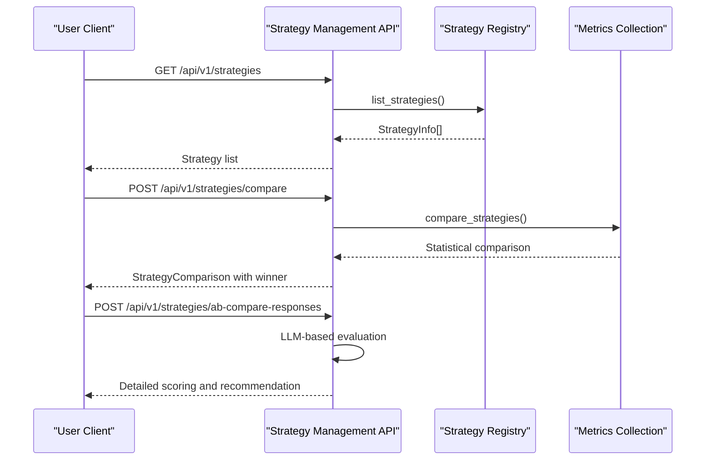

# API Reference

<cite>
**Referenced Files in This Document**
- [backend/main.py](file://backend/main.py)
- [backend/routers/auth.py](file://backend/routers/auth.py)
- [backend/routers/chat.py](file://backend/routers/chat.py)
- [backend/routers/search.py](file://backend/routers/search.py)
- [backend/routers/profiles.py](file://backend/routers/profiles.py)
- [backend/routers/ingestion.py](file://backend/routers/ingestion.py)
- [backend/routers/system.py](file://backend/routers/system.py)
- [backend/routers/status.py](file://backend/routers/status.py)
- [backend/routers/indexes.py](file://backend/routers/indexes.py)
- [backend/routers/model_versions.py](file://backend/routers/model_versions.py)
- [backend/routers/admin.py](file://backend/routers/admin.py)
- [backend/routers/backup.py](file://backend/routers/backup.py)
- [backend/routers/embedding_benchmark.py](file://backend/routers/embedding_benchmark.py)
- [backend/routers/strategies.py](file://backend/routers/strategies.py)
- [backend/core/model_versions.py](file://backend/core/model_versions.py)
- [backend/models/backup_schemas.py](file://backend/models/backup_schemas.py)
- [frontend/src/pages/SystemPage.tsx](file://frontend/src/pages/SystemPage.tsx)
- [frontend/src/pages/BackupManagementPage.tsx](file://frontend/src/pages/BackupManagementPage.tsx)
</cite>

## Update Summary
**Changes Made**
- Added new Admin Panel API section documenting system health, user management, configuration, logs, and statistics endpoints
- Added new Backup Management API section documenting full/incremental/checkpoint backup operations and restore functionality
- Added new Embedding Benchmark API section documenting provider comparison, connectivity testing, and historical results
- Added new Strategy Management API section documenting A/B testing, performance metrics, and LLM-based response comparison
- Updated Project Structure diagram to include new routers for admin, backup, embedding benchmark, and strategies
- Enhanced Frontend Integration section with new admin pages and backup management interfaces
- Added comprehensive error handling and security considerations for new admin-protected endpoints

## Table of Contents
1. [Introduction](#introduction)
2. [Project Structure](#project-structure)
3. [Core Components](#core-components)
4. [Architecture Overview](#architecture-overview)
5. [Detailed Component Analysis](#detailed-component-analysis)
6. [Dependency Analysis](#dependency-analysis)
7. [Performance Considerations](#performance-considerations)
8. [Troubleshooting Guide](#troubleshooting-guide)
9. [Conclusion](#conclusion)
10. [Appendices](#appendices)

## Introduction
This document provides comprehensive API documentation for the RecallHub backend. It covers authentication, chat and search, ingestion management, system configuration, model version management, admin panel operations, backup management, embedding benchmarking, and strategy management with A/B testing. For each endpoint, you will find HTTP methods, URL patterns, request/response schemas, authentication requirements, error handling strategies, status codes, and practical usage examples. It also documents rate limiting, security considerations, and API versioning.

## Project Structure
The backend is a FastAPI application that mounts multiple routers under a common base path. The main application initializes middleware, exception handlers, and includes routers for:
- Authentication
- Chat and sessions
- Search
- Profiles
- Ingestion and queue
- System health and configuration
- Status dashboards
- Indexes and performance
- Local LLM and prompts
- Cloud sources (connections, OAuth, sync, providers, cache)
- Model Versions
- **New**: Admin Panel (system health, user management, configuration, logs, statistics)
- **New**: Backup Management (full/incremental/checkpoint operations)
- **New**: Embedding Benchmark (provider comparison and testing)
- **New**: Strategy Management (A/B testing and performance metrics)

**Diagram sources**
- [backend/main.py:534-550](file://backend/main.py#L534-L550)
- [backend/main.py:418-550](file://backend/main.py#L418-L550)

**Section sources**
- [backend/main.py:28-37](file://backend/main.py#L28-L37)
- [backend/main.py:418-550](file://backend/main.py#L418-L550)

## Core Components
- Authentication: JWT bearer and API key support, user registration/login/logout/me, admin user management, and profile access controls.
- Chat: Conversational AI with RAG, tool-calling (knowledge base search, web search, browsing), and conversation lifecycle.
- Search: Semantic, text, and hybrid search endpoints with unified routing and response schemas.
- Profiles: Multi-profile management, switching, and cloud source associations.
- Ingestion: Document ingestion orchestration, status tracking, logs, and batch operations.
- System: Health checks, stats, configuration, index management, and model listings.
- Status/Index Dashboards: System metrics, profile KPIs, and index performance insights.
- Model Versions: Comprehensive model registry, version management, compatibility checking, and configuration switching.
- **New**: Admin Panel: System health monitoring, user management, configuration updates, log viewing, and statistics collection.
- **New**: Backup Management: Full/incremental/checkpoint backup operations, restore functionality, and storage management.
- **New**: Embedding Benchmark: Provider comparison, connectivity testing, and historical performance analysis.
- **New**: Strategy Management: A/B testing framework, performance metrics, and LLM-based response evaluation.

**Section sources**
- [backend/routers/auth.py:192-285](file://backend/routers/auth.py#L192-L285)
- [backend/routers/chat.py:634-734](file://backend/routers/chat.py#L634-L734)
- [backend/routers/search.py:34-347](file://backend/routers/search.py#L34-L347)
- [backend/routers/profiles.py:27-359](file://backend/routers/profiles.py#L27-L359)
- [backend/routers/ingestion.py:656-800](file://backend/routers/ingestion.py#L656-L800)
- [backend/routers/system.py:88-145](file://backend/routers/system.py#L88-L145)
- [backend/routers/status.py:74-132](file://backend/routers/status.py#L74-L132)
- [backend/routers/indexes.py:78-108](file://backend/routers/indexes.py#L78-L108)
- [backend/routers/model_versions.py:1-459](file://backend/routers/model_versions.py#L1-L459)
- [backend/routers/admin.py:121-172](file://backend/routers/admin.py#L121-L172)
- [backend/routers/backup.py:39-93](file://backend/routers/backup.py#L39-L93)
- [backend/routers/embedding_benchmark.py:131-216](file://backend/routers/embedding_benchmark.py#L131-L216)
- [backend/routers/strategies.py:76-111](file://backend/routers/strategies.py#L76-L111)

## Architecture Overview
The API follows a layered architecture:
- Application layer: FastAPI app with middleware and exception handlers.
- Router layer: Feature-based routers exposing REST endpoints.
- Domain layer: Business logic for chat, search, ingestion, system operations, model management, admin operations, backup management, embedding benchmarking, and strategy management.
- Persistence layer: MongoDB collections for users, API keys, ingestion jobs, system config, model configurations, backups, benchmark results, and strategy metrics.

**Diagram sources**
- [backend/main.py:227-255](file://backend/main.py#L227-L255)
- [backend/main.py:418-550](file://backend/main.py#L418-L550)
- [backend/routers/admin.py:1-598](file://backend/routers/admin.py#L1-L598)
- [backend/routers/backup.py:1-459](file://backend/routers/backup.py#L1-L459)
- [backend/routers/embedding_benchmark.py:1-442](file://backend/routers/embedding_benchmark.py#L1-L442)
- [backend/routers/strategies.py:1-659](file://backend/routers/strategies.py#L1-L659)

## Detailed Component Analysis

### Authentication Endpoints
- Base Path: /api/v1/auth
- Authentication Methods:
  - Bearer JWT via Authorization header
  - API Key via X-API-Key header
- Admin-protected endpoints require admin privileges.

Endpoints:
- POST /api/v1/auth/register
  - Request: RegisterRequest
  - Response: TokenResponse
  - Notes: Registration mode controlled by environment; invite code required in invite mode.
- POST /api/v1/auth/login
  - Request: LoginRequest
  - Response: TokenResponse
- GET /api/v1/auth/me
  - Response: UserResponse
- PUT /api/v1/auth/me
  - Query: name (optional)
  - Response: SuccessResponse
- PUT /api/v1/auth/me/password
  - Request: PasswordChangeRequest
  - Response: SuccessResponse
- POST /api/v1/auth/logout
  - Response: SuccessResponse

Admin Endpoints (require admin):
- GET /api/v1/auth/users
  - Response: list of UserListResponse
- GET /api/v1/auth/access-matrix
  - Response: ProfileAccessMatrix
- POST /api/v1/auth/access
  - Request: SetAccessRequest
  - Response: SuccessResponse
- POST /api/v1/auth/users/create
  - Request: AdminCreateUserRequest
  - Response: UserListResponse
- PUT /api/v1/auth/users/{user_id}
  - Request: AdminUpdateUserRequest
  - Response: UserListResponse

Common Schemas:
- TokenResponse: access_token, token_type, expires_in, user
- UserResponse/UserListResponse: id, email, name, is_active, is_admin, timestamps
- RegisterRequest/LoginRequest/PasswordChangeRequest: typed fields with validation
- API Key Models: APIKey, APIKeyCreate, APIKeyResponse, APIKeyCreatedResponse

Authentication Behavior:
- Supports dual auth: JWT bearer or API key.
- API key validation includes expiry checks and last-used updates.
- Admin endpoints enforce admin status.

Example Requests:
- Login:
  - Method: POST
  - URL: /api/v1/auth/login
  - Headers: Authorization: Bearer <JWT> or X-API-Key: <API_KEY>
  - Body: { "email": "...", "password": "..." }
- Register:
  - Method: POST
  - URL: /api/v1/auth/register
  - Body: { "email": "...", "name": "...", "password": "...", "invite_code": "..." }

Error Handling:
- 400 Bad Request for invalid input or conflicting data.
- 401 Unauthorized for invalid credentials or missing auth.
- 403 Forbidden for insufficient permissions.
- 404 Not Found for missing resources.
- 409 Conflict for concurrent operations (e.g., running ingestion job).

**Section sources**
- [backend/routers/auth.py:289-422](file://backend/routers/auth.py#L289-L422)
- [backend/routers/auth.py:517-800](file://backend/routers/auth.py#L517-L800)

### Admin Panel API Endpoints
- Base Path: /api/v1/admin
- **All endpoints require admin privileges** and are protected by the `require_admin` dependency.

#### System Health and Monitoring
- GET /api/v1/admin/dashboard
  - Response: SystemHealth
  - Description: Comprehensive system health dashboard with CPU, memory, disk usage, service status, and MongoDB/Ollama connectivity.
- GET /api/v1/admin/health/detailed
  - Response: Detailed health check results for MongoDB, Ollama, disk, and memory.
  - Description: Provides detailed component health status and metrics.

#### Configuration Management
- GET /api/v1/admin/config
  - Response: Current system configuration (with sensitive values redacted).
  - Description: Returns current configuration including LLM provider, embedding provider, cloud sources, remote access, backup retention, and log level.
- POST /api/v1/admin/config
  - Request: AdminConfig
  - Response: Update result with restart requirement indicator.
  - Description: Updates system configuration. Some changes require service restart.

#### User Management
- GET /api/v1/admin/users
  - Response: List of all users with basic information.
  - Description: Lists all system users for administrative oversight.
- POST /api/v1/admin/users/{user_id}/role
  - Query: role (user or admin)
  - Response: Success message with updated role.
  - Description: Updates user role assignment.

#### Statistics and Metrics
- GET /api/v1/admin/stats
  - Response: System statistics including document counts, chunk counts, session counts, user counts, and database size metrics.
  - Description: Provides comprehensive system usage statistics and storage metrics.

#### Version Management
- GET /api/v1/admin/version
  - Response: SystemVersion
  - Description: Returns current system version information including installed version, installation timestamp, previous version, and update history.

Common Schemas:
- SystemHealth: status, uptime_seconds, cpu_percent, memory_percent, disk_percent, mongodb_status, ollama_status, services
- AdminConfig: llm_provider, llm_model, embedding_provider, embedding_model, enable_cloud_sources, enable_remote_access, backup_retention_days, log_level
- LogEntry: timestamp, level, message, logger
- SystemVersion: version, installed_at, previous_version, update_history

Example Requests:
- System Dashboard:
  - Method: GET
  - URL: /api/v1/admin/dashboard
  - Headers: Authorization: Bearer <ADMIN_JWT>
  - Response: SystemHealth with current system metrics

Error Handling:
- 401 Unauthorized for invalid or missing admin credentials.
- 403 Forbidden for non-admin users attempting admin operations.
- 500 Internal Server Error for system health check failures.

**Section sources**
- [backend/routers/admin.py:121-172](file://backend/routers/admin.py#L121-L172)
- [backend/routers/admin.py:175-228](file://backend/routers/admin.py#L175-L228)
- [backend/routers/admin.py:235-309](file://backend/routers/admin.py#L235-L309)
- [backend/routers/admin.py:430-473](file://backend/routers/admin.py#L430-L473)
- [backend/routers/admin.py:480-510](file://backend/routers/admin.py#L480-L510)
- [backend/routers/admin.py:517-538](file://backend/routers/admin.py#L517-L538)

### Backup Management API Endpoints
- Base Path: /api/v1/backups
- **All endpoints require admin privileges** and are protected by the `require_admin` dependency.

#### Backup Creation Operations
- POST /api/v1/backups/create
  - Request: CreateBackupRequest
  - Response: BackupMetadata
  - Description: Creates new backups with support for full, incremental, and checkpoint types.
  - Notes: Full and incremental backups run asynchronously; use status endpoint for progress.
- POST /api/v1/backups/checkpoint
  - Request: CreateCheckpointRequest
  - Response: BackupMetadata
  - Description: Creates lightweight checkpoint snapshots for quick recovery points.

#### Backup Listing and Management
- GET /api/v1/backups/
  - Query: profile_key, backup_type, limit, skip
  - Response: BackupListResponse
  - Description: Lists all backups with optional filtering by profile and type.
- GET /api/v1/backups/checkpoints
  - Query: profile_key, limit, skip
  - Response: BackupListResponse
  - Description: Lists all checkpoints specifically.

#### Configuration and Status
- GET /api/v1/backups/config
  - Response: BackupConfig
  - Description: Retrieves current backup system configuration.
- PUT /api/v1/backups/config
  - Request: UpdateBackupConfigRequest
  - Response: BackupConfig
  - Description: Updates backup configuration including retention policies, compression, and scheduling.
- GET /api/v1/backups/status
  - Response: BackupProgress or null
  - Description: Returns current backup operation progress or null if idle.
- GET /api/v1/backups/storage
  - Response: StorageStats
  - Description: Returns backup storage statistics including total size, backup counts, and available space.

#### Individual Backup Operations
- GET /api/v1/backups/{backup_id}
  - Response: BackupMetadata
  - Description: Retrieves detailed information about a specific backup.
- GET /api/v1/backups/{backup_id}/chain
  - Response: List[BackupMetadata]
  - Description: Returns the backup chain for incremental backups from full to specified backup.
- POST /api/v1/backups/{backup_id}/restore
  - Request: RestoreBackupRequest
  - Response: RestoreResult
  - Description: Restores database from backup with support for full, merge, and selective modes.
- DELETE /api/v1/backups/{backup_id}
  - Response: Success message
  - Description: Deletes a backup and its associated files.

Backup Types and Behaviors:
- **Full**: Complete database backup with all collections and data
- **Incremental**: Changes since last backup (requires parent full backup)
- **Checkpoint**: Lightweight state snapshot with collection counts and hashes
- **Post-Ingestion**: Automatic backup triggered after successful ingestion

Restore Modes:
- **Full**: Replace all data with backup data (irreversible)
- **Merge**: Add missing documents only (preserves existing data)
- **Selective**: Restore specific collections only

Common Schemas:
- BackupType: full, incremental, checkpoint, post_ingestion
- BackupStatus: pending, in_progress, completed, failed
- RestoreMode: full, merge, selective
- CreateBackupRequest: backup_type, profile_key, name, include_embeddings, include_system_collections
- CreateCheckpointRequest: name, profile_key, description
- RestoreBackupRequest: backup_id, restore_mode, collections, skip_users, skip_sessions, target_database
- BackupMetadata: comprehensive backup information including timing, size, collections, and status
- BackupConfig: system-wide backup configuration
- StorageStats: backup storage usage metrics
- RestoreResult: detailed restore operation results
- BackupProgress: current backup operation progress

Example Requests:
- Create Full Backup:
  - Method: POST
  - URL: /api/v1/backups/create
  - Headers: Authorization: Bearer <ADMIN_JWT>
  - Body: { "backup_type": "full", "profile_key": "default", "include_embeddings": true, "include_system_collections": true }
- List Backups:
  - Method: GET
  - URL: /api/v1/backups/?backup_type=incremental&limit=10
  - Headers: Authorization: Bearer <ADMIN_JWT>

Error Handling:
- 401 Unauthorized for invalid or missing admin credentials.
- 404 Not Found for non-existent backup IDs.
- 400 Bad Request for invalid restore parameters or backup type mismatches.
- 500 Internal Server Error for backup/restore operation failures.

**Section sources**
- [backend/routers/backup.py:39-93](file://backend/routers/backup.py#L39-L93)
- [backend/routers/backup.py:96-124](file://backend/routers/backup.py#L96-L124)
- [backend/routers/backup.py:129-195](file://backend/routers/backup.py#L129-L195)
- [backend/routers/backup.py:201-251](file://backend/routers/backup.py#L201-L251)
- [backend/routers/backup.py:256-298](file://backend/routers/backup.py#L256-L298)
- [backend/routers/backup.py:304-426](file://backend/routers/backup.py#L304-L426)
- [backend/models/backup_schemas.py:9-193](file://backend/models/backup_schemas.py#L9-L193)

### Embedding Benchmark API Endpoints
- Base Path: /api/v1/benchmark
- **All endpoints require admin privileges** and are protected by the `require_admin` dependency.

#### Benchmark Operations
- POST /api/v1/benchmark/run
  - Request: BenchmarkRequest (base64 file content)
  - Response: BenchmarkResultResponse
  - Description: Runs comprehensive benchmark comparing multiple embedding providers with detailed metrics.
- POST /api/v1/benchmark/run-file
  - Request: Multipart form with file upload
  - Response: BenchmarkResultResponse
  - Description: Alternative endpoint accepting direct file uploads instead of base64 encoding.

#### Provider Management
- GET /api/v1/benchmark/providers
  - Response: AvailableProvidersResponse
  - Description: Returns available embedding providers including OpenAI, Ollama, vLLM, and custom endpoints.
- POST /api/v1/benchmark/test-provider
  - Request: ProviderTestRequest
  - Response: ProviderTestResponse
  - Description: Tests connectivity to an embedding provider and returns latency and dimension information.

#### Historical Results
- GET /api/v1/benchmark/results
  - Query: limit (default: 20)
  - Response: Results container with benchmark results array.
  - Description: Retrieves historical benchmark results from the database.
- GET /api/v1/benchmark/results/{benchmark_id}
  - Response: Individual benchmark result document.
  - Description: Retrieves a specific benchmark result by ID.
- DELETE /api/v1/benchmark/results/{benchmark_id}
  - Response: Success message
  - Description: Deletes a benchmark result from the database.

Benchmark Metrics and Analysis:
- **Total Time**: Complete benchmark execution time
- **Chunking Time**: Time spent on document chunking
- **Embedding Time**: Time spent generating embeddings
- **Average Latency**: Per-chunk processing latency
- **Tokens Processed**: Total tokens processed during benchmark
- **Chunks Created**: Number of document chunks generated
- **Memory Usage**: CPU and memory consumption before, during, and after benchmark
- **Cost Estimate**: Estimated USD cost for the operation

Provider Information:
- **Provider Name**: OpenAI, Ollama, vLLM, or custom
- **Model**: Specific model being tested
- **URL**: Endpoint URL (for custom providers)
- **Available**: Connectivity status
- **Models**: Available model variants with dimensions

Common Schemas:
- BenchmarkRequest: providers array, file_content (base64), file_name, chunk_config
- BenchmarkResultResponse: comprehensive benchmark results with winner determination
- ProviderConfigRequest: provider configuration for benchmarking
- ChunkConfigRequest: chunking parameters (size, overlap, max_tokens)
- BenchmarkMetricsResponse: detailed metrics for individual provider
- ProviderTestRequest: provider connectivity test parameters
- ProviderTestResponse: connectivity test results
- AvailableProvidersResponse: structured provider information
- ProviderInfo: individual provider details
- ProviderModelInfo: model information with dimensions

Example Requests:
- Run Benchmark:
  - Method: POST
  - URL: /api/v1/benchmark/run
  - Headers: Authorization: Bearer <ADMIN_JWT>
  - Body: {
    "providers": [
      {"provider_type": "openai", "model": "text-embedding-3-small"},
      {"provider_type": "ollama", "model": "nomic-embed-text"}
    ],
    "file_content": "base64_encoded_file_content",
    "file_name": "sample.txt",
    "chunk_config": {"chunk_size": 1000, "chunk_overlap": 200, "max_tokens": 512}
  }

Error Handling:
- 401 Unauthorized for invalid or missing admin credentials.
- 400 Bad Request for invalid provider configurations or file content.
- 500 Internal Server Error for benchmark execution failures.

**Section sources**
- [backend/routers/embedding_benchmark.py:131-216](file://backend/routers/embedding_benchmark.py#L131-L216)
- [backend/routers/embedding_benchmark.py:219-302](file://backend/routers/embedding_benchmark.py#L219-L302)
- [backend/routers/embedding_benchmark.py:305-322](file://backend/routers/embedding_benchmark.py#L305-L322)
- [backend/routers/embedding_benchmark.py:325-356](file://backend/routers/embedding_benchmark.py#L325-L356)
- [backend/routers/embedding_benchmark.py:359-408](file://backend/routers/embedding_benchmark.py#L359-L408)
- [backend/routers/embedding_benchmark.py:411-441](file://backend/routers/embedding_benchmark.py#L411-L441)

### Strategy Management API Endpoints
- Base Path: /api/v1/strategies

#### Strategy Discovery and Information
- GET /api/v1/strategies
  - Query: domain (optional filter: general, software_dev, legal, hr)
  - Response: List of StrategyInfo
  - Description: Lists all available strategies with basic information.
- GET /api/v1/strategies/default
  - Response: StrategyInfo
  - Description: Returns the default strategy for the system.
- GET /api/v1/strategies/{strategy_id}
  - Response: StrategyDetail
  - Description: Returns detailed information about a specific strategy including configuration and prompt previews.

#### Performance Metrics and Analytics
- GET /api/v1/strategies/{strategy_id}/metrics
  - Query: hours (time window), domain (filter)
  - Response: StrategyStats
  - Description: Returns performance metrics for a specific strategy.
- GET /api/v1/strategies/metrics/all
  - Query: hours (time window), domain (filter)
  - Response: List of StrategyStats
  - Description: Returns metrics for all strategies, sorted by quality score.

#### Strategy Comparison and A/B Testing
- POST /api/v1/strategies/compare
  - Request: CompareRequest (strategy_a, strategy_b, hours, domain)
  - Response: StrategyComparison
  - Description: Compares two strategies' performance statistically.
- POST /api/v1/strategies/auto-detect
  - Request: AutoDetectRequest (query)
  - Response: StrategyInfo
  - Description: Auto-detects the best strategy for a given query.
- GET /api/v1/strategies/for-domain/{domain}
  - Response: StrategyInfo
  - Description: Returns the recommended strategy for a specific domain.

#### User Feedback and LLM Evaluation
- POST /api/v1/strategies/feedback
  - Request: FeedbackRequest (strategy_id, session_id, score 1-5, text)
  - Response: Success message
  - Description: Records user feedback for strategy execution.
- POST /api/v1/strategies/ab-compare-responses
  - Request: ABCompareResponsesRequest (query, response_a, response_b, strategy_a, strategy_b, latency_a_ms, latency_b_ms)
  - Response: ABCompareResponsesResult
  - Description: Uses LLM to compare two strategy responses and score them on multiple quality metrics.

Strategy Information and Metadata:
- **StrategyInfo**: Basic strategy information including ID, name, version, description, domains, tags, and flags
- **StrategyDetail**: Extended information including configuration parameters and prompt previews
- **StrategyStats**: Performance statistics including execution counts, latency metrics, quality scores, and user feedback
- **StrategyComparison**: Statistical comparison results with winner determination and confidence levels

LLM-Based Response Evaluation:
- **ResponseScore**: Individual response scoring across multiple dimensions (quality, hallucination, readability, factuality, relevance)
- **ABCompareResponsesResult**: Comprehensive evaluation results including detailed analysis and recommendations

Common Schemas:
- StrategyInfo: id, name, version, description, domains, tags, is_default, is_legacy, author
- StrategyDetail: StrategyInfo + config, prompts_preview
- StrategyStats: execution_count, avg_latency_ms, median_latency_ms, avg_iterations, avg_confidence, quality_score, quality_distribution, avg_user_feedback, feedback_count
- StrategyComparison: strategy_a, strategy_b, filters, comparison, winner, confidence_in_winner
- CompareRequest: strategy_a, strategy_b, hours, domain
- FeedbackRequest: strategy_id, session_id, score (1-5), text
- ABCompareResponsesRequest: query, response_a, response_b, strategy_a, strategy_b, latency_a_ms, latency_b_ms
- ResponseScore: quality, hallucination, readability, factuality, relevance, overall

Example Requests:
- Get Strategy Details:
  - Method: GET
  - URL: /api/v1/strategies/enhanced-strategy-1.0
  - Response: StrategyDetail with configuration and prompt previews
- Compare Strategies:
  - Method: POST
  - URL: /api/v1/strategies/compare
  - Body: {
    "strategy_a": "enhanced-strategy-1.0",
    "strategy_b": "legacy-strategy-2.1",
    "hours": 24,
    "domain": "software_dev"
  }

Error Handling:
- 400 Bad Request for invalid strategy IDs, empty queries, or invalid feedback scores.
- 404 Not Found for non-existent strategies.
- 500 Internal Server Error for strategy evaluation failures.

**Section sources**
- [backend/routers/strategies.py:76-111](file://backend/routers/strategies.py#L76-L111)
- [backend/routers/strategies.py:114-143](file://backend/routers/strategies.py#L114-L143)
- [backend/routers/strategies.py:146-207](file://backend/routers/strategies.py#L146-L207)
- [backend/routers/strategies.py:210-260](file://backend/routers/strategies.py#L210-L260)
- [backend/routers/strategies.py:271-324](file://backend/routers/strategies.py#L271-L324)
- [backend/routers/strategies.py:327-355](file://backend/routers/strategies.py#L327-L355)
- [backend/routers/strategies.py:363-386](file://backend/routers/strategies.py#L363-L386)
- [backend/routers/strategies.py:389-422](file://backend/routers/strategies.py#L389-L422)
- [backend/routers/strategies.py:433-454](file://backend/routers/strategies.py#L433-L454)
- [backend/routers/strategies.py:542-658](file://backend/routers/strategies.py#L542-L658)

### Chat and Search Endpoints
- Base Path: /api/v1/chat, /api/v1/search

Chat Endpoints:
- POST /api/v1/chat
  - Request: ChatRequest
  - Response: ChatResponse
  - Behavior: RAG-powered chat with tool-calling (knowledge base search, web search, browsing).
  - Includes optional sources and processing metrics.
- GET /api/v1/chat/conversations/{conversation_id}
  - Response: Conversation messages
- DELETE /api/v1/chat/conversations/{conversation_id}
  - Response: SuccessResponse
- GET /api/v1/chat/conversations
  - Response: List of active conversations

Search Endpoints:
- POST /api/v1/search/semantic
  - Request: SearchRequest
  - Response: SearchResponse
- POST /api/v1/search/text
  - Request: SearchRequest
  - Response: SearchResponse
- POST /api/v1/search/hybrid
  - Request: SearchRequest
  - Response: SearchResponse
- POST /api/v1/search
  - Request: SearchRequest
  - Response: SearchResponse
  - Behavior: Routes to semantic/text/hybrid based on search_type.

Common Schemas:
- SearchRequest/SearchResponse/SearchResultItem: query, search_type, results, total_results, processing_time_ms
- ChatRequest/ChatResponse: message, conversation_id, sources, search_performed, model, tokens_used, processing_time_ms

Streaming:
- Chat streaming is supported via SSE; timeout middleware excludes streaming endpoints from strict timeouts.

Example Requests:
- Chat:
  - Method: POST
  - URL: /api/v1/chat
  - Headers: Authorization: Bearer <JWT>
  - Body: { "message": "What is the policy?", "conversation_id": "uuid", "include_sources": true }
- Semantic Search:
  - Method: POST
  - URL: /api/v1/search/semantic
  - Headers: Authorization: Bearer <JWT>
  - Body: { "query": "company benefits", "match_count": 10, "search_type": "semantic" }

Error Handling:
- 500 Internal Server Error for search failures or unexpected errors.
- Validation errors return 422 with structured messages.

**Section sources**
- [backend/routers/chat.py:634-734](file://backend/routers/chat.py#L634-L734)
- [backend/routers/search.py:34-347](file://backend/routers/search.py#L34-L347)

### Ingestion Management Endpoints
- Base Path: /api/v1/ingestion

Endpoints:
- POST /api/v1/ingestion/start
  - Request: IngestionStartRequest
  - Response: IngestionStatusResponse
  - Behavior: Starts background ingestion job; enforces single running job.
- GET /api/v1/ingestion/status
  - Response: IngestionStatusResponse
  - Behavior: Real-time status using in-memory state when running; falls back to DB otherwise.
- GET /api/v1/ingestion/status/{job_id}
  - Response: IngestionStatusResponse
- POST /api/v1/ingestion/cancel/{job_id}
  - Response: SuccessResponse
- GET /api/v1/ingestion/logs
  - Response: Stream logs (SSE-like behavior via streaming)
- POST /api/v1/ingestion/pause
  - Response: SuccessResponse
- POST /api/v1/ingestion/resume
  - Response: SuccessResponse

Ingestion Jobs Persistence:
- Stored in collection "ingestion_jobs".
- Supports resuming interrupted jobs on startup.

Background Tasks:
- run_ingestion: Orchestrates pipeline, builds pending queue, tracks progress, and updates DB.
- Graceful shutdown marks running jobs as interrupted.

Example Requests:
- Start Ingestion:
  - Method: POST
  - URL: /api/v1/ingestion/start
  - Headers: Authorization: Bearer <JWT>
  - Body: { "documents_folder": "...", "chunk_size": 1000, "chunk_overlap": 200, "incremental": true }

Error Handling:
- 409 Conflict if a job is already running.
- 404 Not Found for missing job_id.
- 500 Internal Server Error for failures during ingestion.

**Section sources**
- [backend/routers/ingestion.py:656-800](file://backend/routers/ingestion.py#L656-L800)
- [backend/routers/ingestion.py:411-654](file://backend/routers/ingestion.py#L411-L654)

### System Configuration Endpoints
- Base Path: /api/v1/system

Endpoints:
- GET /api/v1/system/health
  - Response: HealthResponse
- GET /api/v1/system/stats
  - Response: SystemStatsResponse
- GET /api/v1/system/config
  - Response: ConfigResponse
- GET /api/v1/system/indexes
  - Response: Index status and optional stats
- POST /api/v1/system/indexes/create
  - Response: Creation results
- GET /api/v1/system/info
  - Response: API info and endpoint map
- POST /api/v1/system/reload-settings
  - Response: Settings reload result
- GET /api/v1/system/database-stats
  - Response: Database statistics
- GET /api/v1/system/models/llm
  - Response: LLM models list (cached)
- GET /api/v1/system/models/embedding
  - Response: Embedding models list (cached)
- GET /api/v1/system/config/options
  - Response: Current config and available options
- POST /api/v1/system/config/update
  - Request: ConfigUpdateRequest
  - Response: Update result
- POST /api/v1/system/config/save
  - Request: ConfigUpdateRequest
  - Response: Save result

Notes:
- Runtime config updates are temporary; use /config/save to persist across restarts.
- Index creation drops existing indexes before recreating.

**Section sources**
- [backend/routers/system.py:88-145](file://backend/routers/system.py#L88-L145)
- [backend/routers/system.py:174-358](file://backend/routers/system.py#L174-L358)
- [backend/routers/system.py:386-800](file://backend/routers/system.py#L386-L800)

### Model Versions Management Endpoints
- Base Path: /api/v1/model-versions

Model Versions API provides comprehensive model management capabilities including discovery, compatibility checking, configuration switching, and recommendations.

Endpoints:
- GET /api/v1/model-versions/
  - Query Parameters:
    - provider: Filter by provider (OpenAI, Google, Anthropic)
    - capability: Filter by capability (text_generation, multimodal, reasoning, etc.)
    - model_type: Filter by model type (chat, completion, embedding, vision, audio)
    - show_deprecated: Include deprecated models (default: false)
    - show_experimental: Include experimental models (default: true)
    - sort_by: Sort by release_date, cost, or name (default: release_date)
    - limit: Maximum number of models to return (default: 50)
  - Response: ModelListResponse with filtered models
- GET /api/v1/model-versions/latest
  - Query Parameters:
    - limit: Number of latest models to return (default: 10)
  - Response: ModelListResponse with latest models
- GET /api/v1/model-versions/cost-effective
  - Query Parameters:
    - limit: Number of cost-effective models to return (default: 10)
  - Response: ModelListResponse with cost-effective models
- GET /api/v1/model-versions/{model_id}
  - Path Parameter: model_id (e.g., gpt-5.2, gemini-2.0-flash-exp, claude-3-5-sonnet-latest)
  - Response: ModelVersionResponse with detailed model information
- POST /api/v1/model-versions/switch
  - Request: ModelSwitchRequest
  - Response: Success dictionary with updates and warnings
  - Description: Switch to different model versions for orchestrator, worker, and embedding
- POST /api/v1/model-versions/check-compatibility
  - Request: ModelCompatibilityCheck
  - Response: CompatibilityResult
  - Description: Check if a model is compatible with specific parameters
- GET /api/v1/model-versions/recommendations
  - Query Parameters:
    - task_type: Task type: general, reasoning, coding, multimodal (default: general)
    - budget_limit: Maximum cost per 1k tokens
    - context_required: Minimum context window required
    - capabilities_required: Required capabilities (comma-separated)
  - Response: List of ModelRecommendation with scoring and reasons
- GET /api/v1/model-versions/current
  - Response: Dictionary with currently configured models (orchestrator, worker, embedding)

Model Schema Definitions:
- ModelVersionResponse: Complete model information including id, name, provider, type, version, release_date, context_window, max_output_tokens, capabilities, pricing, deprecation status, parameter_mapping, and default_parameters
- ModelListResponse: Contains models array, total count, and filter information
- ModelSwitchRequest: Request to switch model versions with optional orchestrator_model, orchestrator_provider, worker_model, worker_provider, embedding_model, embedding_provider
- CompatibilityResult: Result of compatibility check with model_id, is_compatible flag, incompatible_parameters list, suggested_mappings, and warnings
- ModelRecommendation: Recommendation with model details, score, reasons, and estimated cost

Model Registry:
The system maintains a comprehensive registry of models from major providers:
- OpenAI: GPT-5 series (5.2, 5.1, 5), GPT-4o series, O1 series, legacy GPT-4 models, GPT-3.5, and embedding models
- Google: Gemini 2.0 Flash Experimental, Gemini 1.5 series, legacy Gemini Pro, and embedding models
- Anthropic: Claude 3.5 Sonnet (latest), Claude 3 Opus, Claude 3 Haiku, legacy Claude 2.1

Capabilities include text_generation, multimodal, audio_input, audio_output, reasoning, code_generation, and function_calling.

Example Requests:
- List Models:
  - Method: GET
  - URL: /api/v1/model-versions/?provider=openai&sort_by=cost&limit=20
  - Response: ModelListResponse with OpenAI models sorted by cost
- Switch Models:
  - Method: POST
  - URL: /api/v1/model-versions/switch
  - Headers: Authorization: Bearer <JWT>
  - Body: { "orchestrator_model": "gpt-5.2", "worker_model": "gpt-4o-mini", "embedding_model": "text-embedding-3-small" }
  - Response: { "success": true, "message": "Model versions updated successfully", "updates": {...}, "warnings": [...] }

Error Handling:
- 400 Bad Request for invalid model IDs, capabilities, or model types
- 404 Not Found for non-existent model IDs
- 500 Internal Server Error for database persistence failures

**Section sources**
- [backend/routers/model_versions.py:1-459](file://backend/routers/model_versions.py#L1-L459)
- [backend/core/model_versions.py:1-536](file://backend/core/model_versions.py#L1-L536)

### Profiles and Cloud Sources Endpoints
- Base Path: /api/v1/profiles

Endpoints:
- GET /api/v1/profiles
  - Response: ProfileListResponse (accessible profiles and active profile)
- GET /api/v1/profiles/active
  - Response: Active profile details
- POST /api/v1/profiles/switch
  - Request: ProfileSwitchRequest
  - Response: SuccessResponse
- POST /api/v1/profiles/create
  - Request: ProfileCreateRequest
  - Response: SuccessResponse
- DELETE /api/v1/profiles/{profile_key}
  - Response: SuccessResponse
- PUT /api/v1/profiles/{profile_key}
  - Request: ProfileUpdateRequest
  - Response: SuccessResponse
- GET /api/v1/profiles/{profile_key}
  - Response: Profile details and active flag

Cloud Sources:
- GET /api/v1/profiles/{profile_key}/cloud-sources
  - Response: CloudSourceListResponse
- POST /api/v1/profiles/{profile_key}/cloud-sources
  - Request: CloudSourceCreateRequest
  - Response: CloudSourceAssociation
- PUT /api/v1/profiles/{profile_key}/cloud-sources/{connection_id}
  - Request: CloudSourceUpdateRequest
  - Response: SuccessResponse
- DELETE /api/v1/profiles/{profile_key}/cloud-sources/{connection_id}
  - Response: SuccessResponse

Airbyte Configuration:
- GET /api/v1/profiles/{profile_key}/airbyte
  - Response: AirbyteConfig
- PUT /api/v1/profiles/{profile_key}/airbyte
  - Request: AirbyteConfigUpdateRequest
  - Response: SuccessResponse

Access Control:
- Non-admin users receive only accessible profiles based on access matrix.

**Section sources**
- [backend/routers/profiles.py:27-359](file://backend/routers/profiles.py#L27-L359)
- [backend/routers/profiles.py:361-732](file://backend/routers/profiles.py#L361-L732)

### Status and Index Dashboards
- Base Path: /api/v1/status, /api/v1/indexes

Status Dashboard (Admin):
- GET /api/v1/status/dashboard
  - Response: StatusDashboard with system metrics, profile stats, totals
- GET /api/v1/status/metrics/profile/{profile_key}
  - Response: ProfileStats + detailed metrics
- GET /api/v1/status/health/detailed
  - Response: Component health (database, indexes, APIs)

Indexes Dashboard (Admin):
- GET /api/v1/indexes/dashboard
  - Response: IndexDashboard with metrics, performance, suggestions
- POST /api/v1/indexes/create
  - Response: Creation results
- GET /api/v1/indexes/performance/history
  - Response: Historical performance samples grouped by hour

**Section sources**
- [backend/routers/status.py:74-132](file://backend/routers/status.py#L74-L132)
- [backend/routers/status.py:227-353](file://backend/routers/status.py#L227-L353)
- [backend/routers/indexes.py:78-108](file://backend/routers/indexes.py#L78-L108)
- [backend/routers/indexes.py:318-459](file://backend/routers/indexes.py#L318-L459)

## Dependency Analysis
- Middleware Dependencies:
  - CORS, Security Headers, Rate Limit, Request Timeout are registered globally.
- Router Dependencies:
  - All routers depend on the shared database connection stored in app.state.db.
  - Profiles router depends on src.profile for profile management.
  - Ingestion router depends on src.ingestion for pipeline operations.
  - Model Versions router depends on backend.core.model_versions for model registry and business logic.
  - **New**: Admin router depends on system monitoring utilities and database operations.
  - **New**: Backup router depends on backup_service for backup operations and file system management.
  - **New**: Embedding Benchmark router depends on embedding_benchmark service for provider testing.
  - **New**: Strategies router depends on strategy registry and metrics collection.
- Cross-Router Coupling:
  - Profiles switching updates database collections used by chat/search.
  - Ingestion writes to chunks/documents collections used by search.
  - Model switching updates runtime configuration and persists to database.
  - **New**: Backup operations affect database collections and file system storage.
  - **New**: Strategy metrics collection integrates with chat/session data.
  - **New**: Admin operations provide centralized access to all system components.

**Diagram sources**
- [backend/main.py:418-550](file://backend/main.py#L418-L550)
- [backend/routers/admin.py:1-598](file://backend/routers/admin.py#L1-L598)
- [backend/routers/backup.py:1-459](file://backend/routers/backup.py#L1-L459)
- [backend/routers/embedding_benchmark.py:1-442](file://backend/routers/embedding_benchmark.py#L1-L442)
- [backend/routers/strategies.py:1-659](file://backend/routers/strategies.py#L1-L659)

**Section sources**
- [backend/main.py:227-255](file://backend/main.py#L227-L255)
- [backend/main.py:418-550](file://backend/main.py#L418-L550)

## Performance Considerations
- Indexes:
  - Vector and text search indexes are essential for performance. Use /api/v1/system/indexes/create or /api/v1/indexes/create to provision.
  - Monitor index readiness and status via /api/v1/system/indexes and /api/v1/indexes/dashboard.
- Matching and Latency:
  - Reduce match_count for faster responses.
  - Hybrid search merges results; consider tuning match_count to balance precision and speed.
- Resource Allocation:
  - CPU and memory utilization are tracked; adjust workers/connection pools accordingly.
- Logging and Monitoring:
  - Ingestion logs are captured and exposed; use /api/v1/ingestion/logs for live monitoring.
  - Index dashboard provides performance history and optimization suggestions.
  - **New**: Admin dashboard provides comprehensive system health monitoring.
  - **New**: Backup operations can be monitored via status endpoint for progress tracking.
- Model Selection:
  - Use /api/v1/model-versions/cost-effective for cost optimization.
  - Use /api/v1/model-versions/recommendations for intelligent model selection based on requirements.
- **New**: Strategy Performance:
  - Use /api/v1/strategies/metrics/all to monitor strategy performance across the system.
  - Implement A/B testing via /api/v1/strategies/compare for strategy optimization.

## Troubleshooting Guide
Common Issues and Resolutions:
- Authentication Failures:
  - 401 Unauthorized: Verify JWT/API key validity and expiration.
  - 403 Forbidden: Ensure admin privileges for admin endpoints.
- Search Failures:
  - 500 Internal Server Error: Check embedding/LMM API keys and index status.
- Ingestion Conflicts:
  - 409 Conflict: Wait for the running job to finish or cancel it via /api/v1/ingestion/cancel/{job_id}.
- Index Problems:
  - Missing indexes: Use /api/v1/system/indexes/create to create vector and text indexes.
  - Degraded performance: Review suggestions from /api/v1/indexes/dashboard and optimize match_count.
- Model Version Issues:
  - 404 Model not found: Verify model_id exists in the registry.
  - Compatibility errors: Use /api/v1/model-versions/check-compatibility to validate parameter compatibility.
  - Switch failures: Check database connectivity for persistence operations.
- **New**: Admin Panel Issues:
  - 401/403 errors on admin endpoints: Verify admin credentials and role.
  - Health check failures: Check MongoDB connectivity, Ollama service status, and disk space availability.
- **New**: Backup Management Issues:
  - 409 Conflict on backup creation: Check for existing in-progress backups via /api/v1/backups/status.
  - Restore failures: Verify backup integrity and sufficient disk space for restore operations.
  - Storage quota exceeded: Use /api/v1/backups/storage to check available space and adjust retention policies.
- **New**: Embedding Benchmark Issues:
  - Provider connectivity errors: Use /api/v1/benchmark/test-provider to diagnose network issues.
  - Benchmark timeouts: Reduce chunk size or increase max_tokens for large documents.
- **New**: Strategy Management Issues:
  - Strategy comparison failures: Verify strategy IDs exist and have sufficient execution data.
  - LLM evaluation errors: Check LLM provider configuration and API key validity.

Logging and Diagnostics:
- Use /api/v1/system/health and /api/v1/status/health/detailed for component health.
- Inspect ingestion logs via /api/v1/ingestion/logs.
- Monitor model version switching via application logs.
- **New**: Use /api/v1/admin/logs for system-level logging and /api/v1/admin/stats for usage analytics.
- **New**: Monitor backup progress via /api/v1/backups/status and benchmark results via /api/v1/benchmark/results.

**Section sources**
- [backend/routers/system.py:88-145](file://backend/routers/system.py#L88-L145)
- [backend/routers/status.py:295-353](file://backend/routers/status.py#L295-L353)
- [backend/routers/ingestion.py:703-793](file://backend/routers/ingestion.py#L703-L793)
- [backend/routers/model_versions.py:215-307](file://backend/routers/model_versions.py#L215-L307)
- [backend/routers/admin.py:316-390](file://backend/routers/admin.py#L316-L390)
- [backend/routers/backup.py:256-298](file://backend/routers/backup.py#L256-L298)
- [backend/routers/embedding_benchmark.py:325-356](file://backend/routers/embedding_benchmark.py#L325-L356)
- [backend/routers/strategies.py:271-324](file://backend/routers/strategies.py#L271-L324)

## Conclusion
This API provides a production-ready foundation for conversational RAG, search, ingestion, system administration, comprehensive model version management, admin panel operations, backup management, embedding benchmarking, and strategy management with A/B testing. It emphasizes robust authentication, performance-aware search, reliable ingestion with persistence, intelligent model selection and switching, comprehensive observability through dashboards and logs, and advanced operational capabilities for system administrators. Use the documented endpoints and schemas to integrate clients and automate operations securely and efficiently.

## Appendices

### API Versioning
- Version: 1.0.0
- Base Paths: All endpoints are prefixed with /api/v1.
- **New**: Admin Panel, Backup Management, Embedding Benchmark, and Strategy Management endpoints added in version 1.0.0.

**Section sources**
- [backend/main.py:208-225](file://backend/main.py#L208-L225)

### Rate Limiting and Security
- Rate Limiting: Enabled via middleware.
- Security Headers: Added globally.
- CORS: Configured origins include development and production domains.
- JWT Secret: Validated on startup; errors are logged but do not block startup.
- **New**: Admin endpoints require explicit admin privileges with comprehensive access control.

**Section sources**
- [backend/main.py:227-255](file://backend/main.py#L227-L255)
- [backend/main.py:73-81](file://backend/main.py#L73-L81)
- [backend/routers/admin.py:28-28](file://backend/routers/admin.py#L28-L28)

### Error Handling Strategy
- Validation errors: 422 with user-friendly message and error_id.
- HTTP exceptions: Propagate status codes with structured response and error_id.
- Global exceptions: 500 with user-friendly message; admin users receive technical details; extensive logs include stack traces.
- **New**: Admin-specific error handling provides detailed technical information to authorized users while maintaining security.

**Section sources**
- [backend/main.py:289-396](file://backend/main.py#L289-L396)
- [backend/main.py:392-415](file://backend/main.py#L392-L415)

### Frontend Integration Examples
- **New**: System Management Hub: Centralized access point for admin features with navigation to Status, Search Indexes, Ingestion, Configuration, and Embedding Benchmark pages.
- **New**: Backup Management Interface: Comprehensive backup management with creation, listing, restoration, and configuration capabilities including progress monitoring and storage statistics.
- **New**: Strategy Management Pages: Dedicated interfaces for strategy comparison, performance metrics visualization, and A/B testing workflows.

Integration Patterns:
- Admin authentication required for all new admin endpoints
- Real-time backup progress updates via status polling
- Strategy performance charts and comparative analytics
- Embedded benchmark result visualization and provider comparison

**Section sources**
- [frontend/src/pages/SystemPage.tsx:1-114](file://frontend/src/pages/SystemPage.tsx#L1-L114)
- [frontend/src/pages/BackupManagementPage.tsx:1-200](file://frontend/src/pages/BackupManagementPage.tsx#L1-L200)

### Example Workflows

#### Chat with Sources

**Diagram sources**
- [backend/routers/chat.py:634-698](file://backend/routers/chat.py#L634-L698)
- [backend/routers/search.py:34-109](file://backend/routers/search.py#L34-L109)

#### Ingestion Pipeline

**Diagram sources**
- [backend/routers/ingestion.py:656-700](file://backend/routers/ingestion.py#L656-L700)
- [backend/routers/ingestion.py:411-654](file://backend/routers/ingestion.py#L411-L654)

#### Model Version Management

**Diagram sources**
- [backend/routers/model_versions.py:115-172](file://backend/routers/model_versions.py#L115-L172)
- [backend/routers/model_versions.py:215-307](file://backend/routers/model_versions.py#L215-L307)
- [backend/core/model_versions.py:464-468](file://backend/core/model_versions.py#L464-L468)

#### Admin Panel Operations

**Diagram sources**
- [backend/routers/admin.py:121-172](file://backend/routers/admin.py#L121-L172)
- [backend/routers/admin.py:235-309](file://backend/routers/admin.py#L235-L309)

#### Backup Management Workflow

**Diagram sources**
- [backend/routers/backup.py:39-93](file://backend/routers/backup.py#L39-L93)
- [backend/routers/backup.py:256-298](file://backend/routers/backup.py#L256-L298)
- [backend/routers/backup.py:351-401](file://backend/routers/backup.py#L351-L401)

#### Embedding Benchmark Workflow

**Diagram sources**
- [backend/routers/embedding_benchmark.py:131-216](file://backend/routers/embedding_benchmark.py#L131-L216)
- [backend/routers/embedding_benchmark.py:359-374](file://backend/routers/embedding_benchmark.py#L359-L374)

#### Strategy Management and A/B Testing

**Diagram sources**
- [backend/routers/strategies.py:76-111](file://backend/routers/strategies.py#L76-L111)
- [backend/routers/strategies.py:271-324](file://backend/routers/strategies.py#L271-L324)
- [backend/routers/strategies.py:542-658](file://backend/routers/strategies.py#L542-L658)