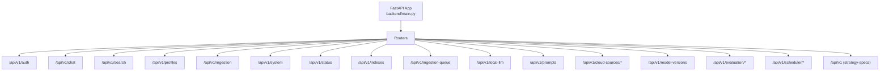
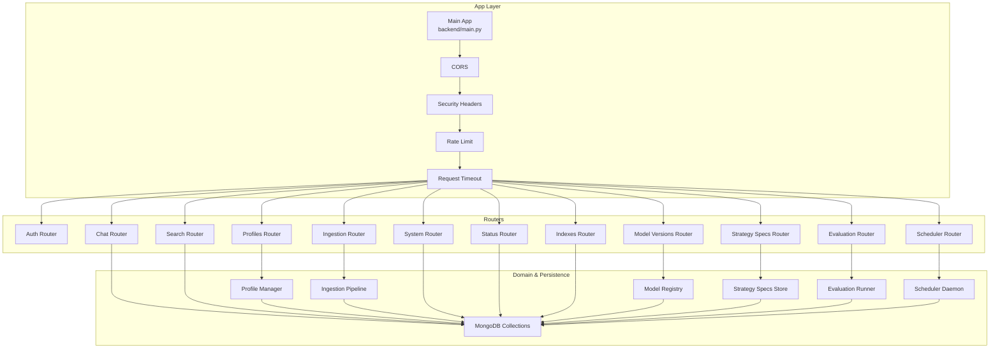
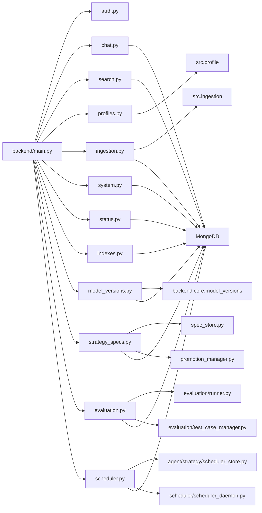
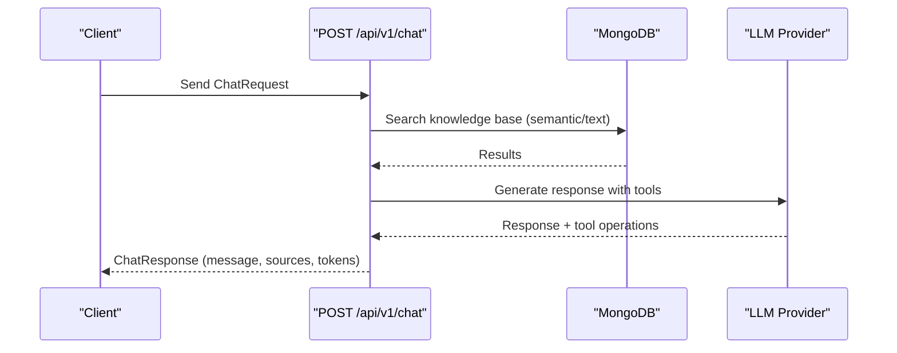
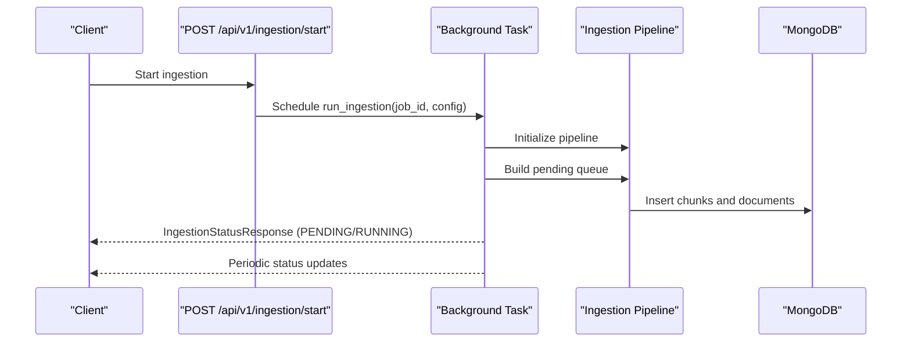
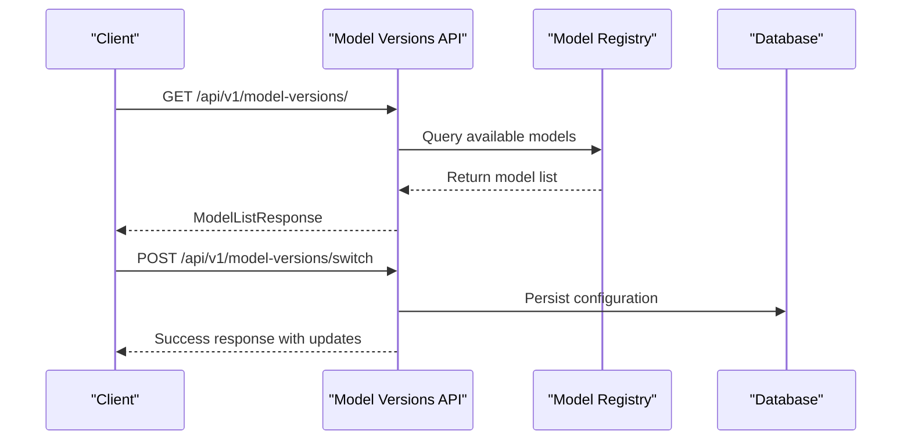
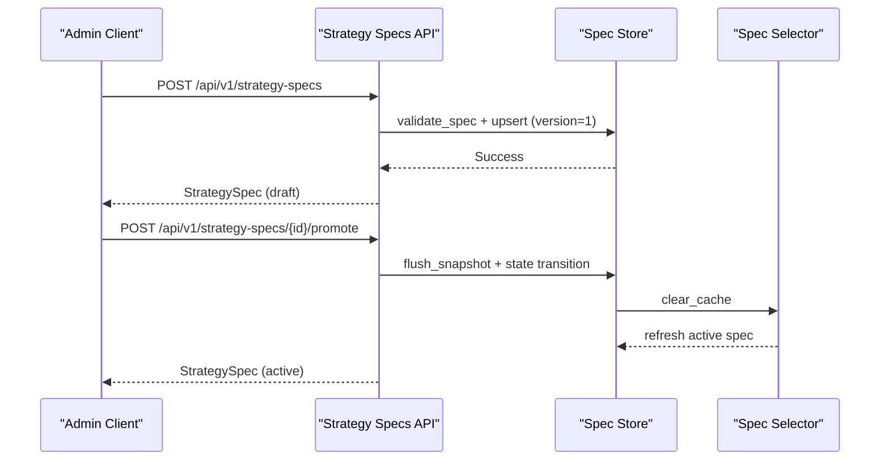
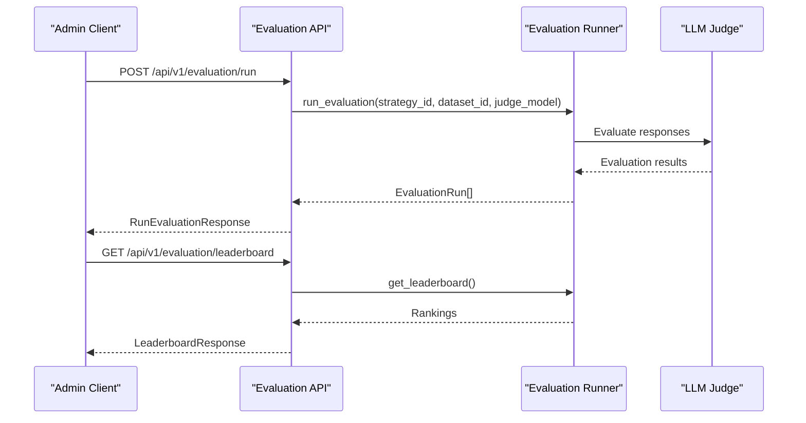
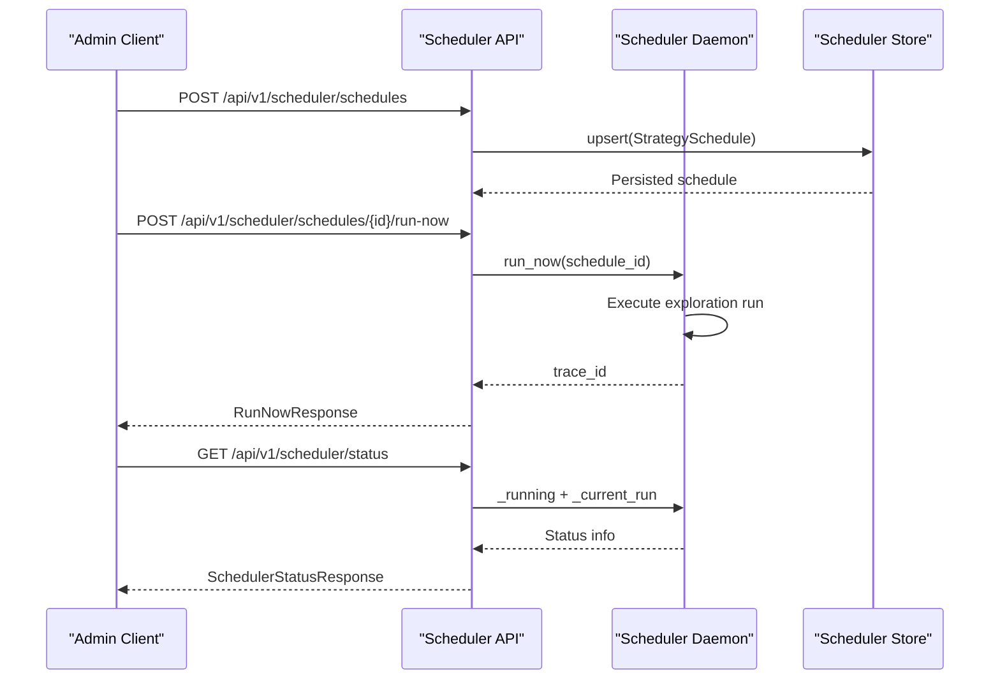

# API Reference

<cite>
**Referenced Files in This Document**
- [backend/main.py](file://backend/main.py)
- [backend/routers/auth.py](file://backend/routers/auth.py)
- [backend/routers/chat.py](file://backend/routers/chat.py)
- [backend/routers/search.py](file://backend/routers/search.py)
- [backend/routers/profiles.py](file://backend/routers/profiles.py)
- [backend/routers/ingestion.py](file://backend/routers/ingestion.py)
- [backend/routers/system.py](file://backend/routers/system.py)
- [backend/routers/status.py](file://backend/routers/status.py)
- [backend/routers/indexes.py](file://backend/routers/indexes.py)
- [backend/routers/model_versions.py](file://backend/routers/model_versions.py)
- [backend/routers/admin.py](file://backend/routers/admin.py)
- [backend/routers/backup.py](file://backend/routers/backup.py)
- [backend/routers/embedding_benchmark.py](file://backend/routers/embedding_benchmark.py)
- [backend/routers/strategies.py](file://backend/routers/strategies.py)
- [backend/routers/strategy_specs.py](file://backend/routers/strategy_specs.py)
- [backend/routers/evaluation.py](file://backend/routers/evaluation.py)
- [backend/routers/scheduler.py](file://backend/routers/scheduler.py)
- [backend/core/model_versions.py](file://backend/core/model_versions.py)
- [backend/models/backup_schemas.py](file://backend/models/backup_schemas.py)
- [frontend/src/pages/SystemPage.tsx](file://frontend/src/pages/SystemPage.tsx)
- [frontend/src/pages/BackupManagementPage.tsx](file://frontend/src/pages/BackupManagementPage.tsx)
</cite>

## Update Summary
**Changes Made**
- Added new Strategy OS API section documenting strategy specifications, evaluation, and scheduler endpoints
- Updated Project Structure diagram to include new routers for strategy_specs, evaluation, and scheduler
- Enhanced Frontend Integration section with new Strategy Management interfaces
- Added comprehensive error handling and security considerations for new Strategy OS endpoints

## Table of Contents
1. [Introduction](#introduction)
2. [Project Structure](#project-structure)
3. [Core Components](#core-components)
4. [Architecture Overview](#architecture-overview)
5. [Detailed Component Analysis](#detailed-component-analysis)
6. [Dependency Analysis](#dependency-analysis)
7. [Performance Considerations](#performance-considerations)
8. [Troubleshooting Guide](#troubleshooting-guide)
9. [Conclusion](#conclusion)
10. [Appendices](#appendices)

## Introduction
This document provides comprehensive API documentation for the RecallHub backend. It covers authentication, chat and search, ingestion management, system configuration, model version management, admin panel operations, backup management, embedding benchmarking, strategy management with A/B testing, and the new Strategy OS APIs including strategy specifications, evaluation system, and scheduler management. For each endpoint, you will find HTTP methods, URL patterns, request/response schemas, authentication requirements, error handling strategies, status codes, and practical usage examples. It also documents rate limiting, security considerations, and API versioning.

## Project Structure
The backend is a FastAPI application that mounts multiple routers under a common base path. The main application initializes middleware, exception handlers, and includes routers for:
- Authentication
- Chat and sessions
- Search
- Profiles
- Ingestion and queue
- System health and configuration
- Status dashboards
- Indexes and performance
- Local LLM and prompts
- Cloud sources (connections, OAuth, sync, providers, cache)
- Model Versions
- **New**: Strategy Specifications (CRUD with optimistic locking)
- **New**: Evaluation System (strategy testing and comparison)
- **New**: Scheduler (overnight exploration management)

**Diagram sources**
- [backend/main.py:911-930](file://backend/main.py#L911-L930)
- [backend/main.py:759-930](file://backend/main.py#L759-L930)

**Section sources**
- [backend/main.py:28-37](file://backend/main.py#L28-L37)
- [backend/main.py:759-930](file://backend/main.py#L759-L930)

## Core Components
- Authentication: JWT bearer and API key support, user registration/login/logout/me, admin user management, and profile access controls.
- Chat: Conversational AI with RAG, tool-calling (knowledge base search, web search, browsing), and conversation lifecycle.
- Search: Semantic, text, and hybrid search endpoints with unified routing and response schemas.
- Profiles: Multi-profile management, switching, and cloud source associations.
- Ingestion: Document ingestion orchestration, status tracking, logs, and batch operations.
- System: Health checks, stats, configuration, index management, and model listings.
- Status/Index Dashboards: System metrics, profile KPIs, and index performance insights.
- Model Versions: Comprehensive model registry, version management, compatibility checking, and configuration switching.
- **New**: Strategy Specifications: Full CRUD operations for strategy definitions with optimistic concurrency control and version management.
- **New**: Evaluation System: Automated strategy testing, comparison, and performance benchmarking with test case management.
- **New**: Scheduler: Overnight exploration scheduling, run management, and execution control.

**Section sources**
- [backend/routers/auth.py:192-285](file://backend/routers/auth.py#L192-L285)
- [backend/routers/chat.py:634-734](file://backend/routers/chat.py#L634-L734)
- [backend/routers/search.py:34-347](file://backend/routers/search.py#L34-L347)
- [backend/routers/profiles.py:27-359](file://backend/routers/profiles.py#L27-L359)
- [backend/routers/ingestion.py:656-800](file://backend/routers/ingestion.py#L656-L800)
- [backend/routers/system.py:88-145](file://backend/routers/system.py#L88-L145)
- [backend/routers/status.py:74-132](file://backend/routers/status.py#L74-L132)
- [backend/routers/indexes.py:78-108](file://backend/routers/indexes.py#L78-L108)
- [backend/routers/model_versions.py:1-459](file://backend/routers/model_versions.py#L1-L459)
- [backend/routers/strategy_specs.py:248-422](file://backend/routers/strategy_specs.py#L248-L422)
- [backend/routers/evaluation.py:91-204](file://backend/routers/evaluation.py#L91-L204)
- [backend/routers/scheduler.py:151-335](file://backend/routers/scheduler.py#L151-L335)

## Architecture Overview
The API follows a layered architecture:
- Application layer: FastAPI app with middleware and exception handlers.
- Router layer: Feature-based routers exposing REST endpoints.
- Domain layer: Business logic for chat, search, ingestion, system operations, model management, admin operations, backup management, embedding benchmarking, strategy management, strategy specifications, evaluation system, and scheduler management.
- Persistence layer: MongoDB collections for users, API keys, ingestion jobs, system config, model configurations, backups, benchmark results, strategy metrics, evaluation runs, and scheduler schedules.

**Diagram sources**
- [backend/main.py:227-255](file://backend/main.py#L227-L255)
- [backend/main.py:759-930](file://backend/main.py#L759-L930)
- [backend/routers/strategy_specs.py:137-182](file://backend/routers/strategy_specs.py#L137-L182)
- [backend/routers/evaluation.py:17-20](file://backend/routers/evaluation.py#L17-L20)
- [backend/routers/scheduler.py:111-144](file://backend/routers/scheduler.py#L111-L144)

## Detailed Component Analysis

### Authentication Endpoints
- Base Path: /api/v1/auth
- Authentication Methods:
  - Bearer JWT via Authorization header
  - API Key via X-API-Key header
- Admin-protected endpoints require admin privileges.

Endpoints:
- POST /api/v1/auth/register
  - Request: RegisterRequest
  - Response: TokenResponse
  - Notes: Registration mode controlled by environment; invite code required in invite mode.
- POST /api/v1/auth/login
  - Request: LoginRequest
  - Response: TokenResponse
- GET /api/v1/auth/me
  - Response: UserResponse
- PUT /api/v1/auth/me
  - Query: name (optional)
  - Response: SuccessResponse
- PUT /api/v1/auth/me/password
  - Request: PasswordChangeRequest
  - Response: SuccessResponse
- POST /api/v1/auth/logout
  - Response: SuccessResponse

Admin Endpoints (require admin):
- GET /api/v1/auth/users
  - Response: list of UserListResponse
- GET /api/v1/auth/access-matrix
  - Response: ProfileAccessMatrix
- POST /api/v1/auth/access
  - Request: SetAccessRequest
  - Response: SuccessResponse
- POST /api/v1/auth/users/create
  - Request: AdminCreateUserRequest
  - Response: UserListResponse
- PUT /api/v1/auth/users/{user_id}
  - Request: AdminUpdateUserRequest
  - Response: UserListResponse

Common Schemas:
- TokenResponse: access_token, token_type, expires_in, user
- UserResponse/UserListResponse: id, email, name, is_active, is_admin, timestamps
- RegisterRequest/LoginRequest/PasswordChangeRequest: typed fields with validation
- API Key Models: APIKey, APIKeyCreate, APIKeyResponse, APIKeyCreatedResponse

Authentication Behavior:
- Supports dual auth: JWT bearer or API key.
- API key validation includes expiry checks and last-used updates.
- Admin endpoints enforce admin status.

Example Requests:
- Login:
  - Method: POST
  - URL: /api/v1/auth/login
  - Headers: Authorization: Bearer <JWT> or X-API-Key: <API_KEY>
  - Body: { "email": "...", "password": "..." }
- Register:
  - Method: POST
  - URL: /api/v1/auth/register
  - Body: { "email": "...", "name": "...", "password": "...", "invite_code": "..." }

Error Handling:
- 400 Bad Request for invalid input or conflicting data.
- 401 Unauthorized for invalid credentials or missing auth.
- 403 Forbidden for insufficient permissions.
- 404 Not Found for missing resources.
- 409 Conflict for concurrent operations (e.g., running ingestion job).

**Section sources**
- [backend/routers/auth.py:289-422](file://backend/routers/auth.py#L289-L422)
- [backend/routers/auth.py:517-800](file://backend/routers/auth.py#L517-L800)

### Strategy Specifications API Endpoints
- Base Path: /api/v1 (strategy-specs router)
- **All endpoints require admin privileges** and are protected by the `require_admin` dependency.

#### Strategy Specification CRUD Operations
- POST /api/v1/strategy-specs
  - Request: StrategySpec (JSON payload)
  - Response: StrategySpec
  - Description: Create a new strategy specification with optimistic locking.
  - Notes: Validates spec using validate_spec function; raises 409 if spec already exists.
- GET /api/v1/strategy-specs
  - Query: status, capability_id, tenant_id, limit
  - Response: SpecListResponse
  - Description: List latest versions of all strategy specifications with optional filters.
- GET /api/v1/strategy-specs/{spec_id}
  - Query: version (optional semantic version)
  - Response: StrategySpec with metadata
  - Description: Retrieve a specific strategy specification by ID and optional version.
- PUT /api/v1/strategy-specs/{spec_id}
  - Request: StrategySpec (JSON payload)
  - Header: X-Expected-Version (optimistic locking)
  - Response: StrategySpec
  - Description: Update an existing strategy specification with version conflict detection.
- DELETE /api/v1/strategy-specs/{spec_id}
  - Response: SpecDeleteResponse
  - Description: Soft-delete a strategy specification by marking latest version as archived.

#### Version History and Validation
- POST /api/v1/strategy-specs/{spec_id}/validate
  - Response: SpecValidationResponse
  - Description: Validate a stored strategy specification using validate_spec function.
- GET /api/v1/strategy-specs/{spec_id}/history
  - Response: SpecHistoryResponse
  - Description: Retrieve complete version history for a strategy specification.

#### Lifecycle Management (Promotion/Deprecation/Archive/Rollback)
- POST /api/v1/strategy-specs/{spec_id}/versions/{version}/promote
  - Request: PromotionRequest (actor, reason)
  - Response: StrategySpec
  - Description: Promote a draft specification to active status.
- POST /api/v1/strategy-specs/{spec_id}/versions/{version}/deprecate
  - Request: PromotionRequest (actor, reason)
  - Response: StrategySpec
  - Description: Deprecate an active specification.
- POST /api/v1/strategy-specs/{spec_id}/versions/{version}/archive
  - Request: PromotionRequest (actor, reason)
  - Response: StrategySpec
  - Description: Archive a deprecated specification.
- POST /api/v1/strategy-specs/{spec_id}/rollback
  - Request: RollbackRequest (target_version, actor, reason)
  - Response: StrategySpec
  - Description: Rollback active specification to a previous version.

Strategy Specification Management Features:
- **Optimistic Concurrency Control**: Uses X-Expected-Version header for conflict detection
- **Version Tracking**: Maintains complete version history with spec_hash verification
- **Lifecycle States**: draft → active → deprecated → archived
- **Validation**: Built-in spec validation using validate_spec function
- **Cache Invalidation**: Automatic cache clearing for spec selector on state changes

Common Schemas:
- StrategySpec: Complete strategy definition with metadata (strategy_id, version, status, config, etc.)
- SpecValidationResponse: { valid: boolean, errors: string[] }
- SpecVersionInfo: { version, version_counter, status, created_at, spec_hash }
- SpecHistoryResponse: { spec_id, versions: SpecVersionInfo[] }
- SpecListResponse: { specs: array, total: number }
- SpecDeleteResponse: { spec_id, status, message }
- PromotionRequest: { actor: string, reason: string }
- RollbackRequest: { target_version: string, actor: string, reason: string }

Example Requests:
- Create Strategy Spec:
  - Method: POST
  - URL: /api/v1/strategy-specs
  - Headers: Authorization: Bearer <ADMIN_JWT>
  - Body: {
    "strategy_id": "enhanced-strategy-v1",
    "version": "1.0.0",
    "status": "draft",
    "capability_id": "legal_research",
    "config": { /* strategy configuration */ },
    "promotable": true
  }
- Update Strategy Spec:
  - Method: PUT
  - URL: /api/v1/strategy-specs/enhanced-strategy-v1
  - Headers: Authorization: Bearer <ADMIN_JWT>, X-Expected-Version: 1
  - Body: { /* updated spec */ }

Error Handling:
- 400 Bad Request for invalid spec payloads or validation failures
- 401 Unauthorized for invalid or missing admin credentials
- 404 Not Found for non-existent specs or versions
- 409 Conflict for version conflicts or invalid state transitions
- 500 Internal Server Error for persistence failures

**Section sources**
- [backend/routers/strategy_specs.py:248-422](file://backend/routers/strategy_specs.py#L248-L422)
- [backend/routers/strategy_specs.py:424-466](file://backend/routers/strategy_specs.py#L424-L466)
- [backend/routers/strategy_specs.py:527-641](file://backend/routers/strategy_specs.py#L527-L641)

### Evaluation System API Endpoints
- Base Path: /api/v1/evaluation
- **All endpoints require admin privileges** and are protected by the `require_admin` dependency.

#### Evaluation Execution
- POST /api/v1/evaluation/run
  - Request: RunEvaluationRequest (strategy_id, dataset_id, judge_model)
  - Response: RunEvaluationResponse
  - Description: Execute evaluation run for a strategy against specified dataset.
- POST /api/v1/evaluation/compare
  - Request: CompareRequest (strategy_ids[], dataset_id)
  - Response: CompareResponse
  - Description: Compare multiple strategies against the same dataset.

#### Leaderboard and Results
- GET /api/v1/evaluation/leaderboard
  - Query: dataset_id (default: "default"), limit (default: 10)
  - Response: LeaderboardResponse
  - Description: Get strategy rankings by average composite score.
- GET /api/v1/evaluation/results/{strategy_id}
  - Response: StrategyResultsResponse
  - Description: Retrieve historical evaluation results for a specific strategy.

#### Test Case Management
- POST /api/v1/evaluation/test-cases
  - Request: CreateTestCaseRequest (user_prompt, expected_source_ids, expected_topics, scoring_profile, dataset_id, tags, notes)
  - Response: EvaluationTestCase
  - Description: Create a new evaluation test case.
- GET /api/v1/evaluation/test-cases
  - Query: dataset_id (default: "default"), include_deprecated (default: false)
  - Response: TestCaseListResponse
  - Description: List test cases in a dataset.
- DELETE /api/v1/evaluation/test-cases/{test_case_id}
  - Response: { status: "deprecated" }
  - Description: Deprecate (soft-delete) a test case.

Evaluation System Capabilities:
- **Automated Testing**: Run evaluations against configurable datasets
- **Multi-Strategy Comparison**: Statistical comparison of strategy performance
- **Leaderboard Generation**: Ranking system based on composite scores
- **Test Case Management**: Creation, listing, and deprecation of evaluation test cases
- **Scoring Profiles**: Configurable scoring criteria for different evaluation types

Common Schemas:
- RunEvaluationRequest: { strategy_id, dataset_id: "default", judge_model: string|null }
- RunEvaluationResponse: { run_count: number, results: EvaluationRun[] }
- CompareRequest: { strategy_ids: string[], dataset_id: "default" }
- CompareResponse: { comparison: { [strategy_id: string]: EvaluationRun[] } }
- LeaderboardResponse: { rankings: array }
- StrategyResultsResponse: { strategy_id: string, results: EvaluationRun[] }
- CreateTestCaseRequest: { user_prompt, expected_source_ids, expected_topics, scoring_profile, dataset_id, tags, notes }
- TestCaseListResponse: { test_cases: EvaluationTestCase[] }

Example Requests:
- Run Evaluation:
  - Method: POST
  - URL: /api/v1/evaluation/run
  - Headers: Authorization: Bearer <ADMIN_JWT>
  - Body: {
    "strategy_id": "enhanced-strategy-v1",
    "dataset_id": "legal_case_reviews",
    "judge_model": "gpt-4-turbo"
  }

Error Handling:
- 400 Bad Request for invalid strategy IDs or empty strategy lists
- 404 Not Found for non-existent test cases
- 500 Internal Server Error for evaluation execution failures

**Section sources**
- [backend/routers/evaluation.py:91-204](file://backend/routers/evaluation.py#L91-L204)

### Scheduler API Endpoints
- Base Path: /api/v1/scheduler
- **All endpoints require admin privileges** and are protected by the `require_admin` dependency.

#### Schedule Management
- GET /api/v1/scheduler/schedules
  - Response: ScheduleListResponse
  - Description: List all configured schedules.
- POST /api/v1/scheduler/schedules
  - Request: CreateScheduleRequest (name, cron, timezone, allowed_window_start, allowed_window_end, dataset_id, candidate_strategy_ids[], status)
  - Response: StrategySchedule
  - Description: Create or update a schedule definition.
- GET /api/v1/scheduler/schedules/{schedule_id}
  - Response: StrategySchedule
  - Description: Get details of a specific schedule.
- DELETE /api/v1/scheduler/schedules/{schedule_id}
  - Response: { status: "disabled" }
  - Description: Disable a schedule (soft-delete by setting status to "disabled").

#### Immediate Execution and Control
- POST /api/v1/scheduler/schedules/{schedule_id}/run-now
  - Response: RunNowResponse (trace_id, schedule_id)
  - Description: Trigger immediate exploration run for a schedule (returns 202 Accepted).
- POST /api/v1/scheduler/pause
  - Response: { status: "paused" }
  - Description: Manually pause the scheduler daemon.
- POST /api/v1/scheduler/resume
  - Response: { status: "resumed" }
  - Description: Resume scheduler from manual pause.

#### Scheduler Status and Reports
- GET /api/v1/scheduler/status
  - Response: SchedulerStatusResponse
  - Description: Get current scheduler daemon run status.
- GET /api/v1/scheduler/reports
  - Query: limit (default: 10)
  - Response: ReportsResponse
  - Description: Get recent nightly reports.

Scheduler Management Features:
- **Persistence**: Mongo-backed schedule storage with restart-safe state
- **Immediate Execution**: Run-now endpoint for manual triggering
- **Pause/Resume Control**: Manual control over scheduler execution
- **Status Monitoring**: Real-time scheduler daemon status
- **Report Generation**: Nightly exploration reports with regression tracking

Common Schemas:
- ScheduleListResponse: { schedules: StrategySchedule[] }
- CreateScheduleRequest: { name, cron, timezone, allowed_window_start, allowed_window_end, dataset_id, candidate_strategy_ids[], status }
- SchedulerStatusResponse: { running: boolean, current_run: SchedulerRunState|null }
- ReportsResponse: { reports: NightlyReport[] }
- RunNowResponse: { trace_id: string, schedule_id: string }

Example Requests:
- Create Schedule:
  - Method: POST
  - URL: /api/v1/scheduler/schedules
  - Headers: Authorization: Bearer <ADMIN_JWT>
  - Body: {
    "name": "Weekly Legal Strategy Evaluation",
    "cron": "0 22 * * 1-5",
    "timezone": "America/New_York",
    "allowed_window_start": "22:00",
    "allowed_window_end": "06:00",
    "dataset_id": "legal_case_reviews",
    "candidate_strategy_ids": ["enhanced-strategy-v1", "legacy-strategy-v2"],
    "status": "active"
  }

Error Handling:
- 404 Not Found for non-existent schedules
- 409 Conflict for paused schedules or circuit breaker open states
- 500 Internal Server Error for scheduler daemon failures
- 503 Service Unavailable for circuit breaker open states

**Section sources**
- [backend/routers/scheduler.py:151-335](file://backend/routers/scheduler.py#L151-L335)

### Strategy Management API Endpoints
- Base Path: /api/v1/strategies

#### Strategy Discovery and Information
- GET /api/v1/strategies
  - Query: domain (optional filter: general, software_dev, legal, hr)
  - Response: List of StrategyInfo
  - Description: Lists all available strategies with basic information.
- GET /api/v1/strategies/default
  - Response: StrategyInfo
  - Description: Returns the default strategy for the system.
- GET /api/v1/strategies/{strategy_id}
  - Response: StrategyDetail
  - Description: Returns detailed information about a specific strategy including configuration and prompt previews.

#### Performance Metrics and Analytics
- GET /api/v1/strategies/{strategy_id}/metrics
  - Query: hours (time window), domain (filter)
  - Response: StrategyStats
  - Description: Returns performance metrics for a specific strategy.
- GET /api/v1/strategies/metrics/all
  - Query: hours (time window), domain (filter)
  - Response: List of StrategyStats
  - Description: Returns metrics for all strategies, sorted by quality score.

#### Strategy Comparison and A/B Testing
- POST /api/v1/strategies/compare
  - Request: CompareRequest (strategy_a, strategy_b, hours, domain)
  - Response: StrategyComparison
  - Description: Compares two strategies' performance statistically.
- POST /api/v1/strategies/auto-detect
  - Request: AutoDetectRequest (query)
  - Response: StrategyInfo
  - Description: Auto-detects the best strategy for a given query.
- GET /api/v1/strategies/for-domain/{domain}
  - Response: StrategyInfo
  - Description: Returns the recommended strategy for a specific domain.

#### User Feedback and LLM Evaluation
- POST /api/v1/strategies/feedback
  - Request: FeedbackRequest (strategy_id, session_id, score 1-5, text)
  - Response: Success message
  - Description: Records user feedback for strategy execution.
- POST /api/v1/strategies/ab-compare-responses
  - Request: ABCompareResponsesRequest (query, response_a, response_b, strategy_a, strategy_b, latency_a_ms, latency_b_ms)
  - Response: ABCompareResponsesResult
  - Description: Uses LLM to compare two strategy responses and score them on multiple quality metrics.

Strategy Information and Metadata:
- **StrategyInfo**: Basic strategy information including ID, name, version, description, domains, tags, and flags
- **StrategyDetail**: Extended information including configuration parameters and prompt previews
- **StrategyStats**: Performance statistics including execution counts, latency metrics, quality scores, and user feedback
- **StrategyComparison**: Statistical comparison results with winner determination and confidence levels

LLM-Based Response Evaluation:
- **ResponseScore**: Individual response scoring across multiple dimensions (quality, hallucination, readability, factuality, relevance)
- **ABCompareResponsesResult**: Comprehensive evaluation results including detailed analysis and recommendations

Common Schemas:
- StrategyInfo: id, name, version, description, domains, tags, is_default, is_legacy, author
- StrategyDetail: StrategyInfo + config, prompts_preview
- StrategyStats: execution_count, avg_latency_ms, median_latency_ms, avg_iterations, avg_confidence, quality_score, quality_distribution, avg_user_feedback, feedback_count
- StrategyComparison: strategy_a, strategy_b, filters, comparison, winner, confidence_in_winner
- CompareRequest: strategy_a, strategy_b, hours, domain
- FeedbackRequest: strategy_id, session_id, score (1-5), text
- ABCompareResponsesRequest: query, response_a, response_b, strategy_a, strategy_b, latency_a_ms, latency_b_ms
- ResponseScore: quality, hallucination, readability, factuality, relevance, overall

Example Requests:
- Get Strategy Details:
  - Method: GET
  - URL: /api/v1/strategies/enhanced-strategy-1.0
  - Response: StrategyDetail with configuration and prompt previews
- Compare Strategies:
  - Method: POST
  - URL: /api/v1/strategies/compare
  - Body: {
    "strategy_a": "enhanced-strategy-1.0",
    "strategy_b": "legacy-strategy-2.1",
    "hours": 24,
    "domain": "software_dev"
  }

Error Handling:
- 400 Bad Request for invalid strategy IDs, empty queries, or invalid feedback scores.
- 404 Not Found for non-existent strategies.
- 500 Internal Server Error for strategy evaluation failures.

**Section sources**
- [backend/routers/strategies.py:76-111](file://backend/routers/strategies.py#L76-L111)
- [backend/routers/strategies.py:114-143](file://backend/routers/strategies.py#L114-L143)
- [backend/routers/strategies.py:146-207](file://backend/routers/strategies.py#L146-L207)
- [backend/routers/strategies.py:210-260](file://backend/routers/strategies.py#L210-L260)
- [backend/routers/strategies.py:271-324](file://backend/routers/strategies.py#L271-L324)
- [backend/routers/strategies.py:327-355](file://backend/routers/strategies.py#L327-L355)
- [backend/routers/strategies.py:363-386](file://backend/routers/strategies.py#L363-L386)
- [backend/routers/strategies.py:389-422](file://backend/routers/strategies.py#L389-L422)
- [backend/routers/strategies.py:433-454](file://backend/routers/strategies.py#L433-L454)
- [backend/routers/strategies.py:542-658](file://backend/routers/strategies.py#L542-L658)

### Chat and Search Endpoints
- Base Path: /api/v1/chat, /api/v1/search

Chat Endpoints:
- POST /api/v1/chat
  - Request: ChatRequest
  - Response: ChatResponse
  - Behavior: RAG-powered chat with tool-calling (knowledge base search, web search, browsing).
  - Includes optional sources and processing metrics.
- GET /api/v1/chat/conversations/{conversation_id}
  - Response: Conversation messages
- DELETE /api/v1/chat/conversations/{conversation_id}
  - Response: SuccessResponse
- GET /api/v1/chat/conversations
  - Response: List of active conversations

Search Endpoints:
- POST /api/v1/search/semantic
  - Request: SearchRequest
  - Response: SearchResponse
- POST /api/v1/search/text
  - Request: SearchRequest
  - Response: SearchResponse
- POST /api/v1/search/hybrid
  - Request: SearchRequest
  - Response: SearchResponse
- POST /api/v1/search
  - Request: SearchRequest
  - Response: SearchResponse
- Behavior: Routes to semantic/text/hybrid based on search_type.

Common Schemas:
- SearchRequest/SearchResponse/SearchResultItem: query, search_type, results, total_results, processing_time_ms
- ChatRequest/ChatResponse: message, conversation_id, sources, search_performed, model, tokens_used, processing_time_ms

Streaming:
- Chat streaming is supported via SSE; timeout middleware excludes streaming endpoints from strict timeouts.

Example Requests:
- Chat:
  - Method: POST
  - URL: /api/v1/chat
  - Headers: Authorization: Bearer <JWT>
  - Body: { "message": "What is the policy?", "conversation_id": "uuid", "include_sources": true }
- Semantic Search:
  - Method: POST
  - URL: /api/v1/search/semantic
  - Headers: Authorization: Bearer <JWT>
  - Body: { "query": "company benefits", "match_count": 10, "search_type": "semantic" }

Error Handling:
- 500 Internal Server Error for search failures or unexpected errors.
- Validation errors return 422 with structured messages.

**Section sources**
- [backend/routers/chat.py:634-734](file://backend/routers/chat.py#L634-L734)
- [backend/routers/search.py:34-347](file://backend/routers/search.py#L34-L347)

### Ingestion Management Endpoints
- Base Path: /api/v1/ingestion

Endpoints:
- POST /api/v1/ingestion/start
  - Request: IngestionStartRequest
  - Response: IngestionStatusResponse
  - Behavior: Starts background ingestion job; enforces single running job.
- GET /api/v1/ingestion/status
  - Response: IngestionStatusResponse
  - Behavior: Real-time status using in-memory state when running; falls back to DB otherwise.
- GET /api/v1/ingestion/status/{job_id}
  - Response: IngestionStatusResponse
- POST /api/v1/ingestion/cancel/{job_id}
  - Response: SuccessResponse
- GET /api/v1/ingestion/logs
  - Response: Stream logs (SSE-like behavior via streaming)
- POST /api/v1/ingestion/pause
  - Response: SuccessResponse
- POST /api/v1/ingestion/resume
  - Response: SuccessResponse

Ingestion Jobs Persistence:
- Stored in collection "ingestion_jobs".
- Supports resuming interrupted jobs on startup.

Background Tasks:
- run_ingestion: Orchestrates pipeline, builds pending queue, tracks progress, and updates DB.
- Graceful shutdown marks running jobs as interrupted.

Example Requests:
- Start Ingestion:
  - Method: POST
  - URL: /api/v1/ingestion/start
  - Headers: Authorization: Bearer <JWT>
  - Body: { "documents_folder": "...", "chunk_size": 1000, "chunk_overlap": 200, "incremental": true }

Error Handling:
- 409 Conflict if a job is already running.
- 404 Not Found for missing job_id.
- 500 Internal Server Error for failures during ingestion.

**Section sources**
- [backend/routers/ingestion.py:656-800](file://backend/routers/ingestion.py#L656-L800)
- [backend/routers/ingestion.py:411-654](file://backend/routers/ingestion.py#L411-L654)

### System Configuration Endpoints
- Base Path: /api/v1/system

Endpoints:
- GET /api/v1/system/health
  - Response: HealthResponse
- GET /api/v1/system/stats
  - Response: SystemStatsResponse
- GET /api/v1/system/config
  - Response: ConfigResponse
- GET /api/v1/system/indexes
  - Response: Index status and optional stats
- POST /api/v1/system/indexes/create
  - Response: Creation results
- GET /api/v1/system/info
  - Response: API info and endpoint map
- POST /api/v1/system/reload-settings
  - Response: Settings reload result
- GET /api/v1/system/database-stats
  - Response: Database statistics
- GET /api/v1/system/models/llm
  - Response: LLM models list (cached)
- GET /api/v1/system/models/embedding
  - Response: Embedding models list (cached)
- GET /api/v1/system/config/options
  - Response: Current config and available options
- POST /api/v1/system/config/update
  - Request: ConfigUpdateRequest
  - Response: Update result
- POST /api/v1/system/config/save
  - Request: ConfigUpdateRequest
  - Response: Save result

Notes:
- Runtime config updates are temporary; use /config/save to persist across restarts.
- Index creation drops existing indexes before recreating.

**Section sources**
- [backend/routers/system.py:88-145](file://backend/routers/system.py#L88-L145)
- [backend/routers/system.py:174-358](file://backend/routers/system.py#L174-L358)
- [backend/routers/system.py:386-800](file://backend/routers/system.py#L386-L800)

### Model Versions Management Endpoints
- Base Path: /api/v1/model-versions

Model Versions API provides comprehensive model management capabilities including discovery, compatibility checking, configuration switching, and recommendations.

Endpoints:
- GET /api/v1/model-versions/
  - Query Parameters:
    - provider: Filter by provider (OpenAI, Google, Anthropic)
    - capability: Filter by capability (text_generation, multimodal, reasoning, etc.)
    - model_type: Filter by model type (chat, completion, embedding, vision, audio)
    - show_deprecated: Include deprecated models (default: false)
    - show_experimental: Include experimental models (default: true)
    - sort_by: Sort by release_date, cost, or name (default: release_date)
    - limit: Maximum number of models to return (default: 50)
  - Response: ModelListResponse with filtered models
- GET /api/v1/model-versions/latest
  - Query Parameters:
    - limit: Number of latest models to return (default: 10)
  - Response: ModelListResponse with latest models
- GET /api/v1/model-versions/cost-effective
  - Query Parameters:
    - limit: Number of cost-effective models to return (default: 10)
  - Response: ModelListResponse with cost-effective models
- GET /api/v1/model-versions/{model_id}
  - Path Parameter: model_id (e.g., gpt-5.2, gemini-2.0-flash-exp, claude-3-5-sonnet-latest)
  - Response: ModelVersionResponse with detailed model information
- POST /api/v1/model-versions/switch
  - Request: ModelSwitchRequest
  - Response: Success dictionary with updates and warnings
  - Description: Switch to different model versions for orchestrator, worker, and embedding
- POST /api/v1/model-versions/check-compatibility
  - Request: ModelCompatibilityCheck
  - Response: CompatibilityResult
  - Description: Check if a model is compatible with specific parameters
- GET /api/v1/model-versions/recommendations
  - Query Parameters:
    - task_type: Task type: general, reasoning, coding, multimodal (default: general)
    - budget_limit: Maximum cost per 1k tokens
    - context_required: Minimum context window required
    - capabilities_required: Required capabilities (comma-separated)
  - Response: List of ModelRecommendation with scoring and reasons
- GET /api/v1/model-versions/current
  - Response: Dictionary with currently configured models (orchestrator, worker, embedding)

Model Schema Definitions:
- ModelVersionResponse: Complete model information including id, name, provider, type, version, release_date, context_window, max_output_tokens, capabilities, pricing, deprecation status, parameter_mapping, and default_parameters
- ModelListResponse: Contains models array, total count, and filter information
- ModelSwitchRequest: Request to switch model versions with optional orchestrator_model, orchestrator_provider, worker_model, worker_provider, embedding_model, embedding_provider
- CompatibilityResult: Result of compatibility check with model_id, is_compatible flag, incompatible_parameters list, suggested_mappings, and warnings
- ModelRecommendation: Recommendation with model details, score, reasons, and estimated cost

Model Registry:
The system maintains a comprehensive registry of models from major providers:
- OpenAI: GPT-5 series (5.2, 5.1, 5), GPT-4o series, O1 series, legacy GPT-4 models, GPT-3.5, and embedding models
- Google: Gemini 2.0 Flash Experimental, Gemini 1.5 series, legacy Gemini Pro, and embedding models
- Anthropic: Claude 3.5 Sonnet (latest), Claude 3 Opus, Claude 3 Haiku, legacy Claude 2.1

Capabilities include text_generation, multimodal, audio_input, audio_output, reasoning, code_generation, and function_calling.

Example Requests:
- List Models:
  - Method: GET
  - URL: /api/v1/model-versions/?provider=openai&sort_by=cost&limit=20
  - Response: ModelListResponse with OpenAI models sorted by cost
- Switch Models:
  - Method: POST
  - URL: /api/v1/model-versions/switch
  - Headers: Authorization: Bearer <JWT>
  - Body: { "orchestrator_model": "gpt-5.2", "worker_model": "gpt-4o-mini", "embedding_model": "text-embedding-3-small" }
  - Response: { "success": true, "message": "Model versions updated successfully", "updates": {...}, "warnings": [...] }

Error Handling:
- 400 Bad Request for invalid model IDs, capabilities, or model types
- 404 Not Found for non-existent model IDs
- 500 Internal Server Error for database persistence failures

**Section sources**
- [backend/routers/model_versions.py:1-459](file://backend/routers/model_versions.py#L1-L459)
- [backend/core/model_versions.py:1-536](file://backend/core/model_versions.py#L1-L536)

### Profiles and Cloud Sources Endpoints
- Base Path: /api/v1/profiles

Endpoints:
- GET /api/v1/profiles
  - Response: ProfileListResponse (accessible profiles and active profile)
- GET /api/v1/profiles/active
  - Response: Active profile details
- POST /api/v1/profiles/switch
  - Request: ProfileSwitchRequest
  - Response: SuccessResponse
- POST /api/v1/profiles/create
  - Request: ProfileCreateRequest
  - Response: SuccessResponse
- DELETE /api/v1/profiles/{profile_key}
  - Response: SuccessResponse
- PUT /api/v1/profiles/{profile_key}
  - Request: ProfileUpdateRequest
  - Response: SuccessResponse
- GET /api/v1/profiles/{profile_key}
  - Response: Profile details and active flag

Cloud Sources:
- GET /api/v1/profiles/{profile_key}/cloud-sources
  - Response: CloudSourceListResponse
- POST /api/v1/profiles/{profile_key}/cloud-sources
  - Request: CloudSourceCreateRequest
  - Response: CloudSourceAssociation
- PUT /api/v1/profiles/{profile_key}/cloud-sources/{connection_id}
  - Request: CloudSourceUpdateRequest
  - Response: SuccessResponse
- DELETE /api/v1/profiles/{profile_key}/cloud-sources/{connection_id}
  - Response: SuccessResponse

Airbyte Configuration:
- GET /api/v1/profiles/{profile_key}/airbyte
  - Response: AirbyteConfig
- PUT /api/v1/profiles/{profile_key}/airbyte
  - Request: AirbyteConfigUpdateRequest
  - Response: SuccessResponse

Access Control:
- Non-admin users receive only accessible profiles based on access matrix.

**Section sources**
- [backend/routers/profiles.py:27-359](file://backend/routers/profiles.py#L27-L359)
- [backend/routers/profiles.py:361-732](file://backend/routers/profiles.py#L361-L732)

### Status and Index Dashboards
- Base Path: /api/v1/status, /api/v1/indexes

Status Dashboard (Admin):
- GET /api/v1/status/dashboard
  - Response: StatusDashboard with system metrics, profile stats, totals
- GET /api/v1/status/metrics/profile/{profile_key}
  - Response: ProfileStats + detailed metrics
- GET /api/v1/status/health/detailed
  - Response: Component health (database, indexes, APIs)

Indexes Dashboard (Admin):
- GET /api/v1/indexes/dashboard
  - Response: IndexDashboard with metrics, performance, suggestions
- POST /api/v1/indexes/create
  - Response: Creation results
- GET /api/v1/indexes/performance/history
  - Response: Historical performance samples grouped by hour

**Section sources**
- [backend/routers/status.py:74-132](file://backend/routers/status.py#L74-L132)
- [backend/routers/status.py:227-353](file://backend/routers/status.py#L227-L353)
- [backend/routers/indexes.py:78-108](file://backend/routers/indexes.py#L78-L108)
- [backend/routers/indexes.py:318-459](file://backend/routers/indexes.py#L318-L459)

## Dependency Analysis
- Middleware Dependencies:
  - CORS, Security Headers, Rate Limit, Request Timeout are registered globally.
- Router Dependencies:
  - All routers depend on the shared database connection stored in app.state.db.
  - Profiles router depends on src.profile for profile management.
  - Ingestion router depends on src.ingestion for pipeline operations.
  - Model Versions router depends on backend.core.model_versions for model registry and business logic.
  - **New**: Strategy Specs router depends on backend.agent.strategy.spec_store and backend.agent.strategy.promotion_manager.
  - **New**: Evaluation router depends on backend.evaluation.runner and backend.evaluation.test_case_manager.
  - **New**: Scheduler router depends on backend.scheduler.scheduler_daemon and backend.agent.strategy.scheduler_store.
  - All three new routers share the same admin-only access pattern as other admin-protected endpoints.
- Cross-Router Coupling:
  - Profiles switching updates database collections used by chat/search.
  - Ingestion writes to chunks/documents collections used by search.
  - Model switching updates runtime configuration and persists to database.
  - **New**: Strategy Specs updates spec selector cache and persistence layers.
  - **New**: Evaluation System integrates with strategy execution and metrics collection.
  - **New**: Scheduler coordinates with strategy execution and overnight exploration runs.

**Diagram sources**
- [backend/main.py:759-930](file://backend/main.py#L759-L930)
- [backend/routers/strategy_specs.py:137-182](file://backend/routers/strategy_specs.py#L137-L182)
- [backend/routers/evaluation.py:17-20](file://backend/routers/evaluation.py#L17-L20)
- [backend/routers/scheduler.py:111-144](file://backend/routers/scheduler.py#L111-L144)

**Section sources**
- [backend/main.py:227-255](file://backend/main.py#L227-L255)
- [backend/main.py:759-930](file://backend/main.py#L759-L930)

## Performance Considerations
- Indexes:
  - Vector and text search indexes are essential for performance. Use /api/v1/system/indexes/create or /api/v1/indexes/create to provision.
  - Monitor index readiness and status via /api/v1/system/indexes and /api/v1/indexes/dashboard.
- Matching and Latency:
  - Reduce match_count for faster responses.
  - Hybrid search merges results; consider tuning match_count to balance precision and speed.
- Resource Allocation:
  - CPU and memory utilization are tracked; adjust workers/connection pools accordingly.
- Logging and Monitoring:
  - Ingestion logs are captured and exposed; use /api/v1/ingestion/logs for live monitoring.
  - Index dashboard provides performance history and optimization suggestions.
  - **New**: Strategy Specs router supports optimistic concurrency with minimal lock contention.
  - **New**: Evaluation System provides asynchronous execution with configurable judge models.
  - **New**: Scheduler manages execution windows and circuit breaker states for controlled resource usage.
- Model Selection:
  - Use /api/v1/model-versions/cost-effective for cost optimization.
  - Use /api/v1/model-versions/recommendations for intelligent model selection based on requirements.
- **New**: Strategy Performance:
  - Use /api/v1/strategies/metrics/all to monitor strategy performance across the system.
  - Implement A/B testing via /api/v1/strategies/compare for strategy optimization.
  - **New**: Use /api/v1/evaluation/leaderboard for automated strategy ranking and selection.

## Troubleshooting Guide
Common Issues and Resolutions:
- Authentication Failures:
  - 401 Unauthorized: Verify JWT/API key validity and expiration.
  - 403 Forbidden: Ensure admin privileges for admin endpoints.
- Search Failures:
  - 500 Internal Server Error: Check embedding/LMM API keys and index status.
- Ingestion Conflicts:
  - 409 Conflict: Wait for the running job to finish or cancel it via /api/v1/ingestion/cancel/{job_id}.
- Index Problems:
  - Missing indexes: Use /api/v1/system/indexes/create to create vector and text indexes.
  - Degraded performance: Review suggestions from /api/v1/indexes/dashboard and optimize match_count.
- Model Version Issues:
  - 404 Model not found: Verify model_id exists in the registry.
  - Compatibility errors: Use /api/v1/model-versions/check-compatibility to validate parameter compatibility.
  - Switch failures: Check database connectivity for persistence operations.
- **New**: Strategy Specs Issues:
  - 409 Conflict on create/update: Check for existing specs or version conflicts using X-Expected-Version header.
  - Validation failures: Use /api/v1/strategy-specs/{spec_id}/validate to debug spec issues.
  - State transition errors: Verify spec lifecycle state and use proper promotion endpoints.
- **New**: Evaluation System Issues:
  - 400 Bad Request for invalid strategy IDs or empty comparison lists.
  - Test case deprecation errors: Verify test case existence and deprecation status.
  - Evaluation failures: Check judge model configuration and dataset availability.
- **New**: Scheduler Issues:
  - 404 Not Found for non-existent schedules or run-now failures.
  - 409 Conflict for paused schedules or circuit breaker open states.
  - 503 Service Unavailable for circuit breaker open conditions.
- Admin Panel Issues:
  - 401/403 errors on admin endpoints: Verify admin credentials and role.
  - Health check failures: Check MongoDB connectivity, Ollama service status, and disk space availability.
- Backup Management Issues:
  - 409 Conflict on backup creation: Check for existing in-progress backups via /api/v1/backups/status.
  - Restore failures: Verify backup integrity and sufficient disk space for restore operations.
  - Storage quota exceeded: Use /api/v1/backups/storage to check available space and adjust retention policies.
- Embedding Benchmark Issues:
  - Provider connectivity errors: Use /api/v1/benchmark/test-provider to diagnose network issues.
  - Benchmark timeouts: Reduce chunk size or increase max_tokens for large documents.
- Strategy Management Issues:
  - Strategy comparison failures: Verify strategy IDs exist and have sufficient execution data.
  - LLM evaluation errors: Check LLM provider configuration and API key validity.

Logging and Diagnostics:
- Use /api/v1/system/health and /api/v1/status/health/detailed for component health.
- Inspect ingestion logs via /api/v1/ingestion/logs.
- Monitor model version switching via application logs.
- **New**: Use /api/v1/strategy-specs/{spec_id}/validate for spec debugging.
- **New**: Monitor evaluation runs via /api/v1/evaluation/results/{strategy_id}.
- **New**: Check scheduler status via /api/v1/scheduler/status and manage execution via /api/v1/scheduler/run-now.

**Section sources**
- [backend/routers/system.py:88-145](file://backend/routers/system.py#L88-L145)
- [backend/routers/status.py:295-353](file://backend/routers/status.py#L295-L353)
- [backend/routers/ingestion.py:703-793](file://backend/routers/ingestion.py#L703-L793)
- [backend/routers/model_versions.py:215-307](file://backend/routers/model_versions.py#L215-L307)
- [backend/routers/strategy_specs.py:424-466](file://backend/routers/strategy_specs.py#L424-L466)
- [backend/routers/evaluation.py:160-204](file://backend/routers/evaluation.py#L160-L204)
- [backend/routers/scheduler.py:233-264](file://backend/routers/scheduler.py#L233-L264)

## Conclusion
This API provides a production-ready foundation for conversational RAG, search, ingestion, system administration, comprehensive model version management, admin panel operations, backup management, embedding benchmarking, strategy management with A/B testing, and the new Strategy OS APIs including strategy specifications, evaluation system, and scheduler management. It emphasizes robust authentication, performance-aware search, reliable ingestion with persistence, intelligent model selection and switching, comprehensive observability through dashboards and logs, and advanced operational capabilities for system administrators. The new Strategy OS APIs enable comprehensive strategy lifecycle management, automated evaluation and comparison, and controlled execution scheduling for overnight exploration runs. Use the documented endpoints and schemas to integrate clients and automate operations securely and efficiently.

## Appendices

### API Versioning
- Version: 1.0.0
- Base Paths: All endpoints are prefixed with /api/v1.
- **New**: Strategy Specifications, Evaluation System, and Scheduler endpoints added in version 1.0.0.

**Section sources**
- [backend/main.py:208-225](file://backend/main.py#L208-L225)

### Rate Limiting and Security
- Rate Limiting: Enabled via middleware.
- Security Headers: Added globally.
- CORS: Configured origins include development and production domains.
- JWT Secret: Validated on startup; errors are logged but do not block startup.
- **New**: Admin endpoints require explicit admin privileges with comprehensive access control.
- **New**: Strategy OS endpoints implement the same admin-only access pattern as other admin-protected endpoints.

**Section sources**
- [backend/main.py:227-255](file://backend/main.py#L227-L255)
- [backend/main.py:73-81](file://backend/main.py#L73-L81)
- [backend/routers/strategy_specs.py:424-424](file://backend/routers/strategy_specs.py#L424-L424)
- [backend/routers/evaluation.py:91-91](file://backend/routers/evaluation.py#L91-L91)
- [backend/routers/scheduler.py:151-151](file://backend/routers/scheduler.py#L151-L151)

### Error Handling Strategy
- Validation errors: 422 with user-friendly message and error_id.
- HTTP exceptions: Propagate status codes with structured response and error_id.
- Global exceptions: 500 with user-friendly message; admin users receive technical details; extensive logs include stack traces.
- **New**: Admin-specific error handling provides detailed technical information to authorized users while maintaining security.
- **New**: Strategy OS endpoints implement consistent error handling with appropriate status codes and error messages.

**Section sources**
- [backend/main.py:289-396](file://backend/main.py#L289-L396)
- [backend/main.py:392-415](file://backend/main.py#L392-L415)

### Frontend Integration Examples
- **New**: System Management Hub: Centralized access point for admin features with navigation to Status, Search Indexes, Ingestion, Configuration, Embedding Benchmark, Strategy Specifications, Evaluation System, and Scheduler pages.
- **New**: Backup Management Interface: Comprehensive backup management with creation, listing, restoration, and configuration capabilities including progress monitoring and storage statistics.
- **New**: Strategy Management Pages: Dedicated interfaces for strategy comparison, performance metrics visualization, A/B testing workflows, strategy specification management, evaluation result viewing, and scheduler control panels.
- **New**: Strategy Specifications Editor: Specialized interface for creating, editing, validating, and managing strategy specifications with version history tracking.
- **New**: Evaluation Dashboard: Interface for running strategy evaluations, comparing performance, viewing leaderboards, and managing test cases.
- **New**: Scheduler Control Panel: Interface for configuring exploration schedules, monitoring execution status, and controlling overnight runs.

Integration Patterns:
- Admin authentication required for all new admin endpoints
- Real-time backup progress updates via status polling
- Strategy performance charts and comparative analytics
- Embedded benchmark result visualization and provider comparison
- **New**: Strategy specification validation with real-time feedback
- **New**: Evaluation run monitoring with asynchronous status updates
- **New**: Scheduler execution control with immediate run capabilities

**Section sources**
- [frontend/src/pages/SystemPage.tsx:1-114](file://frontend/src/pages/SystemPage.tsx#L1-L114)
- [frontend/src/pages/BackupManagementPage.tsx:1-200](file://frontend/src/pages/BackupManagementPage.tsx#L1-L200)

### Example Workflows

#### Chat with Sources

**Diagram sources**
- [backend/routers/chat.py:634-698](file://backend/routers/chat.py#L634-L698)
- [backend/routers/search.py:34-109](file://backend/routers/search.py#L34-L109)

#### Ingestion Pipeline

**Diagram sources**
- [backend/routers/ingestion.py:656-700](file://backend/routers/ingestion.py#L656-L700)
- [backend/routers/ingestion.py:411-654](file://backend/routers/ingestion.py#L411-L654)

#### Model Version Management

**Diagram sources**
- [backend/routers/model_versions.py:115-172](file://backend/routers/model_versions.py#L115-L172)
- [backend/routers/model_versions.py:215-307](file://backend/routers/model_versions.py#L215-L307)
- [backend/core/model_versions.py:464-468](file://backend/core/model_versions.py#L464-L468)

#### Strategy Specifications Lifecycle

**Diagram sources**
- [backend/routers/strategy_specs.py:248-287](file://backend/routers/strategy_specs.py#L248-L287)
- [backend/routers/strategy_specs.py:527-551](file://backend/routers/strategy_specs.py#L527-L551)

#### Evaluation System Workflow

**Diagram sources**
- [backend/routers/evaluation.py:91-107](file://backend/routers/evaluation.py#L91-L107)
- [backend/routers/evaluation.py:128-139](file://backend/routers/evaluation.py#L128-L139)

#### Scheduler Execution Workflow

**Diagram sources**
- [backend/routers/scheduler.py:166-192](file://backend/routers/scheduler.py#L166-L192)
- [backend/routers/scheduler.py:233-264](file://backend/routers/scheduler.py#L233-L264)
- [backend/routers/scheduler.py:267-281](file://backend/routers/scheduler.py#L267-L281)