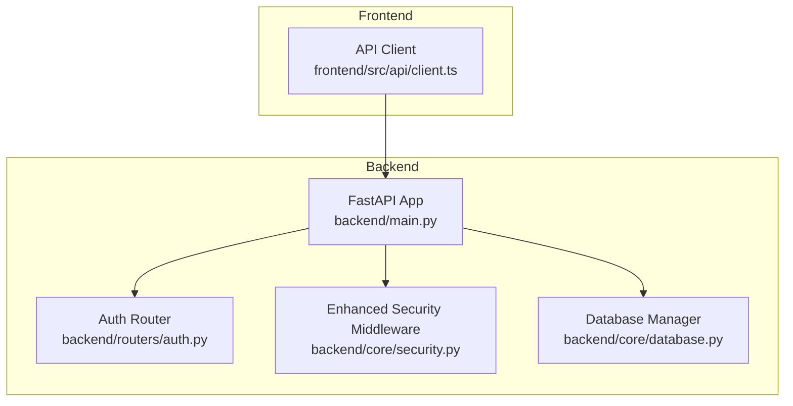
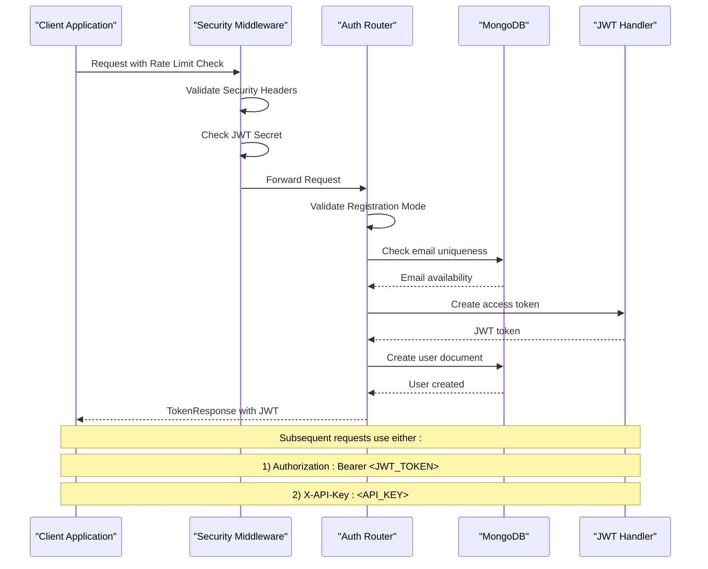
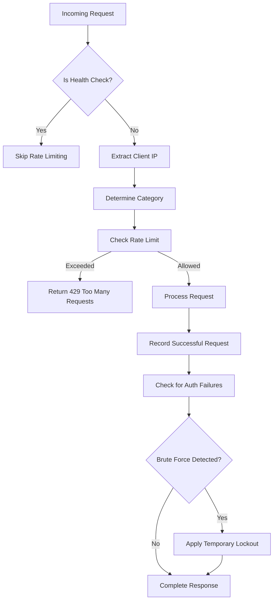
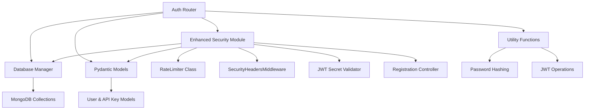

# Authentication API

<cite>
**Referenced Files in This Document**
- [backend/routers/auth.py](file://backend/routers/auth.py)
- [backend/main.py](file://backend/main.py)
- [backend/core/security.py](file://backend/core/security.py)
- [backend/core/database.py](file://backend/core/database.py)
- [frontend/src/api/client.ts](file://frontend/src/api/client.ts)
- [.env.example](file://.env.example)
- [docs/PROJECT_DOCUMENTATION.md](file://docs/PROJECT_DOCUMENTATION.md)
</cite>

## Update Summary
**Changes Made**
- Enhanced security middleware with comprehensive rate limiting system
- Added SecurityHeadersMiddleware for enhanced protection
- Implemented JWT secret validation with production security checks
- Added registration control mechanisms with multiple modes
- Updated authentication endpoints with improved security features
- Added comprehensive rate limit configurations for different endpoint categories
- Enhanced API documentation protection based on environment settings

## Table of Contents
1. [Introduction](#introduction)
2. [Project Structure](#project-structure)
3. [Core Components](#core-components)
4. [Architecture Overview](#architecture-overview)
5. [Detailed Component Analysis](#detailed-component-analysis)
6. [Enhanced Security Middleware](#enhanced-security-middleware)
7. [Dependency Analysis](#dependency-analysis)
8. [Performance Considerations](#performance-considerations)
9. [Troubleshooting Guide](#troubleshooting-guide)
10. [Conclusion](#conclusion)

## Introduction
This document provides comprehensive API documentation for the authentication system, covering user registration, login, profile management, and API key management. The system now features enhanced security middleware with comprehensive rate limiting, security headers, JWT secret validation, and registration control mechanisms. It explains JWT bearer token authentication and X-API-Key header authentication methods, along with security considerations, error handling, and practical usage examples.

## Project Structure
The authentication system is implemented as part of the FastAPI backend with enhanced security components:
- Authentication router: Implements all authentication endpoints and utilities
- Enhanced security middleware: Provides comprehensive rate limiting, security headers, JWT validation, and registration control
- Database manager: Handles MongoDB connections and collections
- Frontend client: Demonstrates client-side authentication flow and token handling



**Diagram sources**
- [backend/main.py](file://backend/main.py#L258-L265)
- [backend/routers/auth.py](file://backend/routers/auth.py#L1-L25)
- [backend/core/security.py](file://backend/core/security.py#L1-L30)
- [backend/core/database.py](file://backend/core/database.py#L28-L86)
- [frontend/src/api/client.ts](file://frontend/src/api/client.ts#L1-L20)

**Section sources**
- [backend/main.py](file://backend/main.py#L258-L265)
- [backend/routers/auth.py](file://backend/routers/auth.py#L1-L25)

## Core Components
The authentication system consists of several key components with enhanced security features:

### Authentication Router
Implements all authentication endpoints including:
- User registration with email validation and password requirements
- Login with JWT token generation and expiration handling
- Profile management endpoints for user updates and password changes
- API key management endpoints for programmatic access
- Enhanced authentication utilities with dual authentication support

### Enhanced Security Middleware
Provides comprehensive security features:
- **Rate Limiting**: Configurable sliding window rate limiting for authentication endpoints
- **Security Headers**: Comprehensive HTTP security headers for enhanced protection
- **JWT Secret Validation**: Production-ready JWT secret validation with security checks
- **Registration Control**: Multiple registration modes (open, invite, closed)
- **API Documentation Protection**: Environment-based documentation exposure control

### Database Integration
Manages MongoDB collections for:
- Users: Stores user credentials, profiles, and metadata
- API Keys: Manages programmatic access keys with hashing and expiration
- Profile Access: Controls user access to different profiles

### Frontend Integration
Demonstrates client-side authentication flow:
- Token storage and automatic inclusion in requests
- Error handling for authentication failures
- Session management and re-authentication

**Section sources**
- [backend/routers/auth.py](file://backend/routers/auth.py#L288-L476)
- [backend/core/security.py](file://backend/core/security.py#L113-L224)
- [backend/core/database.py](file://backend/core/database.py#L28-L118)
- [frontend/src/api/client.ts](file://frontend/src/api/client.ts#L169-L194)

## Architecture Overview
The authentication system follows a dual-authentication approach with enhanced security middleware supporting both JWT bearer tokens and API keys:



**Diagram sources**
- [backend/routers/auth.py](file://backend/routers/auth.py#L288-L362)
- [backend/core/security.py](file://backend/core/security.py#L257-L298)
- [backend/core/database.py](file://backend/core/database.py#L40-L62)

## Detailed Component Analysis

### User Registration Endpoint
**Endpoint:** `POST /api/v1/auth/register`

#### Request Schema
- **email** (required): Valid email address (validated via EmailStr)
- **name** (required): User's full name (2-100 characters)
- **password** (required): Password with minimum 6 characters
- **invite_code** (optional): Required when registration mode is "invite"

#### Response Schema
- **access_token**: Generated JWT token for authentication
- **token_type**: Always "bearer"
- **expires_in**: Token expiration in seconds (7 days default)
- **user**: UserResponse object containing user details

#### Registration Modes
- **Open**: Public registration allowed
- **Invite**: Requires valid invite code
- **Closed**: Registration disabled (admin-only)

#### Enhanced Security Features
- Email uniqueness validation
- Password hashing using bcrypt
- Comprehensive rate limiting (3 per 5 minutes)
- Invite code validation for invite mode
- Registration mode validation

**Section sources**
- [backend/routers/auth.py](file://backend/routers/auth.py#L288-L362)
- [backend/core/security.py](file://backend/core/security.py#L309-L354)

### Login Endpoint
**Endpoint:** `POST /api/v1/auth/login`

#### Request Schema
- **email** (required): User's email address
- **password** (required): Plain text password

#### Response Schema
Same as registration response with JWT token.

#### Enhanced Authentication Flow
1. Lookup user by email (case-insensitive)
2. Verify password using bcrypt comparison
3. Check user activation status
4. Generate JWT token with expiration (7 days)
5. Enhanced rate limiting and security checks

#### Error Scenarios
- Invalid email or password (401 Unauthorized)
- Account disabled (401 Unauthorized)
- Rate limiting violations (429 Too Many Requests)
- Security validation failures

**Section sources**
- [backend/routers/auth.py](file://backend/routers/auth.py#L365-L409)
- [backend/core/security.py](file://backend/core/security.py#L113-L125)

### User Profile Management
**Endpoints:**
- `GET /api/v1/auth/me` - Retrieve current user profile
- `PUT /api/v1/auth/me` - Update user profile
- `PUT /api/v1/auth/me/password` - Change password

#### Profile Retrieval
Returns current user details without sensitive information.

#### Profile Updates
Supports updating user name while maintaining email uniqueness.

#### Password Changes
- Requires current password verification
- Enforces new password minimum length
- Updates password hash securely

**Section sources**
- [backend/routers/auth.py](file://backend/routers/auth.py#L412-L476)

### API Key Management
**Endpoints:**
- `GET /api/v1/auth/api-keys` - List user's API keys
- `POST /api/v1/auth/api-keys` - Create new API key
- `DELETE /api/v1/auth/api-keys/{key_id}` - Revoke API key
- `PUT /api/v1/auth/api-keys/{key_id}/toggle` - Enable/disable API key
- `GET /api/v1/auth/admin/api-keys` - Admin-only: List all API keys

#### Enhanced API Key Creation
- Generates cryptographically secure random key
- Stores SHA-256 hash instead of plaintext
- Supports optional expiration dates
- Returns key only once at creation time
- Enhanced security validation and rate limiting

#### API Key Storage Schema
```javascript
{
  "_id": String,
  "user_id": String,
  "name": String,
  "key_hash": String,
  "key_prefix": String,
  "scopes": [String],
  "is_active": Boolean,
  "created_at": ISODate,
  "last_used_at": ISODate,
  "expires_at": ISODate
}
```

#### Authentication Methods
Both JWT Bearer tokens and API keys are supported:
- JWT: `Authorization: Bearer <token>`
- API Key: `X-API-Key: <api_key>`

**Section sources**
- [backend/routers/auth.py](file://backend/routers/auth.py#L879-L1050)
- [docs/PROJECT_DOCUMENTATION.md](file://docs/PROJECT_DOCUMENTATION.md#L197-L213)

### Authentication Utilities
#### Enhanced Token Generation
- Uses HS256 algorithm with configurable secret key
- Expiration set to 7 days by default
- Payload includes user ID (sub claim)
- Enhanced JWT secret validation

#### Enhanced User Authentication
Dual authentication system with comprehensive security:
1. **JWT Bearer Token**: Standard OAuth2 bearer token with security validation
2. **API Key**: X-API-Key header with hashed key validation and rate limiting

#### Enhanced Security Features
- Password hashing with bcrypt (12 rounds)
- Comprehensive rate limiting for authentication attempts
- Enhanced security headers middleware
- JWT secret validation for production
- Registration mode control
- API documentation protection

**Section sources**
- [backend/routers/auth.py](file://backend/routers/auth.py#L158-L180)
- [backend/core/security.py](file://backend/core/security.py#L147-L255)

## Enhanced Security Middleware

### Rate Limiting System
The enhanced security middleware provides comprehensive rate limiting with configurable categories:

#### Rate Limit Categories
- **Auth Login**: 5 requests per minute (strict limits for brute force prevention)
- **Auth Register**: 3 requests per 5 minutes (invite mode protection)
- **Auth Password**: 3 requests per 5 minutes (password change protection)
- **API General**: 100 requests per minute (general endpoints)
- **API Search**: 30 requests per minute (search operations)
- **API Chat**: 20 requests per minute (chat operations)
- **API Ingestion**: 30 requests per minute (bulk operations)
- **API Ingestion Read**: 200 requests per minute (read-only operations)

#### Advanced Rate Limiting Features
- **Sliding Window Algorithm**: Accurate request counting within time windows
- **Progressive Lockout**: Automatic temporary lockout after repeated failures
- **Client IP Detection**: Handles proxy and load balancer environments
- **Category-Based Limits**: Different limits for different endpoint types
- **Health Check Bypass**: Exempts health check endpoints from rate limiting

#### Rate Limit Middleware Implementation


**Diagram sources**
- [backend/core/security.py](file://backend/core/security.py#L148-L245)

### Security Headers Middleware
Comprehensive HTTP security headers for enhanced protection:

#### Security Headers Applied
- **X-Frame-Options**: DENY (prevents clickjacking)
- **X-Content-Type-Options**: nosniff (prevents MIME type sniffing)
- **X-XSS-Protection**: 1; mode=block (legacy XSS protection)
- **Referrer-Policy**: strict-origin-when-cross-origin (privacy protection)
- **Permissions-Policy**: geolocation=(), microphone=(), camera=() (restricts permissions)

#### Header Implementation
- Only adds headers if not already present (allows nginx to override)
- Configurable per environment
- Applied to all responses automatically

### JWT Secret Validation
Production-ready JWT secret validation with security checks:

#### Validation Rules
- **Development Mode**: Allows default secret with warnings
- **Production Mode**: Requires secure 32+ character secret
- **Critical Security Alert**: Logs and raises errors for insecure configurations
- **Secret Generation**: Built-in secure secret generation utility

#### Security Implications
- Prevents critical security vulnerabilities in production
- Ensures cryptographic strength for JWT signing
- Provides clear guidance for secure configuration

### Registration Control
Flexible registration control with multiple modes:

#### Registration Modes
- **Open**: Public registration allowed (default)
- **Invite**: Requires valid invite code
- **Closed**: Registration disabled (admin-only)

#### Invite Code Validation
- Supports single or multiple invite codes
- Configurable via environment variables
- Cryptographically secure comparison
- Rate limiting for invite code validation

### API Documentation Protection
Environment-based API documentation exposure control:

#### Documentation Control
- **Development**: Exposes /docs, /redoc, /openapi.json
- **Production**: Hides documentation endpoints by default
- **Configuration**: Controlled by EXPOSE_API_DOCS environment variable
- **Security Benefit**: Reduces attack surface in production

**Section sources**
- [backend/core/security.py](file://backend/core/security.py#L31-L245)
- [backend/core/security.py](file://backend/core/security.py#L252-L276)
- [backend/core/security.py](file://backend/core/security.py#L283-L324)
- [backend/core/security.py](file://backend/core/security.py#L331-L375)
- [backend/core/security.py](file://backend/core/security.py#L382-L411)

## Dependency Analysis
The authentication system has well-defined dependencies and enhanced security components:



**Diagram sources**
- [backend/routers/auth.py](file://backend/routers/auth.py#L1-L1050)
- [backend/core/security.py](file://backend/core/security.py#L1-L412)
- [backend/core/database.py](file://backend/core/database.py#L28-L118)

### Component Relationships
- **Auth Router** depends on **Enhanced Security** for comprehensive protection
- **Auth Router** depends on **Database** for user and API key operations
- **Enhanced Security** depends on **Database** for rate limiting tracking
- **Rate Limiter** provides sliding window rate limiting
- **Security Headers** adds HTTP security headers
- **JWT Validator** ensures secure JWT configuration
- **Registration Controller** manages registration modes
- **Models** define data structures used across components

**Section sources**
- [backend/routers/auth.py](file://backend/routers/auth.py#L182-L190)
- [backend/core/security.py](file://backend/core/security.py#L147-L174)
- [backend/core/database.py](file://backend/core/database.py#L40-L62)

## Performance Considerations
The authentication system implements several performance optimizations with enhanced security:

### Enhanced Rate Limiting Strategy
- **Login attempts**: 5 per minute to prevent brute force
- **Registration attempts**: 3 per 5 minutes for invite mode
- **Password changes**: 3 per 5 minutes to prevent abuse
- **General API**: 100 per minute for non-auth endpoints
- **Read-only Ingestion**: 200 per minute for efficient bulk operations
- **Progressive Lockout**: Automatic temporary lockout after repeated failures

### Database Optimization
- Separate thread pool for database operations (4 workers)
- Asynchronous MongoDB operations with Motor driver
- Efficient indexing on email field for user lookups
- Hash-based API key storage for fast validation
- Dedicated rate limiting tracking

### Enhanced Token Management
- JWT tokens cached in client storage
- Automatic token inclusion in requests
- Graceful degradation on token expiration
- Enhanced security validation

### Security Middleware Performance
- **Rate Limiter**: In-memory sliding window with efficient cleanup
- **Security Headers**: Minimal overhead with header caching
- **JWT Validation**: Startup-time validation with runtime caching
- **Registration Control**: Environment-based decisions with minimal overhead

**Section sources**
- [backend/core/security.py](file://backend/core/security.py#L113-L125)
- [backend/core/database.py](file://backend/core/database.py#L15-L26)

## Troubleshooting Guide

### Enhanced Security Issues

#### 401 Unauthorized Errors
**Causes:**
- Invalid or expired JWT token
- Incorrect API key format
- Disabled user account
- Expired API key
- Security validation failures

**Solutions:**
- Regenerate JWT token via login endpoint
- Verify API key format (rag_ + hex characters)
- Check user account status in admin panel
- Renew expired API key
- Review JWT secret configuration

#### 403 Forbidden Errors
**Causes:**
- Insufficient permissions for admin endpoints
- Non-admin user attempting admin actions
- API key lacks required scopes
- Registration mode restrictions

**Solutions:**
- Verify admin status for admin endpoints
- Check API key scopes configuration
- Request appropriate permissions from administrators
- Review registration mode settings

#### 429 Too Many Requests
**Causes:**
- Exceeded rate limits for authentication attempts
- Rapid successive authentication failures
- Brute force detection and progressive lockout
- Security middleware enforcement

**Solutions:**
- Wait for rate limit to reset
- Implement exponential backoff in client applications
- Reduce authentication frequency
- Check security middleware configuration

#### 500 Internal Server Errors
**Causes:**
- Database connectivity issues
- JWT secret configuration problems
- Cryptographic operation failures
- Security middleware validation errors

**Solutions:**
- Check database connection status
- Verify JWT_SECRET_KEY environment variable
- Review application logs for detailed error information
- Check security middleware logs

### Enhanced Environment Configuration Issues

#### JWT Secret Key Problems
**Symptoms:**
- Critical security warnings on startup
- Authentication failures in production
- Validation errors during JWT operations
- Security middleware validation errors

**Solutions:**
- Generate secure 32+ character secret key
- Set JWT_SECRET_KEY environment variable
- Use different secrets for development and production
- Review security middleware logs

#### Registration Mode Issues
**Symptoms:**
- Registration endpoint returns forbidden
- Invite code validation failing
- Public registration disabled unexpectedly
- Security middleware blocking registrations

**Solutions:**
- Configure REGISTRATION_MODE environment variable
- Set appropriate INVITE_CODE or INVITE_CODES
- Verify registration control settings
- Check security middleware logs

#### Rate Limiting Issues
**Symptoms:**
- Unexpected 429 responses
- Rate limiting bypass attempts
- Performance degradation
- Security middleware logging

**Solutions:**
- Review rate limit configurations
- Check client IP detection settings
- Monitor security middleware logs
- Adjust rate limit settings if needed

**Section sources**
- [backend/core/security.py](file://backend/core/security.py#L257-L298)
- [backend/core/security.py](file://backend/core/security.py#L309-L354)
- [.env.example](file://.env.example#L58-L82)

## Conclusion
The authentication system provides robust, production-ready security with comprehensive middleware enhancements. It supports both JWT bearer tokens and API keys, implements sophisticated rate limiting and security measures, and offers clear error handling and troubleshooting guidance. The enhanced security middleware provides comprehensive protection against common attacks while maintaining performance and usability.

Key enhanced security features include:
- **Comprehensive Rate Limiting**: Configurable sliding window with progressive lockout
- **Security Headers**: Complete HTTP security header implementation
- **JWT Secret Validation**: Production-ready security checks
- **Registration Control**: Flexible registration modes with invite support
- **API Documentation Protection**: Environment-based documentation exposure
- **Dual Authentication Methods**: Automatic fallback between JWT and API keys
- **Enhanced Error Handling**: Detailed security-related error messages
- **Performance Optimization**: Efficient rate limiting and security validation

The system is well-suited for enterprise environments requiring both human user authentication and programmatic API access with granular permission controls and comprehensive security measures.