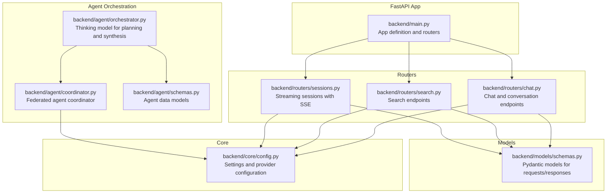
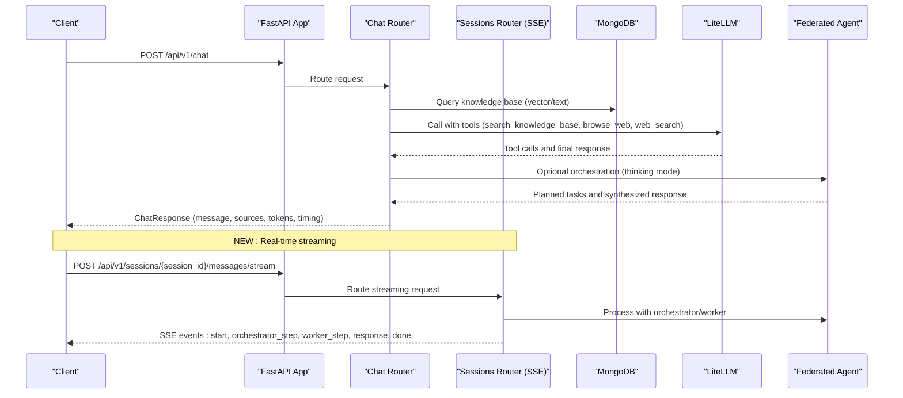
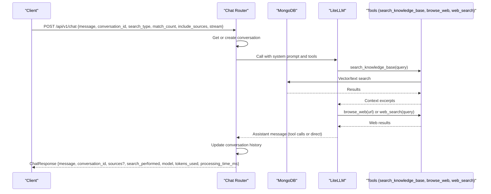
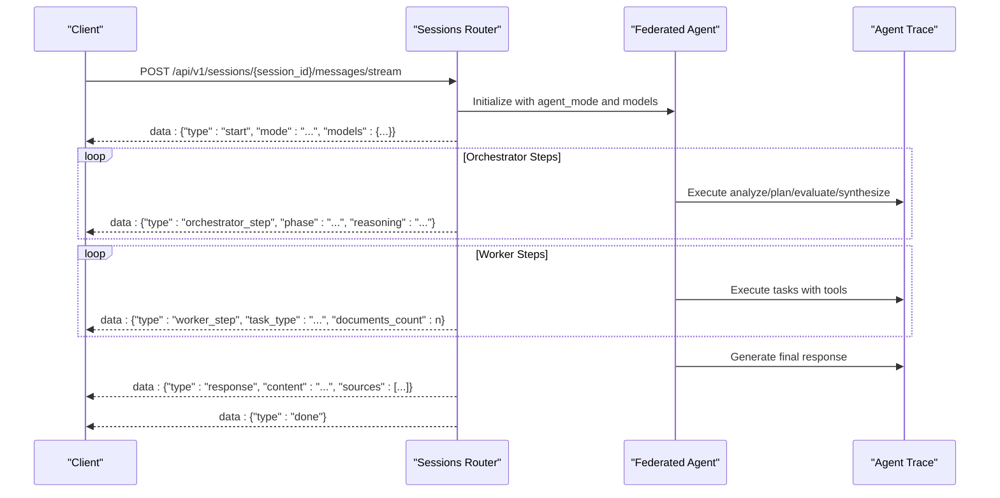
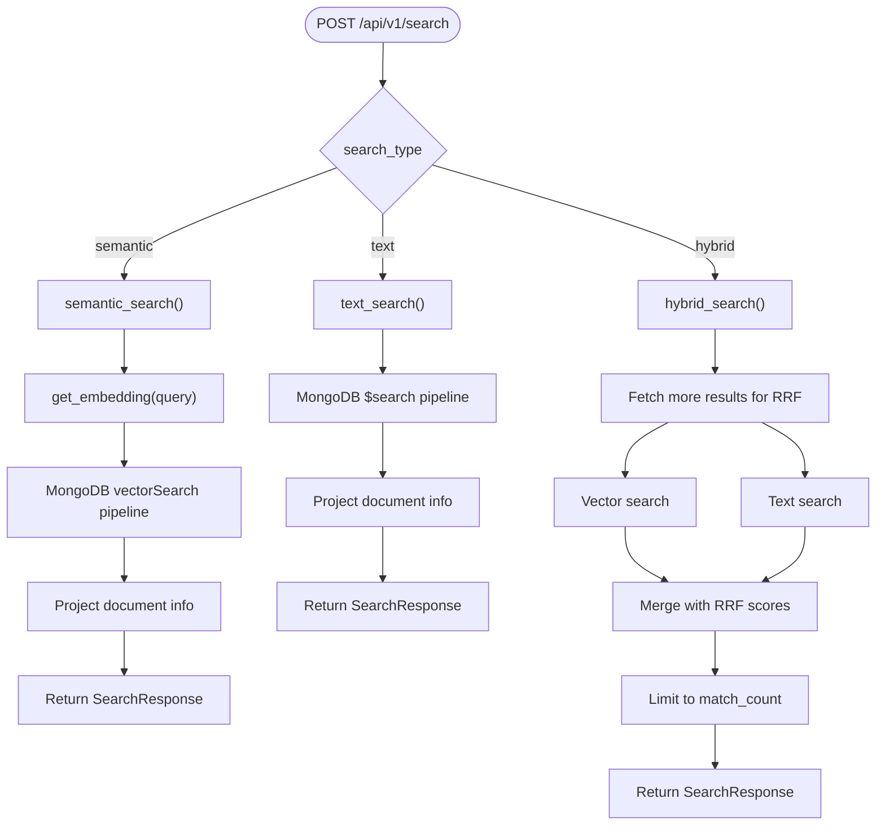
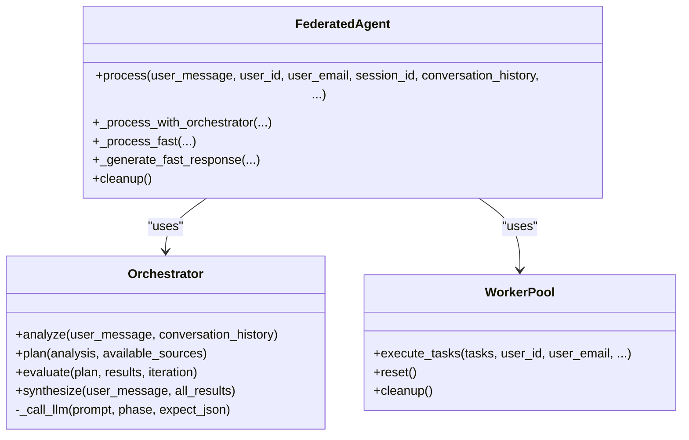
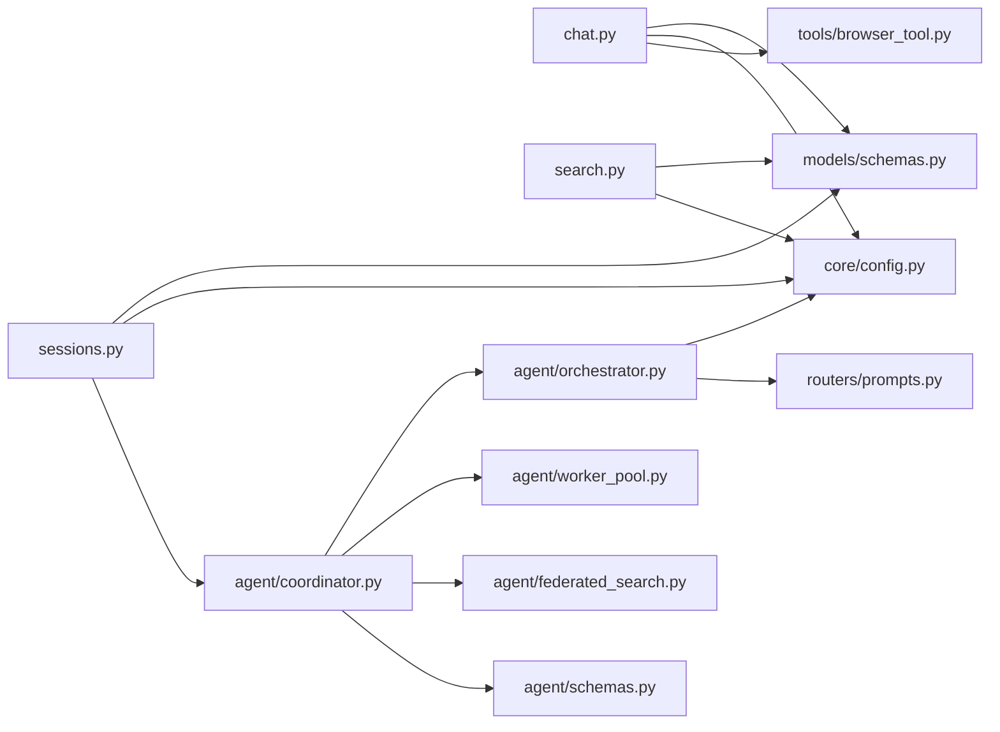

# Chat and Search API

<cite>
**Referenced Files in This Document**
- [backend/main.py](file://backend/main.py)
- [backend/routers/chat.py](file://backend/routers/chat.py)
- [backend/routers/search.py](file://backend/routers/search.py)
- [backend/routers/sessions.py](file://backend/routers/sessions.py)
- [backend/models/schemas.py](file://backend/models/schemas.py)
- [backend/core/config.py](file://backend/core/config.py)
- [backend/agent/orchestrator.py](file://backend/agent/orchestrator.py)
- [backend/agent/coordinator.py](file://backend/agent/coordinator.py)
- [backend/agent/schemas.py](file://backend/agent/schemas.py)
- [frontend/src/api/client.ts](file://frontend/src/api/client.ts)
- [backend/tests/test_chat.py](file://backend/tests/test_chat.py)
- [backend/tests/test_search.py](file://backend/tests/test_search.py)
</cite>

## Update Summary
**Changes Made**
- Added revolutionary streaming API endpoint with Server-Sent Events (SSE) for real-time communication during agent processing
- Documented new streaming capabilities that provide live updates on orchestrator phases, worker executions, and final responses
- Updated chat endpoint documentation to reflect the new stream parameter and streaming behavior
- Added comprehensive documentation for the new streaming message endpoint with event types and real-time updates

## Table of Contents
1. [Introduction](#introduction)
2. [Project Structure](#project-structure)
3. [Core Components](#core-components)
4. [Architecture Overview](#architecture-overview)
5. [Detailed Component Analysis](#detailed-component-analysis)
6. [Dependency Analysis](#dependency-analysis)
7. [Performance Considerations](#performance-considerations)
8. [Troubleshooting Guide](#troubleshooting-guide)
9. [Conclusion](#conclusion)
10. [Appendices](#appendices)

## Introduction
This document provides comprehensive API documentation for the chat and search endpoints in the RecallHub system. It covers:
- The main chat endpoint for conversational AI with RAG-powered responses, agent orchestration, and streaming capabilities
- Search endpoints for semantic, text, and hybrid search with reciprocal rank fusion
- Revolutionary streaming API with Server-Sent Events (SSE) for real-time communication during agent processing
- Conversation management endpoints for chat history retrieval and session handling
- Request/response schemas, streaming behavior, agent configuration, tool calling, and conversation context management
- Practical examples and error handling strategies

## Project Structure
The API is built with FastAPI and organized into routers, models, and agent orchestration modules. The main application wires routers under the /api/v1 namespace, including the new streaming sessions endpoint.

**Diagram sources**
- [backend/main.py](file://backend/main.py#L410-L444)
- [backend/routers/chat.py](file://backend/routers/chat.py#L1-L20)
- [backend/routers/search.py](file://backend/routers/search.py#L1-L15)
- [backend/routers/sessions.py](file://backend/routers/sessions.py#L1-L25)
- [backend/models/schemas.py](file://backend/models/schemas.py#L1-L120)
- [backend/agent/orchestrator.py](file://backend/agent/orchestrator.py#L1-L60)
- [backend/agent/coordinator.py](file://backend/agent/coordinator.py#L1-L60)
- [backend/agent/schemas.py](file://backend/agent/schemas.py#L1-L60)
- [backend/core/config.py](file://backend/core/config.py#L1-L120)

**Section sources**
- [backend/main.py](file://backend/main.py#L410-L444)

## Core Components
- Chat router: Implements the main chat endpoint, conversation management, agent orchestration with tool calling, and streaming support.
- Search router: Provides semantic, text, and hybrid search endpoints with hybrid using reciprocal rank fusion.
- Sessions router: Revolutionary streaming endpoint with Server-Sent Events (SSE) for real-time agent processing updates.
- Models: Pydantic schemas define request/response shapes for chat, search, and streaming operations.
- Agent orchestration: Thinking model and federated agent coordinator for complex multi-step reasoning.
- Configuration: Centralized settings for LLM providers, embeddings, and search parameters.

**Section sources**
- [backend/routers/chat.py](file://backend/routers/chat.py#L642-L742)
- [backend/routers/search.py](file://backend/routers/search.py#L34-L347)
- [backend/routers/sessions.py](file://backend/routers/sessions.py#L1062-L1280)
- [backend/models/schemas.py](file://backend/models/schemas.py#L38-L87)
- [backend/agent/orchestrator.py](file://backend/agent/orchestrator.py#L35-L100)
- [backend/agent/coordinator.py](file://backend/agent/coordinator.py#L29-L70)
- [backend/core/config.py](file://backend/core/config.py#L9-L120)

## Architecture Overview
The system integrates FastAPI routers with MongoDB-backed search, LiteLLM for LLM calls, and an agent orchestration layer. The chat endpoint can leverage the federated agent system for complex reasoning or fall back to direct search and response. The new streaming endpoint provides real-time updates via Server-Sent Events.

**Diagram sources**
- [backend/main.py](file://backend/main.py#L410-L444)
- [backend/routers/chat.py](file://backend/routers/chat.py#L642-L706)
- [backend/routers/sessions.py](file://backend/routers/sessions.py#L1062-L1280)
- [backend/agent/coordinator.py](file://backend/agent/coordinator.py#L83-L144)

## Detailed Component Analysis

### Chat Endpoint (/api/v1/chat)
- Purpose: Conversational AI with RAG-powered responses, optional streaming, and agent orchestration.
- Key behaviors:
  - Conversation handling: Maintains an in-memory conversation store keyed by conversation_id; supports retrieval and deletion.
  - Agent orchestration: Uses tool calling to search knowledge base, browse web, and perform web searches; can switch to thinking mode for complex queries.
  - Response composition: Builds sources from search operations and includes model, tokens used, and processing time.
  - **Updated**: Now supports streaming via the stream parameter in ChatRequest.

**Diagram sources**
- [backend/routers/chat.py](file://backend/routers/chat.py#L642-L706)
- [backend/routers/chat.py](file://backend/routers/chat.py#L329-L631)

Key request/response schemas:
- Request: ChatRequest
  - Fields: message, conversation_id, search_type, match_count, include_sources, stream
- Response: ChatResponse
  - Fields: message, conversation_id, sources, search_performed, model, tokens_used, processing_time_ms

Agent configuration and tool calling:
- Tools schema defines three tools: search_knowledge_base, browse_web, web_search.
- The agent can iterate tool calls up to a configurable maximum per response.
- Conversation context is maintained and limited to a bounded history.

Conversation management:
- GET /api/v1/chat/conversations/{conversation_id}
- DELETE /api/v1/chat/conversations/{conversation_id}
- GET /api/v1/chat/conversations

**Section sources**
- [backend/routers/chat.py](file://backend/routers/chat.py#L642-L742)
- [backend/models/schemas.py](file://backend/models/schemas.py#L38-L57)
- [backend/core/config.py](file://backend/core/config.py#L63-L71)

### Streaming Sessions Endpoint (/api/v1/sessions/{session_id}/messages/stream)
**New Feature**: Revolutionary streaming API endpoint with Server-Sent Events (SSE) for real-time communication during agent processing.

- Purpose: Provides live updates on orchestrator phases, worker executions, and final responses via SSE.
- Event types:
  - start: Initial event with agent mode and model information
  - orchestrator_step: Updates on orchestrator phases (analyze, plan, evaluate, synthesize)
  - worker_step: Updates on worker task executions with search results
  - response: Final response with full data and trace information
  - error: Error events with error messages
  - done: Completion signal

**Diagram sources**
- [backend/routers/sessions.py](file://backend/routers/sessions.py#L1062-L1280)

Event stream behavior:
- Real-time updates during agent processing
- Each event is a separate SSE message with JSON payload
- Supports graceful error handling with error events
- Automatically cleans up agent resources after completion

**Section sources**
- [backend/routers/sessions.py](file://backend/routers/sessions.py#L1062-L1280)
- [frontend/src/api/client.ts](file://frontend/src/api/client.ts#L1390-L1427)

### Search Endpoints (/api/v1/search)
- Unified search endpoint routes to semantic, text, or hybrid search based on search_type.
- Hybrid search uses reciprocal rank fusion (RRF) to combine vector and text results.

**Diagram sources**
- [backend/routers/search.py](file://backend/routers/search.py#L34-L347)

Request/response schemas:
- Request: SearchRequest
  - Fields: query, search_type, match_count, text_weight
- Response: SearchResponse
  - Fields: query, search_type, results (SearchResultItem), total_results, processing_time_ms
- SearchResultItem
  - Fields: chunk_id, document_id, document_title, document_source, content, similarity, metadata

Hybrid search details:
- Uses RRF with a constant k=60 to combine scores from vector and text search.
- Deduplicates results by chunk_id and limits to match_count.

**Section sources**
- [backend/routers/search.py](file://backend/routers/search.py#L34-L347)
- [backend/models/schemas.py](file://backend/models/schemas.py#L61-L87)

### Agent Orchestration and Tool Calling
- Federated Agent:
  - Determines execution mode (auto/thinking/fast) based on query complexity.
  - Orchestrator performs analysis, planning, evaluation, and synthesis phases.
  - WorkerPool executes tasks in parallel or iteratively.
- Tool calling:
  - search_knowledge_base: Performs hybrid search against the knowledge base.
  - browse_web: Fetches and extracts content from a URL.
  - web_search: Queries Brave Search for relevant URLs.

**Diagram sources**
- [backend/agent/coordinator.py](file://backend/agent/coordinator.py#L29-L144)
- [backend/agent/orchestrator.py](file://backend/agent/orchestrator.py#L35-L100)

Configuration options:
- Agent mode, orchestrator/worker models/providers, max iterations, and parallel workers.
- Provider-specific API keys and base URLs are managed centrally.

**Section sources**
- [backend/agent/coordinator.py](file://backend/agent/coordinator.py#L29-L144)
- [backend/agent/orchestrator.py](file://backend/agent/orchestrator.py#L35-L100)
- [backend/agent/schemas.py](file://backend/agent/schemas.py#L354-L390)
- [backend/core/config.py](file://backend/core/config.py#L63-L101)

## Dependency Analysis
- Chat router depends on:
  - Models for request/response schemas
  - Config for LLM/embedding settings
  - Tools for web browsing
- Search router depends on:
  - Models for request/response schemas
  - Config for MongoDB indexes and embedding settings
- Sessions router (streaming) depends on:
  - Models for request/response schemas
  - Config for agent settings
  - FederatedAgent for processing
- Agent orchestration depends on:
  - Orchestrator for reasoning phases
  - WorkerPool for task execution
  - FederatedSearch for data source access

**Diagram sources**
- [backend/routers/chat.py](file://backend/routers/chat.py#L1-L20)
- [backend/routers/search.py](file://backend/routers/search.py#L1-L15)
- [backend/routers/sessions.py](file://backend/routers/sessions.py#L1-L25)
- [backend/agent/coordinator.py](file://backend/agent/coordinator.py#L15-L25)
- [backend/agent/orchestrator.py](file://backend/agent/orchestrator.py#L18-L25)

**Section sources**
- [backend/routers/chat.py](file://backend/routers/chat.py#L1-L20)
- [backend/routers/search.py](file://backend/routers/search.py#L1-L15)
- [backend/routers/sessions.py](file://backend/routers/sessions.py#L1-L25)
- [backend/agent/coordinator.py](file://backend/agent/coordinator.py#L15-L25)
- [backend/agent/orchestrator.py](file://backend/agent/orchestrator.py#L18-L25)

## Performance Considerations
- Streaming: The chat endpoint supports a stream flag in the request schema, enabling streaming responses. While the current implementation focuses on tool-driven responses, streaming can be extended to deliver partial results progressively.
- **Updated**: Revolutionary streaming endpoint provides real-time updates with minimal latency and efficient resource utilization.
- Resource limits: The chat endpoint limits conversation history to a bounded size to control memory usage.
- Search scaling: Hybrid search fetches more results for RRF and then deduplicates and limits, balancing quality and performance.
- Provider configuration: Centralized settings allow switching providers and models without code changes, enabling tuning for cost and latency.

## Troubleshooting Guide
Common issues and strategies:
- Validation errors: Requests failing validation return structured error responses with an error ID for tracing.
- Timeout handling: Middleware enforces request timeouts to prevent blocking; health checks and streaming endpoints are exempt.
- Global exception handling: Unhandled errors are logged with full stack traces; responses include a user-friendly message and an error ID.
- Frontend error handling: The client maps HTTP statuses to user-friendly messages and surfaces technical details for admins.
- **Updated**: Streaming endpoint handles errors gracefully with error events and maintains connection stability.

Operational tips:
- Verify LLM and embedding provider keys and base URLs in configuration.
- Ensure MongoDB indexes exist for vector and text search.
- Monitor agent mode thresholds and adjust for query complexity.
- **Updated**: For streaming, ensure proper SSE support and handle connection interruptions.

**Section sources**
- [backend/main.py](file://backend/main.py#L289-L396)
- [frontend/src/api/client.ts](file://frontend/src/api/client.ts#L1390-L1427)

## Conclusion
The RecallHub API provides robust chat and search capabilities with flexible orchestration and rich conversation management. The chat endpoint integrates RAG, tool calling, and optional thinking-mode orchestration, while the search endpoints offer semantic, text, and hybrid search powered by MongoDB Atlas Search and reciprocal rank fusion. **The revolutionary streaming endpoint adds real-time communication capabilities via Server-Sent Events, providing live updates on orchestrator phases, worker executions, and final responses.** Centralized configuration enables easy tuning of models, providers, and search parameters.

## Appendices

### API Definitions

- Chat endpoint
  - Method: POST
  - Path: /api/v1/chat
  - Request body: ChatRequest
  - Response: ChatResponse

- Search endpoints
  - Method: POST
  - Path: /api/v1/search
  - Request body: SearchRequest
  - Response: SearchResponse

- Search type-specific endpoints
  - POST /api/v1/search/semantic
  - POST /api/v1/search/text
  - POST /api/v1/search/hybrid

- **New**: Streaming sessions endpoint
  - Method: POST
  - Path: /api/v1/sessions/{session_id}/messages/stream
  - Request body: SendMessageRequest
  - Response: Server-Sent Events (SSE)

- Conversation management
  - GET /api/v1/chat/conversations/{conversation_id}
  - DELETE /api/v1/chat/conversations/{conversation_id}
  - GET /api/v1/chat/conversations

**Section sources**
- [backend/routers/chat.py](file://backend/routers/chat.py#L642-L742)
- [backend/routers/search.py](file://backend/routers/search.py#L34-L347)
- [backend/routers/sessions.py](file://backend/routers/sessions.py#L1062-L1280)

### Request/Response Schemas

- ChatRequest
  - message: string (min length 1, max 10000)
  - conversation_id: string (optional)
  - search_type: enum "semantic" | "text" | "hybrid" (default "hybrid")
  - match_count: integer (1..50, default 10)
  - include_sources: boolean (default true)
  - stream: boolean (default false)

- ChatResponse
  - message: string
  - conversation_id: string
  - sources: array of objects (optional)
  - search_performed: boolean
  - model: string
  - tokens_used: integer (optional)
  - processing_time_ms: number

- **Updated**: SendMessageRequest (for streaming)
  - content: string (min length 1)
  - search_type: string (default "hybrid")
  - match_count: integer (default 10)
  - include_sources: boolean (default true)
  - attachments: array of AttachmentInfo (optional)
  - agent_mode: string (optional)

- SearchRequest
  - query: string (min length 1, max 5000)
  - search_type: enum "semantic" | "text" | "hybrid" (default "hybrid")
  - match_count: integer (1..50, default 10)
  - text_weight: number (0..1, optional)

- SearchResponse
  - query: string
  - search_type: string
  - results: array of SearchResultItem
  - total_results: integer
  - processing_time_ms: number

- SearchResultItem
  - chunk_id: string
  - document_id: string
  - document_title: string
  - document_source: string
  - content: string
  - similarity: number
  - metadata: object

**Section sources**
- [backend/models/schemas.py](file://backend/models/schemas.py#L38-L87)
- [backend/routers/sessions.py](file://backend/routers/sessions.py#L296-L303)

### Streaming Event Types

**New**: Server-Sent Events (SSE) for real-time streaming:

- start event
  - type: "start"
  - mode: string (agent mode)
  - models: object (orchestrator and worker models)

- orchestrator_step event
  - type: "orchestrator_step"
  - phase: string (analyze, plan, evaluate, synthesize)
  - reasoning: string (partial reasoning)
  - output: string (output summary)
  - duration_ms: number
  - tokens: number

- worker_step event
  - type: "worker_step"
  - task_id: string
  - task_type: string
  - tool: string
  - input: object
  - documents_count: number
  - links_count: number
  - duration_ms: number
  - success: boolean
  - documents: array (top documents)

- response event
  - type: "response"
  - content: string (final response)
  - sources: array (document sources)
  - stats: object (tokens, cost, latency)
  - trace: object (full trace data)

- error event
  - type: "error"
  - message: string (error details)

- done event
  - type: "done"

**Section sources**
- [backend/routers/sessions.py](file://backend/routers/sessions.py#L1138-L1220)
- [frontend/src/api/client.ts](file://frontend/src/api/client.ts#L1390-L1408)

### Examples

- Real-time chat interaction
  - Client sends a message with include_sources enabled.
  - Server responds with a ChatResponse containing the assistant's answer, optional sources, tokens used, and processing time.
  - The client can optionally enable streaming via the stream flag in the request.

- **New**: Streaming session interaction
  - Client connects to /api/v1/sessions/{session_id}/messages/stream
  - Receives real-time events: start, orchestrator_step, worker_step, response, done
  - Each event provides live updates on agent processing phases
  - Client can handle different event types with appropriate callbacks

- Search result formatting
  - Client calls /api/v1/search with search_type "hybrid".
  - Server returns SearchResponse with results ordered by fused relevance and includes metadata for each result.

- Error handling
  - Validation failures return structured errors with an error ID.
  - Unexpected server errors include a user-friendly message and an error ID for support.
  - **Updated**: Streaming errors are sent as error events and connection is maintained for graceful recovery.

**Section sources**
- [frontend/src/api/client.ts](file://frontend/src/api/client.ts#L1390-L1427)
- [backend/tests/test_chat.py](file://backend/tests/test_chat.py#L15-L120)
- [backend/tests/test_search.py](file://backend/tests/test_search.py#L15-L98)