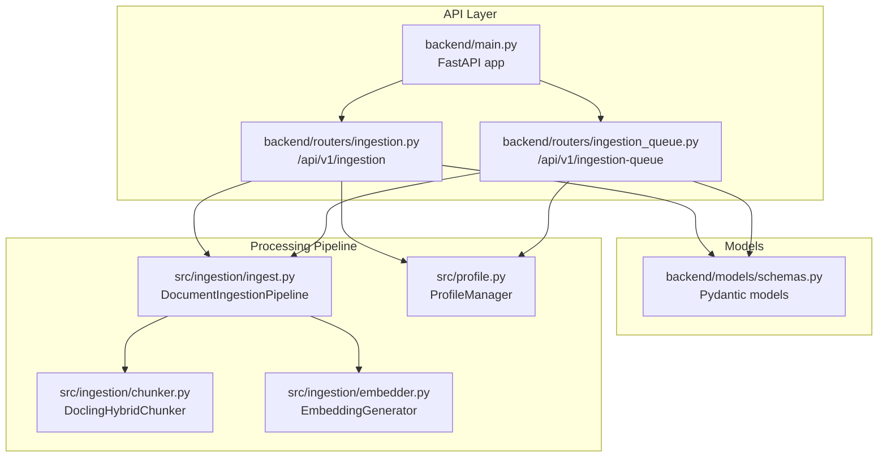
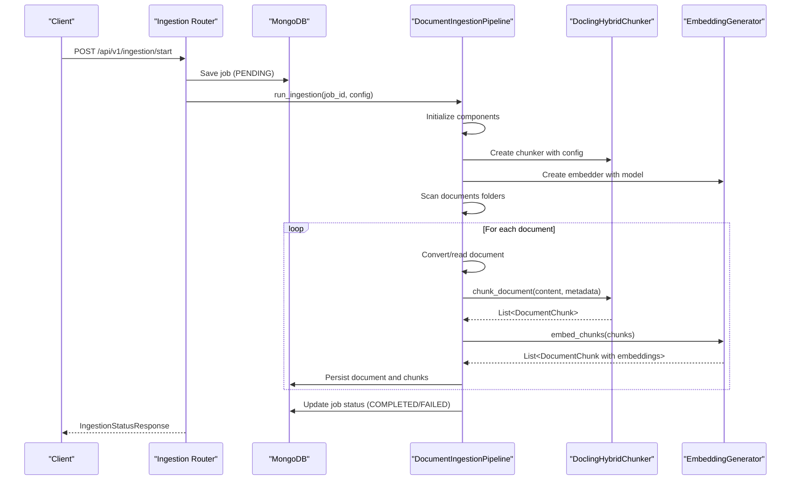
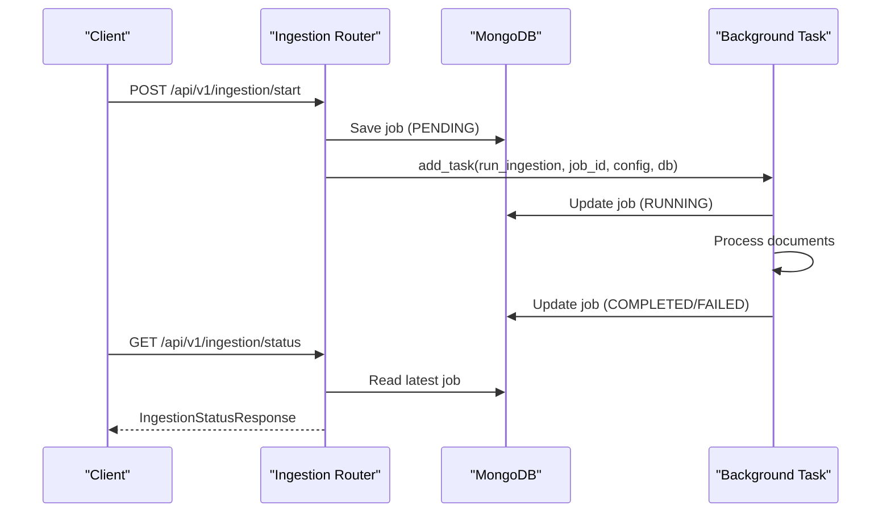
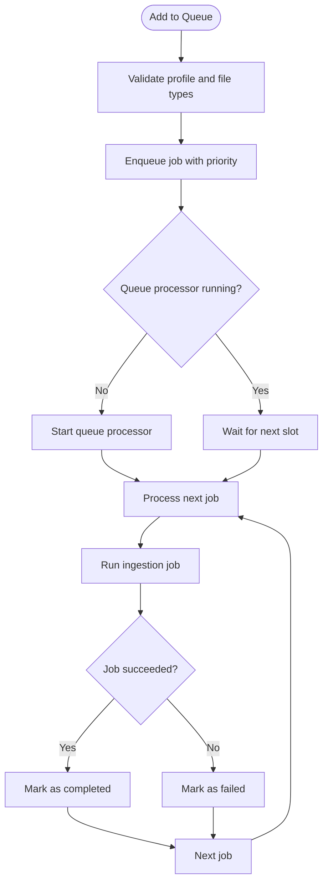
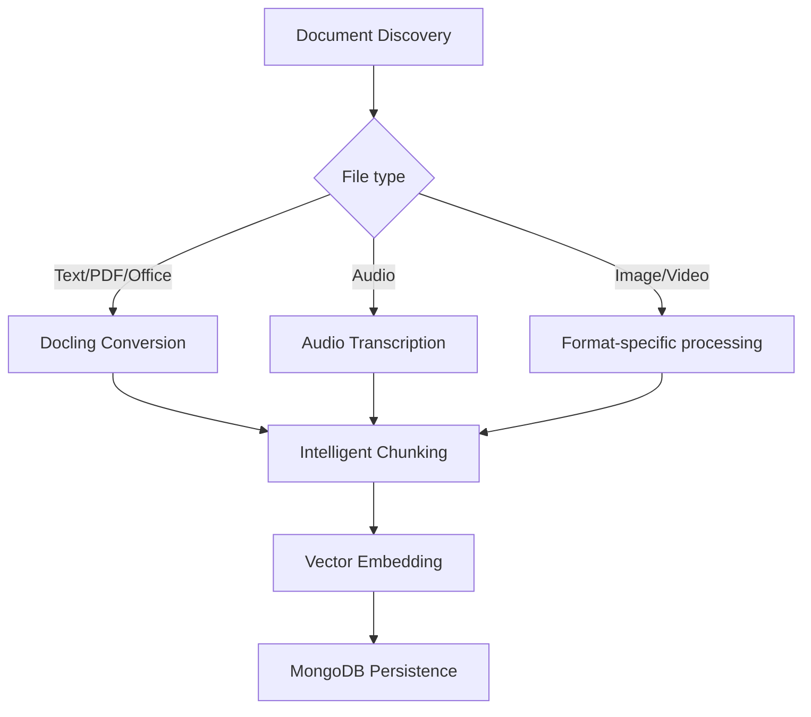
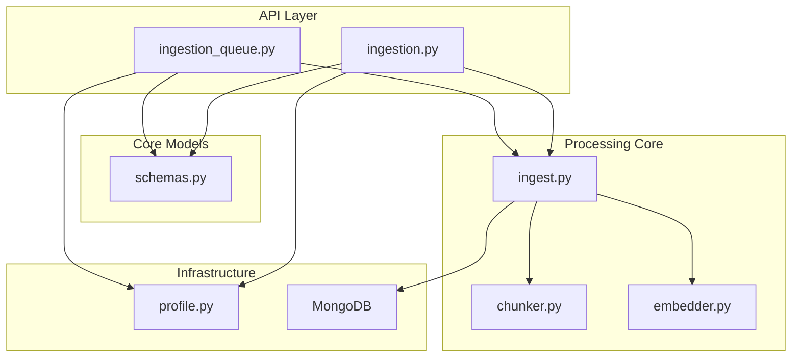

# Ingestion API

<cite>
**Referenced Files in This Document**
- [backend/main.py](file://backend/main.py)
- [backend/routers/ingestion.py](file://backend/routers/ingestion.py)
- [backend/routers/ingestion_queue.py](file://backend/routers/ingestion_queue.py)
- [backend/models/schemas.py](file://backend/models/schemas.py)
- [src/ingestion/ingest.py](file://src/ingestion/ingest.py)
- [src/ingestion/chunker.py](file://src/ingestion/chunker.py)
- [src/ingestion/embedder.py](file://src/ingestion/embedder.py)
- [src/profile.py](file://src/profile.py)
</cite>

## Table of Contents
1. [Introduction](#introduction)
2. [Project Structure](#project-structure)
3. [Core Components](#core-components)
4. [Architecture Overview](#architecture-overview)
5. [Detailed Component Analysis](#detailed-component-analysis)
6. [Dependency Analysis](#dependency-analysis)
7. [Performance Considerations](#performance-considerations)
8. [Troubleshooting Guide](#troubleshooting-guide)
9. [Conclusion](#conclusion)

## Introduction
This document provides comprehensive API documentation for the document ingestion system. It covers:
- Ingestion management endpoints for starting, monitoring, and controlling document ingestion
- Ingestion queue management for batch operations and scheduling
- Document processing workflows including multi-format support, intelligent chunking, and embedding generation
- Error handling for corrupted files, unsupported formats, and processing failures
- Request schemas and response models
- Practical examples for successful workflows and troubleshooting

The ingestion system integrates FastAPI routes with a robust document processing pipeline that supports PDF, Word, audio, images, and video formats, with intelligent chunking and vector embedding generation.

## Project Structure
The ingestion functionality is organized across several modules:
- FastAPI routers for ingestion management and queue operations
- Pydantic models defining request/response schemas
- Ingestion pipeline with chunking and embedding components
- Profile management for multi-project support

**Diagram sources**
- [backend/main.py](file://backend/main.py#L398-L500)
- [backend/routers/ingestion.py](file://backend/routers/ingestion.py#L1-L120)
- [backend/routers/ingestion_queue.py](file://backend/routers/ingestion_queue.py#L1-L120)
- [backend/models/schemas.py](file://backend/models/schemas.py#L233-L297)
- [src/ingestion/ingest.py](file://src/ingestion/ingest.py#L55-L125)
- [src/ingestion/chunker.py](file://src/ingestion/chunker.py#L68-L101)
- [src/ingestion/embedder.py](file://src/ingestion/embedder.py#L45-L87)
- [src/profile.py](file://src/profile.py#L174-L284)

**Section sources**
- [backend/main.py](file://backend/main.py#L398-L500)
- [backend/routers/ingestion.py](file://backend/routers/ingestion.py#L1-L120)
- [backend/routers/ingestion_queue.py](file://backend/routers/ingestion_queue.py#L1-L120)
- [backend/models/schemas.py](file://backend/models/schemas.py#L233-L297)
- [src/ingestion/ingest.py](file://src/ingestion/ingest.py#L55-L125)
- [src/ingestion/chunker.py](file://src/ingestion/chunker.py#L68-L101)
- [src/ingestion/embedder.py](file://src/ingestion/embedder.py#L45-L87)
- [src/profile.py](file://src/profile.py#L174-L284)

## Core Components
This section outlines the primary components involved in document ingestion and their responsibilities.

- Ingestion Management Router
  - Handles ingestion lifecycle: start, status, cancel
  - Manages job persistence and real-time status updates
  - Coordinates with the ingestion pipeline and MongoDB

- Ingestion Queue Router
  - Provides queue management for batch ingestion
  - Supports scheduling, reordering, and cancellation of jobs
  - Integrates with profile-based ingestion configurations

- Ingestion Pipeline
  - Multi-format document processing (PDF, Word, Audio, Images, Video)
  - Intelligent chunking using Docling HybridChunker
  - Vector embedding generation with configurable providers
  - MongoDB persistence for documents and chunks

- Schemas
  - Defines request/response models for ingestion operations
  - Enumerations for status and processing options
  - Validation constraints for safe API usage

**Section sources**
- [backend/routers/ingestion.py](file://backend/routers/ingestion.py#L656-L800)
- [backend/routers/ingestion_queue.py](file://backend/routers/ingestion_queue.py#L111-L173)
- [src/ingestion/ingest.py](file://src/ingestion/ingest.py#L55-L125)
- [backend/models/schemas.py](file://backend/models/schemas.py#L18-L297)

## Architecture Overview
The ingestion architecture follows a layered design:
- API layer exposes REST endpoints for ingestion management and queue operations
- Business logic coordinates ingestion jobs and interacts with the processing pipeline
- Processing pipeline handles document conversion, chunking, and embedding
- Persistence layer stores ingestion jobs and processed documents/chunks in MongoDB

**Diagram sources**
- [backend/routers/ingestion.py](file://backend/routers/ingestion.py#L656-L700)
- [src/ingestion/ingest.py](file://src/ingestion/ingest.py#L126-L167)
- [src/ingestion/chunker.py](file://src/ingestion/chunker.py#L102-L185)
- [src/ingestion/embedder.py](file://src/ingestion/embedder.py#L136-L196)

**Section sources**
- [backend/routers/ingestion.py](file://backend/routers/ingestion.py#L411-L654)
- [src/ingestion/ingest.py](file://src/ingestion/ingest.py#L126-L167)
- [src/ingestion/chunker.py](file://src/ingestion/chunker.py#L102-L185)
- [src/ingestion/embedder.py](file://src/ingestion/embedder.py#L136-L196)

## Detailed Component Analysis

### Ingestion Management Endpoints
The ingestion management endpoints provide a complete interface for controlling document ingestion.

- Endpoint: POST /api/v1/ingestion/start
  - Purpose: Start a new ingestion job
  - Request body: IngestionStartRequest
  - Response: IngestionStatusResponse
  - Behavior: Creates a new job, saves initial state, and starts background processing

- Endpoint: GET /api/v1/ingestion/status
  - Purpose: Get current ingestion status
  - Response: IngestionStatusResponse with real-time updates
  - Behavior: Returns in-memory state if job is running, otherwise reads from DB

- Endpoint: GET /api/v1/ingestion/status/{job_id}
  - Purpose: Get status of a specific job
  - Response: IngestionStatusResponse
  - Behavior: Retrieves job state from MongoDB

- Endpoint: POST /api/v1/ingestion/cancel/{job_id}
  - Purpose: Cancel a running ingestion job
  - Response: SuccessResponse
  - Behavior: Marks job as cancelled and stops processing

**Diagram sources**
- [backend/routers/ingestion.py](file://backend/routers/ingestion.py#L656-L778)

**Section sources**
- [backend/routers/ingestion.py](file://backend/routers/ingestion.py#L656-L800)
- [backend/models/schemas.py](file://backend/models/schemas.py#L235-L269)

### Ingestion Queue Management
The ingestion queue router enables advanced queue management for batch operations and scheduling.

Key endpoints:
- GET /api/v1/ingestion-queue/queue
  - Returns current queue status including queued and running jobs

- POST /api/v1/ingestion-queue/queue/add
  - Adds a single job to the queue with profile, file types, and priority

- POST /api/v1/ingestion-queue/queue/add-multiple
  - Adds multiple jobs to the queue

- DELETE /api/v1/ingestion-queue/{job_id}
  - Removes a job from the queue (fails if job is running)

- DELETE /api/v1/ingestion-queue/
  - Clears all queued jobs

- POST /api/v1/ingestion-queue/queue/reorder
  - Reorders queue by providing job IDs in desired order

- GET /api/v1/ingestion-queue/schedules
  - Lists all scheduled ingestion jobs

- POST /api/v1/ingestion-queue/schedules
  - Creates a new scheduled ingestion job

- PUT /api/v1/ingestion-queue/schedules/{schedule_id}
  - Updates an existing schedule

- DELETE /api/v1/ingestion-queue/schedules/{schedule_id}
  - Deletes a schedule

- POST /api/v1/ingestion-queue/schedules/{schedule_id}/toggle
  - Enables or disables a schedule

- POST /api/v1/ingestion-queue/schedules/{schedule_id}/run-now
  - Immediately adds a scheduled job to the queue

**Diagram sources**
- [backend/routers/ingestion_queue.py](file://backend/routers/ingestion_queue.py#L135-L322)

**Section sources**
- [backend/routers/ingestion_queue.py](file://backend/routers/ingestion_queue.py#L111-L322)

### Document Processing Workflows
The ingestion pipeline implements a sophisticated document processing workflow supporting multiple formats and intelligent chunking.

Supported formats:
- Text: .md, .markdown, .txt
- Documents: .pdf, .docx, .doc, .html, .htm
- Spreadsheets: .xlsx, .xls
- Presentations: .pptx, .ppt
- Images: .png, .jpg, .jpeg, .gif, .webp, .bmp
- Audio: .mp3, .wav, .m4a, .flac
- Video: .mp4, .avi, .mkv, .mov, .webm

Processing stages:
1. Document discovery and filtering
2. Format-specific conversion or reading
3. Intelligent chunking with contextual awareness
4. Vector embedding generation
5. MongoDB persistence

**Diagram sources**
- [src/ingestion/ingest.py](file://src/ingestion/ingest.py#L169-L218)
- [src/ingestion/ingest.py](file://src/ingestion/ingest.py#L286-L356)
- [src/ingestion/chunker.py](file://src/ingestion/chunker.py#L102-L185)
- [src/ingestion/embedder.py](file://src/ingestion/embedder.py#L136-L196)

**Section sources**
- [src/ingestion/ingest.py](file://src/ingestion/ingest.py#L169-L284)
- [src/ingestion/chunker.py](file://src/ingestion/chunker.py#L68-L101)
- [src/ingestion/embedder.py](file://src/ingestion/embedder.py#L45-L87)

### Multi-format Support and Intelligent Chunking
The system supports diverse document formats through specialized processing paths:

- Text and HTML formats are read directly with encoding detection
- PDF, Word, and presentation files are converted using Docling
- Audio files are transcribed using Whisper with multiple fallback strategies
- Image and video files are processed according to their format capabilities

Intelligent chunking employs Docling's HybridChunker which:
- Respects document structure (headings, sections, tables)
- Is token-aware (fits embedding model limits)
- Preserves semantic boundaries
- Includes contextual information in chunks

**Section sources**
- [src/ingestion/ingest.py](file://src/ingestion/ingest.py#L286-L356)
- [src/ingestion/chunker.py](file://src/ingestion/chunker.py#L68-L101)
- [src/ingestion/chunker.py](file://src/ingestion/chunker.py#L102-L185)

### Embedding Generation
The embedding system supports multiple providers with configurable models and batch processing:

- Provider support: OpenAI, Ollama
- Batch processing with configurable batch sizes
- Dimension configuration matching embedding models
- Progress tracking during embedding generation

**Section sources**
- [src/ingestion/embedder.py](file://src/ingestion/embedder.py#L45-L87)
- [src/ingestion/embedder.py](file://src/ingestion/embedder.py#L136-L196)

### Error Handling
The ingestion system implements comprehensive error handling:

- File system errors: Corrupted files, unsupported formats, permission issues
- Processing errors: Conversion failures, transcription errors, embedding generation failures
- Network errors: API timeouts, rate limiting, service unavailability
- Graceful degradation: Fallback mechanisms for transcription and chunking

Error handling patterns:
- Try-catch blocks around critical operations
- Fallback strategies (e.g., local transcription when cloud API fails)
- Detailed error logging with context
- Graceful shutdown and job interruption handling

**Section sources**
- [src/ingestion/ingest.py](file://src/ingestion/ingest.py#L334-L345)
- [src/ingestion/ingest.py](file://src/ingestion/ingest.py#L452-L460)
- [backend/routers/ingestion.py](file://backend/routers/ingestion.py#L634-L646)

## Dependency Analysis
The ingestion system exhibits clear separation of concerns with well-defined dependencies.

**Diagram sources**
- [backend/routers/ingestion.py](file://backend/routers/ingestion.py#L15-L22)
- [backend/routers/ingestion_queue.py](file://backend/routers/ingestion_queue.py#L12-L13)
- [backend/models/schemas.py](file://backend/models/schemas.py#L233-L297)
- [src/ingestion/ingest.py](file://src/ingestion/ingest.py#L25-L28)
- [src/ingestion/chunker.py](file://src/ingestion/chunker.py#L23-L25)
- [src/ingestion/embedder.py](file://src/ingestion/embedder.py#L14-L15)
- [src/profile.py](file://src/profile.py#L174-L186)

**Section sources**
- [backend/routers/ingestion.py](file://backend/routers/ingestion.py#L15-L22)
- [backend/routers/ingestion_queue.py](file://backend/routers/ingestion_queue.py#L12-L13)
- [backend/models/schemas.py](file://backend/models/schemas.py#L233-L297)
- [src/ingestion/ingest.py](file://src/ingestion/ingest.py#L25-L28)
- [src/ingestion/chunker.py](file://src/ingestion/chunker.py#L23-L25)
- [src/ingestion/embedder.py](file://src/ingestion/embedder.py#L14-L15)
- [src/profile.py](file://src/profile.py#L174-L186)

## Performance Considerations
The ingestion system incorporates several performance optimizations:

- Concurrency control: Thread pool with limited workers (2) for CPU-intensive operations
- Asynchronous processing: Non-blocking operations for file system and database operations
- Batch processing: Embedding generation uses configurable batch sizes
- Memory management: In-memory job state for real-time updates, capped log buffer
- Resource sharing: Shared thread pools across pipeline instances
- Priority-based processing: Optimal file ordering reduces processing time

Recommendations:
- Monitor thread pool utilization during peak ingestion periods
- Adjust batch sizes based on available resources
- Consider increasing worker count for high-throughput environments
- Monitor MongoDB connection pool usage

**Section sources**
- [src/ingestion/ingest.py](file://src/ingestion/ingest.py#L58-L68)
- [src/ingestion/embedder.py](file://src/ingestion/embedder.py#L58-L62)
- [backend/routers/ingestion.py](file://backend/routers/ingestion.py#L40-L42)

## Troubleshooting Guide
Common ingestion issues and resolutions:

### Job Management Issues
- **Job already running**: Multiple simultaneous ingestion jobs are not allowed. Wait for current job completion or cancel it.
- **Job stuck in PENDING**: Check MongoDB connectivity and ingestion configuration.
- **Graceful shutdown**: Running jobs are marked as interrupted and can be resumed after restart.

### File Processing Issues
- **Unsupported format**: Only documented formats are supported. Convert files to supported formats.
- **Corrupted files**: Processing fails with detailed error logs. Fix or replace corrupted files.
- **Large files**: Very large audio files (>25MB) are processed with chunked transcription for performance.

### Processing Failures
- **Docling conversion errors**: Fallback to raw text extraction. Check file integrity.
- **Audio transcription failures**: Automatic fallback to local Whisper transcription.
- **Embedding generation errors**: Retry with different model or provider configuration.

### Queue Operations
- **Adding jobs to queue**: Ensure profile exists and has valid document folders configured.
- **Scheduled jobs not running**: Check schedule configuration and ensure no ingestion job is currently running.

**Section sources**
- [backend/routers/ingestion.py](file://backend/routers/ingestion.py#L669-L675)
- [src/ingestion/ingest.py](file://src/ingestion/ingest.py#L334-L345)
- [src/ingestion/ingest.py](file://src/ingestion/ingest.py#L452-L460)
- [backend/routers/ingestion_queue.py](file://backend/routers/ingestion_queue.py#L145-L149)

## Conclusion
The ingestion API provides a robust, scalable solution for document processing with comprehensive multi-format support, intelligent chunking, and flexible queue management. The system balances performance with reliability through careful resource management, graceful error handling, and administrative controls. The modular architecture enables easy extension and maintenance while providing clear operational visibility through status monitoring and logging.

Key strengths:
- Comprehensive format support with intelligent fallbacks
- Efficient chunking and embedding generation
- Flexible queue and scheduling capabilities
- Robust error handling and recovery mechanisms
- Profile-based multi-project isolation

The API design follows REST best practices with clear request/response schemas, enabling reliable integration with client applications and automated workflows.