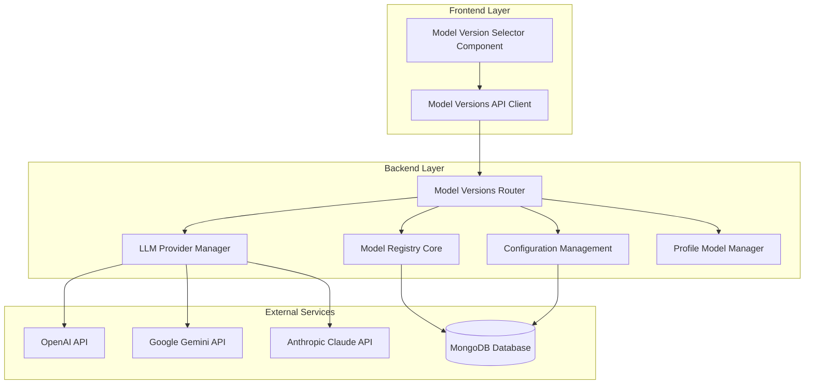
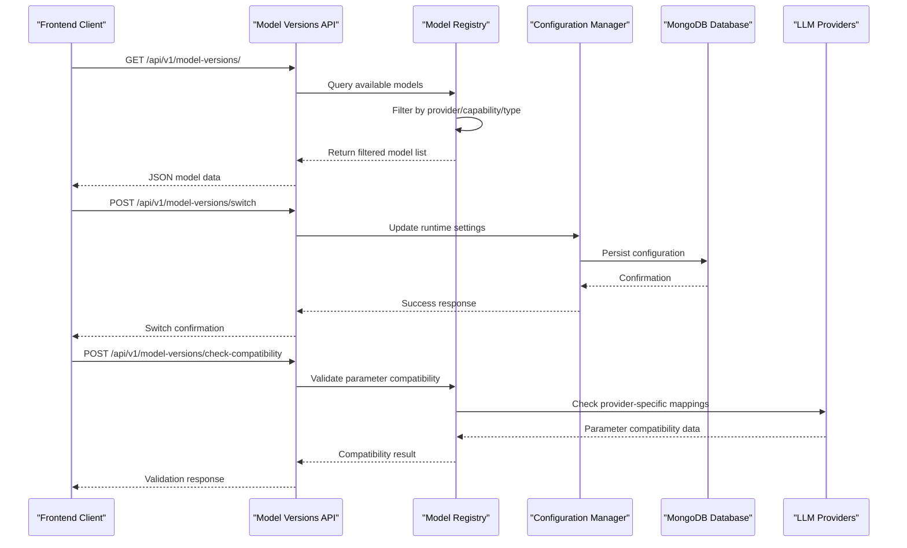
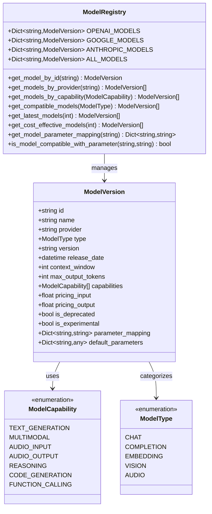
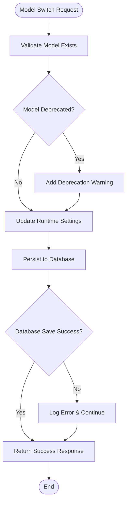
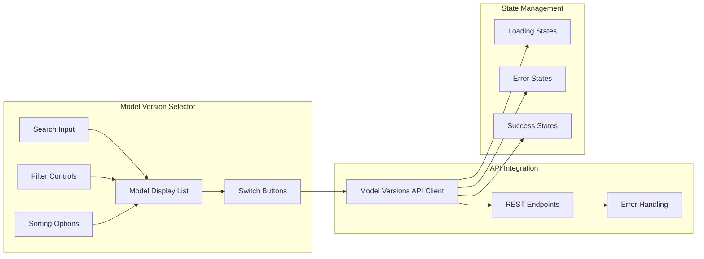
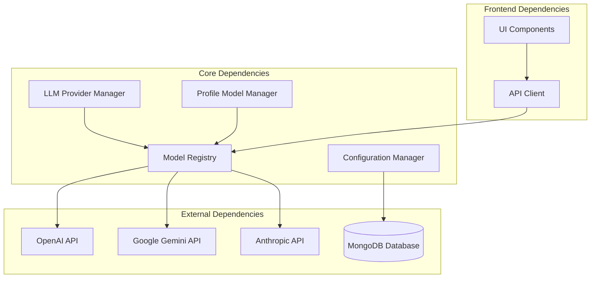

# Model Versions Management

<cite>
**Referenced Files in This Document**
- [model_versions.py](file://backend/core/model_versions.py)
- [model_versions_router.py](file://backend/routers/model_versions.py)
- [config.py](file://backend/core/config.py)
- [llm_providers.py](file://backend/core/llm_providers.py)
- [profile_models.py](file://backend/core/profile_models.py)
- [system_router.py](file://backend/routers/system.py)
- [main.py](file://backend/main.py)
- [modelVersions.ts](file://frontend/src/api/modelVersions.ts)
- [ModelVersionSelector.tsx](file://frontend/src/components/ModelVersionSelector.tsx)
</cite>

## Table of Contents
1. [Introduction](#introduction)
2. [Project Structure](#project-structure)
3. [Core Components](#core-components)
4. [Architecture Overview](#architecture-overview)
5. [Detailed Component Analysis](#detailed-component-analysis)
6. [Dependency Analysis](#dependency-analysis)
7. [Performance Considerations](#performance-considerations)
8. [Troubleshooting Guide](#troubleshooting-guide)
9. [Conclusion](#conclusion)

## Introduction

The Model Versions Management system is a comprehensive framework that enables dynamic selection, configuration, and management of Large Language Model (LLM) versions across multiple providers within the MongoDB RAG Agent platform. This system provides centralized model registry, real-time compatibility checking, intelligent recommendations, and seamless integration with the dual-model architecture (orchestrator and worker roles).

The system supports major LLM providers including OpenAI, Google Gemini, and Anthropic Claude, with extensive model catalogs covering chat, multimodal, reasoning, and embedding capabilities. It offers sophisticated filtering, sorting, and recommendation algorithms to help users select optimal models based on their specific requirements.

## Project Structure

The Model Versions Management system is organized across multiple layers within the backend architecture:

**Diagram sources**
- [model_versions.py](file://backend/core/model_versions.py#L1-L536)
- [model_versions_router.py](file://backend/routers/model_versions.py#L1-L459)
- [config.py](file://backend/core/config.py#L1-L219)

**Section sources**
- [model_versions.py](file://backend/core/model_versions.py#L1-L536)
- [model_versions_router.py](file://backend/routers/model_versions.py#L1-L459)
- [main.py](file://backend/main.py#L513-L517)

## Core Components

### Model Registry System

The core model registry provides comprehensive catalog management for supported LLM providers:

**Model Types and Capabilities:**
- **Chat Models**: Text generation with conversation capabilities
- **Multimodal Models**: Support for images, audio, and video processing
- **Reasoning Models**: Advanced problem-solving and chain-of-thought capabilities
- **Code Generation Models**: Specialized programming assistance
- **Embedding Models**: Vector representation generation for semantic search

**Provider Coverage:**
- **OpenAI**: GPT-5.2, GPT-5.1, GPT-5, GPT-4o, GPT-4o-mini, O1 series
- **Google Gemini**: Gemini 2.0 Flash, Gemini 1.5 Pro, Gemini 1.5 Flash
- **Anthropic Claude**: Claude 3.5 Sonnet, Claude 3 Opus, Claude 3 Haiku

**Section sources**
- [model_versions.py](file://backend/core/model_versions.py#L14-L536)

### API Management Layer

The model versions API router provides comprehensive endpoints for model management:

**Key Endpoints:**
- **GET /**: List all available models with filtering and sorting
- **GET /latest**: Retrieve newest model releases
- **GET /cost-effective**: Get most cost-efficient models
- **GET /{model_id}**: Detailed model information
- **POST /switch**: Switch active model versions
- **POST /check-compatibility**: Validate model-parameter compatibility
- **GET /recommendations**: Intelligent model recommendations
- **GET /current**: Current active model configuration

**Section sources**
- [model_versions_router.py](file://backend/routers/model_versions.py#L115-L459)

### Frontend Integration

The frontend provides user-friendly interfaces for model management:

**Model Version Selector Component:**
- Real-time model browsing and filtering
- Capability-based model discovery
- Pricing comparison and cost optimization
- One-click model switching with validation
- Visual indicators for deprecated/experimental models

**Section sources**
- [modelVersions.ts](file://frontend/src/api/modelVersions.ts#L1-L203)
- [ModelVersionSelector.tsx](file://frontend/src/components/ModelVersionSelector.tsx#L1-L404)

## Architecture Overview

The Model Versions Management system follows a layered architecture with clear separation of concerns:

**Diagram sources**
- [model_versions_router.py](file://backend/routers/model_versions.py#L215-L344)
- [model_versions.py](file://backend/core/model_versions.py#L471-L536)

**Section sources**
- [model_versions_router.py](file://backend/routers/model_versions.py#L1-L459)
- [model_versions.py](file://backend/core/model_versions.py#L1-L536)

## Detailed Component Analysis

### Model Registry Implementation

The model registry serves as the central repository for all supported LLM models:

**Diagram sources**
- [model_versions.py](file://backend/core/model_versions.py#L34-L536)

**Section sources**
- [model_versions.py](file://backend/core/model_versions.py#L34-L536)

### Configuration Management System

The configuration management system handles persistent model settings:

**Diagram sources**
- [model_versions_router.py](file://backend/routers/model_versions.py#L215-L307)

**Section sources**
- [model_versions_router.py](file://backend/routers/model_versions.py#L215-L307)
- [config.py](file://backend/core/config.py#L74-L91)

### Recommendation Engine

The intelligent recommendation system evaluates models based on multiple criteria:

**Scoring Algorithm:**
- **Task Type Matching**: +2.0 points for relevant capabilities
- **Budget Constraints**: +1.0 point for within budget models
- **Context Window Requirements**: +1.0 point for sufficient context
- **Required Capabilities**: +N points for all required capabilities
- **Availability Bonus**: +0.5 points for available models
- **Recency Bonus**: +0.5 points for recently released (<30 days)

**Section sources**
- [model_versions_router.py](file://backend/routers/model_versions.py#L347-L435)

### Frontend Integration Components

The frontend provides comprehensive user interfaces for model management:

**Diagram sources**
- [ModelVersionSelector.tsx](file://frontend/src/components/ModelVersionSelector.tsx#L38-L119)
- [modelVersions.ts](file://frontend/src/api/modelVersions.ts#L97-L201)

**Section sources**
- [ModelVersionSelector.tsx](file://frontend/src/components/ModelVersionSelector.tsx#L1-L404)
- [modelVersions.ts](file://frontend/src/api/modelVersions.ts#L1-L203)

## Dependency Analysis

The Model Versions Management system has well-defined dependencies across the architecture:

**Diagram sources**
- [model_versions.py](file://backend/core/model_versions.py#L1-L536)
- [llm_providers.py](file://backend/core/llm_providers.py#L218-L436)
- [profile_models.py](file://backend/core/profile_models.py#L17-L225)

**Section sources**
- [model_versions.py](file://backend/core/model_versions.py#L1-L536)
- [llm_providers.py](file://backend/core/llm_providers.py#L1-L436)
- [profile_models.py](file://backend/core/profile_models.py#L1-L225)

## Performance Considerations

The Model Versions Management system incorporates several performance optimization strategies:

**Caching Strategies:**
- Model lists cached for 5-minute TTL
- Configuration caching to reduce database queries
- Parameter mapping caching for frequent operations

**Database Optimization:**
- Efficient model filtering using MongoDB queries
- Batch operations for configuration updates
- Connection pooling for database operations

**API Performance:**
- Asynchronous model fetching from external APIs
- Lazy loading of model details
- Pagination for large model lists

**Memory Management:**
- Model registry stored in memory for fast access
- Configurable model limits to prevent memory issues
- Proper cleanup of temporary data structures

## Troubleshooting Guide

### Common Issues and Solutions

**Model Not Found Errors:**
- Verify model ID exists in the registry
- Check provider-specific model availability
- Validate model compatibility with current configuration

**API Key Issues:**
- Ensure proper API keys are configured for selected provider
- Check API key permissions and quotas
- Verify API endpoint configuration

**Database Connection Problems:**
- Verify MongoDB connectivity and authentication
- Check database collection permissions
- Validate connection string format

**Performance Issues:**
- Monitor model list loading times
- Check database query performance
- Review caching effectiveness

**Section sources**
- [model_versions_router.py](file://backend/routers/model_versions.py#L232-L236)
- [model_versions_router.py](file://backend/routers/model_versions.py#L296-L298)

### Error Handling Patterns

The system implements comprehensive error handling:

**Validation Errors:**
- Model ID validation before switching
- Capability compatibility checking
- Parameter mapping verification

**External API Errors:**
- Graceful fallback to cached model data
- Retry mechanisms for transient failures
- Detailed error reporting with context

**Database Errors:**
- Transaction rollback on failures
- Configuration fallback to defaults
- Audit logging for all operations

**Section sources**
- [model_versions_router.py](file://backend/routers/model_versions.py#L310-L344)
- [model_versions_router.py](file://backend/routers/model_versions.py#L296-L298)

## Conclusion

The Model Versions Management system provides a robust, scalable solution for managing LLM model versions across multiple providers and use cases. Its comprehensive architecture supports dynamic model switching, intelligent recommendations, and seamless integration with the broader MongoDB RAG Agent ecosystem.

Key strengths of the system include:

- **Comprehensive Model Coverage**: Support for leading LLM providers with extensive model catalogs
- **Intelligent Recommendations**: AI-driven model selection based on specific requirements
- **Seamless Integration**: Tight integration with the dual-model architecture and profile management
- **User-Friendly Interface**: Intuitive frontend components for model management
- **Performance Optimization**: Caching, asynchronous operations, and efficient database queries

The system's modular design ensures maintainability and extensibility, while its comprehensive error handling and monitoring capabilities provide reliability in production environments. Future enhancements could include additional provider integrations, advanced model comparison tools, and automated model performance monitoring.