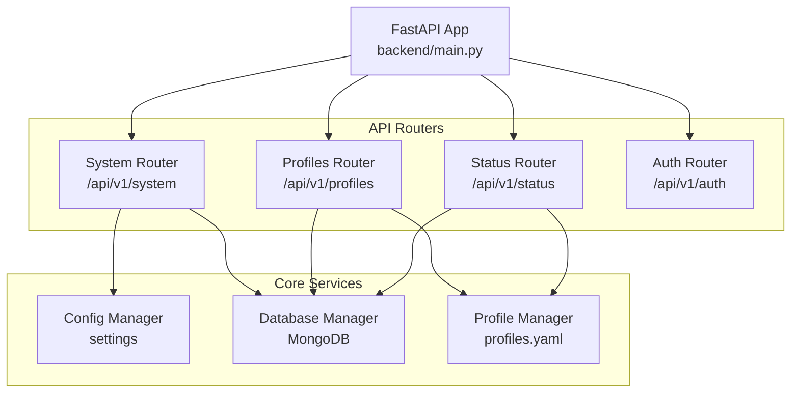
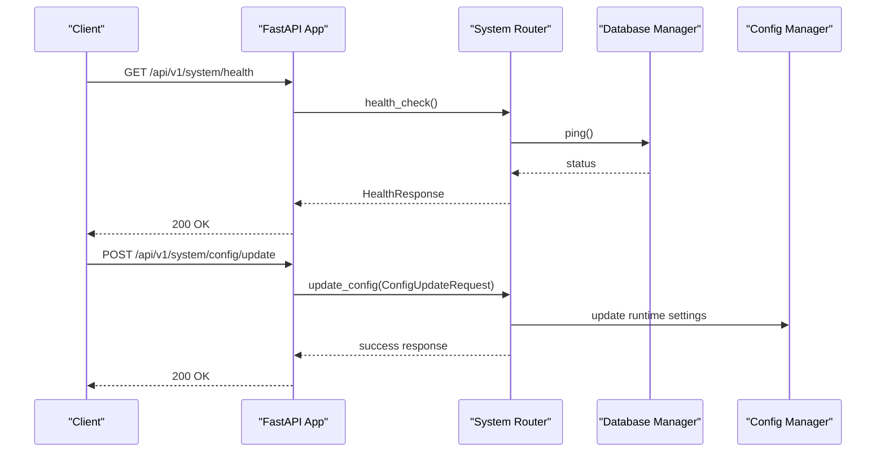
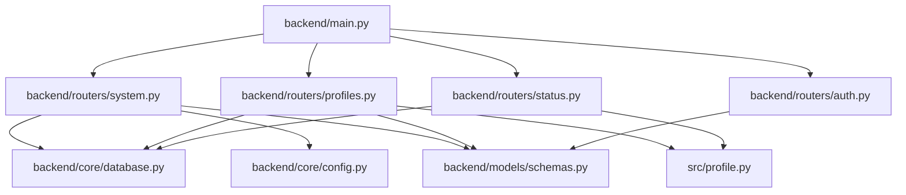

# System Management API

<cite>
**Referenced Files in This Document**
- [backend/main.py](file://backend/main.py)
- [backend/routers/system.py](file://backend/routers/system.py)
- [backend/routers/profiles.py](file://backend/routers/profiles.py)
- [backend/routers/status.py](file://backend/routers/status.py)
- [backend/routers/auth.py](file://backend/routers/auth.py)
- [backend/models/schemas.py](file://backend/models/schemas.py)
- [backend/core/config.py](file://backend/core/config.py)
- [backend/core/database.py](file://backend/core/database.py)
- [src/profile.py](file://src/profile.py)
</cite>

## Table of Contents
1. [Introduction](#introduction)
2. [Project Structure](#project-structure)
3. [Core Components](#core-components)
4. [Architecture Overview](#architecture-overview)
5. [Detailed Component Analysis](#detailed-component-analysis)
6. [Dependency Analysis](#dependency-analysis)
7. [Performance Considerations](#performance-considerations)
8. [Troubleshooting Guide](#troubleshooting-guide)
9. [Conclusion](#conclusion)

## Introduction
This document provides comprehensive API documentation for system administration and management endpoints in the RecallHub platform. It covers:
- System configuration and health monitoring under `/api/v1/system`
- Profile management for multi-tenant database isolation under `/api/v1/profiles`
- Status dashboards and operational metrics under `/api/v1/status`
- Administrative functions including user management, access control matrices, and system maintenance operations

The documentation includes endpoint definitions, request/response schemas, access control requirements, and practical examples for system setup, profile configuration, and troubleshooting.

## Project Structure
The system is built with FastAPI and organized into modular routers:
- System management: health checks, configuration, database operations, model listings
- Profile management: multi-tenant isolation, cloud source associations, Airbyte configuration
- Status dashboard: system metrics, per-profile KPIs, detailed health checks
- Authentication and authorization: user management, access matrices, admin controls

**Diagram sources**
- [backend/main.py](file://backend/main.py#L398-L500)
- [backend/routers/system.py](file://backend/routers/system.py#L1-L120)
- [backend/routers/profiles.py](file://backend/routers/profiles.py#L1-L50)
- [backend/routers/status.py](file://backend/routers/status.py#L1-L40)
- [backend/core/database.py](file://backend/core/database.py#L28-L120)
- [src/profile.py](file://src/profile.py#L174-L234)

**Section sources**
- [backend/main.py](file://backend/main.py#L398-L500)

## Core Components
- System Router: Provides health checks, statistics, configuration retrieval, index management, database operations, and model discovery.
- Profiles Router: Manages multi-tenant profiles, database isolation, cloud source associations, and Airbyte configuration.
- Status Router: Offers system metrics, per-profile KPIs, and detailed health diagnostics.
- Auth Router: Handles user management, access matrices, and administrative controls.

**Section sources**
- [backend/routers/system.py](file://backend/routers/system.py#L88-L144)
- [backend/routers/profiles.py](file://backend/routers/profiles.py#L27-L98)
- [backend/routers/status.py](file://backend/routers/status.py#L74-L131)
- [backend/routers/auth.py](file://backend/routers/auth.py#L517-L623)

## Architecture Overview
The system integrates FastAPI with MongoDB for RAG operations, supports profile-based multi-tenancy, and exposes administrative endpoints protected by authentication and authorization.

**Diagram sources**
- [backend/routers/system.py](file://backend/routers/system.py#L88-L111)
- [backend/routers/system.py](file://backend/routers/system.py#L699-L740)
- [backend/core/database.py](file://backend/core/database.py#L40-L62)
- [backend/core/config.py](file://backend/core/config.py#L184-L218)

## Detailed Component Analysis

### System Management Endpoints (/api/v1/system)
- Health Check: Returns API and database health status, version, and uptime.
- Statistics: Returns database stats, index status, and current configuration.
- Configuration: Retrieves non-sensitive configuration values and active profile.
- Index Operations: Lists indexes, creates vector/text search indexes, and retrieves index statistics.
- Database Operations: Checks database existence, creates required collections and indexes, tests connection.
- Model Discovery: Lists available LLM and embedding models with caching.
- Runtime Configuration: Updates runtime settings and persists configuration to database.
- Information: Returns API metadata and endpoint references.

Access Control:
- Most endpoints are publicly accessible for monitoring.
- Administrative endpoints (e.g., database creation, config save) require admin privileges.

Request/Response Schemas:
- HealthResponse: status, database, version, uptime_seconds
- SystemStatsResponse: database, indexes, config
- ConfigResponse: llm_provider, llm_model, embedding_provider, embedding_model, embedding_dimension, default_match_count, active_profile, database
- ConfigUpdateRequest: llm_model, embedding_model, embedding_dimension, default_match_count
- DatabaseCreateRequest: database, create_indexes

Example Requests:
- Health Check: GET /api/v1/system/health
- Get Stats: GET /api/v1/system/stats
- Get Config: GET /api/v1/system/config
- Create Indexes: POST /api/v1/system/indexes/create
- Create Database: POST /api/v1/system/database/create
- Test Connection: POST /api/v1/system/database/test-connection
- Update Config: POST /api/v1/system/config/update
- Save Config: POST /api/v1/system/config/save

**Section sources**
- [backend/routers/system.py](file://backend/routers/system.py#L88-L144)
- [backend/routers/system.py](file://backend/routers/system.py#L174-L224)
- [backend/routers/system.py](file://backend/routers/system.py#L226-L357)
- [backend/routers/system.py](file://backend/routers/system.py#L1100-L1167)
- [backend/routers/system.py](file://backend/routers/system.py#L1169-L1242)
- [backend/routers/system.py](file://backend/routers/system.py#L1245-L1277)
- [backend/routers/system.py](file://backend/routers/system.py#L482-L582)
- [backend/routers/system.py](file://backend/routers/system.py#L591-L674)
- [backend/routers/system.py](file://backend/routers/system.py#L677-L740)
- [backend/routers/system.py](file://backend/routers/system.py#L743-L795)
- [backend/models/schemas.py](file://backend/models/schemas.py#L320-L345)
- [backend/models/schemas.py](file://backend/models/schemas.py#L318-L334)
- [backend/models/schemas.py](file://backend/models/schemas.py#L335-L345)

### Profile Management Endpoints (/api/v1/profiles)
- Profile Listing: Returns accessible profiles and active profile key.
- Active Profile: Retrieves current active profile configuration.
- Switch Profile: Switches active profile and updates database connection.
- Create/Delete/Update Profile: Admin-only operations for profile lifecycle.
- Cloud Source Management: List/add/update/remove cloud source connections per profile.
- Airbyte Configuration: Get/update Airbyte workspace and destination per profile.

Access Control:
- List/Get endpoints require authentication.
- Switch/Create/Delete/Update require admin privileges.
- Cloud source operations require access to the target profile.

Request/Response Schemas:
- ProfileListResponse: profiles (dict), active_profile
- ProfileConfig: name, description, owner_user_id, documents_folders, database, collection_documents, collection_chunks, vector_index, text_index, embedding_model, llm_model, airbyte, cloud_sources
- ProfileSwitchRequest: profile_key
- ProfileCreateRequest: key, name, description, documents_folders, database, owner_user_id
- ProfileUpdateRequest: name, description, documents_folders, database, owner_user_id
- CloudSourceAssociation: connection_id, provider_type, display_name, airbyte_source_id, airbyte_connection_id, enabled, sync_schedule, last_sync_at, last_sync_status, include_paths, exclude_paths, collection_prefix
- AirbyteConfig: workspace_id, workspace_name, destination_id, default_sync_mode, default_schedule_type, default_schedule_cron
- AirbyteConfigUpdateRequest: workspace_id, workspace_name, destination_id, default_sync_mode, default_schedule_type, default_schedule_cron

Example Requests:
- List Profiles: GET /api/v1/profiles
- Get Active Profile: GET /api/v1/profiles/active
- Switch Profile: POST /api/v1/profiles/switch
- Create Profile: POST /api/v1/profiles/create
- Update Profile: PUT /api/v1/profiles/{profile_key}
- Delete Profile: DELETE /api/v1/profiles/{profile_key}
- List Cloud Sources: GET /api/v1/profiles/{profile_key}/cloud-sources
- Add Cloud Source: POST /api/v1/profiles/{profile_key}/cloud-sources
- Update Cloud Source: PUT /api/v1/profiles/{profile_key}/cloud-sources/{connection_id}
- Remove Cloud Source: DELETE /api/v1/profiles/{profile_key}/cloud-sources/{connection_id}
- Get Airbyte Config: GET /api/v1/profiles/{profile_key}/airbyte
- Update Airbyte Config: PUT /api/v1/profiles/{profile_key}/airbyte

**Section sources**
- [backend/routers/profiles.py](file://backend/routers/profiles.py#L27-L98)
- [backend/routers/profiles.py](file://backend/routers/profiles.py#L101-L162)
- [backend/routers/profiles.py](file://backend/routers/profiles.py#L164-L209)
- [backend/routers/profiles.py](file://backend/routers/profiles.py#L211-L259)
- [backend/routers/profiles.py](file://backend/routers/profiles.py#L262-L307)
- [backend/routers/profiles.py](file://backend/routers/profiles.py#L310-L358)
- [backend/routers/profiles.py](file://backend/routers/profiles.py#L364-L434)
- [backend/routers/profiles.py](file://backend/routers/profiles.py#L437-L507)
- [backend/routers/profiles.py](file://backend/routers/profiles.py#L510-L580)
- [backend/routers/profiles.py](file://backend/routers/profiles.py#L583-L632)
- [backend/routers/profiles.py](file://backend/routers/profiles.py#L638-L682)
- [backend/routers/profiles.py](file://backend/routers/profiles.py#L685-L731)
- [backend/models/schemas.py](file://backend/models/schemas.py#L115-L130)
- [backend/models/schemas.py](file://backend/models/schemas.py#L138-L141)
- [backend/models/schemas.py](file://backend/models/schemas.py#L143-L160)
- [backend/models/schemas.py](file://backend/models/schemas.py#L174-L188)
- [backend/models/schemas.py](file://backend/models/schemas.py#L164-L172)
- [backend/models/schemas.py](file://backend/models/schemas.py#L223-L231)
- [src/profile.py](file://src/profile.py#L90-L162)
- [src/profile.py](file://src/profile.py#L40-L68)
- [src/profile.py](file://src/profile.py#L70-L88)

### Status Dashboard Endpoints (/api/v1/status)
- Dashboard: Returns system metrics, per-profile stats, totals, and active profile.
- Metrics by Profile: Detailed metrics for a specific profile including file type distribution and chunk statistics.
- Detailed Health: Component-level health including database, vector/text indexes, and API key configuration.

Access Control:
- Requires admin authentication.

Request/Response Schemas:
- StatusDashboard: profiles (list), active_profile, system_metrics, total_documents, total_chunks, total_profiles, api_uptime_seconds, llm_provider, llm_model, embedding_model
- SystemMetrics: cpu_percent, memory_percent, memory_used_gb, memory_total_gb, disk_percent, disk_used_gb, disk_total_gb, uptime_seconds
- ProfileStats: profile_key, profile_name, database, documents_count, chunks_count, total_tokens, avg_chunk_size, storage_size_bytes, last_ingestion, ingestion_jobs_count

Example Requests:
- Dashboard: GET /api/v1/status/dashboard
- Profile Metrics: GET /api/v1/status/metrics/profile/{profile_key}
- Detailed Health: GET /api/v1/status/health/detailed

**Section sources**
- [backend/routers/status.py](file://backend/routers/status.py#L74-L131)
- [backend/routers/status.py](file://backend/routers/status.py#L227-L250)
- [backend/routers/status.py](file://backend/routers/status.py#L295-L352)
- [backend/models/schemas.py](file://backend/models/schemas.py#L24-L48)
- [backend/models/schemas.py](file://backend/models/schemas.py#L38-L48)
- [backend/models/schemas.py](file://backend/models/schemas.py#L24-L36)

### Administrative Functions
- User Management: Admin endpoints to create, update, and manage users.
- Access Matrix: Retrieve and modify profile access for users; admin users have access to all profiles.
- Profile Access Control: Grant/revoke access per user and profile.

Access Control:
- Admin-only endpoints.

Request/Response Schemas:
- UserListResponse: id, email, name, is_active, is_admin, created_at
- ProfileAccessMatrix: users (list), profiles (list), access (dict)
- SetAccessRequest: user_id, profile_key, has_access
- AdminCreateUserRequest: email, name, password, is_admin
- AdminUpdateUserRequest: name, email, is_admin, new_password
- UserStatusRequest: is_active

Example Requests:
- List Users: GET /api/v1/auth/users
- Get Access Matrix: GET /api/v1/auth/access-matrix
- Set Profile Access: POST /api/v1/auth/access
- Create User: POST /api/v1/auth/users/create
- Update User: PUT /api/v1/auth/users/{user_id}
- Set User Status: PUT /api/v1/auth/users/{user_id}/status
- Delete User: DELETE /api/v1/auth/users/{user_id}

**Section sources**
- [backend/routers/auth.py](file://backend/routers/auth.py#L517-L534)
- [backend/routers/auth.py](file://backend/routers/auth.py#L537-L579)
- [backend/routers/auth.py](file://backend/routers/auth.py#L582-L622)
- [backend/routers/auth.py](file://backend/routers/auth.py#L688-L731)
- [backend/routers/auth.py](file://backend/routers/auth.py#L734-L799)
- [backend/routers/auth.py](file://backend/routers/auth.py#L625-L662)
- [backend/models/schemas.py](file://backend/models/schemas.py#L480-L510)
- [backend/models/schemas.py](file://backend/models/schemas.py#L667-L686)
- [backend/models/schemas.py](file://backend/models/schemas.py#L683-L686)

## Dependency Analysis
The system relies on:
- FastAPI for routing and middleware
- MongoDB via Motor (async) and PyMongo (sync) for database operations
- Pydantic models for request/response validation
- Profile manager for multi-tenant configuration
- Authentication and authorization for access control

**Diagram sources**
- [backend/main.py](file://backend/main.py#L28-L500)
- [backend/routers/system.py](file://backend/routers/system.py#L1-L120)
- [backend/routers/profiles.py](file://backend/routers/profiles.py#L1-L50)
- [backend/routers/status.py](file://backend/routers/status.py#L1-L40)
- [backend/routers/auth.py](file://backend/routers/auth.py#L1-L50)
- [backend/models/schemas.py](file://backend/models/schemas.py#L1-L60)
- [backend/core/config.py](file://backend/core/config.py#L1-L60)
- [backend/core/database.py](file://backend/core/database.py#L1-L60)
- [src/profile.py](file://src/profile.py#L1-L60)

**Section sources**
- [backend/main.py](file://backend/main.py#L28-L500)
- [backend/core/database.py](file://backend/core/database.py#L28-L120)
- [src/profile.py](file://src/profile.py#L174-L234)

## Performance Considerations
- Thread Pool Separation: Dedicated executors for database operations to prevent blocking API requests.
- Caching: Model lists are cached to reduce external API calls.
- Estimated Counts: Uses estimated_document_count for faster stats retrieval.
- Async/Sync Split: Async operations for API, sync operations for blocking DB commands.

[No sources needed since this section provides general guidance]

## Troubleshooting Guide
Common issues and resolutions:
- Database Connectivity: Use `/api/v1/system/database/test-connection` to verify connectivity and server info.
- Index Creation Failures: Check vector and text index definitions; ensure embedding dimension matches configuration.
- Profile Switch Failures: Confirm the profile exists and user has access; verify database connection switched successfully.
- Admin Access Required: Many system endpoints require admin privileges; ensure proper authentication and authorization.
- Slow Requests: Monitor request timeouts and consider scaling workers or optimizing queries.

**Section sources**
- [backend/routers/system.py](file://backend/routers/system.py#L1245-L1277)
- [backend/routers/system.py](file://backend/routers/system.py#L226-L357)
- [backend/routers/profiles.py](file://backend/routers/profiles.py#L101-L162)
- [backend/routers/auth.py](file://backend/routers/auth.py#L273-L284)

## Conclusion
The System Management API provides robust administrative capabilities for health monitoring, configuration management, multi-tenant profile isolation, and operational insights. By leveraging structured schemas, strict access controls, and efficient database operations, administrators can reliably operate and troubleshoot the RecallHub platform.