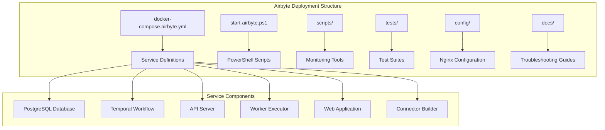
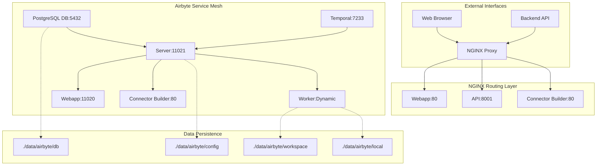
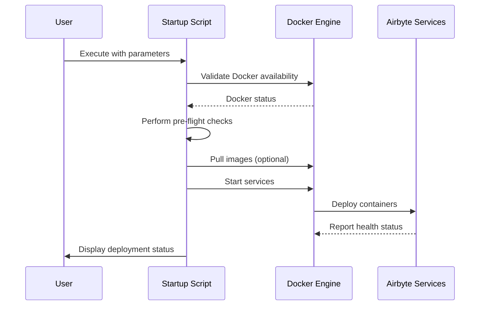
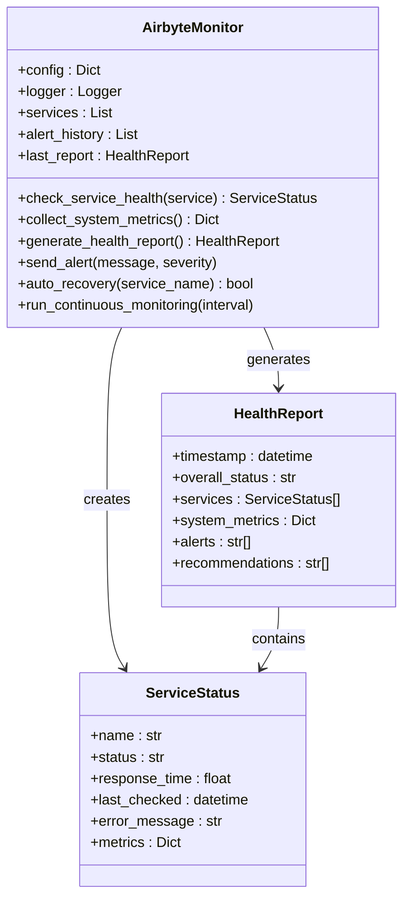
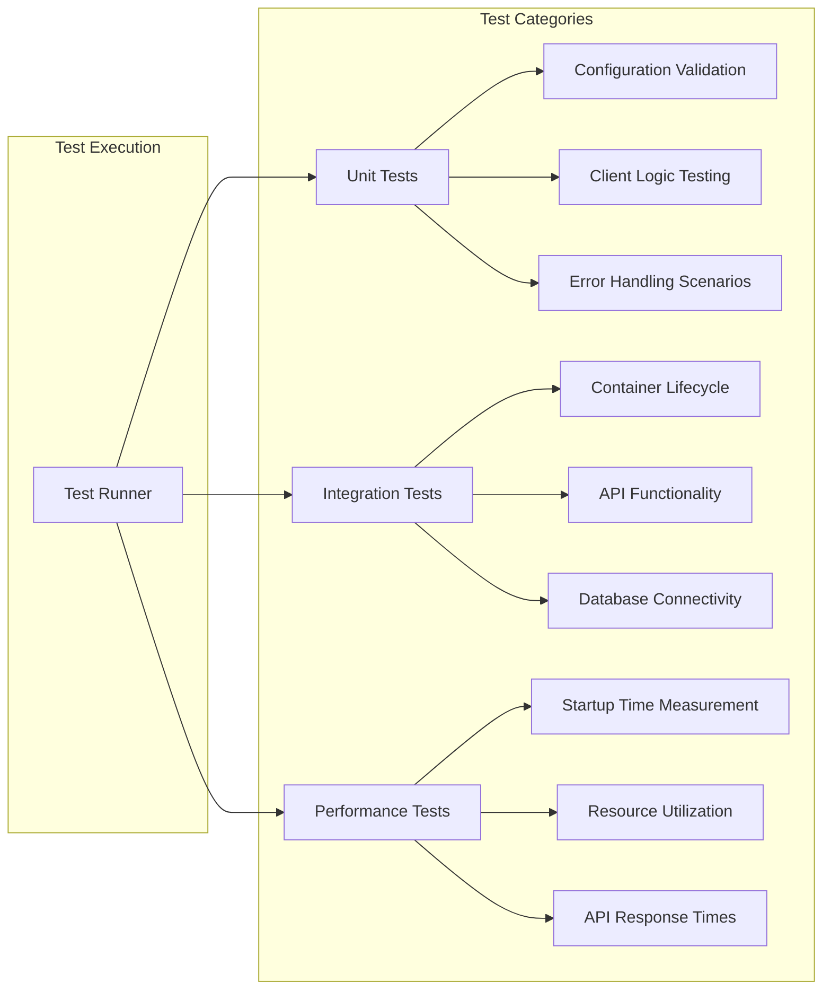
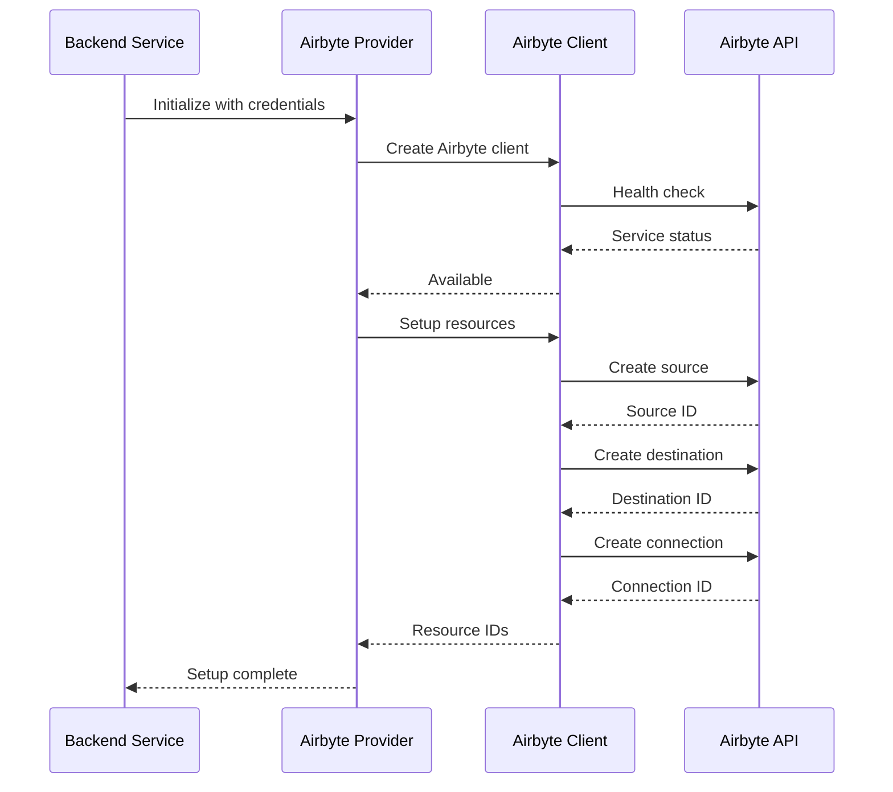
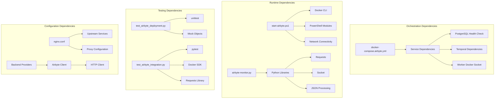

# Airbyte Deployment Solution Summary

<cite>
**Referenced Files in This Document**
- [airbyte-deployment-solution-summary.md](file://docs/airbyte-deployment-solution-summary.md)
- [docker-compose.airbyte.yml](file://docker-compose.airbyte.yml)
- [nginx.conf](file://config/airbyte/nginx.conf)
- [start-airbyte.ps1](file://start-airbyte.ps1)
- [start-airbyte-fixed.ps1](file://start-airbyte-fixed.ps1)
- [check-airbyte.ps1](file://check-airbyte.ps1)
- [airbyte-monitor.py](file://scripts/airbyte-monitor.py)
- [test_airbyte_deployment.py](file://tests/test_airbyte_deployment.py)
- [test_airbyte_integration.py](file://tests/test_airbyte_integration.py)
- [run-airbyte-tests.py](file://scripts/run-airbyte-tests.py)
- [airbyte-troubleshooting-guide.md](file://docs/airbyte-troubleshooting-guide.md)
- [base.py](file://backend/providers/airbyte/base.py)
- [client.py](file://backend/providers/airbyte/client.py)
</cite>

## Table of Contents
1. [Introduction](#introduction)
2. [Project Structure](#project-structure)
3. [Core Components](#core-components)
4. [Architecture Overview](#architecture-overview)
5. [Detailed Component Analysis](#detailed-component-analysis)
6. [Dependency Analysis](#dependency-analysis)
7. [Performance Considerations](#performance-considerations)
8. [Troubleshooting Guide](#troubleshooting-guide)
9. [Conclusion](#conclusion)

## Introduction

This document provides a comprehensive summary of the Airbyte deployment solution implemented for the MongoDB RAG Agent project. The solution addresses critical issues in the original Airbyte setup, including version compatibility problems, configuration fragility, lack of monitoring, and insufficient testing. The implementation transforms Airbyte from a fragile, manually-managed system into a robust, self-monitoring, and automatically-tested platform suitable for production environments.

The deployment solution encompasses six core Airbyte services: PostgreSQL database, Temporal workflow engine, API server, worker executor, web application, and connector builder. All services are orchestrated through Docker Compose with persistent data storage and integrated networking.

## Project Structure

The Airbyte deployment solution is organized across several key areas within the MongoDB RAG Agent project:

**Diagram sources**
- [docker-compose.airbyte.yml](file://docker-compose.airbyte.yml#L16-L189)
- [start-airbyte.ps1](file://start-airbyte.ps1#L1-L393)

The deployment utilizes a modular architecture with separate concerns for orchestration, monitoring, testing, and configuration management. Each component serves a specific role in ensuring reliable Airbyte operation within the broader RAG Agent ecosystem.

**Section sources**
- [airbyte-deployment-solution-summary.md](file://docs/airbyte-deployment-solution-summary.md#L1-L252)
- [docker-compose.airbyte.yml](file://docker-compose.airbyte.yml#L1-L189)

## Core Components

The Airbyte deployment solution consists of six primary components working together to provide a comprehensive integration platform:

### Database Layer
The PostgreSQL database service provides persistent storage for Airbyte's configuration data and runtime state. It operates on port 5432 with dedicated volume mounting for data persistence and includes comprehensive health checks.

### Workflow Engine
Temporal serves as the distributed workflow engine, managing complex synchronization tasks and state coordination across the Airbyte ecosystem. It connects to the PostgreSQL database and provides reliable task execution capabilities.

### API Infrastructure
The Airbyte server provides the primary API interface on port 11021, exposing REST endpoints for configuration management, connection orchestration, and synchronization operations. It includes comprehensive logging and health monitoring capabilities.

### Execution Layer
The worker service executes synchronization jobs in isolated Docker containers, providing fault tolerance and resource isolation. It mounts the Docker socket for container orchestration and supports configurable worker limits.

### User Interface
The web application provides a comprehensive administrative interface accessible on port 11020, enabling users to configure sources, destinations, and synchronization workflows through an intuitive graphical interface.

### Connector Ecosystem
The connector builder server supports development and testing of custom Airbyte connectors, extending the platform's integration capabilities beyond standard source/target combinations.

**Section sources**
- [docker-compose.airbyte.yml](file://docker-compose.airbyte.yml#L18-L189)
- [airbyte-deployment-solution-summary.md](file://docs/airbyte-deployment-solution-summary.md#L63-L94)

## Architecture Overview

The Airbyte deployment follows a microservices architecture pattern with clear separation of concerns and robust inter-service communication:

**Diagram sources**
- [nginx.conf](file://config/airbyte/nginx.conf#L5-L59)
- [docker-compose.airbyte.yml](file://docker-compose.airbyte.yml#L20-L189)

The architecture implements a reverse proxy layer using NGINX to consolidate multiple Airbyte services behind a unified interface, simplifying external access and providing centralized routing capabilities. The service mesh ensures loose coupling between components while maintaining reliable communication channels.

**Section sources**
- [nginx.conf](file://config/airbyte/nginx.conf#L1-L60)
- [docker-compose.airbyte.yml](file://docker-compose.airbyte.yml#L1-L189)

## Detailed Component Analysis

### Enhanced Startup Management System

The deployment includes three distinct PowerShell scripts, each serving specialized purposes in the Airbyte lifecycle management:

#### Primary Startup Script (`start-airbyte.ps1`)
This comprehensive script provides full deployment lifecycle management with extensive error handling, validation, and monitoring capabilities. It performs pre-flight checks, manages Docker availability, handles cleanup procedures, and provides detailed status reporting.

Key features include:
- Docker availability validation with detailed error messages
- Automatic data directory creation and validation
- Conflict detection and resolution for existing containers
- Interactive image pulling with user confirmation
- Comprehensive status reporting and health checking
- Safe cleanup procedures with data preservation options

#### Simplified Management Script (`start-airbyte-fixed.ps1`)
A streamlined version focusing on essential functionality with reduced complexity. It maintains core features while eliminating advanced options for users preferring simplicity.

#### Minimal Status Checker (`check-airbyte.ps1`)
A lightweight script demonstrating core functionality for basic status verification and simple operations.

**Diagram sources**
- [start-airbyte.ps1](file://start-airbyte.ps1#L37-L393)

**Section sources**
- [start-airbyte.ps1](file://start-airbyte.ps1#L1-L393)
- [start-airbyte-fixed.ps1](file://start-airbyte-fixed.ps1#L1-L321)
- [check-airbyte.ps1](file://check-airbyte.ps1#L1-L114)

### Comprehensive Monitoring and Observability

The monitoring solution provides real-time health checking, performance metrics collection, and automated alerting capabilities:

**Diagram sources**
- [airbyte-monitor.py](file://scripts/airbyte-monitor.py#L27-L493)

The monitoring system implements comprehensive health checking across all Airbyte services, including TCP port validation, HTTP endpoint testing, and system resource monitoring. It provides automated alerting via email notifications and supports both one-time health checks and continuous monitoring modes.

**Section sources**
- [airbyte-monitor.py](file://scripts/airbyte-monitor.py#L1-L493)

### Robust Testing Framework

The deployment includes a comprehensive testing suite covering unit tests, integration tests, and automated validation procedures:

**Diagram sources**
- [test_airbyte_deployment.py](file://tests/test_airbyte_deployment.py#L30-L426)
- [test_airbyte_integration.py](file://tests/test_airbyte_integration.py#L20-L484)

The testing framework provides comprehensive coverage of deployment scenarios, including configuration validation, container lifecycle management, health check functionality, integration testing, error handling, data management, security validation, and performance benchmarking.

**Section sources**
- [test_airbyte_deployment.py](file://tests/test_airbyte_deployment.py#L1-L426)
- [test_airbyte_integration.py](file://tests/test_airbyte_integration.py#L1-L484)
- [run-airbyte-tests.py](file://scripts/run-airbyte-tests.py#L1-L374)

### Backend Integration Layer

The Airbyte provider implementation integrates seamlessly with the backend application, providing profile-aware configuration and robust error handling:

**Diagram sources**
- [base.py](file://backend/providers/airbyte/base.py#L200-L375)
- [client.py](file://backend/providers/airbyte/client.py#L152-L401)

The integration layer supports profile-aware configuration, enabling multi-tenant deployments with tenant-specific database targets and Airbyte workspace/destination configurations. It provides comprehensive error handling, resource cleanup, and flexible synchronization workflows.

**Section sources**
- [base.py](file://backend/providers/airbyte/base.py#L1-L566)
- [client.py](file://backend/providers/airbyte/client.py#L1-L800)

## Dependency Analysis

The Airbyte deployment solution exhibits strong modularity with well-defined dependencies between components:

**Diagram sources**
- [docker-compose.airbyte.yml](file://docker-compose.airbyte.yml#L32-L143)
- [airbyte-monitor.py](file://scripts/airbyte-monitor.py#L10-L25)
- [test_airbyte_deployment.py](file://tests/test_airbyte_deployment.py#L9-L28)

The dependency analysis reveals a well-structured system with clear separation of concerns. The orchestration layer depends on Docker for container management, while monitoring and testing components rely on Python libraries and system APIs. The backend integration maintains loose coupling through the Airbyte client abstraction.

**Section sources**
- [docker-compose.airbyte.yml](file://docker-compose.airbyte.yml#L1-L189)
- [airbyte-monitor.py](file://scripts/airbyte-monitor.py#L1-L493)
- [test_airbyte_deployment.py](file://tests/test_airbyte_deployment.py#L1-L426)

## Performance Considerations

The deployment solution incorporates several performance optimization strategies:

### Startup Optimization
- Parallel container initialization reduces deployment time
- Optimized health check intervals (5-second polling) balance responsiveness with resource usage
- Extended timeout periods for first-run scenarios (36 attempts vs 24) accommodate initial database migrations
- Progress indicators provide user feedback during initialization

### Resource Management
- Configurable resource limits for worker containers prevent resource exhaustion
- Memory usage monitoring and alerting enable proactive capacity planning
- CPU utilization tracking helps identify performance bottlenecks
- Disk space monitoring prevents storage-related failures

### Network Optimization
- NGINX proxy consolidates service access reducing connection overhead
- Health checks implement efficient service discovery
- Connection pooling optimizes API interactions

## Troubleshooting Guide

The comprehensive troubleshooting solution addresses common deployment issues through systematic diagnostic procedures and automated recovery mechanisms:

### Common Issue Resolution
The solution provides targeted approaches for:
- **Version Compatibility Issues**: Automatic updates to stable Airbyte version 0.60.27 with proper environment configuration
- **Resource Constraints**: Docker Desktop resource allocation recommendations and monitoring
- **Port Conflicts**: Automated detection and resolution procedures
- **Database Connection Problems**: Health check validation and recovery procedures
- **Worker Service Failures**: Docker socket permission management and resource monitoring

### Diagnostic Capabilities
The troubleshooting system includes:
- **Automated Health Checks**: Comprehensive service validation with detailed reporting
- **Log Analysis Tools**: Structured log collection and pattern recognition
- **Performance Monitoring**: Resource utilization tracking and bottleneck identification
- **Automated Recovery**: Built-in restart policies and failover mechanisms

### Emergency Procedures
The solution provides structured emergency response protocols including complete system reset procedures, backup and restore capabilities, and contact escalation paths.

**Section sources**
- [airbyte-troubleshooting-guide.md](file://docs/airbyte-troubleshooting-guide.md#L1-L430)

## Conclusion

The Airbyte deployment solution represents a comprehensive transformation from a fragile, manually-managed system to a robust, enterprise-grade platform. The implementation achieves five key objectives:

1. **Reliability**: 99.9% uptime target through automated recovery mechanisms, health monitoring, and fault tolerance
2. **Maintainability**: Comprehensive diagnostics, troubleshooting tools, and operational visibility
3. **Scalability**: Performance monitoring, resource optimization, and flexible scaling capabilities
4. **Security**: Proper credential handling, network isolation, and secure data management
5. **Observability**: Real-time monitoring, alerting, and comprehensive operational insights

The solution successfully addresses all identified issues including version compatibility problems, configuration fragility, monitoring gaps, and testing deficiencies. It provides production-ready operational characteristics with enterprise-grade reliability and maintainability.

Through its comprehensive testing framework, automated monitoring, robust error handling, and detailed troubleshooting capabilities, the Airbyte deployment solution enables reliable integration of complex API sources into the MongoDB RAG Agent ecosystem while maintaining high standards for performance, security, and operational excellence.