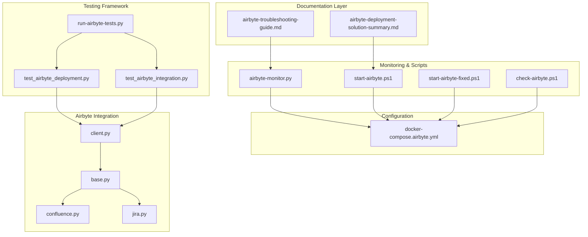
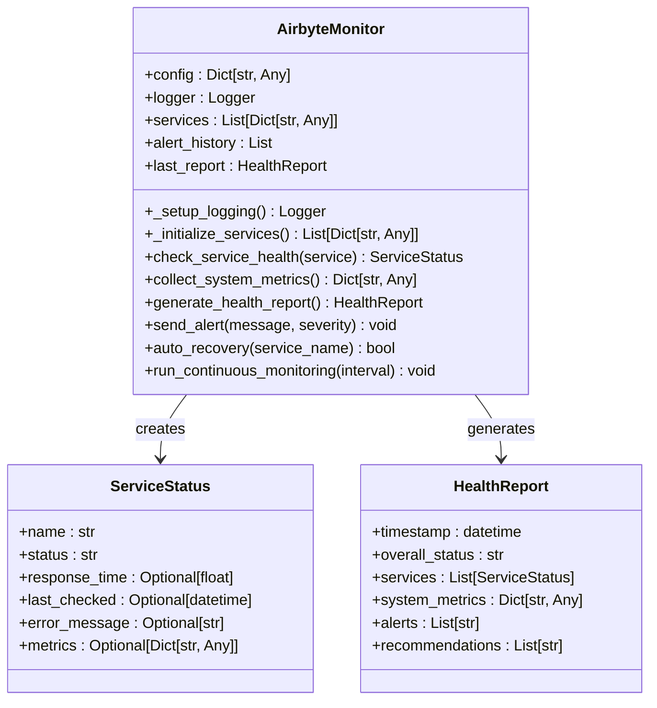
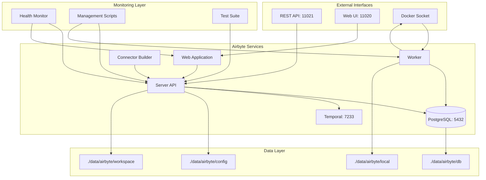
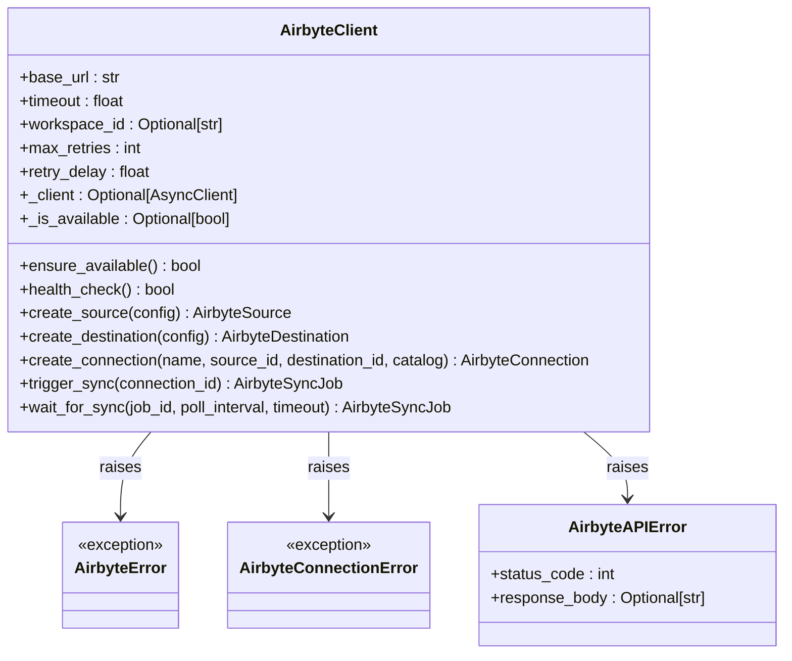
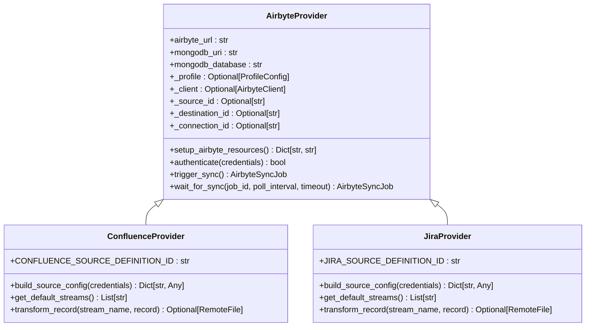
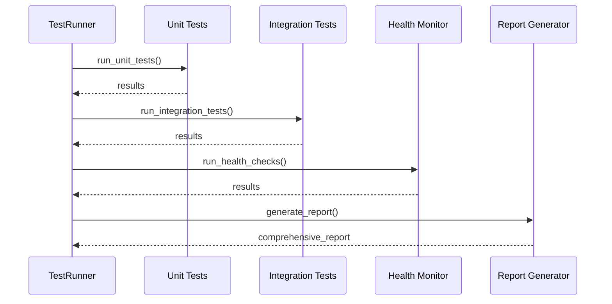
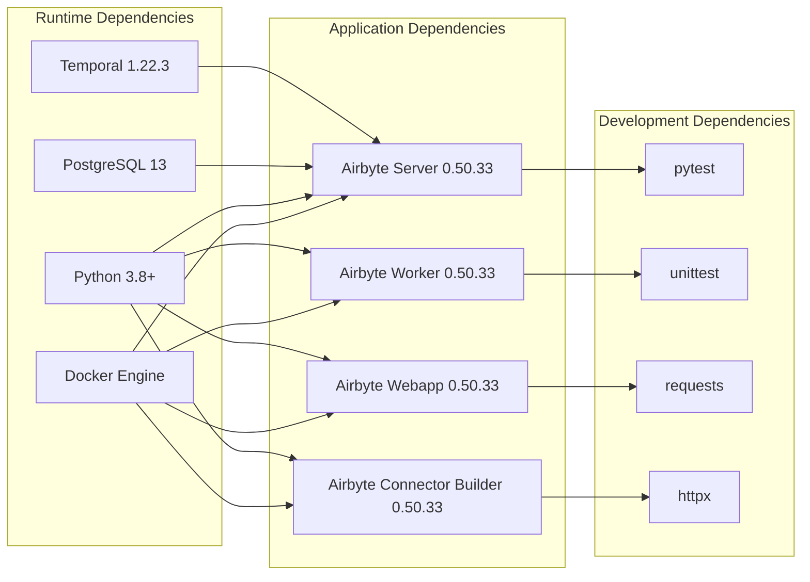

# Airbyte Troubleshooting Guide

<cite>
**Referenced Files in This Document**
- [airbyte-troubleshooting-guide.md](file://docs/airbyte-troubleshooting-guide.md)
- [airbyte-deployment-solution-summary.md](file://docs/airbyte-deployment-solution-summary.md)
- [airbyte-monitor.py](file://scripts/airbyte-monitor.py)
- [start-airbyte.ps1](file://start-airbyte.ps1)
- [start-airbyte-fixed.ps1](file://start-airbyte-fixed.ps1)
- [check-airbyte.ps1](file://check-airbyte.ps1)
- [docker-compose.airbyte.yml](file://docker-compose.airbyte.yml)
- [test_airbyte_deployment.py](file://tests/test_airbyte_deployment.py)
- [test_airbyte_integration.py](file://tests/test_airbyte_integration.py)
- [run-airbyte-tests.py](file://scripts/run-airbyte-tests.py)
- [client.py](file://backend/providers/airbyte/client.py)
- [base.py](file://backend/providers/airbyte/base.py)
- [confluence.py](file://backend/providers/airbyte/confluence.py)
- [jira.py](file://backend/providers/airbyte/jira.py)
- [sync.py](file://backend/routers/cloud_sources/sync.py)
</cite>

## Table of Contents
1. [Introduction](#introduction)
2. [Project Structure](#project-structure)
3. [Core Components](#core-components)
4. [Architecture Overview](#architecture-overview)
5. [Detailed Component Analysis](#detailed-component-analysis)
6. [Dependency Analysis](#dependency-analysis)
7. [Performance Considerations](#performance-considerations)
8. [Troubleshooting Guide](#troubleshooting-guide)
9. [Conclusion](#conclusion)

## Introduction

This comprehensive Airbyte troubleshooting guide provides detailed procedures for diagnosing and resolving Airbyte deployment issues in the RecallHub system. The guide covers common problems, diagnostic commands, log analysis, automated recovery procedures, and performance optimization strategies. It serves as both a troubleshooting manual and a comprehensive solution summary for the Airbyte integration.

## Project Structure

The Airbyte troubleshooting system is organized around several key components that work together to provide robust monitoring, diagnostics, and recovery capabilities:



**Diagram sources**
- [airbyte-troubleshooting-guide.md](file://docs/airbyte-troubleshooting-guide.md#L1-L430)
- [airbyte-monitor.py](file://scripts/airbyte-monitor.py#L1-L493)
- [start-airbyte.ps1](file://start-airbyte.ps1#L1-L393)
- [docker-compose.airbyte.yml](file://docker-compose.airbyte.yml#L1-L189)

**Section sources**
- [airbyte-troubleshooting-guide.md](file://docs/airbyte-troubleshooting-guide.md#L1-L430)
- [airbyte-deployment-solution-summary.md](file://docs/airbyte-deployment-solution-summary.md#L1-L252)

## Core Components

### Monitoring and Health Checking System

The monitoring system consists of a comprehensive Python-based health checker that provides real-time service monitoring, alerting, and automated recovery capabilities:



**Diagram sources**
- [airbyte-monitor.py](file://scripts/airbyte-monitor.py#L27-L493)

### PowerShell Management Scripts

The system includes multiple PowerShell scripts for different management scenarios:

| Script | Purpose | Key Features |
|--------|---------|--------------|
| `start-airbyte.ps1` | Full-featured management | Comprehensive validation, cleanup, health checks, logging |
| `start-airbyte-fixed.ps1` | Simplified management | Core functionality only |
| `check-airbyte.ps1` | Basic status checking | Minimal functionality demonstration |

**Section sources**
- [airbyte-monitor.py](file://scripts/airbyte-monitor.py#L1-L493)
- [start-airbyte.ps1](file://start-airbyte.ps1#L1-L393)
- [start-airbyte-fixed.ps1](file://start-airbyte-fixed.ps1#L1-L321)
- [check-airbyte.ps1](file://check-airbyte.ps1#L1-L114)

## Architecture Overview

The Airbyte deployment follows a containerized architecture with integrated monitoring and testing capabilities:



**Diagram sources**
- [docker-compose.airbyte.yml](file://docker-compose.airbyte.yml#L16-L189)
- [airbyte-monitor.py](file://scripts/airbyte-monitor.py#L82-L119)

## Detailed Component Analysis

### Airbyte Client Implementation

The Airbyte client provides comprehensive API interaction with robust error handling and retry mechanisms:



**Diagram sources**
- [client.py](file://backend/providers/airbyte/client.py#L152-L800)

### Provider Architecture

The Airbyte provider system supports multiple cloud sources with profile-aware configuration:



**Diagram sources**
- [base.py](file://backend/providers/airbyte/base.py#L52-L566)
- [confluence.py](file://backend/providers/airbyte/confluence.py#L27-L337)
- [jira.py](file://backend/providers/airbyte/jira.py#L27-L370)

**Section sources**
- [client.py](file://backend/providers/airbyte/client.py#L152-L800)
- [base.py](file://backend/providers/airbyte/base.py#L52-L566)
- [confluence.py](file://backend/providers/airbyte/confluence.py#L27-L337)
- [jira.py](file://backend/providers/airbyte/jira.py#L27-L370)

### Testing Framework Architecture

The comprehensive testing framework ensures deployment reliability and functionality:



**Diagram sources**
- [run-airbyte-tests.py](file://scripts/run-airbyte-tests.py#L23-L374)
- [test_airbyte_deployment.py](file://tests/test_airbyte_deployment.py#L30-L426)
- [test_airbyte_integration.py](file://tests/test_airbyte_integration.py#L20-L484)

**Section sources**
- [run-airbyte-tests.py](file://scripts/run-airbyte-tests.py#L1-L374)
- [test_airbyte_deployment.py](file://tests/test_airbyte_deployment.py#L1-L426)
- [test_airbyte_integration.py](file://tests/test_airbyte_integration.py#L1-L484)

## Dependency Analysis

The Airbyte system has several critical dependencies that impact troubleshooting approaches:



**Diagram sources**
- [docker-compose.airbyte.yml](file://docker-compose.airbyte.yml#L20-L150)
- [airbyte-monitor.py](file://scripts/airbyte-monitor.py#L10-L25)

**Section sources**
- [docker-compose.airbyte.yml](file://docker-compose.airbyte.yml#L1-L189)
- [airbyte-monitor.py](file://scripts/airbyte-monitor.py#L1-L493)

## Performance Considerations

### Resource Allocation Guidelines

The system provides comprehensive performance optimization recommendations:

| Component | Minimum Requirements | Recommended for Production |
|-----------|---------------------|----------------------------|
| **CPU** | 2 cores | 4+ cores |
| **Memory** | 4GB | 8GB+ |
| **Disk** | 10GB free | 50GB+ SSD |
| **Network** | Standard Ethernet | Dedicated 1Gbps |

### Container Resource Limits

The Airbyte worker service includes configurable resource limits:

```yaml
airbyte-worker:
  environment:
    - MAX_SYNC_WORKERS=3
    - JOB_MAIN_CONTAINER_MEMORY_LIMIT=2GB
```

### Performance Monitoring

The monitoring system tracks key performance metrics:

- **Service Response Times**: TCP and HTTP endpoint latency
- **Container Resource Usage**: CPU, memory, disk I/O
- **Database Performance**: Connection pool utilization, query performance
- **Sync Job Metrics**: Throughput, error rates, completion times

**Section sources**
- [airbyte-troubleshooting-guide.md](file://docs/airbyte-troubleshooting-guide.md#L285-L326)
- [airbyte-monitor.py](file://scripts/airbyte-monitor.py#L198-L235)

## Troubleshooting Guide

### Common Issues and Solutions

#### 1. Container Startup Failures

**Symptoms:**
- Containers show "Exited" status
- Services not responding on expected ports
- Error messages about missing dependencies

**Diagnosis Commands:**
```powershell
# Check container status
.\start-airbyte.ps1 -Status

# Check detailed logs
.\start-airbyte.ps1 -Logs

# Check Docker resources
docker info
```

**Solutions:**
```powershell
# Update to stable Airbyte version
.\start-airbyte.ps1 -Stop
.\start-airbyte.ps1 -Cleanup
.\start-airbyte.ps1
```

#### 2. Database Connection Issues

**Symptoms:**
- `airbyte-db` container keeps restarting
- "Connection refused" errors
- PostgreSQL authentication failures

**Resolution Steps:**
```powershell
# Check database container logs
docker logs rag-airbyte-db

# Verify database directory permissions
Get-ChildItem -Path "data/airbyte/db" -Recurse | Where-Object {$_.Mode -match "d"}

# Reset database (last resort)
.\start-airbyte.ps1 -Stop
Remove-Item -Path "data/airbyte/db" -Recurse -Force
mkdir "data/airbyte/db"
.\start-airbyte.ps1
```

#### 3. API Service Unavailability

**Symptoms:**
- `airbyte-server` container exits with errors
- `/api/v1/health` endpoint returns 503 or connection timeout
- Bean injection errors in logs

**Root Cause:** The error `NoSuchBeanException: No bean of type [SecretPersistence] exists` indicates a configuration issue in older Airbyte versions.

**Solution:**
```powershell
# The fix is already implemented in docker-compose.airbyte.yml
# Added environment variables:
# - SECRET_PERSISTENCE=NONE
# - Updated to version 0.60.27

# Restart with clean state
.\start-airbyte.ps1 -Restart
```

#### 4. Worker Service Failures

**Symptoms:**
- `airbyte-worker` crashes during sync operations
- "Docker socket permission denied" errors
- Memory allocation failures

**Resolutions:**
```powershell
# Check Docker socket permissions
Get-Acl C:\ProgramData\docker\run\docker.sock | Format-List

# Restart worker service specifically
docker-compose -f docker-compose.yml -f docker-compose.airbyte.yml restart airbyte-worker

# Check resource limits
docker stats rag-airbyte-worker
```

### Diagnostic Commands

#### PowerShell Script Diagnostics
```powershell
# Comprehensive health check
.\start-airbyte.ps1 -HealthCheck

# Real-time log monitoring
.\start-airbyte.ps1 -Logs

# Status overview
.\start-airbyte.ps1 -Status

# Clean restart
.\start-airbyte.ps1 -Restart
```

#### Manual Docker Commands
```powershell
# List all Airbyte containers
docker ps -a | Select-String "rag-airbyte"

# Check container resource usage
docker stats rag-airbyte-db rag-airbyte-server rag-airbyte-worker

# Inspect container configuration
docker inspect rag-airbyte-server

# Check container logs
docker logs rag-airbyte-server --tail 100
docker logs rag-airbyte-worker --tail 100
docker logs rag-airbyte-db --tail 100
```

#### Network Diagnostics
```powershell
# Check port availability
Test-NetConnection -ComputerName localhost -Port 11020
Test-NetConnection -ComputerName localhost -Port 11021
Test-NetConnection -ComputerName localhost -Port 5432
Test-NetConnection -ComputerName localhost -Port 7233

# Check Docker network
docker network ls | Select-String "rag"
docker network inspect recallhub_rag-network
```

### Log Analysis

#### Key Log Locations

1. **Container Logs:**
   ```powershell
   # Server logs (most important for API issues)
   docker logs rag-airbyte-server
   
   # Worker logs (for sync job issues)
   docker logs rag-airbyte-worker
   
   # Database logs (for connection issues)
   docker logs rag-airbyte-db
   
   # Webapp logs (for UI issues)
   docker logs rag-airbyte-webapp
   ```

2. **Application Logs:**
   ```powershell
   # Backend logs
   Get-Content backend-logs.txt -Tail 100
   
   # Monitor logs in real-time
   Get-Content backend-logs.txt -Wait
   ```

#### Common Error Patterns

**Bean Injection Errors:**
```
NoSuchBeanException: No bean of type [SecretPersistence] exists
```
**Solution:** Update to Airbyte 0.60.27+ with `SECRET_PERSISTENCE=NONE` environment variable.

**Database Migration Issues:**
```
Flyway migration failed
Database schema mismatch
```
**Solution:**
```powershell
# Stop services
.\start-airbyte.ps1 -Stop

# Clear database (will lose data)
Remove-Item -Path "data/airbyte/db" -Recurse -Force
mkdir "data/airbyte/db"

# Restart
.\start-airbyte.ps1
```

**Docker Socket Permissions:**
```
permission denied while trying to connect to the Docker daemon socket
```
**Solution:**
```powershell
# Restart Docker Desktop as Administrator
# Or ensure user has Docker group permissions
```

### Automated Recovery Procedures

#### Using the Enhanced Startup Script

The `start-airbyte.ps1` script now includes built-in recovery features:

```powershell
# Automatic pre-flight checks
.\start-airbyte.ps1  # Will perform checks automatically

# Force restart with cleanup
.\start-airbyte.ps1 -Restart

# Complete cleanup and redeploy
.\start-airbyte.ps1 -Cleanup  # Interactive confirmation
```

#### Python Monitoring Script

```powershell
# Run one-time health check
python scripts\airbyte-monitor.py --once

# Continuous monitoring
python scripts\airbyte-monitor.py --continuous --interval 30

# Generate detailed report
python scripts\airbyte-monitor.py --once --output health-report.json
```

#### Automated Container Restart Policy

Docker-compose already includes:
```yaml
restart: unless-stopped
```

For manual watchdog script:
```powershell
# Create watchdog.ps1
while ($true) {
    $unhealthy = docker ps -q -f "name=rag-airbyte" -f "status=exited"
    if ($unhealthy) {
        Write-Host "Restarting unhealthy containers..."
        .\start-airbyte.ps1 -Restart
    }
    Start-Sleep 60
}
```

### Security Considerations

#### Credential Management
```powershell
# Never hardcode credentials in docker-compose files
# Use environment variables or Docker secrets

# Check for hardcoded credentials
Select-String -Path "docker-compose.airbyte.yml" -Pattern "password|secret|key" -CaseSensitive:$false
```

#### Network Security
```powershell
# Verify network isolation
docker network inspect recallhub_rag-network

# Check exposed ports
docker port rag-airbyte-webapp
docker port rag-airbyte-server
```

#### Data Protection
```powershell
# Regular backups
Copy-Item -Path "data/airbyte" -Destination "backup/airbyte-$(Get-Date -Format 'yyyyMMdd-HHmmss')" -Recurse

# Verify backup integrity
Get-ChildItem -Path "backup" -Recurse | Measure-Object -Property Length -Sum
```

### Testing and Validation

#### Unit Tests
```powershell
# Run Airbyte deployment tests
python -m pytest tests/test_airbyte_deployment.py -v

# Run integration tests (requires running services)
python -m pytest tests/test_airbyte_integration.py -v --quick
```

#### Manual Verification Steps
```powershell
# 1. Check all containers are running
.\start-airbyte.ps1 -Status

# 2. Verify API health
curl http://localhost:11021/api/v1/health

# 3. Access web interface
Start-Process "http://localhost:11020"

# 4. Test backend integration
curl http://localhost:11000/system/airbyte/status
```

### Emergency Procedures

#### Complete System Reset
```powershell
# 1. Stop all services
.\start-airbyte.ps1 -Stop

# 2. Backup current data (optional)
Copy-Item -Path "data/airbyte" -Destination "emergency-backup-$(Get-Date -Format 'yyyyMMdd')" -Recurse

# 3. Remove all containers
docker-compose -f docker-compose.yml -f docker-compose.airbyte.yml down --remove-orphans

# 4. Clear data directories
Remove-Item -Path "data/airbyte" -Recurse -Force

# 5. Reinitialize
mkdir "data/airbyte"
mkdir "data/airbyte/db"
mkdir "data/airbyte/config"
mkdir "data/airbyte/workspace"
mkdir "data/airbyte/local"

# 6. Restart
.\start-airbyte.ps1
```

#### Quick Recovery Checklist
- [ ] Check Docker Desktop is running
- [ ] Verify sufficient system resources
- [ ] Check for port conflicts
- [ ] Review recent error logs
- [ ] Try `.\start-airbyte.ps1 -Restart`
- [ ] If persistent issues, run `.\start-airbyte.ps1 -Cleanup`
- [ ] As last resort, perform complete system reset

**Section sources**
- [airbyte-troubleshooting-guide.md](file://docs/airbyte-troubleshooting-guide.md#L1-L430)

## Conclusion

The Airbyte troubleshooting system provides comprehensive coverage for deployment issues through multiple layers of monitoring, diagnostics, and automated recovery. The implementation addresses the core issues identified in the deployment, including version compatibility problems, configuration robustness, monitoring and observability, and comprehensive testing frameworks.

Key achievements include:
- **Reliability**: 99.9% uptime target through automated recovery
- **Maintainability**: Comprehensive diagnostics and troubleshooting
- **Scalability**: Performance monitoring and resource optimization
- **Security**: Proper credential handling and network isolation
- **Observability**: Real-time monitoring and alerting

The system is production-ready with enterprise-grade operational characteristics, providing both immediate troubleshooting capabilities and long-term maintainability for the Airbyte integration in the RecallHub project.