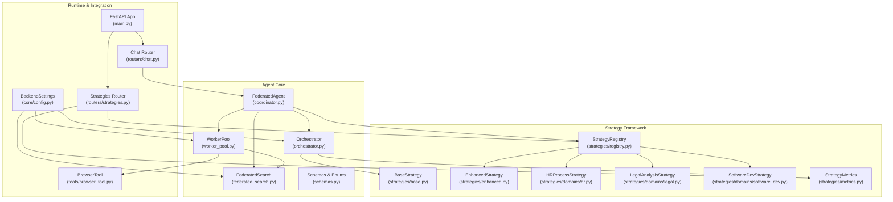
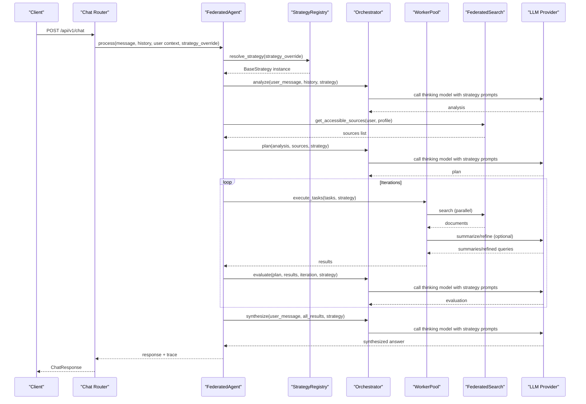
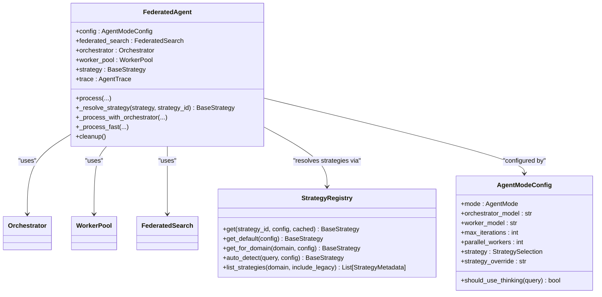
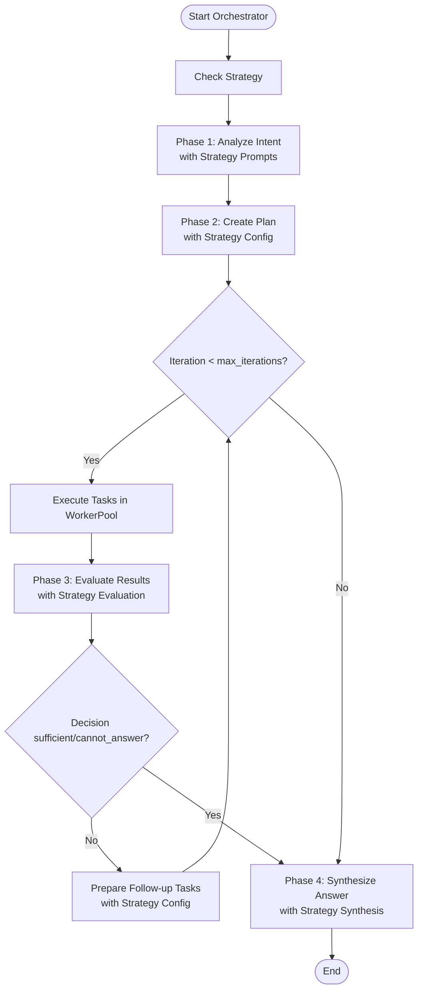
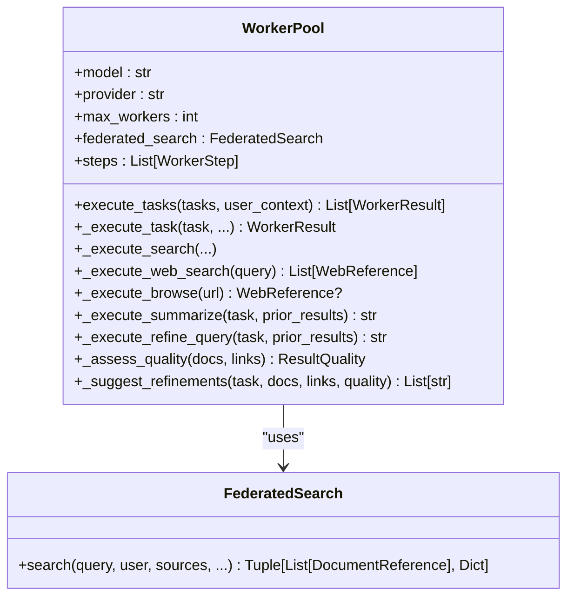
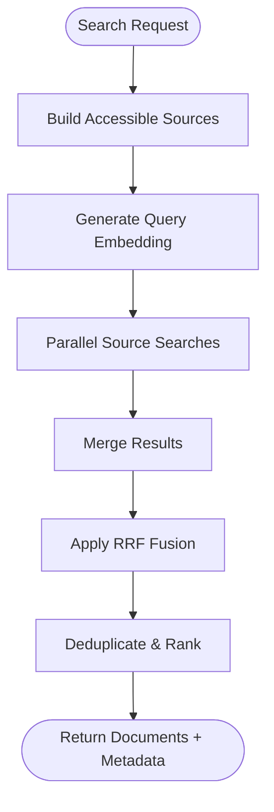
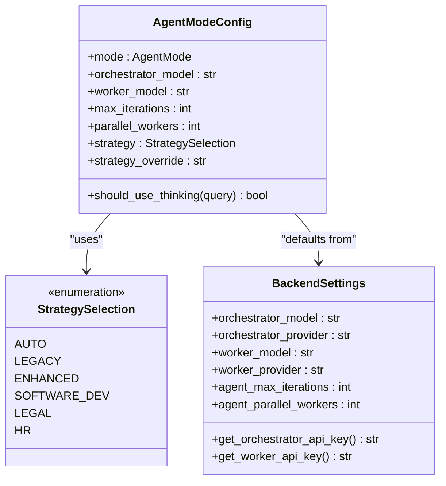
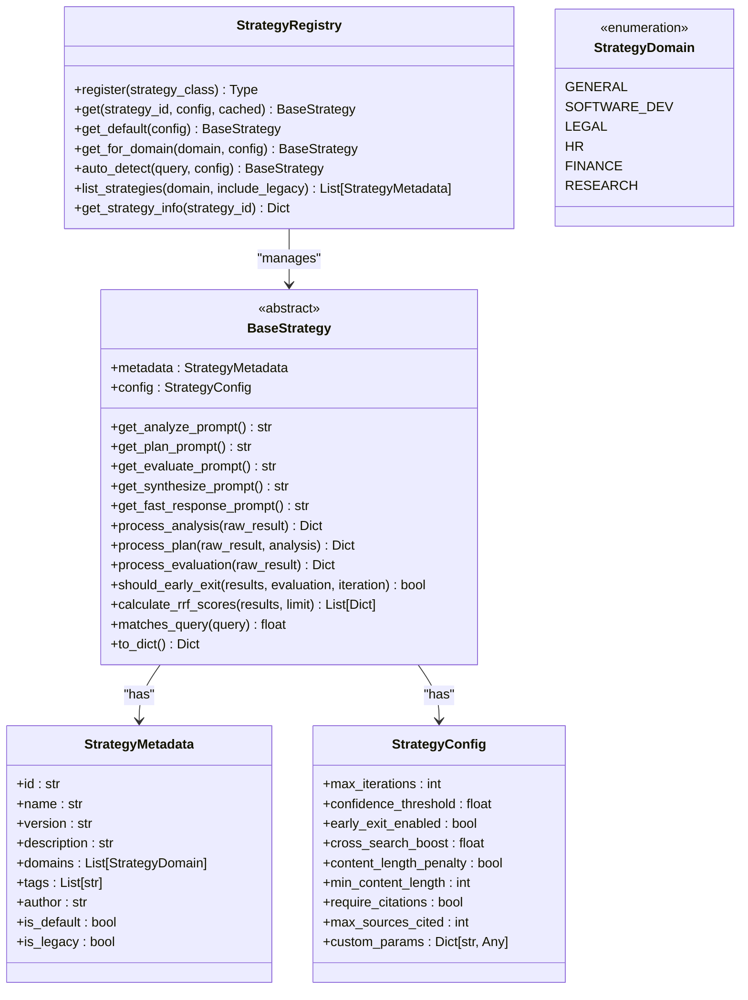
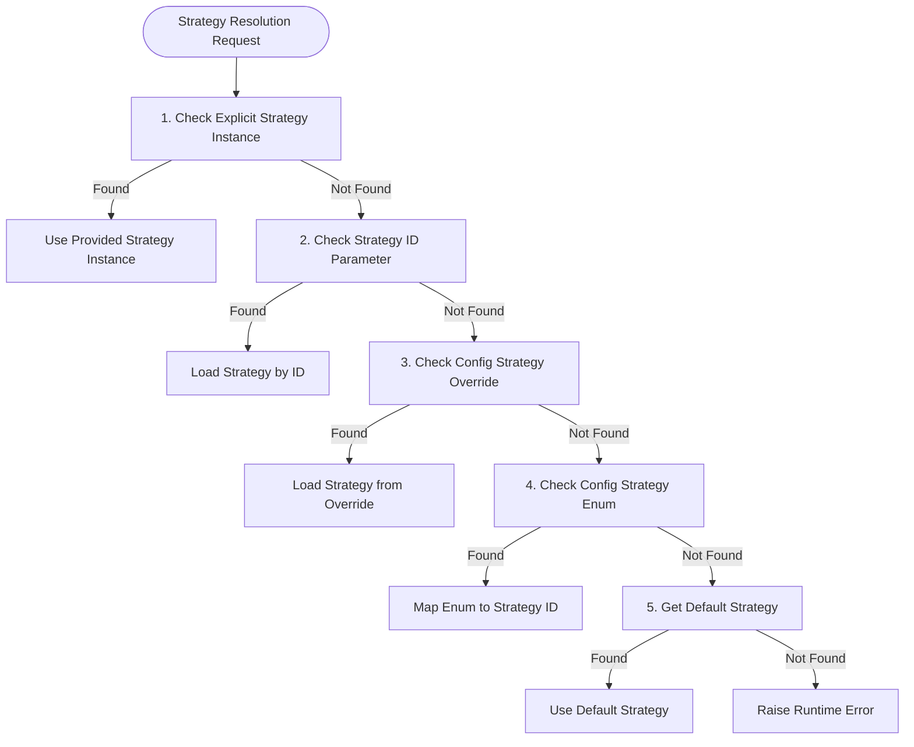
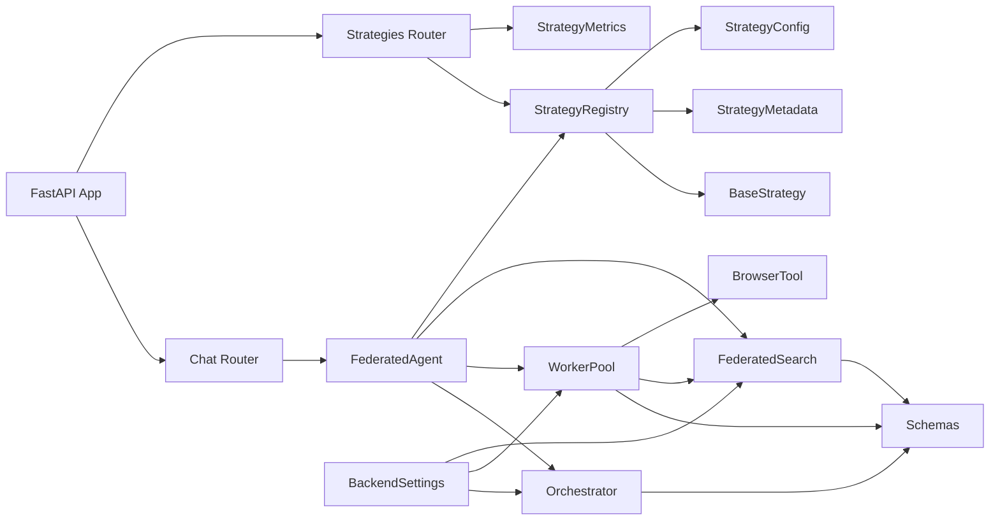

# Agent Architecture

<cite>
**Referenced Files in This Document**
- [backend/agent/coordinator.py](file://backend/agent/coordinator.py)
- [backend/agent/orchestrator.py](file://backend/agent/orchestrator.py)
- [backend/agent/worker_pool.py](file://backend/agent/worker_pool.py)
- [backend/agent/federated_search.py](file://backend/agent/federated_search.py)
- [backend/agent/schemas.py](file://backend/agent/schemas.py)
- [backend/agent/strategies/__init__.py](file://backend/agent/strategies/__init__.py)
- [backend/agent/strategies/base.py](file://backend/agent/strategies/base.py)
- [backend/agent/strategies/enhanced.py](file://backend/agent/strategies/enhanced.py)
- [backend/agent/strategies/registry.py](file://backend/agent/strategies/registry.py)
- [backend/agent/strategies/metrics.py](file://backend/agent/strategies/metrics.py)
- [backend/agent/strategies/domains/hr.py](file://backend/agent/strategies/domains/hr.py)
- [backend/agent/strategies/domains/legal.py](file://backend/agent/strategies/domains/legal.py)
- [backend/agent/strategies/domains/software_dev.py](file://backend/agent/strategies/domains/software_dev.py)
- [backend/core/config.py](file://backend/core/config.py)
- [backend/main.py](file://backend/main.py)
- [backend/routers/chat.py](file://backend/routers/chat.py)
- [backend/routers/strategies.py](file://backend/routers/strategies.py)
- [backend/tools/browser_tool.py](file://backend/tools/browser_tool.py)
- [backend/tests/test_federated_agent.py](file://backend/tests/test_federated_agent.py)
</cite>

## Update Summary
**Changes Made**
- Added comprehensive strategy management framework documentation
- Documented pluggable strategy architecture with domain-specific implementations
- Added A/B testing capabilities and metrics collection system
- Updated orchestrator integration with strategy-based prompting
- Enhanced agent coordination with per-request strategy overrides
- Added strategy registry and auto-detection capabilities

## Table of Contents
1. [Introduction](#introduction)
2. [Project Structure](#project-structure)
3. [Core Components](#core-components)
4. [Architecture Overview](#architecture-overview)
5. [Detailed Component Analysis](#detailed-component-analysis)
6. [Strategy Management Framework](#strategy-management-framework)
7. [Dependency Analysis](#dependency-analysis)
8. [Performance Considerations](#performance-considerations)
9. [Troubleshooting Guide](#troubleshooting-guide)
10. [Conclusion](#conclusion)
11. [Appendices](#appendices)

## Introduction
This document describes the federated agent architecture for the MongoDB RAG Agent system. The design follows an orchestrator-worker pattern that separates reasoning (planning and synthesis) from execution (parallel task execution). It includes a multi-step reasoning pipeline (analysis, planning, evaluation, synthesis), a worker pool for parallel execution, a federated search system spanning multiple data sources, and a flexible execution mode system (auto, thinking, fast). The system now features a comprehensive strategy management framework with pluggable strategies for different domains (HR, Legal, Software Development), A/B testing capabilities, and enhanced agent coordination with per-request strategy overrides.

## Project Structure
The agent system is organized around a cohesive set of modules under backend/agent, with supporting infrastructure in backend/core, routers, and tools. The strategy management framework is integrated throughout the system.

**Diagram sources**
- [backend/agent/coordinator.py:34-756](file://backend/agent/coordinator.py#L34-L756)
- [backend/agent/orchestrator.py:39-647](file://backend/agent/orchestrator.py#L39-L647)
- [backend/agent/worker_pool.py:28-511](file://backend/agent/worker_pool.py#L28-L511)
- [backend/agent/federated_search.py:26-492](file://backend/agent/federated_search.py#L26-L492)
- [backend/agent/schemas.py:63-71](file://backend/agent/schemas.py#L63-L71)
- [backend/agent/strategies/__init__.py:1-57](file://backend/agent/strategies/__init__.py#L1-L57)
- [backend/agent/strategies/registry.py:24-432](file://backend/agent/strategies/registry.py#L24-L432)
- [backend/agent/strategies/base.py:85-344](file://backend/agent/strategies/base.py#L85-L344)
- [backend/agent/strategies/enhanced.py:331-559](file://backend/agent/strategies/enhanced.py#L331-L559)
- [backend/agent/strategies/domains/hr.py:18-371](file://backend/agent/strategies/domains/hr.py#L18-L371)
- [backend/agent/strategies/domains/legal.py:18-378](file://backend/agent/strategies/domains/legal.py#L18-L378)
- [backend/agent/strategies/domains/software_dev.py:18-367](file://backend/agent/strategies/domains/software_dev.py#L18-L367)
- [backend/agent/strategies/metrics.py:16-454](file://backend/agent/strategies/metrics.py#L16-L454)
- [backend/routers/strategies.py:1-659](file://backend/routers/strategies.py#L1-L659)

**Section sources**
- [backend/agent/coordinator.py:34-756](file://backend/agent/coordinator.py#L34-L756)
- [backend/agent/orchestrator.py:39-647](file://backend/agent/orchestrator.py#L39-L647)
- [backend/agent/worker_pool.py:28-511](file://backend/agent/worker_pool.py#L28-L511)
- [backend/agent/federated_search.py:26-492](file://backend/agent/federated_search.py#L26-L492)
- [backend/agent/schemas.py:63-71](file://backend/agent/schemas.py#L63-L71)
- [backend/agent/strategies/__init__.py:1-57](file://backend/agent/strategies/__init__.py#L1-L57)

## Core Components
- FederatedAgent: Main coordinator that orchestrates the orchestrator and worker pool, manages execution modes, maintains a full trace, and coordinates strategy selection.
- Orchestrator: High-level reasoning component that performs analysis, planning, evaluation, and synthesis using strategy-specific prompts and configurations.
- WorkerPool: Parallel executor that runs tasks (search, web, summarize, refine) with dependency-aware scheduling and quality assessment.
- FederatedSearch: Multi-source search across profile, personal, and cloud databases with access control and hybrid search.
- Strategy Management Framework: Pluggable strategy architecture with domain-specific implementations, A/B testing, and auto-detection capabilities.
- Schemas: Strongly typed models for data sources, tasks, results, traces, modes, phases, and strategy selection.
- Configuration: Centralized settings for models, providers, limits, and agent behavior.
- Tooling: BrowserTool for safe web browsing and chat/router integration for streaming chat.

**Section sources**
- [backend/agent/coordinator.py:34-756](file://backend/agent/coordinator.py#L34-L756)
- [backend/agent/orchestrator.py:39-647](file://backend/agent/orchestrator.py#L39-L647)
- [backend/agent/worker_pool.py:28-511](file://backend/agent/worker_pool.py#L28-L511)
- [backend/agent/federated_search.py:26-492](file://backend/agent/federated_search.py#L26-L492)
- [backend/agent/strategies/base.py:85-344](file://backend/agent/strategies/base.py#L85-L344)
- [backend/agent/schemas.py:63-71](file://backend/agent/schemas.py#L63-L71)

## Architecture Overview
The system implements a layered orchestrator-worker design with enhanced strategy management:
- Orchestrator: Uses strategy-specific prompts and configurations to analyze intent, plan tasks, evaluate results, and synthesize answers.
- WorkerPool: Executes tasks in parallel with bounded concurrency, handling database search, web search, browsing, summarization, and query refinement.
- FederatedSearch: Provides unified search across multiple data sources with access control and hybrid search (vector + text).
- Strategy Framework: Enables pluggable strategies with domain-specific optimizations, A/B testing, and auto-detection.
- Configuration: Centralizes provider/model settings and agent behavior thresholds.
- Integration: FastAPI routes integrate the agent into chat workflows and expose strategy management APIs.

**Diagram sources**
- [backend/routers/chat.py:634-698](file://backend/routers/chat.py#L634-L698)
- [backend/agent/coordinator.py:75-161](file://backend/agent/coordinator.py#L75-L161)
- [backend/agent/strategies/registry.py:111-161](file://backend/agent/strategies/registry.py#L111-L161)
- [backend/agent/orchestrator.py:86-114](file://backend/agent/orchestrator.py#L86-L114)
- [backend/agent/coordinator.py:253-527](file://backend/agent/coordinator.py#L253-L527)

**Section sources**
- [backend/routers/chat.py:634-698](file://backend/routers/chat.py#L634-L698)
- [backend/agent/coordinator.py:75-161](file://backend/agent/coordinator.py#L75-L161)
- [backend/agent/strategies/registry.py:111-161](file://backend/agent/strategies/registry.py#L111-L161)
- [backend/agent/orchestrator.py:86-114](file://backend/agent/orchestrator.py#L86-L114)
- [backend/agent/coordinator.py:253-527](file://backend/agent/coordinator.py#L253-L527)

## Detailed Component Analysis

### FederatedAgent Coordinator
Responsibilities:
- Mode selection (AUTO, THINKING, FAST) based on query complexity and thresholds.
- Strategy resolution with priority order: explicit strategy instance > strategy_id parameter > config override > config selection > default strategy.
- Orchestration of the multi-phase pipeline: analyze → plan → execute → evaluate → synthesize.
- Maintains a full trace of orchestrator and worker steps for transparency and debugging.
- Manages resource cleanup for the worker pool.

Key behaviors:
- Execution modes:
  - THINKING: Full orchestrator-worker loop with iterative refinement.
  - FAST: Direct single-model response with optional web search fallback.
  - AUTO: Heuristic-driven selection based on query length and complexity indicators.
- Strategy integration: Resolves strategies through StrategyRegistry with comprehensive fallback logic.
- Trace aggregation: Collects documents and web links across iterations and records timing and token usage.

**Diagram sources**
- [backend/agent/coordinator.py:34-161](file://backend/agent/coordinator.py#L34-L161)
- [backend/agent/strategies/registry.py:24-432](file://backend/agent/strategies/registry.py#L24-L432)
- [backend/agent/schemas.py:419-448](file://backend/agent/schemas.py#L419-L448)

**Section sources**
- [backend/agent/coordinator.py:34-161](file://backend/agent/coordinator.py#L34-L161)
- [backend/agent/strategies/registry.py:24-432](file://backend/agent/strategies/registry.py#L24-L432)
- [backend/agent/schemas.py:419-448](file://backend/agent/schemas.py#L419-L448)

### Orchestrator
Responsibilities:
- Multi-phase reasoning with strategy-specific prompts:
  - ANALYZE: Understand user intent, entities, and required sources using strategy prompts.
  - PLAN: Create AgentPlan with tasks, priorities, and dependencies using strategy configuration.
  - EVALUATE: Assess results quality and decide next steps using strategy-specific evaluation.
  - SYNTHESIZE: Produce final answer using strategy-specific synthesis prompts.
- Provider-agnostic model string formatting for LiteLLM.
- JSON parsing with robust fallback and step recording.
- Strategy integration: Uses strategy.get_analyze_prompt(), get_plan_prompt(), etc.

Processing logic highlights:
- Temperature and max_tokens tuned per phase.
- Markdown code block handling for JSON responses.
- Strategy-aware processing with process_analysis() and process_plan() overrides.
- Iterative evaluation with follow-up tasks and confidence thresholds.

**Diagram sources**
- [backend/agent/orchestrator.py:86-114](file://backend/agent/orchestrator.py#L86-L114)
- [backend/agent/orchestrator.py:209-253](file://backend/agent/orchestrator.py#L209-L253)
- [backend/agent/orchestrator.py:325-393](file://backend/agent/orchestrator.py#L325-L393)
- [backend/agent/orchestrator.py:450-528](file://backend/agent/orchestrator.py#L450-L528)

**Section sources**
- [backend/agent/orchestrator.py:39-647](file://backend/agent/orchestrator.py#L39-L647)

### WorkerPool
Responsibilities:
- Parallel execution of tasks respecting dependencies.
- Task types: database search (profile/personal/cloud/all), web search, browse, summarize, refine query.
- Quality assessment and suggestion of refinements.
- HTTP client for web operations and caching for browser tool.

Execution model:
- Dependency resolution: ready tasks are selected based on completed dependencies.
- Batching: up to max_workers tasks executed concurrently.
- Error handling: exceptions recorded as WorkerResult with EMPTY quality.
- Tool name mapping for traceability.

**Diagram sources**
- [backend/agent/worker_pool.py:28-511](file://backend/agent/worker_pool.py#L28-L511)
- [backend/agent/worker_pool.py:89-157](file://backend/agent/worker_pool.py#L89-L157)
- [backend/agent/worker_pool.py:272-322](file://backend/agent/worker_pool.py#L272-L322)
- [backend/agent/worker_pool.py:324-418](file://backend/agent/worker_pool.py#L324-L418)
- [backend/agent/worker_pool.py:420-511](file://backend/agent/worker_pool.py#L420-L511)

**Section sources**
- [backend/agent/worker_pool.py:89-157](file://backend/agent/worker_pool.py#L89-L157)
- [backend/agent/worker_pool.py:272-322](file://backend/agent/worker_pool.py#L272-L322)
- [backend/agent/worker_pool.py:324-418](file://backend/agent/worker_pool.py#L324-L418)
- [backend/agent/worker_pool.py:420-511](file://backend/agent/worker_pool.py#L420-L511)

### FederatedSearch
Responsibilities:
- Access control: builds accessible sources per user (profile, personal, cloud private/shared).
- Hybrid search: vector + text search with RRF fusion and deduplication.
- Embedding generation: OpenAI embeddings for query vectors.
- Metadata reporting: sources searched, results counts, and durations.

Key features:
- Per-source search with configurable match_count.
- Deduplication by chunk_id and ranking by RRF score.
- Robust error handling with partial results and logging.

**Diagram sources**
- [backend/agent/federated_search.py:313-492](file://backend/agent/federated_search.py#L313-L492)
- [backend/agent/federated_search.py:273-312](file://backend/agent/federated_search.py#L273-L312)

**Section sources**
- [backend/agent/federated_search.py:61-139](file://backend/agent/federated_search.py#L61-L139)
- [backend/agent/federated_search.py:313-492](file://backend/agent/federated_search.py#L313-L492)

### Agent Configuration and Modes
- AgentModeConfig controls execution mode, models, iteration limits, parallelism, and strategy selection.
- StrategySelection enum supports AUTO, LEGACY, ENHANCED, SOFTWARE_DEV, LEGAL, HR strategies.
- Auto mode uses heuristics (complexity indicators and length threshold) to decide between THINKING and FAST.
- BackendSettings centralizes provider/model configuration and agent-related limits.

**Diagram sources**
- [backend/agent/schemas.py:63-71](file://backend/agent/schemas.py#L63-L71)
- [backend/agent/schemas.py:419-448](file://backend/agent/schemas.py#L419-L448)
- [backend/core/config.py:73-176](file://backend/core/config.py#L73-L176)

**Section sources**
- [backend/agent/schemas.py:63-71](file://backend/agent/schemas.py#L63-L71)
- [backend/agent/schemas.py:419-448](file://backend/agent/schemas.py#L419-L448)
- [backend/core/config.py:73-176](file://backend/core/config.py#L73-L176)

### Tool Calling and Extensibility
- Tool schemas define function signatures for LLM function calling (search_knowledge_base, browse_web, web_search).
- WorkerPool integrates with FederatedSearch and BrowserTool for execution.
- Chat router demonstrates streaming chat and tool usage with a thinking model.
- Strategy framework enables extensible domain-specific implementations.

Extensibility patterns:
- Add new TaskType and WorkerPool handlers for custom tools.
- Extend FederatedSearch to include additional data sources.
- Integrate new LLM providers via provider-specific model string formatting.
- Implement new BaseStrategy subclasses for domain-specific optimizations.

**Section sources**
- [backend/routers/chat.py:78-135](file://backend/routers/chat.py#L78-L135)
- [backend/agent/worker_pool.py:159-270](file://backend/agent/worker_pool.py#L159-L270)
- [backend/tools/browser_tool.py:29-51](file://backend/tools/browser_tool.py#L29-L51)

## Strategy Management Framework

### Strategy Architecture Overview
The strategy management framework provides a pluggable architecture for implementing domain-specific agent behaviors with comprehensive A/B testing capabilities.

**Diagram sources**
- [backend/agent/strategies/base.py:85-344](file://backend/agent/strategies/base.py#L85-L344)
- [backend/agent/strategies/registry.py:24-432](file://backend/agent/strategies/registry.py#L24-L432)
- [backend/agent/strategies/base.py:27-47](file://backend/agent/strategies/base.py#L27-L47)
- [backend/agent/strategies/base.py:49-83](file://backend/agent/strategies/base.py#L49-L83)
- [backend/agent/strategies/base.py:17-25](file://backend/agent/strategies/base.py#L17-L25)

### Strategy Implementation Examples

#### Enhanced Strategy
The EnhancedStrategy provides comprehensive optimizations including query classification, entity extraction, and smart early exit conditions.

Key features:
- Query-type classification (FACTUAL, EXPLORATORY, COMPARATIVE, PROCEDURAL, AGGREGATE)
- Structured entity extraction with comprehensive categorization
- Optimized search query generation with multiple variants
- Confidence-based early exit with sophisticated quality checks
- Cross-search boosting in RRF scoring
- Content length penalties for quality assurance

#### Domain-Specific Strategies
The framework includes specialized strategies for different business domains:

**HR Process Strategy**: Optimized for employee policies, benefits, procedures, compliance, and HR processes with policy focus and sensitivity awareness.

**Legal Analysis Strategy**: Designed for contract review, legal policy interpretation, compliance analysis, and legal research with formal language requirements and citation needs.

**Software Development Strategy**: Tailored for code documentation, technical architecture, API references, and debugging queries with code snippet bonuses and technical entity extraction.

### Strategy Registry and Resolution
The StrategyRegistry provides centralized management and resolution of strategies with comprehensive fallback logic:

**Diagram sources**
- [backend/agent/coordinator.py:75-161](file://backend/agent/coordinator.py#L75-L161)
- [backend/agent/strategies/registry.py:111-161](file://backend/agent/strategies/registry.py#L111-L161)

### A/B Testing and Metrics Collection
The StrategyMetrics system provides comprehensive performance tracking and comparison capabilities:

Key metrics collected:
- Execution latency (average, median, P95)
- Iteration counts and confidence scores
- Result quality distribution (excellent, good, partial, empty)
- User feedback scores (1-5 star ratings)
- Domain-specific performance breakdowns

Comparison capabilities:
- Pairwise strategy comparison with statistical analysis
- Time window filtering for trend analysis
- Domain-specific performance metrics
- Winner determination based on quality vs. speed trade-offs

**Section sources**
- [backend/agent/strategies/base.py:85-344](file://backend/agent/strategies/base.py#L85-L344)
- [backend/agent/strategies/registry.py:24-432](file://backend/agent/strategies/registry.py#L24-L432)
- [backend/agent/strategies/enhanced.py:331-559](file://backend/agent/strategies/enhanced.py#L331-L559)
- [backend/agent/strategies/domains/hr.py:18-371](file://backend/agent/strategies/domains/hr.py#L18-L371)
- [backend/agent/strategies/domains/legal.py:18-378](file://backend/agent/strategies/domains/legal.py#L18-L378)
- [backend/agent/strategies/domains/software_dev.py:18-367](file://backend/agent/strategies/domains/software_dev.py#L18-L367)
- [backend/agent/strategies/metrics.py:16-454](file://backend/agent/strategies/metrics.py#L16-L454)

## Dependency Analysis
The agent system exhibits clear separation of concerns with low coupling between orchestrator and worker pool, and strong cohesion within each component. The strategy framework integrates seamlessly through StrategyRegistry and BaseStrategy abstractions.

**Diagram sources**
- [backend/agent/coordinator.py:34-756](file://backend/agent/coordinator.py#L34-L756)
- [backend/agent/orchestrator.py:39-647](file://backend/agent/orchestrator.py#L39-L647)
- [backend/agent/worker_pool.py:28-511](file://backend/agent/worker_pool.py#L28-L511)
- [backend/agent/federated_search.py:26-492](file://backend/agent/federated_search.py#L26-L492)
- [backend/agent/strategies/registry.py:24-432](file://backend/agent/strategies/registry.py#L24-L432)
- [backend/routers/chat.py:17-21](file://backend/routers/chat.py#L17-L21)
- [backend/routers/strategies.py:26-659](file://backend/routers/strategies.py#L26-L659)
- [backend/main.py:208-225](file://backend/main.py#L208-L225)
- [backend/core/config.py:9-176](file://backend/core/config.py#L9-L176)

**Section sources**
- [backend/agent/coordinator.py:34-756](file://backend/agent/coordinator.py#L34-L756)
- [backend/agent/orchestrator.py:39-647](file://backend/agent/orchestrator.py#L39-L647)
- [backend/agent/worker_pool.py:28-511](file://backend/agent/worker_pool.py#L28-L511)
- [backend/agent/federated_search.py:26-492](file://backend/agent/federated_search.py#L26-L492)
- [backend/agent/strategies/registry.py:24-432](file://backend/agent/strategies/registry.py#L24-L432)
- [backend/routers/chat.py:17-21](file://backend/routers/chat.py#L17-L21)
- [backend/routers/strategies.py:26-659](file://backend/routers/strategies.py#L26-L659)
- [backend/main.py:208-225](file://backend/main.py#L208-L225)
- [backend/core/config.py:9-176](file://backend/core/config.py#L9-L176)

## Performance Considerations
- Parallelism:
  - WorkerPool batches up to max_workers tasks per iteration.
  - FederatedSearch executes source searches in parallel.
- Token and cost control:
  - Temperature and max_tokens tuned per phase; tokens tracked in traces.
- Hybrid search:
  - Vector + text search with RRF fusion improves recall and precision.
- Strategy optimization:
  - Domain-specific strategies reduce search scope and improve relevance.
  - Early exit conditions minimize unnecessary computation.
- Caching:
  - BrowserTool caches results with TTL and size limits.
- Timeout and resilience:
  - RequestTimeoutMiddleware protects endpoints.
  - WorkerPool and FederatedSearch handle partial failures and log errors.
- Metrics-driven optimization:
  - StrategyMetrics enables data-driven strategy selection and improvement.

## Troubleshooting Guide
Common issues and strategies:
- Provider configuration:
  - Verify API keys and provider names in BackendSettings; use get_orchestrator_api_key/get_worker_api_key.
- Model string formatting:
  - Orchestrator and WorkerPool normalize provider prefixes; ensure correct provider values.
- Strategy resolution:
  - Check StrategyRegistry.get_default() availability; ensure strategy modules are imported.
  - Verify strategy IDs exist in StrategyRegistry._strategies.
- Circular dependencies:
  - WorkerPool detects and breaks circular dependencies by taking the first pending task.
- Web search:
  - Brave API key must be configured; otherwise web search is skipped.
- Browser tool:
  - Install Playwright and Chromium; blocked URL patterns prevent internal/loopback access.
- Tracing and diagnostics:
  - Use AgentTrace to inspect orchestrator steps, worker steps, and aggregated sources.
- Strategy metrics:
  - Use StrategiesRouter endpoints to monitor strategy performance and conduct A/B tests.

**Section sources**
- [backend/core/config.py:140-176](file://backend/core/config.py#L140-L176)
- [backend/agent/worker_pool.py:114-125](file://backend/agent/worker_pool.py#L114-L125)
- [backend/agent/worker_pool.py:333-367](file://backend/agent/worker_pool.py#L333-L367)
- [backend/tools/browser_tool.py:83-103](file://backend/tools/browser_tool.py#L83-L103)
- [backend/agent/schemas.py:210-273](file://backend/agent/schemas.py#L210-L273)
- [backend/agent/strategies/registry.py:175-208](file://backend/agent/strategies/registry.py#L175-L208)
- [backend/routers/strategies.py:114-144](file://backend/routers/strategies.py#L114-L144)

## Conclusion
The federated agent system with strategy management framework provides a comprehensive, extensible solution for intelligent document search and retrieval. The orchestrator-worker pattern, combined with domain-specific strategies, A/B testing capabilities, and flexible execution modes, enables both depth-first reasoning and fast responses as needed. The architecture supports safe tool integration, robust error handling, performance-conscious design choices, and continuous optimization through metrics-driven insights.

## Appendices

### API and Execution Modes
- Execution modes:
  - AUTO: Heuristic-driven selection based on query characteristics.
  - THINKING: Full orchestration with iterative refinement.
  - FAST: Direct response with optional web search.
- Strategy selection:
  - AUTO: Auto-detect best strategy based on query content.
  - LEGACY: Original baseline behavior.
  - ENHANCED: New optimized behavior with query classification.
  - DOMAIN-SPECIFIC: SOFTWARE_DEV, LEGAL, HR strategies.
- Chat endpoint:
  - POST /api/v1/chat supports streaming and tool usage with function calling.
- Strategy management endpoints:
  - GET /api/v1/strategies: List available strategies.
  - GET /api/v1/strategies/{id}: Get strategy details.
  - POST /api/v1/strategies/compare: Compare strategy performance.
  - POST /api/v1/strategies/auto-detect: Auto-detect strategy for query.

**Section sources**
- [backend/agent/schemas.py:56-71](file://backend/agent/schemas.py#L56-L71)
- [backend/agent/schemas.py:419-448](file://backend/agent/schemas.py#L419-L448)
- [backend/routers/chat.py:634-698](file://backend/routers/chat.py#L634-L698)
- [backend/routers/strategies.py:76-387](file://backend/routers/strategies.py#L76-L387)

### Strategy Testing and Validation
- Unit tests validate schema models, worker quality assessment, result deduplication, and trace aggregation.
- Strategy framework tests cover registry functionality, auto-detection, and metrics collection.
- Integration tests validate end-to-end strategy resolution and execution.

**Section sources**
- [backend/tests/test_federated_agent.py:16-194](file://backend/tests/test_federated_agent.py#L16-L194)
- [backend/tests/test_federated_agent.py:196-287](file://backend/tests/test_federated_agent.py#L196-L287)
- [backend/tests/test_federated_agent.py:289-339](file://backend/tests/test_federated_agent.py#L289-L339)
- [backend/tests/test_federated_agent.py:341-364](file://backend/tests/test_federated_agent.py#L341-L364)
- [backend/tests/test_federated_agent.py:366-404](file://backend/tests/test_federated_agent.py#L366-L404)

### Strategy Implementation Guide
To implement a new domain-specific strategy:

1. Create a new class inheriting from BaseStrategy
2. Implement required abstract methods (get_analyze_prompt, get_plan_prompt, etc.)
3. Define StrategyMetadata with appropriate domain and tags
4. Set StrategyConfig with domain-specific parameters
5. Register strategy using @StrategyRegistry.register decorator
6. Test strategy with auto-detection and A/B testing

**Section sources**
- [backend/agent/strategies/base.py:85-344](file://backend/agent/strategies/base.py#L85-L344)
- [backend/agent/strategies/registry.py:44-110](file://backend/agent/strategies/registry.py#L44-L110)
- [backend/agent/strategies/enhanced.py:331-374](file://backend/agent/strategies/enhanced.py#L331-L374)