# Architecture Overview

<cite>
**Referenced Files in This Document**
- [README.md](file://README.md)
- [backend/main.py](file://backend/main.py)
- [backend/core/config.py](file://backend/core/config.py)
- [backend/core/database.py](file://backend/core/database.py)
- [backend/routers/chat.py](file://backend/routers/chat.py)
- [backend/routers/search.py](file://backend/routers/search.py)
- [backend/agent/orchestrator.py](file://backend/agent/orchestrator.py)
- [backend/agent/federated_search.py](file://backend/agent/federated_search.py)
- [backend/providers/base.py](file://backend/providers/base.py)
- [frontend/src/App.tsx](file://frontend/src/App.tsx)
- [frontend/src/api/client.ts](file://frontend/src/api/client.ts)
- [src/ingestion/ingest.py](file://src/ingestion/ingest.py)
- [docker-compose.yml](file://docker-compose.yml)
- [pyproject.toml](file://pyproject.toml)
</cite>

## Table of Contents
1. [Introduction](#introduction)
2. [Project Structure](#project-structure)
3. [Core Components](#core-components)
4. [Architecture Overview](#architecture-overview)
5. [Detailed Component Analysis](#detailed-component-analysis)
6. [Dependency Analysis](#dependency-analysis)
7. [Performance Considerations](#performance-considerations)
8. [Troubleshooting Guide](#troubleshooting-guide)
9. [Conclusion](#conclusion)
10. [Appendices](#appendices)

## Introduction
This document presents the architecture of the MongoDB-RAG-Agent system, which combines MongoDB Atlas Vector Search with Pydantic AI to deliver intelligent document retrieval and conversational search. The system integrates a FastAPI backend, a React frontend, and MongoDB Atlas for persistent storage and vectorized search. It supports hybrid search (semantic + full-text), federated multi-source retrieval, and an agent orchestration layer that coordinates planning, execution, and synthesis across multiple LLM providers.

## Project Structure
The repository is organized into layered components:
- Backend: FastAPI application with routers for chat, search, ingestion, profiles, and system management; agent orchestration and federated search modules; core configuration and database managers.
- Frontend: React SPA with routing, context providers, and an API client for backend communication.
- Database: MongoDB Atlas (local containerized instance) with vector and text search indexes.
- Ingestion: Document processing pipeline using Docling for multi-format conversion, HybridChunker for intelligent segmentation, and batch embedding generation.
- Infrastructure: Docker Compose for local deployment and optional Airbyte integration for cloud sources.

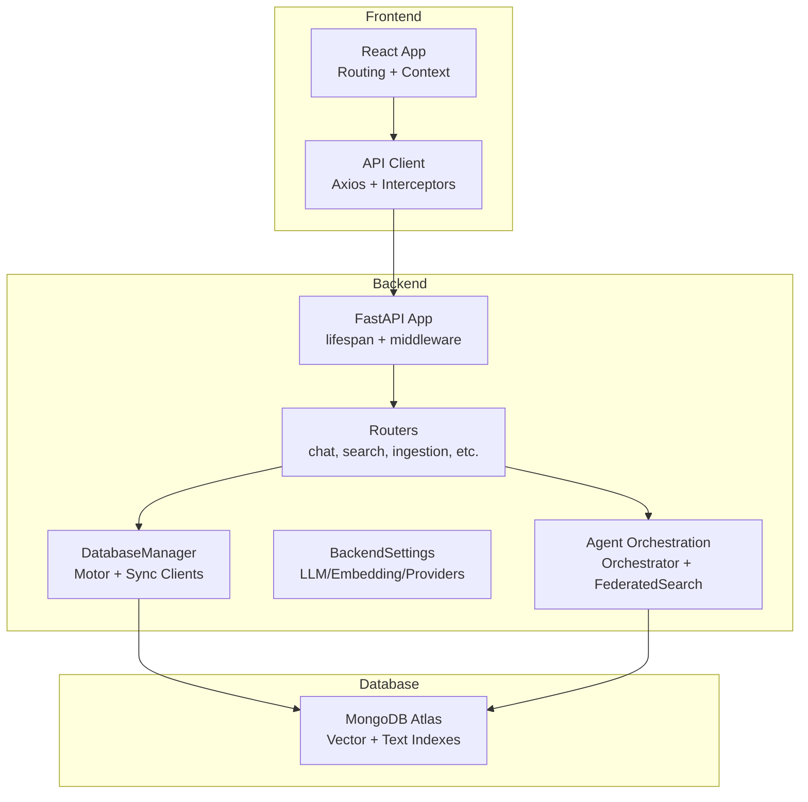

**Diagram sources**
- [backend/main.py](file://backend/main.py#L128-L187)
- [backend/core/database.py](file://backend/core/database.py#L28-L118)
- [backend/core/config.py](file://backend/core/config.py#L9-L218)
- [backend/routers/chat.py](file://backend/routers/chat.py#L1-L120)
- [backend/routers/search.py](file://backend/routers/search.py#L1-L120)
- [backend/agent/orchestrator.py](file://backend/agent/orchestrator.py#L35-L160)
- [backend/agent/federated_search.py](file://backend/agent/federated_search.py#L26-L140)

**Section sources**
- [README.md](file://README.md#L151-L181)
- [docker-compose.yml](file://docker-compose.yml#L15-L143)

## Core Components
- Backend FastAPI application with lifecycle hooks, CORS, request timeout middleware, and centralized exception handling.
- Configuration management for LLM providers, embedding models, search parameters, and federated agent settings.
- Database abstraction with async Motor client and a dedicated sync client for non-async operations.
- Agent orchestration using Pydantic AI with planning, evaluation, and synthesis phases.
- Federated search across profile, personal, and cloud data sources with access control and hybrid ranking.
- Frontend React application with routing, authentication context, and a typed API client.
- Ingestion pipeline for multi-format document processing, intelligent chunking, and embedding generation.

**Section sources**
- [backend/main.py](file://backend/main.py#L128-L187)
- [backend/core/config.py](file://backend/core/config.py#L9-L218)
- [backend/core/database.py](file://backend/core/database.py#L28-L118)
- [backend/agent/orchestrator.py](file://backend/agent/orchestrator.py#L35-L160)
- [backend/agent/federated_search.py](file://backend/agent/federated_search.py#L26-L140)
- [frontend/src/App.tsx](file://frontend/src/App.tsx#L28-L65)
- [frontend/src/api/client.ts](file://frontend/src/api/client.ts#L1-L120)
- [src/ingestion/ingest.py](file://src/ingestion/ingest.py#L55-L168)

## Architecture Overview
The system follows a layered architecture:
- Presentation Layer: React SPA handles UI, routing, and user interactions.
- Application Layer: FastAPI exposes REST endpoints for chat, search, ingestion, and system operations.
- Domain Layer: Agent orchestration and federated search coordinate multi-step reasoning and retrieval.
- Persistence Layer: MongoDB Atlas stores documents and chunks with vector and text indexes.

Key integration points:
- LLM providers: OpenAI, OpenRouter, Ollama, Gemini via LiteLLM.
- Embedding providers: OpenAI or OpenRouter embeddings.
- Cloud sources: OAuth and API-based integrations via a unified provider interface.
- External web search: Brave Search API for web augmentation.

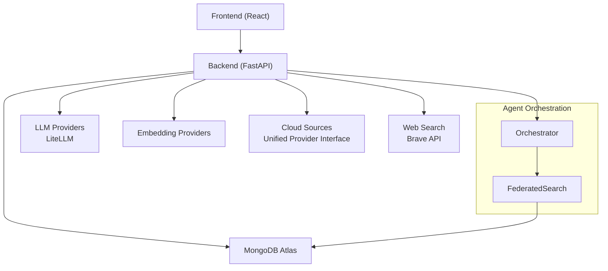

**Diagram sources**
- [backend/routers/chat.py](file://backend/routers/chat.py#L359-L409)
- [backend/routers/search.py](file://backend/routers/search.py#L34-L120)
- [backend/agent/orchestrator.py](file://backend/agent/orchestrator.py#L35-L160)
- [backend/agent/federated_search.py](file://backend/agent/federated_search.py#L26-L140)
- [backend/providers/base.py](file://backend/providers/base.py#L179-L290)

## Detailed Component Analysis

### Backend FastAPI Application
- Lifespan manages database connection, configuration loading, ingestion resumption, and prompt template initialization.
- Middleware enforces request timeouts and CORS; global exception handlers provide structured error responses.
- Centralized router registration for chat, search, ingestion, profiles, sessions, auth, status, indexes, ingestion queue, local LLM, cloud sources, and prompts.

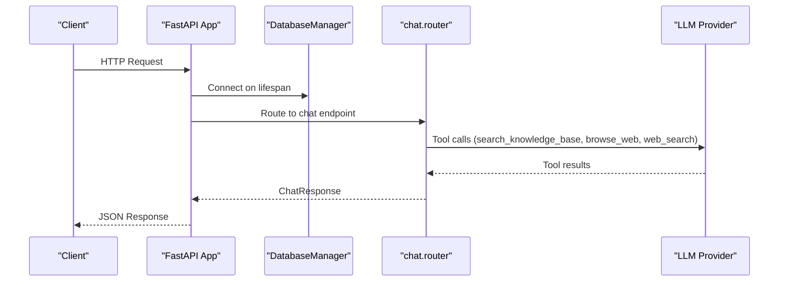

**Diagram sources**
- [backend/main.py](file://backend/main.py#L128-L187)
- [backend/routers/chat.py](file://backend/routers/chat.py#L634-L699)

**Section sources**
- [backend/main.py](file://backend/main.py#L128-L187)
- [backend/main.py](file://backend/main.py#L222-L361)

### Configuration and Providers
- BackendSettings encapsulates API, MongoDB, LLM, embedding, search, agent, and federated agent parameters.
- Provider interface defines capabilities, authentication, file/folder operations, and sync behaviors for cloud sources.

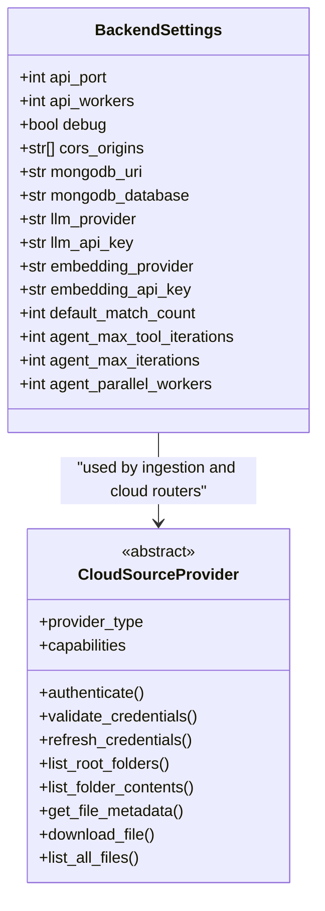

**Diagram sources**
- [backend/core/config.py](file://backend/core/config.py#L9-L218)
- [backend/providers/base.py](file://backend/providers/base.py#L179-L290)

**Section sources**
- [backend/core/config.py](file://backend/core/config.py#L9-L218)
- [backend/providers/base.py](file://backend/providers/base.py#L179-L290)

### Database Abstraction
- DatabaseManager provides async Motor client access, profile switching, and sync client creation for blocking operations.
- Dedicated thread pools isolate DB operations from ingestion to prevent contention.

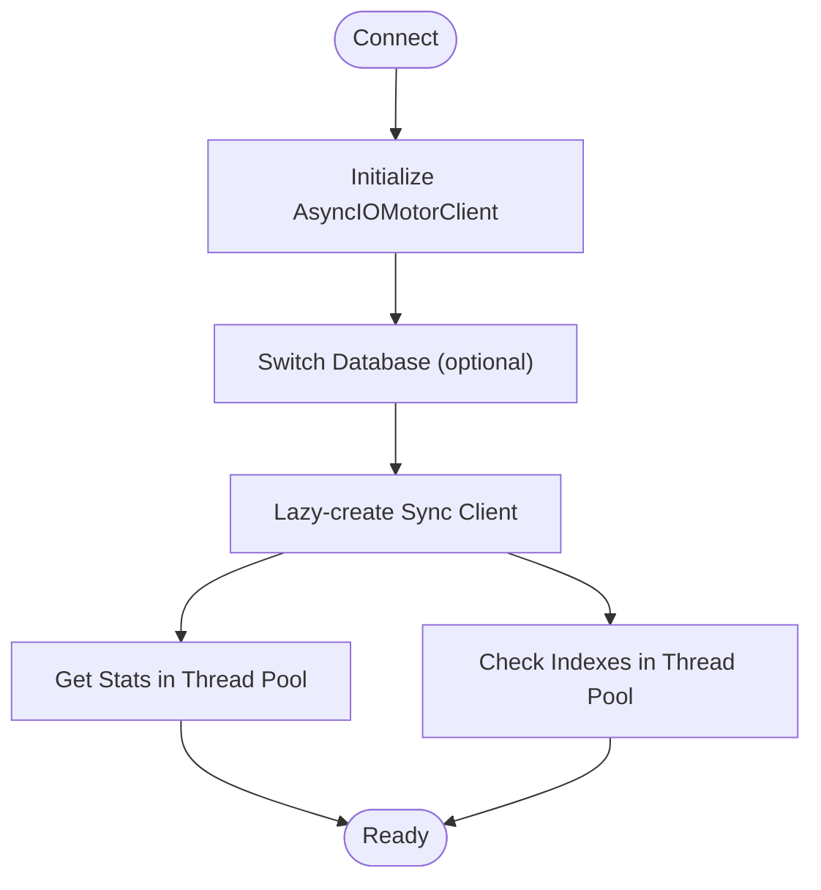

**Diagram sources**
- [backend/core/database.py](file://backend/core/database.py#L28-L118)
- [backend/core/database.py](file://backend/core/database.py#L119-L228)

**Section sources**
- [backend/core/database.py](file://backend/core/database.py#L28-L118)
- [backend/core/database.py](file://backend/core/database.py#L119-L228)

### Agent Orchestration
- Orchestrator uses a "thinking" model to analyze intent, plan tasks, evaluate results, and synthesize final answers.
- Prompts are loaded from the database with fallback defaults; step tracking records tokens and durations.

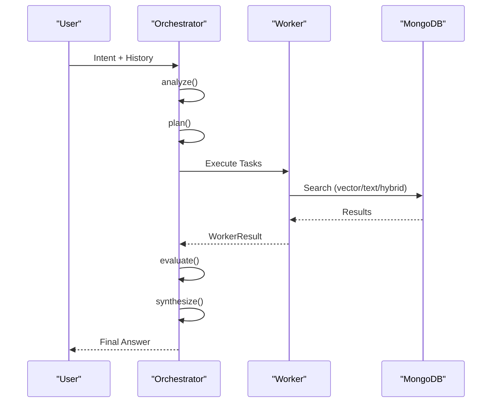

**Diagram sources**
- [backend/agent/orchestrator.py](file://backend/agent/orchestrator.py#L161-L396)

**Section sources**
- [backend/agent/orchestrator.py](file://backend/agent/orchestrator.py#L35-L160)
- [backend/agent/orchestrator.py](file://backend/agent/orchestrator.py#L161-L396)

### Federated Search
- FederatedSearch discovers accessible sources (profile, personal, cloud) and executes parallel vector/text/hybrid searches.
- Applies RRF to merge heterogeneous results, deduplicates, and ranks by relevance.

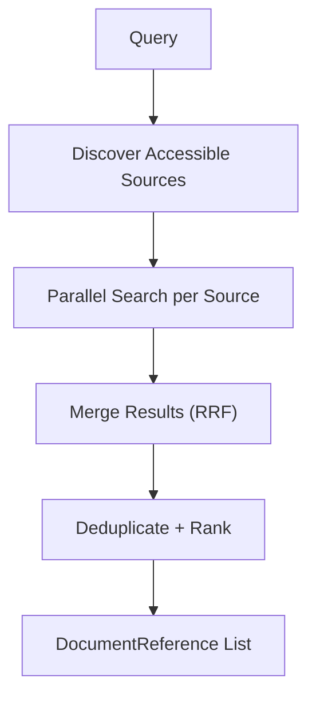

**Diagram sources**
- [backend/agent/federated_search.py](file://backend/agent/federated_search.py#L313-L463)
- [backend/agent/federated_search.py](file://backend/agent/federated_search.py#L273-L312)

**Section sources**
- [backend/agent/federated_search.py](file://backend/agent/federated_search.py#L26-L140)
- [backend/agent/federated_search.py](file://backend/agent/federated_search.py#L313-L463)
- [backend/agent/federated_search.py](file://backend/agent/federated_search.py#L465-L492)

### Search Routers
- Semantic, text, and hybrid search endpoints leverage MongoDB Atlas Vector Search and Atlas Search with lookup joins to documents.
- Hybrid search applies RRF merging and deduplication.

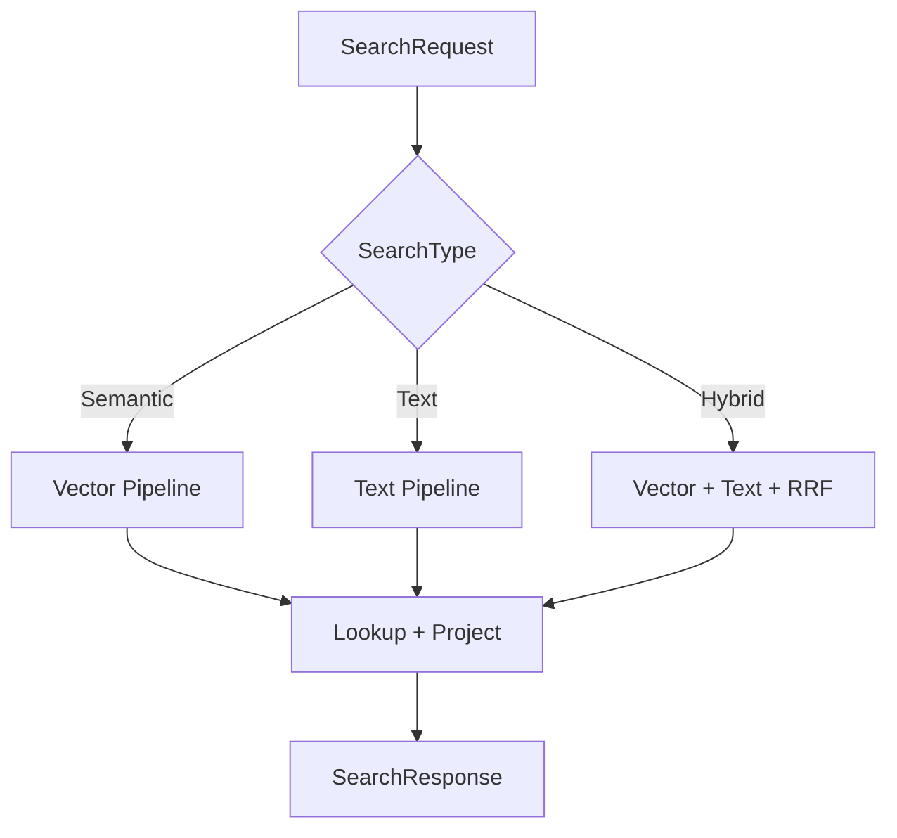

**Diagram sources**
- [backend/routers/search.py](file://backend/routers/search.py#L34-L120)
- [backend/routers/search.py](file://backend/routers/search.py#L190-L347)

**Section sources**
- [backend/routers/search.py](file://backend/routers/search.py#L34-L120)
- [backend/routers/search.py](file://backend/routers/search.py#L190-L347)

### Chat Router and Tool Calling
- The chat endpoint uses LiteLLM with function calling to orchestrate tool usage: search_knowledge_base, browse_web, web_search.
- Captures detailed thinking traces for transparency and debugging.

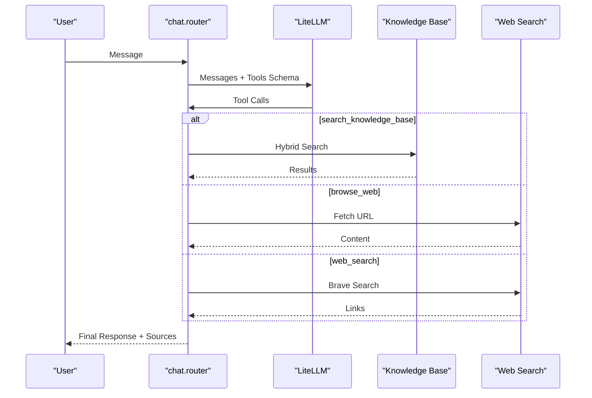

**Diagram sources**
- [backend/routers/chat.py](file://backend/routers/chat.py#L78-L135)
- [backend/routers/chat.py](file://backend/routers/chat.py#L329-L632)

**Section sources**
- [backend/routers/chat.py](file://backend/routers/chat.py#L634-L699)
- [backend/routers/chat.py](file://backend/routers/chat.py#L329-L632)

### Frontend Integration
- React App sets up routing, context providers, and navigates to pages for chat, search, documents, profiles, and system management.
- API client centralizes HTTP configuration, interceptors for auth and error handling, and typed response models.

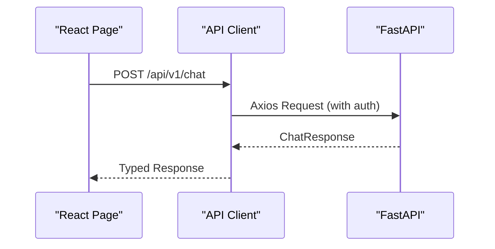

**Diagram sources**
- [frontend/src/App.tsx](file://frontend/src/App.tsx#L28-L65)
- [frontend/src/api/client.ts](file://frontend/src/api/client.ts#L739-L795)

**Section sources**
- [frontend/src/App.tsx](file://frontend/src/App.tsx#L28-L65)
- [frontend/src/api/client.ts](file://frontend/src/api/client.ts#L1-L120)
- [frontend/src/api/client.ts](file://frontend/src/api/client.ts#L739-L795)

### Ingestion Pipeline
- Processes documents from multiple folders, sorts by priority, converts formats with Docling, transcribes audio, chunks content, generates embeddings, and writes to MongoDB.

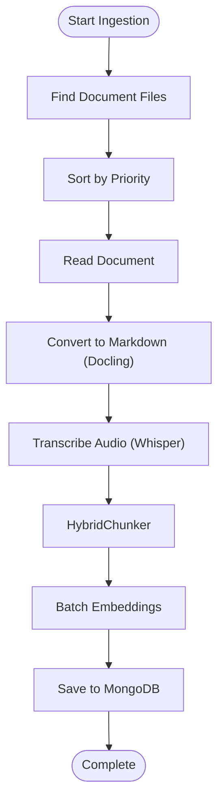

**Diagram sources**
- [src/ingestion/ingest.py](file://src/ingestion/ingest.py#L169-L284)
- [src/ingestion/ingest.py](file://src/ingestion/ingest.py#L286-L702)
- [src/ingestion/ingest.py](file://src/ingestion/ingest.py#L770-L800)

**Section sources**
- [src/ingestion/ingest.py](file://src/ingestion/ingest.py#L55-L168)
- [src/ingestion/ingest.py](file://src/ingestion/ingest.py#L169-L284)
- [src/ingestion/ingest.py](file://src/ingestion/ingest.py#L286-L702)
- [src/ingestion/ingest.py](file://src/ingestion/ingest.py#L770-L800)

## Dependency Analysis
- Backend dependencies include FastAPI, Pydantic AI, LiteLLM, PyMongo/Motor, OpenAI, httpx, and cryptography for secure credentials.
- Frontend depends on Axios, React Router, and Tailwind for styling.
- Docker Compose defines service dependencies and port mappings for MongoDB, Backend, Frontend, and optional CLI.

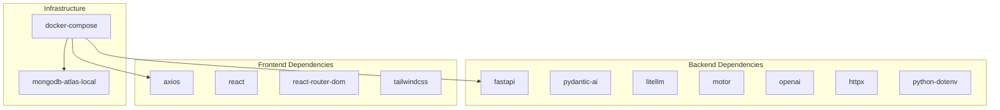

**Diagram sources**
- [pyproject.toml](file://pyproject.toml#L6-L30)
- [docker-compose.yml](file://docker-compose.yml#L15-L143)

**Section sources**
- [pyproject.toml](file://pyproject.toml#L6-L30)
- [docker-compose.yml](file://docker-compose.yml#L15-L143)

## Performance Considerations
- Hybrid search latency targets sub-second responses by running vector and text searches concurrently and applying RRF merging.
- Dedicated thread pools isolate DB operations from ingestion to reduce contention.
- Embedding generation is batched and reused across searches.
- Frontend uses Axios interceptors with retry logic and short auth-check timeouts to improve perceived responsiveness.

[No sources needed since this section provides general guidance]

## Troubleshooting Guide
- Backend exception handling returns user-friendly messages with error IDs; admins receive technical details without exposing stack traces.
- Request timeout middleware logs slow requests and returns gateway timeouts for long-running operations.
- Frontend API client centralizes error mapping and retry logic, with user-facing messages and developer-visible technical details.

**Section sources**
- [backend/main.py](file://backend/main.py#L222-L361)
- [backend/main.py](file://backend/main.py#L68-L126)
- [frontend/src/api/client.ts](file://frontend/src/api/client.ts#L105-L180)

## Conclusion
The MongoDB-RAG-Agent system integrates MongoDB Atlas Vector Search with Pydantic AI to enable intelligent, multi-source retrieval and conversational search. Its modular architecture separates presentation, application, domain, and persistence layers, while robust middleware, configuration, and ingestion pipelines ensure reliability and scalability. The federated search and agent orchestration layers provide powerful reasoning and synthesis capabilities across diverse data sources.

[No sources needed since this section summarizes without analyzing specific files]

## Appendices

### System Context Diagram
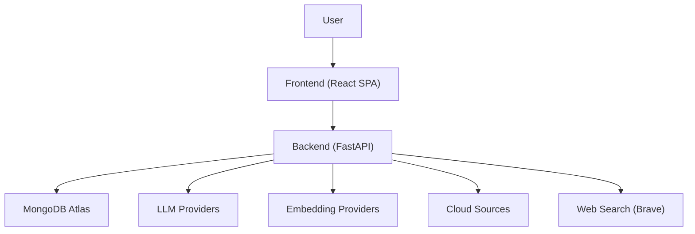

**Diagram sources**
- [backend/routers/chat.py](file://backend/routers/chat.py#L359-L409)
- [backend/routers/search.py](file://backend/routers/search.py#L34-L120)
- [backend/agent/federated_search.py](file://backend/agent/federated_search.py#L26-L140)

### Deployment Topology
- MongoDB Atlas Local container provides vector and text search indexes.
- Backend FastAPI serves REST endpoints and agent orchestration.
- Frontend React is served via nginx inside a container.
- Optional CLI container provides terminal access.
- Airbyte integration is optional for Confluence/Jira.

**Section sources**
- [docker-compose.yml](file://docker-compose.yml#L15-L143)