# Data Architecture

<cite>
**Referenced Files in This Document**
- [backend/core/database.py](file://backend/core/database.py)
- [backend/models/schemas.py](file://backend/models/schemas.py)
- [backend/models/backup_schemas.py](file://backend/models/backup_schemas.py)
- [backend/services/backup_service.py](file://backend/services/backup_service.py)
- [backend/routers/backup.py](file://backend/routers/backup.py)
- [backend/services/file_registry.py](file://backend/services/file_registry.py)
- [backend/routers/search.py](file://backend/routers/search.py)
- [backend/routers/ingestion.py](file://backend/routers/ingestion.py)
- [src/profile.py](file://src/profile.py)
- [src/settings.py](file://src/settings.py)
- [src/setup_indexes.py](file://src/setup_indexes.py)
- [src/ingestion/chunker.py](file://src/ingestion/chunker.py)
- [src/ingestion/embedder.py](file://src/ingestion/embedder.py)
- [src/ingestion/ingest.py](file://src/ingestion/ingest.py)
- [backend/agent/federated_search.py](file://backend/agent/federated_search.py)
- [backend/routers/indexes.py](file://backend/routers/indexes.py)
</cite>

## Update Summary
**Changes Made**
- Added comprehensive backup storage architecture documentation with full/incremental/checkpoint/post_ingestion backup types
- Documented enhanced file registry system for metadata tracking and selective re-ingestion
- Added improved ingestion analytics with job metrics and extended monitoring capabilities
- Updated backup and disaster recovery procedures with new backup types and storage strategies
- Enhanced multi-profile data isolation with backup-specific collection handling

## Table of Contents
1. [Introduction](#introduction)
2. [Project Structure](#project-structure)
3. [Core Components](#core-components)
4. [Architecture Overview](#architecture-overview)
5. [Detailed Component Analysis](#detailed-component-analysis)
6. [Backup Storage Architecture](#backup-storage-architecture)
7. [Enhanced File Registry System](#enhanced-file-registry-system)
8. [Improved Ingestion Analytics](#improved-ingestion-analytics)
9. [Dependency Analysis](#dependency-analysis)
10. [Performance Considerations](#performance-considerations)
11. [Troubleshooting Guide](#troubleshooting-guide)
12. [Conclusion](#conclusion)
13. [Appendices](#appendices)

## Introduction
This document describes the data architecture of the MongoDB-RAG-Agent system. It covers the database schema design, vector search implementation using MongoDB Atlas Vector Search, the document processing pipeline from raw files through chunking to vector embeddings, indexing strategy for both vector and text search, data modeling decisions, entity relationships, multi-profile data isolation, backup storage architecture with full/incremental/checkpoint/post_ingestion backup types, enhanced file registry system for metadata tracking, improved ingestion analytics with job metrics, and operational aspects such as performance optimization and monitoring.

## Project Structure
The system is organized around a backend API (FastAPI), ingestion pipeline (Python), backup management service, file registry system, and profile-driven configuration. Key areas:
- Backend API: search endpoints, database connectivity, admin dashboards, backup management, and ingestion analytics
- Ingestion pipeline: document conversion, chunking, embedding, and MongoDB persistence
- Backup management: comprehensive backup storage architecture with multiple backup types
- File registry: persistent metadata tracking for intelligent selective re-ingestion
- Configuration: settings and profiles for multi-tenant isolation
- Indexing: Atlas Vector Search and Atlas Search index setup

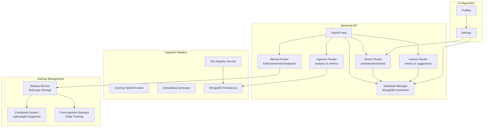

**Diagram sources**
- [backend/routers/search.py:1-347](file://backend/routers/search.py#L1-L347)
- [backend/core/database.py:28-118](file://backend/core/database.py#L28-L118)
- [backend/routers/indexes.py:1-289](file://backend/routers/indexes.py#L1-L289)
- [backend/routers/backup.py:1-459](file://backend/routers/backup.py#L1-L459)
- [backend/routers/ingestion.py:700-1059](file://backend/routers/ingestion.py#L700-L1059)
- [backend/services/backup_service.py:67-1339](file://backend/services/backup_service.py#L67-L1339)
- [backend/services/file_registry.py:63-540](file://backend/services/file_registry.py#L63-L540)
- [src/ingestion/chunker.py:68-186](file://src/ingestion/chunker.py#L68-L186)
- [src/ingestion/embedder.py:45-227](file://src/ingestion/embedder.py#L45-L227)
- [src/ingestion/ingest.py:55-168](file://src/ingestion/ingest.py#L55-L168)
- [src/settings.py:16-211](file://src/settings.py#L16-L211)
- [src/profile.py:90-162](file://src/profile.py#L90-L162)

**Section sources**
- [backend/routers/search.py:1-347](file://backend/routers/search.py#L1-L347)
- [backend/core/database.py:28-118](file://backend/core/database.py#L28-L118)
- [backend/routers/backup.py:1-459](file://backend/routers/backup.py#L1-L459)
- [backend/routers/ingestion.py:700-1059](file://backend/routers/ingestion.py#L700-L1059)
- [backend/services/backup_service.py:67-1339](file://backend/services/backup_service.py#L67-L1339)
- [backend/services/file_registry.py:63-540](file://backend/services/file_registry.py#L63-L540)
- [src/ingestion/chunker.py:68-186](file://src/ingestion/chunker.py#L68-L186)
- [src/ingestion/embedder.py:45-227](file://src/ingestion/embedder.py#L45-L227)
- [src/ingestion/ingest.py:55-168](file://src/ingestion/ingest.py#L55-L168)
- [src/settings.py:16-211](file://src/settings.py#L16-L211)
- [src/profile.py:90-162](file://src/profile.py#L90-L162)

## Core Components
- Database Manager: Async MongoDB connection with profile-aware switching and index inspection
- Search Router: Semantic, text, and hybrid search using Atlas Vector Search and Atlas Search
- Ingestion Pipeline: Docling-based chunking, embedding generation, and MongoDB persistence
- Backup Service: Comprehensive backup management with full/incremental/checkpoint/post_ingestion backup types
- File Registry Service: Persistent metadata tracking for intelligent selective re-ingestion
- Settings and Profiles: Centralized configuration with multi-profile isolation
- Index Setup: Automated creation of vector and text search indexes

**Section sources**
- [backend/core/database.py:28-118](file://backend/core/database.py#L28-L118)
- [backend/routers/search.py:34-347](file://backend/routers/search.py#L34-L347)
- [backend/services/backup_service.py:67-1339](file://backend/services/backup_service.py#L67-L1339)
- [backend/services/file_registry.py:63-540](file://backend/services/file_registry.py#L63-L540)
- [src/ingestion/chunker.py:68-186](file://src/ingestion/chunker.py#L68-L186)
- [src/ingestion/embedder.py:45-227](file://src/ingestion/embedder.py#L45-L227)
- [src/ingestion/ingest.py:55-168](file://src/ingestion/ingest.py#L55-L168)
- [src/settings.py:16-211](file://src/settings.py#L16-L211)
- [src/setup_indexes.py:8-138](file://src/setup_indexes.py#L8-L138)

## Architecture Overview
The system separates concerns across ingestion, backup management, and serving layers:
- Ingestion: Converts documents to chunks, generates embeddings, and stores them in MongoDB with file registry tracking
- Backup Management: Provides comprehensive backup storage architecture with multiple backup types and automated post-ingestion backups
- Serving: Provides search APIs leveraging Atlas Vector Search and Atlas Search
- Configuration: Profiles isolate databases/collections/indexes per tenant/project

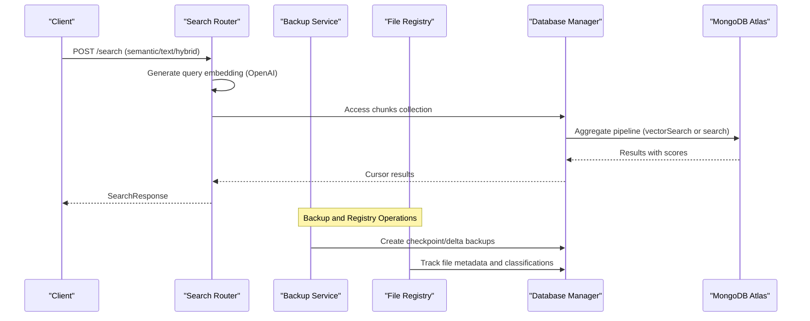

**Diagram sources**
- [backend/routers/search.py:34-347](file://backend/routers/search.py#L34-L347)
- [backend/core/database.py:102-118](file://backend/core/database.py#L102-L118)
- [backend/services/backup_service.py:783-878](file://backend/services/backup_service.py#L783-L878)
- [backend/services/file_registry.py:103-193](file://backend/services/file_registry.py#L103-L193)

## Detailed Component Analysis

### Database Schema Design
The system uses two main collections plus backup and registry collections:
- documents: Stores original document metadata and source information
- chunks: Stores chunked content with embeddings and references to documents
- file_registry: Tracks file metadata, classifications, and processing history
- backups_metadata: Stores backup metadata and configurations
- ingestion_jobs: Tracks ingestion job progress and statistics

Collections and fields are configurable per profile, enabling multi-tenant isolation.

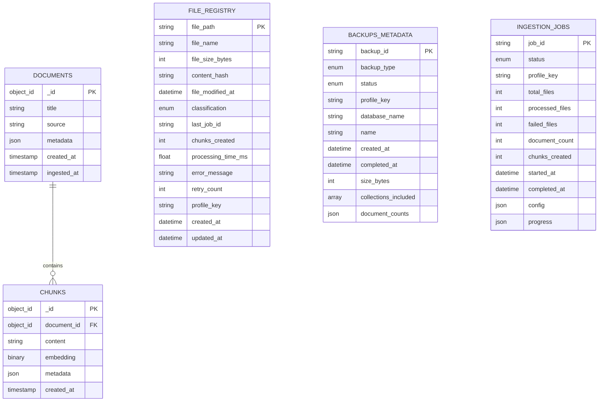

**Diagram sources**
- [src/ingestion/ingest.py:770-800](file://src/ingestion/ingest.py#L770-L800)
- [backend/models/schemas.py:299-316](file://backend/models/schemas.py#L299-L316)
- [backend/services/file_registry.py:21-22](file://backend/services/file_registry.py#L21-L22)
- [backend/models/backup_schemas.py:72-103](file://backend/models/backup_schemas.py#L72-L103)
- [backend/routers/ingestion.py:725-768](file://backend/routers/ingestion.py#L725-L768)

**Section sources**
- [src/ingestion/ingest.py:770-800](file://src/ingestion/ingest.py#L770-L800)
- [backend/models/schemas.py:299-316](file://backend/models/schemas.py#L299-L316)
- [backend/services/file_registry.py:21-22](file://backend/services/file_registry.py#L21-L22)
- [backend/models/backup_schemas.py:72-103](file://backend/models/backup_schemas.py#L72-L103)
- [backend/routers/ingestion.py:725-768](file://backend/routers/ingestion.py#L725-L768)

### Vector Search Implementation
Vector search uses MongoDB Atlas Vector Search with cosine similarity. The pipeline:
- Generates a query embedding
- Executes a $vectorSearch aggregation stage against the chunks collection
- Joins with documents to enrich results
- Projects similarity score via $meta

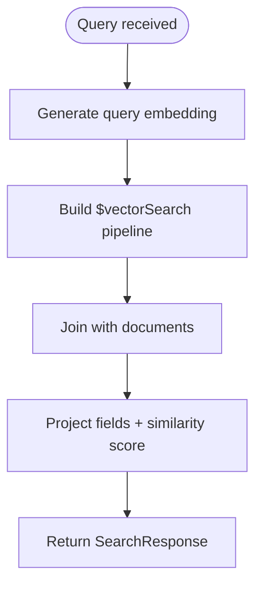

**Diagram sources**
- [backend/routers/search.py:34-109](file://backend/routers/search.py#L34-L109)

**Section sources**
- [backend/routers/search.py:34-109](file://backend/routers/search.py#L34-L109)

### Text Search Implementation
Text search uses Atlas Search with fuzzy matching and Lucene-powered analyzers. The pipeline:
- Executes a $search stage against the chunks collection
- Limits results and joins with documents
- Projects similarity score via $meta

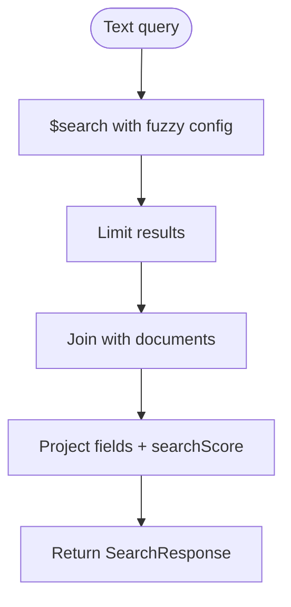

**Diagram sources**
- [backend/routers/search.py:111-187](file://backend/routers/search.py#L111-L187)

**Section sources**
- [backend/routers/search.py:111-187](file://backend/routers/search.py#L111-L187)

### Hybrid Search Implementation
Hybrid search combines semantic and text results using Reciprocal Rank Fusion (RRF). It:
- Runs both semantic and text searches with expanded fetch count
- Merges results by chunk_id and applies RRF scoring
- Returns top-k results

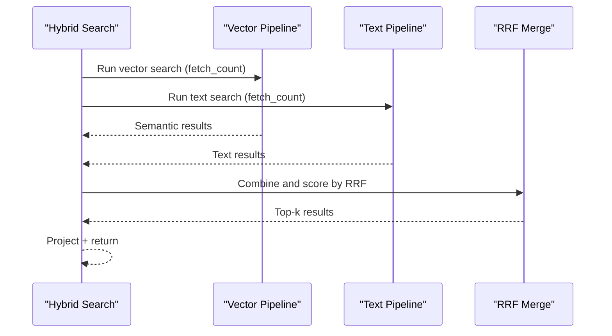

**Diagram sources**
- [backend/routers/search.py:190-330](file://backend/routers/search.py#L190-L330)

**Section sources**
- [backend/routers/search.py:190-330](file://backend/routers/search.py#L190-L330)

### Document Processing Pipeline
End-to-end ingestion pipeline:
- Discover files across configured folders
- Convert to markdown using Docling (supports PDF, DOCX, HTML, images, audio/video)
- Chunk using Docling HybridChunker with token-aware boundaries
- Generate embeddings via OpenAI or compatible provider
- Persist documents and chunks to MongoDB
- Register file metadata in file registry for tracking and selective re-ingestion

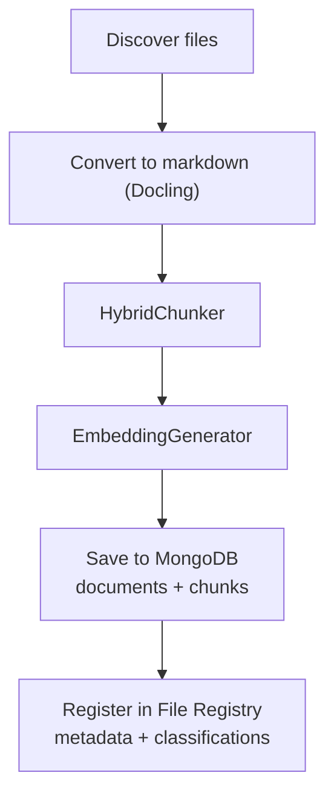

**Diagram sources**
- [src/ingestion/ingest.py:169-284](file://src/ingestion/ingest.py#L169-L284)
- [src/ingestion/chunker.py:68-186](file://src/ingestion/chunker.py#L68-L186)
- [src/ingestion/embedder.py:45-227](file://src/ingestion/embedder.py#L45-L227)
- [backend/services/file_registry.py:103-193](file://backend/services/file_registry.py#L103-L193)

**Section sources**
- [src/ingestion/ingest.py:169-284](file://src/ingestion/ingest.py#L169-L284)
- [src/ingestion/chunker.py:68-186](file://src/ingestion/chunker.py#L68-L186)
- [src/ingestion/embedder.py:45-227](file://src/ingestion/embedder.py#L45-L227)
- [backend/services/file_registry.py:103-193](file://backend/services/file_registry.py#L103-L193)

### Indexing Strategy
Two Atlas Search indexes are created:
- Vector index: stores embeddings and enables vector similarity search
- Text index: enables full-text search with fuzzy matching

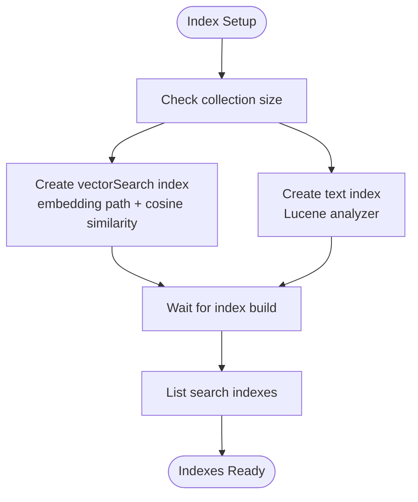

**Diagram sources**
- [src/setup_indexes.py:8-138](file://src/setup_indexes.py#L8-L138)

**Section sources**
- [src/setup_indexes.py:8-138](file://src/setup_indexes.py#L8-L138)

### Multi-Profile Data Isolation
Profiles define tenant boundaries:
- Each profile has its own database, documents/chunks collections, and index names
- Settings can be applied per profile to override defaults
- Profile switching affects all downstream operations (ingestion, search, indexing, backups)

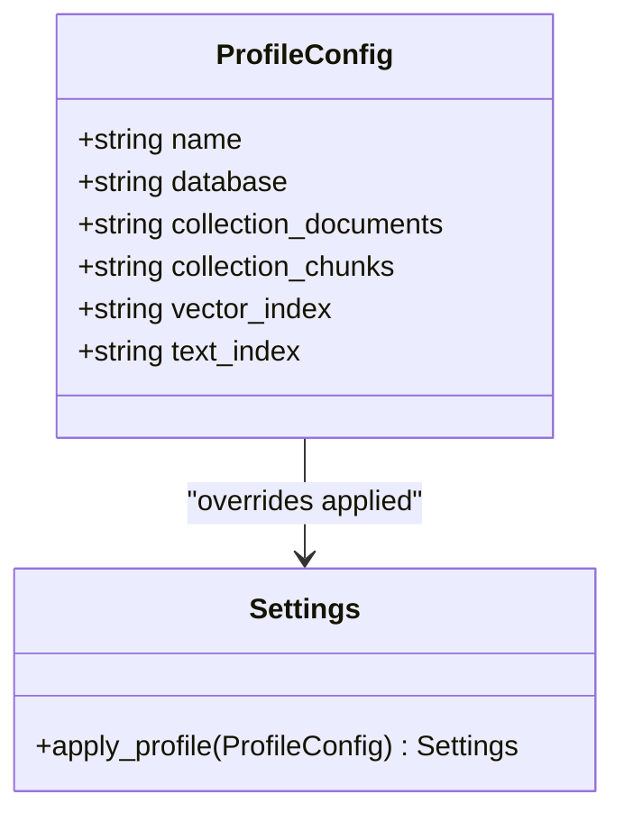

**Diagram sources**
- [src/profile.py:90-162](file://src/profile.py#L90-L162)
- [src/settings.py:106-155](file://src/settings.py#L106-L155)

**Section sources**
- [src/profile.py:90-162](file://src/profile.py#L90-L162)
- [src/settings.py:106-155](file://src/settings.py#L106-L155)
- [backend/agent/federated_search.py:104-137](file://backend/agent/federated_search.py#L104-L137)

### Relationship Patterns Between Entities
- documents and chunks: one-to-many (each document produces multiple chunks)
- chunks reference documents via document_id
- search results join chunks with documents to enrich metadata
- file registry tracks file metadata and processing history
- backup metadata references backup operations and their results

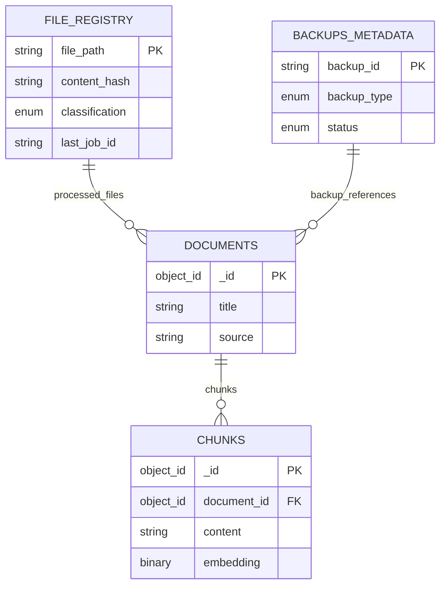

**Diagram sources**
- [src/ingestion/ingest.py:770-800](file://src/ingestion/ingest.py#L770-L800)
- [backend/routers/search.py:61-80](file://backend/routers/search.py#L61-L80)
- [backend/services/file_registry.py:103-193](file://backend/services/file_registry.py#L103-L193)
- [backend/models/backup_schemas.py:72-103](file://backend/models/backup_schemas.py#L72-L103)

**Section sources**
- [src/ingestion/ingest.py:770-800](file://src/ingestion/ingest.py#L770-L800)
- [backend/routers/search.py:61-80](file://backend/routers/search.py#L61-L80)
- [backend/services/file_registry.py:103-193](file://backend/services/file_registry.py#L103-L193)
- [backend/models/backup_schemas.py:72-103](file://backend/models/backup_schemas.py#L72-L103)

## Backup Storage Architecture

### Backup Types and Storage Strategy
The system implements a comprehensive backup storage architecture with four distinct backup types:

#### Full Backups
Complete database snapshots including all profile collections and optionally system collections. Stored in `data/backups/full` directory with timestamped subdirectories.

#### Incremental Backups
Delta backups capturing only changes since the last backup. Uses time-based queries on `created_at`, `updated_at`, and `ingested_at` fields to identify modified documents.

#### Checkpoint Backups
Lightweight state snapshots containing only metadata and hash signatures for integrity verification, stored in `data/backups/checkpoint` directory.

#### Post-Ingestion Backups
Automatic backups triggered after successful ingestion jobs, capturing only newly added documents and chunks with detailed ingestion statistics.

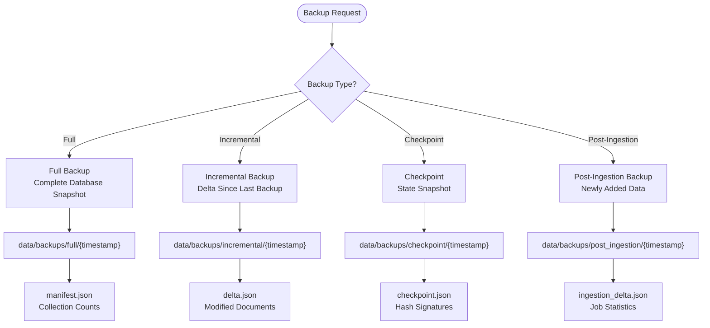

**Diagram sources**
- [backend/services/backup_service.py:124-127](file://backend/services/backup_service.py#L124-L127)
- [backend/services/backup_service.py:288-494](file://backend/services/backup_service.py#L288-L494)
- [backend/services/backup_service.py:663-781](file://backend/services/backup_service.py#L663-L781)
- [backend/services/backup_service.py:783-878](file://backend/services/backup_service.py#L783-L878)
- [backend/services/backup_service.py:880-1012](file://backend/services/backup_service.py#L880-L1012)

**Section sources**
- [backend/services/backup_service.py:124-127](file://backend/services/backup_service.py#L124-L127)
- [backend/services/backup_service.py:288-494](file://backend/services/backup_service.py#L288-L494)
- [backend/services/backup_service.py:663-781](file://backend/services/backup_service.py#L663-L781)
- [backend/services/backup_service.py:783-878](file://backend/services/backup_service.py#L783-L878)
- [backend/services/backup_service.py:880-1012](file://backend/services/backup_service.py#L880-L1012)
- [backend/routers/backup.py:39-93](file://backend/routers/backup.py#L39-L93)

### Backup Configuration and Management
The backup system maintains comprehensive configuration and metadata:

#### Backup Configuration
- Auto-backup after ingestion: Enabled by default for post-ingestion backups
- Retention policy: Configurable days to retain backups (default 30 days)
- Maximum backups per profile: Limits storage usage (default 10 backups)
- Compression: GZIP compression enabled by default
- Backup location: Configurable storage directory (`data/backups`)
- Backup schedule: Optional cron-based scheduling

#### Backup Metadata
Each backup operation creates detailed metadata including:
- Backup ID and type
- Profile association and database name
- Timestamps (created_at, completed_at)
- Size measurements and file paths
- Collection inclusion lists and document counts
- Parent backup references for incremental chains
- Checkpoint data for state snapshots
- Ingestion statistics for post-ingestion backups

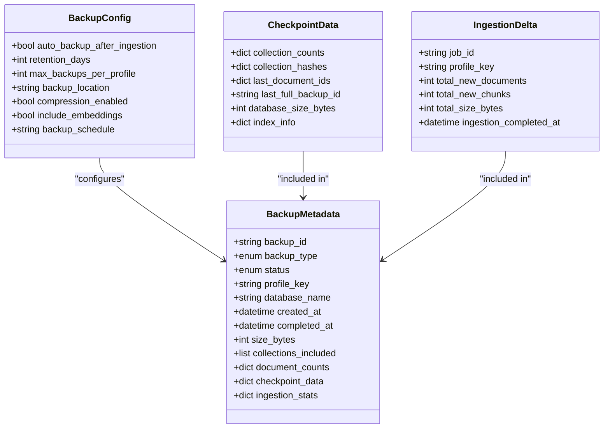

**Diagram sources**
- [backend/models/backup_schemas.py:117-126](file://backend/models/backup_schemas.py#L117-L126)
- [backend/models/backup_schemas.py:72-103](file://backend/models/backup_schemas.py#L72-L103)
- [backend/models/backup_schemas.py:170-178](file://backend/models/backup_schemas.py#L170-L178)
- [backend/models/backup_schemas.py:182-193](file://backend/models/backup_schemas.py#L182-L193)

**Section sources**
- [backend/models/backup_schemas.py:117-126](file://backend/models/backup_schemas.py#L117-L126)
- [backend/models/backup_schemas.py:72-103](file://backend/models/backup_schemas.py#L72-L103)
- [backend/models/backup_schemas.py:170-178](file://backend/models/backup_schemas.py#L170-L178)
- [backend/models/backup_schemas.py:182-193](file://backend/models/backup_schemas.py#L182-L193)
- [backend/services/backup_service.py:83-163](file://backend/services/backup_service.py#L83-L163)

### Backup Restoration and Recovery
The system supports multiple restoration modes:

#### Restoration Modes
- **Full Restore**: Completely replaces target database with backup data
- **Merge Restore**: Adds missing documents only, preserving existing data
- **Selective Restore**: Restores specific collections only

#### Restoration Features
- Target database specification for testing environments
- User and session data skipping options
- Backup chain validation for incremental restoration
- Progress tracking and error reporting
- Integrity verification through hash comparisons

**Section sources**
- [backend/models/backup_schemas.py:25-30](file://backend/models/backup_schemas.py#L25-L30)
- [backend/models/backup_schemas.py:139-150](file://backend/models/backup_schemas.py#L139-L150)
- [backend/routers/backup.py:351-402](file://backend/routers/backup.py#L351-L402)

## Enhanced File Registry System

### File Metadata Tracking
The file registry system provides comprehensive tracking of file processing metadata:

#### File Registry Collections
- **Primary Collection**: `file_registry` - Stores file metadata and processing history
- **Index Strategy**: Multiple indexes for efficient querying by path, hash, classification, and profile
- **Field Coverage**: Complete file information including size, modification time, hash, and processing metrics

#### File Classification System
Files are classified into categories for intelligent processing decisions:
- **Normal**: Successfully processed with chunks created
- **Image Only PDF**: PDF with no extractable text layer
- **No Chunks**: Processed but produced zero chunks
- **Timeout**: Processing timed out during conversion
- **Error**: Processing failed with error details
- **Pending**: Never processed yet

#### Processing History Tracking
The registry maintains detailed processing history for each file:
- Last job ID that processed the file
- Number of chunks created
- Processing time in milliseconds
- Error messages for failed attempts
- Retry count for failed processing attempts
- Profile association for multi-tenant isolation

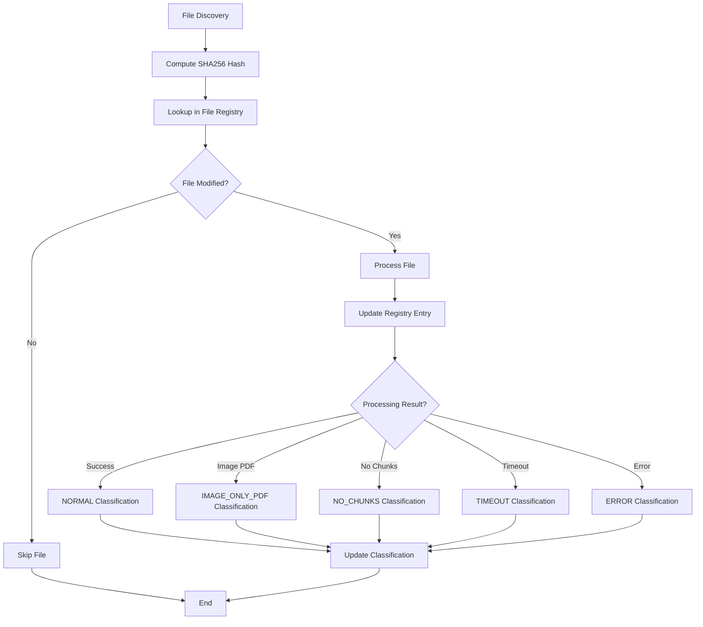

**Diagram sources**
- [backend/services/file_registry.py:25-44](file://backend/services/file_registry.py#L25-L44)
- [backend/services/file_registry.py:103-193](file://backend/services/file_registry.py#L103-L193)
- [backend/services/file_registry.py:348-376](file://backend/services/file_registry.py#L348-L376)

**Section sources**
- [backend/services/file_registry.py:21-22](file://backend/services/file_registry.py#L21-L22)
- [backend/services/file_registry.py:83-102](file://backend/services/file_registry.py#L83-L102)
- [backend/services/file_registry.py:103-193](file://backend/services/file_registry.py#L103-L193)
- [backend/services/file_registry.py:348-376](file://backend/services/file_registry.py#L348-L376)

### Intelligent Selective Re-ingestion
The file registry enables sophisticated selective re-ingestion strategies:

#### Retry Logic
- **Retry Image-only PDFs**: Re-process PDFs without text layers
- **Retry Timeouts**: Re-attempt files that timed out during processing
- **Retry Errors**: Re-process files with processing errors
- **Retry No Chunks**: Re-process files that produced zero chunks

#### Skip Logic
- **Skip Image-only PDFs**: Exclude PDFs without text layers from processing
- **Skip Normal Files**: Skip files that have been successfully processed

#### Query Capabilities
- **Classification-based Filtering**: Filter files by processing status
- **Profile-based Filtering**: Isolate files by tenant profile
- **Pagination Support**: Efficient handling of large file registries
- **Statistical Aggregation**: Count files by classification and size metrics

**Section sources**
- [backend/services/file_registry.py:235-281](file://backend/services/file_registry.py#L235-L281)
- [backend/services/file_registry.py:282-318](file://backend/services/file_registry.py#L282-L318)
- [backend/services/file_registry.py:377-422](file://backend/services/file_registry.py#L377-L422)
- [backend/services/file_registry.py:423-462](file://backend/services/file_registry.py#L423-L462)

## Improved Ingestion Analytics

### Extended Job Metrics
The ingestion system now provides comprehensive analytics and monitoring:

#### Real-time Job State Tracking
- **Phase Information**: Current processing phase (initializing, cleaning, processing)
- **Progress Metrics**: File count, processing rate, and completion percentage
- **Resource Usage**: Memory consumption and processing throughput
- **Error Tracking**: Detailed error logs and failure analysis

#### Extended Processing Statistics
- **File Classification Counts**: Breakdown of normal, image-only PDF, no-chunks, timeout, and error files
- **Average Processing Time**: Milliseconds per file with statistical analysis
- **Total Size Processing**: Bytes processed across all files
- **Success Rate Calculation**: Percentage of files producing chunks

#### Timeline and Trend Analysis
- **Hourly Processing Rates**: Files processed per hour for capacity planning
- **Processing Time Trends**: Historical analysis of processing performance
- **Failure Pattern Recognition**: Identification of recurring processing issues

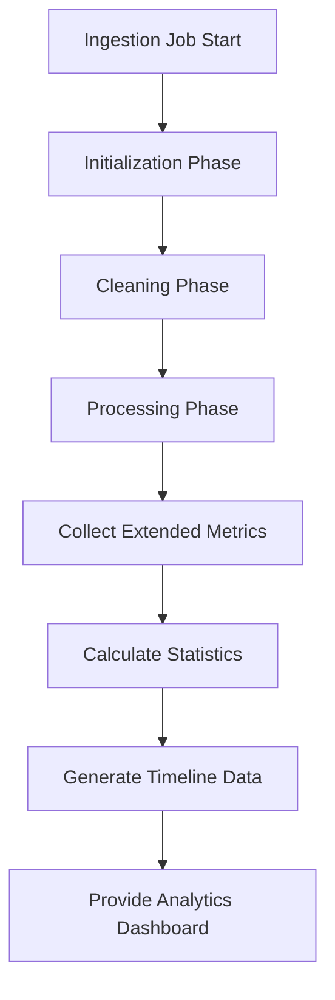

**Diagram sources**
- [backend/routers/ingestion.py:707-768](file://backend/routers/ingestion.py#L707-L768)
- [backend/routers/ingestion.py:686-705](file://backend/routers/ingestion.py#L686-L705)

**Section sources**
- [backend/routers/ingestion.py:707-768](file://backend/routers/ingestion.py#L707-L768)
- [backend/routers/ingestion.py:686-705](file://backend/routers/ingestion.py#L686-L705)
- [backend/routers/ingestion.py:1026-1034](file://backend/routers/ingestion.py#L1026-L1034)

### Post-Ingestion Backup Integration
The system automatically creates backups after successful ingestion:

#### Automatic Backup Triggering
- **Configuration Control**: Auto-backup can be enabled/disabled in backup configuration
- **Job Association**: Post-ingestion backups reference original ingestion job IDs
- **Delta Tracking**: Captures exact changes made during the ingestion process
- **Non-blocking Operation**: Backups run asynchronously without affecting ingestion performance

#### Backup Chain Management
- **Incremental Dependencies**: Post-ingestion backups can serve as parents for future incremental backups
- **Retention Integration**: Backup retention policies apply to post-ingestion backups
- **Storage Optimization**: Only newly added documents and chunks are backed up

**Section sources**
- [backend/services/backup_service.py:880-1012](file://backend/services/backup_service.py#L880-L1012)
- [backend/routers/backup.py:431-459](file://backend/routers/backup.py#L431-L459)
- [backend/routers/ingestion.py:1026-1034](file://backend/routers/ingestion.py#L1026-L1034)

## Dependency Analysis
- Search Router depends on Database Manager for collection access and Settings for index names
- Backup Service depends on Database Manager for backup operations and File Registry for metadata
- File Registry Service depends on Database Manager for persistent storage and ingestion jobs for processing context
- Ingestion Pipeline depends on Settings for database configuration, Profiles for folder resolution, and File Registry for metadata tracking
- Index Setup depends on Settings for connection and index definitions

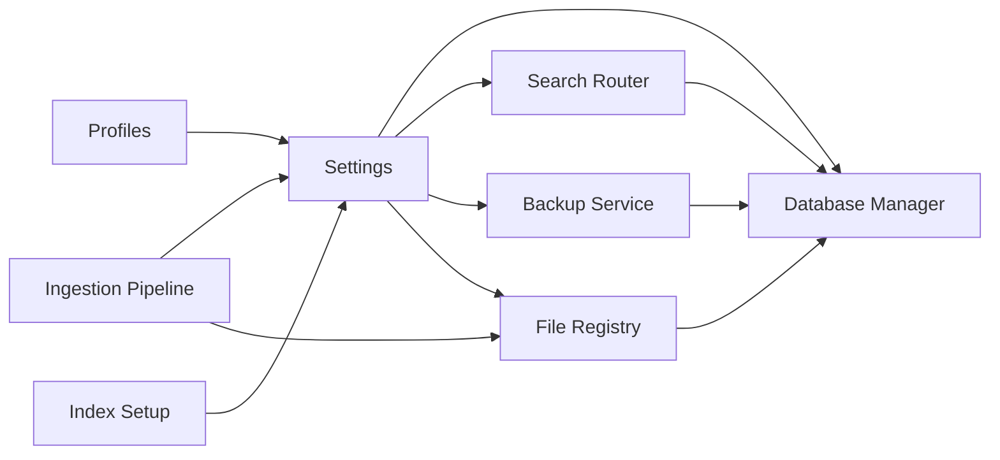

**Diagram sources**
- [src/settings.py:16-211](file://src/settings.py#L16-L211)
- [backend/core/database.py:28-118](file://backend/core/database.py#L28-L118)
- [backend/routers/search.py:1-347](file://backend/routers/search.py#L1-L347)
- [backend/services/backup_service.py:67-82](file://backend/services/backup_service.py#L67-L82)
- [backend/services/file_registry.py:73-81](file://backend/services/file_registry.py#L73-L81)
- [src/profile.py:90-162](file://src/profile.py#L90-L162)
- [src/setup_indexes.py:8-138](file://src/setup_indexes.py#L8-L138)

**Section sources**
- [src/settings.py:16-211](file://src/settings.py#L16-L211)
- [backend/core/database.py:28-118](file://backend/core/database.py#L28-L118)
- [backend/routers/search.py:1-347](file://backend/routers/search.py#L1-L347)
- [backend/services/backup_service.py:67-82](file://backend/services/backup_service.py#L67-L82)
- [backend/services/file_registry.py:73-81](file://backend/services/file_registry.py#L73-L81)
- [src/profile.py:90-162](file://src/profile.py#L90-L162)
- [src/setup_indexes.py:8-138](file://src/setup_indexes.py#L8-L138)

## Performance Considerations
- Vector search parameters: numCandidates controls recall vs. latency; tune based on dataset size and SLA
- Batch embedding generation reduces API overhead
- Index readiness: wait for indexes to build before heavy queries
- Hybrid search fetch_count expansion improves recall before final ranking
- Backup compression: GZIP compression reduces storage requirements but increases CPU usage
- Incremental backup efficiency: Delta backups minimize storage and processing overhead
- File registry indexing: Proper indexing on file_path, content_hash, and classification improves query performance
- Monitoring: track latency percentiles and suggest scaling/archival actions

## Troubleshooting Guide
Common issues and remedies:
- Missing indexes: use index setup script to create vector and text indexes
- Connection failures: verify MongoDB URI and credentials; check network/firewall
- Slow search: review numCandidates, consider increasing; monitor latency metrics
- Embedding errors: confirm provider API keys and model availability
- Backup failures: check backup configuration, storage permissions, and available disk space
- File registry corruption: rebuild indexes and rescan files for proper metadata recovery
- Ingestion timeouts: adjust timeout settings and monitor resource utilization

**Section sources**
- [src/setup_indexes.py:8-138](file://src/setup_indexes.py#L8-L138)
- [backend/core/database.py:40-61](file://backend/core/database.py#L40-L61)
- [backend/routers/indexes.py:197-289](file://backend/routers/indexes.py#L197-L289)
- [backend/services/backup_service.py:83-163](file://backend/services/backup_service.py#L83-L163)
- [backend/services/file_registry.py:83-102](file://backend/services/file_registry.py#L83-L102)

## Conclusion
The MongoDB-RAG-Agent system employs a clean separation between ingestion, backup management, and serving layers, with robust multi-profile isolation and comprehensive backup storage architecture. The enhanced file registry system provides intelligent selective re-ingestion capabilities, while improved ingestion analytics offer deep insights into processing performance. The backup system supports multiple backup types with automated post-ingestion backups, ensuring comprehensive data protection and recovery capabilities.

## Appendices

### Appendix A: Data Modeling Decisions
- Embeddings stored as binary to optimize vector search performance
- Metadata preserved per chunk for provenance and filtering
- Separate documents and chunks collections to decouple lifecycle and scaling
- File registry provides persistent metadata tracking for intelligent processing decisions
- Backup metadata includes comprehensive tracking for disaster recovery scenarios

**Section sources**
- [src/ingestion/ingest.py:770-800](file://src/ingestion/ingest.py#L770-L800)
- [backend/models/schemas.py:299-316](file://backend/models/schemas.py#L299-L316)
- [backend/services/file_registry.py:103-193](file://backend/services/file_registry.py#L103-L193)
- [backend/models/backup_schemas.py:72-103](file://backend/models/backup_schemas.py#L72-L103)

### Appendix B: Backup and Disaster Recovery
The backup system provides comprehensive disaster recovery capabilities:

#### Backup Types and Storage
- **Full Backups**: Complete database snapshots stored in `data/backups/full`
- **Incremental Backups**: Delta backups stored in `data/backups/incremental`
- **Checkpoint Backups**: Lightweight state snapshots stored in `data/backups/checkpoint`
- **Post-Ingestion Backups**: Automatic backups of newly added data stored in `data/backups/post_ingestion`

#### Backup Configuration
- **Retention Policy**: Configurable days to retain backups (default 30 days)
- **Storage Limits**: Maximum backups per profile (default 10 backups)
- **Compression**: GZIP compression enabled by default
- **Auto-backup**: Automatic post-ingestion backups can be enabled/disabled

#### Restoration Capabilities
- **Full Restore**: Complete database replacement
- **Merge Restore**: Non-destructive restoration preserving existing data
- **Selective Restore**: Targeted restoration of specific collections
- **Backup Chain Validation**: Integrity verification through parent-child relationships

**Section sources**
- [backend/services/backup_service.py:124-127](file://backend/services/backup_service.py#L124-L127)
- [backend/models/backup_schemas.py:117-126](file://backend/models/backup_schemas.py#L117-L126)
- [backend/routers/backup.py:351-402](file://backend/routers/backup.py#L351-L402)

### Appendix C: File Registry and Selective Re-ingestion
The file registry system enables intelligent processing decisions:

#### Classification-Based Processing
- **Normal Files**: Processed successfully with chunks created
- **Image-only PDFs**: May be skipped or re-processed based on configuration
- **No Chunks**: Re-processing may improve chunk generation
- **Timeout Files**: Re-attempt processing with increased timeout
- **Error Files**: Re-process after error resolution

#### Statistical Analysis
- **Classification Counts**: Real-time tracking of file processing outcomes
- **Processing Statistics**: Average time, total size, and success rates
- **Trend Analysis**: Historical processing performance trends
- **Failure Pattern Recognition**: Identification of recurring processing issues

**Section sources**
- [backend/services/file_registry.py:207-234](file://backend/services/file_registry.py#L207-L234)
- [backend/services/file_registry.py:235-281](file://backend/services/file_registry.py#L235-L281)
- [backend/services/file_registry.py:377-422](file://backend/services/file_registry.py#L377-L422)
- [backend/routers/ingestion.py:686-705](file://backend/routers/ingestion.py#L686-L705)