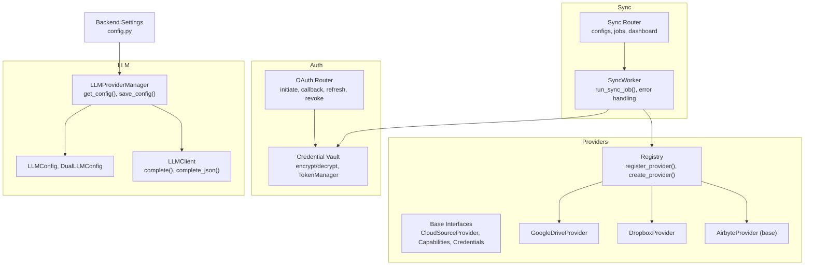
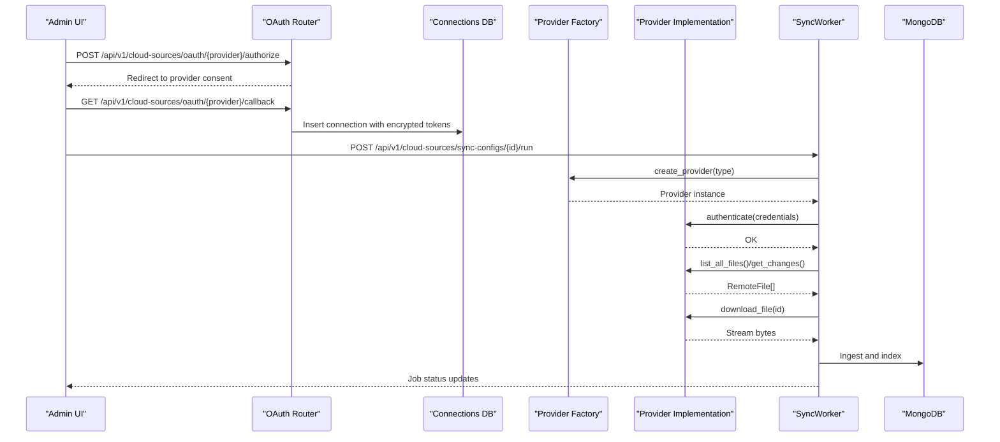
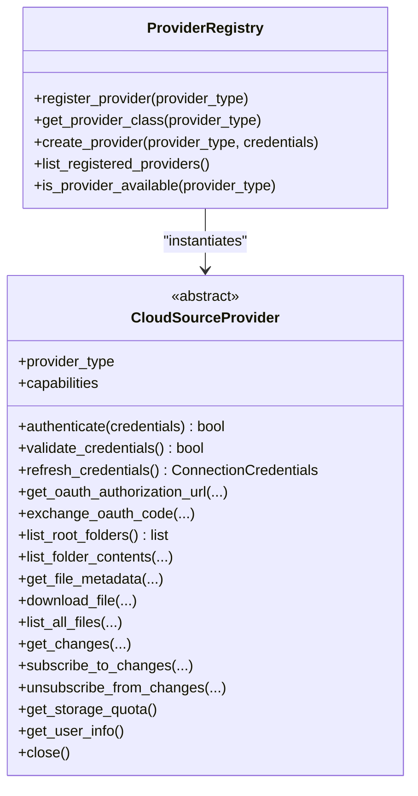
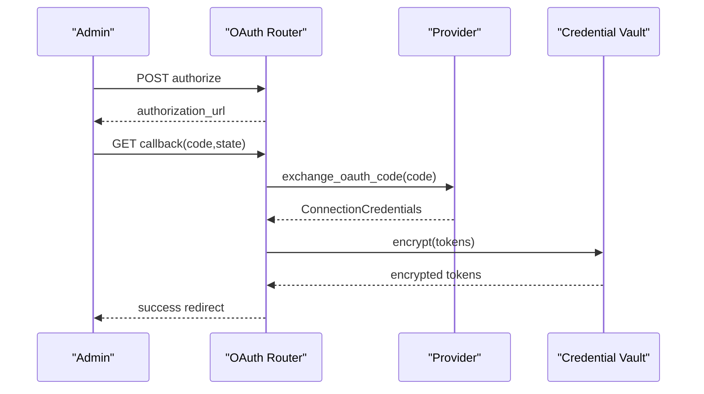
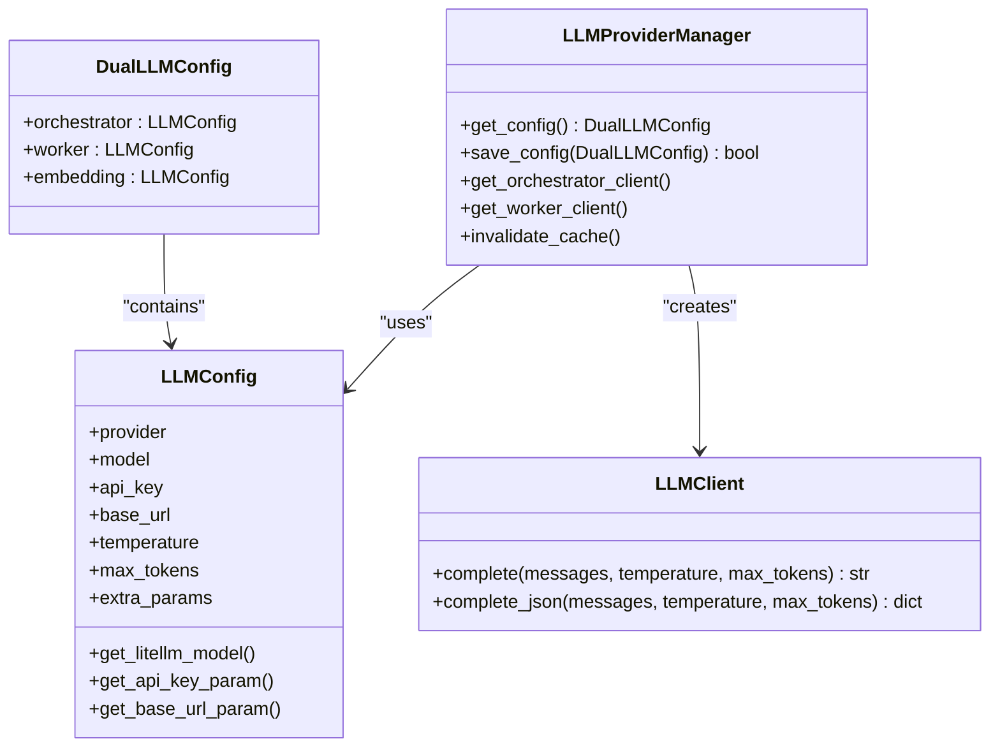
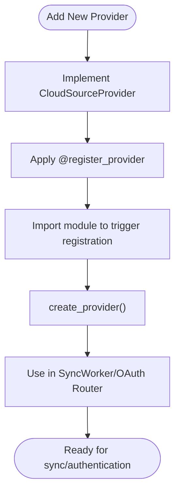
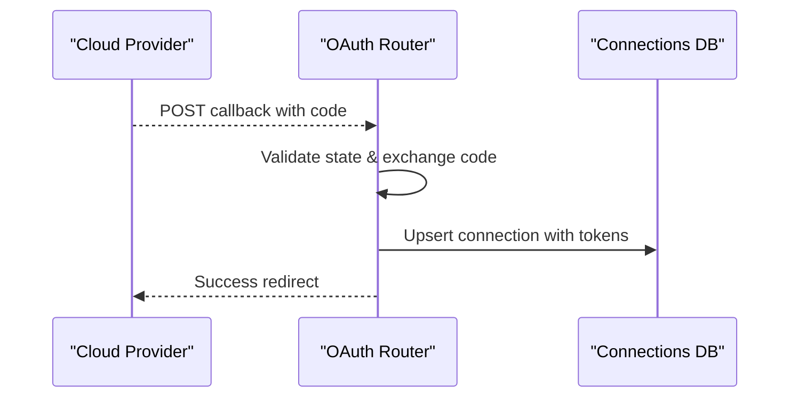
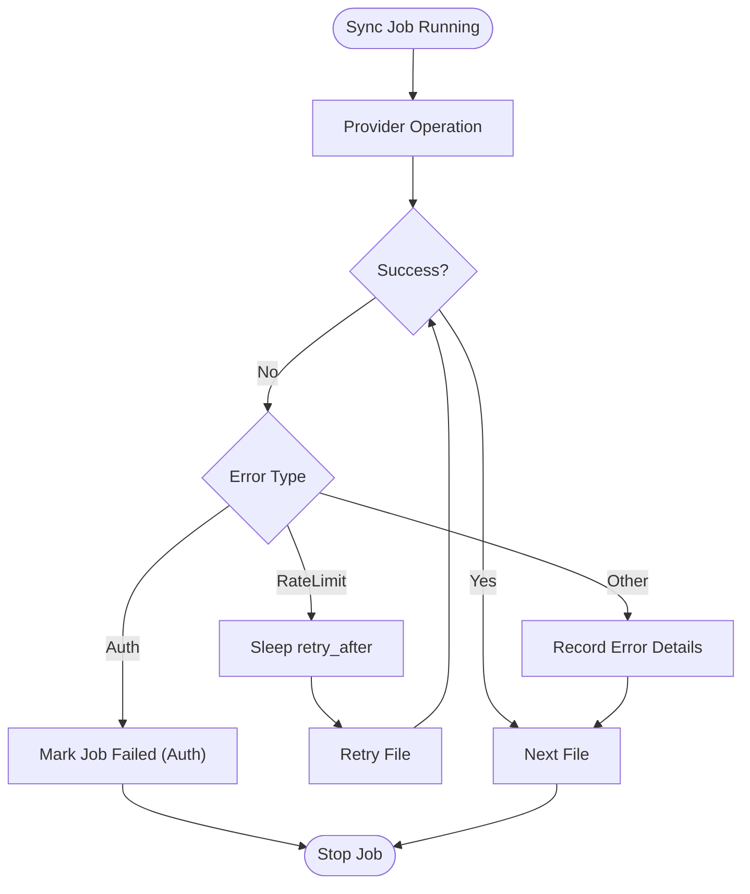
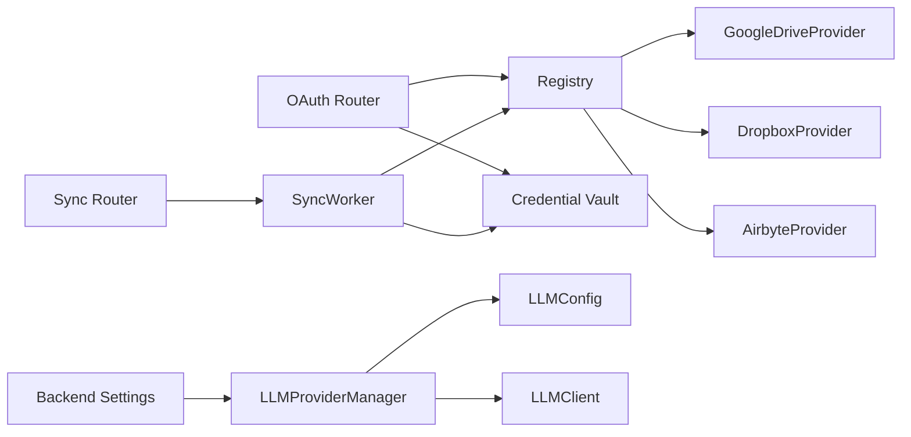

# Integration Patterns

<cite>
**Referenced Files in This Document**
- [registry.py](file://backend/providers/registry.py)
- [base.py](file://backend/providers/base.py)
- [credential_vault.py](file://backend/core/credential_vault.py)
- [llm_providers.py](file://backend/core/llm_providers.py)
- [oauth.py](file://backend/routers/cloud_sources/oauth.py)
- [google_drive.py](file://backend/providers/google_drive.py)
- [dropbox_provider.py](file://backend/providers/dropbox_provider.py)
- [sync_worker.py](file://backend/workers/sync_worker.py)
- [sync.py](file://backend/routers/cloud_sources/sync.py)
- [config.py](file://backend/core/config.py)
- [schemas.py](file://backend/routers/cloud_sources/schemas.py)
- [base.py (Airbyte)](file://backend/providers/airbyte/base.py)
</cite>

## Table of Contents
1. [Introduction](#introduction)
2. [Project Structure](#project-structure)
3. [Core Components](#core-components)
4. [Architecture Overview](#architecture-overview)
5. [Detailed Component Analysis](#detailed-component-analysis)
6. [Dependency Analysis](#dependency-analysis)
7. [Performance Considerations](#performance-considerations)
8. [Troubleshooting Guide](#troubleshooting-guide)
9. [Conclusion](#conclusion)
10. [Appendices](#appendices)

## Introduction
This document explains the integration patterns used by the MongoDB-RAG-Agent system to connect with cloud sources, manage authentication, orchestrate LLM providers, and synchronize content efficiently. It focuses on:
- Provider registry and factory pattern for extensible cloud source integrations
- Authentication framework supporting OAuth flows, API keys, and service accounts
- LLM provider abstraction enabling multiple backends (OpenAI, OpenRouter, Ollama, Gemini)
- Plugin architecture and factory pattern for adding new integrations
- Webhook and callback systems for real-time synchronization
- Error handling and retry strategies for external service integration
- Configuration management for different integration scenarios and environments

## Project Structure
The integration layer spans several modules:
- Providers: Base interfaces, registry/factory, and concrete provider implementations
- Authentication: OAuth router and credential vault for secure token storage
- LLM Abstraction: Unified client and provider manager for multiple backends
- Sync Orchestration: Worker and router for scheduling and executing sync jobs
- Configuration: Centralized settings for environment-specific behavior

**Diagram sources**
- [registry.py](file://backend/providers/registry.py#L24-L67)
- [base.py](file://backend/providers/base.py#L179-L491)
- [google_drive.py](file://backend/providers/google_drive.py#L51-L627)
- [dropbox_provider.py](file://backend/providers/dropbox_provider.py#L38-L582)
- [base.py (Airbyte)](file://backend/providers/airbyte/base.py#L52-L566)
- [oauth.py](file://backend/routers/cloud_sources/oauth.py#L155-L537)
- [credential_vault.py](file://backend/core/credential_vault.py#L44-L347)
- [llm_providers.py](file://backend/core/llm_providers.py#L198-L416)
- [sync.py](file://backend/routers/cloud_sources/sync.py#L127-L800)
- [sync_worker.py](file://backend/workers/sync_worker.py#L44-L506)
- [config.py](file://backend/core/config.py#L9-L219)

**Section sources**
- [registry.py](file://backend/providers/registry.py#L1-L143)
- [base.py](file://backend/providers/base.py#L1-L525)
- [oauth.py](file://backend/routers/cloud_sources/oauth.py#L1-L537)
- [credential_vault.py](file://backend/core/credential_vault.py#L1-L347)
- [llm_providers.py](file://backend/core/llm_providers.py#L1-L416)
- [sync.py](file://backend/routers/cloud_sources/sync.py#L1-L874)
- [sync_worker.py](file://backend/workers/sync_worker.py#L1-L506)
- [config.py](file://backend/core/config.py#L1-L219)

## Core Components
- Provider Registry and Factory: Central registry mapping provider types to implementations, with automatic discovery and factory-based instantiation.
- Provider Base Interface: Defines capabilities, credentials, and standardized methods for authentication, browsing, file operations, delta sync, and webhooks.
- OAuth Router: Implements provider-specific OAuth flows, token exchange, refresh, and revocation.
- Credential Vault: Secure storage and rotation of tokens and secrets using symmetric encryption.
- LLM Provider Abstraction: Unified client and manager supporting multiple providers and models via LiteLLM.
- Sync Orchestration: Router for sync configurations and jobs, and a worker that executes syncs, applies filters, and handles errors.
- Configuration Management: Centralized settings for API keys, providers, embeddings, and environment-specific behavior.

**Section sources**
- [registry.py](file://backend/providers/registry.py#L24-L77)
- [base.py](file://backend/providers/base.py#L179-L491)
- [oauth.py](file://backend/routers/cloud_sources/oauth.py#L155-L537)
- [credential_vault.py](file://backend/core/credential_vault.py#L44-L347)
- [llm_providers.py](file://backend/core/llm_providers.py#L198-L416)
- [sync.py](file://backend/routers/cloud_sources/sync.py#L127-L800)
- [sync_worker.py](file://backend/workers/sync_worker.py#L44-L506)
- [config.py](file://backend/core/config.py#L9-L219)

## Architecture Overview
The system integrates cloud sources through a pluggable provider architecture. Providers implement a common interface and are instantiated via a registry/factory. Authentication is handled centrally, with OAuth flows managed by dedicated routes and tokens stored securely. Sync jobs are orchestrated by a worker that interacts with providers, downloads content, and indexes it. LLM providers are abstracted behind a unified client and manager.

**Diagram sources**
- [oauth.py](file://backend/routers/cloud_sources/oauth.py#L155-L320)
- [registry.py](file://backend/providers/registry.py#L45-L67)
- [sync_worker.py](file://backend/workers/sync_worker.py#L60-L310)
- [google_drive.py](file://backend/providers/google_drive.py#L136-L217)
- [dropbox_provider.py](file://backend/providers/dropbox_provider.py#L127-L202)

## Detailed Component Analysis

### Provider Registry Pattern and Factory
- Registry: Maintains a mapping of provider types to implementation classes and exposes registration, lookup, and instantiation helpers.
- Factory: Provides a single entry point to create provider instances with optional credentials.
- Auto-loading: Imports provider modules to register implementations, preventing circular imports.

**Diagram sources**
- [registry.py](file://backend/providers/registry.py#L24-L77)
- [base.py](file://backend/providers/base.py#L179-L491)

**Section sources**
- [registry.py](file://backend/providers/registry.py#L24-L77)
- [base.py](file://backend/providers/base.py#L179-L491)

### Authentication Framework (OAuth, API Keys, Service Accounts)
- OAuth Router: Supports provider-specific OAuth flows, state management, token exchange, refresh, and revocation. Stores minimal user info and expiration metadata.
- Credential Vault: Encrypts and decrypts tokens and secrets at rest using symmetric encryption with a master key and salt. Includes token lifecycle management.
- Provider Implementations: Implement OAuth methods and token refresh logic, validating credentials against provider APIs.

**Diagram sources**
- [oauth.py](file://backend/routers/cloud_sources/oauth.py#L155-L320)
- [credential_vault.py](file://backend/core/credential_vault.py#L119-L184)
- [google_drive.py](file://backend/providers/google_drive.py#L246-L291)
- [dropbox_provider.py](file://backend/providers/dropbox_provider.py#L229-L272)

**Section sources**
- [oauth.py](file://backend/routers/cloud_sources/oauth.py#L155-L537)
- [credential_vault.py](file://backend/core/credential_vault.py#L44-L347)
- [google_drive.py](file://backend/providers/google_drive.py#L136-L217)
- [dropbox_provider.py](file://backend/providers/dropbox_provider.py#L127-L202)

### LLM Provider Abstraction Layer
- LLMConfig and DualLLMConfig: Define provider, model, API key, base URL, and optional overrides.
- LLMClient: Unified client using LiteLLM to call different providers consistently.
- LLMProviderManager: Loads and saves configurations from the database, merges with environment defaults, and provides clients for orchestrator and worker models.

**Diagram sources**
- [llm_providers.py](file://backend/core/llm_providers.py#L29-L197)
- [llm_providers.py](file://backend/core/llm_providers.py#L198-L416)

**Section sources**
- [llm_providers.py](file://backend/core/llm_providers.py#L1-L416)
- [config.py](file://backend/core/config.py#L9-L219)

### Plugin Architecture and Factory Pattern for Integrations
- Extensibility: New providers are added by implementing the base interface and registering via the registry decorator.
- Factory Usage: The worker and routers instantiate providers using the factory, ensuring consistent initialization and capability checks.
- Airbyte Integration: A specialized base class encapsulates Airbyte setup, connection management, and sync orchestration for complex providers.

**Diagram sources**
- [registry.py](file://backend/providers/registry.py#L24-L37)
- [base.py](file://backend/providers/base.py#L179-L491)
- [sync_worker.py](file://backend/workers/sync_worker.py#L100-L106)
- [base.py (Airbyte)](file://backend/providers/airbyte/base.py#L200-L375)

**Section sources**
- [registry.py](file://backend/providers/registry.py#L79-L142)
- [base.py](file://backend/providers/base.py#L179-L491)
- [sync_worker.py](file://backend/workers/sync_worker.py#L100-L106)
- [base.py (Airbyte)](file://backend/providers/airbyte/base.py#L52-L148)

### Webhook and Callback System for Real-Time Synchronization
- Provider Capabilities: Providers declare support for webhooks and delta sync; Google Drive and Dropbox indicate support in their capabilities.
- OAuth Callbacks: The OAuth router handles provider callbacks, validates state, exchanges codes for tokens, and persists connection records.
- Sync Orchestration: The sync router schedules and runs jobs; the worker applies filters, streams downloads, and indexes content.

**Diagram sources**
- [oauth.py](file://backend/routers/cloud_sources/oauth.py#L221-L320)
- [google_drive.py](file://backend/providers/google_drive.py#L74-L91)
- [dropbox_provider.py](file://backend/providers/dropbox_provider.py#L60-L73)

**Section sources**
- [oauth.py](file://backend/routers/cloud_sources/oauth.py#L1-L537)
- [google_drive.py](file://backend/providers/google_drive.py#L74-L91)
- [dropbox_provider.py](file://backend/providers/dropbox_provider.py#L60-L73)

### Error Handling and Retry Strategies
- Provider Exceptions: Distinct exceptions for authentication, rate limits, file not found, permission denied, and quota exceeded.
- Worker Retry: On rate limit errors, the worker waits and retries the same file; authentication failures mark jobs as failed; general exceptions capture error details.
- OAuth Error Propagation: OAuth router surfaces provider errors and redirects with error details.

**Diagram sources**
- [base.py](file://backend/providers/base.py#L505-L524)
- [sync_worker.py](file://backend/workers/sync_worker.py#L181-L206)
- [oauth.py](file://backend/routers/cloud_sources/oauth.py#L237-L275)

**Section sources**
- [base.py](file://backend/providers/base.py#L495-L524)
- [sync_worker.py](file://backend/workers/sync_worker.py#L181-L206)
- [oauth.py](file://backend/routers/cloud_sources/oauth.py#L237-L275)

### Configuration Management
- Central Settings: Backend settings consolidate API keys, provider choices, embedding settings, and environment-specific toggles.
- Provider-Specific Keys: Helpers resolve provider-specific API keys and orchestrator/worker key preferences.
- LLM Manager Defaults: Falls back to environment settings when database configs are unavailable.

**Section sources**
- [config.py](file://backend/core/config.py#L9-L219)
- [llm_providers.py](file://backend/core/llm_providers.py#L341-L387)

## Dependency Analysis
The integration layer exhibits low coupling and high cohesion:
- Providers depend on the base interface and registry/factory for instantiation.
- OAuth router depends on provider capabilities and environment variables for client credentials.
- Sync worker depends on provider interfaces, credential vault, and ingestion pipeline.
- LLM manager depends on configuration and database persistence.

**Diagram sources**
- [registry.py](file://backend/providers/registry.py#L24-L77)
- [oauth.py](file://backend/routers/cloud_sources/oauth.py#L155-L537)
- [credential_vault.py](file://backend/core/credential_vault.py#L44-L347)
- [sync_worker.py](file://backend/workers/sync_worker.py#L44-L506)
- [sync.py](file://backend/routers/cloud_sources/sync.py#L127-L800)
- [llm_providers.py](file://backend/core/llm_providers.py#L198-L416)
- [config.py](file://backend/core/config.py#L9-L219)

**Section sources**
- [registry.py](file://backend/providers/registry.py#L24-L77)
- [oauth.py](file://backend/routers/cloud_sources/oauth.py#L155-L537)
- [credential_vault.py](file://backend/core/credential_vault.py#L44-L347)
- [sync_worker.py](file://backend/workers/sync_worker.py#L44-L506)
- [sync.py](file://backend/routers/cloud_sources/sync.py#L127-L800)
- [llm_providers.py](file://backend/core/llm_providers.py#L198-L416)
- [config.py](file://backend/core/config.py#L9-L219)

## Performance Considerations
- Streaming Downloads: Providers stream file content to reduce memory usage during ingestion.
- Delta Sync: Providers supporting delta sync minimize repeated downloads by tracking change tokens.
- Rate Limit Handling: Workers respect provider rate limits and retry with backoff.
- Asynchronous Operations: HTTP clients and provider operations use async/await to maximize throughput.
- Filtering: Pre-filtering by file type, size, and patterns reduces unnecessary downloads and processing.

[No sources needed since this section provides general guidance]

## Troubleshooting Guide
- OAuth Issues: Verify client credentials, state validation, and callback URLs. Check for provider errors and token exchange failures.
- Authentication Failures: Confirm provider-specific credentials and token validity; refresh tokens when nearing expiration.
- Rate Limits: Implement exponential backoff and retry logic; monitor retry_after headers.
- Provider Not Available: Ensure the provider is registered and imported; confirm environment variables for client IDs/secrets.
- Sync Job Failures: Inspect job progress, error logs, and connection status; validate filters and source paths.

**Section sources**
- [oauth.py](file://backend/routers/cloud_sources/oauth.py#L237-L275)
- [sync_worker.py](file://backend/workers/sync_worker.py#L274-L294)
- [base.py](file://backend/providers/base.py#L505-L524)
- [registry.py](file://backend/providers/registry.py#L79-L142)

## Conclusion
The MongoDB-RAG-Agent employs a robust, extensible integration architecture:
- A provider registry and factory enable easy addition of new cloud sources.
- A centralized authentication framework supports OAuth, API keys, and service accounts with secure token storage.
- An LLM abstraction layer unifies multiple backends for flexible model selection.
- A sync orchestration system coordinates real-time and scheduled synchronization with strong error handling and retry strategies.
- Configuration management ensures environment-specific behavior and seamless operation across deployments.

[No sources needed since this section summarizes without analyzing specific files]

## Appendices
- Provider Capabilities Reference: See provider capabilities declarations for supported auth types, delta sync, webhooks, and rate limits.
- OAuth Configuration: Ensure environment variables for provider client IDs and secrets are set before initiating OAuth flows.
- LLM Configuration: Configure orchestrator and worker models, API keys, and base URLs according to environment settings.

**Section sources**
- [base.py](file://backend/providers/base.py#L44-L97)
- [schemas.py](file://backend/routers/cloud_sources/schemas.py#L16-L71)
- [oauth.py](file://backend/routers/cloud_sources/oauth.py#L128-L146)
- [config.py](file://backend/core/config.py#L9-L219)