# System Architecture

<cite>
**Referenced Files in This Document**
- [README.md](file://README.md)
- [backend/main.py](file://backend/main.py)
- [backend/core/config.py](file://backend/core/config.py)
- [backend/core/database.py](file://backend/core/database.py)
- [backend/core/security.py](file://backend/core/security.py)
- [backend/core/llm_providers.py](file://backend/core/llm_providers.py)
- [backend/routers/chat.py](file://backend/routers/chat.py)
- [backend/routers/search.py](file://backend/routers/search.py)
- [backend/agent/orchestrator.py](file://backend/agent/orchestrator.py)
- [backend/agent/federated_search.py](file://backend/agent/federated_search.py)
- [backend/agent/schemas.py](file://backend/agent/schemas.py)
- [backend/models/schemas.py](file://backend/models/schemas.py)
- [backend/providers/registry.py](file://backend/providers/registry.py)
- [backend/routers/cloud_sources/providers.py](file://backend/routers/cloud_sources/providers.py)
- [backend/routers/admin.py](file://backend/routers/admin.py)
- [backend/routers/backup.py](file://backend/routers/backup.py)
- [backend/services/backup_service.py](file://backend/services/backup_service.py)
- [backend/services/update_service.py](file://backend/services/update_service.py)
- [backend/models/backup_schemas.py](file://backend/models/backup_schemas.py)
- [frontend/src/App.tsx](file://frontend/src/App.tsx)
- [frontend/src/api/client.ts](file://frontend/src/api/client.ts)
- [frontend/src/pages/SystemPage.tsx](file://frontend/src/pages/SystemPage.tsx)
- [frontend/src/pages/UserManagementPage.tsx](file://frontend/src/pages/UserManagementPage.tsx)
- [frontend/src/pages/BackupManagementPage.tsx](file://frontend/src/pages/BackupManagementPage.tsx)
- [docker-compose.yml](file://docker-compose.yml)
- [docs/architecture/cloud-sources-architecture.md](file://docs/architecture/cloud-sources-architecture.md)
</cite>

## Update Summary
**Changes Made**
- Added new Admin Panel infrastructure with system management capabilities
- Enhanced Backup System with comprehensive backup types (full, incremental, checkpoint, post-ingestion)
- Integrated new Update Service for offline package management with integrity verification
- Updated frontend components for admin functionality including user management and backup interfaces

## Table of Contents
1. [Introduction](#introduction)
2. [Project Structure](#project-structure)
3. [Core Components](#core-components)
4. [Architecture Overview](#architecture-overview)
5. [Detailed Component Analysis](#detailed-component-analysis)
6. [Admin Panel Infrastructure](#admin-panel-infrastructure)
7. [Enhanced Backup System](#enhanced-backup-system)
8. [Update Service Architecture](#update-service-architecture)
9. [Dependency Analysis](#dependency-analysis)
10. [Performance Considerations](#performance-considerations)
11. [Troubleshooting Guide](#troubleshooting-guide)
12. [Conclusion](#conclusion)
13. [Appendices](#appendices)

## Introduction
This document describes the system architecture of MongoDB-RAG-Agent, a FastAPI-powered backend integrated with a React frontend and MongoDB Atlas for vector and text search. The system implements a layered architecture separating presentation, business logic, and data persistence, and follows a microservices-like pattern across functional domains (chat, search, ingestion, cloud sources, admin, backup, update management). Containerization is achieved via Docker and orchestrated with docker-compose, enabling local development and scalable deployment. The architecture emphasizes modularity, extensibility, and operational resilience through middleware, rate limiting, and structured error handling.

**Updated** Added comprehensive admin panel infrastructure, enhanced backup system with multiple backup types, and offline update service for enterprise deployments.

## Project Structure
The repository is organized into distinct layers and functional domains:
- Backend: FastAPI application with routers, agent orchestration, providers, core services, admin panel, backup management, and update service
- Frontend: React SPA with TypeScript and routing, including admin interfaces and system management pages
- Data: MongoDB Atlas collections for documents and chunks with vector and text indexes
- Infrastructure: Docker images and docker-compose for local orchestration
- Docs: Architectural guidance for cloud sources integration

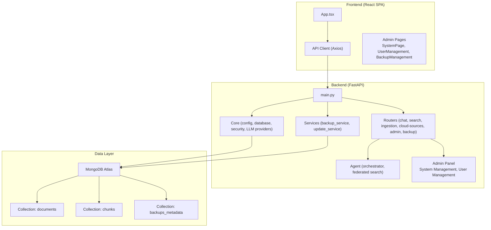

**Diagram sources**
- [backend/main.py:208-225](file://backend/main.py#L208-L225)
- [frontend/src/App.tsx:28-62](file://frontend/src/App.tsx#L28-L62)
- [backend/core/database.py:28-86](file://backend/core/database.py#L28-L86)
- [backend/routers/admin.py:28-598](file://backend/routers/admin.py#L28-L598)
- [backend/services/backup_service.py:67-136](file://backend/services/backup_service.py#L67-L136)

**Section sources**
- [README.md:151-181](file://README.md#L151-L181)
- [backend/main.py:208-225](file://backend/main.py#L208-L225)
- [frontend/src/App.tsx:28-62](file://frontend/src/App.tsx#L28-L62)

## Core Components
- FastAPI Application: Centralized API server with lifecycle management, middleware, and router composition
- Configuration Management: Centralized settings for API, database, LLM providers, and search parameters
- Database Layer: Async MongoDB connection manager with profile switching and stats/indexes helpers
- Security Middleware: Rate limiting, security headers, JWT secret validation, and documentation exposure controls
- LLM Providers: Unified abstraction supporting multiple providers via LiteLLM
- Agent Orchestration: Thinking-planning-evaluating-synthesizing phases with tool-calling
- Federated Search: Cross-database search with access control and RRF merging
- Cloud Sources: Provider registry, OAuth flows, sync configurations, and worker pool
- Admin Panel: System management, user administration, and monitoring capabilities
- Backup Service: Comprehensive backup system with multiple backup types and restoration
- Update Service: Offline package management with integrity verification and rollback
- Frontend API Client: Axios-based client with interceptors, error handling, and typed models

**Section sources**
- [backend/main.py:143-202](file://backend/main.py#L143-L202)
- [backend/core/config.py:9-218](file://backend/core/config.py#L9-L218)
- [backend/core/database.py:28-118](file://backend/core/database.py#L28-L118)
- [backend/core/security.py:147-224](file://backend/core/security.py#L147-L224)
- [backend/core/llm_providers.py:198-416](file://backend/core/llm_providers.py#L198-L416)
- [backend/agent/orchestrator.py:35-160](file://backend/agent/orchestrator.py#L35-L160)
- [backend/agent/federated_search.py:26-139](file://backend/agent/federated_search.py#L26-L139)
- [backend/providers/registry.py:20-76](file://backend/providers/registry.py#L20-L76)
- [frontend/src/api/client.ts:96-181](file://frontend/src/api/client.ts#L96-L181)

## Architecture Overview
The system follows a layered architecture:
- Presentation Layer: React SPA handles UI routing, state, and API interactions with dedicated admin interfaces
- Business Logic Layer: FastAPI routers implement domain logic, orchestration, integrations, and administrative functions
- Data Persistence Layer: MongoDB Atlas stores documents, chunks, and backup metadata with vector/text indexes
- Integration Layer: LLM providers, OAuth, and optional Airbyte for enterprise sources

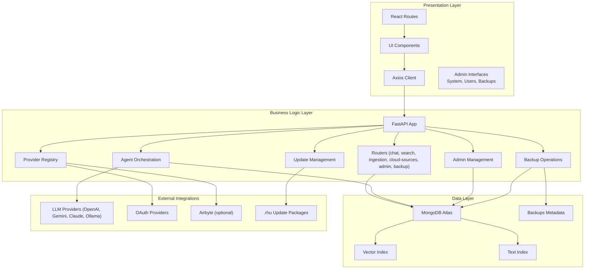

**Diagram sources**
- [backend/main.py:398-501](file://backend/main.py#L398-L501)
- [backend/routers/chat.py:634-698](file://backend/routers/chat.py#L634-L698)
- [backend/routers/search.py:34-108](file://backend/routers/search.py#L34-L108)
- [backend/agent/orchestrator.py:35-160](file://backend/agent/orchestrator.py#L35-L160)
- [backend/providers/registry.py:20-76](file://backend/providers/registry.py#L20-L76)
- [docs/architecture/cloud-sources-architecture.md:558-585](file://docs/architecture/cloud-sources-architecture.md#L558-L585)

## Detailed Component Analysis

### Backend Application Lifecycle and Middleware
The FastAPI application initializes database connections, loads persisted configuration, resumes interrupted ingestion jobs, and sets up security and request handling middleware. It enforces timeouts, rate limits, and security headers, and exposes modular routers for chat, search, ingestion, system, sessions, auth, status, indexes, ingestion queue, local LLM, cloud sources, prompts, admin, and backup.

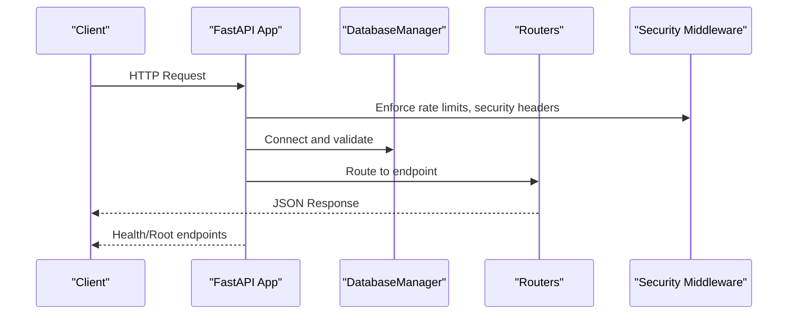

**Diagram sources**
- [backend/main.py:143-202](file://backend/main.py#L143-L202)
- [backend/core/security.py:147-224](file://backend/core/security.py#L147-L224)
- [backend/core/database.py:40-86](file://backend/core/database.py#L40-L86)

**Section sources**
- [backend/main.py:143-202](file://backend/main.py#L143-L202)
- [backend/core/security.py:147-224](file://backend/core/security.py#L147-L224)
- [backend/core/database.py:40-86](file://backend/core/database.py#L40-L86)

### Chat and Search Routers
The chat router implements conversational AI with RAG, tool-calling (search_knowledge_base, browse_web, web_search), and streaming responses. The search router provides semantic, text, and hybrid search endpoints backed by MongoDB Atlas vector and text indexes, with RRF merging for hybrid results.

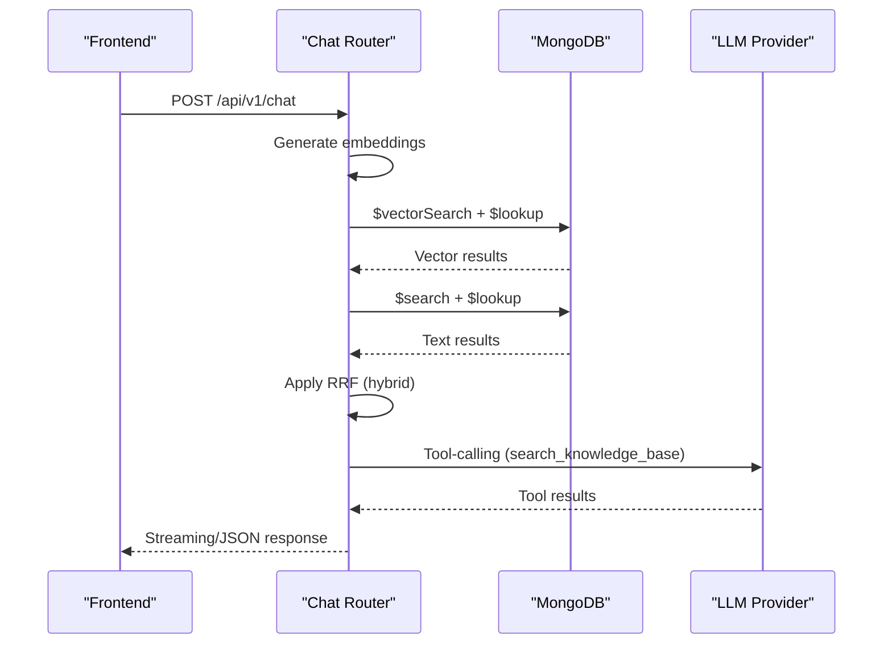

**Diagram sources**
- [backend/routers/chat.py:138-326](file://backend/routers/chat.py#L138-L326)
- [backend/routers/search.py:190-330](file://backend/routers/search.py#L190-L330)

**Section sources**
- [backend/routers/chat.py:634-698](file://backend/routers/chat.py#L634-L698)
- [backend/routers/search.py:34-108](file://backend/routers/search.py#L34-L108)
- [backend/routers/search.py:190-330](file://backend/routers/search.py#L190-L330)

### Agent Orchestration and Federated Search
The orchestrator coordinates multi-step reasoning using thinking, planning, evaluation, and synthesis phases. Federated search spans multiple databases (profile, personal, cloud) with access control, parallel execution, and RRF merging.

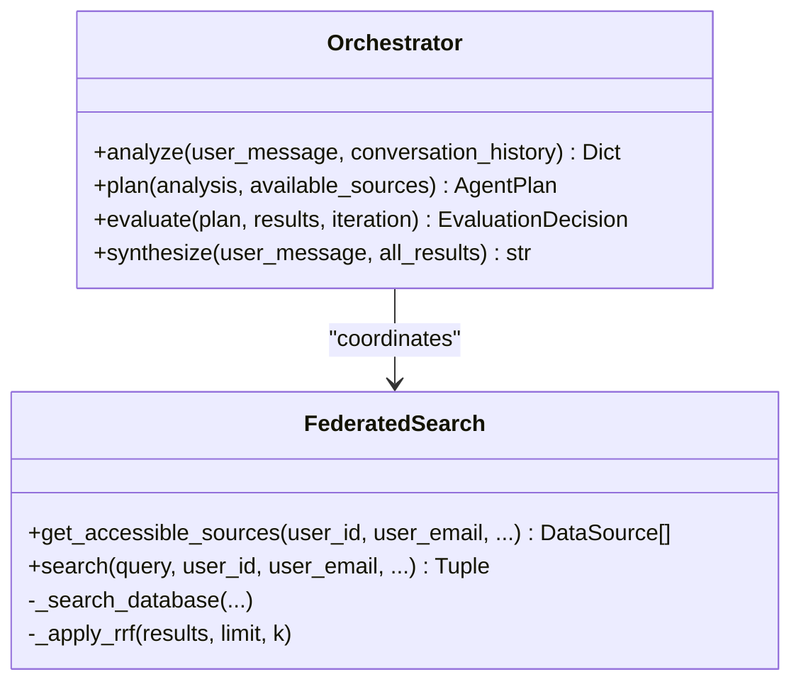

**Diagram sources**
- [backend/agent/orchestrator.py:35-160](file://backend/agent/orchestrator.py#L35-L160)
- [backend/agent/federated_search.py:26-139](file://backend/agent/federated_search.py#L26-L139)

**Section sources**
- [backend/agent/orchestrator.py:161-420](file://backend/agent/orchestrator.py#L161-L420)
- [backend/agent/federated_search.py:313-463](file://backend/agent/federated_search.py#L313-L463)
- [backend/agent/schemas.py:83-171](file://backend/agent/schemas.py#L83-L171)

### Cloud Sources Integration
The cloud sources domain provides provider discovery, OAuth flows, connection management, sync configurations, and a worker pool for incremental synchronization. The provider registry centralizes implementation discovery and instantiation.

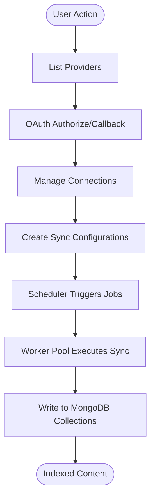

**Diagram sources**
- [backend/routers/cloud_sources/providers.py:150-178](file://backend/routers/cloud_sources/providers.py#L150-L178)
- [backend/providers/registry.py:20-76](file://backend/providers/registry.py#L20-L76)
- [docs/architecture/cloud-sources-architecture.md:389-477](file://docs/architecture/cloud-sources-architecture.md#L389-L477)

**Section sources**
- [backend/routers/cloud_sources/providers.py:24-147](file://backend/routers/cloud_sources/providers.py#L24-L147)
- [backend/providers/registry.py:79-142](file://backend/providers/registry.py#L79-L142)
- [docs/architecture/cloud-sources-architecture.md:234-311](file://docs/architecture/cloud-sources-architecture.md#L234-L311)

### Frontend Integration and API Contracts
The React frontend uses a typed API client with interceptors for authentication, retries, and error handling. It routes to pages for chat, search, documents, profiles, system, and cloud sources, interacting with backend endpoints defined in the routers.

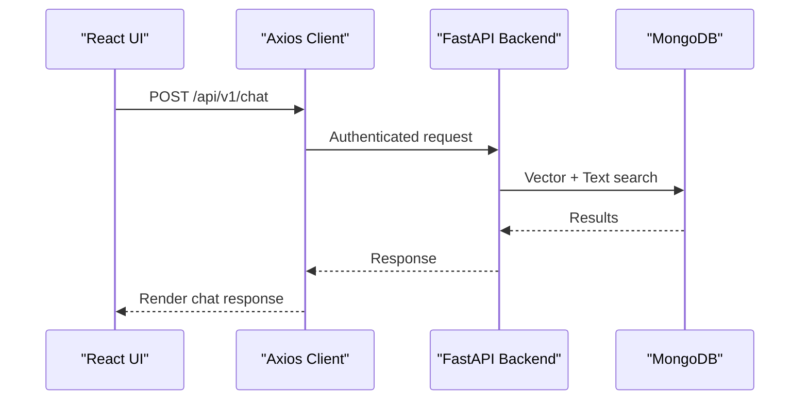

**Diagram sources**
- [frontend/src/App.tsx:28-62](file://frontend/src/App.tsx#L28-L62)
- [frontend/src/api/client.ts:96-181](file://frontend/src/api/client.ts#L96-L181)
- [backend/routers/chat.py:634-698](file://backend/routers/chat.py#L634-L698)

**Section sources**
- [frontend/src/App.tsx:28-62](file://frontend/src/App.tsx#L28-L62)
- [frontend/src/api/client.ts:96-181](file://frontend/src/api/client.ts#L96-L181)
- [backend/models/schemas.py:38-87](file://backend/models/schemas.py#L38-L87)

## Admin Panel Infrastructure

### System Management Capabilities
The admin panel provides comprehensive system management through dedicated endpoints and frontend interfaces. The system offers four main management areas: Status monitoring, Search Indexes, Ingestion management, and Configuration.

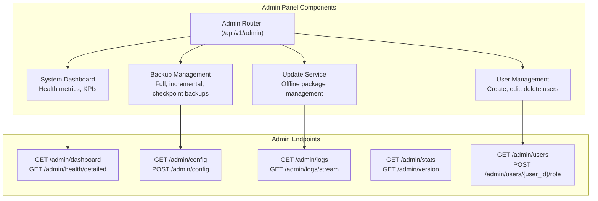

**Diagram sources**
- [backend/routers/admin.py:28-598](file://backend/routers/admin.py#L28-L598)
- [frontend/src/pages/SystemPage.tsx:13-49](file://frontend/src/pages/SystemPage.tsx#L13-L49)

### User Management Interface
The user management system provides comprehensive user administration with role-based access control. Features include user creation, editing, activation/deactivation, and role assignment with admin privileges.

**Section sources**
- [backend/routers/admin.py:426-474](file://backend/routers/admin.py#L426-L474)
- [frontend/src/pages/UserManagementPage.tsx:20-586](file://frontend/src/pages/UserManagementPage.tsx#L20-L586)

## Enhanced Backup System

### Comprehensive Backup Types
The backup system supports four distinct backup types designed for different scenarios and recovery needs:

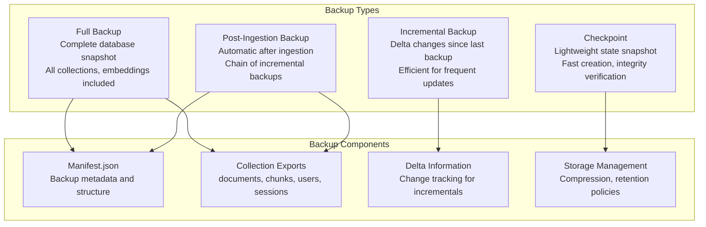

**Diagram sources**
- [backend/models/backup_schemas.py:9-15](file://backend/models/backup_schemas.py#L9-L15)
- [backend/services/backup_service.py:67-136](file://backend/services/backup_service.py#L67-L136)

### Backup Service Architecture
The backup service implements sophisticated backup management with configurable retention, compression, and restoration capabilities. It supports both synchronous and asynchronous backup operations with progress tracking and error handling.

**Section sources**
- [backend/services/backup_service.py:67-136](file://backend/services/backup_service.py#L67-L136)
- [backend/routers/backup.py:37-94](file://backend/routers/backup.py#L37-L94)
- [backend/models/backup_schemas.py:72-103](file://backend/models/backup_schemas.py#L72-L103)

## Update Service Architecture

### Offline Package Management
The update service enables offline software updates with comprehensive integrity verification and rollback capabilities. Update packages (.rhu) contain signed manifests, container images, migration scripts, and checksums for security and reliability.

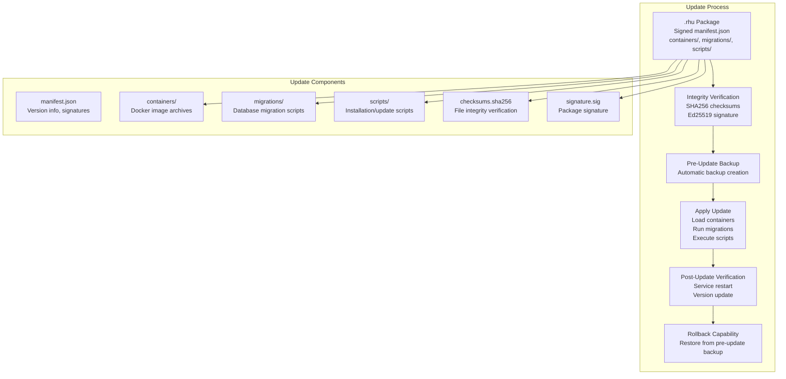

**Diagram sources**
- [backend/services/update_service.py:104-115](file://backend/services/update_service.py#L104-L115)
- [backend/services/update_service.py:242-284](file://backend/services/update_service.py#L242-L284)

### Update Service Implementation
The update service provides robust offline update management with version tracking, update history, and comprehensive rollback capabilities. It integrates with the backup service for pre-update protection and manages container image loading and database migrations.

**Section sources**
- [backend/services/update_service.py:104-115](file://backend/services/update_service.py#L104-L115)
- [backend/services/update_service.py:285-402](file://backend/services/update_service.py#L285-L402)
- [backend/services/update_service.py:547-589](file://backend/services/update_service.py#L547-L589)

## Dependency Analysis
The backend composes multiple modules with clear boundaries:
- Configuration drives database, LLM, and search behavior
- Database manager abstracts connection and operations
- Security middleware protects endpoints
- Routers encapsulate domain logic
- Agent orchestrator coordinates complex workflows
- Provider registry enables pluggable integrations
- Admin panel provides system management capabilities
- Backup service manages comprehensive backup operations
- Update service handles offline package management

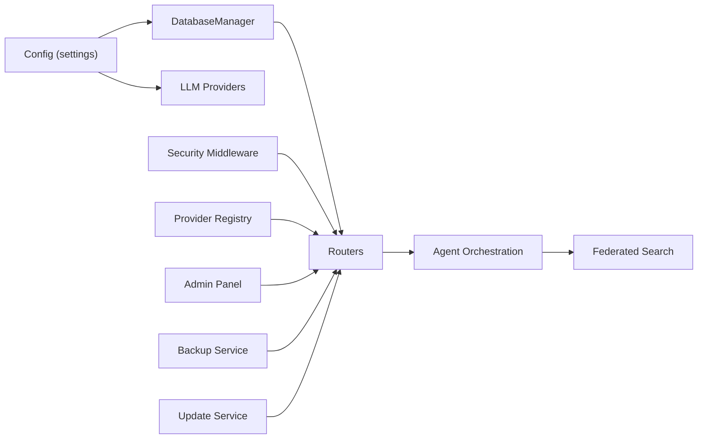

**Diagram sources**
- [backend/core/config.py:9-218](file://backend/core/config.py#L9-L218)
- [backend/core/database.py:28-118](file://backend/core/database.py#L28-L118)
- [backend/core/security.py:147-224](file://backend/core/security.py#L147-L224)
- [backend/core/llm_providers.py:198-416](file://backend/core/llm_providers.py#L198-L416)
- [backend/agent/orchestrator.py:35-160](file://backend/agent/orchestrator.py#L35-L160)
- [backend/agent/federated_search.py:26-139](file://backend/agent/federated_search.py#L26-L139)
- [backend/providers/registry.py:20-76](file://backend/providers/registry.py#L20-L76)

**Section sources**
- [backend/core/config.py:9-218](file://backend/core/config.py#L9-L218)
- [backend/core/database.py:28-118](file://backend/core/database.py#L28-L118)
- [backend/core/security.py:147-224](file://backend/core/security.py#L147-L224)
- [backend/core/llm_providers.py:198-416](file://backend/core/llm_providers.py#L198-L416)
- [backend/agent/orchestrator.py:35-160](file://backend/agent/orchestrator.py#L35-L160)
- [backend/agent/federated_search.py:26-139](file://backend/agent/federated_search.py#L26-L139)
- [backend/providers/registry.py:20-76](file://backend/providers/registry.py#L20-L76)

## Performance Considerations
- Asynchronous database operations: Dedicated thread pools isolate blocking operations from API concurrency
- Parallel execution: Federated search and ingestion leverage asyncio.gather for throughput
- Index utilization: Vector and text indexes minimize query latency; RRF merges results efficiently
- Streaming responses: Chat endpoints support streaming for improved perceived latency
- Rate limiting: Configurable sliding-window limits protect against abuse
- Thread pool sizing: Larger default thread pool accommodates ingestion-heavy workloads
- Backup optimization: Compression and selective embedding inclusion reduce storage requirements
- Update efficiency: Incremental backups and lightweight checkpoints minimize downtime

## Troubleshooting Guide
- Global exception handling: Structured error responses with unique error IDs and optional admin details
- Validation errors: Clear user-friendly messages with detailed logs
- HTTP exceptions: Consistent handling with appropriate status codes
- Logging: Extensive request/response logging with stack traces for diagnostics
- Health checks: Lightweight endpoints for load balancer and monitoring
- Security: JWT secret validation and documentation exposure controls
- Admin access: Role-based authorization with proper admin-only route protection
- Backup monitoring: Progress tracking and error reporting for backup operations
- Update rollback: Automatic rollback capability for failed updates

**Section sources**
- [backend/main.py:289-396](file://backend/main.py#L289-L396)
- [backend/core/security.py:261-297](file://backend/core/security.py#L261-L297)
- [backend/routers/admin.py:279-301](file://backend/routers/admin.py#L279-L301)

## Conclusion
MongoDB-RAG-Agent integrates a FastAPI backend, React frontend, and MongoDB Atlas to deliver a modular, extensible RAG platform with comprehensive administrative capabilities. The layered architecture separates concerns, while microservices-like routers encapsulate functional domains including chat, search, ingestion, cloud sources, admin panel, backup management, and update services. Containerization and docker-compose streamline local development and deployment. The system balances performance, security, and operability through middleware, async patterns, robust error handling, and enterprise-grade backup and update management capabilities.

## Appendices

### Containerization and Orchestration
- Docker Compose defines services for MongoDB Atlas local, backend, frontend, and optional CLI
- Ports are mapped for local access; services depend on health checks
- Environment variables configure LLM providers, embeddings, and Airbyte integration

**Section sources**
- [docker-compose.yml:15-143](file://docker-compose.yml#L15-L143)

### External Dependencies and Integration Points
- MongoDB Atlas: Vector and text indexes for hybrid search
- LLM providers: OpenAI, Google Gemini, Anthropic Claude, Ollama via LiteLLM
- OAuth providers: Google, Microsoft, Atlassian, and email providers
- Optional Airbyte: For complex enterprise sources and programmatic sync
- Update packages: .rhu format for offline software updates with integrity verification

**Section sources**
- [backend/core/llm_providers.py:20-27](file://backend/core/llm_providers.py#L20-L27)
- [backend/providers/registry.py:81-142](file://backend/providers/registry.py#L81-L142)
- [docs/architecture/cloud-sources-architecture.md:558-585](file://docs/architecture/cloud-sources-architecture.md#L558-L585)

### Admin Panel Features
- System monitoring with health metrics and KPIs
- User management with role-based access control
- Comprehensive backup management with multiple backup types
- Update service for offline package deployment
- Real-time log monitoring and streaming
- Configuration management with persistence

**Section sources**
- [backend/routers/admin.py:121-173](file://backend/routers/admin.py#L121-L173)
- [frontend/src/pages/SystemPage.tsx:51-114](file://frontend/src/pages/SystemPage.tsx#L51-L114)
- [frontend/src/pages/UserManagementPage.tsx:20-586](file://frontend/src/pages/UserManagementPage.tsx#L20-L586)
- [frontend/src/pages/BackupManagementPage.tsx:131-490](file://frontend/src/pages/BackupManagementPage.tsx#L131-L490)