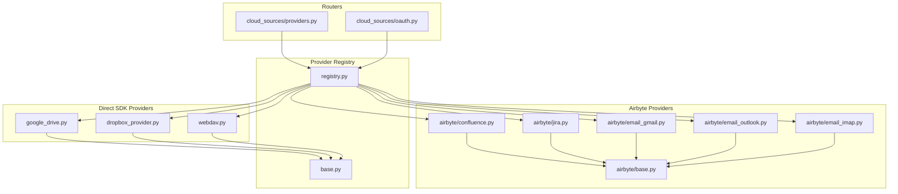
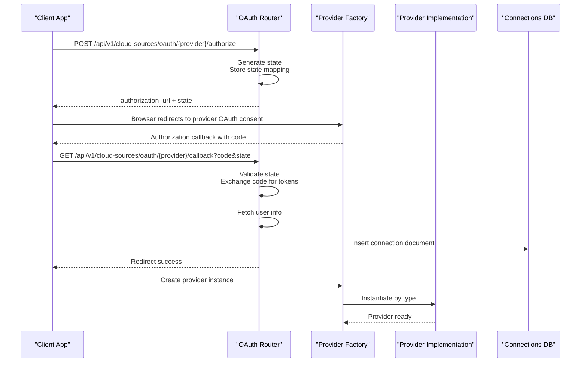
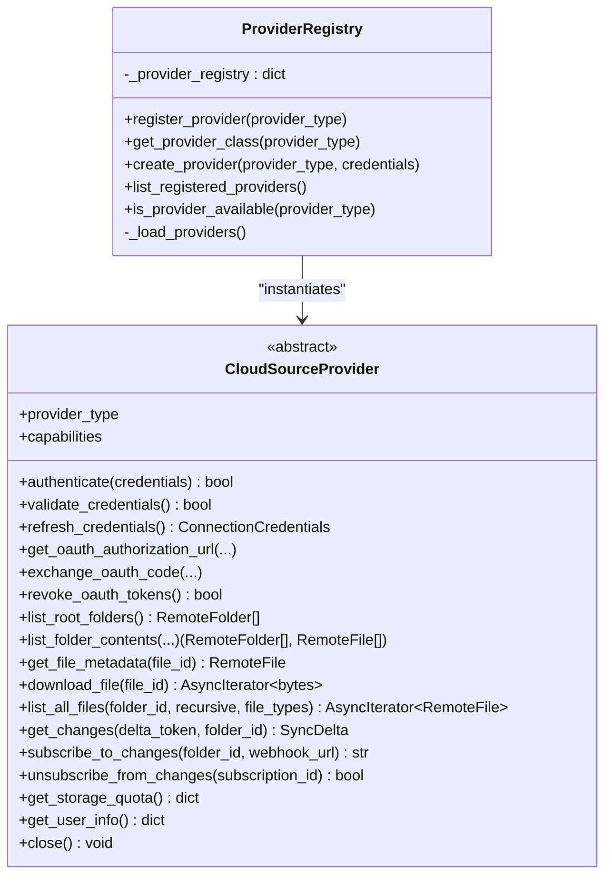
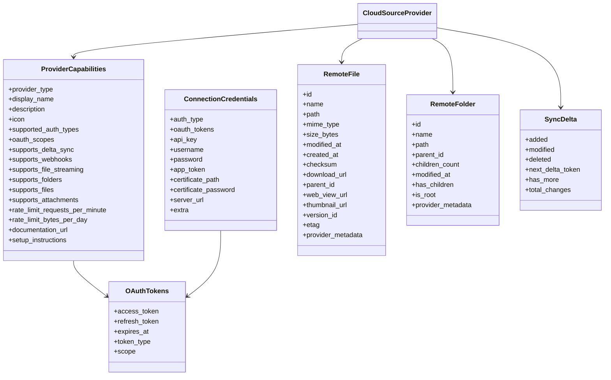
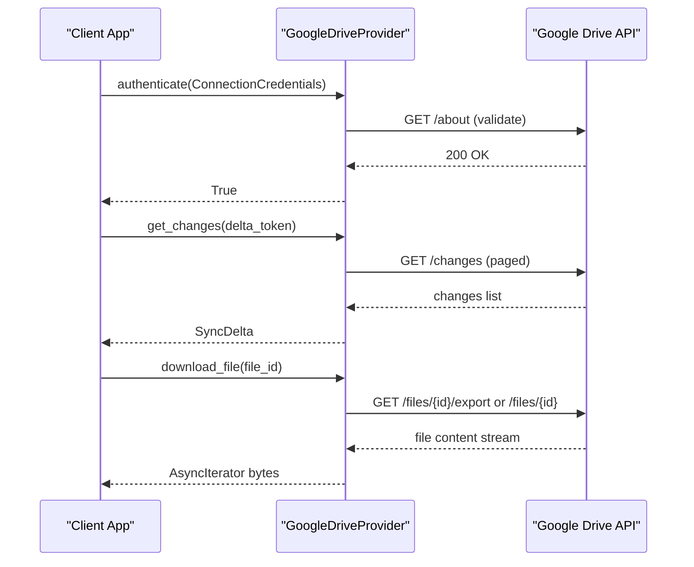
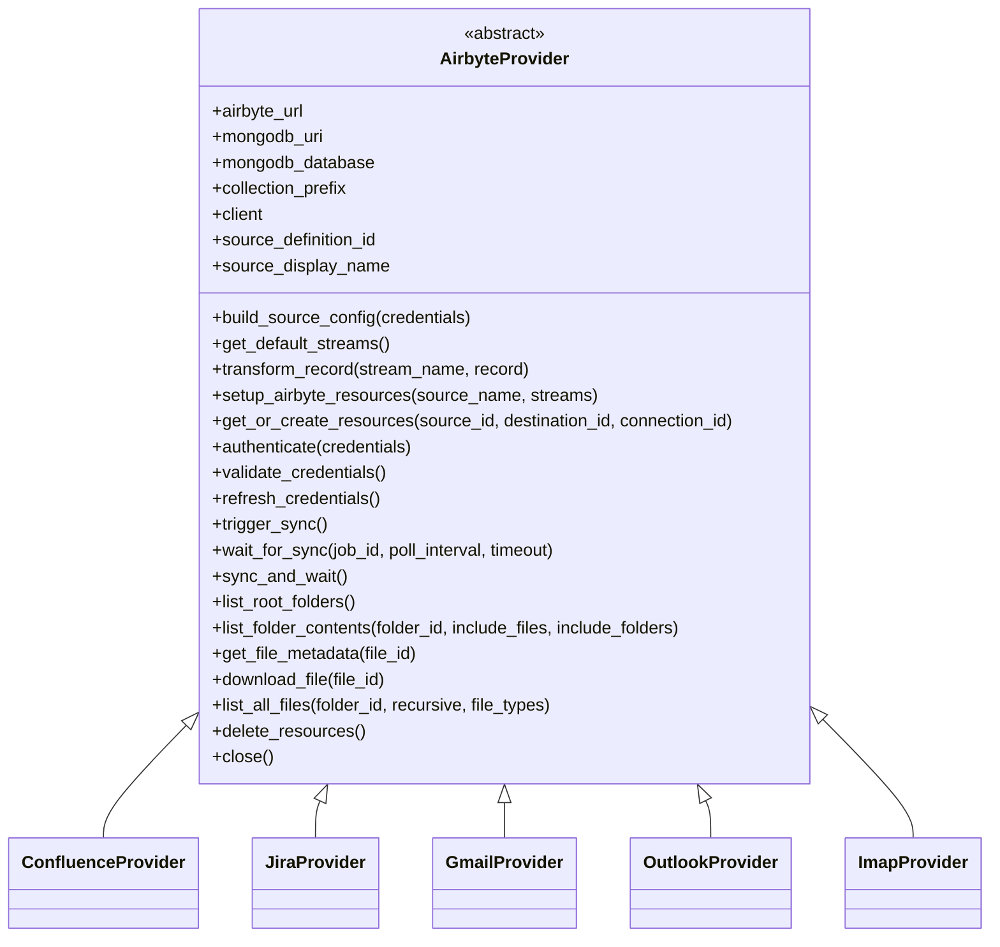
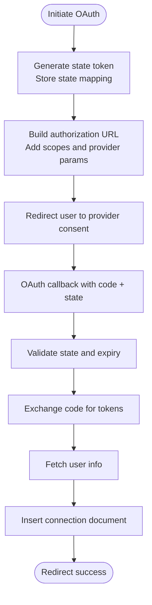
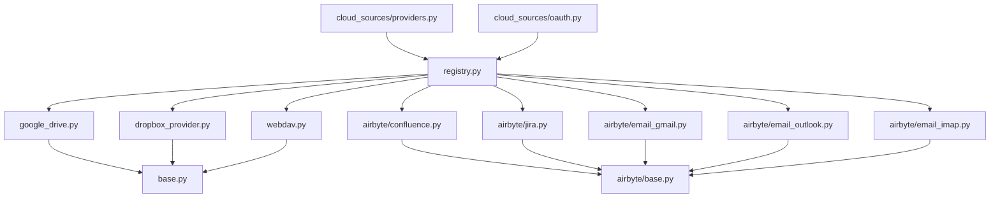

# Cloud Source Integration

<cite>
**Referenced Files in This Document**
- [registry.py](file://backend/providers/registry.py)
- [base.py](file://backend/providers/base.py)
- [google_drive.py](file://backend/providers/google_drive.py)
- [dropbox_provider.py](file://backend/providers/dropbox_provider.py)
- [webdav.py](file://backend/providers/webdav.py)
- [confluence.py](file://backend/providers/airbyte/confluence.py)
- [jira.py](file://backend/providers/airbyte/jira.py)
- [email_gmail.py](file://backend/providers/airbyte/email_gmail.py)
- [email_outlook.py](file://backend/providers/airbyte/email_outlook.py)
- [email_imap.py](file://backend/providers/airbyte/email_imap.py)
- [base.py](file://backend/providers/airbyte/base.py)
- [providers.py](file://backend/routers/cloud_sources/providers.py)
- [oauth.py](file://backend/routers/cloud_sources/oauth.py)
</cite>

## Table of Contents
1. [Introduction](#introduction)
2. [Project Structure](#project-structure)
3. [Core Components](#core-components)
4. [Architecture Overview](#architecture-overview)
5. [Detailed Component Analysis](#detailed-component-analysis)
6. [Dependency Analysis](#dependency-analysis)
7. [Performance Considerations](#performance-considerations)
8. [Troubleshooting Guide](#troubleshooting-guide)
9. [Conclusion](#conclusion)

## Introduction
This document explains the cloud source integration capabilities of the system, focusing on the provider registry, authentication framework, OAuth flows, and provider implementations. It covers file storage providers (Google Drive, Dropbox, WebDAV/OwnCloud/Nextcloud), collaboration platforms (Confluence, Jira), and email providers (Gmail, Outlook, IMAP). It also documents the Airbyte integration pattern for enterprise cloud sources and outlines extensibility guidelines for adding custom providers that implement the CloudSourceProvider interface.

## Project Structure
The cloud source integration spans three main areas:
- Provider registry and base interfaces
- Provider implementations (file storage, WebDAV, Airbyte-backed)
- Router endpoints for provider discovery and OAuth flows

**Diagram sources**
- [registry.py](file://backend/providers/registry.py#L1-L143)
- [base.py](file://backend/providers/base.py#L1-L525)
- [google_drive.py](file://backend/providers/google_drive.py#L1-L627)
- [dropbox_provider.py](file://backend/providers/dropbox_provider.py#L1-L582)
- [webdav.py](file://backend/providers/webdav.py#L1-L551)
- [confluence.py](file://backend/providers/airbyte/confluence.py#L1-L337)
- [jira.py](file://backend/providers/airbyte/jira.py#L1-L370)
- [email_gmail.py](file://backend/providers/airbyte/email_gmail.py#L1-L367)
- [email_outlook.py](file://backend/providers/airbyte/email_outlook.py#L1-L302)
- [email_imap.py](file://backend/providers/airbyte/email_imap.py#L1-L394)
- [base.py](file://backend/providers/airbyte/base.py#L1-L566)
- [providers.py](file://backend/routers/cloud_sources/providers.py#L1-L184)
- [oauth.py](file://backend/routers/cloud_sources/oauth.py#L1-L537)

**Section sources**
- [registry.py](file://backend/providers/registry.py#L1-L143)
- [base.py](file://backend/providers/base.py#L1-L525)
- [providers.py](file://backend/routers/cloud_sources/providers.py#L1-L184)
- [oauth.py](file://backend/routers/cloud_sources/oauth.py#L1-L537)

## Core Components
- Provider Registry and Factory: Centralized registry that registers provider implementations and instantiates them by type. It auto-imports providers to populate the registry and exposes helper functions to list and validate providers.
- Base Provider Interface: Defines the CloudSourceProvider abstract interface, common data structures (ProviderCapabilities, ConnectionCredentials, OAuthTokens, RemoteFile, RemoteFolder, SyncDelta), and standardized methods for authentication, browsing, file operations, and sync.
- Router Endpoints: Expose provider capabilities and manage OAuth flows for supported providers.

Key responsibilities:
- Provider registration and discovery
- Unified authentication and credential model
- Standardized sync operations and delta handling
- OAuth initiation, callback, token refresh, and revocation
- Airbyte integration for enterprise sources

**Section sources**
- [registry.py](file://backend/providers/registry.py#L20-L76)
- [base.py](file://backend/providers/base.py#L179-L491)
- [providers.py](file://backend/routers/cloud_sources/providers.py#L24-L147)
- [oauth.py](file://backend/routers/cloud_sources/oauth.py#L128-L146)

## Architecture Overview
The system uses a provider registry to instantiate concrete providers that implement the CloudSourceProvider interface. For enterprise sources, providers inherit from AirbyteProvider and integrate with Airbyte’s source/destination/sync pipeline. OAuth flows are managed by dedicated router endpoints that handle authorization URLs, callbacks, token exchange, and refresh.

**Diagram sources**
- [oauth.py](file://backend/routers/cloud_sources/oauth.py#L155-L218)
- [oauth.py](file://backend/routers/cloud_sources/oauth.py#L221-L319)
- [registry.py](file://backend/providers/registry.py#L45-L66)
- [providers.py](file://backend/routers/cloud_sources/providers.py#L150-L160)

## Detailed Component Analysis

### Provider Registry and Factory
The registry centralizes provider registration and instantiation. It maintains a mapping from ProviderType to provider classes, auto-imports implementations, and exposes helpers to list and validate providers.

**Diagram sources**
- [registry.py](file://backend/providers/registry.py#L24-L76)
- [base.py](file://backend/providers/base.py#L179-L491)

**Section sources**
- [registry.py](file://backend/providers/registry.py#L20-L143)
- [base.py](file://backend/providers/base.py#L179-L491)

### Base Provider Interface and Data Models
The base module defines:
- ProviderType enumeration for supported providers
- AuthType enumeration for authentication methods
- ProviderCapabilities describing provider features and rate limits
- ConnectionCredentials unified credential container
- OAuthTokens for OAuth 2.0 tokens
- RemoteFile and RemoteFolder for normalized file metadata
- SyncDelta for incremental sync deltas
- CloudSourceProvider abstract interface with standardized methods

**Diagram sources**
- [base.py](file://backend/providers/base.py#L18-L138)
- [base.py](file://backend/providers/base.py#L151-L177)
- [base.py](file://backend/providers/base.py#L141-L148)
- [base.py](file://backend/providers/base.py#L76-L120)
- [base.py](file://backend/providers/base.py#L123-L138)

**Section sources**
- [base.py](file://backend/providers/base.py#L18-L138)
- [base.py](file://backend/providers/base.py#L151-L177)
- [base.py](file://backend/providers/base.py#L205-L290)

### Google Drive Provider
Implements OAuth 2.0 authentication, file listing, streaming downloads, and delta sync via the Google Drive API. It exports Google Workspace documents to PDF/XLSX for indexing.

Key features:
- OAuth 2.0 with refresh token support
- Delta sync using Changes API
- Streaming downloads with Google Workspace export
- Storage quota and user info retrieval

**Diagram sources**
- [google_drive.py](file://backend/providers/google_drive.py#L136-L176)
- [google_drive.py](file://backend/providers/google_drive.py#L516-L584)
- [google_drive.py](file://backend/providers/google_drive.py#L446-L475)

**Section sources**
- [google_drive.py](file://backend/providers/google_drive.py#L51-L91)
- [google_drive.py](file://backend/providers/google_drive.py#L136-L217)
- [google_drive.py](file://backend/providers/google_drive.py#L516-L584)

### Dropbox Provider
Implements OAuth 2.0 authentication, cursor-based delta sync, and streaming downloads via the Dropbox API v2.

Key features:
- OAuth 2.0 with refresh token support
- Cursor-based delta sync
- Streaming downloads with content endpoint
- Storage quota and user info retrieval

**Section sources**
- [dropbox_provider.py](file://backend/providers/dropbox_provider.py#L38-L73)
- [dropbox_provider.py](file://backend/providers/dropbox_provider.py#L127-L202)
- [dropbox_provider.py](file://backend/providers/dropbox_provider.py#L478-L543)

### WebDAV/OwnCloud/Nextcloud Provider
Implements password and app token authentication, PROPFIND-based listing, and streaming downloads for WebDAV-compatible servers.

Key features:
- Password and app token authentication
- PROPFIND XML parsing for metadata
- Streaming downloads
- Quota retrieval via PROPFIND properties

**Section sources**
- [webdav.py](file://backend/providers/webdav.py#L61-L96)
- [webdav.py](file://backend/providers/webdav.py#L260-L307)
- [webdav.py](file://backend/providers/webdav.py#L459-L473)

### Airbyte Integration Pattern
Enterprise providers (Confluence, Jira, Gmail, Outlook, IMAP) inherit from AirbyteProvider, which manages Airbyte sources, destinations, and sync jobs. The base class supports profile-aware configuration and collection prefixing.

**Diagram sources**
- [base.py](file://backend/providers/airbyte/base.py#L52-L566)
- [confluence.py](file://backend/providers/airbyte/confluence.py#L27-L75)
- [jira.py](file://backend/providers/airbyte/jira.py#L27-L76)
- [email_gmail.py](file://backend/providers/airbyte/email_gmail.py#L27-L73)
- [email_outlook.py](file://backend/providers/airbyte/email_outlook.py#L27-L74)
- [email_imap.py](file://backend/providers/airbyte/email_imap.py#L27-L91)

**Section sources**
- [base.py](file://backend/providers/airbyte/base.py#L66-L141)
- [base.py](file://backend/providers/airbyte/base.py#L200-L374)
- [base.py](file://backend/providers/airbyte/base.py#L418-L453)

### Confluence Provider
- Supports OAuth 2.0 and API key authentication
- Streams: pages, blog_posts, spaces, page_attachments
- Transforms records to RemoteFile with HTML content
- Delta sync via Airbyte job completion

**Section sources**
- [confluence.py](file://backend/providers/airbyte/confluence.py#L27-L75)
- [confluence.py](file://backend/providers/airbyte/confluence.py#L85-L124)
- [confluence.py](file://backend/providers/airbyte/confluence.py#L135-L264)
- [confluence.py](file://backend/providers/airbyte/confluence.py#L310-L336)

### Jira Provider
- Supports OAuth 2.0 and API key authentication
- Streams: issues, projects, issue_comments, issue_fields, users, sprints
- Transforms records to Markdown content with custom fields
- Delta sync via Airbyte job completion

**Section sources**
- [jira.py](file://backend/providers/airbyte/jira.py#L27-L76)
- [jira.py](file://backend/providers/airbyte/jira.py#L86-L133)
- [jira.py](file://backend/providers/airbyte/jira.py#L146-L311)
- [jira.py](file://backend/providers/airbyte/jira.py#L350-L369)

### Gmail Provider
- OAuth 2.0 authentication via Google OAuth
- Streams: messages, threads, labels
- Transforms messages/threads to RemoteFile with extracted body content
- Delta sync via Airbyte job completion

**Section sources**
- [email_gmail.py](file://backend/providers/airbyte/email_gmail.py#L27-L73)
- [email_gmail.py](file://backend/providers/airbyte/email_gmail.py#L83-L110)
- [email_gmail.py](file://backend/providers/airbyte/email_gmail.py#L120-L198)
- [email_gmail.py](file://backend/providers/airbyte/email_gmail.py#L347-L366)

### Outlook Provider
- OAuth 2.0 authentication via Microsoft OAuth
- Streams: messages, mail_folders
- Transforms messages to RemoteFile with body content
- Delta sync via Airbyte job completion

**Section sources**
- [email_outlook.py](file://backend/providers/airbyte/email_outlook.py#L27-L74)
- [email_outlook.py](file://backend/providers/airbyte/email_outlook.py#L84-L116)
- [email_outlook.py](file://backend/providers/airbyte/email_outlook.py#L125-L223)
- [email_outlook.py](file://backend/providers/airbyte/email_outlook.py#L282-L301)

### IMAP Provider
- Password authentication for generic IMAP servers
- Streams: messages, folders
- Non-destructive sync by default (read-only, peek mode, preserve flags)
- Delta sync via UIDVALIDITY

**Section sources**
- [email_imap.py](file://backend/providers/airbyte/email_imap.py#L27-L91)
- [email_imap.py](file://backend/providers/airbyte/email_imap.py#L101-L212)
- [email_imap.py](file://backend/providers/airbyte/email_imap.py#L221-L305)
- [email_imap.py](file://backend/providers/airbyte/email_imap.py#L374-L393)

### Provider Discovery Router
Lists available providers and their capabilities, including supported auth types, delta/webhook support, documentation links, and setup instructions.

**Section sources**
- [providers.py](file://backend/routers/cloud_sources/providers.py#L24-L147)
- [providers.py](file://backend/routers/cloud_sources/providers.py#L150-L178)

### OAuth Router
Manages OAuth 2.0 flows for supported providers:
- Initiates authorization with state generation
- Handles callbacks and token exchange
- Stores encrypted-like credentials and user info
- Provides manual token refresh and revocation placeholders

**Diagram sources**
- [oauth.py](file://backend/routers/cloud_sources/oauth.py#L155-L218)
- [oauth.py](file://backend/routers/cloud_sources/oauth.py#L221-L319)

**Section sources**
- [oauth.py](file://backend/routers/cloud_sources/oauth.py#L128-L146)
- [oauth.py](file://backend/routers/cloud_sources/oauth.py#L155-L218)
- [oauth.py](file://backend/routers/cloud_sources/oauth.py#L221-L319)
- [oauth.py](file://backend/routers/cloud_sources/oauth.py#L400-L468)
- [oauth.py](file://backend/routers/cloud_sources/oauth.py#L500-L536)

## Dependency Analysis
Provider relationships and dependencies:

**Diagram sources**
- [registry.py](file://backend/providers/registry.py#L79-L142)
- [google_drive.py](file://backend/providers/google_drive.py#L30-L31)
- [dropbox_provider.py](file://backend/providers/dropbox_provider.py#L28-L29)
- [webdav.py](file://backend/providers/webdav.py#L30-L31)
- [confluence.py](file://backend/providers/airbyte/confluence.py#L21-L22)
- [jira.py](file://backend/providers/airbyte/jira.py#L21-L22)
- [email_gmail.py](file://backend/providers/airbyte/email_gmail.py#L21-L22)
- [email_outlook.py](file://backend/providers/airbyte/email_outlook.py#L21-L22)
- [email_imap.py](file://backend/providers/airbyte/email_imap.py#L21-L22)
- [base.py](file://backend/providers/base.py#L11-L16)
- [base.py](file://backend/providers/airbyte/base.py#L28-L39)
- [providers.py](file://backend/routers/cloud_sources/providers.py#L11-L17)
- [oauth.py](file://backend/routers/cloud_sources/oauth.py#L17-L29)

**Section sources**
- [registry.py](file://backend/providers/registry.py#L79-L142)
- [base.py](file://backend/providers/base.py#L11-L16)
- [base.py](file://backend/providers/airbyte/base.py#L28-L39)

## Performance Considerations
- Rate limits: Providers declare per-minute and daily limits in ProviderCapabilities. Respect these limits to avoid throttling.
- Streaming downloads: Use download_file streaming to avoid loading entire files into memory.
- Delta sync: Prefer providers supporting delta sync (Google Drive, Dropbox, Airbyte-backed) to minimize API calls.
- Pagination: Use cursor-based pagination (Dropbox) or pageToken-based pagination (Google Drive) to handle large datasets efficiently.
- Concurrency: AirbyteProvider uses async operations; ensure proper resource cleanup and connection pooling.

[No sources needed since this section provides general guidance]

## Troubleshooting Guide
Common issues and resolutions:
- Authentication failures: Verify OAuth client credentials and scopes. Check token expiration and refresh tokens.
- Rate limit errors: Implement backoff and retry logic. Monitor ProviderCapabilities.rate_limit_*.
- Provider not available: Confirm provider registration and environment variables for OAuth client IDs/secrets.
- Airbyte connectivity: Ensure Airbyte is running and reachable. Check workspace/destination IDs and MongoDB connectivity.
- WebDAV errors: Validate server URL, credentials, and WebDAV path encoding.

**Section sources**
- [base.py](file://backend/providers/base.py#L505-L525)
- [google_drive.py](file://backend/providers/google_drive.py#L117-L128)
- [dropbox_provider.py](file://backend/providers/dropbox_provider.py#L103-L119)
- [webdav.py](file://backend/providers/webdav.py#L152-L159)
- [base.py](file://backend/providers/airbyte/base.py#L224-L230)

## Conclusion
The cloud source integration leverages a robust provider registry and unified base interface to support diverse cloud providers. OAuth flows are centralized in router endpoints, while enterprise integrations use Airbyte for reliable, scalable sync. The design enables extensibility through the CloudSourceProvider interface and AirbyteProvider base class, allowing new providers to be added with minimal boilerplate.