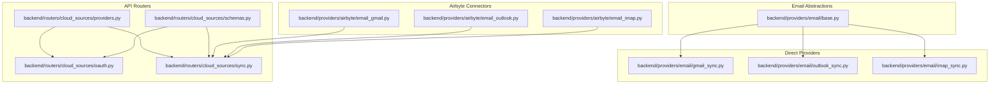
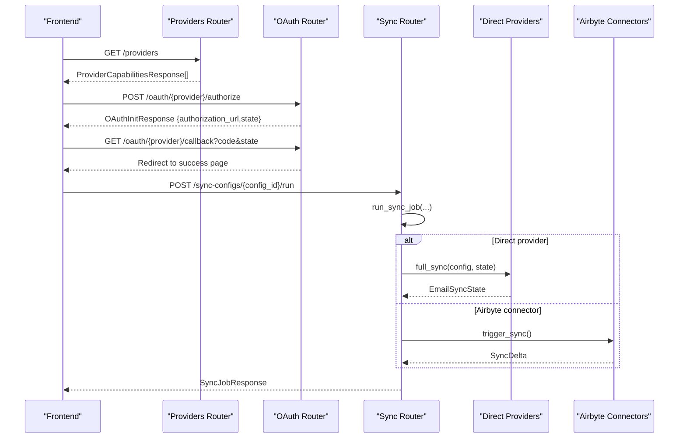
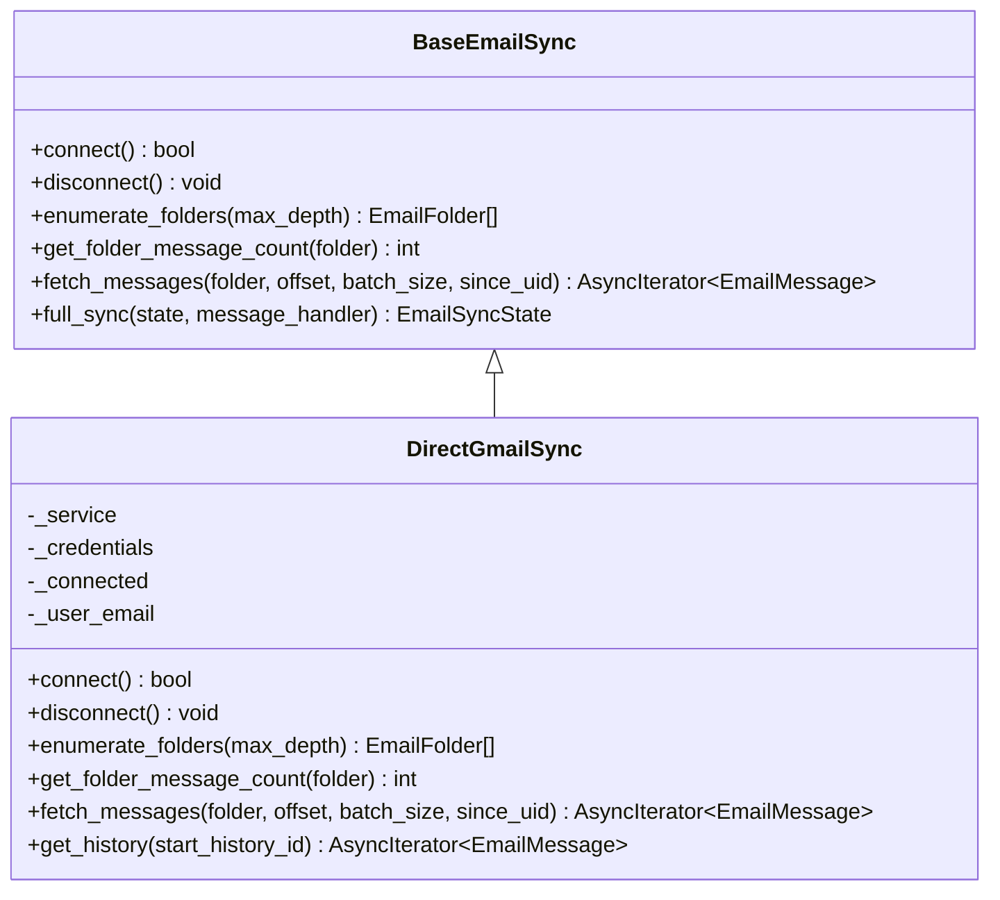
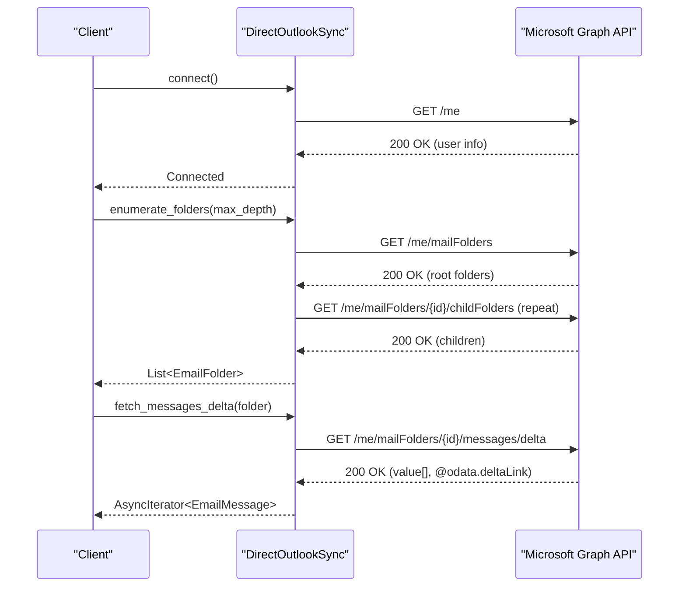
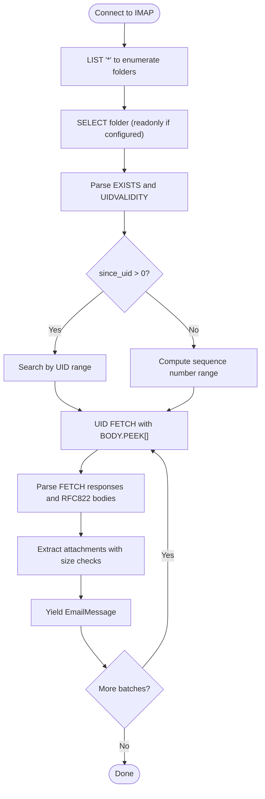
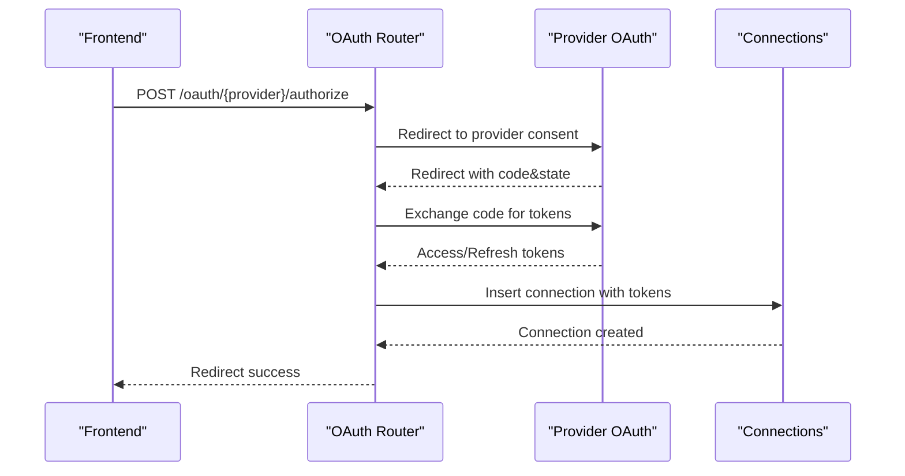
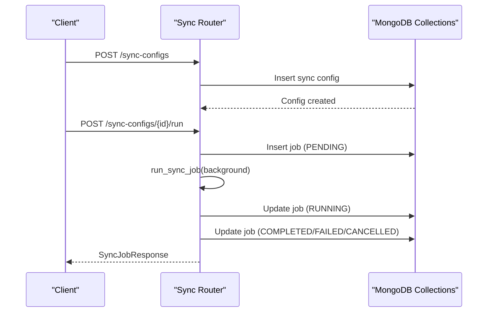
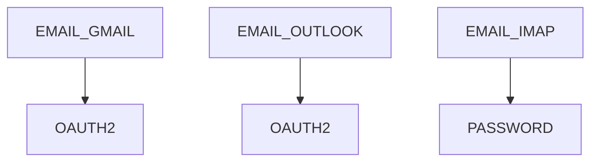

# Email Providers

<cite>
**Referenced Files in This Document**
- [base.py](file://backend/providers/email/base.py)
- [gmail_sync.py](file://backend/providers/email/gmail_sync.py)
- [outlook_sync.py](file://backend/providers/email/outlook_sync.py)
- [imap_sync.py](file://backend/providers/email/imap_sync.py)
- [email_gmail.py](file://backend/providers/airbyte/email_gmail.py)
- [email_outlook.py](file://backend/providers/airbyte/email_outlook.py)
- [email_imap.py](file://backend/providers/airbyte/email_imap.py)
- [providers.py](file://backend/routers/cloud_sources/providers.py)
- [oauth.py](file://backend/routers/cloud_sources/oauth.py)
- [sync.py](file://backend/routers/cloud_sources/sync.py)
- [schemas.py](file://backend/routers/cloud_sources/schemas.py)
</cite>

## Table of Contents
1. [Introduction](#introduction)
2. [Project Structure](#project-structure)
3. [Core Components](#core-components)
4. [Architecture Overview](#architecture-overview)
5. [Detailed Component Analysis](#detailed-component-analysis)
6. [Dependency Analysis](#dependency-analysis)
7. [Performance Considerations](#performance-considerations)
8. [Troubleshooting Guide](#troubleshooting-guide)
9. [Conclusion](#conclusion)
10. [Appendices](#appendices)

## Introduction
This document explains the email provider integrations in the system, covering three distinct approaches:
- Direct provider implementations using native APIs and protocols
- Airbyte-based connectors for managed ingestion
- Authentication and orchestration via OAuth and sync scheduling

It focuses on Gmail, Outlook, and IMAP providers, detailing OAuth 2.0 authentication, API integration, email synchronization, filtering, message parsing, and attachment handling. It also covers configuration, troubleshooting, and security considerations for email access, rate limiting, and compliance.

## Project Structure
The email provider ecosystem is organized around:
- Shared email synchronization abstractions and models
- Direct provider implementations (Gmail, Outlook, IMAP)
- Airbyte connectors for managed ingestion
- API routers for provider discovery, OAuth, and sync orchestration
- Pydantic schemas defining request/response contracts

**Diagram sources**
- [base.py](file://backend/providers/email/base.py#L313-L641)
- [gmail_sync.py](file://backend/providers/email/gmail_sync.py#L41-L522)
- [outlook_sync.py](file://backend/providers/email/outlook_sync.py#L38-L478)
- [imap_sync.py](file://backend/providers/email/imap_sync.py#L45-L646)
- [email_gmail.py](file://backend/providers/airbyte/email_gmail.py#L27-L367)
- [email_outlook.py](file://backend/providers/airbyte/email_outlook.py#L27-L302)
- [email_imap.py](file://backend/providers/airbyte/email_imap.py#L27-L394)
- [providers.py](file://backend/routers/cloud_sources/providers.py#L24-L147)
- [oauth.py](file://backend/routers/cloud_sources/oauth.py#L128-L537)
- [sync.py](file://backend/routers/cloud_sources/sync.py#L391-L478)
- [schemas.py](file://backend/routers/cloud_sources/schemas.py#L16-L404)

**Section sources**
- [base.py](file://backend/providers/email/base.py#L1-L641)
- [gmail_sync.py](file://backend/providers/email/gmail_sync.py#L1-L522)
- [outlook_sync.py](file://backend/providers/email/outlook_sync.py#L1-L478)
- [imap_sync.py](file://backend/providers/email/imap_sync.py#L1-L646)
- [email_gmail.py](file://backend/providers/airbyte/email_gmail.py#L1-L367)
- [email_outlook.py](file://backend/providers/airbyte/email_outlook.py#L1-L302)
- [email_imap.py](file://backend/providers/airbyte/email_imap.py#L1-L394)
- [providers.py](file://backend/routers/cloud_sources/providers.py#L1-L184)
- [oauth.py](file://backend/routers/cloud_sources/oauth.py#L1-L537)
- [sync.py](file://backend/routers/cloud_sources/sync.py#L1-L874)
- [schemas.py](file://backend/routers/cloud_sources/schemas.py#L1-L404)

## Core Components
The core email synchronization framework defines shared models, configuration, and a base class that all providers implement. It includes:
- Data models: EmailFolder, EmailMessage, EmailAttachment
- Sync state and progress tracking
- Configuration for connection, OAuth, batching, and storage
- A base class with lifecycle hooks for connect/disconnect, folder enumeration, message fetching, and full synchronization with checkpointing and resume

Key elements:
- EmailFolder: hierarchical representation of folders/mailboxes with counts and flags
- EmailMessage: normalized email with sender, recipients, dates, body, flags, attachments, and metadata
- EmailAttachment: attachment metadata and optional raw content
- EmailSyncConfig: connection, OAuth, behavior, performance, and storage settings
- BaseEmailSync: abstract interface and robust full_sync orchestration with progress reporting and checkpointing

**Section sources**
- [base.py](file://backend/providers/email/base.py#L29-L190)
- [base.py](file://backend/providers/email/base.py#L252-L311)
- [base.py](file://backend/providers/email/base.py#L313-L482)
- [base.py](file://backend/providers/email/base.py#L483-L641)

## Architecture Overview
The system supports two integration modes:
- Direct providers: Native API/protocol clients (Gmail, Outlook, IMAP) implementing BaseEmailSync
- Airbyte connectors: Managed ingestion via Airbyte sources for Gmail, Outlook, and IMAP

Discovery and authentication are handled by routers:
- Provider capabilities and setup instructions are exposed via providers router
- OAuth 2.0 flows are orchestrated by oauth router
- Sync orchestration and job lifecycle are managed by sync router

**Diagram sources**
- [providers.py](file://backend/routers/cloud_sources/providers.py#L150-L184)
- [oauth.py](file://backend/routers/cloud_sources/oauth.py#L155-L320)
- [sync.py](file://backend/routers/cloud_sources/sync.py#L316-L478)
- [gmail_sync.py](file://backend/providers/email/gmail_sync.py#L41-L100)
- [outlook_sync.py](file://backend/providers/email/outlook_sync.py#L38-L99)
- [imap_sync.py](file://backend/providers/email/imap_sync.py#L45-L109)
- [email_gmail.py](file://backend/providers/airbyte/email_gmail.py#L310-L367)
- [email_outlook.py](file://backend/providers/airbyte/email_outlook.py#L245-L302)
- [email_imap.py](file://backend/providers/airbyte/email_imap.py#L337-L394)

## Detailed Component Analysis

### Gmail Provider Implementation
Gmail integration is available in two forms:
- Direct Gmail API client (BaseEmailSync subclass)
- Airbyte Gmail connector

Direct implementation highlights:
- OAuth 2.0 credentials with token refresh
- Label enumeration (supports nested labels)
- Message listing with pagination and BODY.PEEK for non-destructive reads
- Body extraction (plain/text and HTML), snippet generation
- Attachment extraction with size limits
- History-based incremental sync (get_history)

**Diagram sources**
- [base.py](file://backend/providers/email/base.py#L313-L482)
- [gmail_sync.py](file://backend/providers/email/gmail_sync.py#L41-L100)
- [gmail_sync.py](file://backend/providers/email/gmail_sync.py#L106-L192)
- [gmail_sync.py](file://backend/providers/email/gmail_sync.py#L208-L287)
- [gmail_sync.py](file://backend/providers/email/gmail_sync.py#L468-L522)

Key configuration and behavior:
- OAuth access/refresh tokens required
- Batch size up to 500 per API call
- Snippet derived from body or API-provided snippet
- Attachment extraction with nested payload traversal

**Section sources**
- [gmail_sync.py](file://backend/providers/email/gmail_sync.py#L41-L100)
- [gmail_sync.py](file://backend/providers/email/gmail_sync.py#L106-L192)
- [gmail_sync.py](file://backend/providers/email/gmail_sync.py#L208-L287)
- [gmail_sync.py](file://backend/providers/email/gmail_sync.py#L288-L393)
- [gmail_sync.py](file://backend/providers/email/gmail_sync.py#L394-L467)
- [gmail_sync.py](file://backend/providers/email/gmail_sync.py#L468-L522)

### Outlook Provider Setup
Outlook integration is available via:
- Direct Microsoft Graph API client (BaseEmailSync subclass)
- Airbyte Microsoft Graph connector

Direct implementation highlights:
- OAuth 2.0 bearer token authentication
- Recursive folder enumeration using childFolders endpoint
- Message listing with OData parameters and pagination
- Delta sync support via delta links
- Attachment retrieval via dedicated endpoint
- Body extraction (HTML or plain), snippet, flags, and thread IDs

**Diagram sources**
- [outlook_sync.py](file://backend/providers/email/outlook_sync.py#L38-L99)
- [outlook_sync.py](file://backend/providers/email/outlook_sync.py#L101-L172)
- [outlook_sync.py](file://backend/providers/email/outlook_sync.py#L173-L198)
- [outlook_sync.py](file://backend/providers/email/outlook_sync.py#L219-L298)
- [outlook_sync.py](file://backend/providers/email/outlook_sync.py#L378-L441)
- [outlook_sync.py](file://backend/providers/email/outlook_sync.py#L442-L478)

Key configuration and behavior:
- Access token required; uses bearer auth headers
- Delta links persist for incremental sync
- Max batch size 999 per request
- Attachment metadata retrieved separately

**Section sources**
- [outlook_sync.py](file://backend/providers/email/outlook_sync.py#L38-L99)
- [outlook_sync.py](file://backend/providers/email/outlook_sync.py#L101-L172)
- [outlook_sync.py](file://backend/providers/email/outlook_sync.py#L173-L198)
- [outlook_sync.py](file://backend/providers/email/outlook_sync.py#L219-L298)
- [outlook_sync.py](file://backend/providers/email/outlook_sync.py#L378-L441)
- [outlook_sync.py](file://backend/providers/email/outlook_sync.py#L442-L478)

### IMAP Provider Configuration
IMAP integration is available via:
- Direct IMAP client (BaseEmailSync subclass)
- Airbyte IMAP connector

Direct implementation highlights:
- Async IMAP4_SSL client with configurable SSL/TLS
- Deep folder enumeration supporting arbitrary nesting
- Message enumeration by sequence numbers or UID ranges
- BODY.PEEK for non-destructive reads
- MIME parsing for bodies and attachments
- Attachment size filtering and optional content loading

**Diagram sources**
- [imap_sync.py](file://backend/providers/email/imap_sync.py#L61-L98)
- [imap_sync.py](file://backend/providers/email/imap_sync.py#L110-L214)
- [imap_sync.py](file://backend/providers/email/imap_sync.py#L243-L339)
- [imap_sync.py](file://backend/providers/email/imap_sync.py#L340-L404)
- [imap_sync.py](file://backend/providers/email/imap_sync.py#L431-L516)
- [imap_sync.py](file://backend/providers/email/imap_sync.py#L582-L622)

Key configuration and behavior:
- Host/port, SSL/TLS, username/password
- Peek mode to avoid marking as read
- Batched fetching with streaming
- Attachment size limit enforced
- UIDVALIDITY used for cache invalidation

**Section sources**
- [imap_sync.py](file://backend/providers/email/imap_sync.py#L45-L109)
- [imap_sync.py](file://backend/providers/email/imap_sync.py#L110-L214)
- [imap_sync.py](file://backend/providers/email/imap_sync.py#L243-L339)
- [imap_sync.py](file://backend/providers/email/imap_sync.py#L340-L404)
- [imap_sync.py](file://backend/providers/email/imap_sync.py#L431-L516)
- [imap_sync.py](file://backend/providers/email/imap_sync.py#L582-L622)

### Airbyte Email Providers
Airbyte connectors provide managed ingestion for Gmail, Outlook, and IMAP:
- Gmail: OAuth 2.0; streams messages, threads, labels; transforms to RemoteFile
- Outlook: OAuth 2.0; streams messages and mail folders; transforms to RemoteFile
- IMAP: Password auth; streams messages and folders; transforms to RemoteFile

Capabilities and defaults:
- Rate limits documented per provider
- Delta sync and webhooks supported where applicable
- Transformations normalize content into provider_metadata for downstream processing

**Section sources**
- [email_gmail.py](file://backend/providers/airbyte/email_gmail.py#L27-L119)
- [email_gmail.py](file://backend/providers/airbyte/email_gmail.py#L120-L133)
- [email_gmail.py](file://backend/providers/airbyte/email_gmail.py#L134-L198)
- [email_gmail.py](file://backend/providers/airbyte/email_gmail.py#L200-L235)
- [email_gmail.py](file://backend/providers/airbyte/email_gmail.py#L237-L244)
- [email_gmail.py](file://backend/providers/airbyte/email_gmail.py#L246-L308)
- [email_gmail.py](file://backend/providers/airbyte/email_gmail.py#L310-L367)
- [email_outlook.py](file://backend/providers/airbyte/email_outlook.py#L27-L79)
- [email_outlook.py](file://backend/providers/airbyte/email_outlook.py#L84-L117)
- [email_outlook.py](file://backend/providers/airbyte/email_outlook.py#L118-L124)
- [email_outlook.py](file://backend/providers/airbyte/email_outlook.py#L125-L139)
- [email_outlook.py](file://backend/providers/airbyte/email_outlook.py#L140-L223)
- [email_outlook.py](file://backend/providers/airbyte/email_outlook.py#L225-L244)
- [email_outlook.py](file://backend/providers/airbyte/email_outlook.py#L245-L302)
- [email_imap.py](file://backend/providers/airbyte/email_imap.py#L27-L61)
- [email_imap.py](file://backend/providers/airbyte/email_imap.py#L62-L92)
- [email_imap.py](file://backend/providers/airbyte/email_imap.py#L93-L96)
- [email_imap.py](file://backend/providers/airbyte/email_imap.py#L97-L100)
- [email_imap.py](file://backend/providers/airbyte/email_imap.py#L101-L212)
- [email_imap.py](file://backend/providers/airbyte/email_imap.py#L214-L220)
- [email_imap.py](file://backend/providers/airbyte/email_imap.py#L221-L235)
- [email_imap.py](file://backend/providers/airbyte/email_imap.py#L236-L305)
- [email_imap.py](file://backend/providers/airbyte/email_imap.py#L307-L336)
- [email_imap.py](file://backend/providers/airbyte/email_imap.py#L337-L394)

### Authentication and OAuth
OAuth 2.0 is used for Gmail and Outlook providers:
- Provider capabilities expose supported OAuth scopes
- Authorization URL construction with state tokens
- Token exchange and refresh flows
- User info retrieval and connection creation
- Manual refresh and revocation endpoints

**Diagram sources**
- [oauth.py](file://backend/routers/cloud_sources/oauth.py#L155-L219)
- [oauth.py](file://backend/routers/cloud_sources/oauth.py#L221-L320)
- [oauth.py](file://backend/routers/cloud_sources/oauth.py#L322-L355)
- [oauth.py](file://backend/routers/cloud_sources/oauth.py#L357-L398)
- [oauth.py](file://backend/routers/cloud_sources/oauth.py#L400-L469)
- [oauth.py](file://backend/routers/cloud_sources/oauth.py#L471-L498)
- [oauth.py](file://backend/routers/cloud_sources/oauth.py#L500-L537)

**Section sources**
- [providers.py](file://backend/routers/cloud_sources/providers.py#L114-L146)
- [oauth.py](file://backend/routers/cloud_sources/oauth.py#L128-L146)
- [oauth.py](file://backend/routers/cloud_sources/oauth.py#L155-L219)
- [oauth.py](file://backend/routers/cloud_sources/oauth.py#L221-L320)
- [oauth.py](file://backend/routers/cloud_sources/oauth.py#L322-L355)
- [oauth.py](file://backend/routers/cloud_sources/oauth.py#L357-L398)
- [oauth.py](file://backend/routers/cloud_sources/oauth.py#L400-L469)
- [oauth.py](file://backend/routers/cloud_sources/oauth.py#L471-L498)
- [oauth.py](file://backend/routers/cloud_sources/oauth.py#L500-L537)

### Sync Orchestration and Pipeline
Sync orchestration manages configurations, schedules, and job lifecycles:
- Create/update/list sync configurations
- Run manual or scheduled sync jobs
- Track progress, errors, and status
- Background job execution with cancellation/pause/resume

**Diagram sources**
- [sync.py](file://backend/routers/cloud_sources/sync.py#L157-L208)
- [sync.py](file://backend/routers/cloud_sources/sync.py#L316-L389)
- [sync.py](file://backend/routers/cloud_sources/sync.py#L391-L478)
- [sync.py](file://backend/routers/cloud_sources/sync.py#L529-L548)
- [sync.py](file://backend/routers/cloud_sources/sync.py#L550-L612)
- [sync.py](file://backend/routers/cloud_sources/sync.py#L614-L646)
- [sync.py](file://backend/routers/cloud_sources/sync.py#L648-L682)
- [sync.py](file://backend/routers/cloud_sources/sync.py#L686-L800)

**Section sources**
- [sync.py](file://backend/routers/cloud_sources/sync.py#L127-L208)
- [sync.py](file://backend/routers/cloud_sources/sync.py#L316-L389)
- [sync.py](file://backend/routers/cloud_sources/sync.py#L391-L478)
- [sync.py](file://backend/routers/cloud_sources/sync.py#L529-L548)
- [sync.py](file://backend/routers/cloud_sources/sync.py#L550-L612)
- [sync.py](file://backend/routers/cloud_sources/sync.py#L614-L646)
- [sync.py](file://backend/routers/cloud_sources/sync.py#L648-L682)
- [sync.py](file://backend/routers/cloud_sources/sync.py#L686-L800)

## Dependency Analysis
Provider capabilities and authentication types:
- Gmail: OAuth 2.0 (gmail.readonly, userinfo)
- Outlook: OAuth 2.0 (Mail.Read, User.Read, offline_access)
- IMAP: Password-based auth (non-destructive by default)

**Diagram sources**
- [providers.py](file://backend/routers/cloud_sources/providers.py#L114-L146)
- [schemas.py](file://backend/routers/cloud_sources/schemas.py#L16-L29)

**Section sources**
- [providers.py](file://backend/routers/cloud_sources/providers.py#L114-L146)
- [schemas.py](file://backend/routers/cloud_sources/schemas.py#L16-L29)

## Performance Considerations
- Batch sizes:
  - Gmail: up to 500 per API call
  - Outlook: up to 999 per API call
  - IMAP: configurable batch size with streaming
- Concurrency and timeouts:
  - Concurrent folders configurable
  - Timeout seconds configurable
- Checkpointing and resume:
  - EmailSyncState tracks progress and resumes from last checkpoint
- Attachment handling:
  - Max attachment size configurable to control memory usage
- Rate limiting:
  - Gmail: documented requests per minute
  - Outlook: documented requests per minute
  - IMAP: configurable rate via batch and concurrency

[No sources needed since this section provides general guidance]

## Troubleshooting Guide
Common issues and resolutions:
- Authentication failures:
  - Verify OAuth client credentials and scopes
  - Ensure refresh tokens are present and valid
  - Use manual refresh endpoint if tokens expire
- Connection errors:
  - IMAP: confirm host/port and SSL/TLS settings
  - Gmail/Outlook: validate access token and connectivity to respective APIs
- Sync interruptions:
  - Use checkpoint/resume to recover from partial failures
  - Inspect EmailSyncState for last checkpoint and error logs
- Rate limiting:
  - Reduce batch size or increase intervals
  - Respect provider rate limits and implement backoff
- Attachment issues:
  - Confirm max attachment size and content decoding
  - For IMAP, ensure peek_mode is enabled to avoid marking as read

**Section sources**
- [oauth.py](file://backend/routers/cloud_sources/oauth.py#L400-L469)
- [imap_sync.py](file://backend/providers/email/imap_sync.py#L61-L98)
- [gmail_sync.py](file://backend/providers/email/gmail_sync.py#L65-L99)
- [outlook_sync.py](file://backend/providers/email/outlook_sync.py#L61-L93)
- [base.py](file://backend/providers/email/base.py#L414-L482)

## Conclusion
The email provider integrations offer flexible, secure, and scalable ingestion for Gmail, Outlook, and IMAP. Direct providers enable fine-grained control and performance tuning, while Airbyte connectors provide managed ingestion with built-in delta sync and transformations. OAuth 2.0 ensures secure access, and robust sync orchestration supports reliable, resumable pipelines suitable for RAG applications.

[No sources needed since this section summarizes without analyzing specific files]

## Appendices

### Configuration Examples and Best Practices
- Gmail OAuth:
  - Use refresh tokens for long-lived access
  - Limit batch size to respect API quotas
- Outlook OAuth:
  - Enable delta sync for incremental updates
  - Persist delta links for efficient resumption
- IMAP:
  - Prefer peek_mode to avoid altering email state
  - Tune batch size and concurrent folders for throughput
  - Enforce attachment size limits to prevent memory pressure

[No sources needed since this section provides general guidance]

### Security Considerations
- OAuth tokens:
  - Store securely and rotate regularly
  - Use HTTPS and short-lived sessions where possible
- Data privacy:
  - Respect provider policies and user consent
  - Minimize data retention and implement deletion policies
- Compliance:
  - Adhere to regional regulations (GDPR, CCPA)
  - Log access and maintain audit trails

[No sources needed since this section provides general guidance]