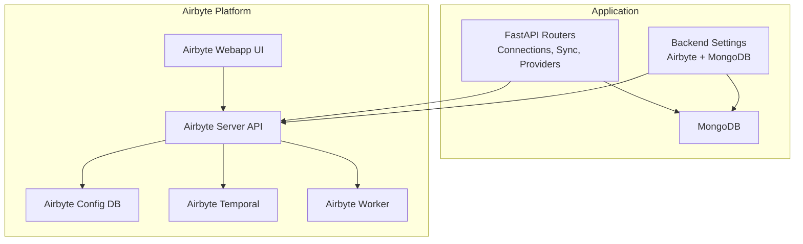
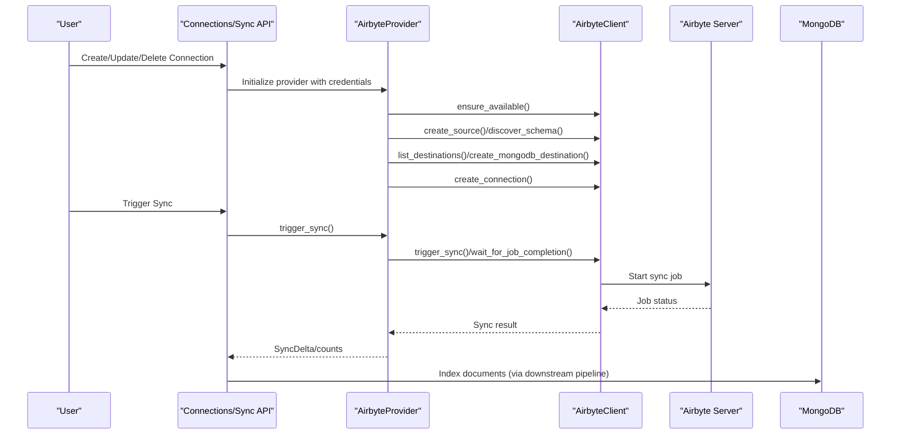
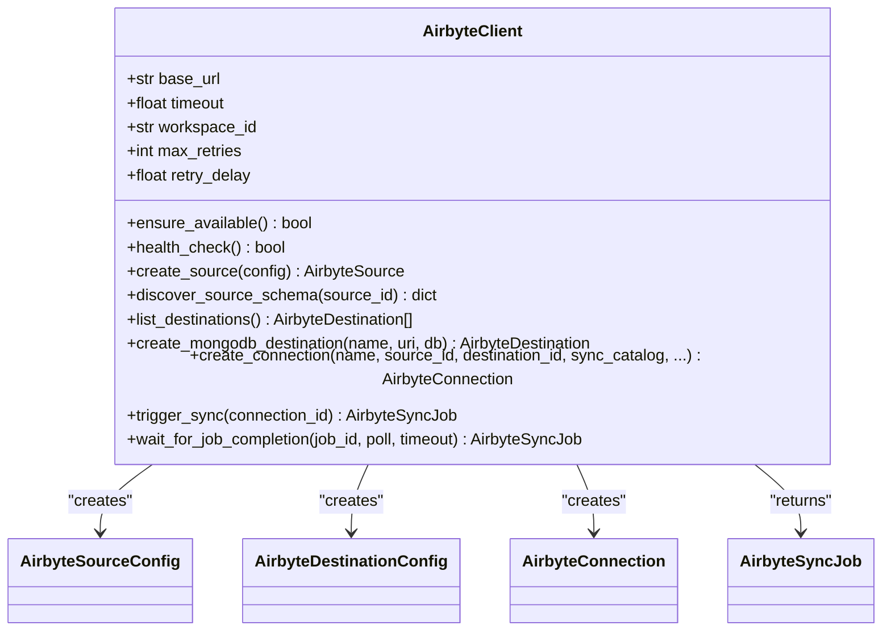
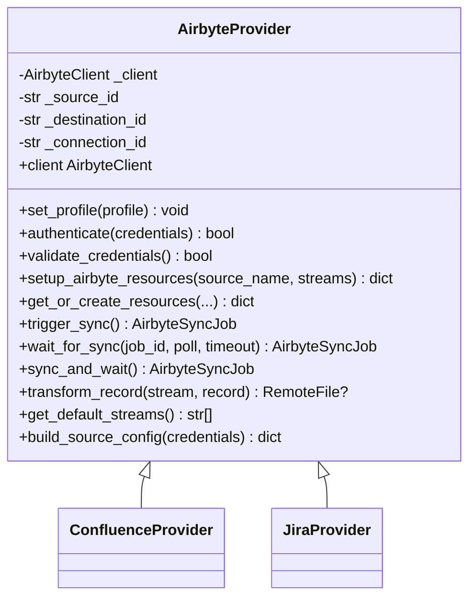
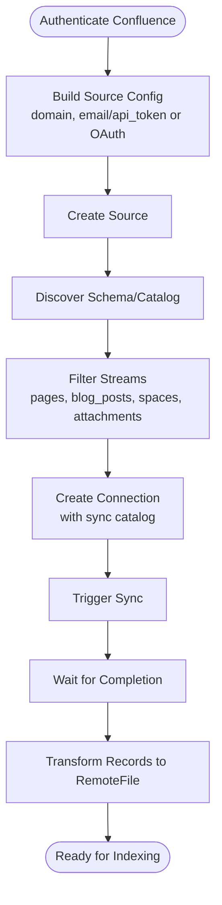
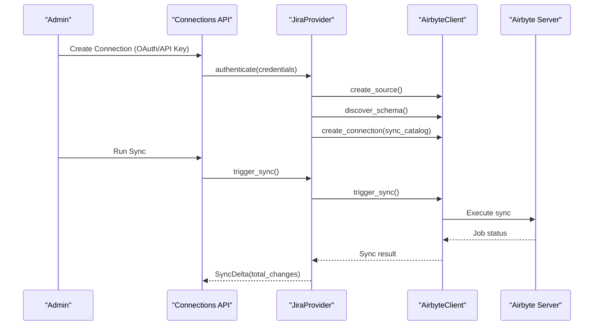
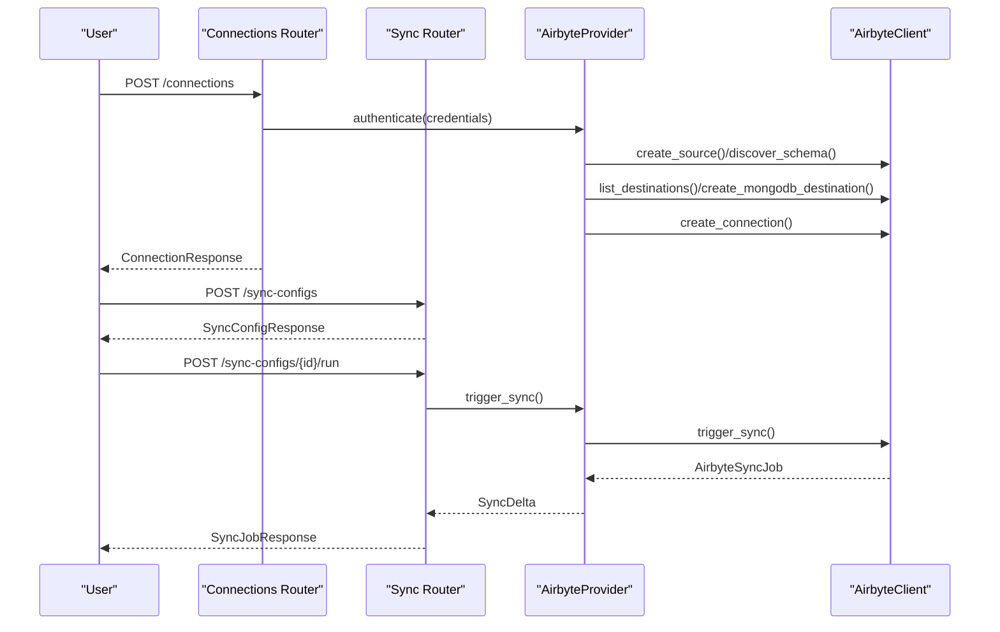
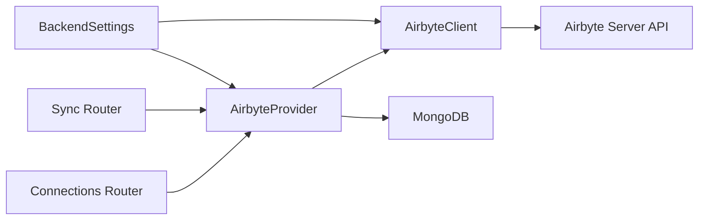

# Enterprise Integration

<cite>
**Referenced Files in This Document**
- [backend/providers/airbyte/__init__.py](file://backend/providers/airbyte/__init__.py)
- [backend/providers/airbyte/base.py](file://backend/providers/airbyte/base.py)
- [backend/providers/airbyte/client.py](file://backend/providers/airbyte/client.py)
- [backend/providers/airbyte/confluence.py](file://backend/providers/airbyte/confluence.py)
- [backend/providers/airbyte/jira.py](file://backend/providers/airbyte/jira.py)
- [backend/routers/cloud_sources/connections.py](file://backend/routers/cloud_sources/connections.py)
- [backend/routers/cloud_sources/sync.py](file://backend/routers/cloud_sources/sync.py)
- [backend/routers/cloud_sources/providers.py](file://backend/routers/cloud_sources/providers.py)
- [backend/routers/cloud_sources/schemas.py](file://backend/routers/cloud_sources/schemas.py)
- [backend/core/config.py](file://backend/core/config.py)
- [profiles.yaml](file://profiles.yaml)
- [docker-compose.yml](file://docker-compose.yml)
- [docker-compose.airbyte.yml](file://docker-compose.airbyte.yml)
- [backend/providers/airbyte/email_gmail.py](file://backend/providers/airbyte/email_gmail.py)
- [backend/providers/airbyte/email_outlook.py](file://backend/providers/airbyte/email_outlook.py)
- [backend/providers/airbyte/email_imap.py](file://backend/providers/airbyte/email_imap.py)
</cite>

## Table of Contents
1. [Introduction](#introduction)
2. [Project Structure](#project-structure)
3. [Core Components](#core-components)
4. [Architecture Overview](#architecture-overview)
5. [Detailed Component Analysis](#detailed-component-analysis)
6. [Dependency Analysis](#dependency-analysis)
7. [Performance Considerations](#performance-considerations)
8. [Troubleshooting Guide](#troubleshooting-guide)
9. [Conclusion](#conclusion)
10. [Appendices](#appendices)

## Introduction
This document explains how the project integrates enterprise cloud sources using Airbyte. It covers the Airbyte integration architecture, the Airbyte client and provider framework, connection management, and data synchronization flows. It also details provider-specific setups for Confluence and Jira, including authentication, permissions, and content extraction. Finally, it addresses operational concerns such as configuration, rate limiting, error handling, security, network connectivity, and compliance.

## Project Structure
The enterprise integration spans several layers:
- Provider framework: A base class and concrete providers for Airbyte-backed sources (Confluence, Jira, Gmail, Outlook, IMAP).
- Airbyte client: An async client that interacts with the Airbyte API to manage sources, destinations, connections, and jobs.
- API routers: Endpoints to manage connections, configure syncs, and monitor progress.
- Configuration: Environment-driven settings for Airbyte and MongoDB integration.
- Deployment: Docker Compose stacks for Airbyte and the main application stack.

**Diagram sources**
- [docker-compose.airbyte.yml](file://docker-compose.airbyte.yml#L16-L182)
- [docker-compose.yml](file://docker-compose.yml#L15-L143)
- [backend/core/config.py](file://backend/core/config.py#L106-L133)

**Section sources**
- [backend/providers/airbyte/__init__.py](file://backend/providers/airbyte/__init__.py#L1-L72)
- [backend/providers/airbyte/base.py](file://backend/providers/airbyte/base.py#L52-L148)
- [backend/providers/airbyte/client.py](file://backend/providers/airbyte/client.py#L152-L212)
- [backend/routers/cloud_sources/connections.py](file://backend/routers/cloud_sources/connections.py#L32-L41)
- [backend/routers/cloud_sources/sync.py](file://backend/routers/cloud_sources/sync.py#L43-L61)
- [backend/core/config.py](file://backend/core/config.py#L106-L133)
- [docker-compose.airbyte.yml](file://docker-compose.airbyte.yml#L16-L182)
- [docker-compose.yml](file://docker-compose.yml#L15-L143)

## Core Components
- AirbyteProvider: Base class that encapsulates Airbyte resource lifecycle (source, destination, connection), authentication, and sync orchestration. It supports profile-aware configuration and collection prefixes.
- AirbyteClient: Async client wrapping the Airbyte REST API with retry logic, health checks, and typed data models for sources, destinations, connections, and jobs.
- Concrete Providers: ConfluenceProvider and JiraProvider implement source-specific configuration, stream selection, and record transformation to RemoteFile.
- API Routers: Connections, Sync, and Providers routers expose CRUD and orchestration endpoints for enterprise users.
- Configuration: BackendSettings centralizes Airbyte and MongoDB settings, enabling environment-driven deployment.

**Section sources**
- [backend/providers/airbyte/base.py](file://backend/providers/airbyte/base.py#L52-L148)
- [backend/providers/airbyte/client.py](file://backend/providers/airbyte/client.py#L152-L212)
- [backend/providers/airbyte/confluence.py](file://backend/providers/airbyte/confluence.py#L27-L84)
- [backend/providers/airbyte/jira.py](file://backend/providers/airbyte/jira.py#L27-L84)
- [backend/routers/cloud_sources/connections.py](file://backend/routers/cloud_sources/connections.py#L32-L41)
- [backend/routers/cloud_sources/sync.py](file://backend/routers/cloud_sources/sync.py#L43-L61)
- [backend/core/config.py](file://backend/core/config.py#L106-L133)

## Architecture Overview
The integration architecture leverages Airbyte’s managed connectors to extract data from enterprise APIs (Confluence, Jira) into MongoDB for downstream ingestion and search. The application orchestrates Airbyte resources and exposes user-facing endpoints for connection management and sync scheduling.

**Diagram sources**
- [backend/providers/airbyte/base.py](file://backend/providers/airbyte/base.py#L200-L375)
- [backend/providers/airbyte/client.py](file://backend/providers/airbyte/client.py#L684-L731)
- [backend/routers/cloud_sources/sync.py](file://backend/routers/cloud_sources/sync.py#L316-L389)

## Detailed Component Analysis

### Airbyte Client Implementation
The AirbyteClient provides:
- Typed models for sources, destinations, connections, and jobs.
- Health checks and availability gating.
- Retry with exponential backoff for transient failures.
- Error normalization into domain-specific exceptions (rate limit, validation, API error, not found, timeout).
- Workspace and catalog discovery helpers.

**Diagram sources**
- [backend/providers/airbyte/client.py](file://backend/providers/airbyte/client.py#L152-L212)
- [backend/providers/airbyte/client.py](file://backend/providers/airbyte/client.py#L467-L527)
- [backend/providers/airbyte/client.py](file://backend/providers/airbyte/client.py#L629-L681)
- [backend/providers/airbyte/client.py](file://backend/providers/airbyte/client.py#L684-L731)
- [backend/providers/airbyte/client.py](file://backend/providers/airbyte/client.py#L120-L130)

**Section sources**
- [backend/providers/airbyte/client.py](file://backend/providers/airbyte/client.py#L152-L212)
- [backend/providers/airbyte/client.py](file://backend/providers/airbyte/client.py#L231-L356)
- [backend/providers/airbyte/client.py](file://backend/providers/airbyte/client.py#L561-L584)

### Airbyte Provider Framework
AirbyteProvider encapsulates:
- Profile-aware configuration (database, workspace, destination).
- Resource setup: source, destination, connection creation and catalog filtering.
- Authentication via source connection checks.
- Sync orchestration: trigger, poll, and completion handling.
- Record transformation to RemoteFile for downstream ingestion.

**Diagram sources**
- [backend/providers/airbyte/base.py](file://backend/providers/airbyte/base.py#L66-L148)
- [backend/providers/airbyte/base.py](file://backend/providers/airbyte/base.py#L200-L375)
- [backend/providers/airbyte/confluence.py](file://backend/providers/airbyte/confluence.py#L27-L84)
- [backend/providers/airbyte/jira.py](file://backend/providers/airbyte/jira.py#L27-L84)

**Section sources**
- [backend/providers/airbyte/base.py](file://backend/providers/airbyte/base.py#L66-L148)
- [backend/providers/airbyte/base.py](file://backend/providers/airbyte/base.py#L200-L375)

### Confluence Provider Setup and Extraction
ConfluenceProvider supports:
- OAuth 2.0 and API token authentication.
- Streams: pages, blog_posts, spaces, page_attachments.
- Record transformation to RemoteFile with metadata, labels, and content.
- Browsing placeholders for spaces and pages.

**Diagram sources**
- [backend/providers/airbyte/confluence.py](file://backend/providers/airbyte/confluence.py#L85-L134)
- [backend/providers/airbyte/base.py](file://backend/providers/airbyte/base.py#L306-L363)

**Section sources**
- [backend/providers/airbyte/confluence.py](file://backend/providers/airbyte/confluence.py#L27-L150)
- [backend/providers/airbyte/confluence.py](file://backend/providers/airbyte/confluence.py#L310-L337)

### Jira Provider Configuration and Transformation
JiraProvider supports:
- OAuth 2.0 and API token authentication.
- Streams: issues, projects, issue_comments, issue_fields, users, sprints.
- Rich transformation of issues, comments, and projects into Markdown-like RemoteFile content.
- Browsing placeholders for projects and issues.

**Diagram sources**
- [backend/providers/airbyte/jira.py](file://backend/providers/airbyte/jira.py#L86-L144)
- [backend/providers/airbyte/base.py](file://backend/providers/airbyte/base.py#L456-L482)

**Section sources**
- [backend/providers/airbyte/jira.py](file://backend/providers/airbyte/jira.py#L27-L161)
- [backend/providers/airbyte/jira.py](file://backend/providers/airbyte/jira.py#L350-L370)

### Connection Management and Sync Orchestration
The Connections and Sync routers provide:
- Listing, creating, updating, and deleting user connections.
- Testing connections and browsing folder structures (placeholders).
- Creating and managing sync configurations with schedules and filters.
- Running, monitoring, pausing, resuming, and cancelling sync jobs.
- Dashboard aggregation of sources, sync stats, and recent errors.

**Diagram sources**
- [backend/routers/cloud_sources/connections.py](file://backend/routers/cloud_sources/connections.py#L97-L180)
- [backend/routers/cloud_sources/sync.py](file://backend/routers/cloud_sources/sync.py#L157-L208)
- [backend/routers/cloud_sources/sync.py](file://backend/routers/cloud_sources/sync.py#L316-L389)

**Section sources**
- [backend/routers/cloud_sources/connections.py](file://backend/routers/cloud_sources/connections.py#L63-L180)
- [backend/routers/cloud_sources/sync.py](file://backend/routers/cloud_sources/sync.py#L127-L208)
- [backend/routers/cloud_sources/sync.py](file://backend/routers/cloud_sources/sync.py#L316-L478)
- [backend/routers/cloud_sources/providers.py](file://backend/routers/cloud_sources/providers.py#L92-L114)

### Email Providers (Gmail, Outlook, IMAP)
The repository includes additional Airbyte-backed email providers:
- GmailProvider: OAuth 2.0, messages, threads, labels, attachments.
- OutlookProvider: OAuth 2.0 via Microsoft Graph, messages, mail folders.
- ImapProvider: Generic IMAP with read-only, non-destructive defaults.

These follow the same AirbyteProvider pattern and can be integrated similarly.

**Section sources**
- [backend/providers/airbyte/email_gmail.py](file://backend/providers/airbyte/email_gmail.py#L27-L111)
- [backend/providers/airbyte/email_outlook.py](file://backend/providers/airbyte/email_outlook.py#L27-L117)
- [backend/providers/airbyte/email_imap.py](file://backend/providers/airbyte/email_imap.py#L27-L213)

## Dependency Analysis
- Provider-to-Client coupling: Providers depend on AirbyteClient for all Airbyte operations.
- Client-to-API coupling: AirbyteClient depends on Airbyte Server API endpoints and handles retries and error mapping.
- Router-to-Provider coupling: Routers instantiate providers and delegate connection and sync operations.
- Configuration-to-Client coupling: BackendSettings supply Airbyte API URL and MongoDB settings used by providers and client.

**Diagram sources**
- [backend/providers/airbyte/base.py](file://backend/providers/airbyte/base.py#L143-L148)
- [backend/providers/airbyte/client.py](file://backend/providers/airbyte/client.py#L187-L212)
- [backend/core/config.py](file://backend/core/config.py#L106-L133)
- [docker-compose.airbyte.yml](file://docker-compose.airbyte.yml#L60-L99)

**Section sources**
- [backend/providers/airbyte/base.py](file://backend/providers/airbyte/base.py#L143-L148)
- [backend/providers/airbyte/client.py](file://backend/providers/airbyte/client.py#L187-L212)
- [backend/core/config.py](file://backend/core/config.py#L106-L133)

## Performance Considerations
- Retry and backoff: The AirbyteClient implements exponential backoff for transient errors and respects Retry-After headers for rate limits.
- Catalog filtering: Providers filter streams to reduce payload and improve performance.
- Incremental vs full refresh: Providers select incremental sync modes when supported by streams.
- Long-running operations: Schema discovery uses extended timeouts; sync jobs are polled with configurable intervals.

**Section sources**
- [backend/providers/airbyte/client.py](file://backend/providers/airbyte/client.py#L182-L186)
- [backend/providers/airbyte/client.py](file://backend/providers/airbyte/client.py#L290-L356)
- [backend/providers/airbyte/base.py](file://backend/providers/airbyte/base.py#L315-L351)

## Troubleshooting Guide
Common issues and resolutions:
- Airbyte not available: The client raises a specific error when the Airbyte API is unreachable; ensure Airbyte is running and reachable.
- Rate limiting: The client detects 429 responses and raises a rate limit exception; honor Retry-After and reduce request frequency.
- Validation errors: Invalid requests raise validation errors; verify source configuration keys and values.
- Resource not found: Missing resources raise resource-not-found errors; confirm IDs and workspace context.
- Authentication failures: Use the provider’s authenticate method to validate source connection before sync.
- Sync failures: Inspect job status and errors returned by the AirbyteClient; check logs and re-run with corrected credentials.

Operational tips:
- Use the Sync Router to pause/resume/cancel jobs during maintenance windows.
- Monitor dashboard for recent errors and next scheduled runs.
- For Confluence/Jira, ensure proper scopes and permissions are granted in Atlassian.

**Section sources**
- [backend/providers/airbyte/client.py](file://backend/providers/airbyte/client.py#L231-L356)
- [backend/providers/airbyte/base.py](file://backend/providers/airbyte/base.py#L418-L453)
- [backend/routers/cloud_sources/sync.py](file://backend/routers/cloud_sources/sync.py#L550-L646)

## Conclusion
The project provides a robust, extensible framework for enterprise cloud source integration using Airbyte. The AirbyteProvider base class and AirbyteClient encapsulate Airbyte operations, while the API routers offer a user-friendly interface for connection management and sync orchestration. Providers for Confluence and Jira are implemented with authentication, stream selection, and record transformation tailored for downstream ingestion. The solution includes operational safeguards such as retry logic, rate-limit handling, and structured error reporting.

## Appendices

### Configuration Examples
- Airbyte settings: Enable Airbyte integration and set API/Webapp URLs and MongoDB destination settings.
- Profiles: Define workspace and destination IDs, default sync modes, and schedule preferences.

**Section sources**
- [backend/core/config.py](file://backend/core/config.py#L106-L133)
- [profiles.yaml](file://profiles.yaml#L13-L42)

### Network Connectivity and Deployment
- Airbyte stack: PostgreSQL, Temporal, Server, Worker, and Webapp are orchestrated via Docker Compose.
- Application stack: Backend, Frontend, and MongoDB are defined in the main compose file.
- Ports: Dedicated port ranges for Airbyte (11020–11021) and other services.

**Section sources**
- [docker-compose.airbyte.yml](file://docker-compose.airbyte.yml#L16-L182)
- [docker-compose.yml](file://docker-compose.yml#L15-L143)

### Security and Compliance Considerations
- Credentials storage: The Connections router stores credentials in MongoDB; in production, encrypt sensitive fields before persisting.
- OAuth flows: Providers support OAuth 2.0 for Gmail, Outlook, Confluence, and Jira; ensure scopes align with least privilege.
- Non-destructive sync: IMAP provider preserves email state by default; adjust only if explicitly required.
- Data retention: Sync configurations support deletion of removed files; configure according to compliance policies.

**Section sources**
- [backend/routers/cloud_sources/connections.py](file://backend/routers/cloud_sources/connections.py#L134-L151)
- [backend/providers/airbyte/email_imap.py](file://backend/providers/airbyte/email_imap.py#L39-L60)