# Provider Architecture

<cite>
**Referenced Files in This Document**
- [backend/providers/__init__.py](file://backend/providers/__init__.py)
- [backend/providers/base.py](file://backend/providers/base.py)
- [backend/providers/registry.py](file://backend/providers/registry.py)
- [backend/providers/google_drive.py](file://backend/providers/google_drive.py)
- [backend/providers/dropbox_provider.py](file://backend/providers/dropbox_provider.py)
- [backend/providers/webdav.py](file://backend/providers/webdav.py)
- [backend/providers/email/base.py](file://backend/providers/email/base.py)
- [backend/providers/airbyte/base.py](file://backend/providers/airbyte/base.py)
- [backend/providers/airbyte/confluence.py](file://backend/providers/airbyte/confluence.py)
- [backend/providers/airbyte/jira.py](file://backend/providers/airbyte/jira.py)
- [backend/providers/airbyte/email_gmail.py](file://backend/providers/airbyte/email_gmail.py)
- [backend/providers/airbyte/email_imap.py](file://backend/providers/airbyte/email_imap.py)
- [backend/routers/cloud_sources/providers.py](file://backend/routers/cloud_sources/providers.py)
</cite>

## Table of Contents
1. [Introduction](#introduction)
2. [Project Structure](#project-structure)
3. [Core Components](#core-components)
4. [Architecture Overview](#architecture-overview)
5. [Detailed Component Analysis](#detailed-component-analysis)
6. [Dependency Analysis](#dependency-analysis)
7. [Performance Considerations](#performance-considerations)
8. [Troubleshooting Guide](#troubleshooting-guide)
9. [Conclusion](#conclusion)
10. [Appendices](#appendices)

## Introduction
This document explains the cloud provider architecture used to integrate diverse cloud sources (file storage, collaboration platforms, and email systems) into a unified ingestion pipeline. It covers the provider registry pattern and factory implementation, the CloudSourceProvider interface and ProviderType enumeration system, decorator-based registration, provider loading strategy to avoid circular imports, instantiation and lifecycle management, capability detection, availability checking, and error handling. It also provides practical examples for integrating new providers and outlines the abstract base classes and interfaces that custom providers must implement.

## Project Structure
The provider system is organized around a central registry and factory, a set of abstract interfaces and data models, and multiple concrete provider implementations grouped by technology area:
- Central registry and factory: backend/providers/registry.py
- Abstract interfaces and data models: backend/providers/base.py
- Provider packages:
  - File storage providers: Google Drive, Dropbox, WebDAV-based OwnCloud/Nextcloud
  - Collaboration providers (via Airbyte): Confluence, Jira
  - Email providers (via Airbyte): Gmail, Outlook, IMAP
- Router exposing provider capabilities: backend/routers/cloud_sources/providers.py
- Public package exports: backend/providers/__init__.py

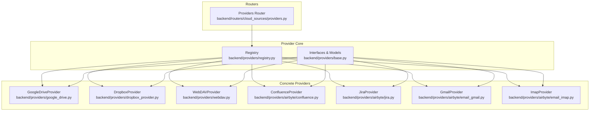

**Diagram sources**
- [backend/providers/registry.py](file://backend/providers/registry.py#L1-L143)
- [backend/providers/base.py](file://backend/providers/base.py#L1-L525)
- [backend/providers/google_drive.py](file://backend/providers/google_drive.py#L1-L627)
- [backend/providers/dropbox_provider.py](file://backend/providers/dropbox_provider.py#L1-L582)
- [backend/providers/webdav.py](file://backend/providers/webdav.py#L1-L551)
- [backend/providers/airbyte/confluence.py](file://backend/providers/airbyte/confluence.py#L1-L337)
- [backend/providers/airbyte/jira.py](file://backend/providers/airbyte/jira.py#L1-L370)
- [backend/providers/airbyte/email_gmail.py](file://backend/providers/airbyte/email_gmail.py#L1-L367)
- [backend/providers/airbyte/email_imap.py](file://backend/providers/airbyte/email_imap.py#L1-L394)
- [backend/routers/cloud_sources/providers.py](file://backend/routers/cloud_sources/providers.py#L1-L184)

**Section sources**
- [backend/providers/__init__.py](file://backend/providers/__init__.py#L1-L36)
- [backend/providers/registry.py](file://backend/providers/registry.py#L1-L143)
- [backend/providers/base.py](file://backend/providers/base.py#L1-L525)
- [backend/routers/cloud_sources/providers.py](file://backend/routers/cloud_sources/providers.py#L1-L184)

## Core Components
- ProviderType enumeration: Defines supported provider identifiers (e.g., google_drive, onedrive, sharepoint, dropbox, owncloud, nextcloud, confluence, jira, email_imap, email_gmail, email_outlook, notion, slack).
- AuthType enumeration: Defines supported authentication methods (oauth2, api_key, password, app_token, certificate).
- ProviderCapabilities dataclass: Describes provider capabilities, supported auth types, OAuth scopes, sync features, file type support, rate limits, and documentation links.
- CloudSourceProvider abstract base class: Defines the contract for all providers, including authentication, OAuth flows, browsing, file operations, sync operations, and lifecycle hooks.
- Registry and factory: register_provider decorator, get_provider_class, create_provider, list_registered_providers, is_provider_available, and lazy loading strategy to avoid circular imports.
- AirbyteProvider base class: Extends CloudSourceProvider for Airbyte-backed providers, managing Airbyte source/destination/connection lifecycles and sync orchestration.

Key responsibilities:
- Registry: central mapping of ProviderType to provider class, with decorator-driven registration and safe lookup.
- Factory: instantiate providers with credentials and handle missing implementations.
- Interfaces: enforce consistent behavior across providers for ingestion and sync.

**Section sources**
- [backend/providers/base.py](file://backend/providers/base.py#L18-L73)
- [backend/providers/base.py](file://backend/providers/base.py#L179-L491)
- [backend/providers/registry.py](file://backend/providers/registry.py#L24-L77)
- [backend/providers/airbyte/base.py](file://backend/providers/airbyte/base.py#L52-L197)

## Architecture Overview
The provider architecture follows a plugin-style registry and factory pattern:
- Providers declare their ProviderType via a decorator, registering themselves in the central registry.
- The router exposes provider capabilities statically and the registry exposes dynamic availability.
- Consumers request a provider by type; the factory resolves the implementation and instantiates it with credentials.
- Providers implement CloudSourceProvider or AirbyteProvider to fulfill the contract.

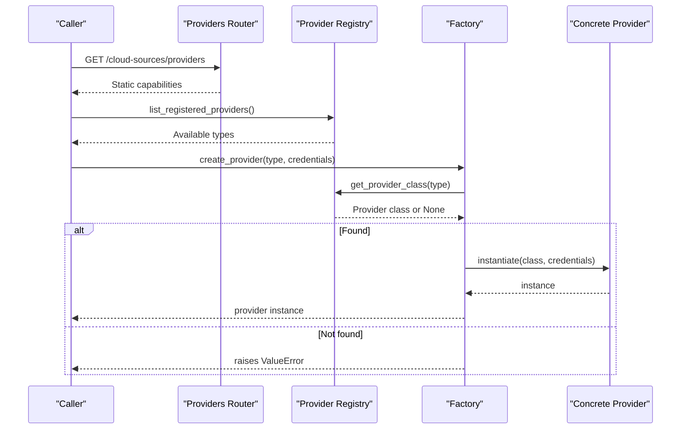

**Diagram sources**
- [backend/routers/cloud_sources/providers.py](file://backend/routers/cloud_sources/providers.py#L150-L184)
- [backend/providers/registry.py](file://backend/providers/registry.py#L69-L77)
- [backend/providers/registry.py](file://backend/providers/registry.py#L45-L67)

## Detailed Component Analysis

### Provider Registry Pattern and Factory
- Decorator-driven registration: @register_provider(ProviderType.XYZ) stores the class in an internal registry keyed by ProviderType.
- Safe lookup: get_provider_class returns None if not registered; create_provider raises a clear ValueError if the type is unknown.
- Availability checks: is_provider_available returns a boolean indicating whether a provider implementation is present.
- Lazy loading strategy: _load_providers performs selective imports at module load time to avoid circular dependencies and reduce startup overhead.

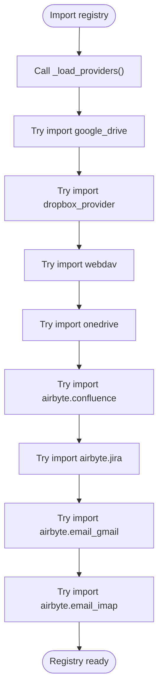

**Diagram sources**
- [backend/providers/registry.py](file://backend/providers/registry.py#L81-L142)

**Section sources**
- [backend/providers/registry.py](file://backend/providers/registry.py#L24-L77)
- [backend/providers/registry.py](file://backend/providers/registry.py#L81-L142)

### CloudSourceProvider Interface and Data Models
- ProviderType and AuthType enumerate supported types.
- ProviderCapabilities describes capabilities, auth types, OAuth scopes, sync features, and metadata.
- CloudSourceProvider defines the complete contract:
  - Identity: provider_type, capabilities
  - Authentication: authenticate, validate_credentials, refresh_credentials
  - OAuth: get_oauth_authorization_url, exchange_oauth_code, revoke_oauth_tokens
  - Browsing: list_root_folders, list_folder_contents, get_folder_tree
  - File operations: get_file_metadata, download_file, download_file_to_bytes
  - Sync: list_all_files, get_changes, subscribe_to_changes, unsubscribe_from_changes
  - Utilities: get_storage_quota, get_user_info, lifecycle (close, async context)
  - Exceptions: CloudSourceError, AuthenticationError, RateLimitError, FileNotFoundError, PermissionDeniedError, QuotaExceededError

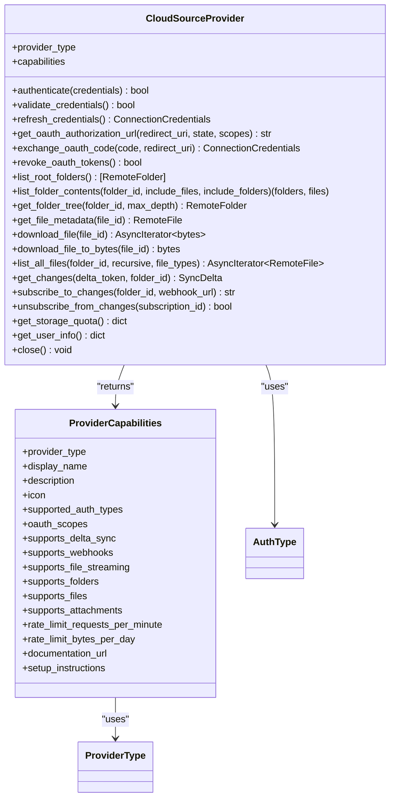

**Diagram sources**
- [backend/providers/base.py](file://backend/providers/base.py#L179-L491)
- [backend/providers/base.py](file://backend/providers/base.py#L44-L73)
- [backend/providers/base.py](file://backend/providers/base.py#L18-L33)

**Section sources**
- [backend/providers/base.py](file://backend/providers/base.py#L18-L73)
- [backend/providers/base.py](file://backend/providers/base.py#L179-L491)

### AirbyteProvider Base Class
AirbyteProvider extends CloudSourceProvider to manage Airbyte resources:
- Resource lifecycle: setup_airbyte_resources, get_or_create_resources, delete_resources
- Authentication via Airbyte source connection checks
- Sync orchestration: trigger_sync, get_sync_status, wait_for_sync, sync_and_wait
- Profile-aware configuration for multi-tenant deployments
- Subclasses implement source_definition_id, source_display_name, build_source_config, get_default_streams, transform_record

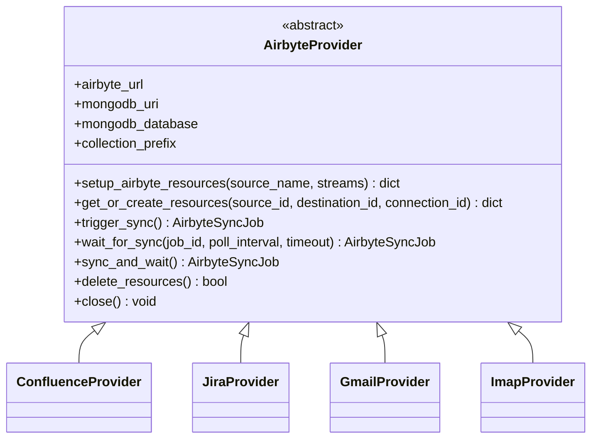

**Diagram sources**
- [backend/providers/airbyte/base.py](file://backend/providers/airbyte/base.py#L52-L197)
- [backend/providers/airbyte/confluence.py](file://backend/providers/airbyte/confluence.py#L27-L79)
- [backend/providers/airbyte/jira.py](file://backend/providers/airbyte/jira.py#L27-L84)
- [backend/providers/airbyte/email_gmail.py](file://backend/providers/airbyte/email_gmail.py#L27-L82)
- [backend/providers/airbyte/email_imap.py](file://backend/providers/airbyte/email_imap.py#L27-L99)

**Section sources**
- [backend/providers/airbyte/base.py](file://backend/providers/airbyte/base.py#L52-L197)

### Concrete Provider Implementations

#### File Storage Providers
- GoogleDriveProvider: Implements OAuth 2.0, delta sync, streaming downloads, and Google Workspace export.
- DropboxProvider: Implements OAuth 2.0, cursor-based delta sync, and streaming downloads.
- WebDAVProvider: Base for OwnCloud/Nextcloud; supports password and app token auth; registers both OwnCloud and Nextcloud variants.

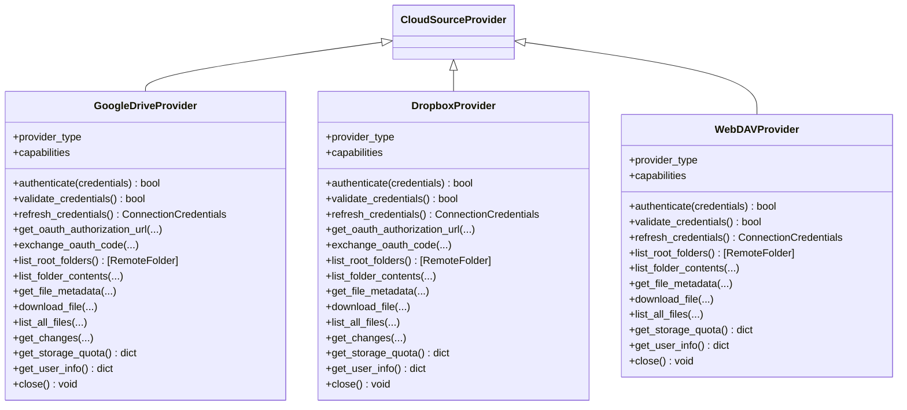

**Diagram sources**
- [backend/providers/google_drive.py](file://backend/providers/google_drive.py#L51-L627)
- [backend/providers/dropbox_provider.py](file://backend/providers/dropbox_provider.py#L38-L582)
- [backend/providers/webdav.py](file://backend/providers/webdav.py#L61-L551)

**Section sources**
- [backend/providers/google_drive.py](file://backend/providers/google_drive.py#L51-L627)
- [backend/providers/dropbox_provider.py](file://backend/providers/dropbox_provider.py#L38-L582)
- [backend/providers/webdav.py](file://backend/providers/webdav.py#L61-L551)

#### Collaboration Providers (Airbyte-backed)
- ConfluenceProvider: Builds source config from credentials, transforms pages/blog posts/attachments to RemoteFile.
- JiraProvider: Builds source config supporting OAuth 2.0 or API token, transforms issues/projects/comments.

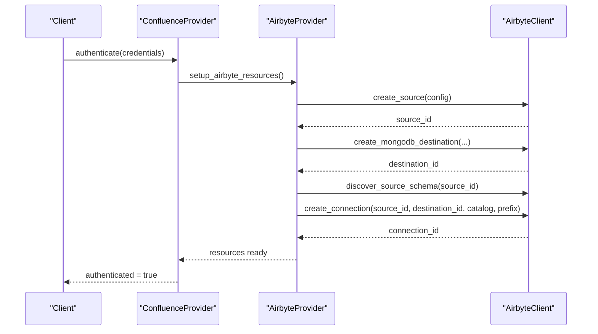

**Diagram sources**
- [backend/providers/airbyte/confluence.py](file://backend/providers/airbyte/confluence.py#L27-L134)
- [backend/providers/airbyte/base.py](file://backend/providers/airbyte/base.py#L200-L374)

**Section sources**
- [backend/providers/airbyte/confluence.py](file://backend/providers/airbyte/confluence.py#L27-L200)
- [backend/providers/airbyte/jira.py](file://backend/providers/airbyte/jira.py#L27-L200)
- [backend/providers/airbyte/base.py](file://backend/providers/airbyte/base.py#L200-L374)

#### Email Providers (Airbyte-backed)
- GmailProvider: OAuth 2.0-based, streams messages/threads/labels, transforms to RemoteFile.
- ImapProvider: Generic IMAP support with read-only defaults and configurable behavior.

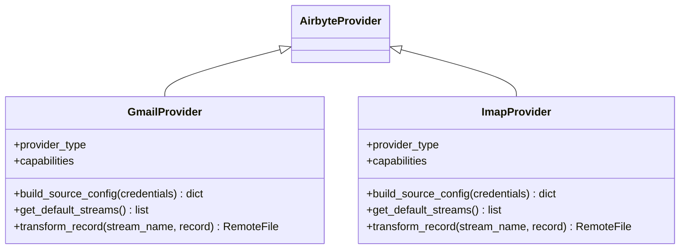

**Diagram sources**
- [backend/providers/airbyte/email_gmail.py](file://backend/providers/airbyte/email_gmail.py#L27-L200)
- [backend/providers/airbyte/email_imap.py](file://backend/providers/airbyte/email_imap.py#L27-L200)

**Section sources**
- [backend/providers/airbyte/email_gmail.py](file://backend/providers/airbyte/email_gmail.py#L27-L200)
- [backend/providers/airbyte/email_imap.py](file://backend/providers/airbyte/email_imap.py#L27-L200)

### Capability Detection and Availability Checking
- Static capability exposure: The providers router returns ProviderCapabilitiesResponse for each ProviderType, including supported auth types, sync features, and setup instructions.
- Dynamic availability: is_provider_available checks the registry for a provider implementation; create_provider raises a ValueError if unavailable.
- Capability model: ProviderCapabilities encapsulates provider metadata, enabling UIs and consumers to render accurate options.

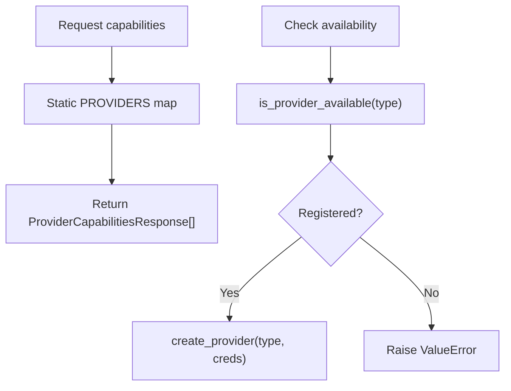

**Diagram sources**
- [backend/routers/cloud_sources/providers.py](file://backend/routers/cloud_sources/providers.py#L24-L147)
- [backend/providers/registry.py](file://backend/providers/registry.py#L74-L77)
- [backend/providers/registry.py](file://backend/providers/registry.py#L45-L67)

**Section sources**
- [backend/routers/cloud_sources/providers.py](file://backend/routers/cloud_sources/providers.py#L24-L184)
- [backend/providers/registry.py](file://backend/providers/registry.py#L74-L77)

### Provider Instantiation and Lifecycle Management
- Factory: create_provider resolves the class and constructs an instance with optional credentials.
- Lifecycle: Providers implement async context management (__aenter__/__aexit__) and close() to release resources (HTTP clients, Airbyte connections).
- Credential refresh: Some providers implement refresh_credentials; AirbyteProvider defers to Airbyte-managed credentials.

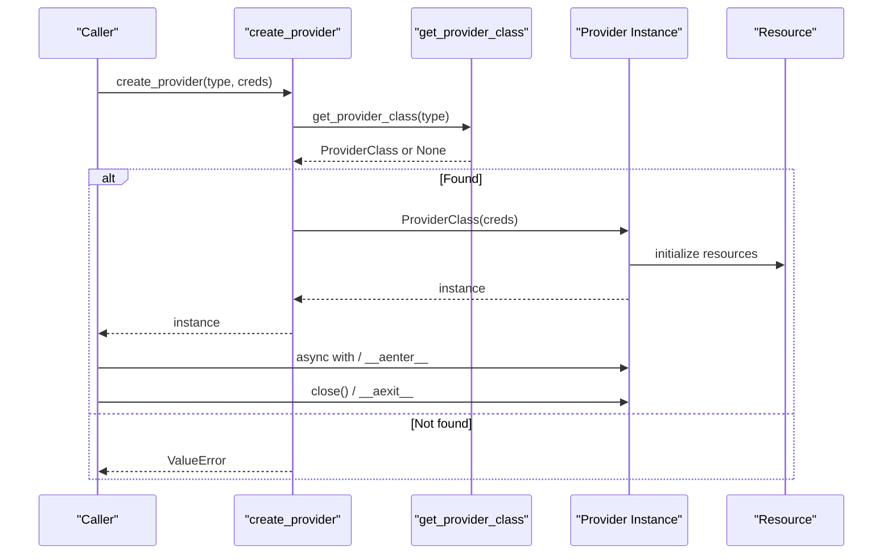

**Diagram sources**
- [backend/providers/registry.py](file://backend/providers/registry.py#L45-L67)
- [backend/providers/base.py](file://backend/providers/base.py#L484-L491)

**Section sources**
- [backend/providers/registry.py](file://backend/providers/registry.py#L45-L67)
- [backend/providers/base.py](file://backend/providers/base.py#L484-L491)

### Error Handling for Missing Implementations
- Missing provider type: create_provider raises a ValueError with a descriptive message when no implementation is registered.
- Authentication failures: Providers raise AuthenticationError for invalid/expired tokens or permission issues.
- Rate limiting: Providers raise RateLimitError with optional retry hints.
- Provider-specific errors: AirbyteProviderError and others wrap Airbyte-related failures.

**Section sources**
- [backend/providers/registry.py](file://backend/providers/registry.py#L62-L66)
- [backend/providers/base.py](file://backend/providers/base.py#L500-L525)
- [backend/providers/airbyte/base.py](file://backend/providers/airbyte/base.py#L47-L49)

### Plugin Architecture Design Patterns
- Decorator-based registration: @register_provider decouples provider declaration from registry wiring.
- Lazy loading: _load_providers avoids importing all providers at startup, reducing cold-start costs and preventing circular imports.
- Extensibility: New providers implement CloudSourceProvider or AirbyteProvider and decorate with @register_provider to plug in seamlessly.

**Section sources**
- [backend/providers/registry.py](file://backend/providers/registry.py#L24-L37)
- [backend/providers/registry.py](file://backend/providers/registry.py#L81-L142)
- [backend/providers/base.py](file://backend/providers/base.py#L179-L195)

## Dependency Analysis
The registry maintains a private mapping from ProviderType to provider classes. Registration occurs at import time of provider modules. The router depends on the registry for availability and on static configuration for capabilities.

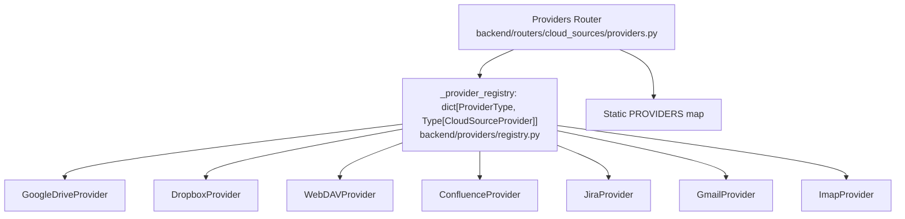

**Diagram sources**
- [backend/providers/registry.py](file://backend/providers/registry.py#L21-L42)
- [backend/providers/google_drive.py](file://backend/providers/google_drive.py#L51-L52)
- [backend/providers/dropbox_provider.py](file://backend/providers/dropbox_provider.py#L38-L39)
- [backend/providers/webdav.py](file://backend/providers/webdav.py#L515-L516)
- [backend/providers/airbyte/confluence.py](file://backend/providers/airbyte/confluence.py#L27-L28)
- [backend/providers/airbyte/jira.py](file://backend/providers/airbyte/jira.py#L27-L28)
- [backend/providers/airbyte/email_gmail.py](file://backend/providers/airbyte/email_gmail.py#L27-L28)
- [backend/providers/airbyte/email_imap.py](file://backend/providers/airbyte/email_imap.py#L27-L28)
- [backend/routers/cloud_sources/providers.py](file://backend/routers/cloud_sources/providers.py#L24-L147)

**Section sources**
- [backend/providers/registry.py](file://backend/providers/registry.py#L20-L42)
- [backend/routers/cloud_sources/providers.py](file://backend/routers/cloud_sources/providers.py#L24-L147)

## Performance Considerations
- Streaming downloads: Providers like GoogleDriveProvider and DropboxProvider expose download_file yielding chunks to minimize memory usage.
- Pagination and cursors: Dropbox uses cursor-based pagination; GoogleDrive uses Change API; WebDAV lacks native delta support and relies on ETag comparisons.
- Rate limits: ProviderCapabilities includes rate_limit_requests_per_minute; providers surface RateLimitError with retry hints.
- Async context management: Providers implement close() and async context managers to release HTTP clients promptly.

[No sources needed since this section provides general guidance]

## Troubleshooting Guide
Common issues and resolutions:
- Provider not available: Ensure the provider module is imported and decorated with @register_provider. Use is_provider_available to confirm registration.
- Authentication failures: Verify credentials and scopes; providers raise AuthenticationError with specific messages.
- Rate limit exceeded: Respect ProviderCapabilities and handle RateLimitError with exponential backoff.
- Missing implementation: create_provider raises ValueError for unregistered types; check registry imports and provider availability.

**Section sources**
- [backend/providers/registry.py](file://backend/providers/registry.py#L62-L66)
- [backend/providers/base.py](file://backend/providers/base.py#L500-L525)

## Conclusion
The provider architecture leverages a robust registry and factory pattern to enable extensible integration of diverse cloud sources. The CloudSourceProvider interface and ProviderCapabilities model provide a consistent contract and capability surface. Decorator-based registration and lazy loading keep the system modular and maintainable. AirbyteProvider further simplifies complex integrations by managing source/destination/connection lifecycles. Together, these patterns support scalable, testable, and evolvable cloud source integrations.

## Appendices

### How to Integrate a New Provider
Steps to add a new provider:
1. Define a new ProviderType value if needed.
2. Implement a class that inherits from CloudSourceProvider (or AirbyteProvider for Airbyte-backed sources).
3. Decorate the class with @register_provider(ProviderType.YOUR_TYPE).
4. Implement required abstract methods (authentication, browsing, file operations, sync).
5. Optionally define capabilities in the provider’s capabilities property.
6. Ensure the provider module is imported so the decorator executes during registry initialization.

Example references:
- Decorator usage: [backend/providers/google_drive.py](file://backend/providers/google_drive.py#L51-L52), [backend/providers/dropbox_provider.py](file://backend/providers/dropbox_provider.py#L38-L39), [backend/providers/webdav.py](file://backend/providers/webdav.py#L515-L516)
- Airbyte subclass: [backend/providers/airbyte/confluence.py](file://backend/providers/airbyte/confluence.py#L27-L79)
- Capability definition: [backend/providers/google_drive.py](file://backend/providers/google_drive.py#L74-L91), [backend/providers/dropbox_provider.py](file://backend/providers/dropbox_provider.py#L60-L73), [backend/providers/webdav.py](file://backend/providers/webdav.py#L84-L95)

**Section sources**
- [backend/providers/google_drive.py](file://backend/providers/google_drive.py#L51-L91)
- [backend/providers/dropbox_provider.py](file://backend/providers/dropbox_provider.py#L38-L73)
- [backend/providers/webdav.py](file://backend/providers/webdav.py#L515-L95)
- [backend/providers/airbyte/confluence.py](file://backend/providers/airbyte/confluence.py#L27-L79)