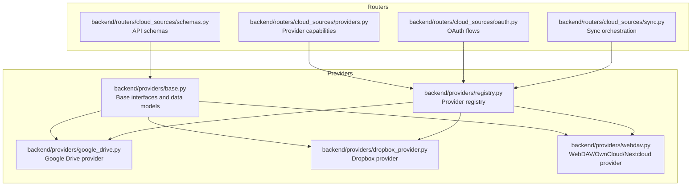
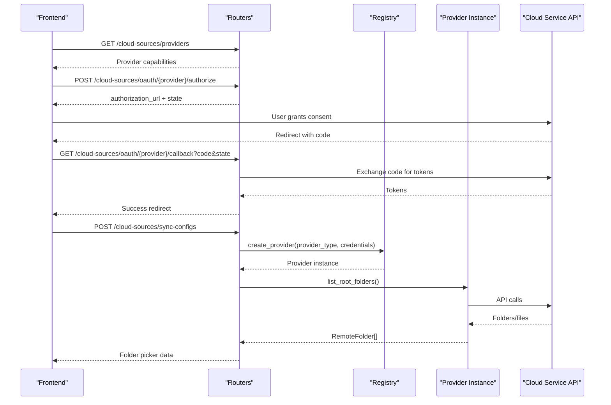
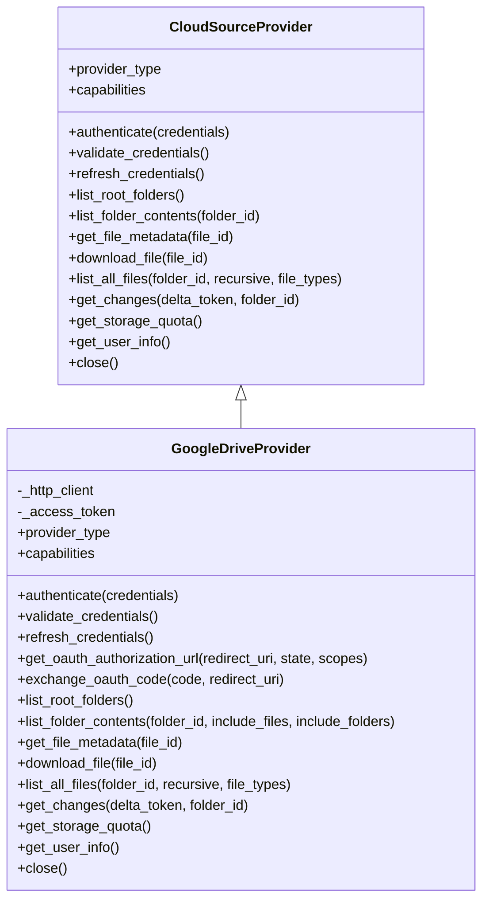
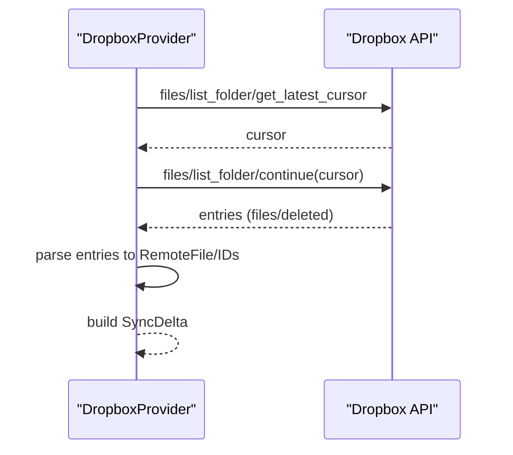
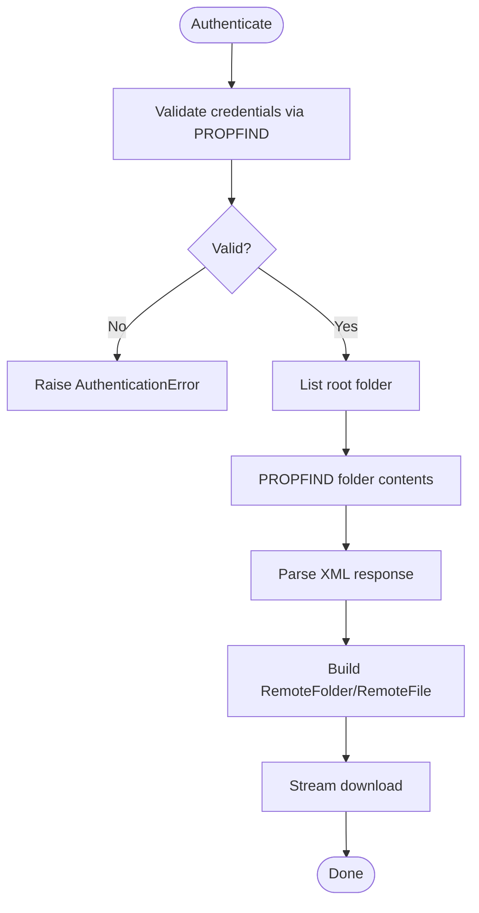
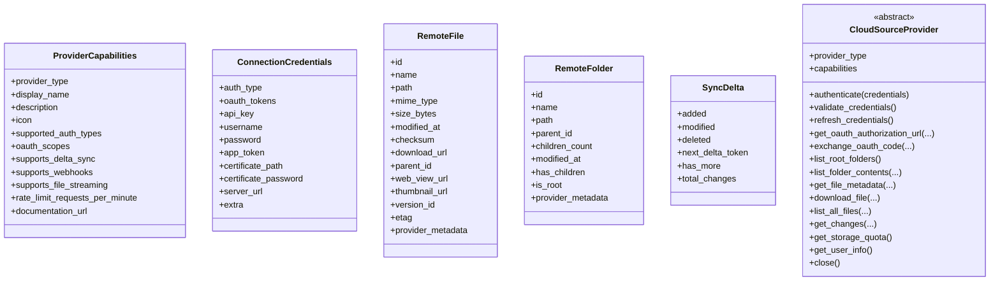
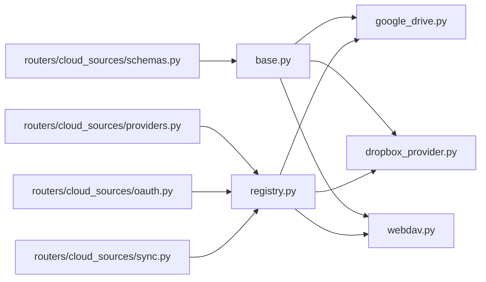

# Storage Providers

<cite>
**Referenced Files in This Document**
- [google_drive.py](file://backend/providers/google_drive.py)
- [dropbox_provider.py](file://backend/providers/dropbox_provider.py)
- [webdav.py](file://backend/providers/webdav.py)
- [base.py](file://backend/providers/base.py)
- [registry.py](file://backend/providers/registry.py)
- [providers.py](file://backend/routers/cloud_sources/providers.py)
- [oauth.py](file://backend/routers/cloud_sources/oauth.py)
- [sync.py](file://backend/routers/cloud_sources/sync.py)
- [schemas.py](file://backend/routers/cloud_sources/schemas.py)
- [.env.example](file://.env.example)
- [profiles.yaml](file://profiles.yaml)
</cite>

## Table of Contents
1. [Introduction](#introduction)
2. [Project Structure](#project-structure)
3. [Core Components](#core-components)
4. [Architecture Overview](#architecture-overview)
5. [Detailed Component Analysis](#detailed-component-analysis)
6. [Dependency Analysis](#dependency-analysis)
7. [Performance Considerations](#performance-considerations)
8. [Troubleshooting Guide](#troubleshooting-guide)
9. [Conclusion](#conclusion)
10. [Appendices](#appendices)

## Introduction
This document explains the storage provider implementations for cloud storage systems in the MongoDB RAG Agent. It covers Google Drive, Dropbox, and WebDAV-compatible services (OwnCloud/Nextcloud). For each provider, it documents authentication, file listing, document retrieval, delta synchronization, rate limiting, error handling, configuration, and security considerations. It also describes the shared interfaces and common patterns used across providers, and outlines integration points with the broader system.

## Project Structure
The storage provider subsystem is organized around a shared interface and provider-specific implementations, with routers exposing configuration and OAuth flows, and a registry for provider discovery.

**Diagram sources**
- [base.py](file://backend/providers/base.py#L179-L491)
- [registry.py](file://backend/providers/registry.py#L24-L66)
- [google_drive.py](file://backend/providers/google_drive.py#L51-L91)
- [dropbox_provider.py](file://backend/providers/dropbox_provider.py#L38-L73)
- [webdav.py](file://backend/providers/webdav.py#L61-L95)
- [providers.py](file://backend/routers/cloud_sources/providers.py#L24-L147)
- [oauth.py](file://backend/routers/cloud_sources/oauth.py#L128-L145)
- [sync.py](file://backend/routers/cloud_sources/sync.py#L391-L478)
- [schemas.py](file://backend/routers/cloud_sources/schemas.py#L14-L31)

**Section sources**
- [base.py](file://backend/providers/base.py#L179-L491)
- [registry.py](file://backend/providers/registry.py#L24-L66)
- [providers.py](file://backend/routers/cloud_sources/providers.py#L24-L147)
- [oauth.py](file://backend/routers/cloud_sources/oauth.py#L128-L145)
- [sync.py](file://backend/routers/cloud_sources/sync.py#L391-L478)
- [schemas.py](file://backend/routers/cloud_sources/schemas.py#L14-L31)

## Core Components
- Shared interfaces and data models define the contract that all providers must implement, including authentication, listing, downloading, delta sync, and utility methods.
- Provider implementations encapsulate service-specific logic for Google Drive, Dropbox, and WebDAV-compatible services.
- A registry maps provider types to their implementations and loads them automatically.
- Routers expose provider capabilities, manage OAuth flows, and orchestrate sync jobs.

Key shared abstractions:
- ProviderType: enumeration of supported providers
- AuthType: authentication methods
- ProviderCapabilities: provider metadata and capability flags
- RemoteFile/RemoteFolder: normalized file/folder representations
- SyncDelta: change deltas for incremental sync
- CloudSourceProvider: abstract base class for all providers
- Custom exceptions for authentication, rate limits, file not found, and permission denied

**Section sources**
- [base.py](file://backend/providers/base.py#L18-L73)
- [base.py](file://backend/providers/base.py#L75-L120)
- [base.py](file://backend/providers/base.py#L122-L138)
- [base.py](file://backend/providers/base.py#L179-L491)
- [base.py](file://backend/providers/base.py#L495-L525)

## Architecture Overview
The system uses a provider-agnostic interface to unify cloud storage access. Providers implement the CloudSourceProvider contract and are discovered via the registry. Routers handle user-facing operations: listing providers, initiating OAuth flows, and managing sync configurations and jobs.

**Diagram sources**
- [providers.py](file://backend/routers/cloud_sources/providers.py#L150-L160)
- [oauth.py](file://backend/routers/cloud_sources/oauth.py#L155-L218)
- [oauth.py](file://backend/routers/cloud_sources/oauth.py#L221-L319)
- [sync.py](file://backend/routers/cloud_sources/sync.py#L157-L207)
- [registry.py](file://backend/providers/registry.py#L45-L66)
- [google_drive.py](file://backend/providers/google_drive.py#L294-L337)
- [dropbox_provider.py](file://backend/providers/dropbox_provider.py#L275-L283)
- [webdav.py](file://backend/providers/webdav.py#L310-L318)

## Detailed Component Analysis

### Google Drive Provider
- Authentication: OAuth 2.0 with Google OAuth endpoints. Validates tokens and supports refresh via environment-configured client credentials.
- Capabilities: supports delta sync and webhooks; streaming downloads; rate limit configured at 1000 requests/minute.
- File operations: lists root folders (including shared drives), lists folder contents with filtering, retrieves file metadata, streams downloads (exports Google Workspace docs), and supports recursive listing with type filters.
- Delta sync: uses Changes API to compute added/modified/deleted file IDs; returns a delta token for subsequent runs.
- Utilities: storage quota and user info retrieval.

**Diagram sources**
- [base.py](file://backend/providers/base.py#L179-L491)
- [google_drive.py](file://backend/providers/google_drive.py#L51-L627)

Key implementation highlights:
- OAuth flow uses environment variables for client credentials and scopes.
- Downloads handle Google Workspace exports and regular files differently.
- Delta sync returns empty changes on first run to signal full listing is needed.

**Section sources**
- [google_drive.py](file://backend/providers/google_drive.py#L51-L91)
- [google_drive.py](file://backend/providers/google_drive.py#L136-L172)
- [google_drive.py](file://backend/providers/google_drive.py#L173-L216)
- [google_drive.py](file://backend/providers/google_drive.py#L220-L290)
- [google_drive.py](file://backend/providers/google_drive.py#L294-L394)
- [google_drive.py](file://backend/providers/google_drive.py#L437-L474)
- [google_drive.py](file://backend/providers/google_drive.py#L476-L513)
- [google_drive.py](file://backend/providers/google_drive.py#L516-L584)
- [google_drive.py](file://backend/providers/google_drive.py#L588-L616)

### Dropbox Provider
- Authentication: OAuth 2.0 with Dropbox OAuth endpoints; validates credentials and supports refresh using environment-configured client credentials.
- Capabilities: supports delta sync with cursor-based pagination; streaming downloads; rate limit configured at 600 requests/minute.
- File operations: lists root folder, lists folder contents with cursor-based pagination, retrieves file metadata, streams downloads, and supports recursive listing with type filters.
- Delta sync: uses list_folder/get_latest_cursor and list_folder/continue to iterate changes; raises on expired cursors to trigger full sync.
- Utilities: storage quota and user info retrieval.

**Diagram sources**
- [dropbox_provider.py](file://backend/providers/dropbox_provider.py#L478-L543)

**Section sources**
- [dropbox_provider.py](file://backend/providers/dropbox_provider.py#L38-L73)
- [dropbox_provider.py](file://backend/providers/dropbox_provider.py#L127-L146)
- [dropbox_provider.py](file://backend/providers/dropbox_provider.py#L159-L201)
- [dropbox_provider.py](file://backend/providers/dropbox_provider.py#L205-L271)
- [dropbox_provider.py](file://backend/providers/dropbox_provider.py#L275-L331)
- [dropbox_provider.py](file://backend/providers/dropbox_provider.py#L392-L402)
- [dropbox_provider.py](file://backend/providers/dropbox_provider.py#L404-L428)
- [dropbox_provider.py](file://backend/providers/dropbox_provider.py#L430-L462)
- [dropbox_provider.py](file://backend/providers/dropbox_provider.py#L478-L543)
- [dropbox_provider.py](file://backend/providers/dropbox_provider.py#L547-L575)

### WebDAV Provider (OwnCloud/Nextcloud)
- Authentication: supports password and app token authentication; validates by issuing a PROPFIND request to the root.
- Capabilities: no native delta sync; streaming downloads; parses WebDAV XML responses and extracts properties like size, MIME type, last modified, and ETag.
- File operations: lists root folder, lists folder contents via PROPFIND, retrieves file metadata, streams downloads, and supports recursive listing with type filters.
- Utilities: storage quota via PROPFIND properties; user info returns username.

**Diagram sources**
- [webdav.py](file://backend/providers/webdav.py#L260-L290)
- [webdav.py](file://backend/providers/webdav.py#L320-L372)
- [webdav.py](file://backend/providers/webdav.py#L403-L419)

**Section sources**
- [webdav.py](file://backend/providers/webdav.py#L61-L95)
- [webdav.py](file://backend/providers/webdav.py#L260-L290)
- [webdav.py](file://backend/providers/webdav.py#L310-L318)
- [webdav.py](file://backend/providers/webdav.py#L320-L372)
- [webdav.py](file://backend/providers/webdav.py#L376-L401)
- [webdav.py](file://backend/providers/webdav.py#L403-L419)
- [webdav.py](file://backend/providers/webdav.py#L421-L443)
- [webdav.py](file://backend/providers/webdav.py#L459-L472)
- [webdav.py](file://backend/providers/webdav.py#L476-L498)
- [webdav.py](file://backend/providers/webdav.py#L500-L505)

### Shared Interfaces and Common Patterns
- CloudSourceProvider defines the contract for all providers, including authentication, listing, downloading, delta sync, and utilities.
- ProviderCapabilities centralizes provider metadata and capability flags.
- ConnectionCredentials unifies credential handling across providers.
- SyncDelta standardizes change reporting for incremental sync.
- Custom exceptions provide consistent error semantics.

**Diagram sources**
- [base.py](file://backend/providers/base.py#L44-L73)
- [base.py](file://backend/providers/base.py#L150-L177)
- [base.py](file://backend/providers/base.py#L75-L120)
- [base.py](file://backend/providers/base.py#L122-L138)
- [base.py](file://backend/providers/base.py#L179-L491)

**Section sources**
- [base.py](file://backend/providers/base.py#L44-L73)
- [base.py](file://backend/providers/base.py#L75-L120)
- [base.py](file://backend/providers/base.py#L122-L138)
- [base.py](file://backend/providers/base.py#L150-L177)
- [base.py](file://backend/providers/base.py#L179-L491)

## Dependency Analysis
- Provider implementations depend on the shared CloudSourceProvider interface and data models.
- The registry maps ProviderType to provider classes and auto-loads implementations.
- Routers depend on the registry to instantiate providers and on provider capabilities for UI metadata.
- OAuth router depends on provider-specific OAuth configurations and environment variables.

**Diagram sources**
- [base.py](file://backend/providers/base.py#L179-L491)
- [registry.py](file://backend/providers/registry.py#L45-L66)
- [providers.py](file://backend/routers/cloud_sources/providers.py#L24-L147)
- [oauth.py](file://backend/routers/cloud_sources/oauth.py#L128-L145)
- [sync.py](file://backend/routers/cloud_sources/sync.py#L391-L478)
- [schemas.py](file://backend/routers/cloud_sources/schemas.py#L14-L31)

**Section sources**
- [registry.py](file://backend/providers/registry.py#L24-L66)
- [providers.py](file://backend/routers/cloud_sources/providers.py#L24-L147)
- [oauth.py](file://backend/routers/cloud_sources/oauth.py#L128-L145)
- [sync.py](file://backend/routers/cloud_sources/sync.py#L391-L478)
- [schemas.py](file://backend/routers/cloud_sources/schemas.py#L14-L31)

## Performance Considerations
- Rate limits:
  - Google Drive: 1000 requests/minute
  - Dropbox: 600 requests/minute
  Configure throttling and exponential backoff when invoking provider APIs to respect these limits.
- Streaming downloads:
  All providers support streaming downloads to reduce memory usage during ingestion.
- Pagination:
  Google Drive and Dropbox use pagination; ensure robust handling of nextPageToken or cursor-based pagination.
- Delta sync:
  Prefer delta sync where supported (Google Drive, Dropbox) to minimize network usage and improve performance.

[No sources needed since this section provides general guidance]

## Troubleshooting Guide
Common issues and resolutions:
- Authentication failures:
  - Google Drive: missing or invalid OAuth tokens; verify client credentials in environment variables and token validity.
  - Dropbox: invalid access token or expired refresh token; re-initiate OAuth flow.
  - WebDAV: invalid username/password or app token; confirm server URL and credentials.
- Rate limit errors:
  - Implement retry with backoff and respect Retry-After header when provided.
- File not found:
  - Ensure correct file IDs/paths; normalize paths for WebDAV.
- Permission denied:
  - Verify user has access to target folders and files; check OAuth scopes.
- Delta sync failures:
  - Google Drive: first run returns empty changes; perform full listing.
  - Dropbox: cursor expired; trigger full sync and re-fetch latest cursor.

**Section sources**
- [google_drive.py](file://backend/providers/google_drive.py#L117-L128)
- [dropbox_provider.py](file://backend/providers/dropbox_provider.py#L103-L119)
- [webdav.py](file://backend/providers/webdav.py#L152-L159)
- [oauth.py](file://backend/routers/cloud_sources/oauth.py#L176-L180)

## Conclusion
The storage provider subsystem offers a unified, extensible interface for integrating cloud storage services. Google Drive and Dropbox provide robust OAuth flows and delta sync, while WebDAV-compatible services offer flexible self-hosted options. The shared interfaces, registry, and routers enable consistent configuration, authentication, and sync orchestration across providers.

[No sources needed since this section summarizes without analyzing specific files]

## Appendices

### Configuration and Environment Variables
- OAuth client credentials for providers are loaded from environment variables:
  - GOOGLE_DRIVE_CLIENT_ID, GOOGLE_DRIVE_CLIENT_SECRET
  - DROPBOX_CLIENT_ID, DROPBOX_CLIENT_SECRET
- Example environment variables are documented in the repository’s example environment file.

**Section sources**
- [.env.example](file://.env.example#L91-L98)
- [google_drive.py](file://backend/providers/google_drive.py#L182-L187)
- [dropbox_provider.py](file://backend/providers/dropbox_provider.py#L168-L173)
- [oauth.py](file://backend/routers/cloud_sources/oauth.py#L140-L143)

### API Key Management
- For providers requiring API keys (e.g., certain services), store keys securely in environment variables or secrets management and avoid hardcoding.
- The ConnectionCredentials model supports API key storage; ensure encryption at rest and secure transport.

**Section sources**
- [base.py](file://backend/providers/base.py#L150-L177)
- [schemas.py](file://backend/routers/cloud_sources/schemas.py#L95-L133)

### Security Considerations
- OAuth tokens and refresh tokens must be stored securely; consider encrypting stored credentials.
- Use HTTPS for all provider API communications.
- Limit OAuth scopes to the minimal required permissions.
- Validate and sanitize user-provided server URLs and paths.
- Implement rate limiting and circuit breakers to protect downstream services.

**Section sources**
- [oauth.py](file://backend/routers/cloud_sources/oauth.py#L291-L312)
- [schemas.py](file://backend/routers/cloud_sources/schemas.py#L114-L119)

### Integration with Sync Engine
- Sync router manages sync configurations and jobs, using provider instances created via the registry.
- Providers implement list_all_files and get_changes to support full and incremental sync modes.

**Section sources**
- [sync.py](file://backend/routers/cloud_sources/sync.py#L391-L478)
- [registry.py](file://backend/providers/registry.py#L45-L66)
- [google_drive.py](file://backend/providers/google_drive.py#L476-L513)
- [dropbox_provider.py](file://backend/providers/dropbox_provider.py#L430-L462)
- [webdav.py](file://backend/providers/webdav.py#L421-L443)

### Example Profiles Configuration
- Profiles YAML demonstrates how cloud source connections can be configured per profile, including optional Airbyte settings.

**Section sources**
- [profiles.yaml](file://profiles.yaml#L26-L81)