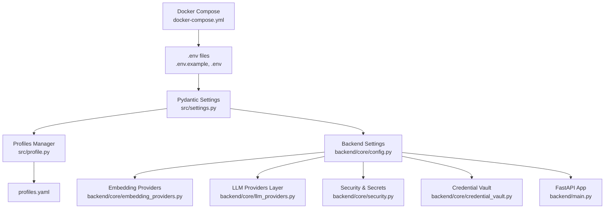
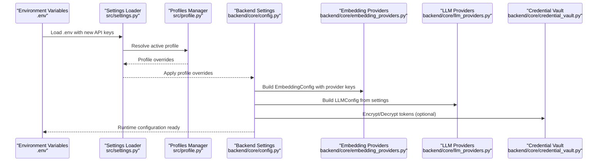
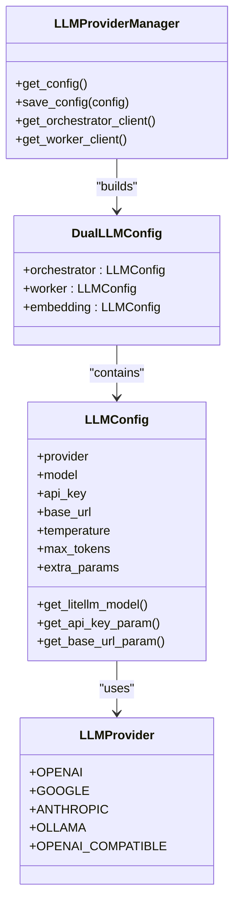
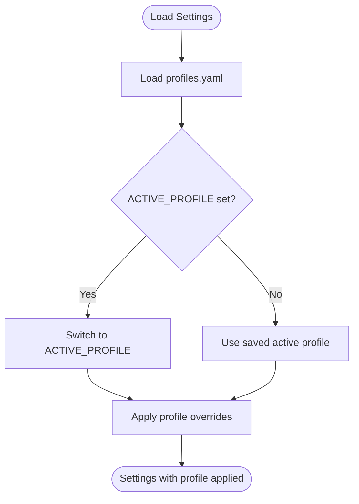
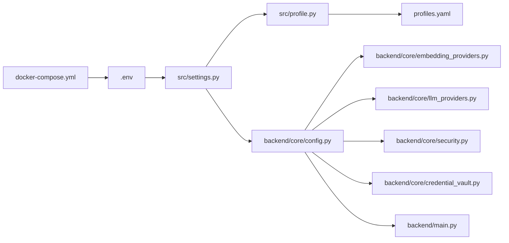

# Configuration Management

<cite>
**Referenced Files in This Document**
- [backend/core/config.py](file://backend/core/config.py)
- [backend/core/credential_vault.py](file://backend/core/credential_vault.py)
- [backend/core/llm_providers.py](file://backend/core/llm_providers.py)
- [backend/core/embedding_providers.py](file://backend/core/embedding_providers.py)
- [backend/main.py](file://backend/main.py)
- [backend/core/security.py](file://backend/core/security.py)
- [src/settings.py](file://src/settings.py)
- [src/profile.py](file://src/profile.py)
- [profiles.yaml](file://profiles.yaml)
- [.env.example](file://.env.example)
- [docker-compose.yml](file://docker-compose.yml)
- [src/test_config.py](file://src/test_config.py)
</cite>

## Update Summary
**Changes Made**
- Added new environment variables GOOGLE_API_KEY and VOYAGE_API_KEY for enhanced embedding provider configuration
- Enhanced embedding provider configuration with support for multiple provider-specific API keys
- Expanded system settings with comprehensive performance tuning controls for agent operations
- Added administrative controls including registration modes and API documentation exposure settings
- Updated configuration validation and security best practices to accommodate new provider support

## Table of Contents
1. [Introduction](#introduction)
2. [Project Structure](#project-structure)
3. [Core Components](#core-components)
4. [Architecture Overview](#architecture-overview)
5. [Detailed Component Analysis](#detailed-component-analysis)
6. [Dependency Analysis](#dependency-analysis)
7. [Performance Considerations](#performance-considerations)
8. [Troubleshooting Guide](#troubleshooting-guide)
9. [Conclusion](#conclusion)
10. [Appendices](#appendices)

## Introduction
This document explains configuration management for the MongoDB-RAG-Agent system. It covers environment variable configuration, validation, security best practices for credentials, LLM provider options, multi-profile management via profiles.yaml, deployment-specific settings, and troubleshooting guidance. The system now supports enhanced embedding provider configuration with GOOGLE_API_KEY and VOYAGE_API_KEY, along with comprehensive performance tuning and administrative controls for production deployments.

## Project Structure
Configuration spans several layers:
- Environment variables loaded from .env files
- Pydantic-based settings classes for validation and defaults
- Runtime configuration resolution and integration
- Multi-profile configuration for multiple knowledge bases
- Deployment-specific overrides via Docker Compose

**Diagram sources**
- [backend/core/config.py:9-296](file://backend/core/config.py#L9-L296)
- [backend/core/embedding_providers.py:1-744](file://backend/core/embedding_providers.py#L1-L744)
- [backend/core/llm_providers.py:1-416](file://backend/core/llm_providers.py#L1-L416)
- [backend/core/credential_vault.py:1-347](file://backend/core/credential_vault.py#L1-L347)
- [backend/core/security.py:1-390](file://backend/core/security.py#L1-L390)
- [src/settings.py:16-230](file://src/settings.py#L16-L230)
- [src/profile.py:174-740](file://src/profile.py#L174-L740)
- [profiles.yaml:1-81](file://profiles.yaml#L1-L81)
- [docker-compose.yml:54-86](file://docker-compose.yml#L54-L86)
- [backend/main.py:143-202](file://backend/main.py#L143-L202)

**Section sources**
- [backend/core/config.py:9-296](file://backend/core/config.py#L9-L296)
- [src/settings.py:16-230](file://src/settings.py#L16-L230)
- [src/profile.py:174-740](file://src/profile.py#L174-L740)
- [profiles.yaml:1-81](file://profiles.yaml#L1-L81)
- [docker-compose.yml:54-86](file://docker-compose.yml#L54-L86)
- [backend/main.py:143-202](file://backend/main.py#L143-L202)

## Core Components
- Environment variables and .env files define runtime configuration.
- Pydantic Settings classes validate and normalize configuration.
- BackendSettings integrates with main application settings and exposes provider-specific helpers.
- Enhanced embedding providers support multiple API keys for OpenAI, Google, and Voyage AI.
- LLMProviders encapsulates multi-provider LLM configuration and client creation.
- Profiles manage multiple knowledge bases with isolated databases and collections.
- CredentialVault provides encryption at rest for sensitive data.
- Security utilities validate JWT secrets and expose docs based on environment.
- Comprehensive performance tuning controls for agent operations and ingestion.

Key responsibilities:
- Centralized configuration loading and validation
- Provider selection and API key management with enhanced multi-provider support
- Multi-profile isolation and overrides
- Secure credential storage and rotation
- Environment-aware deployment settings
- Administrative controls for registration and API documentation exposure
- Performance tuning for production workloads

**Section sources**
- [backend/core/config.py:9-296](file://backend/core/config.py#L9-L296)
- [backend/core/embedding_providers.py:479-743](file://backend/core/embedding_providers.py#L479-L743)
- [backend/core/llm_providers.py:198-416](file://backend/core/llm_providers.py#L198-L416)
- [src/settings.py:79-120](file://src/settings.py#L79-L120)
- [src/profile.py:174-740](file://src/profile.py#L174-L740)
- [backend/core/credential_vault.py:44-347](file://backend/core/credential_vault.py#L44-L347)
- [backend/core/security.py:261-297](file://backend/core/security.py#L261-L297)

## Architecture Overview
Configuration flows from environment variables into validated settings, then into runtime components. Profiles can override database and collection names. Enhanced LLM configuration supports provider-specific API keys. Credentials are stored encrypted when needed. New system settings provide comprehensive performance tuning and administrative controls.

**Diagram sources**
- [src/settings.py:79-120](file://src/settings.py#L79-L120)
- [src/profile.py:256-278](file://src/profile.py#L256-L278)
- [backend/core/config.py:220-253](file://backend/core/config.py#L220-L253)
- [backend/core/embedding_providers.py:658-682](file://backend/core/embedding_providers.py#L658-L682)
- [backend/core/llm_providers.py:341-387](file://backend/core/llm_providers.py#L341-L387)
- [backend/core/credential_vault.py:119-184](file://backend/core/credential_vault.py#L119-L184)

## Detailed Component Analysis

### Environment Variable Configuration
- MongoDB connection strings and indexes
- LLM provider selection, model, base URL, and API keys
- Enhanced embedding provider configuration with GOOGLE_API_KEY and VOYAGE_API_KEY
- Search defaults and agent settings
- Airbyte integration toggles and URLs
- Application environment and logging level
- **New**: Provider-specific API keys for multi-provider embedding support
- **New**: Administrative controls for registration and API documentation exposure

Recommended practice:
- Use .env.example as a template and populate .env locally.
- For Docker, rely on docker-compose environment blocks to inject variables.
- Keep sensitive keys out of version control.
- **New**: Set GOOGLE_API_KEY for Google Gemini embeddings and VOYAGE_API_KEY for Voyage AI embeddings.

**Section sources**
- [.env.example:55-61](file://.env.example#L55-L61)
- [docker-compose.yml:54-86](file://docker-compose.yml#L54-L86)
- [backend/core/config.py:40-44](file://backend/core/config.py#L40-L44)

### Enhanced Embedding Provider Configuration
The system now supports provider-specific API keys for enhanced multi-provider embedding capabilities:

**New Features:**
- GOOGLE_API_KEY for Google Gemini embedding models
- VOYAGE_API_KEY for Voyage AI embedding models
- OPENAI_API_KEY as fallback for OpenAI embeddings
- Enhanced model specifications supporting task-type optimization

**Provider Support:**
- OpenAI: text-embedding-3-small, text-embedding-3-large, text-embedding-ada-002
- Google Gemini: gemini-embedding-2-preview, gemini-embedding-001, text-embedding-004
- Voyage AI: voyage-4-large, voyage-4, voyage-4-lite, voyage-code-3, voyage-3-large
- Ollama: nomic-embed-text, mxbai-embed-large, all-minilm, snowflake-arctic-embed, bge-large, bge-m3

**Section sources**
- [backend/core/embedding_providers.py:54-186](file://backend/core/embedding_providers.py#L54-L186)
- [backend/core/embedding_providers.py:479-583](file://backend/core/embedding_providers.py#L479-L583)
- [src/settings.py:96-110](file://src/settings.py#L96-L110)

### Configuration Validation and Security Best Practices
- Validation script masks credentials and reports missing or invalid settings.
- JWT secret validation enforces strong secrets in production.
- CredentialVault provides encryption at rest for tokens and secrets.
- Security headers middleware adds defense-in-depth protections.
- **New**: Enhanced validation for provider-specific API keys.

Best practices:
- Generate and store JWT_SECRET_KEY securely; never commit defaults.
- Use CredentialVault for tokens stored in the database; set CREDENTIAL_VAULT_KEY and CREDENTIAL_VAULT_SALT.
- Prefer environment-specific overrides via docker-compose for deployment differences.
- Validate configuration before deploying.
- **New**: Ensure GOOGLE_API_KEY and VOYAGE_API_KEY are properly configured for respective providers.

**Section sources**
- [src/test_config.py:15-107](file://src/test_config.py#L15-L107)
- [backend/core/security.py:261-297](file://backend/core/security.py#L261-L297)
- [backend/core/credential_vault.py:44-118](file://backend/core/credential_vault.py#L44-L118)

### LLM Provider Configuration
Supported providers include OpenAI, Google (Gemini), Anthropic (Claude), Ollama, and OpenAI-compatible endpoints. The system resolves provider-specific API keys and base URLs, and constructs model identifiers for LiteLLM.

Key behaviors:
- Provider selection influences model naming and parameter passing.
- API keys can be provider-specific or shared fallback keys.
- Base URLs enable local or third-party compatible endpoints.
- **Enhanced**: Improved provider key resolution with GOOGLE_API_KEY and VOYAGE_API_KEY support.

**Diagram sources**
- [backend/core/llm_providers.py:20-112](file://backend/core/llm_providers.py#L20-L112)
- [backend/core/llm_providers.py:198-416](file://backend/core/llm_providers.py#L198-L416)

**Section sources**
- [backend/core/llm_providers.py:198-416](file://backend/core/llm_providers.py#L198-L416)
- [backend/core/config.py:220-253](file://backend/core/config.py#L220-L253)

### Multi-Profile Configuration with profiles.yaml
Profiles isolate databases, collections, and indexes per knowledge base. They also support optional Airbyte and cloud source integrations.

Highlights:
- Active profile selection via environment variable or profiles.yaml.
- Per-profile overrides for database and collection names.
- Optional embedding and LLM model overrides per profile.
- Cloud source and Airbyte configuration per profile.

**Diagram sources**
- [src/settings.py:162-202](file://src/settings.py#L162-L202)
- [src/profile.py:256-313](file://src/profile.py#L256-L313)
- [profiles.yaml:1-81](file://profiles.yaml#L1-L81)

**Section sources**
- [src/settings.py:106-155](file://src/settings.py#L106-L155)
- [src/profile.py:174-740](file://src/profile.py#L174-L740)
- [profiles.yaml:1-81](file://profiles.yaml#L1-L81)

### Deployment-Specific Configurations and Overrides
Docker Compose injects environment variables for MongoDB, LLM, embeddings, and profiles. This enables environment-specific overrides without changing code.

Common overrides:
- MONGODB_URI for local vs. Atlas
- LLM_PROVIDER and LLM_BASE_URL for local or hosted providers
- EMBEDDING_* variables for local embeddings
- PROFILES_PATH and ACTIVE_PROFILE for multi-environment profile usage
- **New**: GOOGLE_API_KEY and VOYAGE_API_KEY for enhanced embedding provider support

**Section sources**
- [docker-compose.yml:54-86](file://docker-compose.yml#L54-L86)
- [backend/core/config.py:184-218](file://backend/core/config.py#L184-L218)

### Administrative Controls and System Settings
**New Administrative Features:**

**Registration Control:**
- REGISTRATION_MODE: 'open', 'invite', or 'closed'
- INVITE_CODE or INVITE_CODES: Required codes for 'invite' mode
- ALLOW_REGISTRATION: Enable/disable public registration

**API Documentation Exposure:**
- EXPOSE_API_DOCS: Control API documentation visibility
- Defaults: True in development, False in production

**Performance Tuning Controls:**
- Comprehensive agent performance settings for production workloads
- Enhanced ingestion worker configuration
- Request timeout management for different endpoint types

**Section sources**
- [backend/core/security.py:331-411](file://backend/core/security.py#L331-L411)
- [backend/main.py:85-154](file://backend/main.py#L85-L154)

## Dependency Analysis
Configuration dependencies across modules:

**Diagram sources**
- [src/settings.py:16-230](file://src/settings.py#L16-L230)
- [src/profile.py:174-740](file://src/profile.py#L174-L740)
- [profiles.yaml:1-81](file://profiles.yaml#L1-L81)
- [backend/core/config.py:9-296](file://backend/core/config.py#L9-L296)
- [backend/core/embedding_providers.py:1-744](file://backend/core/embedding_providers.py#L1-L744)
- [backend/core/llm_providers.py:198-416](file://backend/core/llm_providers.py#L198-L416)
- [backend/core/security.py:261-297](file://backend/core/security.py#L261-L297)
- [backend/core/credential_vault.py:44-118](file://backend/core/credential_vault.py#L44-L118)
- [backend/main.py:143-202](file://backend/main.py#L143-L202)
- [docker-compose.yml:54-86](file://docker-compose.yml#L54-L86)

**Section sources**
- [src/settings.py:162-202](file://src/settings.py#L162-L202)
- [src/profile.py:256-313](file://src/profile.py#L256-L313)
- [backend/core/config.py:184-218](file://backend/core/config.py#L184-L218)
- [backend/core/llm_providers.py:341-387](file://backend/core/llm_providers.py#L341-L387)
- [backend/core/security.py:261-297](file://backend/core/security.py#L261-L297)
- [backend/core/credential_vault.py:119-184](file://backend/core/credential_vault.py#L119-L184)
- [backend/main.py:143-202](file://backend/main.py#L143-L202)
- [docker-compose.yml:54-86](file://docker-compose.yml#L54-L86)

## Performance Considerations
- Centralized settings caching avoids repeated file parsing.
- Provider manager caches resolved configuration to reduce database reads.
- Enhanced thread pool sizing in main.py supports async ingestion throughput.
- **New**: Comprehensive performance tuning controls for agent operations and ingestion workers.
- **New**: Administrative controls for registration and API documentation exposure.
- Avoid excessive environment variable parsing by relying on cached settings.

## Troubleshooting Guide
Common configuration issues and resolutions:
- Missing or empty MONGODB_URI: Ensure .env contains a valid MongoDB connection string.
- Missing LLM_API_KEY or EMBEDDING_API_KEY: Set provider-specific keys in .env.
- **New**: Missing GOOGLE_API_KEY for Google Gemini embeddings or VOYAGE_API_KEY for Voyage AI embeddings.
- Invalid provider or model: Confirm LLM_PROVIDER and LLM_MODEL align with supported providers.
- JWT_SECRET_KEY warnings: Set a strong secret in production.
- Profile not found: Verify profiles.yaml and ACTIVE_PROFILE value.
- CredentialVault key/salt warnings: Set CREDENTIAL_VAULT_KEY and CREDENTIAL_VAULT_SALT for production.
- **New**: Registration mode conflicts: Check REGISTRATION_MODE settings and invite codes.
- **New**: API documentation not accessible: Verify EXPOSE_API_DOCS setting matches APP_ENV.

Validation resources:
- Use the configuration validation script to check settings and mask credentials.
- Review backend startup logs for security and configuration warnings.
- **New**: Check provider-specific API key configuration for embedding operations.

**Section sources**
- [src/test_config.py:15-107](file://src/test_config.py#L15-L107)
- [backend/core/security.py:261-297](file://backend/core/security.py#L261-L297)
- [backend/core/credential_vault.py:84-101](file://backend/core/credential_vault.py#L84-L101)
- [src/settings.py:194-202](file://src/settings.py#L194-L202)

## Conclusion
The MongoDB-RAG-Agent employs a robust configuration system combining environment variables, Pydantic validation, multi-profile isolation, and secure credential handling. Recent enhancements include expanded embedding provider support with GOOGLE_API_KEY and VOYAGE_API_KEY, comprehensive performance tuning controls, and administrative controls for production deployments. By following the outlined practices—using .env templates, validating configuration, enforcing strong secrets, leveraging profiles, and utilizing the new administrative controls—you can deploy and operate the system reliably across environments while maintaining security and flexibility.

## Appendices

### Configuration Templates
- Environment template: see .env.example for required variables and comments.
- Profiles template: see profiles.yaml for multi-knowledge-base configuration.
- **New**: Enhanced embedding provider configuration with GOOGLE_API_KEY and VOYAGE_API_KEY support.

**Section sources**
- [.env.example:55-61](file://.env.example#L55-L61)
- [profiles.yaml:1-81](file://profiles.yaml#L1-L81)

### Configuration Validation Script
- Validates MongoDB, LLM, and Embedding settings and masks credentials in output.
- Provides actionable guidance for next steps.
- **New**: Enhanced validation for provider-specific API keys.

**Section sources**
- [src/test_config.py:15-107](file://src/test_config.py#L15-L107)

### Security Best Practices Checklist
- Generate and store JWT_SECRET_KEY securely.
- Use CredentialVault for tokens stored in the database.
- Prefer environment-specific overrides via Docker Compose.
- Validate configuration before deployment.
- **New**: Configure GOOGLE_API_KEY and VOYAGE_API_KEY for enhanced embedding provider support.
- **New**: Set appropriate REGISTRATION_MODE and EXPOSE_API_DOCS settings for production.

**Section sources**
- [backend/core/security.py:261-297](file://backend/core/security.py#L261-L297)
- [backend/core/credential_vault.py:44-118](file://backend/core/credential_vault.py#L44-L118)
- [docker-compose.yml:54-86](file://docker-compose.yml#L54-L86)

### Enhanced Embedding Provider Configuration
**New Provider-Specific API Keys:**
- GOOGLE_API_KEY: Required for Google Gemini embedding models
- VOYAGE_API_KEY: Required for Voyage AI embedding models  
- OPENAI_API_KEY: Fallback for OpenAI embeddings
- ANTHROPIC_API_KEY: Required for Claude LLM models

**Supported Embedding Models:**
- OpenAI: text-embedding-3-small, text-embedding-3-large, text-embedding-ada-002
- Google: gemini-embedding-2-preview, gemini-embedding-001, text-embedding-004
- Voyage AI: voyage-4-large, voyage-4, voyage-4-lite, voyage-code-3, voyage-3-large
- Ollama: nomic-embed-text, mxbai-embed-large, all-minilm, snowflake-arctic-embed, bge-large, bge-m3

**Section sources**
- [backend/core/embedding_providers.py:54-186](file://backend/core/embedding_providers.py#L54-L186)
- [src/settings.py:96-110](file://src/settings.py#L96-L110)