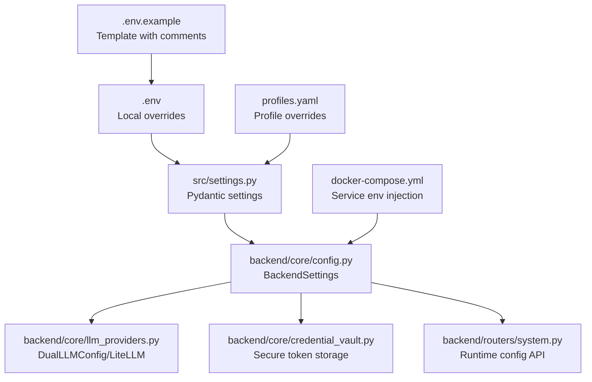
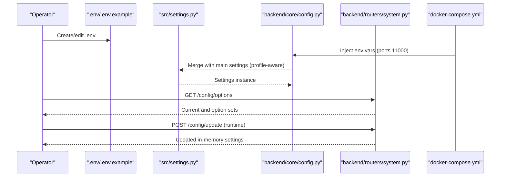
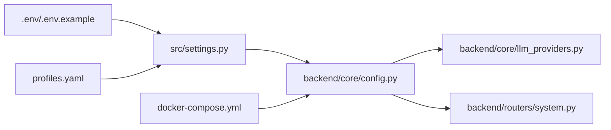

# Environment Configuration

<cite>
**Referenced Files in This Document**
- [.env.example](file://.env.example)
- [.env](file://.env)
- [src/settings.py](file://src/settings.py)
- [backend/core/config.py](file://backend/core/config.py)
- [backend/core/llm_providers.py](file://backend/core/llm_providers.py)
- [backend/core/credential_vault.py](file://backend/core/credential_vault.py)
- [backend/routers/system.py](file://backend/routers/system.py)
- [docker-compose.yml](file://docker-compose.yml)
- [docker-compose.override.yml](file://docker-compose.override.yml)
- [profiles.yaml](file://profiles.yaml)
- [src/test_config.py](file://src/test_config.py)
- [backend/main.py](file://backend/main.py)
- [backend/core/security.py](file://backend/core/security.py)
</cite>

## Table of Contents
1. [Introduction](#introduction)
2. [Project Structure](#project-structure)
3. [Core Components](#core-components)
4. [Architecture Overview](#architecture-overview)
5. [Detailed Component Analysis](#detailed-component-analysis)
6. [Dependency Analysis](#dependency-analysis)
7. [Performance Considerations](#performance-considerations)
8. [Troubleshooting Guide](#troubleshooting-guide)
9. [Conclusion](#conclusion)

## Introduction
This document explains how environment configuration is managed in MongoDB-RAG-Agent. It covers all environment variables for MongoDB connections, database and collection names, LLM provider configuration (selection, API keys, models, base URLs), embedding provider setup (including dimensions and local/cloud options), search parameters (match counts and text weights), application settings (environment and logging), and security practices for credential management. It also includes validation guidance, troubleshooting tips, and deployment-specific considerations.

## Project Structure
Configuration is centralized in environment files and loaded by Pydantic settings classes. The backend integrates with a separate settings loader for profile-aware overrides. Docker Compose injects environment variables into services, while the frontend reads configuration via runtime API endpoints.

**Diagram sources**
- [.env.example](file://.env.example#L1-L115)
- [.env](file://.env#L1-L67)
- [src/settings.py](file://src/settings.py#L16-L211)
- [backend/core/config.py](file://backend/core/config.py#L9-L219)
- [backend/core/llm_providers.py](file://backend/core/llm_providers.py#L20-L416)
- [backend/core/credential_vault.py](file://backend/core/credential_vault.py#L44-L347)
- [backend/routers/system.py](file://backend/routers/system.py#L677-L721)
- [docker-compose.yml](file://docker-compose.yml#L44-L86)
- [profiles.yaml](file://profiles.yaml#L1-L81)

**Section sources**
- [.env.example](file://.env.example#L1-L115)
- [.env](file://.env#L1-L67)
- [src/settings.py](file://src/settings.py#L16-L211)
- [backend/core/config.py](file://backend/core/config.py#L9-L219)
- [docker-compose.yml](file://docker-compose.yml#L44-L86)
- [profiles.yaml](file://profiles.yaml#L1-L81)

## Core Components
- MongoDB configuration: connection string, database name, collections for documents and chunks, and Atlas search index names.
- LLM provider configuration: provider selection, API key(s), model identifiers, and base URL for OpenAI-compatible endpoints.
- Embedding provider configuration: provider selection, API key, model, base URL, and vector dimension.
- Search configuration: default and maximum match counts, and default text weight for hybrid search.
- Application settings: environment mode and logging level.
- Security settings: JWT secret key, registration mode, invite codes, and API docs exposure toggle.
- Airbyte integration: enablement flag and URLs for internal/external access.
- Profiles: active profile selection and profile-driven overrides for database/collections/indexes.

**Section sources**
- [.env.example](file://.env.example#L1-L115)
- [.env](file://.env#L1-L67)
- [src/settings.py](file://src/settings.py#L23-L104)
- [backend/core/config.py](file://backend/core/config.py#L23-L139)
- [backend/core/llm_providers.py](file://backend/core/llm_providers.py#L20-L416)
- [backend/core/credential_vault.py](file://backend/core/credential_vault.py#L61-L105)
- [backend/routers/system.py](file://backend/routers/system.py#L677-L721)
- [docker-compose.yml](file://docker-compose.yml#L54-L79)

## Architecture Overview
The configuration pipeline loads environment variables into Pydantic settings, applies profile overrides, and exposes runtime configuration via API endpoints. Docker Compose injects environment variables into backend and CLI services.

**Diagram sources**
- [.env.example](file://.env.example#L1-L115)
- [.env](file://.env#L1-L67)
- [src/settings.py](file://src/settings.py#L162-L211)
- [backend/core/config.py](file://backend/core/config.py#L184-L219)
- [backend/routers/system.py](file://backend/routers/system.py#L677-L721)
- [docker-compose.yml](file://docker-compose.yml#L44-L86)

## Detailed Component Analysis

### MongoDB Configuration
- Variables:
  - MONGODB_URI: connection string for MongoDB Atlas local or cloud.
  - MONGODB_DATABASE: target database name.
  - MONGODB_COLLECTION_DOCUMENTS: collection for source documents.
  - MONGODB_COLLECTION_CHUNKS: collection for chunked embeddings.
  - MONGODB_VECTOR_INDEX: Atlas vector search index name.
  - MONGODB_TEXT_INDEX: Atlas text search index name.
- Behavior:
  - Loaded by both main settings and backend settings.
  - Backend settings integrate with main settings and can be overridden by profiles.

**Section sources**
- [.env.example](file://.env.example#L2-L12)
- [.env](file://.env#L2-L12)
- [src/settings.py](file://src/settings.py#L23-L44)
- [backend/core/config.py](file://backend/core/config.py#L23-L32)
- [profiles.yaml](file://profiles.yaml#L8-L18)

### LLM Provider Configuration
- Variables:
  - LLM_PROVIDER: provider identifier (openai, openrouter, ollama, gemini).
  - LLM_API_KEY: primary API key; provider-specific keys also supported.
  - LLM_MODEL: model identifier for orchestrator/primary model.
  - LLM_BASE_URL: base URL for OpenAI-compatible providers.
  - Provider-specific keys: openai_api_key, google_api_key, anthropic_api_key.
  - Fast/worker model: fast_llm_provider, fast_llm_model, fast_llm_api_key, fast_llm_base_url.
- Behavior:
  - Provider selection influences model prefixing for LiteLLM.
  - API key resolution prefers provider-specific keys, falls back to shared LLM_API_KEY.
  - Backend settings expose orchestrator and worker provider/model fields.

**Section sources**
- [.env.example](file://.env.example#L20-L31)
- [.env](file://.env#L20-L31)
- [src/settings.py](file://src/settings.py#L57-L73)
- [backend/core/config.py](file://backend/core/config.py#L34-L49)
- [backend/core/llm_providers.py](file://backend/core/llm_providers.py#L20-L90)
- [backend/core/llm_providers.py](file://backend/core/llm_providers.py#L342-L387)

### Embedding Provider Configuration
- Variables:
  - EMBEDDING_PROVIDER: embedding provider (openai, ollama).
  - EMBEDDING_API_KEY: embedding API key.
  - EMBEDDING_MODEL: embedding model identifier.
  - EMBEDDING_BASE_URL: embedding base URL.
  - EMBEDDING_DIMENSION: vector dimension for embeddings.
- Behavior:
  - Embedding dimension is configurable and used by ingestion pipeline.
  - Backend settings expose embedding provider, model, base URL, and dimension.

**Section sources**
- [.env.example](file://.env.example#L33-L46)
- [.env](file://.env#L33-L46)
- [src/settings.py](file://src/settings.py#L75-L91)
- [backend/core/config.py](file://backend/core/config.py#L51-L56)
- [src/ingestion/embedder.py](file://src/ingestion/embedder.py#L66-L82)

### Search Configuration
- Variables:
  - DEFAULT_MATCH_COUNT: default number of matches returned.
  - MAX_MATCH_COUNT: maximum allowed matches.
  - DEFAULT_TEXT_WEIGHT: default text weight for hybrid search (0–1).
- Behavior:
  - Exposed via runtime configuration API for updates.
  - Used by search pipelines to balance vector and text scores.

**Section sources**
- [.env.example](file://.env.example#L48-L51)
- [.env](file://.env#L48-L51)
- [src/settings.py](file://src/settings.py#L93-L104)
- [backend/routers/system.py](file://backend/routers/system.py#L677-L721)

### Application Settings
- Variables:
  - APP_ENV: environment mode (development, production).
  - LOG_LEVEL: logging verbosity.
- Behavior:
  - Used by backend startup and middleware.
  - Security policy toggles API docs exposure based on environment.

**Section sources**
- [.env.example](file://.env.example#L53-L55)
- [.env](file://.env#L53-L55)
- [backend/main.py](file://backend/main.py#L76-L81)
- [backend/core/security.py](file://backend/core/security.py#L360-L366)

### Security Settings
- Variables:
  - JWT_SECRET_KEY: critical secret for JWT signing.
  - REGISTRATION_MODE: open, invite, closed.
  - INVITE_CODE / INVITE_CODES: single or comma-separated codes.
  - EXPOSE_API_DOCS: toggle API docs visibility.
- Behavior:
  - Startup validates JWT secret strength.
  - Registration mode and invite code validation enforced at runtime.
  - API docs exposure controlled by environment.

**Section sources**
- [.env.example](file://.env.example#L58-L81)
- [backend/main.py](file://backend/main.py#L76-L81)
- [backend/core/security.py](file://backend/core/security.py#L325-L366)

### Airbyte Integration
- Variables:
  - AIRBYTE_ENABLED: enable Airbyte-based providers.
  - AIRBYTE_API_URL: internal container URL for Airbyte API.
  - AIRBYTE_WEBAPP_URL: external URL for Airbyte WebApp.
  - AIRBYTE_MONGODB_HOST/PORT/DATABASE: destination for Airbyte writes.
- Behavior:
  - Backend settings include Airbyte configuration fields.
  - Docker Compose injects Airbyte variables into backend service.

**Section sources**
- [.env.example](file://.env.example#L83-L115)
- [.env](file://.env#L57-L67)
- [backend/core/config.py](file://backend/core/config.py#L106-L132)
- [docker-compose.yml](file://docker-compose.yml#L76-L79)

### Profiles and Overrides
- Variables:
  - ACTIVE_PROFILE: overrides profiles.yaml active profile.
  - PROFILES_PATH: path to profiles.yaml.
- Behavior:
  - Settings.load_settings() applies profile overrides to database/collections/indexes and optionally to embedding/LLM models.
  - Profiles define per-environment targets and optional cloud source integrations.

**Section sources**
- [.env.example](file://.env.example#L14-L18)
- [.env](file://.env#L14-L18)
- [src/settings.py](file://src/settings.py#L46-L55)
- [src/settings.py](file://src/settings.py#L106-L155)
- [profiles.yaml](file://profiles.yaml#L1-L81)

### Runtime Configuration API
- Endpoints:
  - GET /config/options: returns current values and available options (e.g., embedding dimensions).
  - POST /config/update: updates in-memory settings at runtime.
  - GET /llm-providers: returns provider configuration (masked API keys).
- Behavior:
  - Updates persist until restart; use POST /config/save to persist to database (implementation referenced in router).

**Section sources**
- [backend/routers/system.py](file://backend/routers/system.py#L677-L721)
- [backend/routers/system.py](file://backend/routers/system.py#L861-L926)

## Dependency Analysis
Configuration dependencies span environment files, Pydantic settings, backend integration, provider manager, and runtime API.

**Diagram sources**
- [.env.example](file://.env.example#L1-L115)
- [.env](file://.env#L1-L67)
- [src/settings.py](file://src/settings.py#L16-L211)
- [backend/core/config.py](file://backend/core/config.py#L9-L219)
- [backend/core/llm_providers.py](file://backend/core/llm_providers.py#L198-L416)
- [backend/routers/system.py](file://backend/routers/system.py#L677-L721)
- [docker-compose.yml](file://docker-compose.yml#L44-L86)
- [profiles.yaml](file://profiles.yaml#L1-L81)

**Section sources**
- [src/settings.py](file://src/settings.py#L16-L211)
- [backend/core/config.py](file://backend/core/config.py#L9-L219)
- [backend/core/llm_providers.py](file://backend/core/llm_providers.py#L198-L416)
- [backend/routers/system.py](file://backend/routers/system.py#L677-L721)
- [docker-compose.yml](file://docker-compose.yml#L44-L86)
- [profiles.yaml](file://profiles.yaml#L1-L81)

## Performance Considerations
- Keep DEFAULT_MATCH_COUNT and MAX_MATCH_COUNT reasonable to avoid heavy vector searches.
- Prefer embedding dimensions aligned with your chosen embedding model to prevent unnecessary conversions.
- Use local providers (e.g., Ollama) for low-latency inference when bandwidth or latency is a concern.
- Limit API docs exposure in production to reduce attack surface and resource overhead.

## Troubleshooting Guide
Common configuration issues and resolutions:
- Missing or incomplete .env:
  - Ensure all required variables are present. The validation script reports missing keys and suggests .env.example as a template.
- Invalid MongoDB URI:
  - Confirm connection string format and network reachability. Use the provided templates for Atlas or local deployments.
- Empty or invalid API keys:
  - Verify provider-specific keys and base URLs. The backend resolves keys per provider, falling back to shared LLM_API_KEY.
- Incorrect embedding dimension:
  - Align EMBEDDING_DIMENSION with the selected embedding model’s expected dimension.
- Runtime configuration not applying:
  - Use POST /config/update to change in-memory settings; note persistence requires a dedicated save endpoint (referenced in router).
- Security warnings at startup:
  - Ensure JWT_SECRET_KEY meets production strength requirements.

Validation and diagnostics:
- Run the configuration validator to confirm all settings are present and readable.
- Review backend logs for timeout middleware behavior and health check paths.

**Section sources**
- [src/test_config.py](file://src/test_config.py#L15-L107)
- [backend/main.py](file://backend/main.py#L88-L112)
- [backend/core/security.py](file://backend/core/security.py#L325-L366)

## Conclusion
MongoDB-RAG-Agent centralizes configuration in environment files and exposes a robust runtime API for dynamic updates. By aligning environment variables with provider capabilities, validating settings early, and following security best practices, operators can deploy reliable and maintainable RAG systems across development and production environments.