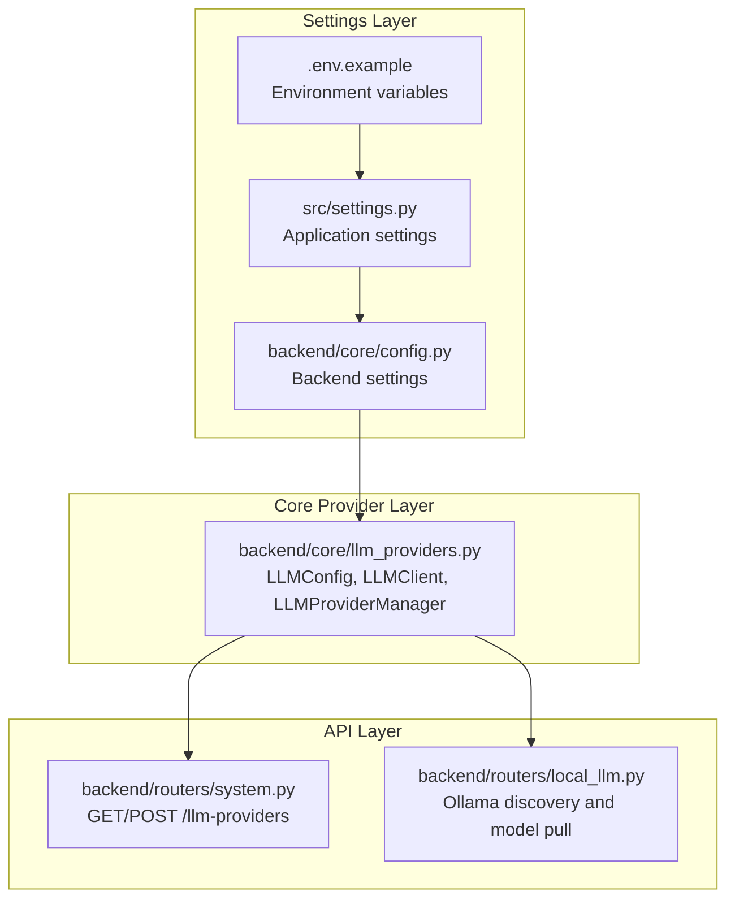
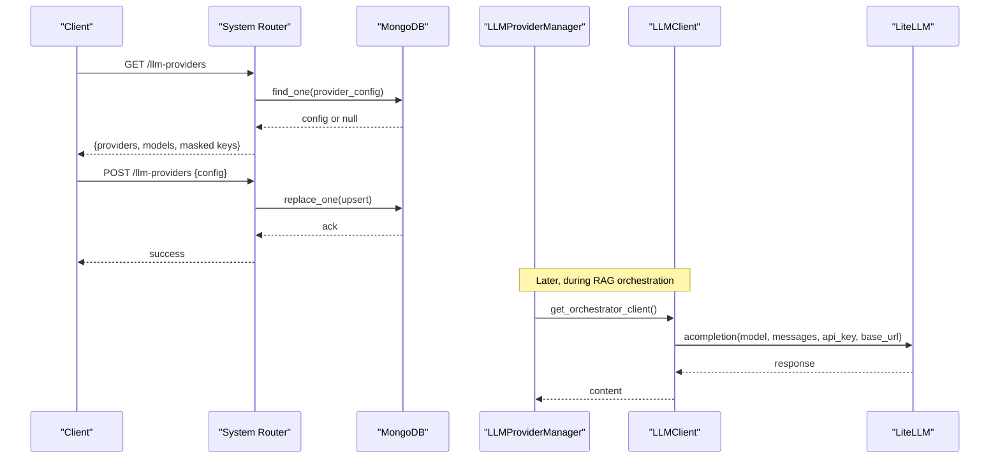
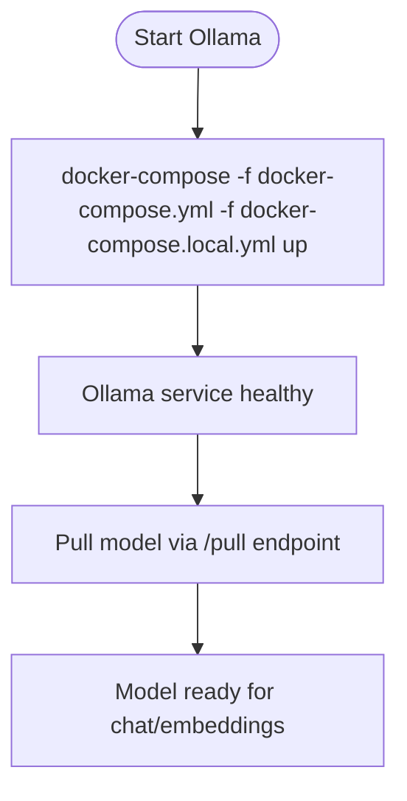
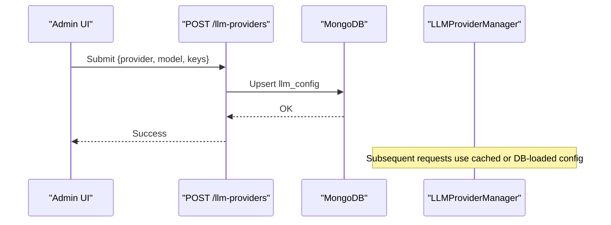
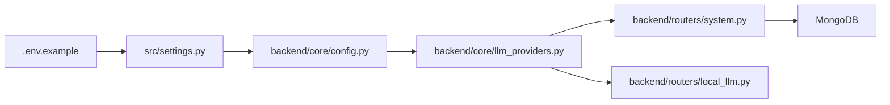

# LLM Provider Configuration

<cite>
**Referenced Files in This Document**
- [llm_providers.py](file://backend/core/llm_providers.py)
- [config.py](file://backend/core/config.py)
- [settings.py](file://src/settings.py)
- [.env.example](file://.env.example)
- [docker-compose.yml](file://docker-compose.yml)
- [docker-compose.local.yml](file://docker-compose.local.yml)
- [system.py](file://backend/routers/system.py)
- [local_llm.py](file://backend/routers/local_llm.py)
</cite>

## Table of Contents
1. [Introduction](#introduction)
2. [Project Structure](#project-structure)
3. [Core Components](#core-components)
4. [Architecture Overview](#architecture-overview)
5. [Detailed Component Analysis](#detailed-component-analysis)
6. [Dependency Analysis](#dependency-analysis)
7. [Performance Considerations](#performance-considerations)
8. [Troubleshooting Guide](#troubleshooting-guide)
9. [Conclusion](#conclusion)
10. [Appendices](#appendices)

## Introduction
This document explains how to configure Large Language Model (LLM) providers in the MongoDB-RAG-Agent system. It covers supported providers (OpenAI, OpenRouter, Ollama, Gemini), API key management, model selection, base URL configuration, and local Ollama setup. It also describes provider switching, persistence, rate limiting considerations, cost management, and practical deployment examples.

## Project Structure
The LLM configuration spans three layers:
- Settings layer: loads environment variables and profiles to define provider, model, and base URL.
- Core provider layer: normalizes provider-specific model names and parameters for LiteLLM.
- API layer: exposes endpoints to read/write provider configuration and manage local models.

**Diagram sources**
- [settings.py](file://src/settings.py#L57-L91)
- [config.py](file://backend/core/config.py#L34-L91)
- [llm_providers.py](file://backend/core/llm_providers.py#L20-L112)
- [system.py](file://backend/routers/system.py#L861-L1038)
- [local_llm.py](file://backend/routers/local_llm.py#L646-L681)

**Section sources**
- [settings.py](file://src/settings.py#L57-L91)
- [config.py](file://backend/core/config.py#L34-L91)
- [llm_providers.py](file://backend/core/llm_providers.py#L20-L112)
- [system.py](file://backend/routers/system.py#L861-L1038)
- [local_llm.py](file://backend/routers/local_llm.py#L646-L681)

## Core Components
- LLMProvider: enumerates supported providers including OpenAI, Google (Gemini), Anthropic (Claude), Ollama, and OpenAI-compatible.
- LLMConfig: holds provider, model, API key, base URL, and optional tuning parameters; converts model names for LiteLLM.
- LLMClient: async client wrapping LiteLLM’s acompletion to generate completions and JSON outputs.
- LLMProviderManager: manages dual-model configuration (orchestrator and worker), persists to MongoDB, and resolves defaults from settings.
- BackendSettings and Settings: define environment-driven configuration for providers, models, and base URLs.

Key behaviors:
- Model normalization prefixes models for LiteLLM (e.g., gemini/, anthropic/, ollama/).
- API keys are resolved per provider with fallbacks.
- Base URLs are optional and only included when configured.
- Dual model configuration supports separate providers/models for reasoning vs. fast execution.

**Section sources**
- [llm_providers.py](file://backend/core/llm_providers.py#L20-L112)
- [llm_providers.py](file://backend/core/llm_providers.py#L114-L196)
- [llm_providers.py](file://backend/core/llm_providers.py#L198-L416)
- [config.py](file://backend/core/config.py#L34-L91)
- [settings.py](file://src/settings.py#L57-L91)

## Architecture Overview
The system routes requests through API endpoints to persist or fetch provider configuration, then uses the provider manager to construct clients that call LiteLLM with normalized model identifiers and provider-specific parameters.

**Diagram sources**
- [system.py](file://backend/routers/system.py#L861-L1038)
- [llm_providers.py](file://backend/core/llm_providers.py#L198-L416)

## Detailed Component Analysis

### Supported Providers and Configuration Matrix
- OpenAI: Chat and embedding models; default base URL is the OpenAI API.
- OpenRouter: OpenAI-compatible; configured via LLM_BASE_URL and LLM_PROVIDER=openrouter.
- Gemini (Google): Uses gemini/<model> prefix; base URL configurable.
- Ollama: Local provider; supports chat and embeddings; base URL http://ollama:11434/v1 in Docker Compose.
- OpenAI-compatible: Any provider exposing OpenAI-compatible endpoints; use OPENAI_COMPATIBLE with base_url and model prefixing.

Provider-specific settings summary:
- OpenAI: provider=openai, model=<chat>, embedding=<embedding>, base_url=https://api.openai.com/v1.
- OpenRouter: provider=openrouter, model=<provider>/<model>, base_url=https://openrouter.ai/api/v1.
- Gemini: provider=google, model=gemini-..., base_url=https://generativelanguage.googleapis.com/v1.
- Ollama: provider=ollama, model=<local-model>, base_url=http://ollama:11434/v1, api_key=ignored.

**Section sources**
- [llm_providers.py](file://backend/core/llm_providers.py#L20-L27)
- [llm_providers.py](file://backend/core/llm_providers.py#L44-L74)
- [config.py](file://backend/core/config.py#L34-L91)
- [settings.py](file://src/settings.py#L57-L91)
- [.env.example](file://.env.example#L20-L46)

### API Key Management
- Centralized resolution via BackendSettings.get_api_key_for_provider(provider) with fallbacks.
- Dedicated keys per provider: openai_api_key, google_api_key, anthropic_api_key.
- Ollama does not require an API key; the system passes an empty key for compatibility.
- Fast/worker model can override its own API key via fast_llm_api_key.

Practical guidance:
- Prefer provider-specific keys for multi-provider setups.
- Store keys in environment variables (.env) and avoid hardcoding.
- Masked display in UI protects sensitive values.

**Section sources**
- [config.py](file://backend/core/config.py#L145-L176)
- [system.py](file://backend/routers/system.py#L861-L929)

### Model Selection Criteria
- Recommended models per provider are embedded in LLMProviderManager.RECOMMENDED_MODELS for orchestrator, worker, and embeddings.
- DualLLMConfig separates reasoning (orchestrator) and execution (worker) models.
- Environment variables drive defaults; database-persisted config overrides at runtime.

Selection tips:
- Choose larger/context-window models for orchestrator tasks.
- Select faster/lighter models for worker tasks.
- Use embedding models appropriate to the provider and dimensionality.

**Section sources**
- [llm_providers.py](file://backend/core/llm_providers.py#L198-L223)
- [llm_providers.py](file://backend/core/llm_providers.py#L341-L387)

### Base URL Configuration
- LLM base_url is optional; included only when explicitly set.
- Defaults are derived from settings and environment variables.
- OpenAI-compatible providers rely on base_url to route to third-party endpoints.

Examples:
- OpenAI: base_url=https://api.openai.com/v1.
- OpenRouter: base_url=https://openrouter.ai/api/v1.
- Gemini: base_url=https://generativelanguage.googleapis.com/v1.
- Ollama: base_url=http://ollama:11434/v1.

**Section sources**
- [llm_providers.py](file://backend/core/llm_providers.py#L84-L89)
- [config.py](file://backend/core/config.py#L34-L91)
- [settings.py](file://src/settings.py#L70-L86)
- [.env.example](file://.env.example#L20-L46)

### Provider-Specific Settings and Authentication
- OpenAI: model=gpt-4o, gpt-4o-mini, etc.; base_url=https://api.openai.com/v1; api key required.
- OpenRouter: model=anthropic/claude-..., etc.; base_url=https://openrouter.ai/api/v1; api key required.
- Gemini: model=gemini-1.5-pro, gemini-2.0-flash-exp, etc.; base_url=https://generativelanguage.googleapis.com/v1; api key required.
- Ollama: model=llama3.2, qwen2.5:7b, etc.; base_url=http://ollama:11434/v1; api key ignored.

Notes:
- LiteLLM model prefixes are applied automatically (gemini/, anthropic/, ollama/).
- OPENAI_COMPATIBLE allows arbitrary OpenAI-compatible endpoints.

**Section sources**
- [llm_providers.py](file://backend/core/llm_providers.py#L44-L74)
- [config.py](file://backend/core/config.py#L34-L91)
- [settings.py](file://src/settings.py#L57-L91)
- [.env.example](file://.env.example#L20-L46)

### Local Ollama Setup with Docker
- docker-compose.local.yml provisions an ollama service and sets LLM_PROVIDER=ollama, LLM_BASE_URL=http://ollama:11434/v1, and embedding provider/base_url accordingly.
- Health checks ensure the service is ready.
- GPU acceleration is optionally reserved via NVIDIA devices.

Model availability:
- Pull models via backend/routers/local_llm.py using the Ollama pull endpoint.
- Discovery attempts common hosts if provider URL is not specified.

**Diagram sources**
- [docker-compose.local.yml](file://docker-compose.local.yml#L10-L63)
- [local_llm.py](file://backend/routers/local_llm.py#L646-L681)

**Section sources**
- [docker-compose.local.yml](file://docker-compose.local.yml#L10-L63)
- [docker-compose.yml](file://docker-compose.yml#L44-L86)
- [local_llm.py](file://backend/routers/local_llm.py#L646-L681)

### Provider Switching and Persistence
- API endpoints:
  - GET /llm-providers: returns current configuration and masked keys.
  - POST /llm-providers: saves orchestrator/provider, worker/provider, embedding/provider, and API keys.
- Persistence:
  - Stored in MongoDB under llm_config with masked keys in the UI.
  - On startup, configuration can be reloaded from DB to override defaults.

**Diagram sources**
- [system.py](file://backend/routers/system.py#L861-L1038)
- [llm_providers.py](file://backend/core/llm_providers.py#L234-L298)

**Section sources**
- [system.py](file://backend/routers/system.py#L861-L1038)
- [llm_providers.py](file://backend/core/llm_providers.py#L234-L298)

### Rate Limiting and Cost Management
- Provider-specific limits: Respect quotas and rate limits from OpenAI, Gemini, and Anthropic.
- Cost control strategies:
  - Prefer smaller worker models for frequent operations.
  - Tune temperature and max_tokens to reduce token usage.
  - Use embedding dimensionality appropriate to the model (e.g., 768 for Ollama nomic-embed-text).
- Monitoring:
  - Track usage via provider dashboards and logs.
  - Consider caching responses and chunking prompts to minimize calls.

[No sources needed since this section provides general guidance]

### Practical Deployment Scenarios
- Cloud with OpenAI:
  - Set LLM_PROVIDER=openai, LLM_API_KEY, LLM_MODEL=gpt-4o, LLM_BASE_URL=https://api.openai.com/v1.
- Cloud with OpenRouter:
  - Set LLM_PROVIDER=openrouter, LLM_API_KEY, LLM_MODEL=anthropic/claude-3.5-sonnet, LLM_BASE_URL=https://openrouter.ai/api/v1.
- Local with Ollama:
  - Use docker-compose.local.yml; set LLM_PROVIDER=ollama, LLM_BASE_URL=http://ollama:11434/v1, EMBEDDING_PROVIDER=ollama, EMBEDDING_BASE_URL=http://ollama:11434/v1.
- Mixed providers:
  - Use orchestrator/provider for reasoning (e.g., gpt-4o) and worker/provider for fast tasks (e.g., gemini-2.0-flash-exp).

**Section sources**
- [.env.example](file://.env.example#L20-L46)
- [docker-compose.local.yml](file://docker-compose.local.yml#L48-L59)
- [docker-compose.yml](file://docker-compose.yml#L59-L70)

## Dependency Analysis
- Settings depend on environment variables and profiles.
- Core provider layer depends on LiteLLM for unified API calls.
- API layer depends on MongoDB for persistence and on settings/providers for runtime configuration.

**Diagram sources**
- [.env.example](file://.env.example#L20-L46)
- [settings.py](file://src/settings.py#L57-L91)
- [config.py](file://backend/core/config.py#L34-L91)
- [llm_providers.py](file://backend/core/llm_providers.py#L20-L112)
- [system.py](file://backend/routers/system.py#L861-L1038)
- [local_llm.py](file://backend/routers/local_llm.py#L646-L681)

**Section sources**
- [settings.py](file://src/settings.py#L57-L91)
- [config.py](file://backend/core/config.py#L34-L91)
- [llm_providers.py](file://backend/core/llm_providers.py#L20-L112)
- [system.py](file://backend/routers/system.py#L861-L1038)
- [local_llm.py](file://backend/routers/local_llm.py#L646-L681)

## Performance Considerations
- Use smaller worker models for frequent operations to reduce latency and cost.
- Adjust temperature and max_tokens conservatively.
- For Ollama, ensure sufficient CPU/GPU resources; monitor pull/download times.
- Persist configuration to avoid repeated provider initialization overhead.

[No sources needed since this section provides general guidance]

## Troubleshooting Guide
Common issues and resolutions:
- Missing API keys:
  - Verify provider-specific keys are set; Ollama does not require a key.
- Wrong base URL:
  - Confirm base_url matches the provider (OpenAI, OpenRouter, Gemini, or Ollama).
- Model not found:
  - Ensure model name matches provider conventions (e.g., gemini/, anthropic/, ollama/).
- Ollama not reachable:
  - Check docker-compose.local.yml networking and health checks; use discovery logic to locate the service.
- Configuration not persisting:
  - Confirm MongoDB connectivity and that POST /llm-providers succeeds.

**Section sources**
- [config.py](file://backend/core/config.py#L145-L176)
- [llm_providers.py](file://backend/core/llm_providers.py#L44-L74)
- [docker-compose.local.yml](file://docker-compose.local.yml#L10-L63)
- [system.py](file://backend/routers/system.py#L932-L1038)

## Conclusion
The MongoDB-RAG-Agent provides a flexible, multi-provider LLM configuration system. By centralizing settings, normalizing model names for LiteLLM, and persisting configuration to MongoDB, it supports seamless switching between providers, robust local Ollama deployments, and operational controls for cost and performance.

## Appendices

### Configuration Reference
- Environment variables:
  - LLM_PROVIDER, LLM_API_KEY, LLM_MODEL, LLM_BASE_URL
  - EMBEDDING_PROVIDER, EMBEDDING_API_KEY, EMBEDDING_MODEL, EMBEDDING_BASE_URL, EMBEDDING_DIMENSION
- Backend settings:
  - llm_provider, llm_api_key, llm_model, llm_base_url
  - embedding_provider, embedding_api_key, embedding_model, embedding_base_url, embedding_dimension
  - orchestrator_provider/model, worker_provider/model
- API endpoints:
  - GET /llm-providers: returns current configuration and masked keys.
  - POST /llm-providers: saves configuration and keys.

**Section sources**
- [.env.example](file://.env.example#L20-L46)
- [config.py](file://backend/core/config.py#L34-L91)
- [settings.py](file://src/settings.py#L57-L91)
- [system.py](file://backend/routers/system.py#L861-L1038)