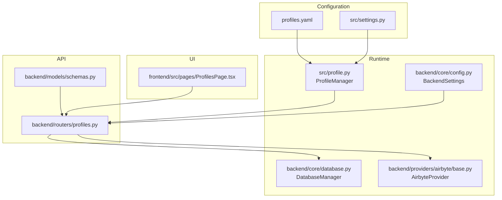
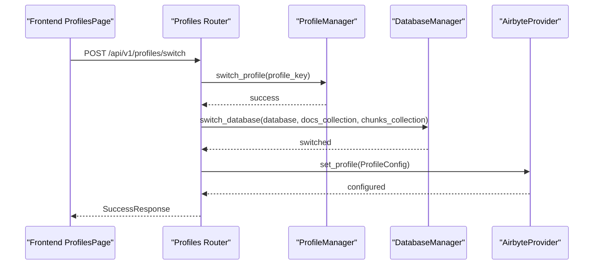
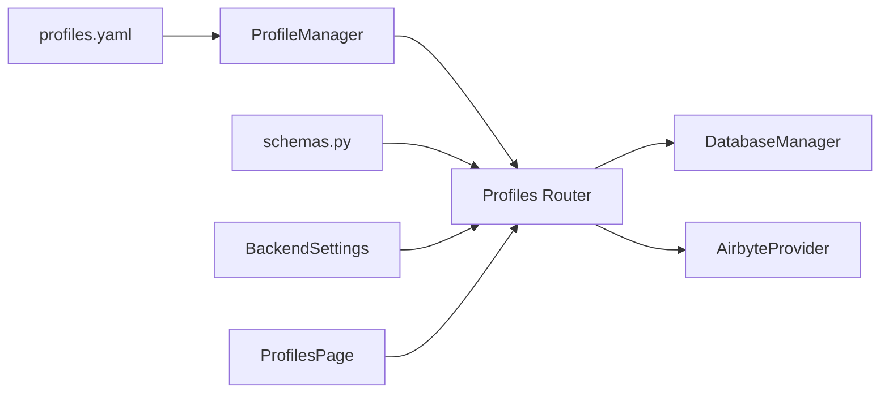

# Multi-Profile Management

<cite>
**Referenced Files in This Document**
- [profiles.yaml](file://profiles.yaml)
- [src/profile.py](file://src/profile.py)
- [backend/routers/profiles.py](file://backend/routers/profiles.py)
- [backend/core/config.py](file://backend/core/config.py)
- [backend/core/database.py](file://backend/core/database.py)
- [backend/models/schemas.py](file://backend/models/schemas.py)
- [src/settings.py](file://src/settings.py)
- [backend/providers/airbyte/base.py](file://backend/providers/airbyte/base.py)
- [frontend/src/pages/ProfilesPage.tsx](file://frontend/src/pages/ProfilesPage.tsx)
- [backend/tests/test_profiles.py](file://backend/tests/test_profiles.py)
</cite>

## Table of Contents
1. [Introduction](#introduction)
2. [Project Structure](#project-structure)
3. [Core Components](#core-components)
4. [Architecture Overview](#architecture-overview)
5. [Detailed Component Analysis](#detailed-component-analysis)
6. [Dependency Analysis](#dependency-analysis)
7. [Performance Considerations](#performance-considerations)
8. [Troubleshooting Guide](#troubleshooting-guide)
9. [Conclusion](#conclusion)
10. [Appendices](#appendices)

## Introduction
This document explains multi-profile management in MongoDB-RAG-Agent, focusing on how to define and operate multiple knowledge bases and environments using a central configuration file and runtime APIs. It covers profile activation, database isolation, resource management, collection/index organization, access control, switching, configuration inheritance, environment-specific overrides, best practices for tenants and scaling, backup and migration, performance considerations, and troubleshooting.

## Project Structure
The multi-profile system spans configuration, backend routing, database management, provider integrations, and the frontend UI.

**Diagram sources**
- [profiles.yaml](file://profiles.yaml#L1-L81)
- [src/profile.py](file://src/profile.py#L174-L362)
- [backend/routers/profiles.py](file://backend/routers/profiles.py#L21-L162)
- [backend/core/config.py](file://backend/core/config.py#L9-L219)
- [backend/core/database.py](file://backend/core/database.py#L28-L118)
- [backend/providers/airbyte/base.py](file://backend/providers/airbyte/base.py#L52-L141)
- [backend/models/schemas.py](file://backend/models/schemas.py#L115-L161)
- [frontend/src/pages/ProfilesPage.tsx](file://frontend/src/pages/ProfilesPage.tsx#L1-L604)

**Section sources**
- [profiles.yaml](file://profiles.yaml#L1-L81)
- [src/profile.py](file://src/profile.py#L174-L362)
- [backend/routers/profiles.py](file://backend/routers/profiles.py#L21-L162)
- [backend/core/config.py](file://backend/core/config.py#L9-L219)
- [backend/core/database.py](file://backend/core/database.py#L28-L118)
- [backend/models/schemas.py](file://backend/models/schemas.py#L115-L161)
- [src/settings.py](file://src/settings.py#L16-L156)
- [backend/providers/airbyte/base.py](file://backend/providers/airbyte/base.py#L52-L141)
- [frontend/src/pages/ProfilesPage.tsx](file://frontend/src/pages/ProfilesPage.tsx#L1-L604)

## Core Components
- profiles.yaml: Central configuration for profiles, active profile, and per-profile settings.
- ProfileManager: Loads, validates, persists, and switches profiles; manages cloud sources and Airbyte configuration.
- Profiles API: Exposes endpoints to list, activate, create, update, and delete profiles; enforces access control.
- DatabaseManager: Connects to MongoDB and supports switching databases per profile.
- AirbyteProvider: Integrates Airbyte with profile-aware database selection and collection prefixes.
- Frontend ProfilesPage: UI for listing, activating, creating, editing, and deleting profiles; admin access matrix.

**Section sources**
- [profiles.yaml](file://profiles.yaml#L1-L81)
- [src/profile.py](file://src/profile.py#L174-L362)
- [backend/routers/profiles.py](file://backend/routers/profiles.py#L27-L359)
- [backend/core/database.py](file://backend/core/database.py#L28-L118)
- [backend/providers/airbyte/base.py](file://backend/providers/airbyte/base.py#L52-L141)
- [frontend/src/pages/ProfilesPage.tsx](file://frontend/src/pages/ProfilesPage.tsx#L1-L604)

## Architecture Overview
Profile activation triggers a change in the active profile, which cascades to database selection and provider configuration. The API enforces access control and delegates persistence to the ProfileManager.

**Diagram sources**
- [frontend/src/pages/ProfilesPage.tsx](file://frontend/src/pages/ProfilesPage.tsx#L121-L134)
- [backend/routers/profiles.py](file://backend/routers/profiles.py#L101-L162)
- [src/profile.py](file://src/profile.py#L292-L313)
- [backend/core/database.py](file://backend/core/database.py#L63-L78)
- [backend/providers/airbyte/base.py](file://backend/providers/airbyte/base.py#L127-L141)

## Detailed Component Analysis

### profiles.yaml: Structure and Syntax
- active_profile: Current active profile key.
- profiles: Dictionary of profile configurations.
- Each profile includes:
  - name, description
  - documents_folders: Local document roots for ingestion
  - database: MongoDB database name
  - collection_documents, collection_chunks: Collections for source docs and chunks
  - vector_index, text_index: Search index names
  - Optional overrides: embedding_model, llm_model
  - Optional airbyte: Workspace and destination IDs, default sync modes and schedules
  - Optional cloud_sources: Provider connections with collection_prefix and sync scheduling

Best practices:
- Use distinct databases per profile for tenant isolation.
- Use unique collection names per profile to prevent cross-contamination.
- Use unique vector/text index names per profile if sharing indexes across databases.
- Use collection_prefix for Airbyte-synced data to avoid conflicts.

**Section sources**
- [profiles.yaml](file://profiles.yaml#L1-L81)

### ProfileManager: Loading, Switching, Persistence
Responsibilities:
- Load profiles from YAML; create default if missing.
- Persist changes to YAML.
- Switch active profile and validate existence.
- CRUD operations for profiles and cloud sources.
- Manage Airbyte configuration per profile.

Key behaviors:
- Default fallback to a default profile if active profile is missing.
- Enforce constraints: cannot delete default or active profile.
- Cloud source management supports add/update/remove with validation.

**Section sources**
- [src/profile.py](file://src/profile.py#L174-L362)
- [src/profile.py](file://src/profile.py#L314-L443)
- [src/profile.py](file://src/profile.py#L456-L542)
- [src/profile.py](file://src/profile.py#L643-L707)

### Profiles API: Access Control and Activation
Endpoints:
- GET /api/v1/profiles: List profiles user has access to; includes active profile.
- GET /api/v1/profiles/active: Get active profile.
- POST /api/v1/profiles/switch: Switch active profile; validates access and switches DB.
- POST /api/v1/profiles/create: Admin-only creation.
- PUT /api/v1/profiles/{key}: Admin-only update.
- DELETE /api/v1/profiles/{key}: Admin-only deletion (cannot delete default or active).
- Cloud source endpoints: list/add/update/remove per profile with access checks.
- Airbyte config endpoints: get/update per profile with admin-only update.

Access control:
- Non-admin users can only see profiles they have access to.
- Admin users can manage all profiles and access matrices.

**Section sources**
- [backend/routers/profiles.py](file://backend/routers/profiles.py#L27-L359)
- [backend/routers/profiles.py](file://backend/routers/profiles.py#L364-L732)
- [backend/routers/auth.py](file://backend/routers/auth.py#L538-L650)

### DatabaseManager: Database Switching and Index Checks
- Connects to MongoDB using settings.
- switch_database updates current database and collection names.
- Provides stats and index checks via thread pool to avoid blocking.

Integration with profiles:
- Profiles API calls switch_database when switching profiles.

**Section sources**
- [backend/core/database.py](file://backend/core/database.py#L28-L118)
- [backend/core/database.py](file://backend/core/database.py#L119-L228)
- [backend/routers/profiles.py](file://backend/routers/profiles.py#L138-L144)

### AirbyteProvider: Profile-Aware Sync
- Uses profile.database for MongoDB destination.
- Respects profile.airbyte workspace/destination IDs.
- Applies collection_prefix derived from provider type or configured value.
- On setup, can discover/create destination matching profile’s database.

**Section sources**
- [backend/providers/airbyte/base.py](file://backend/providers/airbyte/base.py#L52-L141)
- [backend/providers/airbyte/base.py](file://backend/providers/airbyte/base.py#L200-L375)

### Frontend ProfilesPage: UI for Profile Management
- Lists accessible profiles and highlights active.
- Allows switching, editing, and deleting (admin).
- Admin-only access matrix to grant/revoke profile access.

**Section sources**
- [frontend/src/pages/ProfilesPage.tsx](file://frontend/src/pages/ProfilesPage.tsx#L1-L604)

### Settings Inheritance and Overrides
- Settings.apply_profile merges profile overrides into base settings.
- Overrides include database, collections, and index names; optional embedding/LLM model overrides.
- load_settings loads base settings, optionally applies active profile.

**Section sources**
- [src/settings.py](file://src/settings.py#L106-L156)
- [src/settings.py](file://src/settings.py#L162-L211)

## Dependency Analysis
- profiles.yaml drives ProfileManager initialization and settings application.
- Profiles API depends on ProfileManager for persistence and access control.
- DatabaseManager is switched by Profiles API upon activation.
- AirbyteProvider consumes profile configuration for database and prefixes.
- Frontend interacts with Profiles API for management and activation.

**Diagram sources**
- [profiles.yaml](file://profiles.yaml#L1-L81)
- [src/profile.py](file://src/profile.py#L174-L362)
- [backend/routers/profiles.py](file://backend/routers/profiles.py#L21-L162)
- [backend/core/database.py](file://backend/core/database.py#L28-L118)
- [backend/providers/airbyte/base.py](file://backend/providers/airbyte/base.py#L52-L141)
- [backend/models/schemas.py](file://backend/models/schemas.py#L115-L161)
- [backend/core/config.py](file://backend/core/config.py#L9-L219)
- [frontend/src/pages/ProfilesPage.tsx](file://frontend/src/pages/ProfilesPage.tsx#L1-L604)

**Section sources**
- [src/profile.py](file://src/profile.py#L174-L362)
- [backend/routers/profiles.py](file://backend/routers/profiles.py#L21-L162)
- [backend/core/database.py](file://backend/core/database.py#L28-L118)
- [backend/providers/airbyte/base.py](file://backend/providers/airbyte/base.py#L52-L141)
- [backend/models/schemas.py](file://backend/models/schemas.py#L115-L161)
- [backend/core/config.py](file://backend/core/config.py#L9-L219)
- [frontend/src/pages/ProfilesPage.tsx](file://frontend/src/pages/ProfilesPage.tsx#L1-L604)

## Performance Considerations
- Separate thread pools for database operations to avoid blocking the event loop.
- Estimated counts and collStats used for lightweight stats; consider caching for frequent polling.
- Index checks use command-based listing; ensure indexes are created in Atlas UI per profile’s index names.
- Airbyte sync scheduling should be tuned per workload; incremental mode reduces overhead.
- Collection prefixes minimize cross-contamination and simplify cleanup.

[No sources needed since this section provides general guidance]

## Troubleshooting Guide
Common issues and resolutions:
- Profile not found during switch: Verify profile key exists and user has access.
- Cannot delete active or default profile: Switch to another profile first.
- Access denied: Non-admin users only see accessible profiles; admin controls access matrix.
- Airbyte not available: Ensure Airbyte is running; provider raises explicit error messages.
- Indexes missing: Create vector and text indexes in Atlas UI for profile’s index names.
- Stats/index checks failing: Confirm database connectivity and that collections exist.

**Section sources**
- [backend/routers/profiles.py](file://backend/routers/profiles.py#L117-L131)
- [backend/routers/profiles.py](file://backend/routers/profiles.py#L224-L242)
- [backend/routers/auth.py](file://backend/routers/auth.py#L538-L650)
- [backend/providers/airbyte/base.py](file://backend/providers/airbyte/base.py#L224-L231)
- [backend/core/database.py](file://backend/core/database.py#L119-L228)
- [backend/tests/test_profiles.py](file://backend/tests/test_profiles.py#L15-L96)

## Conclusion
MongoDB-RAG-Agent’s multi-profile system provides robust tenant isolation, flexible configuration inheritance, and secure access control. By organizing profiles per use case, assigning dedicated databases and collections, leveraging Airbyte with profile-aware destinations, and enforcing access matrices, teams can scale safely while maintaining operational simplicity.

[No sources needed since this section summarizes without analyzing specific files]

## Appendices

### Best Practices for Organizing Profiles
- Use descriptive profile keys and names aligned with business units or projects.
- Assign unique databases per profile for strict tenant isolation.
- Use unique collection names per profile to prevent accidental cross-access.
- Define distinct vector/text index names per profile if reusing indexes across databases.
- Employ collection_prefix for Airbyte-synced data to avoid collisions.
- Store sensitive Airbyte workspace/destination IDs in profile airbyte config for isolation.

**Section sources**
- [profiles.yaml](file://profiles.yaml#L1-L81)
- [src/profile.py](file://src/profile.py#L70-L88)
- [backend/providers/airbyte/base.py](file://backend/providers/airbyte/base.py#L259-L295)

### Database Isolation Strategies
- Each profile targets a separate MongoDB database.
- Profiles API switches DatabaseManager to the new database upon activation.
- AirbyteProvider writes to profile.database with optional collection_prefix.

**Section sources**
- [backend/routers/profiles.py](file://backend/routers/profiles.py#L138-L144)
- [backend/core/database.py](file://backend/core/database.py#L63-L78)
- [backend/providers/airbyte/base.py](file://backend/providers/airbyte/base.py#L93-L106)

### Resource Management Across Profiles
- Thread pool for DB operations prevents contention.
- Airbyte resources (source/destination/connection) are managed per profile; provider can reuse or create as needed.
- Frontend ProfilesPage allows admin-managed access to profiles.

**Section sources**
- [backend/core/database.py](file://backend/core/database.py#L15-L26)
- [backend/providers/airbyte/base.py](file://backend/providers/airbyte/base.py#L392-L415)
- [frontend/src/pages/ProfilesPage.tsx](file://frontend/src/pages/ProfilesPage.tsx#L362-L448)

### Collection Organization and Index Management
- Documents and chunks collections are configurable per profile.
- Vector and text indexes are configurable per profile; ensure they exist in Atlas UI.
- Hybrid search uses both indexes as configured.

**Section sources**
- [profiles.yaml](file://profiles.yaml#L8-L12)
- [backend/routers/search.py](file://backend/routers/search.py#L247-L274)
- [backend/agent/federated_search.py](file://backend/agent/federated_search.py#L222-L230)

### Access Control Per Profile
- Non-admin users only see accessible profiles.
- Admins can grant/revoke access via access matrix.
- Profiles API enforces access checks on all profile operations.

**Section sources**
- [backend/routers/profiles.py](file://backend/routers/profiles.py#L39-L67)
- [backend/routers/auth.py](file://backend/routers/auth.py#L538-L650)

### Profile Switching Workflow
- Frontend triggers switch endpoint.
- Backend validates access, switches active profile, updates DB connection, and configures providers.

**Section sources**
- [frontend/src/pages/ProfilesPage.tsx](file://frontend/src/pages/ProfilesPage.tsx#L121-L134)
- [backend/routers/profiles.py](file://backend/routers/profiles.py#L101-L162)

### Configuration Inheritance and Environment Overrides
- Base settings loaded from environment and .env.
- Active profile overrides database/collections/indexes; optional embedding/LLM model overrides.
- Environment variable can override active profile.

**Section sources**
- [src/settings.py](file://src/settings.py#L162-L211)
- [src/settings.py](file://src/settings.py#L106-L156)
- [backend/core/config.py](file://backend/core/config.py#L103-L105)

### Backup and Migration Procedures
- Back up profiles.yaml to preserve profile definitions and active profile.
- For migrations, export/import MongoDB collections per profile database; verify indexes exist.
- When renaming profiles, update references in UI and ensure access matrix remains intact.

[No sources needed since this section provides general guidance]

### Scaling Strategies
- Horizontal scaling: Run multiple API instances behind a load balancer; ensure shared MongoDB and consistent profiles.yaml.
- Vertical scaling: Increase workers and tune thread pools for DB operations.
- Airbyte scaling: Use scheduled syncs and incremental mode; monitor job queues.

[No sources needed since this section provides general guidance]