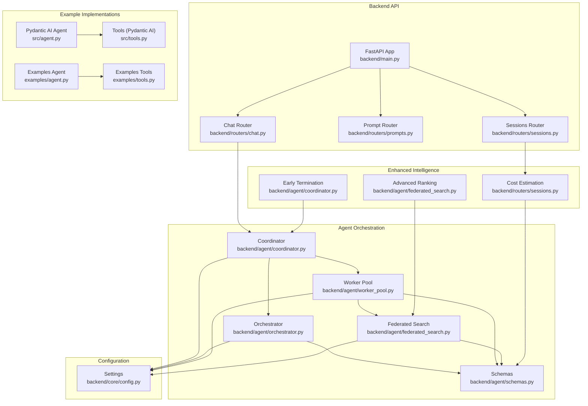
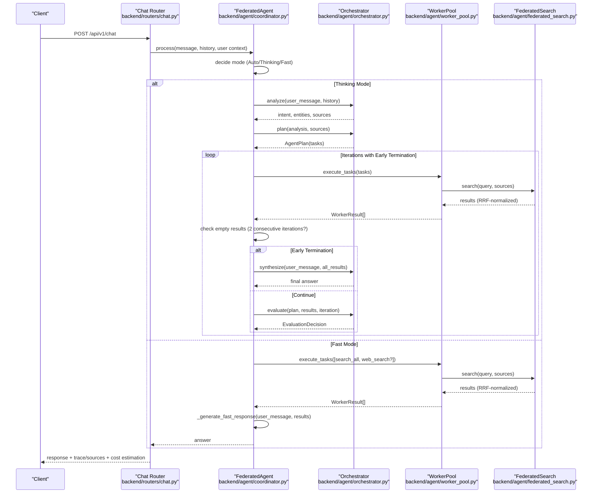
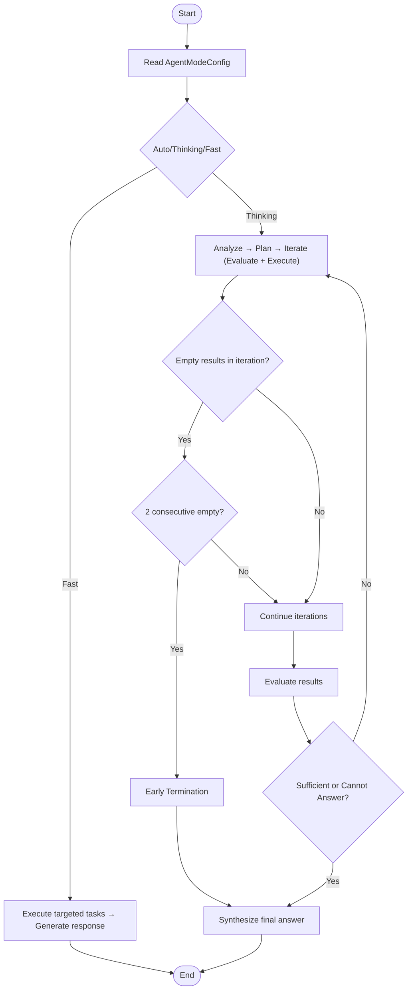
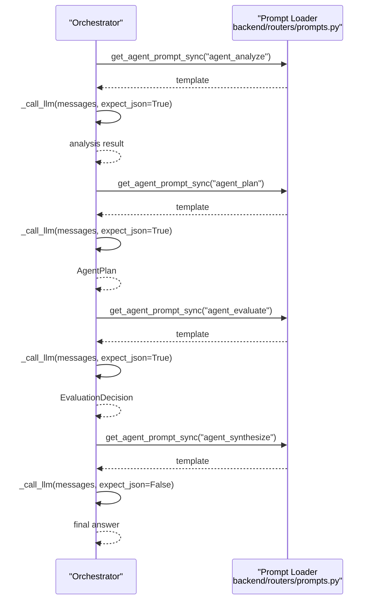
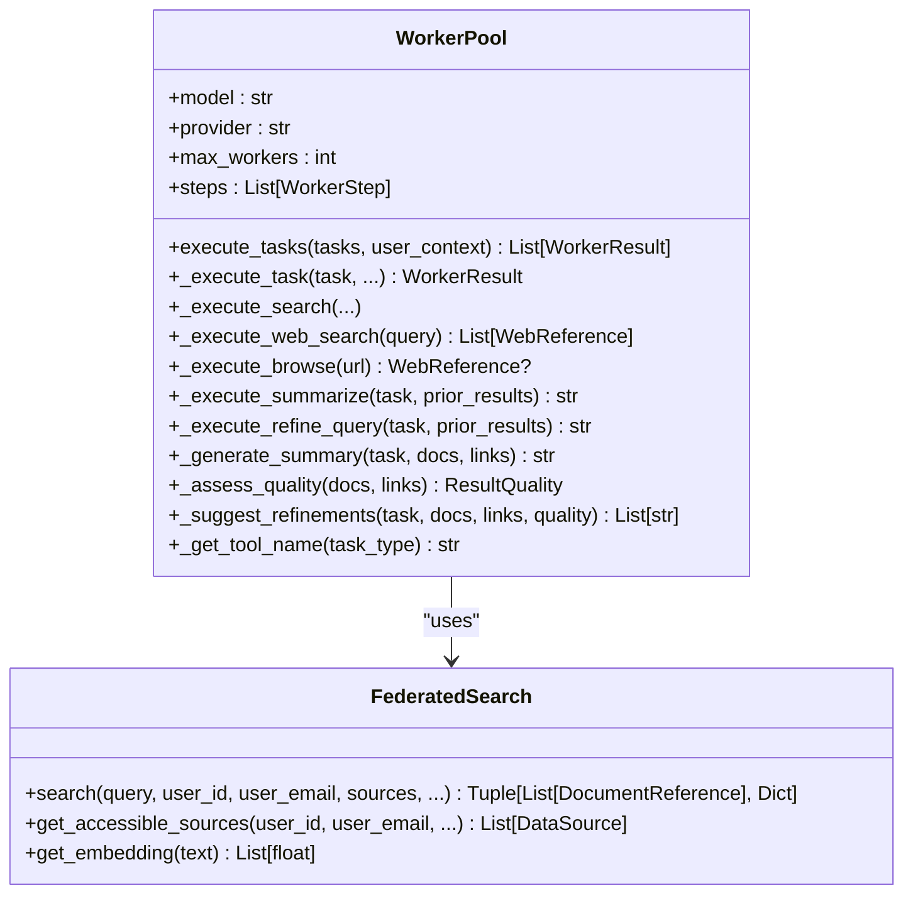
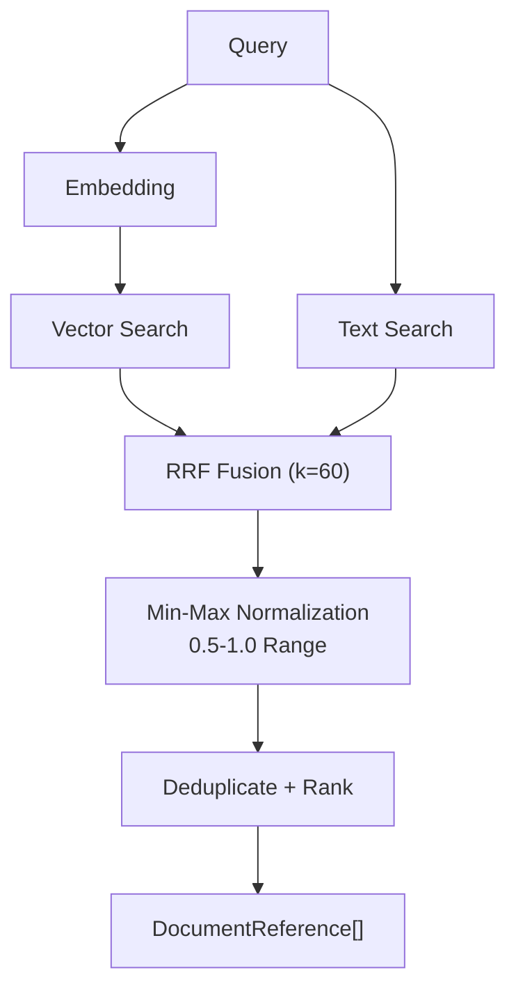
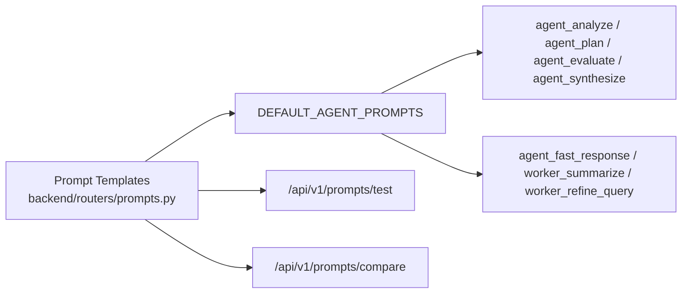
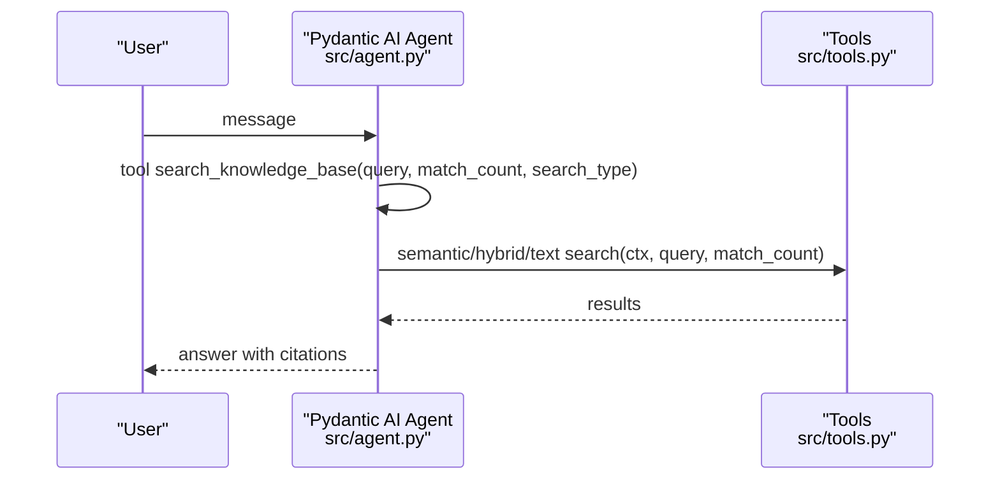
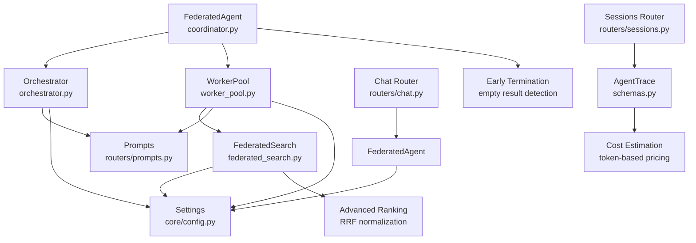

# Conversational AI Agent

<cite>
**Referenced Files in This Document**
- [backend/main.py](file://backend/main.py)
- [backend/agent/coordinator.py](file://backend/agent/coordinator.py)
- [backend/agent/orchestrator.py](file://backend/agent/orchestrator.py)
- [backend/agent/federated_search.py](file://backend/agent/federated_search.py)
- [backend/agent/worker_pool.py](file://backend/agent/worker_pool.py)
- [backend/agent/schemas.py](file://backend/agent/schemas.py)
- [backend/routers/chat.py](file://backend/routers/chat.py)
- [backend/routers/prompts.py](file://backend/routers/prompts.py)
- [backend/core/config.py](file://backend/core/config.py)
- [backend/routers/sessions.py](file://backend/routers/sessions.py)
- [src/agent.py](file://src/agent.py)
- [src/tools.py](file://src/tools.py)
- [examples/agent.py](file://examples/agent.py)
- [examples/tools.py](file://examples/tools.py)
</cite>

## Update Summary
**Changes Made**
- Added intelligent early termination capabilities with 2-consecutive-iteration detection
- Enhanced RRF score normalization with sophisticated min-max scaling (0.5-1.0 range)
- Implemented comprehensive cost estimation with token-based pricing calculations
- Updated execution modes with improved decision-making algorithms
- Enhanced ranking algorithms with advanced score normalization techniques

## Table of Contents
1. [Introduction](#introduction)
2. [Project Structure](#project-structure)
3. [Core Components](#core-components)
4. [Architecture Overview](#architecture-overview)
5. [Detailed Component Analysis](#detailed-component-analysis)
6. [Enhanced Intelligence Features](#enhanced-intelligence-features)
7. [Dependency Analysis](#dependency-analysis)
8. [Performance Considerations](#performance-considerations)
9. [Troubleshooting Guide](#troubleshooting-guide)
10. [Conclusion](#conclusion)
11. [Appendices](#appendices)

## Introduction
This document describes the conversational AI agent system built with a federated architecture and an orchestrator-worker design. The system integrates:
- A high-level orchestrator that reasons about user intent, plans multi-step actions, evaluates results, and synthesizes final answers
- A worker pool that executes tasks in parallel using fast models and tools
- A federated search layer that spans multiple data sources (profile, cloud, personal) with access control
- **Enhanced Intelligence Features**: Intelligent early termination, sophisticated ranking algorithms, and cost estimation capabilities
- A prompt management system enabling dynamic system prompts and tool schemas
- Configuration for model selection, execution modes (Auto, Thinking, Fast), and performance tuning

The agent supports both Pydantic AI-based implementations and a FastAPI-based orchestration flow with streaming responses and tool calling.

## Project Structure
The repository organizes the agent system across backend orchestration, frontend UI, ingestion, and example implementations:
- Backend orchestration: agent orchestrator, worker pool, federated search, and schemas
- API surface: chat router, prompt management, and system endpoints
- Configuration: centralized settings for models, providers, and search parameters
- **Enhanced Intelligence**: cost estimation, early termination, and sophisticated ranking
- Example implementations: Pydantic AI agent and tools for semantic/text/hybrid search

**Diagram sources**
- [backend/main.py](file://backend/main.py#L208-L532)
- [backend/routers/chat.py](file://backend/routers/chat.py#L1-L734)
- [backend/routers/prompts.py](file://backend/routers/prompts.py#L1-L953)
- [backend/routers/sessions.py](file://backend/routers/sessions.py#L1-L1371)
- [backend/agent/coordinator.py](file://backend/agent/coordinator.py#L29-L454)
- [backend/agent/orchestrator.py](file://backend/agent/orchestrator.py#L35-L428)
- [backend/agent/worker_pool.py](file://backend/agent/worker_pool.py#L28-L658)
- [backend/agent/federated_search.py](file://backend/agent/federated_search.py#L26-L560)
- [backend/agent/schemas.py](file://backend/agent/schemas.py#L10-L434)
- [backend/core/config.py](file://backend/core/config.py#L9-L219)
- [src/agent.py](file://src/agent.py#L1-L97)
- [src/tools.py](file://src/tools.py#L1-L403)
- [examples/agent.py](file://examples/agent.py#L1-L133)
- [examples/tools.py](file://examples/tools.py#L1-L150)

**Section sources**
- [backend/main.py](file://backend/main.py#L208-L532)
- [backend/agent/coordinator.py](file://backend/agent/coordinator.py#L29-L454)
- [backend/agent/orchestrator.py](file://backend/agent/orchestrator.py#L35-L428)
- [backend/agent/worker_pool.py](file://backend/agent/worker_pool.py#L28-L658)
- [backend/agent/federated_search.py](file://backend/agent/federated_search.py#L26-L560)
- [backend/agent/schemas.py](file://backend/agent/schemas.py#L10-L434)
- [backend/routers/chat.py](file://backend/routers/chat.py#L1-L734)
- [backend/routers/prompts.py](file://backend/routers/prompts.py#L1-L953)
- [backend/routers/sessions.py](file://backend/routers/sessions.py#L1-L1371)
- [backend/core/config.py](file://backend/core/config.py#L9-L219)
- [src/agent.py](file://src/agent.py#L1-L97)
- [src/tools.py](file://src/tools.py#L1-L403)
- [examples/agent.py](file://examples/agent.py#L1-L133)
- [examples/tools.py](file://examples/tools.py#L1-L150)

## Core Components
- **FederatedAgent**: Main coordinator that selects execution mode, orchestrates planning and evaluation, manages tracing, and implements intelligent early termination
- **Orchestrator**: High-level reasoning model that analyzes intent, creates plans, evaluates results, and synthesizes answers
- **WorkerPool**: Parallel executor of tasks (search, web search, browsing, summarization, query refinement)
- **FederatedSearch**: Cross-database search with access control and hybrid search (vector + text) using enhanced RRF with sophisticated score normalization
- **Schemas**: Typed models for tasks, results, traces, execution modes, and comprehensive cost estimation
- **Prompt Management**: Templates for agent phases and worker tasks, with versioning and testing
- **Configuration**: Centralized settings for models, providers, embeddings, and search parameters

Key execution modes:
- **Auto**: Heuristic-driven selection between Thinking and Fast based on query complexity
- **Thinking**: Full orchestrator-worker iterative loop with planning and evaluation, including intelligent early termination
- **Fast**: Direct single-model response with optional web search

**Section sources**
- [backend/agent/coordinator.py](file://backend/agent/coordinator.py#L29-L454)
- [backend/agent/orchestrator.py](file://backend/agent/orchestrator.py#L35-L428)
- [backend/agent/worker_pool.py](file://backend/agent/worker_pool.py#L28-L658)
- [backend/agent/federated_search.py](file://backend/agent/federated_search.py#L26-L560)
- [backend/agent/schemas.py](file://backend/agent/schemas.py#L56-L434)
- [backend/routers/prompts.py](file://backend/routers/prompts.py#L512-L704)
- [backend/core/config.py](file://backend/core/config.py#L63-L101)

## Architecture Overview
The system follows a federated, orchestrator-worker pattern with enhanced intelligence features:
- **FederatedAgent** decides mode and coordinates the lifecycle with intelligent early termination
- **Orchestrator** defines phases: Analyze → Plan → Evaluate → Synthesize
- **WorkerPool** executes tasks in parallel, aggregates results, and records steps
- **FederatedSearch** queries multiple data sources with access control and hybrid search using sophisticated RRF normalization
- **Prompts** are dynamically loaded for each phase and worker task
- **Configuration** controls models, providers, and performance parameters
- **Cost Estimation** tracks token usage and calculates pricing for transparent cost management

**Diagram sources**
- [backend/routers/chat.py](file://backend/routers/chat.py#L634-L698)
- [backend/agent/coordinator.py](file://backend/agent/coordinator.py#L83-L144)
- [backend/agent/orchestrator.py](file://backend/agent/orchestrator.py#L161-L396)
- [backend/agent/worker_pool.py](file://backend/agent/worker_pool.py#L89-L157)
- [backend/agent/federated_search.py](file://backend/agent/federated_search.py#L313-L463)

## Detailed Component Analysis

### FederatedAgent and Enhanced Execution Modes
- Determines mode using AgentModeConfig.should_use_thinking based on query characteristics and thresholds
- **Intelligent Early Termination**: Implements 2-consecutive-iteration empty results detection to prevent wasted computation
- In Thinking mode: orchestrates multi-phase planning and iterative evaluation with early termination capability
- In Fast mode: executes targeted tasks and generates a direct response

**Diagram sources**
- [backend/agent/coordinator.py](file://backend/agent/coordinator.py#L205-L264)
- [backend/agent/schemas.py](file://backend/agent/schemas.py#L354-L390)

**Section sources**
- [backend/agent/coordinator.py](file://backend/agent/coordinator.py#L29-L264)
- [backend/agent/schemas.py](file://backend/agent/schemas.py#L354-L390)

### Orchestrator Phases
- Analyze: Parses user intent, entities, and required sources from conversation history
- Plan: Builds AgentPlan with tasks, priorities, and dependencies
- Evaluate: Summarizes results, identifies gaps, and decides continuation
- Synthesize: Produces final answer from consolidated results

**Diagram sources**
- [backend/agent/orchestrator.py](file://backend/agent/orchestrator.py#L75-L160)
- [backend/routers/prompts.py](file://backend/routers/prompts.py#L512-L704)

**Section sources**
- [backend/agent/orchestrator.py](file://backend/agent/orchestrator.py#L161-L404)
- [backend/routers/prompts.py](file://backend/routers/prompts.py#L512-L704)

### WorkerPool and Tool Execution
- Executes tasks respecting dependencies and parallelism limits
- Supports semantic_search, text_search, hybrid_search, web_search, browse_web, summarize, refine_query
- Records WorkerStep for each tool call and quality assessment

**Diagram sources**
- [backend/agent/worker_pool.py](file://backend/agent/worker_pool.py#L28-L658)
- [backend/agent/federated_search.py](file://backend/agent/federated_search.py#L26-L560)

**Section sources**
- [backend/agent/worker_pool.py](file://backend/agent/worker_pool.py#L89-L658)
- [backend/agent/federated_search.py](file://backend/agent/federated_search.py#L313-L463)

### FederatedSearch and Advanced Hybrid Search
- Access control: profile, cloud shared/private, personal databases
- **Enhanced Hybrid Search**: vector + text with sophisticated RRF fusion and min-max normalization (0.5-1.0 range)
- Quality assessment and metadata enrichment

**Diagram sources**
- [backend/agent/federated_search.py](file://backend/agent/federated_search.py#L273-L336)

**Section sources**
- [backend/agent/federated_search.py](file://backend/agent/federated_search.py#L141-L492)

### Prompt Engineering and System Prompts
- Default agent prompts for analyze, plan, evaluate, synthesize, fast response, summarize, and refine query
- Prompt templates support versioning, activation, and testing
- Tool schemas enable function-calling with OpenAI-compatible format

**Diagram sources**
- [backend/routers/prompts.py](file://backend/routers/prompts.py#L512-L704)
- [backend/routers/prompts.py](file://backend/routers/prompts.py#L354-L507)

**Section sources**
- [backend/routers/prompts.py](file://backend/routers/prompts.py#L512-L704)
- [backend/routers/prompts.py](file://backend/routers/prompts.py#L354-L507)

### Pydantic AI Agent Implementation
- Minimal shared state with a Pydantic AI agent
- Tool wrappers for semantic_search, hybrid_search, text_search
- Dynamic instructions and system prompt injection

**Diagram sources**
- [src/agent.py](file://src/agent.py#L20-L97)
- [src/tools.py](file://src/tools.py#L27-L403)

**Section sources**
- [src/agent.py](file://src/agent.py#L1-L97)
- [src/tools.py](file://src/tools.py#L1-L403)
- [examples/agent.py](file://examples/agent.py#L1-L133)
- [examples/tools.py](file://examples/tools.py#L1-L150)

## Enhanced Intelligence Features

### Intelligent Early Termination
The system now implements intelligent early termination to prevent wasted computational resources when search queries consistently fail to return results. The mechanism monitors consecutive iterations with empty results and terminates the orchestration process after 2 consecutive empty iterations.

**Key Features:**
- Tracks empty result iterations using `empty_result_iterations` counter
- Terminates after 2 consecutive iterations with no documents or web links found
- Preserves computational resources and reduces latency
- Maintains decision-making flexibility for complex queries

**Implementation Details:**
- Monitors `iteration_docs` and `iteration_links` counts in the execution loop
- Resets counter when results are found in subsequent iterations
- Logs termination events for debugging and monitoring

**Section sources**
- [backend/agent/coordinator.py](file://backend/agent/coordinator.py#L205-L264)

### Sophisticated Ranking Algorithms with RRF Score Normalization
The hybrid search implementation now features advanced ranking algorithms with sophisticated score normalization to ensure consistent and meaningful result ordering.

**Enhanced RRF Implementation:**
- **Min-Max Normalization**: Scales RRF scores to a 0.5-1.0 range for better relative scoring
- **Preserves Original Similarity**: Maintains vector similarity scores for reference
- **Robust Edge Cases**: Handles identical scores with original similarity fallback
- **Optimal Score Distribution**: Ensures all results have meaningful relevance scores

**Normalization Process:**
1. Calculate raw RRF scores using standard formula: `1/(k + rank)`
2. Compute min and max scores across all results
3. Apply min-max normalization: `(score - min)/(max - min) * 0.5 + 0.5`
4. Scale to 0.5-1.0 range for consistent relevance interpretation

**Section sources**
- [backend/agent/federated_search.py](file://backend/agent/federated_search.py#L273-L336)

### Cost Estimation Capabilities
The system now provides comprehensive cost estimation and tracking for transparent pricing management.

**Token-Based Pricing System:**
- **Model Pricing Database**: Comprehensive pricing for GPT-5, GPT-4, Claude, and Gemini models
- **Token Usage Tracking**: Accurate tracking of input, output, and total tokens consumed
- **Cost Calculation**: Real-time cost estimation based on token usage and model rates
- **Session Statistics**: Aggregated cost tracking across chat sessions

**Pricing Features:**
- **Per-Model Pricing**: Detailed pricing per million tokens for input and output
- **Prefix Matching**: Automatic model identification using partial model name matching
- **Fallback Pricing**: Default pricing for unknown models
- **Cost Estimation**: Real-time cost calculation during execution

**Implementation Details:**
- **PRICING Dictionary**: Centralized model pricing configuration
- **calculate_cost()**: Token-based cost calculation function
- **estimated_cost_usd**: Final cost estimation in the AgentTrace model
- **Session-level Tracking**: Cost aggregation across multiple messages

**Section sources**
- [backend/routers/sessions.py](file://backend/routers/sessions.py#L27-L74)
- [backend/agent/schemas.py](file://backend/agent/schemas.py#L276-L316)

## Dependency Analysis
- Orchestrator depends on prompt templates and LiteLLM for model calls
- WorkerPool depends on FederatedSearch and HTTP client for web operations
- FederatedAgent composes Orchestrator and WorkerPool with configuration and implements early termination
- Chat router integrates the orchestration flow and exposes streaming responses
- **Enhanced Intelligence**: Sessions router provides cost estimation and tracking
- Configuration centralizes provider keys, model names, and search parameters

**Diagram sources**
- [backend/agent/coordinator.py](file://backend/agent/coordinator.py#L29-L60)
- [backend/agent/orchestrator.py](file://backend/agent/orchestrator.py#L22-L25)
- [backend/agent/worker_pool.py](file://backend/agent/worker_pool.py#L21-L23)
- [backend/agent/federated_search.py](file://backend/agent/federated_search.py#L21-L22)
- [backend/routers/prompts.py](file://backend/routers/prompts.py#L25-L30)
- [backend/routers/sessions.py](file://backend/routers/sessions.py#L25-L54)
- [backend/agent/schemas.py](file://backend/agent/schemas.py#L242-L246)
- [backend/core/config.py](file://backend/core/config.py#L218-L219)
- [backend/routers/chat.py](file://backend/routers/chat.py#L12-L13)

**Section sources**
- [backend/agent/coordinator.py](file://backend/agent/coordinator.py#L29-L60)
- [backend/agent/orchestrator.py](file://backend/agent/orchestrator.py#L22-L25)
- [backend/agent/worker_pool.py](file://backend/agent/worker_pool.py#L21-L23)
- [backend/agent/federated_search.py](file://backend/agent/federated_search.py#L21-L22)
- [backend/routers/prompts.py](file://backend/routers/prompts.py#L25-L30)
- [backend/routers/sessions.py](file://backend/routers/sessions.py#L25-L54)
- [backend/agent/schemas.py](file://backend/agent/schemas.py#L242-L246)
- [backend/core/config.py](file://backend/core/config.py#L218-L219)
- [backend/routers/chat.py](file://backend/routers/chat.py#L12-L13)

## Performance Considerations
- **Parallel worker execution**: adjust agent_parallel_workers and max_workers for throughput
- **Hybrid search**: tune match_count and leverage enhanced RRF fusion with sophisticated normalization for balanced retrieval
- **Provider prefixes**: ensure correct model strings for LiteLLM (gemini/, anthropic/, ollama/)
- **Token budgets**: monitor tokens per phase and optimize prompt lengths with cost estimation
- **Timeout middleware**: request timeouts prevent resource starvation
- **Thread pool sizing**: increased workers improve async concurrency
- **Early termination**: prevents wasted computation on ineffective queries
- **Cost optimization**: track and optimize token usage for cost-effective operations

## Troubleshooting Guide
Common issues and resolutions:
- Missing API keys: verify provider keys in settings and per-provider getters
- Vector/text index errors: ensure MongoDB Atlas indexes exist for vector and text search
- Web search failures: confirm Brave API key and network connectivity
- Circular dependencies in tasks: WorkerPool detects and breaks cycles
- Prompt template errors: use prompt compare/test endpoints to validate versions
- **Cost calculation issues**: verify model pricing configuration and token tracking
- **Early termination false positives**: adjust empty result detection thresholds if needed
- **Ranking quality concerns**: review RRF normalization parameters and score thresholds

**Section sources**
- [backend/core/config.py](file://backend/core/config.py#L140-L176)
- [backend/agent/worker_pool.py](file://backend/agent/worker_pool.py#L118-L125)
- [backend/routers/prompts.py](file://backend/routers/prompts.py#L443-L507)
- [backend/routers/sessions.py](file://backend/routers/sessions.py#L57-L74)

## Conclusion
The conversational AI agent system combines a robust federated architecture with an orchestrator-worker design to deliver adaptive, multi-modal responses. Through configurable execution modes, dynamic prompts, and hybrid search, it balances depth of reasoning with speed of delivery. The enhanced intelligence features including intelligent early termination, sophisticated ranking algorithms with RRF score normalization, and comprehensive cost estimation capabilities provide significant improvements in efficiency, quality, and transparency. The modular components and centralized configuration enable easy tuning and extension for diverse use cases.

## Appendices

### Configuration Options
- **Model selection**: orchestrator_model, worker_model, fast_llm_model
- **Providers**: orchestrator_provider, worker_provider, fast_llm_provider
- **Search parameters**: default_match_count, max_match_count, text_weight
- **Agent behavior**: agent_mode, agent_max_iterations, agent_parallel_workers
- **Web search**: brave_search_api_key
- **Early termination**: auto_thinking_threshold (query length threshold)
- **Cost estimation**: comprehensive model pricing database

**Section sources**
- [backend/core/config.py](file://backend/core/config.py#L63-L101)
- [backend/core/config.py](file://backend/core/config.py#L134-L143)
- [backend/agent/schemas.py](file://backend/agent/schemas.py#L407-L433)
- [backend/routers/sessions.py](file://backend/routers/sessions.py#L27-L54)

### Execution Modes Reference
- **Auto**: heuristic-based switching between Thinking and Fast
- **Thinking**: multi-phase orchestration with iterative evaluation and intelligent early termination
- **Fast**: direct response with optional web search

**Section sources**
- [backend/agent/schemas.py](file://backend/agent/schemas.py#L56-L61)
- [backend/agent/schemas.py](file://backend/agent/schemas.py#L368-L390)

### Tool Capabilities
- **semantic_search**: vector similarity search
- **text_search**: Atlas text search with fuzzy matching
- **hybrid_search**: RRF-fused vector + text results with advanced normalization
- **web_search**: Brave Search API
- **browse_web**: HTTP fetch and content extraction
- **summarize**: LLM-based synthesis of prior results
- **refine_query**: LLM-guided query improvement

**Section sources**
- [src/tools.py](file://src/tools.py#L27-L403)
- [backend/agent/worker_pool.py](file://backend/agent/worker_pool.py#L316-L511)

### Practical Examples
- **Agent conversations**: see chat router usage and trace outputs
- **Tool usage patterns**: observe tool calls in generate_response and WorkerStep recordings
- **Response generation**: final synthesis from consolidated results
- **Cost tracking**: monitor token usage and cost estimation in session responses

**Section sources**
- [backend/routers/chat.py](file://backend/routers/chat.py#L634-L698)
- [backend/agent/worker_pool.py](file://backend/agent/worker_pool.py#L254-L270)
- [backend/agent/orchestrator.py](file://backend/agent/orchestrator.py#L344-L404)
- [backend/routers/sessions.py](file://backend/routers/sessions.py#L1200-L1250)