# Core Features

<cite>
**Referenced Files in This Document**
- [backend/main.py](file://backend/main.py)
- [backend/routers/search.py](file://backend/routers/search.py)
- [backend/routers/chat.py](file://backend/routers/chat.py)
- [backend/agent/coordinator.py](file://backend/agent/coordinator.py)
- [backend/agent/federated_search.py](file://backend/agent/federated_search.py)
- [backend/core/config.py](file://backend/core/config.py)
- [backend/core/database.py](file://backend/core/database.py)
- [backend/routers/ingestion.py](file://backend/routers/ingestion.py)
- [backend/routers/ingestion_queue.py](file://backend/routers/ingestion_queue.py)
- [backend/workers/ingestion_worker.py](file://backend/workers/ingestion_worker.py)
- [backend/workers/sync_worker.py](file://backend/workers/sync_worker.py)
- [backend/services/backup_service.py](file://backend/services/backup_service.py)
- [src/ingestion/chunker.py](file://src/ingestion/chunker.py)
- [src/ingestion/embedder.py](file://src/ingestion/embedder.py)
- [src/ingestion/ingest.py](file://src/ingestion/ingest.py)
- [examples/docling_basics/04_hybrid_chunking.py](file://examples/docling_basics/04_hybrid_chunking.py)
- [examples/docling_basics/02_multiple_formats.py](file://examples/docling_basics/02_multiple_formats.py)
- [examples/docling_basics/03_audio_transcription.py](file://examples/docling_basics/03_audio_transcription.py)
- [frontend/src/pages/SearchPage.tsx](file://frontend/src/pages/SearchPage.tsx)
- [frontend/src/pages/ChatPage.tsx](file://frontend/src/pages/ChatPage.tsx)
</cite>

## Update Summary
**Changes Made**
- Added comprehensive documentation for the new ingestion worker architecture with standalone processing
- Enhanced backup integration documentation with post-ingestion backup automation
- Expanded multi-format ingestion capabilities documentation with selective processing filters
- Updated cloud source sync worker documentation for automated cloud file processing
- Added detailed coverage of queue management and scheduling capabilities

## Table of Contents
1. [Introduction](#introduction)
2. [Project Structure](#project-structure)
3. [Core Components](#core-components)
4. [Architecture Overview](#architecture-overview)
5. [Detailed Component Analysis](#detailed-component-analysis)
6. [Enhanced Document Processing Pipeline](#enhanced-document-processing-pipeline)
7. [Backup Integration and Management](#backup-integration-and-management)
8. [Cloud Source Sync Capabilities](#cloud-source-sync-capabilities)
9. [Queue Management and Scheduling](#queue-management-and-scheduling)
10. [Dependency Analysis](#dependency-analysis)
11. [Performance Considerations](#performance-considerations)
12. [Troubleshooting Guide](#troubleshooting-guide)
13. [Conclusion](#conclusion)
14. [Appendices](#appendices)

## Introduction
This document explains the core features of MongoDB-RAG-Agent with a focus on:
- Hybrid search combining semantic vector search and full-text keyword search via Reciprocal Rank Fusion (RRF)
- Intelligent document chunking powered by Docling's HybridChunker to preserve structure and semantics
- Conversational AI with a federated agent system supporting multiple LLM providers
- Multi-format document ingestion covering PDF, Word, PowerPoint, Excel, HTML, Markdown, images, and audio with Docling and Whisper
- **Enhanced document processing pipeline with new ingestion worker architecture for standalone processing**
- **Improved backup integration with post-ingestion backup automation**
- **Expanded multi-format ingestion capabilities with selective processing filters**
- **Cloud source sync worker for automated cloud file processing**
- **Queue management and scheduling for ingestion operations**
- **Cost-effective deployment entirely on MongoDB Atlas free tier**

Each feature is grounded in the repository's implementation and includes practical usage patterns and diagrams to illustrate workflows.

## Project Structure
The system is organized around a FastAPI backend, enhanced ingestion pipeline with worker architecture, agent orchestration, and a React frontend. Key areas:
- Backend API: routers for search, chat, ingestion, ingestion queue, and system management
- Agent system: federated search, orchestrator, and worker pool
- Enhanced ingestion pipeline: Docling-based chunking, embedding generation, and worker-based processing
- Cloud source sync: Automated processing of files from cloud providers
- Backup service: Comprehensive backup and restore capabilities
- Frontend: interactive search and chat experiences

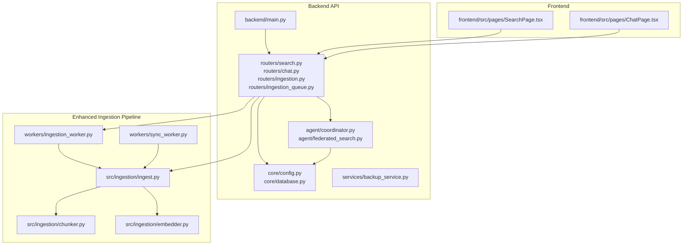

**Diagram sources**
- [backend/main.py:190-497](file://backend/main.py#L190-L497)
- [backend/routers/search.py:1-347](file://backend/routers/search.py#L1-L347)
- [backend/routers/chat.py:1-734](file://backend/routers/chat.py#L1-L734)
- [backend/routers/ingestion.py:1-3273](file://backend/routers/ingestion.py#L1-L3273)
- [backend/routers/ingestion_queue.py:1-897](file://backend/routers/ingestion_queue.py#L1-L897)
- [backend/workers/ingestion_worker.py:1-674](file://backend/workers/ingestion_worker.py#L1-L674)
- [backend/workers/sync_worker.py:1-506](file://backend/workers/sync_worker.py#L1-L506)
- [backend/services/backup_service.py:1-1339](file://backend/services/backup_service.py#L1-L1339)
- [src/ingestion/ingest.py:1-2234](file://src/ingestion/ingest.py#L1-L2234)
- [src/ingestion/chunker.py:1-270](file://src/ingestion/chunker.py#L1-L270)
- [src/ingestion/embedder.py:1-227](file://src/ingestion/embedder.py#L1-L227)
- [frontend/src/pages/SearchPage.tsx:1-158](file://frontend/src/pages/SearchPage.tsx#L1-L158)
- [frontend/src/pages/ChatPage.tsx:1-245](file://frontend/src/pages/ChatPage.tsx#L1-L245)

**Section sources**
- [backend/main.py:190-497](file://backend/main.py#L190-L497)
- [backend/routers/search.py:1-347](file://backend/routers/search.py#L1-L347)
- [backend/routers/chat.py:1-734](file://backend/routers/chat.py#L1-L734)
- [backend/routers/ingestion.py:1-3273](file://backend/routers/ingestion.py#L1-L3273)
- [backend/routers/ingestion_queue.py:1-897](file://backend/routers/ingestion_queue.py#L1-L897)
- [backend/workers/ingestion_worker.py:1-674](file://backend/workers/ingestion_worker.py#L1-L674)
- [backend/workers/sync_worker.py:1-506](file://backend/workers/sync_worker.py#L1-L506)
- [backend/services/backup_service.py:1-1339](file://backend/services/backup_service.py#L1-L1339)
- [src/ingestion/ingest.py:1-2234](file://src/ingestion/ingest.py#L1-L2234)
- [src/ingestion/chunker.py:1-270](file://src/ingestion/chunker.py#L1-L270)
- [src/ingestion/embedder.py:1-227](file://src/ingestion/embedder.py#L1-L227)
- [frontend/src/pages/SearchPage.tsx:1-158](file://frontend/src/pages/SearchPage.tsx#L1-L158)
- [frontend/src/pages/ChatPage.tsx:1-245](file://frontend/src/pages/ChatPage.tsx#L1-L245)

## Core Components
- Hybrid search with RRF: Implements semantic vector search and full-text search, then merges results using reciprocal rank fusion for improved precision and recall.
- Intelligent chunking: Uses Docling HybridChunker to split documents while respecting structure, tokens, and semantic boundaries.
- Federated agent: A multi-tier agent coordinating an orchestrator and worker pool across multiple data sources and LLM providers.
- **Enhanced ingestion pipeline**: Standalone ingestion worker with queue management, selective processing filters, and performance optimization.
- **Cloud source sync**: Automated processing of files from cloud providers with delta sync capabilities.
- **Backup integration**: Comprehensive backup service with post-ingestion automation and restore capabilities.
- Multi-format ingestion: Converts and processes PDF, Word, PowerPoint, Excel, HTML, Markdown, images, and audio with Docling and Whisper.
- Frontend experiences: Interactive search and chat interfaces that integrate with the backend APIs.

**Section sources**
- [backend/routers/search.py:190-347](file://backend/routers/search.py#L190-L347)
- [src/ingestion/chunker.py:68-186](file://src/ingestion/chunker.py#L68-L186)
- [backend/agent/coordinator.py:29-144](file://backend/agent/coordinator.py#L29-L144)
- [backend/routers/ingestion.py:411-653](file://backend/routers/ingestion.py#L411-L653)
- [backend/workers/ingestion_worker.py:60-196](file://backend/workers/ingestion_worker.py#L60-L196)
- [backend/workers/sync_worker.py:44-106](file://backend/workers/sync_worker.py#L44-L106)
- [backend/services/backup_service.py:67-136](file://backend/services/backup_service.py#L67-L136)
- [frontend/src/pages/SearchPage.tsx:1-158](file://frontend/src/pages/SearchPage.tsx#L1-L158)
- [frontend/src/pages/ChatPage.tsx:1-245](file://frontend/src/pages/ChatPage.tsx#L1-L245)

## Architecture Overview
The system integrates enhanced ingestion, search, and conversational AI with a federated agent. MongoDB Atlas stores documents and chunks with vector and text indexes. The backend exposes REST endpoints for search, chat, and ingestion, while the frontend provides user interfaces. The new worker-based architecture ensures API responsiveness during heavy ingestion workloads.

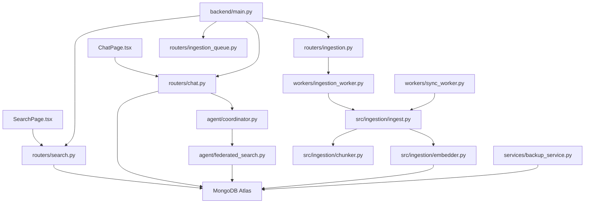

**Diagram sources**
- [backend/main.py:363-466](file://backend/main.py#L363-L466)
- [backend/routers/search.py:34-109](file://backend/routers/search.py#L34-L109)
- [backend/routers/chat.py:634-698](file://backend/routers/chat.py#L634-L698)
- [backend/routers/ingestion.py:656-700](file://backend/routers/ingestion.py#L656-L700)
- [backend/routers/ingestion_queue.py:166-188](file://backend/routers/ingestion_queue.py#L166-L188)
- [backend/workers/ingestion_worker.py:164-196](file://backend/workers/ingestion_worker.py#L164-L196)
- [backend/workers/sync_worker.py:60-86](file://backend/workers/sync_worker.py#L60-L86)
- [backend/services/backup_service.py:288-362](file://backend/services/backup_service.py#L288-L362)
- [src/ingestion/ingest.py:517-621](file://src/ingestion/ingest.py#L517-L621)
- [src/ingestion/chunker.py:102-186](file://src/ingestion/chunker.py#L102-L186)
- [src/ingestion/embedder.py:136-196](file://src/ingestion/embedder.py#L136-L196)

## Detailed Component Analysis

### Hybrid Search with Reciprocal Rank Fusion (RRF)
Hybrid search combines vector and text search results, then ranks them using RRF to balance semantic and lexical matching.

Key implementation highlights:
- Vector search uses MongoDB Atlas Vector Search with a configured index
- Text search uses MongoDB Atlas Search with fuzzy matching
- Results are deduplicated and merged using RRF scoring across both result sets
- The unified endpoint supports semantic, text, and hybrid modes

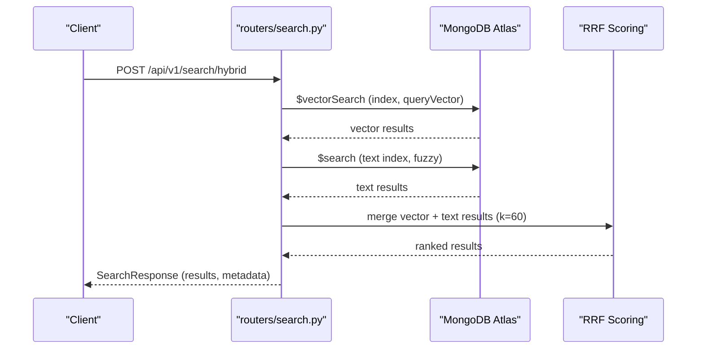

**Diagram sources**
- [backend/routers/search.py:190-331](file://backend/routers/search.py#L190-L331)

Practical usage patterns:
- Use hybrid search for balanced recall and precision
- Adjust match_count to trade off speed vs. comprehensiveness
- Monitor processing_time_ms to tune performance

**Section sources**
- [backend/routers/search.py:190-347](file://backend/routers/search.py#L190-L347)

### Intelligent Document Chunking with Docling HybridChunker
Docling HybridChunker splits documents while preserving structure and respecting token limits. It contextualizes chunks with headings and metadata, improving retrieval quality.

Key implementation highlights:
- Token-aware chunking using a tokenizer
- Respect for document structure (sections, paragraphs, tables)
- Contextualized output with heading hierarchy
- Fallback to simple sliding-window chunking if needed

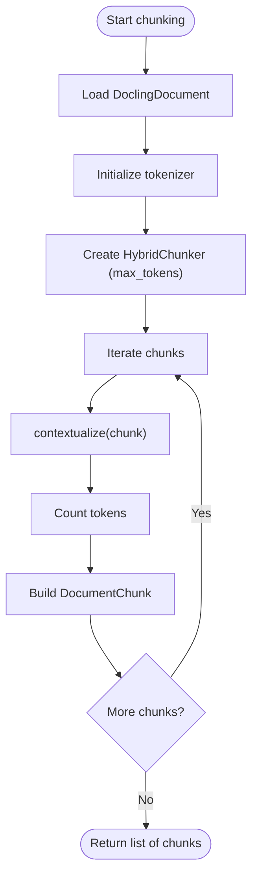

**Diagram sources**
- [src/ingestion/chunker.py:68-186](file://src/ingestion/chunker.py#L68-L186)

Practical usage patterns:
- Use HybridChunker for PDFs, Word docs, and structured content
- Tune max_tokens to match embedding model constraints
- Leverage contextualized chunks for better semantic retrieval

**Section sources**
- [src/ingestion/chunker.py:68-186](file://src/ingestion/chunker.py#L68-L186)
- [examples/docling_basics/04_hybrid_chunking.py:30-124](file://examples/docling_basics/04_hybrid_chunking.py#L30-L124)

### Conversational AI with Federated Agent System
The federated agent coordinates an orchestrator and worker pool across multiple data sources and LLM providers. It supports thinking mode (multi-step planning) and fast mode (direct search + response).

Key implementation highlights:
- Orchestrator analyzes intent, plans tasks, evaluates results, and synthesizes responses
- Worker pool executes tasks in parallel against accessible data sources
- FederatedSearch resolves accessible sources (profile, personal, cloud) and performs hybrid search
- Supports multiple providers via LiteLLM-compatible model strings

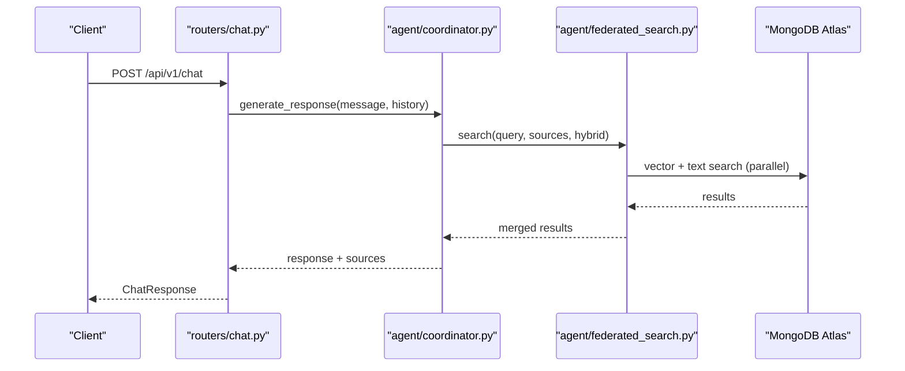

**Diagram sources**
- [backend/routers/chat.py:634-698](file://backend/routers/chat.py#L634-L698)
- [backend/agent/coordinator.py:83-144](file://backend/agent/coordinator.py#L83-L144)
- [backend/agent/federated_search.py:313-463](file://backend/agent/federated_search.py#L313-L463)

Practical usage patterns:
- Use thinking mode for complex, multi-step queries
- Use fast mode for straightforward questions
- Combine knowledge base search with web search and browsing for current information

**Section sources**
- [backend/routers/chat.py:138-632](file://backend/routers/chat.py#L138-L632)
- [backend/agent/coordinator.py:29-144](file://backend/agent/coordinator.py#L29-L144)
- [backend/agent/federated_search.py:61-139](file://backend/agent/federated_search.py#L61-L139)

## Enhanced Document Processing Pipeline

### Standalone Ingestion Worker Architecture
The new ingestion worker provides standalone processing that guarantees API responsiveness during heavy ingestion workloads. It operates independently from the FastAPI backend and manages job lifecycle, progress tracking, and error handling.

Key implementation highlights:
- **Standalone worker process**: Runs separately from the main API to prevent blocking
- **Job queue management**: Handles PENDING, RUNNING, PAUSED, COMPLETED, FAILED, STOPPED, INTERRUPTED, CANCELLED states
- **Progress tracking**: Real-time progress updates with phase tracking and discovery progress
- **Control commands**: Support for STOP, PAUSE, RESUME commands during processing
- **Performance configuration**: Dynamic loading of performance settings from database
- **Offline mode support**: Automatic configuration for offline audio transcription and vision processing

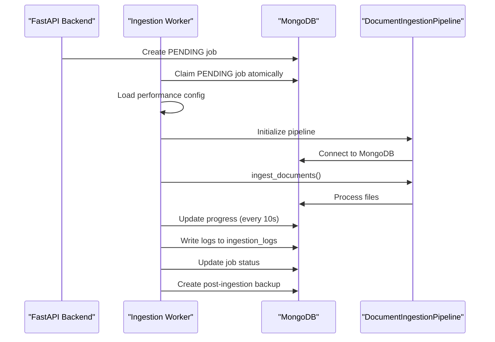

**Diagram sources**
- [backend/workers/ingestion_worker.py:164-196](file://backend/workers/ingestion_worker.py#L164-L196)
- [backend/workers/ingestion_worker.py:261-260](file://backend/workers/ingestion_worker.py#L261-L260)
- [backend/workers/ingestion_worker.py:415-420](file://backend/workers/ingestion_worker.py#L415-L420)

Practical usage patterns:
- **Queue management**: Use `/api/v1/ingestion-queue` endpoints to manage ingestion jobs
- **Performance tuning**: Configure `max_concurrent_files`, `embedding_batch_size`, and `thread_pool_workers` via database
- **Monitoring**: Track job progress through database collections and real-time status endpoints
- **Error handling**: Worker automatically handles interruptions and resumes interrupted jobs on startup

**Section sources**
- [backend/workers/ingestion_worker.py:60-196](file://backend/workers/ingestion_worker.py#L60-L196)
- [backend/workers/ingestion_worker.py:261-520](file://backend/workers/ingestion_worker.py#L261-L520)
- [backend/routers/ingestion_queue.py:166-188](file://backend/routers/ingestion_queue.py#L166-L188)

### Multi-Format Ingestion with Selective Processing
The ingestion pipeline supports comprehensive multi-format processing with advanced filtering capabilities for selective ingestion operations.

Key implementation highlights:
- **Comprehensive format support**: PDF, DOCX, PPTX, XLSX, HTML, Markdown, images (PNG, JPG, GIF, WebP, BMP), audio (MP3, WAV, M4A, FLAC), video (MP4, AVI, MKV, MOV, WebM)
- **Selective processing filters**: retry_image_only_pdfs, retry_timeouts, retry_errors, retry_no_chunks, skip_image_only_pdfs
- **Adaptive timeout management**: Configurable timeouts based on file size and type with retry mechanisms
- **GPU acceleration**: Automatic detection and utilization of CUDA or MPS devices for Docling processing
- **Content-based deduplication**: SHA256 hashing for duplicate detection across files
- **Extended metrics tracking**: Detailed statistics including processing time, file sizes, and classification types

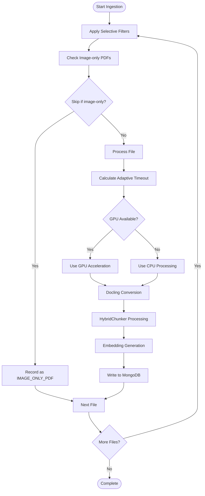

**Diagram sources**
- [src/ingestion/ingest.py:62-115](file://src/ingestion/ingest.py#L62-L115)
- [src/ingestion/ingest.py:255-314](file://src/ingestion/ingest.py#L255-L314)
- [src/ingestion/ingest.py:415-472](file://src/ingestion/ingest.py#L415-L472)
- [src/ingestion/ingest.py:1689-2034](file://src/ingestion/ingest.py#L1689-L2034)

Practical usage patterns:
- **Selective retries**: Use retry_image_only_pdfs, retry_timeouts, retry_errors, retry_no_chunks flags to process only problematic files
- **Performance optimization**: Configure adaptive timeouts based on file characteristics and system capabilities
- **Quality control**: Skip image-only PDFs to avoid unnecessary processing costs
- **Incremental processing**: Enable deduplication to avoid reprocessing identical content

**Section sources**
- [src/ingestion/ingest.py:62-115](file://src/ingestion/ingest.py#L62-L115)
- [src/ingestion/ingest.py:255-314](file://src/ingestion/ingest.py#L255-L314)
- [src/ingestion/ingest.py:415-472](file://src/ingestion/ingest.py#L415-L472)
- [src/ingestion/ingest.py:1689-2034](file://src/ingestion/ingest.py#L1689-L2034)
- [examples/docling_basics/02_multiple_formats.py:24-63](file://examples/docling_basics/02_multiple_formats.py#L24-L63)
- [examples/docling_basics/03_audio_transcription.py:42-98](file://examples/docling_basics/03_audio_transcription.py#L42-L98)

### Frontend Experiences
Interactive UIs for search and chat integrate with backend endpoints to deliver a seamless user experience.

Key implementation highlights:
- SearchPage: choose search type (hybrid/semantic/text), adjust result count, and view results with similarity scores
- ChatPage: send messages, receive streaming-like responses, and explore sources linked to documents

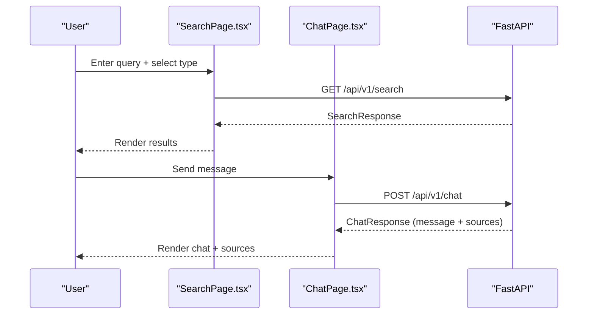

**Diagram sources**
- [frontend/src/pages/SearchPage.tsx:16-34](file://frontend/src/pages/SearchPage.tsx#L16-L34)
- [frontend/src/pages/ChatPage.tsx:69-105](file://frontend/src/pages/ChatPage.tsx#L69-L105)
- [backend/routers/search.py:333-347](file://backend/routers/search.py#L333-L347)
- [backend/routers/chat.py:634-698](file://backend/routers/chat.py#L634-L698)

**Section sources**
- [frontend/src/pages/SearchPage.tsx:1-158](file://frontend/src/pages/SearchPage.tsx#L1-L158)
- [frontend/src/pages/ChatPage.tsx:1-245](file://frontend/src/pages/ChatPage.tsx#L1-L245)

## Backup Integration and Management

### Comprehensive Backup Service
The backup service provides full database backup and restore capabilities with automated post-ingestion backups and flexible configuration options.

Key implementation highlights:
- **Multi-type backups**: Full, incremental, checkpoint, and post-ingestion backup types
- **Flexible configuration**: Database-specific and system-wide backup settings
- **Automatic triggers**: Post-ingestion backup automation with job integration
- **Storage management**: Configurable retention policies and backup location management
- **Compression support**: Optional GZIP compression for backup files
- **Collection targeting**: Profile-specific collections and system collections management

**Diagram sources**
- [backend/services/backup_service.py:288-362](file://backend/services/backup_service.py#L288-L362)
- [backend/services/backup_service.py:495-507](file://backend/services/backup_service.py#L495-L507)
- [backend/services/backup_service.py:663-782](file://backend/services/backup_service.py#L663-L782)

Practical usage patterns:
- **Post-ingestion automation**: Enable auto_backup_after_ingestion for automatic backup creation
- **Retention management**: Configure retention_days and max_backups_per_profile for storage optimization
- **Selective exports**: Choose include_embeddings and include_system_collections based on requirements
- **Manual triggers**: Use backup endpoints for on-demand backup operations

**Section sources**
- [backend/services/backup_service.py:67-136](file://backend/services/backup_service.py#L67-L136)
- [backend/services/backup_service.py:288-362](file://backend/services/backup_service.py#L288-L362)
- [backend/services/backup_service.py:495-507](file://backend/services/backup_service.py#L495-L507)
- [backend/services/backup_service.py:663-782](file://backend/services/backup_service.py#L663-L782)

## Cloud Source Sync Capabilities

### Automated Cloud File Processing
The sync worker automates the processing of files from cloud sources, integrating seamlessly with the ingestion pipeline for document processing.

Key implementation highlights:
- **Multiple provider support**: Google Drive, Dropbox, Confluence, Jira, Gmail, Outlook, and IMAP
- **Delta sync capabilities**: Support for incremental sync with delta token management
- **Filtering system**: File type, size, pattern, and date-based filtering
- **Error handling**: Robust error handling with retry mechanisms for rate limiting
- **Metadata preservation**: Cloud source metadata attached to processed documents
- **Deletion handling**: Automatic deletion of documents when source files are removed

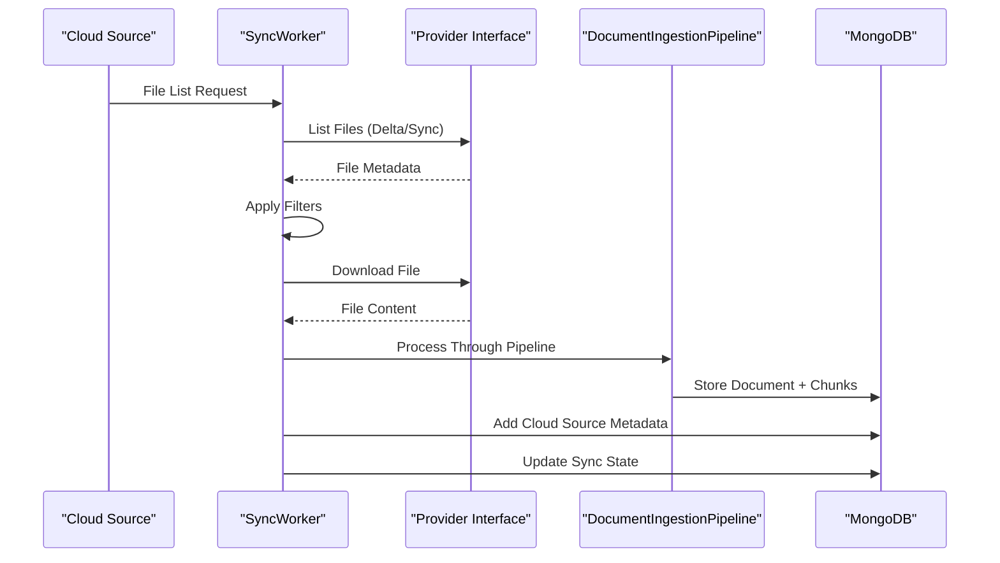

**Diagram sources**
- [backend/workers/sync_worker.py:60-86](file://backend/workers/sync_worker.py#L60-L86)
- [backend/workers/sync_worker.py:114-143](file://backend/workers/sync_worker.py#L114-L143)
- [backend/workers/sync_worker.py:390-454](file://backend/workers/sync_worker.py#L390-L454)

Practical usage patterns:
- **Provider configuration**: Set up OAuth or API key authentication for cloud providers
- **Filter configuration**: Configure file type, size, and pattern filters for selective sync
- **Delta sync**: Enable delta sync for efficient incremental processing
- **Deletion handling**: Configure delete_removed option for automatic cleanup

**Section sources**
- [backend/workers/sync_worker.py:44-106](file://backend/workers/sync_worker.py#L44-L106)
- [backend/workers/sync_worker.py:114-143](file://backend/workers/sync_worker.py#L114-L143)
- [backend/workers/sync_worker.py:390-454](file://backend/workers/sync_worker.py#L390-L454)

## Queue Management and Scheduling

### Advanced Ingestion Queue System
The queue management system provides sophisticated job scheduling, prioritization, and monitoring capabilities for ingestion operations.

Key implementation highlights:
- **Priority-based queuing**: Jobs can be prioritized with integer values (higher = more priority)
- **Selective processing filters**: Built-in support for retry_image_only_pdfs, retry_timeouts, retry_errors, retry_no_chunks, skip_image_only_pdfs
- **Flexible scheduling**: Hourly, daily, weekly, and monthly scheduling with configurable timing
- **Real-time monitoring**: Queue status with current job tracking and processing indicators
- **Dynamic configuration**: Runtime configuration of file type filters and processing options
- **Manual override**: Ability to manually trigger scheduled jobs with higher priority

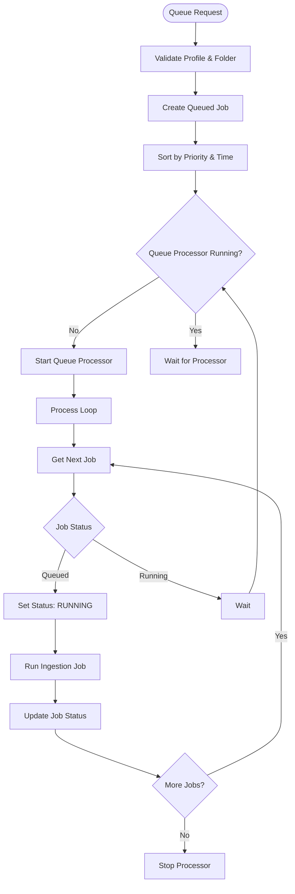

**Diagram sources**
- [backend/routers/ingestion_queue.py:190-244](file://backend/routers/ingestion_queue.py#L190-L244)
- [backend/routers/ingestion_queue.py:360-408](file://backend/routers/ingestion_queue.py#L360-L408)
- [backend/routers/ingestion_queue.py:608-774](file://backend/routers/ingestion_queue.py#L608-L774)

Practical usage patterns:
- **Batch processing**: Use add-multiple endpoint for processing multiple profiles simultaneously
- **Priority management**: Set higher priority for urgent jobs to process them first
- **Selective processing**: Configure retry filters for targeted reprocessing of problematic files
- **Scheduling**: Set up recurring ingestion jobs with appropriate frequencies and timing

**Section sources**
- [backend/routers/ingestion_queue.py:27-87](file://backend/routers/ingestion_queue.py#L27-L87)
- [backend/routers/ingestion_queue.py:190-244](file://backend/routers/ingestion_queue.py#L190-L244)
- [backend/routers/ingestion_queue.py:360-408](file://backend/routers/ingestion_queue.py#L360-L408)
- [backend/routers/ingestion_queue.py:608-774](file://backend/routers/ingestion_queue.py#L608-L774)

## Dependency Analysis
The system exhibits clear separation of concerns with enhanced worker-based architecture:
- Backend API depends on routers, agent system, and core configuration/database
- **Enhanced ingestion pipeline**: Standalone worker processes independent of API, with database-backed job management
- **Cloud sync integration**: Separate sync worker handles cloud provider integrations
- **Backup service**: Independent backup management with database integration
- Agent system depends on federated search and MongoDB for multi-source retrieval
- Ingestion pipeline depends on Docling and embedding providers to transform and enrich data
- Frontend depends on backend endpoints for search and chat

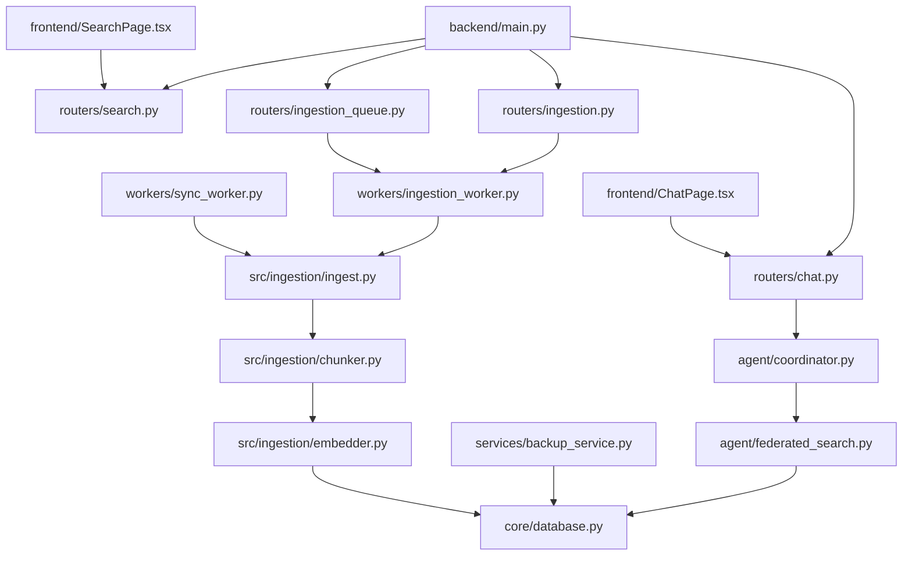

**Diagram sources**
- [backend/main.py:363-466](file://backend/main.py#L363-L466)
- [backend/routers/search.py:1-347](file://backend/routers/search.py#L1-L347)
- [backend/routers/chat.py:1-734](file://backend/routers/chat.py#L1-L734)
- [backend/routers/ingestion.py:1-3273](file://backend/routers/ingestion.py#L1-L3273)
- [backend/routers/ingestion_queue.py:1-897](file://backend/routers/ingestion_queue.py#L1-L897)
- [backend/workers/ingestion_worker.py:1-674](file://backend/workers/ingestion_worker.py#L1-L674)
- [backend/workers/sync_worker.py:1-506](file://backend/workers/sync_worker.py#L1-L506)
- [backend/services/backup_service.py:1-1339](file://backend/services/backup_service.py#L1-L1339)
- [backend/agent/coordinator.py:1-427](file://backend/agent/coordinator.py#L1-L427)
- [backend/agent/federated_search.py:1-535](file://backend/agent/federated_search.py#L1-L535)
- [backend/core/database.py:1-228](file://backend/core/database.py#L1-L228)
- [src/ingestion/chunker.py:1-270](file://src/ingestion/chunker.py#L1-L270)
- [src/ingestion/embedder.py:1-227](file://src/ingestion/embedder.py#L1-L227)
- [frontend/src/pages/SearchPage.tsx:1-158](file://frontend/src/pages/SearchPage.tsx#L1-L158)
- [frontend/src/pages/ChatPage.tsx:1-245](file://frontend/src/pages/ChatPage.tsx#L1-L245)

**Section sources**
- [backend/main.py:363-466](file://backend/main.py#L363-L466)
- [backend/core/config.py:1-219](file://backend/core/config.py#L1-L219)

## Performance Considerations
- **Worker-based architecture**: Standalone ingestion worker prevents API blocking during heavy processing
- Vector and text search are executed in parallel per source to reduce latency
- RRF scoring and deduplication minimize redundant results
- **Adaptive timeout management**: Configurable timeouts based on file size and type with retry mechanisms
- **GPU acceleration**: Automatic detection and utilization of CUDA or MPS devices for processing
- **Thread pool optimization**: Limited thread pool size (2 workers) to preserve API responsiveness
- **Concurrent processing**: Configurable max_concurrent_files for optimal throughput
- **Progress tracking**: Real-time progress updates with minimal database overhead
- Frontend renders previews and paginates results to keep interactions responsive

## Troubleshooting Guide
Common issues and remedies:
- **Search failures**: Verify vector and text indexes exist and are healthy; confirm embedding model configuration
- **Ingestion interruptions**: Jobs are marked as interrupted on restart and can be resumed automatically
- **Worker crashes**: Check MongoDB connectivity and configuration; verify performance settings
- **Cloud sync failures**: Verify provider authentication and network connectivity; check rate limiting
- **Backup failures**: Ensure sufficient disk space and proper backup configuration; check database permissions
- **Slow requests**: Use the timeout middleware and monitor processing_time_ms; consider reducing match_count
- **Authentication errors**: Ensure API keys are configured for providers and JWT secrets are set appropriately

**Section sources**
- [backend/core/database.py:181-228](file://backend/core/database.py#L181-L228)
- [backend/routers/ingestion.py:133-172](file://backend/routers/ingestion.py#L133-L172)
- [backend/workers/ingestion_worker.py:127-134](file://backend/workers/ingestion_worker.py#L127-L134)
- [backend/workers/sync_worker.py:265-295](file://backend/workers/sync_worker.py#L265-L295)
- [backend/services/backup_service.py:137-136](file://backend/services/backup_service.py#L137-L136)
- [backend/main.py:73-126](file://backend/main.py#L73-L126)
- [backend/core/config.py:140-176](file://backend/core/config.py#L140-L176)

## Conclusion
MongoDB-RAG-Agent delivers a production-ready RAG platform with enhanced capabilities:
- **Hybrid search** powered by vector and text indexes with RRF
- **Intelligent chunking** that preserves document structure and semantics
- **Federated agent** enabling multi-provider, multi-source conversational AI
- **Enhanced ingestion pipeline** with standalone worker architecture for improved performance
- **Comprehensive backup integration** with post-ingestion automation
- **Cloud source sync capabilities** for automated file processing
- **Advanced queue management** with scheduling and selective processing
- **Multi-format ingestion** supporting many formats and audio transcription
- **Cost-effective deployment** compatible with MongoDB Atlas free tier

These enhancements combine to provide a scalable, maintainable, and user-friendly RAG solution with improved reliability, performance, and operational capabilities.

## Appendices

### Practical Examples and Usage Patterns
- **Hybrid search**
  - Endpoint: POST /api/v1/search/hybrid
  - Parameters: query, match_count, search_type
  - Example: Use hybrid for balanced results; increase match_count for richer context
- **Enhanced ingestion pipeline**
  - Standalone worker: python -m backend.workers.ingestion_worker
  - Queue management: Use /api/v1/ingestion-queue endpoints for job control
  - Performance tuning: Configure max_concurrent_files and embedding_batch_size
- **Selective processing**
  - Retry image-only PDFs: retry_image_only_pdfs flag
  - Handle timeouts: retry_timeouts flag with adaptive timeout configuration
  - Skip problematic files: skip_image_only_pdfs filter
- **Backup integration**
  - Post-ingestion backups: Auto-enabled via configuration
  - Manual backups: Use backup endpoints for on-demand operations
  - Retention management: Configure retention_days and max_backups_per_profile
- **Cloud source sync**
  - Provider setup: Configure OAuth/API keys for cloud providers
  - Delta sync: Enable incremental processing with delta token management
  - Filter configuration: Set file type, size, and pattern filters
- **Queue management**
  - Priority processing: Set priority values for urgent jobs
  - Scheduling: Configure hourly/daily/weekly/monthly ingestion schedules
  - Monitoring: Track queue status and job progress in real-time
- **Frontend**
  - SearchPage: toggle search type and adjust result count
  - ChatPage: view sources and navigate to document details

**Section sources**
- [backend/routers/search.py:190-347](file://backend/routers/search.py#L190-L347)
- [backend/workers/ingestion_worker.py:666-674](file://backend/workers/ingestion_worker.py#L666-L674)
- [backend/routers/ingestion_queue.py:190-244](file://backend/routers/ingestion_queue.py#L190-L244)
- [src/ingestion/ingest.py:255-314](file://src/ingestion/ingest.py#L255-L314)
- [backend/services/backup_service.py:83-97](file://backend/services/backup_service.py#L83-L97)
- [backend/workers/sync_worker.py:114-143](file://backend/workers/sync_worker.py#L114-L143)
- [backend/routers/ingestion_queue.py:608-774](file://backend/routers/ingestion_queue.py#L608-L774)
- [frontend/src/pages/SearchPage.tsx:16-34](file://frontend/src/pages/SearchPage.tsx#L16-L34)
- [frontend/src/pages/ChatPage.tsx:69-105](file://frontend/src/pages/ChatPage.tsx#L69-L105)