# Core Features

<cite>
**Referenced Files in This Document**
- [backend/main.py](file://backend/main.py)
- [backend/routers/search.py](file://backend/routers/search.py)
- [backend/routers/chat.py](file://backend/routers/chat.py)
- [backend/agent/coordinator.py](file://backend/agent/coordinator.py)
- [backend/agent/federated_search.py](file://backend/agent/federated_search.py)
- [backend/agent/orchestrator.py](file://backend/agent/orchestrator.py)
- [backend/agent/strategy/business_context_resolver.py](file://backend/agent/strategy/business_context_resolver.py)
- [backend/agent/strategy/spec_selector.py](file://backend/agent/strategy/spec_selector.py)
- [backend/agent/strategy/strategy_runner.py](file://backend/agent/strategy/strategy_runner.py)
- [backend/core/config.py](file://backend/core/config.py)
- [backend/core/database.py](file://backend/core/database.py)
- [backend/routers/ingestion.py](file://backend/routers/ingestion.py)
- [backend/routers/ingestion_queue.py](file://backend/routers/ingestion_queue.py)
- [backend/workers/ingestion_worker.py](file://backend/workers/ingestion_worker.py)
- [backend/workers/sync_worker.py](file://backend/workers/sync_worker.py)
- [backend/services/backup_service.py](file://backend/services/backup_service.py)
- [src/ingestion/chunker.py](file://src/ingestion/chunker.py)
- [src/ingestion/embedder.py](file://src/ingestion/embedder.py)
- [src/ingestion/ingest.py](file://src/ingestion/ingest.py)
- [examples/docling_basics/04_hybrid_chunking.py](file://examples/docling_basics/04_hybrid_chunking.py)
- [examples/docling_basics/02_multiple_formats.py](file://examples/docling_basics/02_multiple_formats.py)
- [examples/docling_basics/03_audio_transcription.py](file://examples/docling_basics/03_audio_transcription.py)
- [frontend/src/pages/SearchPage.tsx](file://frontend/src/pages/SearchPage.tsx)
- [frontend/src/pages/ChatPage.tsx](file://frontend/src/pages/ChatPage.tsx)
- [docs/07-STRATEGY_OS_OVERVIEW.md](file://docs/07-STRATEGY_OS_OVERVIEW.md)
- [backend/cli/phase6_commands.py](file://backend/cli/phase6_commands.py)
</cite>

## Update Summary
**Changes Made**
- Completely rewritten to reflect the massive transformation from Phase 0 to Phase 6
- Replaced legacy orchestrator-centric architecture with Strategy Operating System (Strategy OS) as the primary architecture
- Added comprehensive documentation for the new four-layer Strategy OS architecture
- Integrated Strategy OS components: BusinessContextResolver, StrategySpecSelector, StrategyRunner, and AdaptiveSelector
- Added Phase 6 operator commands and CLI integration
- Enhanced agent system to support Strategy OS routing and adaptive decision-making
- Updated architecture diagrams to show Strategy OS as the central orchestrating system
- Added new sections covering Strategy OS layers, spec governance, and exploration system

## Table of Contents
1. [Introduction](#introduction)
2. [Strategy Operating System Architecture](#strategy-operating-system-architecture)
3. [Project Structure](#project-structure)
4. [Core Components](#core-components)
5. [Architecture Overview](#architecture-overview)
6. [Detailed Component Analysis](#detailed-component-analysis)
7. [Enhanced Document Processing Pipeline](#enhanced-document-processing-pipeline)
8. [Backup Integration and Management](#backup-integration-and-management)
9. [Cloud Source Sync Capabilities](#cloud-source-sync-capabilities)
10. [Queue Management and Scheduling](#queue-management-and-scheduling)
11. [Phase 6 Operator Commands](#phase-6-operator-commands)
12. [Dependency Analysis](#dependency-analysis)
13. [Performance Considerations](#performance-considerations)
14. [Troubleshooting Guide](#troubleshooting-guide)
15. [Conclusion](#conclusion)
16. [Appendices](#appendices)

## Introduction
MongoDB-RAG-Agent has undergone a massive transformation from Phase 0 to Phase 6, replacing the legacy orchestrator-centric architecture with a comprehensive **Strategy Operating System (Strategy OS)** as the primary architecture. This new system provides:

- **Strategy OS as Primary Architecture**: A config-driven, declarative pipeline that replaced hard-coded orchestrator logic with typed DAG execution
- **Four-Layer Architecture**: Separation of concerns across Spec & Governance, DAG Execution Runtime, Exploration & Evaluation, and Observability layers
- **Adaptive Strategy Selection**: Intelligent routing between multiple strategy specifications based on business context, performance metrics, and quality signals
- **Enhanced Agent System**: Federated agent coordinating orchestrator-worker architecture with Strategy OS integration
- **Multi-format Document Ingestion**: Comprehensive processing pipeline with selective processing filters and performance optimization
- **Cost-effective Deployment**: Compatible with MongoDB Atlas free tier while supporting advanced features

The Strategy OS transforms the system from a single hard-coded pipeline to a flexible, testable, and continuously improving platform with declarative strategy specifications and automated experimentation.

## Strategy Operating System Architecture

The Strategy Operating System (Strategy OS) is a four-layer architecture that provides a declarative, testable, and continuously improving approach to RAG execution:

```mermaid
graph TB
subgraph "Layer 4 - Observability"
RUNTRACE["RunTraceStore<br/>strategy_runs (TTL)"]
REPORTGEN["NightlyReportGenerator<br/>strategy_run_reports"]
RUNTIMEPROF["RuntimeProfiler<br/>runtime_model_profiles"]
ACTIVITY["ChatActivityTracker<br/>runtime_signals"]
RESOURCESNAP["ResourceSnapshotCollector<br/>runtime_signals"]
TELEMETRY["TelemetryService<br/>JSONL (file-based)"]
end
subgraph "Layer 3 - Exploration & Evaluation"
EVALRUNNER["EvaluationRunner<br/>evaluation_results"]
COMPOSITE["CompositeScoreCalculator<br/>JudgeCalibrator<br/>ContradictionDetector"]
EXPLMODES["ExplorationModes<br/>grid/regression/smoke/bandit/evolutionary"]
CANDIDATE["CandidateGenerator<br/>EvolutionaryMutator"]
EXPJOB["StrategyExperimentRunner<br/>strategy_experiment_jobs"]
SCHEDDAEMON["SchedulerDaemon<br/>strategy_schedules, scheduler_reports"]
BANDIT["BanditStateStore<br/>strategy_bandit_state"]
EVOLUTION["EvolutionStateStore<br/>strategy_evolution_state"]
ADAPTIVE["AdaptiveDecisionStore<br/>adaptive_selection_decisions"]
end
subgraph "Layer 2 - DAG Execution Runtime"
BUSCTX["BusinessContextResolver<br/>(capability + source policy + lang)"]
STRATRUNNER["StrategyRunner<br/>(level-sync DAG executor)"]
GRAPHCOMP["GraphCompiler<br/>(topological levels, cycle check)"]
CONDEVAL["ConditionEvaluator<br/>(safe-AST edge conditions)"]
NODES["NodeRegistry → 18 NodeExecutor implementations"]
CONTEXTBUDGET["ContextBudgeter, CheckpointManager, NodeLLMHelper"]
end
subgraph "Layer 1 - Spec & Governance"
SPECSTORE["SpecStore<br/>strategy_specs"]
SPECLOADER["SpecLoader (YAML → StrategySpec)"]
SPECSELECTOR["SpecSelector<br/>(capability + tenant + mode → spec)"]
PROMOMGR["PromotionManager + PromotionEvaluator"]
CAPABILITIES["BusinessCapability, AnswerContract, SourcePolicy YAMLs"]
end
RUNTRACE --> REPORTGEN
REPORTGEN --> RUNTIMEPROF
ACTIVITY --> RESOURCESNAP
TELEMETRY --> RUNTRACE
EVALRUNNER --> SPECSELECTOR
SPECSELECTOR --> STRATRUNNER
STRATRUNNER --> NODES
NODES --> RUNTRACE
SPECSTORE --> SPECSELECTOR
SPECSELECTOR --> STRATRUNNER
BUSCTX --> SPECSELECTOR
```

**Diagram sources**
- [docs/07-STRATEGY_OS_OVERVIEW.md:35-88](file://docs/07-STRATEGY_OS_OVERVIEW.md#L35-L88)
- [backend/agent/strategy/business_context_resolver.py:111-164](file://backend/agent/strategy/business_context_resolver.py#L111-L164)
- [backend/agent/strategy/spec_selector.py:171-260](file://backend/agent/strategy/spec_selector.py#L171-L260)
- [backend/agent/strategy/strategy_runner.py:169-268](file://backend/agent/strategy/strategy_runner.py#L169-L268)

**Section sources**
- [docs/07-STRATEGY_OS_OVERVIEW.md:19-108](file://docs/07-STRATEGY_OS_OVERVIEW.md#L19-L108)
- [docs/07-STRATEGY_OS_OVERVIEW.md:143-162](file://docs/07-STRATEGY_OS_OVERVIEW.md#L143-L162)

## Project Structure
The system is organized around the new Strategy Operating System with enhanced ingestion pipeline, agent orchestration, and comprehensive CLI support:

- **Strategy OS Core**: Four-layer architecture with spec governance, DAG execution, exploration, and observability
- **Enhanced Agent System**: Federated agent coordinating orchestrator-worker architecture with Strategy OS integration
- **Advanced Ingestion Pipeline**: Docling-based chunking, embedding generation, and worker-based processing
- **Comprehensive CLI**: Phase 6 operator commands for scheduling, experimentation, and profiling
- **Cloud Source Sync**: Automated processing of files from cloud providers
- **Backup Service**: Comprehensive backup and restore capabilities
- **Frontend**: Interactive search and chat experiences

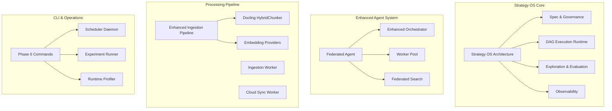

**Diagram sources**
- [backend/agent/coordinator.py:182-256](file://backend/agent/coordinator.py#L182-L256)
- [backend/agent/orchestrator.py:83-111](file://backend/agent/orchestrator.py#L83-L111)
- [backend/agent/strategy/business_context_resolver.py:31-41](file://backend/agent/strategy/business_context_resolver.py#L31-L41)
- [backend/agent/strategy/spec_selector.py:118-168](file://backend/agent/strategy/spec_selector.py#L118-L168)
- [backend/agent/strategy/strategy_runner.py:100-123](file://backend/agent/strategy/strategy_runner.py#L100-L123)
- [backend/cli/phase6_commands.py:204-221](file://backend/cli/phase6_commands.py#L204-L221)

**Section sources**
- [backend/agent/coordinator.py:182-256](file://backend/agent/coordinator.py#L182-L256)
- [backend/agent/orchestrator.py:83-111](file://backend/agent/orchestrator.py#L83-L111)
- [backend/agent/strategy/business_context_resolver.py:31-41](file://backend/agent/strategy/business_context_resolver.py#L31-L41)
- [backend/agent/strategy/spec_selector.py:118-168](file://backend/agent/strategy/spec_selector.py#L118-L168)
- [backend/agent/strategy/strategy_runner.py:100-123](file://backend/agent/strategy/strategy_runner.py#L100-L123)
- [backend/cli/phase6_commands.py:204-221](file://backend/cli/phase6_commands.py#L204-L221)

## Core Components

### Strategy Operating System (Primary Architecture)
The Strategy OS replaces the hard-coded orchestrator pipeline with a declarative, testable system:

- **Spec & Governance Layer**: StrategySpec lifecycle, capabilities, answer contracts, source policies, and promotion workflow
- **DAG Execution Runtime**: Level-synchronous graph execution with 18 node types and typed state management
- **Exploration & Evaluation**: Automated experimentation with grid, regression, smoke, bandit, and evolutionary modes
- **Observability Layer**: Comprehensive tracing, profiling, reporting, and telemetry integration

### Enhanced Agent System with Strategy OS Integration
The federated agent coordinates an orchestrator and worker pool while leveraging Strategy OS for intelligent strategy selection:

- **BusinessContextResolver**: Detects business capabilities and resolves source policies from tenant, profile, and strategy layers
- **AdaptiveSelector**: Routes between multiple strategy specifications based on latency-fit, quality, resource-fit, and residency signals
- **StrategyRunner**: Executes compiled strategy graphs with level-synchronous parallelism and conditional edge evaluation
- **Enhanced Orchestrator**: Multi-step planning with improved context extraction and task optimization

### Intelligent Document Processing Pipeline
Enhanced ingestion pipeline with standalone processing and selective filtering:

- **Standalone Ingestion Worker**: Independent processing preventing API blocking during heavy workloads
- **Multi-format Ingestion**: Comprehensive support for PDF, Word, PowerPoint, Excel, HTML, Markdown, images, and audio
- **Selective Processing Filters**: Retry mechanisms for problematic files and performance optimization
- **Cloud Source Sync**: Automated processing of files from cloud providers with delta sync capabilities

### Advanced CLI and Operations
Phase 6 introduces comprehensive operator commands:

- **Schedule Management**: Cron-based scheduling with pause/resume functionality
- **Experimentation**: Automated A/B testing with multiple exploration modes
- **Profiling**: Runtime profiling for model performance and cost optimization
- **Nightly Reports**: Automated strategy performance reporting and regression detection

**Section sources**
- [docs/07-STRATEGY_OS_OVERVIEW.md:19-108](file://docs/07-STRATEGY_OS_OVERVIEW.md#L19-L108)
- [backend/agent/coordinator.py:258-343](file://backend/agent/coordinator.py#L258-L343)
- [backend/agent/strategy/business_context_resolver.py:111-164](file://backend/agent/strategy/business_context_resolver.py#L111-L164)
- [backend/agent/strategy/spec_selector.py:575-800](file://backend/agent/strategy/spec_selector.py#L575-L800)
- [backend/agent/strategy/strategy_runner.py:169-268](file://backend/agent/strategy/strategy_runner.py#L169-L268)
- [backend/cli/phase6_commands.py:204-221](file://backend/cli/phase6_commands.py#L204-L221)

## Architecture Overview
The Strategy OS architecture integrates enhanced ingestion, search, and conversational AI with a federated agent system. MongoDB Atlas stores documents and chunks with vector and text indexes. The backend exposes REST endpoints for search, chat, and ingestion, while the frontend provides user interfaces. The new Strategy OS ensures API responsiveness during heavy ingestion workloads while providing intelligent strategy selection and continuous improvement.

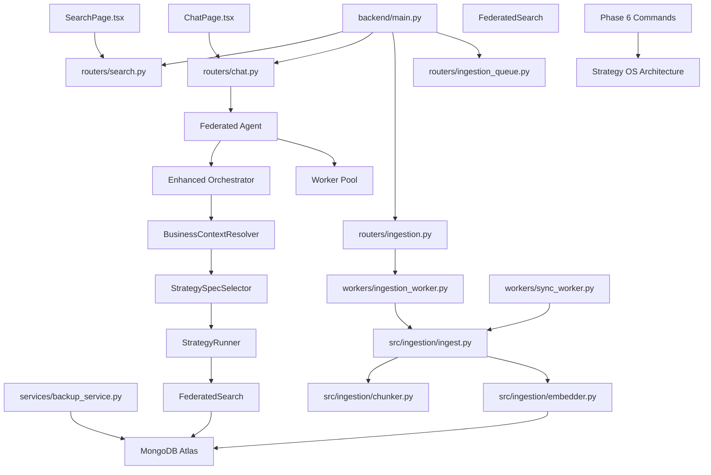

**Diagram sources**
- [backend/main.py:363-466](file://backend/main.py#L363-L466)
- [backend/routers/search.py:34-109](file://backend/routers/search.py#L34-L109)
- [backend/routers/chat.py:634-698](file://backend/routers/chat.py#L634-L698)
- [backend/agent/coordinator.py:643-796](file://backend/agent/coordinator.py#L643-L796)
- [backend/agent/strategy/business_context_resolver.py:111-164](file://backend/agent/strategy/business_context_resolver.py#L111-L164)
- [backend/agent/strategy/spec_selector.py:171-260](file://backend/agent/strategy/spec_selector.py#L171-L260)
- [backend/agent/strategy/strategy_runner.py:169-268](file://backend/agent/strategy/strategy_runner.py#L169-L268)
- [backend/workers/ingestion_worker.py:164-196](file://backend/workers/ingestion_worker.py#L164-L196)
- [backend/services/backup_service.py:288-362](file://backend/services/backup_service.py#L288-L362)
- [backend/cli/phase6_commands.py:204-221](file://backend/cli/phase6_commands.py#L204-L221)

## Detailed Component Analysis

### Strategy Operating System with Adaptive Selection
The Strategy OS provides intelligent strategy selection through four integrated layers:

#### Business Context Resolution
Detects business capabilities and resolves source policies from multiple layers:

- **Capability Detection**: Deterministic keyword/pattern matching with confidence scoring
- **Source Policy Intersection**: Combines tenant, profile, and strategy policies with restriction semantics
- **Answer Contract Resolution**: Loads standardized response templates and output formats
- **Language Policy**: Enforces response language requirements

#### Strategy Specification Selection
Intelligent routing between multiple strategy specifications:

- **Deterministic Ranking**: Exact tenant match, recency, and strategy_id tie-breaks
- **Privacy Filtering**: Enforces local-only and strict privacy constraints
- **Adaptive Scoring**: Latency-fit, quality, resource-fit, and residency signals
- **Fast Path Eligibility**: Bypasses orchestrator for confident, templated responses

#### DAG Execution Runtime
Level-synchronous parallel execution with conditional edges:

- **Graph Compilation**: Topological sorting with cycle detection and validation
- **Parallel Execution**: Nodes at same level execute concurrently
- **State Management**: Append-only state accumulation between levels
- **Budget Enforcement**: Hard limits on LLM calls, cost, and latency
- **Conditional Edges**: Safe AST evaluation of edge conditions

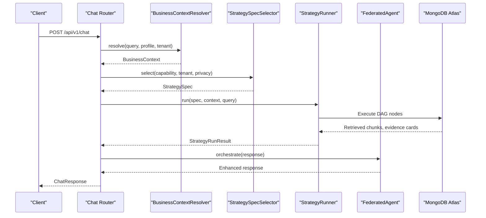

**Diagram sources**
- [backend/agent/coordinator.py:643-796](file://backend/agent/coordinator.py#L643-L796)
- [backend/agent/strategy/business_context_resolver.py:111-164](file://backend/agent/strategy/business_context_resolver.py#L111-L164)
- [backend/agent/strategy/spec_selector.py:171-260](file://backend/agent/strategy/spec_selector.py#L171-L260)
- [backend/agent/strategy/strategy_runner.py:169-268](file://backend/agent/strategy/strategy_runner.py#L169-L268)

**Section sources**
- [docs/07-STRATEGY_OS_OVERVIEW.md:94-108](file://docs/07-STRATEGY_OS_OVERVIEW.md#L94-L108)
- [backend/agent/strategy/business_context_resolver.py:111-164](file://backend/agent/strategy/business_context_resolver.py#L111-L164)
- [backend/agent/strategy/spec_selector.py:171-260](file://backend/agent/strategy/spec_selector.py#L171-L260)
- [backend/agent/strategy/strategy_runner.py:169-268](file://backend/agent/strategy/strategy_runner.py#L169-L268)

### Enhanced Conversational AI with Strategy OS Integration
The federated agent coordinates an orchestrator and worker pool while leveraging Strategy OS for intelligent strategy selection:

#### Business Context Integration
- **Capability Detection**: Automatically identifies business domain from user queries
- **Source Policy Resolution**: Intersects tenant, profile, and strategy policies
- **Answer Contract Application**: Enforces standardized response formats and output sections
- **Language Policy Enforcement**: Ensures responses match user language preferences

#### Adaptive Strategy Selection
- **Latency Optimization**: Chooses strategies based on model performance profiles
- **Quality Scoring**: Considers historical composite scores from evaluation results
- **Resource Fit**: Matches strategies to available computational resources
- **Residency Bonus**: Prefers strategies using resident models for cost efficiency

#### Enhanced Orchestrator Capabilities
- **Improved Context Extraction**: Better conversation history analysis and entity extraction
- **Optimized Task Planning**: Entity-aware search queries and source prioritization
- **Multi-hop Reasoning**: Complex queries with iterative refinement and validation
- **Template-Based Responses**: Direct synthesis for confident, templated answers

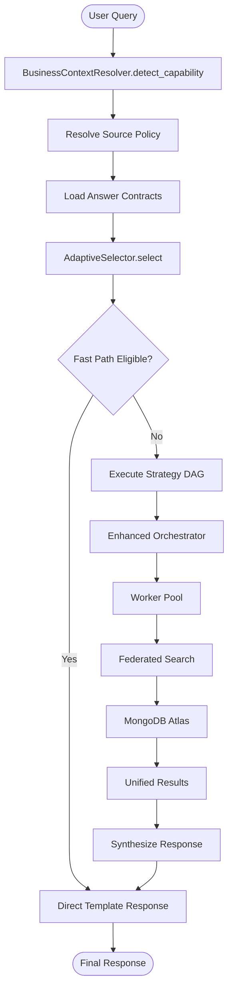

**Diagram sources**
- [backend/agent/coordinator.py:643-796](file://backend/agent/coordinator.py#L643-L796)
- [backend/agent/strategy/spec_selector.py:575-800](file://backend/agent/strategy/spec_selector.py#L575-L800)
- [backend/agent/orchestrator.py:341-800](file://backend/agent/orchestrator.py#L341-L800)

**Section sources**
- [backend/agent/coordinator.py:258-343](file://backend/agent/coordinator.py#L258-L343)
- [backend/agent/strategy/spec_selector.py:575-800](file://backend/agent/strategy/spec_selector.py#L575-L800)
- [backend/agent/orchestrator.py:341-800](file://backend/agent/orchestrator.py#L341-L800)

## Enhanced Document Processing Pipeline

### Standalone Ingestion Worker Architecture
The new ingestion worker provides standalone processing that guarantees API responsiveness during heavy ingestion workloads:

#### Job Queue Management
- **State Management**: Handles PENDING, RUNNING, PAUSED, COMPLETED, FAILED, STOPPED, INTERRUPTED, CANCELLED states
- **Progress Tracking**: Real-time progress updates with phase tracking and discovery progress
- **Control Commands**: Support for STOP, PAUSE, RESUME commands during processing
- **Performance Configuration**: Dynamic loading of performance settings from database
- **Offline Mode Support**: Automatic configuration for offline audio transcription and vision processing

#### Multi-Format Ingestion with Selective Processing
- **Comprehensive Format Support**: PDF, DOCX, PPTX, XLSX, HTML, Markdown, images, audio, video
- **Selective Processing Filters**: retry_image_only_pdfs, retry_timeouts, retry_errors, retry_no_chunks, skip_image_only_pdfs
- **Adaptive Timeout Management**: Configurable timeouts based on file size and type with retry mechanisms
- **GPU Acceleration**: Automatic detection and utilization of CUDA or MPS devices for Docling processing
- **Content-Based Deduplication**: SHA256 hashing for duplicate detection across files
- **Extended Metrics Tracking**: Detailed statistics including processing time, file sizes, and classification types

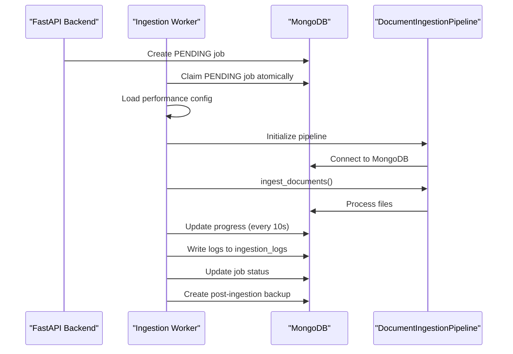

**Diagram sources**
- [backend/workers/ingestion_worker.py:164-196](file://backend/workers/ingestion_worker.py#L164-L196)
- [backend/workers/ingestion_worker.py:261-520](file://backend/workers/ingestion_worker.py#L261-L520)
- [src/ingestion/ingest.py:62-115](file://src/ingestion/ingest.py#L62-L115)

**Section sources**
- [backend/workers/ingestion_worker.py:60-196](file://backend/workers/ingestion_worker.py#L60-L196)
- [backend/workers/ingestion_worker.py:261-520](file://backend/workers/ingestion_worker.py#L261-L520)
- [src/ingestion/ingest.py:62-115](file://src/ingestion/ingest.py#L62-L115)
- [src/ingestion/ingest.py:255-314](file://src/ingestion/ingest.py#L255-L314)

### Frontend Experiences
Interactive UIs for search and chat integrate with backend endpoints to deliver a seamless user experience:

#### SearchPage Integration
- **Search Type Selection**: Choose between hybrid, semantic, and text search modes
- **Result Count Adjustment**: Control result quantity with match_count parameter
- **Similarity Score Display**: View relevance scores for retrieved documents
- **Source Linking**: Navigate to document details and sources

#### ChatPage Integration
- **Message Streaming**: Receive responses with streaming-like behavior
- **Source Exploration**: Click through document sources and citations
- **Strategy Trace Display**: View execution traces and routing decisions
- **Performance Metrics**: Monitor processing time and token usage

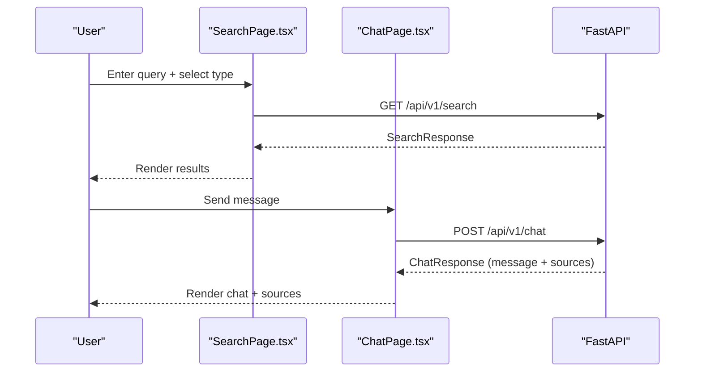

**Diagram sources**
- [frontend/src/pages/SearchPage.tsx:16-34](file://frontend/src/pages/SearchPage.tsx#L16-L34)
- [frontend/src/pages/ChatPage.tsx:69-105](file://frontend/src/pages/ChatPage.tsx#L69-L105)
- [backend/routers/search.py:333-347](file://backend/routers/search.py#L333-L347)
- [backend/routers/chat.py:634-698](file://backend/routers/chat.py#L634-L698)

**Section sources**
- [frontend/src/pages/SearchPage.tsx:1-158](file://frontend/src/pages/SearchPage.tsx#L1-L158)
- [frontend/src/pages/ChatPage.tsx:1-245](file://frontend/src/pages/ChatPage.tsx#L1-L245)

## Backup Integration and Management

### Comprehensive Backup Service
The backup service provides full database backup and restore capabilities with automated post-ingestion backups and flexible configuration options:

#### Multi-Type Backup Support
- **Full Backups**: Complete database export with profile-specific collections
- **Incremental Backups**: Delta changes since last backup for efficiency
- **Checkpoint Backups**: Intermediate state captures for recovery points
- **Post-Ingestion Backups**: Automatic backup creation after successful ingestion

#### Flexible Configuration Options
- **Database-Specific Settings**: Profile-specific backup configurations
- **System-Wide Policies**: Global backup settings and retention policies
- **Compression Support**: Optional GZIP compression for backup files
- **Collection Targeting**: Selective export of profile and system collections

#### Storage Management
- **Retention Policies**: Configurable backup retention with automatic cleanup
- **Backup Location Management**: Flexible storage locations and backup file organization
- **Automatic Triggers**: Post-ingestion backup automation with job integration

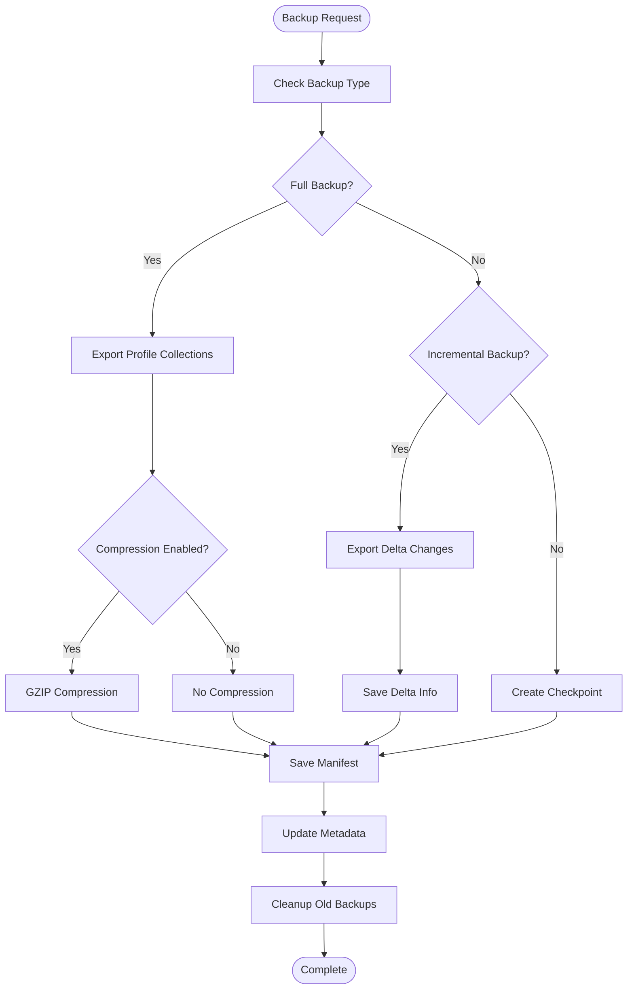

**Diagram sources**
- [backend/services/backup_service.py:288-362](file://backend/services/backup_service.py#L288-L362)
- [backend/services/backup_service.py:495-507](file://backend/services/backup_service.py#L495-L507)
- [backend/services/backup_service.py:663-782](file://backend/services/backup_service.py#L663-L782)

**Section sources**
- [backend/services/backup_service.py:67-136](file://backend/services/backup_service.py#L67-L136)
- [backend/services/backup_service.py:288-362](file://backend/services/backup_service.py#L288-L362)
- [backend/services/backup_service.py:495-507](file://backend/services/backup_service.py#L495-L507)
- [backend/services/backup_service.py:663-782](file://backend/services/backup_service.py#L663-L782)

## Cloud Source Sync Capabilities

### Automated Cloud File Processing
The sync worker automates the processing of files from cloud sources, integrating seamlessly with the ingestion pipeline for document processing:

#### Multiple Provider Support
- **Google Drive**: File listing, download, and metadata extraction
- **Dropbox**: Delta sync with change detection and conflict resolution
- **Confluence**: Space and page synchronization with permission handling
- **Jira**: Issue attachment processing and project synchronization
- **Email Providers**: Gmail, Outlook, and IMAP integration for attachment processing

#### Delta Sync Capabilities
- **Change Detection**: Incremental sync with delta token management
- **Conflict Resolution**: Automatic handling of concurrent modifications
- **Rate Limiting**: Robust error handling with retry mechanisms for API limits
- **Deletion Handling**: Automatic cleanup when source files are removed

#### Filtering and Processing
- **File Type Filtering**: Extension-based filtering for selective processing
- **Size-Based Filtering**: Large file handling with adaptive processing
- **Pattern Matching**: Filename pattern filtering for targeted sync
- **Date-Based Filtering**: Time-based filtering for incremental processing

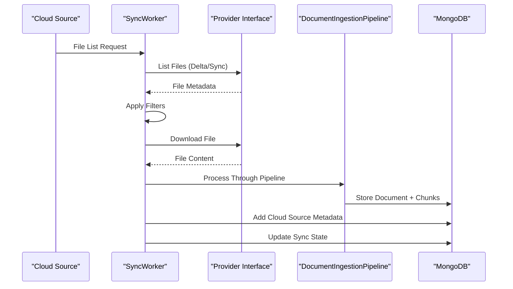

**Diagram sources**
- [backend/workers/sync_worker.py:60-86](file://backend/workers/sync_worker.py#L60-L86)
- [backend/workers/sync_worker.py:114-143](file://backend/workers/sync_worker.py#L114-L143)
- [backend/workers/sync_worker.py:390-454](file://backend/workers/sync_worker.py#L390-L454)

**Section sources**
- [backend/workers/sync_worker.py:44-106](file://backend/workers/sync_worker.py#L44-L106)
- [backend/workers/sync_worker.py:114-143](file://backend/workers/sync_worker.py#L114-L143)
- [backend/workers/sync_worker.py:390-454](file://backend/workers/sync_worker.py#L390-L454)

## Queue Management and Scheduling

### Advanced Ingestion Queue System
The queue management system provides sophisticated job scheduling, prioritization, and monitoring capabilities for ingestion operations:

#### Priority-Based Queuing
- **Priority Values**: Integer-based priority system with higher values processing first
- **Selective Processing Filters**: Built-in support for retry_image_only_pdfs, retry_timeouts, retry_errors, retry_no_chunks, skip_image_only_pdfs
- **Flexible Scheduling**: Hourly, daily, weekly, and monthly scheduling with configurable timing
- **Real-Time Monitoring**: Queue status with current job tracking and processing indicators

#### Dynamic Configuration
- **Runtime Configuration**: Ability to modify file type filters and processing options during operation
- **Manual Override**: Higher priority manual triggering of scheduled jobs
- **Performance Tuning**: Configurable max_concurrent_files and processing parameters
- **Adaptive Processing**: Intelligent timeout adjustment based on file characteristics

#### Batch Processing
- **Add-Multiple Endpoint**: Process multiple profiles simultaneously with batch operations
- **Priority Management**: Set and adjust priorities for urgent jobs
- **Selective Processing**: Configure retry filters for targeted reprocessing of problematic files
- **Scheduling Integration**: Set up recurring ingestion jobs with appropriate frequencies

**Diagram sources**
- [backend/routers/ingestion_queue.py:190-244](file://backend/routers/ingestion_queue.py#L190-L244)
- [backend/routers/ingestion_queue.py:360-408](file://backend/routers/ingestion_queue.py#L360-L408)
- [backend/routers/ingestion_queue.py:608-774](file://backend/routers/ingestion_queue.py#L608-L774)

**Section sources**
- [backend/routers/ingestion_queue.py:27-87](file://backend/routers/ingestion_queue.py#L27-L87)
- [backend/routers/ingestion_queue.py:190-244](file://backend/routers/ingestion_queue.py#L190-L244)
- [backend/routers/ingestion_queue.py:360-408](file://backend/routers/ingestion_queue.py#L360-L408)
- [backend/routers/ingestion_queue.py:608-774](file://backend/routers/ingestion_queue.py#L608-L774)

## Phase 6 Operator Commands

### Comprehensive CLI Integration
Phase 6 introduces extensive operator commands for managing the Strategy OS and related operations:

#### Schedule Management Commands
- **List Schedules**: Display all persisted schedules with status and timing
- **Get Schedule Details**: Show full details for individual schedules
- **Add Schedule**: Create new cron-based schedules with mode, tenant, and dataset configuration
- **Run Now**: Trigger immediate execution of scheduled jobs
- **Pause/Resume**: Control schedule execution with reason tracking
- **Daemon Management**: Run scheduler daemon in foreground for monitoring

#### Experimentation Commands
- **List Experiment Jobs**: View recent experiment runs with status filtering
- **Get Experiment Details**: Show detailed results and progress for specific jobs
- **Run Experiment**: Execute automated A/B testing with multiple exploration modes
- **Dry Run**: Preview candidate strategies without execution
- **Watch Progress**: Monitor experiment execution in real-time

#### Profiling Commands
- **Model Testing**: Test and profile model performance across different configurations
- **Strategy Profiling**: Evaluate strategy performance and cost metrics
- **Resource Monitoring**: Track CPU, RAM, and GPU utilization during operations
- **Runtime Analysis**: Analyze model latency and token usage patterns

#### Integration with Strategy OS
- **Scheduler Integration**: Direct integration with Strategy OS scheduling system
- **Experiment Runner**: Seamless execution of exploration modes (grid, regression, bandit, evolutionary)
- **Performance Monitoring**: Real-time monitoring of strategy execution performance
- **Operator Workflows**: Streamlined workflows for strategy deployment and monitoring

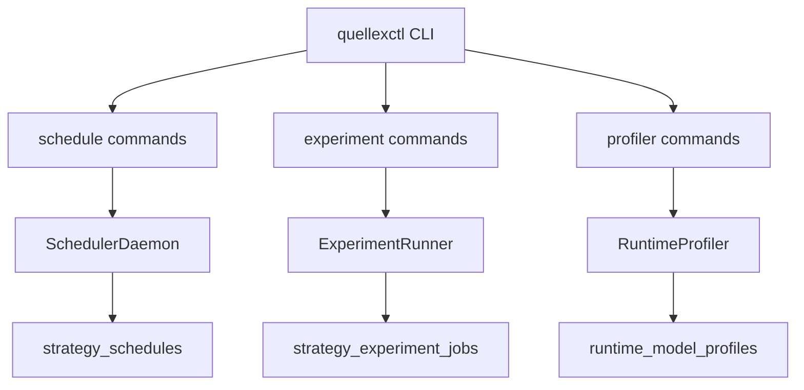

**Diagram sources**
- [backend/cli/phase6_commands.py:204-221](file://backend/cli/phase6_commands.py#L204-L221)
- [backend/cli/phase6_commands.py:225-527](file://backend/cli/phase6_commands.py#L225-L527)
- [backend/cli/phase6_commands.py:532-800](file://backend/cli/phase6_commands.py#L532-L800)

**Section sources**
- [backend/cli/phase6_commands.py:204-221](file://backend/cli/phase6_commands.py#L204-L221)
- [backend/cli/phase6_commands.py:225-527](file://backend/cli/phase6_commands.py#L225-L527)
- [backend/cli/phase6_commands.py:532-800](file://backend/cli/phase6_commands.py#L532-L800)

## Dependency Analysis
The Strategy OS architecture exhibits clear separation of concerns with enhanced layer-based design:

#### Strategy OS Dependencies
- **Spec & Governance Layer**: Manages StrategySpec lifecycle and policy definitions
- **DAG Execution Runtime**: Executes compiled strategy graphs with state management
- **Exploration & Evaluation**: Provides automated experimentation and performance optimization
- **Observability Layer**: Captures telemetry, traces, and performance metrics

#### Enhanced Agent System Integration
- **BusinessContextResolver**: Provides capability detection and policy resolution
- **AdaptiveSelector**: Routes between multiple strategy specifications
- **StrategyRunner**: Executes compiled strategy graphs with level-synchronous parallelism
- **Enhanced Orchestrator**: Multi-step planning with improved context extraction

#### Processing Pipeline Integration
- **Ingestion Worker**: Standalone processing independent of API for heavy workloads
- **Cloud Sync Worker**: Automated processing of cloud provider files
- **Backup Service**: Comprehensive backup management with database integration
- **Docling Pipeline**: Multi-format document processing with selective filtering

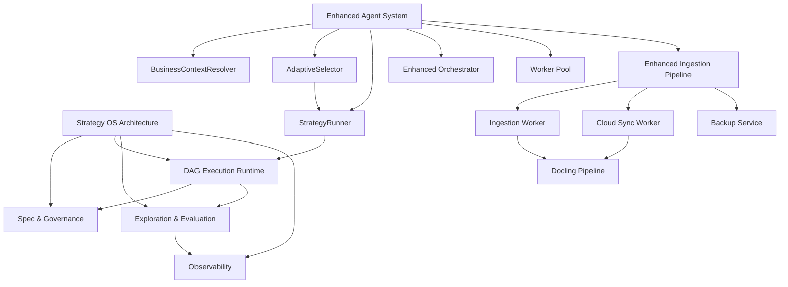

**Diagram sources**
- [docs/07-STRATEGY_OS_OVERVIEW.md:114-139](file://docs/07-STRATEGY_OS_OVERVIEW.md#L114-L139)
- [backend/agent/coordinator.py:182-256](file://backend/agent/coordinator.py#L182-L256)
- [backend/agent/strategy/business_context_resolver.py:31-41](file://backend/agent/strategy/business_context_resolver.py#L31-L41)
- [backend/agent/strategy/spec_selector.py:118-168](file://backend/agent/strategy/spec_selector.py#L118-L168)
- [backend/agent/strategy/strategy_runner.py:100-123](file://backend/agent/strategy/strategy_runner.py#L100-L123)

**Section sources**
- [docs/07-STRATEGY_OS_OVERVIEW.md:114-139](file://docs/07-STRATEGY_OS_OVERVIEW.md#L114-L139)
- [backend/agent/coordinator.py:182-256](file://backend/agent/coordinator.py#L182-L256)

## Performance Considerations
The Strategy OS architecture provides several performance optimizations:

#### Strategy OS Optimizations
- **Adaptive Strategy Selection**: Intelligent routing reduces latency and improves quality
- **Level-Synchronous Parallelism**: Efficient parallel execution within strategy graphs
- **Conditional Edge Evaluation**: Prevents unnecessary computation through dynamic pruning
- **Budget Enforcement**: Hard limits prevent resource exhaustion and ensure predictable performance

#### Enhanced Agent System Benefits
- **Worker-Based Architecture**: Standalone ingestion worker prevents API blocking during heavy processing
- **Vector and Text Search Parallelism**: Executed in parallel per source to reduce latency
- **RRF Scoring and Deduplication**: Minimizes redundant results and improves precision
- **Adaptive Timeout Management**: Configurable timeouts based on file size and type with retry mechanisms

#### Processing Pipeline Optimizations
- **GPU Acceleration**: Automatic detection and utilization of CUDA or MPS devices for processing
- **Thread Pool Optimization**: Limited thread pool size (2 workers) to preserve API responsiveness
- **Concurrent Processing**: Configurable max_concurrent_files for optimal throughput
- **Progress Tracking**: Real-time progress updates with minimal database overhead

#### Frontend Performance
- **Preview Rendering**: Frontend renders previews and paginates results to keep interactions responsive
- **Streaming Responses**: Chat responses use streaming-like behavior for perceived performance
- **Caching Strategies**: Strategy selection caching reduces repeated computation

## Troubleshooting Guide
Common issues and remedies for the Strategy OS architecture:

#### Strategy OS Issues
- **Strategy Selection Failures**: Verify StrategySpec availability and business context resolution
- **DAG Execution Errors**: Check graph compilation, node reachability, and budget constraints
- **Adaptive Selector Problems**: Ensure runtime profiles, evaluation results, and resource snapshots are available
- **Business Context Resolution**: Verify tenant policies, capability definitions, and answer contracts

#### Agent System Issues
- **Search Failures**: Verify vector and text indexes exist and embedding model configuration is correct
- **Ingestion Interruptions**: Jobs are marked as interrupted on restart and can be resumed automatically
- **Worker Crashes**: Check MongoDB connectivity and configuration; verify performance settings
- **Cloud Sync Failures**: Verify provider authentication and network connectivity; check rate limiting

#### Processing Pipeline Issues
- **Backup Failures**: Ensure sufficient disk space and proper backup configuration; check database permissions
- **Slow Requests**: Use timeout middleware and monitor processing_time_ms; consider reducing match_count
- **Authentication Errors**: Ensure API keys are configured for providers and JWT secrets are set appropriately

#### CLI and Operations Issues
- **Schedule Management**: Verify cron expressions and timezone configurations
- **Experiment Execution**: Check candidate generator availability and resource limits
- **Profiler Issues**: Ensure model availability and proper configuration for testing

**Section sources**
- [docs/07-STRATEGY_OS_OVERVIEW.md:166-187](file://docs/07-STRATEGY_OS_OVERVIEW.md#L166-L187)
- [backend/agent/strategy/business_context_resolver.py:166-218](file://backend/agent/strategy/business_context_resolver.py#L166-L218)
- [backend/agent/strategy/spec_selector.py:87-102](file://backend/agent/strategy/spec_selector.py#L87-L102)
- [backend/agent/strategy/strategy_runner.py:74-84](file://backend/agent/strategy/strategy_runner.py#L74-L84)

## Conclusion
MongoDB-RAG-Agent has evolved into a comprehensive, production-ready RAG platform with the Strategy Operating System as its core architecture:

#### Strategy OS Advantages
- **Declarative Strategy Specifications**: YAML-based strategy definitions with version control and promotion workflow
- **Intelligent Strategy Selection**: Adaptive routing based on latency-fit, quality, resource-fit, and residency signals
- **Automated Experimentation**: Continuous improvement through systematic A/B testing and performance optimization
- **Comprehensive Observability**: Full tracing, profiling, and reporting capabilities for operational insights

#### Enhanced Agent System
- **Business Context Integration**: Automatic capability detection and policy resolution
- **Adaptive Strategy Execution**: Dynamic strategy selection based on query characteristics and performance metrics
- **Enhanced Orchestration**: Improved multi-step planning with better context extraction and task optimization

#### Advanced Processing Pipeline
- **Standalone Ingestion Worker**: Independent processing ensuring API responsiveness during heavy workloads
- **Multi-Format Ingestion**: Comprehensive support for diverse document formats with selective processing
- **Cloud Source Integration**: Automated processing of files from multiple cloud providers
- **Backup Automation**: Comprehensive backup management with post-ingestion automation

#### Operational Excellence
- **Phase 6 CLI Integration**: Extensive operator commands for scheduling, experimentation, and profiling
- **Performance Monitoring**: Real-time monitoring and optimization capabilities
- **Cost Optimization**: Intelligent resource allocation and cost-conscious strategy selection
- **Scalability**: Support for MongoDB Atlas free tier while enabling advanced features

The Strategy OS transformation provides a scalable, maintainable, and user-friendly RAG solution with improved reliability, performance, and operational capabilities, representing a significant advancement from the Phase 0 architecture.

## Appendices

### Practical Examples and Usage Patterns

#### Strategy OS Integration
- **Business Context Resolution**: Use BusinessContextResolver to detect capabilities and resolve policies
- **Strategy Selection**: Implement AdaptiveSelector for intelligent strategy routing with performance signals
- **DAG Execution**: Utilize StrategyRunner for level-synchronous parallel execution with budget enforcement
- **Spec Management**: Manage StrategySpec lifecycle through SpecStore and SpecSelector components

#### Enhanced Agent Usage
- **Business Context Integration**: Leverage BusinessContextResolver for capability detection and policy resolution
- **Adaptive Strategy Selection**: Use AdaptiveSelector to route between multiple strategy specifications
- **Enhanced Orchestration**: Implement multi-step planning with improved context extraction and task optimization
- **Fast Path Eligibility**: Configure FastPathRules for confident, templated responses

#### Processing Pipeline Examples
- **Standalone Worker**: Run ingestion worker independently: `python -m backend.workers.ingestion_worker`
- **Queue Management**: Use `/api/v1/ingestion-queue` endpoints for job control and monitoring
- **Selective Processing**: Configure retry filters for targeted reprocessing of problematic files
- **Performance Tuning**: Adjust max_concurrent_files and embedding_batch_size for optimal throughput

#### Cloud Source Integration
- **Provider Setup**: Configure OAuth/API keys for cloud providers (Google Drive, Dropbox, etc.)
- **Delta Sync**: Enable incremental processing with delta token management
- **Filter Configuration**: Set file type, size, and pattern filters for selective processing
- **Deletion Handling**: Configure automatic cleanup when source files are removed

#### Backup and Recovery
- **Post-Ingestion Backups**: Enable auto_backup_after_ingestion for automatic backup creation
- **Manual Backups**: Use backup endpoints for on-demand operations
- **Retention Management**: Configure retention_days and max_backups_per_profile for storage optimization
- **Backup Verification**: Regular verification of backup integrity and restoration procedures

#### CLI Operations
- **Schedule Management**: Use `quellexctl schedule` commands for cron-based scheduling
- **Experimentation**: Run `quellexctl experiment` commands for automated A/B testing
- **Profiling**: Execute `quellexctl profiler` commands for model and strategy performance analysis
- **Nightly Reports**: Monitor automated strategy performance reporting and regression detection

**Section sources**
- [docs/07-STRATEGY_OS_OVERVIEW.md:94-108](file://docs/07-STRATEGY_OS_OVERVIEW.md#L94-L108)
- [backend/agent/strategy/business_context_resolver.py:111-164](file://backend/agent/strategy/business_context_resolver.py#L111-L164)
- [backend/agent/strategy/spec_selector.py:171-260](file://backend/agent/strategy/spec_selector.py#L171-L260)
- [backend/agent/strategy/strategy_runner.py:169-268](file://backend/agent/strategy/strategy_runner.py#L169-L268)
- [backend/workers/ingestion_worker.py:666-674](file://backend/workers/ingestion_worker.py#L666-L674)
- [backend/routers/ingestion_queue.py:190-244](file://backend/routers/ingestion_queue.py#L190-L244)
- [backend/cli/phase6_commands.py:225-527](file://backend/cli/phase6_commands.py#L225-L527)