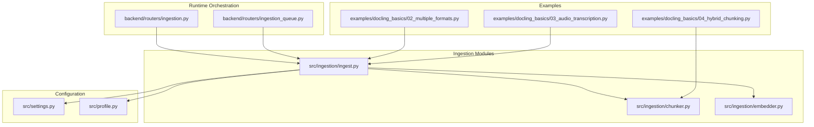
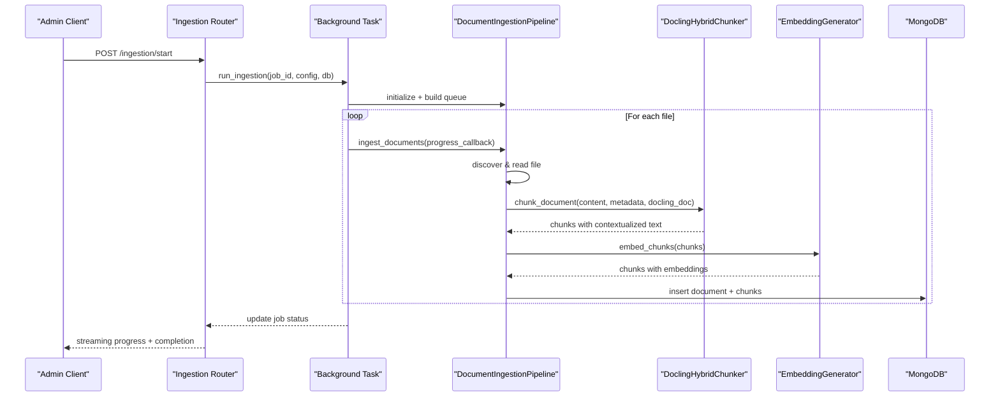
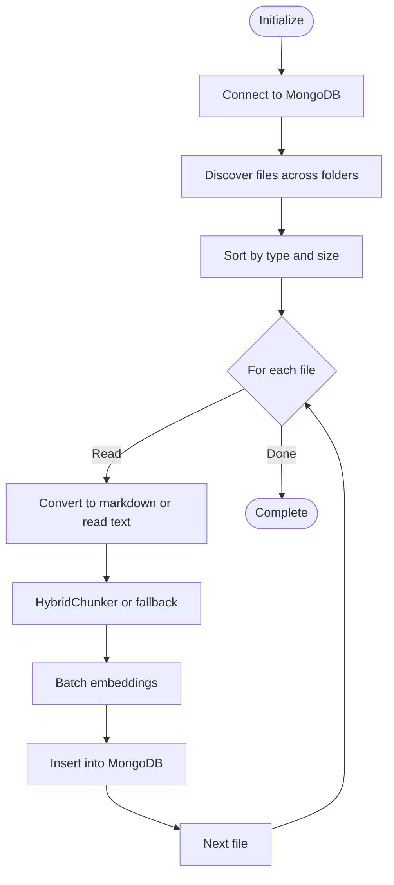
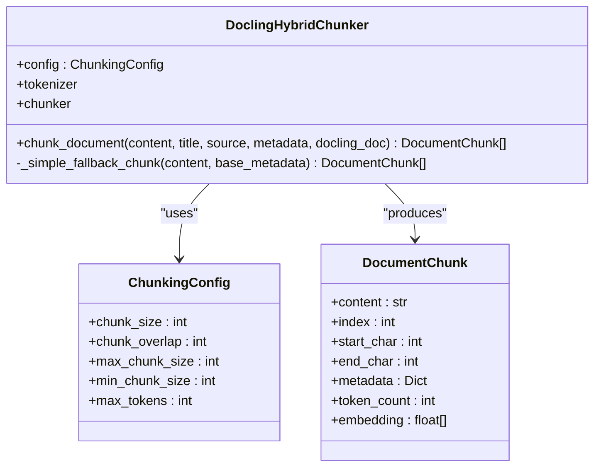
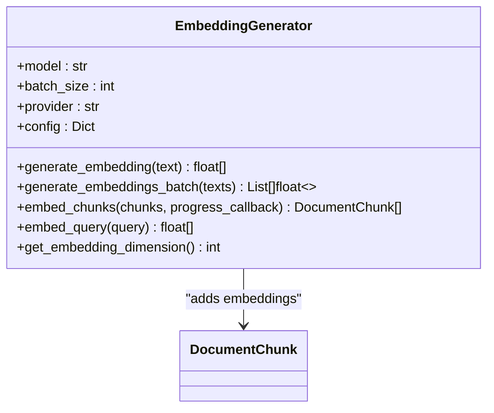
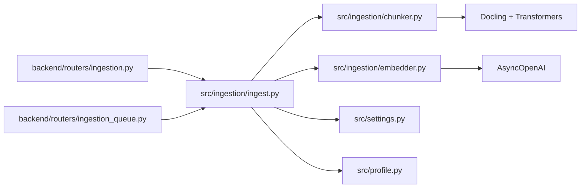

# Document Processing Pipeline

<cite>
**Referenced Files in This Document**
- [src/ingestion/ingest.py](file://src/ingestion/ingest.py)
- [src/ingestion/chunker.py](file://src/ingestion/chunker.py)
- [src/ingestion/embedder.py](file://src/ingestion/embedder.py)
- [src/settings.py](file://src/settings.py)
- [src/profile.py](file://src/profile.py)
- [backend/routers/ingestion.py](file://backend/routers/ingestion.py)
- [backend/routers/ingestion_queue.py](file://backend/routers/ingestion_queue.py)
- [examples/docling_basics/02_multiple_formats.py](file://examples/docling_basics/02_multiple_formats.py)
- [examples/docling_basics/03_audio_transcription.py](file://examples/docling_basics/03_audio_transcription.py)
- [examples/docling_basics/04_hybrid_chunking.py](file://examples/docling_basics/04_hybrid_chunking.py)
</cite>

## Table of Contents
1. [Introduction](#introduction)
2. [Project Structure](#project-structure)
3. [Core Components](#core-components)
4. [Architecture Overview](#architecture-overview)
5. [Detailed Component Analysis](#detailed-component-analysis)
6. [Dependency Analysis](#dependency-analysis)
7. [Performance Considerations](#performance-considerations)
8. [Troubleshooting Guide](#troubleshooting-guide)
9. [Conclusion](#conclusion)
10. [Appendices](#appendices)

## Introduction
This document describes the end-to-end document processing pipeline that transforms raw documents into vector embeddings stored in MongoDB. It covers:
- Intelligent chunking powered by Docling’s HybridChunker to preserve document structure and semantic boundaries
- Multi-format ingestion supporting PDF, Word, PowerPoint, Excel, HTML, Markdown, images, audio, and video
- Embedding generation with configurable batch processing and dimension settings
- Robust error handling, retry strategies, and recovery for failed processing attempts
- Practical examples for ingestion workflows, chunking strategies, and embedding configurations
- Performance considerations, memory management, and scaling approaches for large document collections

## Project Structure
The pipeline is implemented primarily in the ingestion modules and integrated with FastAPI routers for orchestration and monitoring. Supporting modules manage settings, profiles, and advanced queue/scheduling features.

**Diagram sources**
- [src/ingestion/ingest.py](file://src/ingestion/ingest.py#L55-L125)
- [src/ingestion/chunker.py](file://src/ingestion/chunker.py#L68-L101)
- [src/ingestion/embedder.py](file://src/ingestion/embedder.py#L45-L87)
- [backend/routers/ingestion.py](file://backend/routers/ingestion.py#L411-L518)
- [backend/routers/ingestion_queue.py](file://backend/routers/ingestion_queue.py#L275-L372)
- [src/settings.py](file://src/settings.py#L16-L156)
- [src/profile.py](file://src/profile.py#L174-L284)
- [examples/docling_basics/02_multiple_formats.py](file://examples/docling_basics/02_multiple_formats.py#L24-L64)
- [examples/docling_basics/03_audio_transcription.py](file://examples/docling_basics/03_audio_transcription.py#L42-L69)
- [examples/docling_basics/04_hybrid_chunking.py](file://examples/docling_basics/04_hybrid_chunking.py#L30-L59)

**Section sources**
- [src/ingestion/ingest.py](file://src/ingestion/ingest.py#L1-L1261)
- [src/ingestion/chunker.py](file://src/ingestion/chunker.py#L1-L270)
- [src/ingestion/embedder.py](file://src/ingestion/embedder.py#L1-L227)
- [src/settings.py](file://src/settings.py#L1-L211)
- [src/profile.py](file://src/profile.py#L1-L740)
- [backend/routers/ingestion.py](file://backend/routers/ingestion.py#L1-L800)
- [backend/routers/ingestion_queue.py](file://backend/routers/ingestion_queue.py#L1-L647)
- [examples/docling_basics/02_multiple_formats.py](file://examples/docling_basics/02_multiple_formats.py#L1-L107)
- [examples/docling_basics/03_audio_transcription.py](file://examples/docling_basics/03_audio_transcription.py#L1-L125)
- [examples/docling_basics/04_hybrid_chunking.py](file://examples/docling_basics/04_hybrid_chunking.py#L1-L164)

## Core Components
- DocumentIngestionPipeline: Orchestrates end-to-end ingestion, including file discovery, conversion, chunking, embedding, and persistence to MongoDB.
- DoclingHybridChunker: Token-aware chunker that respects document structure and semantic boundaries.
- EmbeddingGenerator: Batched embedding generation with provider flexibility and dimension configuration.
- Settings and Profiles: Centralized configuration for MongoDB, embedding models, and multi-profile workspaces.
- FastAPI Routers: Background ingestion jobs, progress tracking, pause/stop/resume, and queue/scheduling.

Key responsibilities and behaviors:
- File discovery and prioritization by type and size
- Multi-format conversion using Docling (PDF, Word, PowerPoint, Excel, HTML, images, audio/video)
- Audio transcription with Whisper (cloud API, chunked processing, or local fallback)
- Intelligent chunking with HybridChunker and fallback strategies
- Batched embedding generation with progress reporting
- MongoDB persistence with vector and text indexes
- Graceful shutdown and recovery for interrupted jobs

**Section sources**
- [src/ingestion/ingest.py](file://src/ingestion/ingest.py#L55-L125)
- [src/ingestion/chunker.py](file://src/ingestion/chunker.py#L68-L101)
- [src/ingestion/embedder.py](file://src/ingestion/embedder.py#L45-L87)
- [src/settings.py](file://src/settings.py#L16-L156)
- [src/profile.py](file://src/profile.py#L174-L284)
- [backend/routers/ingestion.py](file://backend/routers/ingestion.py#L411-L653)
- [backend/routers/ingestion_queue.py](file://backend/routers/ingestion_queue.py#L275-L372)

## Architecture Overview
The ingestion pipeline follows a modular, asynchronous design:
- Routers initiate ingestion jobs and stream progress
- Pipeline discovers files, converts them to text/markdown, chunks intelligently, generates embeddings, and writes to MongoDB
- Profiles and settings enable multi-project isolation and flexible configuration
- Queue and scheduling routers support advanced orchestration

**Diagram sources**
- [backend/routers/ingestion.py](file://backend/routers/ingestion.py#L411-L653)
- [src/ingestion/ingest.py](file://src/ingestion/ingest.py#L856-L950)
- [src/ingestion/chunker.py](file://src/ingestion/chunker.py#L102-L186)
- [src/ingestion/embedder.py](file://src/ingestion/embedder.py#L136-L196)

## Detailed Component Analysis

### DocumentIngestionPipeline
Responsibilities:
- Initialize MongoDB connections and settings
- Discover and prioritize files across configured folders
- Convert files to markdown using Docling or read text/audio
- Extract metadata and compute token counts
- Chunk documents using HybridChunker or fallback
- Generate embeddings in batches
- Persist to MongoDB with vector and text indexes
- Support incremental ingestion and recovery

Key behaviors:
- Thread pool for CPU-intensive operations to keep API responsive
- Sorting by file type and size to optimize throughput
- Incremental mode to skip already-ingested sources
- Graceful shutdown and interruption markers for recovery

**Diagram sources**
- [src/ingestion/ingest.py](file://src/ingestion/ingest.py#L126-L168)
- [src/ingestion/ingest.py](file://src/ingestion/ingest.py#L169-L284)
- [src/ingestion/ingest.py](file://src/ingestion/ingest.py#L286-L356)
- [src/ingestion/ingest.py](file://src/ingestion/ingest.py#L856-L950)

**Section sources**
- [src/ingestion/ingest.py](file://src/ingestion/ingest.py#L55-L125)
- [src/ingestion/ingest.py](file://src/ingestion/ingest.py#L126-L168)
- [src/ingestion/ingest.py](file://src/ingestion/ingest.py#L169-L284)
- [src/ingestion/ingest.py](file://src/ingestion/ingest.py#L286-L356)
- [src/ingestion/ingest.py](file://src/ingestion/ingest.py#L856-L950)

### DoclingHybridChunker
Capabilities:
- Token-aware chunking using a sentence-transformers tokenizer
- Respect for document structure (headings, sections, tables)
- Semantic boundaries (paragraphs, code blocks)
- Contextualized chunks with heading hierarchy
- Fallback to simple sliding-window chunking when needed

Configuration:
- max_tokens controls chunk size for embedding models
- merge_peers merges small adjacent chunks
- Tokenizer initialized once for performance

**Diagram sources**
- [src/ingestion/chunker.py](file://src/ingestion/chunker.py#L68-L101)
- [src/ingestion/chunker.py](file://src/ingestion/chunker.py#L33-L48)
- [src/ingestion/chunker.py](file://src/ingestion/chunker.py#L50-L66)

**Section sources**
- [src/ingestion/chunker.py](file://src/ingestion/chunker.py#L68-L101)
- [src/ingestion/chunker.py](file://src/ingestion/chunker.py#L102-L186)
- [src/ingestion/chunker.py](file://src/ingestion/chunker.py#L187-L256)

### EmbeddingGenerator
Capabilities:
- Batched embedding generation with configurable batch size
- Provider flexibility (OpenAI and Ollama)
- Dimension configuration aligned with embedding model
- Truncation to stay within model token limits
- Progress reporting per batch

Configuration:
- Model-specific configs for dimensions and max tokens
- Lazy client initialization
- Async OpenAI client for embeddings

**Diagram sources**
- [src/ingestion/embedder.py](file://src/ingestion/embedder.py#L45-L87)
- [src/ingestion/embedder.py](file://src/ingestion/embedder.py#L136-L196)

**Section sources**
- [src/ingestion/embedder.py](file://src/ingestion/embedder.py#L45-L87)
- [src/ingestion/embedder.py](file://src/ingestion/embedder.py#L88-L135)
- [src/ingestion/embedder.py](file://src/ingestion/embedder.py#L136-L196)
- [src/ingestion/embedder.py](file://src/ingestion/embedder.py#L198-L213)

### Settings and Profiles
- Settings encapsulate MongoDB URIs, collection names, indexes, embedding provider/model/dimension, and search weights
- Profiles enable multi-project isolation with separate document folders, databases, and collection names
- Active profile can be switched at runtime or via CLI

**Section sources**
- [src/settings.py](file://src/settings.py#L16-L156)
- [src/profile.py](file://src/profile.py#L174-L284)

### Routers: Ingestion and Queue/Scheduling
- Ingestion Router: Starts background jobs, streams logs and progress, supports pause/stop/resume, persists job state
- Ingestion Queue Router: Manages queue ordering, priorities, and scheduled jobs; integrates with MongoDB for persistence

**Section sources**
- [backend/routers/ingestion.py](file://backend/routers/ingestion.py#L411-L653)
- [backend/routers/ingestion_queue.py](file://backend/routers/ingestion_queue.py#L275-L372)

## Dependency Analysis
The ingestion pipeline exhibits low coupling and high cohesion:
- Pipeline depends on Chunker and Embedder abstractions
- Chunker depends on Docling and Transformers
- Embedder depends on OpenAI async client and settings
- Routers depend on Pipeline and Profiles for orchestration
- Settings and Profiles decouple configuration from implementation

**Diagram sources**
- [backend/routers/ingestion.py](file://backend/routers/ingestion.py#L473-L514)
- [backend/routers/ingestion_queue.py](file://backend/routers/ingestion_queue.py#L327-L360)
- [src/ingestion/ingest.py](file://src/ingestion/ingest.py#L113-L123)
- [src/ingestion/chunker.py](file://src/ingestion/chunker.py#L23-L25)
- [src/ingestion/embedder.py](file://src/ingestion/embedder.py#L12-L12)

**Section sources**
- [backend/routers/ingestion.py](file://backend/routers/ingestion.py#L473-L514)
- [backend/routers/ingestion_queue.py](file://backend/routers/ingestion_queue.py#L327-L360)
- [src/ingestion/ingest.py](file://src/ingestion/ingest.py#L113-L123)
- [src/ingestion/chunker.py](file://src/ingestion/chunker.py#L23-L25)
- [src/ingestion/embedder.py](file://src/ingestion/embedder.py#L12-L12)

## Performance Considerations
- Chunking and embedding are token-aware and batched to reduce overhead
- Thread pools offload CPU-heavy tasks (file discovery, conversions) to keep the event loop responsive
- Incremental ingestion avoids reprocessing existing content
- Sorting by file type and size optimizes throughput (small text first, audio/video last)
- MongoDB batch inserts improve write performance
- Async OpenAI client enables concurrency within embedding batches
- Vector/text indexes should be created in MongoDB Atlas for efficient similarity and text search

[No sources needed since this section provides general guidance]

## Troubleshooting Guide
Common issues and strategies:
- MongoDB connection failures: Verify URI and credentials; check server selection timeouts
- Missing Docling dependencies: Ensure FFmpeg is installed for audio transcription
- Large audio files: Use chunked transcription to exceed API limits
- Offline mode: Set environment variables to force local Whisper transcription
- Interrupted jobs: On restart, interrupted jobs are marked and can be resumed
- Rate limits: Batch sizes and controlled concurrency mitigate API throttling

**Section sources**
- [src/ingestion/ingest.py](file://src/ingestion/ingest.py#L139-L158)
- [src/ingestion/ingest.py](file://src/ingestion/ingest.py#L374-L461)
- [backend/routers/ingestion.py](file://backend/routers/ingestion.py#L133-L172)

## Conclusion
The pipeline provides a robust, scalable foundation for converting diverse document formats into searchable embeddings. Its modular design, intelligent chunking, batched embedding generation, and comprehensive orchestration make it suitable for large-scale deployments with reliable error handling and recovery.

[No sources needed since this section summarizes without analyzing specific files]

## Appendices

### Practical Examples and Workflows
- Multi-format conversion with Docling
  - Demonstrates unified API across PDF, Word, PowerPoint, Excel, HTML, and images
  - Saves markdown outputs for downstream processing

  **Section sources**
  - [examples/docling_basics/02_multiple_formats.py](file://examples/docling_basics/02_multiple_formats.py#L24-L64)

- Audio transcription with Whisper
  - Uses Docling’s ASR pipeline with Whisper Turbo
  - Includes timestamps and saves markdown transcripts

  **Section sources**
  - [examples/docling_basics/03_audio_transcription.py](file://examples/docling_basics/03_audio_transcription.py#L42-L69)

- Intelligent hybrid chunking
  - Shows token-aware chunking with contextualized output
  - Demonstrates chunk statistics and saving contextualized chunks

  **Section sources**
  - [examples/docling_basics/04_hybrid_chunking.py](file://examples/docling_basics/04_hybrid_chunking.py#L30-L59)

### Configuration References
- Embedding model and dimension settings
  - Configure provider, model, base URL, and dimension in settings
  - EmbeddingGenerator aligns batch sizes and truncation with model limits

  **Section sources**
  - [src/settings.py](file://src/settings.py#L75-L91)
  - [src/ingestion/embedder.py](file://src/ingestion/embedder.py#L66-L86)
  - [src/ingestion/embedder.py](file://src/ingestion/embedder.py#L136-L196)

- MongoDB collections and indexes
  - Documents and chunks collections, vector/text indexes, and dimensions
  - Atlas UI steps included in ingestion summary output

  **Section sources**
  - [src/settings.py](file://src/settings.py#L23-L44)
  - [src/ingestion/ingest.py](file://src/ingestion/ingest.py#L1237-L1248)