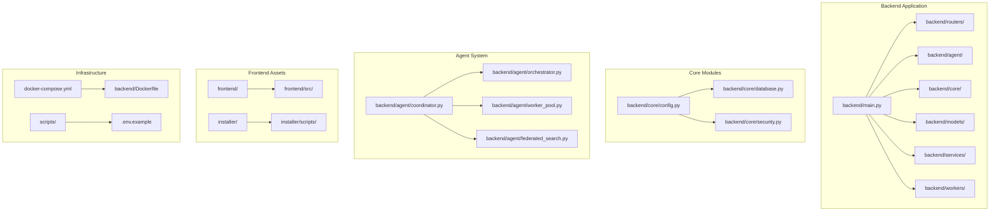
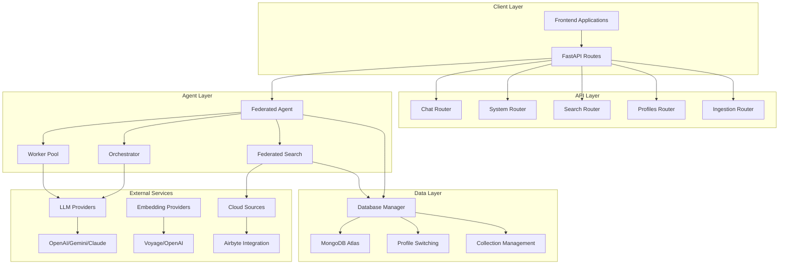
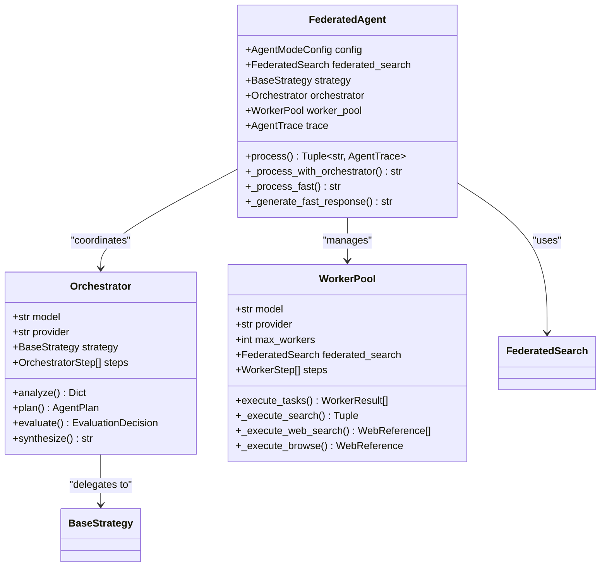
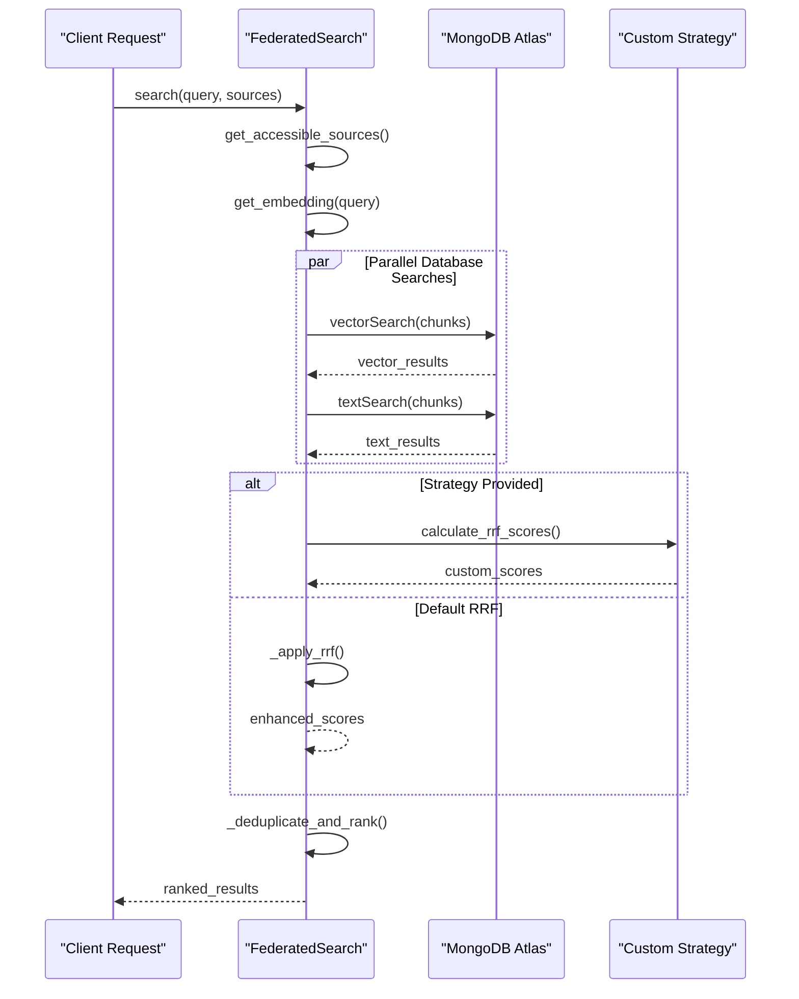
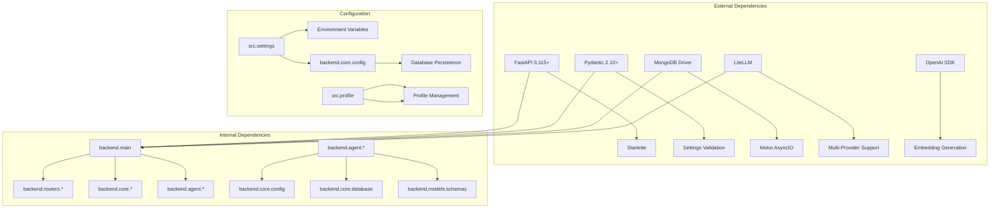

# Document Source Tracking

<cite>
**Referenced Files in This Document**
- [backend/main.py](file://backend/main.py)
- [backend/core/config.py](file://backend/core/config.py)
- [backend/models/schemas.py](file://backend/models/schemas.py)
- [backend/agent/coordinator.py](file://backend/agent/coordinator.py)
- [backend/routers/chat.py](file://backend/routers/chat.py)
- [backend/agent/orchestrator.py](file://backend/agent/orchestrator.py)
- [backend/agent/worker_pool.py](file://backend/agent/worker_pool.py)
- [backend/core/database.py](file://backend/core/database.py)
- [backend/agent/federated_search.py](file://backend/agent/federated_search.py)
- [backend/routers/system.py](file://backend/routers/system.py)
- [src/settings.py](file://src/settings.py)
- [src/profile.py](file://src/profile.py)
- [requirements.txt](file://requirements.txt)
- [backend/Dockerfile](file://backend/Dockerfile)
</cite>

## Table of Contents
1. [Introduction](#introduction)
2. [Project Structure](#project-structure)
3. [Core Components](#core-components)
4. [Architecture Overview](#architecture-overview)
5. [Detailed Component Analysis](#detailed-component-analysis)
6. [Dependency Analysis](#dependency-analysis)
7. [Performance Considerations](#performance-considerations)
8. [Troubleshooting Guide](#troubleshooting-guide)
9. [Conclusion](#conclusion)

## Introduction
This document provides comprehensive source tracking for the MongoDB RAG Agent codebase, focusing on the backend FastAPI application that powers a production-ready Retrieval-Augmented Generation (RAG) system. The system integrates MongoDB Atlas Vector Search with a federated agent architecture supporting hybrid search, multi-format document ingestion, and cloud source synchronization.

The backend serves as the central API layer implementing chat/agent functionality, search capabilities, profile management, ingestion control, and system health monitoring. It leverages a modular architecture with clear separation of concerns across configuration management, data access, agent coordination, and routing layers.

## Project Structure
The codebase follows a well-organized structure separating backend API components from frontend assets and supporting infrastructure:

**Diagram sources**
- [backend/main.py:1-582](file://backend/main.py#L1-L582)
- [backend/core/config.py:1-296](file://backend/core/config.py#L1-L296)
- [backend/agent/coordinator.py:1-756](file://backend/agent/coordinator.py#L1-L756)

**Section sources**
- [backend/main.py:1-582](file://backend/main.py#L1-L582)
- [requirements.txt:1-20](file://requirements.txt#L1-L20)

## Core Components

### FastAPI Application Entry Point
The main application initializes the FastAPI server with comprehensive middleware stack including CORS, security headers, rate limiting, and request timeout handling. The application manages database connections, loads persisted configuration, and initializes backup services during startup.

Key initialization features include:
- Thread pool configuration for async operations with 32 workers
- JWT secret validation for security
- Database connection management with profile switching support
- Prompt template initialization for agent customization
- Backup service configuration and directory initialization

**Section sources**
- [backend/main.py:58-222](file://backend/main.py#L58-L222)
- [backend/main.py:224-275](file://backend/main.py#L224-L275)

### Configuration Management
The backend implements a dual-configuration system with environment-based settings and database-persisted overrides. The configuration supports multiple LLM providers (OpenAI, Google, Anthropic, Ollama), embedding providers, and comprehensive agent settings including timeout controls, worker limits, and search parameters.

Configuration features include:
- Provider-specific API key management
- Model selection with dimension support
- Agent performance tuning parameters
- Ingestion worker configuration
- Profile-based settings overrides

**Section sources**
- [backend/core/config.py:9-296](file://backend/core/config.py#L9-L296)
- [src/settings.py:16-230](file://src/settings.py#L16-L230)

### Data Models and Schemas
The system defines comprehensive Pydantic models for API requests and responses covering chat interactions, search operations, profile management, ingestion workflows, and system monitoring. These models ensure type safety and provide structured data exchange across the application layers.

**Section sources**
- [backend/models/schemas.py:1-570](file://backend/models/schemas.py#L1-L570)

## Architecture Overview

The MongoDB RAG Agent implements a federated agent architecture with clear separation between orchestration and execution layers:

**Diagram sources**
- [backend/main.py:418-551](file://backend/main.py#L418-L551)
- [backend/agent/coordinator.py:34-756](file://backend/agent/coordinator.py#L34-L756)
- [backend/core/database.py:28-228](file://backend/core/database.py#L28-L228)

## Detailed Component Analysis

### Federated Agent Coordinator
The Federated Agent serves as the main orchestrator coordinating between thinking and execution phases. It implements a sophisticated strategy pattern supporting multiple operational modes including automatic, thinking, and fast processing modes.

**Diagram sources**
- [backend/agent/coordinator.py:34-756](file://backend/agent/coordinator.py#L34-L756)
- [backend/agent/orchestrator.py:39-647](file://backend/agent/orchestrator.py#L39-L647)
- [backend/agent/worker_pool.py:31-680](file://backend/agent/worker_pool.py#L31-L680)

**Section sources**
- [backend/agent/coordinator.py:184-527](file://backend/agent/coordinator.py#L184-L527)
- [backend/agent/orchestrator.py:209-624](file://backend/agent/orchestrator.py#L209-L624)
- [backend/agent/worker_pool.py:92-289](file://backend/agent/worker_pool.py#L92-L289)

### Database Management and Connection Pooling
The DatabaseManager provides robust connection management with support for profile switching, thread-safe operations, and comprehensive statistics collection. It implements a dedicated thread pool separate from ingestion operations to prevent blocking.

Key features include:
- Async MongoDB connection with Motor driver
- Profile-based database switching
- Synchronous client management for blocking operations
- Thread pool optimization for database operations
- Comprehensive collection statistics and index monitoring

**Section sources**
- [backend/core/database.py:28-228](file://backend/core/database.py#L28-L228)

### Federated Search System
The Federated Search enables unified search across multiple data sources including profile documents, cloud storage, and personal data with sophisticated access control and result ranking.

**Diagram sources**
- [backend/agent/federated_search.py:398-552](file://backend/agent/federated_search.py#L398-L552)
- [backend/agent/federated_search.py:279-396](file://backend/agent/federated_search.py#L279-L396)

**Section sources**
- [backend/agent/federated_search.py:145-552](file://backend/agent/federated_search.py#L145-L552)

### Chat Router and Agent Integration
The chat router implements conversational AI with RAG capabilities, supporting both direct knowledge base queries and web browsing functionality. It integrates with the agent system for complex multi-step reasoning tasks.

**Section sources**
- [backend/routers/chat.py:138-708](file://backend/routers/chat.py#L138-L708)

### System Management and Monitoring
The system router provides comprehensive health checks, statistics collection, model management, and configuration endpoints. It supports dynamic model discovery and index management for optimal performance.

**Section sources**
- [backend/routers/system.py:298-800](file://backend/routers/system.py#L298-L800)

## Dependency Analysis

The backend follows a layered architecture with clear dependency boundaries and minimal coupling between components:

**Diagram sources**
- [requirements.txt:1-20](file://requirements.txt#L1-L20)
- [backend/main.py:28-49](file://backend/main.py#L28-L49)

**Section sources**
- [requirements.txt:1-20](file://requirements.txt#L1-L20)
- [backend/main.py:28-49](file://backend/main.py#L28-L49)

## Performance Considerations

The system implements several performance optimization strategies:

### Asynchronous Operations
- Thread pool configuration with 32 workers for async operations
- Non-blocking database operations using Motor driver
- Parallel execution of independent tasks in worker pool
- Async HTTP client for external service calls

### Caching and Indexing
- Dedicated thread pool for database operations (4 workers)
- MongoDB Atlas vector and text search indexes
- Model information caching with TTL management
- Statistics collection using estimated document counts

### Resource Management
- Connection pooling for database clients
- Graceful resource cleanup in middleware
- Timeout management for long-running operations
- Memory-efficient result processing with deduplication

## Troubleshooting Guide

### Common Issues and Solutions

**Database Connection Problems**
- Verify MongoDB URI format and connectivity
- Check database user credentials and network access
- Ensure required collections exist (documents, chunks)
- Validate search indexes are created and active

**Agent Performance Issues**
- Monitor thread pool utilization and adjust worker counts
- Check LLM provider quotas and rate limits
- Verify embedding dimensions match configured models
- Review agent timeout settings for complex queries

**Configuration Errors**
- Validate environment variables in .env file
- Check profile configuration syntax
- Ensure API keys are properly set for all providers
- Verify database connection parameters

**Deployment Issues**
- Confirm Docker image build completed successfully
- Check container health checks and port exposure
- Verify volume mounts for persistent data
- Monitor application logs for startup errors

**Section sources**
- [backend/main.py:352-416](file://backend/main.py#L352-L416)
- [backend/core/database.py:136-228](file://backend/core/database.py#L136-L228)

## Conclusion

The MongoDB RAG Agent backend demonstrates a sophisticated production-ready architecture combining modern web development practices with advanced AI/ML capabilities. The system successfully balances performance, scalability, and maintainability through careful architectural decisions including:

- Clear separation of concerns across multiple layers
- Robust configuration management supporting multiple deployment scenarios
- Efficient resource utilization through asynchronous programming
- Comprehensive error handling and monitoring capabilities
- Flexible agent architecture supporting various operational modes

The modular design enables easy extension and customization while maintaining system stability and performance. The integration with MongoDB Atlas provides cost-effective vector search capabilities suitable for enterprise deployments, while the federated agent architecture supports complex multi-source information retrieval scenarios.