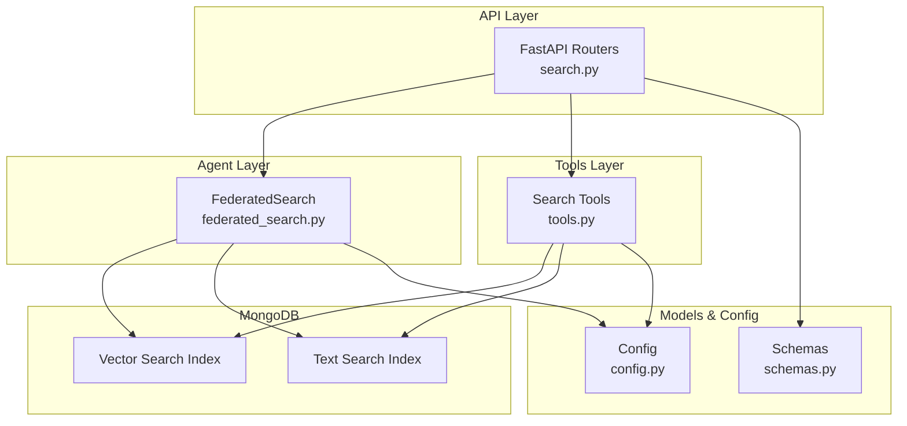
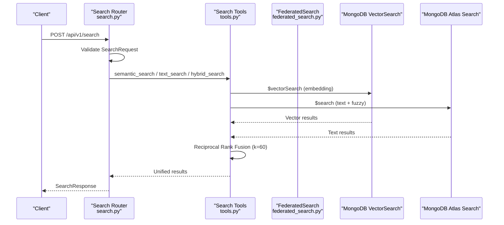
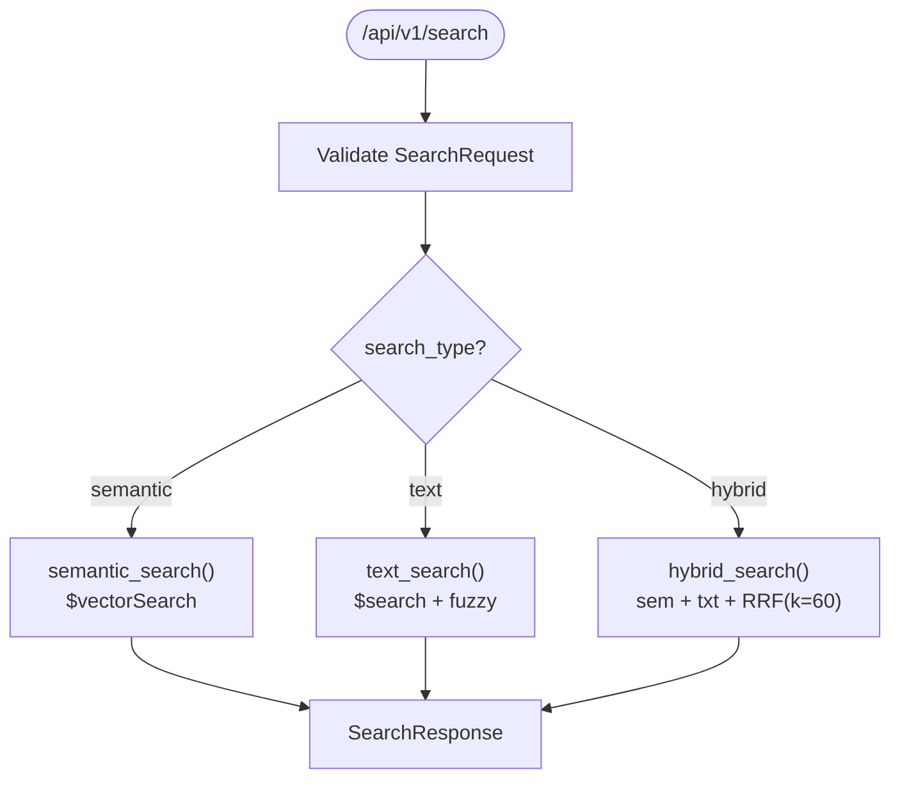
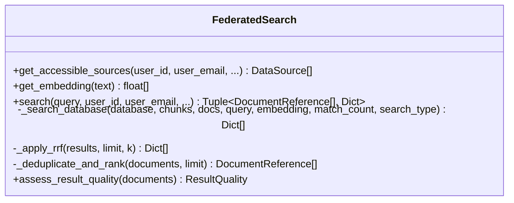
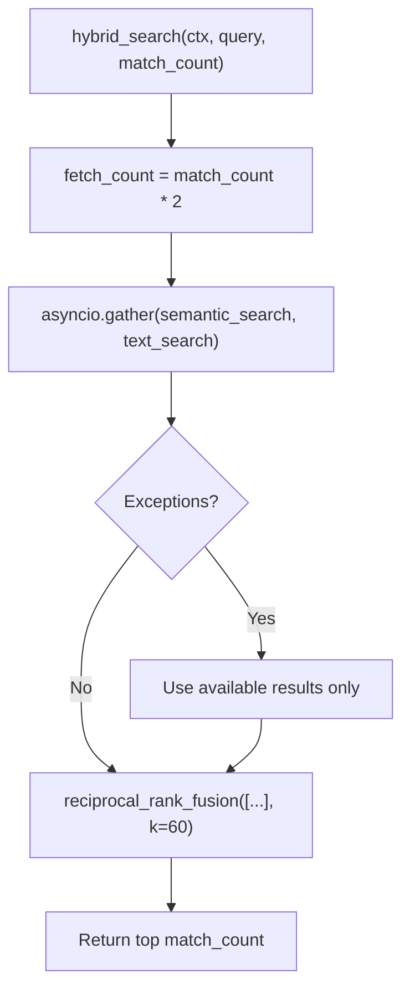
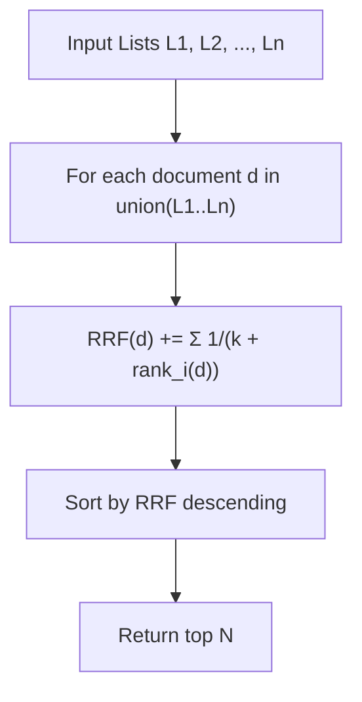
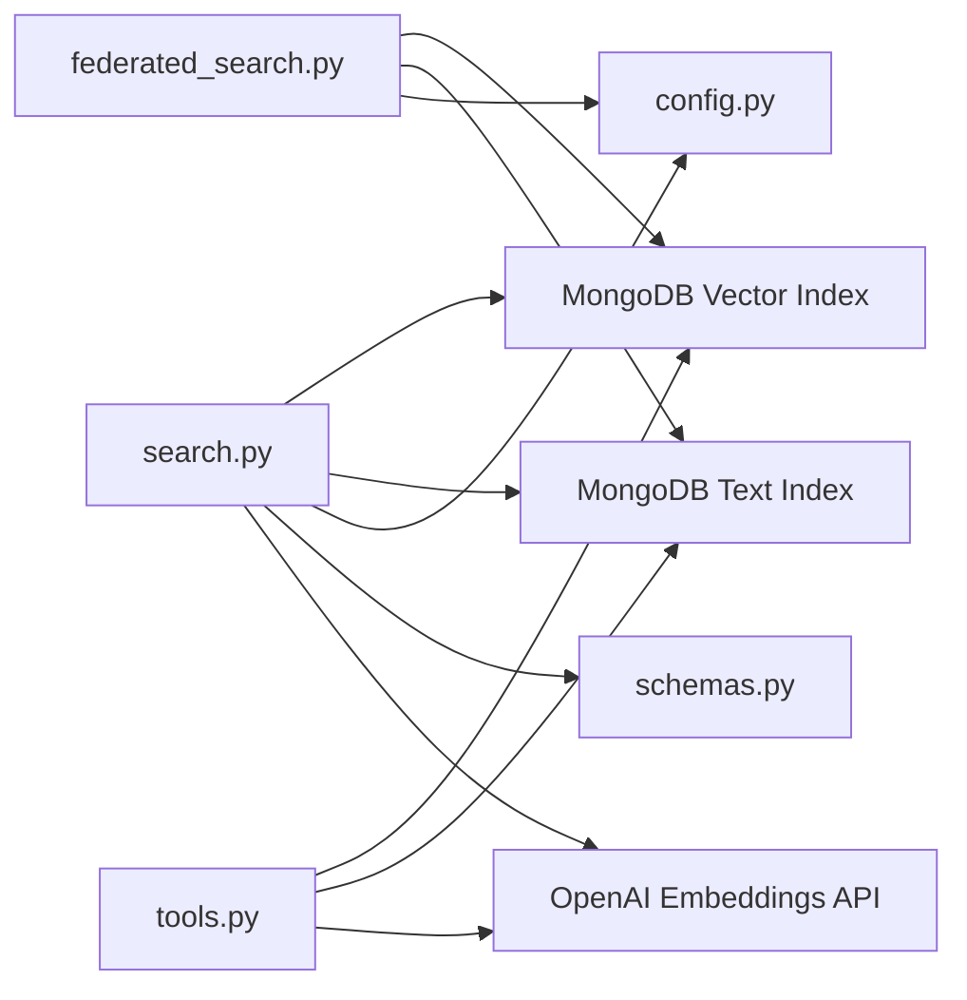

# Hybrid Search Engine

<cite>
**Referenced Files in This Document**
- [search.py](file://backend/routers/search.py)
- [federated_search.py](file://backend/agent/federated_search.py)
- [schemas.py](file://backend/models/schemas.py)
- [config.py](file://backend/core/config.py)
- [tools.py](file://src/tools.py)
- [main.py](file://backend/main.py)
- [test_search.py](file://backend/tests/test_search.py)
- [test_search.py](file://test_scripts/test_search.py)
</cite>

## Table of Contents
1. [Introduction](#introduction)
2. [Project Structure](#project-structure)
3. [Core Components](#core-components)
4. [Architecture Overview](#architecture-overview)
5. [Detailed Component Analysis](#detailed-component-analysis)
6. [Dependency Analysis](#dependency-analysis)
7. [Performance Considerations](#performance-considerations)
8. [Troubleshooting Guide](#troubleshooting-guide)
9. [Conclusion](#conclusion)

## Introduction
This document explains the hybrid search engine implementation that combines semantic vector search with full-text keyword search using Reciprocal Rank Fusion (RRF). The system provides three search modes: semantic-only, text-only, and hybrid. The hybrid approach leverages MongoDB Atlas Vector Search and Atlas Search operators, then merges results using RRF to achieve superior retrieval accuracy compared to individual methods.

## Project Structure
The hybrid search spans multiple layers:
- API layer: FastAPI routers expose `/api/v1/search/{semantic,text,hybrid}` endpoints and a unified `/api/v1/search` route.
- Agent layer: Federated search orchestrates multi-database searches with access control and RRF merging.
- Tools layer: Standalone search functions (semantic, text, hybrid) used by the agent and tools.
- Models and configuration: Pydantic schemas define request/response contracts and settings govern behavior.

**Diagram sources**
- [search.py](file://backend/routers/search.py#L1-L347)
- [federated_search.py](file://backend/agent/federated_search.py#L1-L535)
- [tools.py](file://src/tools.py#L1-L403)
- [schemas.py](file://backend/models/schemas.py#L1-L474)
- [config.py](file://backend/core/config.py#L1-L219)

**Section sources**
- [main.py](file://backend/main.py#L398-L500)
- [search.py](file://backend/routers/search.py#L1-L347)
- [federated_search.py](file://backend/agent/federated_search.py#L1-L535)
- [tools.py](file://src/tools.py#L1-L403)
- [schemas.py](file://backend/models/schemas.py#L1-L474)
- [config.py](file://backend/core/config.py#L1-L219)

## Core Components
- Search Router: Implements three endpoints and a unified route that selects the appropriate search method.
- Federated Search: Performs cross-database searches with access control and applies RRF merging.
- Search Tools: Provides semantic_search, text_search, and hybrid_search functions with concurrent execution and error handling.
- Schemas: Defines SearchRequest/SearchResponse/SearchType and validates match_count and search_type.
- Configuration: Centralized settings for MongoDB indexes, embedding models, and default limits.

**Section sources**
- [search.py](file://backend/routers/search.py#L34-L347)
- [federated_search.py](file://backend/agent/federated_search.py#L26-L535)
- [tools.py](file://src/tools.py#L27-L403)
- [schemas.py](file://backend/models/schemas.py#L61-L87)
- [config.py](file://backend/core/config.py#L23-L62)

## Architecture Overview
The hybrid search architecture integrates vector and text search with RRF fusion:

**Diagram sources**
- [search.py](file://backend/routers/search.py#L34-L347)
- [tools.py](file://src/tools.py#L27-L403)

**Section sources**
- [search.py](file://backend/routers/search.py#L34-L347)
- [tools.py](file://src/tools.py#L316-L403)

## Detailed Component Analysis

### Search Router Implementation
The router exposes:
- `/api/v1/search/semantic`: Vector similarity search using MongoDB Atlas Vector Search.
- `/api/v1/search/text`: Full-text search using Atlas Search with fuzzy matching.
- `/api/v1/search/hybrid`: Executes both and merges via RRF.
- `/api/v1/search`: Unified endpoint routing based on SearchType.

Key behaviors:
- Embedding generation via OpenAI embeddings API.
- Vector search pipeline with `$vectorSearch`, `$lookup`, `$unwind`, and `$project`.
- Text search pipeline with `$search`, fuzzy configuration, and similar projection.
- Hybrid search over-fetches results (2x match_count) and applies RRF with k=60.

**Diagram sources**
- [search.py](file://backend/routers/search.py#L34-L347)

**Section sources**
- [search.py](file://backend/routers/search.py#L17-L109)
- [search.py](file://backend/routers/search.py#L111-L187)
- [search.py](file://backend/routers/search.py#L190-L331)
- [search.py](file://backend/routers/search.py#L333-L347)

### Federated Search Implementation
FederatedSearch extends the hybrid approach across multiple databases:
- Determines accessible sources (profile, personal, cloud private/shared).
- Generates a single query embedding once.
- Executes vector and/or text search per database with over-fetch.
- Applies RRF merging per database and deduplicates across sources.
- Returns unified results with metadata and quality assessment.

**Diagram sources**
- [federated_search.py](file://backend/agent/federated_search.py#L26-L535)

**Section sources**
- [federated_search.py](file://backend/agent/federated_search.py#L61-L139)
- [federated_search.py](file://backend/agent/federated_search.py#L141-L272)
- [federated_search.py](file://backend/agent/federated_search.py#L273-L311)
- [federated_search.py](file://backend/agent/federated_search.py#L313-L463)
- [federated_search.py](file://backend/agent/federated_search.py#L465-L516)

### Search Tools (Agent Layer)
The tools module provides reusable search functions:
- semantic_search: Executes `$vectorSearch` with embedding generation and document lookup.
- text_search: Executes `$search` with fuzzy configuration and over-fetch for RRF.
- hybrid_search: Runs both concurrently, merges with RRF, and handles failures gracefully.

**Diagram sources**
- [tools.py](file://src/tools.py#L316-L403)
- [tools.py](file://src/tools.py#L242-L313)

**Section sources**
- [tools.py](file://src/tools.py#L27-L129)
- [tools.py](file://src/tools.py#L131-L240)
- [tools.py](file://src/tools.py#L242-L403)

### Mathematical Foundation: Reciprocal Rank Fusion (RRF)
RRF combines ranked lists from different search methods by aggregating reciprocal rank contributions:
- Formula: RRF_score(d) = Σᵢ 1 / (k + rankᵢ(d))
- k is a smoothing constant (standard value is 60).
- Automatic deduplication: Documents appearing in multiple lists are counted once.
- Scale independence: Works regardless of different scoring systems.

**Diagram sources**
- [tools.py](file://src/tools.py#L242-L313)
- [federated_search.py](file://backend/agent/federated_search.py#L273-L311)

**Section sources**
- [tools.py](file://src/tools.py#L242-L313)
- [federated_search.py](file://backend/agent/federated_search.py#L273-L311)

### Query Processing and Matching Algorithms
- Query embedding: Generated via OpenAI embeddings API using configured model and base URL.
- Vector similarity: `$vectorSearch` with configurable numCandidates and limit.
- Text matching: `$search` with fuzzy configuration (maxEdits, prefixLength) for typo tolerance.
- Projection: Extracts chunk_id, document_id, content, similarity score, metadata, and document title/source.

**Section sources**
- [search.py](file://backend/routers/search.py#L17-L31)
- [search.py](file://backend/routers/search.py#L51-L81)
- [search.py](file://backend/routers/search.py#L125-L160)
- [tools.py](file://src/tools.py#L56-L92)
- [tools.py](file://src/tools.py#L164-L203)

### Practical Examples: Hybrid vs Individual Methods
- Conceptual queries: Hybrid excels at finding semantically similar content even without exact keywords.
- Exact term queries: Text-only often finds precise matches; hybrid still benefits from semantic reinforcement.
- Fuzzy queries: Hybrid captures both exact and near-matching terms with semantic context.

These scenarios demonstrate how RRF promotes documents that rank highly in both methods, improving overall retrieval quality.

**Section sources**
- [tools.py](file://src/tools.py#L316-L403)

### Configuration Options and Tuning
Key configuration parameters:
- match_count: Controls number of results returned (validated 1–50).
- search_type: Selects semantic, text, or hybrid mode.
- text_weight: Present in schemas but unused in RRF-based hybrid.
- Over-fetch factor: Hybrid and text search fetch 2x match_count to improve RRF quality.
- MongoDB indexes: Vector index and text index names are configurable.
- Embedding model and API: Configurable provider, model, base URL, and dimension.

Operational tuning tips:
- Increase match_count for richer candidate sets when using RRF.
- Adjust k in RRF to balance consensus vs top-rank emphasis (default 60).
- Monitor processing_time_ms in responses for latency insights.

**Section sources**
- [schemas.py](file://backend/models/schemas.py#L61-L67)
- [schemas.py](file://backend/models/schemas.py#L80-L87)
- [config.py](file://backend/core/config.py#L23-L62)
- [tools.py](file://src/tools.py#L353-L354)
- [tools.py](file://src/tools.py#L179-L180)

## Dependency Analysis
The hybrid search depends on:
- MongoDB Atlas indexes: Vector index for `$vectorSearch`, text index for `$search`.
- Embedding provider: OpenAI embeddings API for query vector generation.
- FastAPI routers: Expose unified search endpoints.
- Pydantic models: Enforce request/response contracts and validation.

**Diagram sources**
- [search.py](file://backend/routers/search.py#L1-L347)
- [federated_search.py](file://backend/agent/federated_search.py#L1-L535)
- [tools.py](file://src/tools.py#L1-L403)
- [config.py](file://backend/core/config.py#L1-L219)
- [schemas.py](file://backend/models/schemas.py#L1-L474)

**Section sources**
- [search.py](file://backend/routers/search.py#L1-L347)
- [federated_search.py](file://backend/agent/federated_search.py#L1-L535)
- [tools.py](file://src/tools.py#L1-L403)
- [config.py](file://backend/core/config.py#L1-L219)
- [schemas.py](file://backend/models/schemas.py#L1-L474)

## Performance Considerations
- Concurrent execution: Hybrid and federated search run vector and text searches in parallel to reduce latency.
- Over-fetch strategy: Fetching 2x results improves RRF quality by providing better candidate diversity.
- Index selection: Properly configured vector and text indexes are critical for performance.
- Error resilience: Graceful degradation ensures partial results when one search method fails.
- Logging and monitoring: Track processing_time_ms and error rates to identify bottlenecks.

[No sources needed since this section provides general guidance]

## Troubleshooting Guide
Common issues and resolutions:
- Missing indexes: Vector or text index misconfiguration leads to OperationFailure. Verify index names in settings.
- Empty results: Queries with insufficient signal or missing data. Try broader queries or adjust match_count.
- Validation errors: Ensure match_count is within bounds (1–50) and search_type is valid.
- Timeout handling: Requests exceeding timeout thresholds return gateway timeout; consider reducing match_count or increasing server resources.
- Embedding failures: API key or model misconfiguration. Confirm embedding provider settings.

**Section sources**
- [test_search.py](file://backend/tests/test_search.py#L15-L98)
- [tools.py](file://src/tools.py#L119-L128)
- [tools.py](file://src/tools.py#L230-L239)
- [main.py](file://backend/main.py#L88-L141)

## Conclusion
The hybrid search engine delivers robust retrieval by combining semantic and textual signals with RRF fusion. It operates efficiently across MongoDB tiers, supports multi-database federation, and provides resilient, scalable search capabilities. By tuning match_count, leveraging over-fetch, and monitoring performance, teams can achieve high-quality results tailored to diverse query patterns.