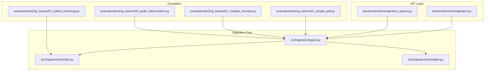
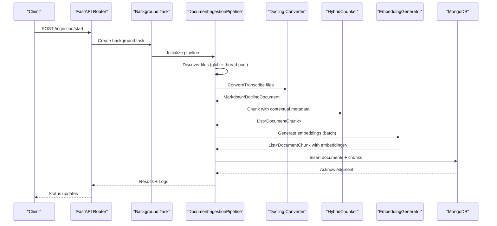
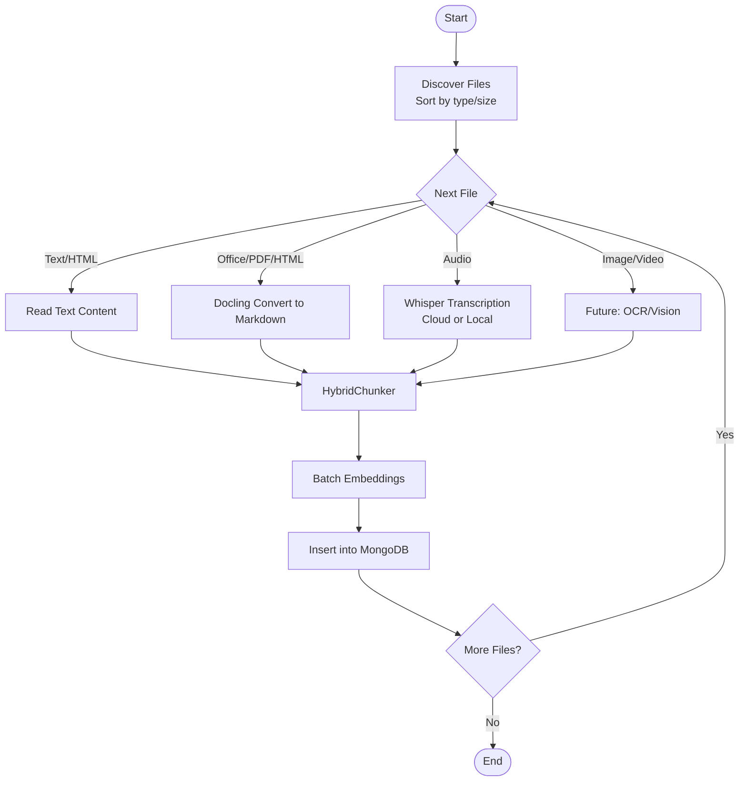
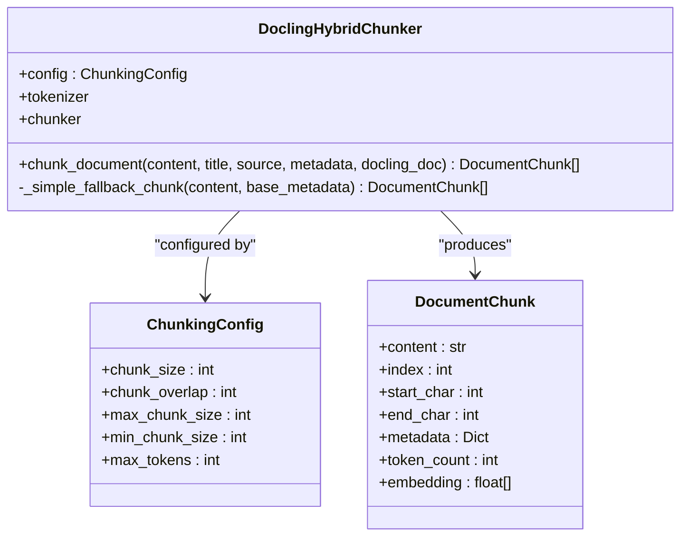
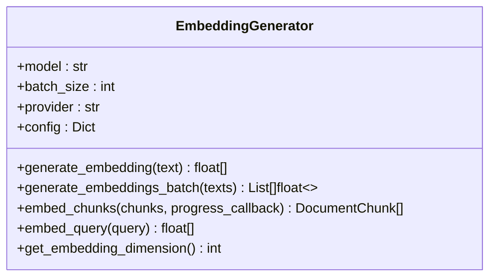
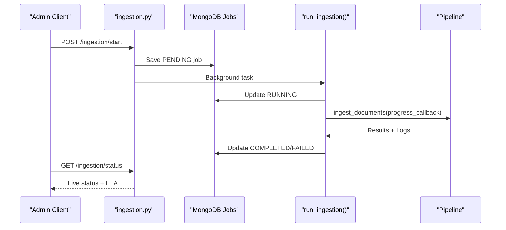
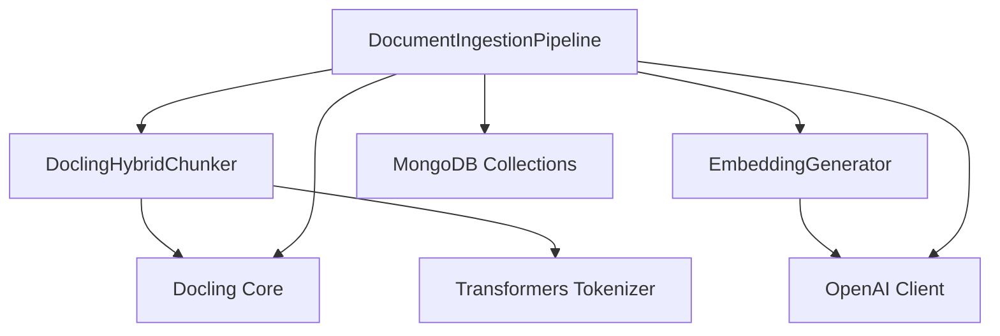

# Multi-Format Document Ingestion

<cite>
**Referenced Files in This Document**
- [README.md](file://README.md)
- [src/ingestion/ingest.py](file://src/ingestion/ingest.py)
- [src/ingestion/chunker.py](file://src/ingestion/chunker.py)
- [src/ingestion/embedder.py](file://src/ingestion/embedder.py)
- [backend/routers/ingestion.py](file://backend/routers/ingestion.py)
- [backend/routers/ingestion_queue.py](file://backend/routers/ingestion_queue.py)
- [examples/docling_basics/01_simple_pdf.py](file://examples/docling_basics/01_simple_pdf.py)
- [examples/docling_basics/02_multiple_formats.py](file://examples/docling_basics/02_multiple_formats.py)
- [examples/docling_basics/03_audio_transcription.py](file://examples/docling_basics/03_audio_transcription.py)
- [examples/docling_basics/04_hybrid_chunking.py](file://examples/docling_basics/04_hybrid_chunking.py)
</cite>

## Table of Contents
1. [Introduction](#introduction)
2. [Project Structure](#project-structure)
3. [Core Components](#core-components)
4. [Architecture Overview](#architecture-overview)
5. [Detailed Component Analysis](#detailed-component-analysis)
6. [Dependency Analysis](#dependency-analysis)
7. [Performance Considerations](#performance-considerations)
8. [Troubleshooting Guide](#troubleshooting-guide)
9. [Conclusion](#conclusion)

## Introduction
This document describes the multi-format document ingestion system that processes diverse file types (PDF, Word, PowerPoint, Excel, HTML, Markdown, audio, video, and images) into a searchable knowledge base using MongoDB Atlas. The system leverages Docling for robust document conversion and transcription, Docling HybridChunker for intelligent chunking that preserves document structure and fits embedding token limits, and a configurable embedding generator for vector storage. It supports both command-line and API-driven ingestion with advanced features such as incremental processing, queue management, scheduling, and graceful handling of interruptions.

## Project Structure
The ingestion system is implemented primarily in the `src/ingestion/` directory with supporting examples and backend routers for API orchestration:

- `src/ingestion/ingest.py`: Complete ingestion pipeline for MongoDB, including file discovery, format-specific processing, chunking, embeddings, and persistence.
- `src/ingestion/chunker.py`: Wrapper around Docling’s HybridChunker for intelligent, token-aware chunking.
- `src/ingestion/embedder.py`: Embedding generation with support for OpenAI and Ollama providers.
- `backend/routers/ingestion.py`: FastAPI endpoints to start, monitor, pause, and cancel ingestion jobs, persist job state, and stream logs.
- `backend/routers/ingestion_queue.py`: Advanced queue management, scheduling, and selective ingestion by file type.
- Example scripts demonstrating Docling usage for PDF parsing, multi-format processing, audio transcription, and hybrid chunking.

**Diagram sources**
- [src/ingestion/ingest.py](file://src/ingestion/ingest.py#L55-L125)
- [src/ingestion/chunker.py](file://src/ingestion/chunker.py#L68-L101)
- [src/ingestion/embedder.py](file://src/ingestion/embedder.py#L45-L86)
- [backend/routers/ingestion.py](file://backend/routers/ingestion.py#L411-L470)
- [backend/routers/ingestion_queue.py](file://backend/routers/ingestion_queue.py#L275-L372)
- [examples/docling_basics/01_simple_pdf.py](file://examples/docling_basics/01_simple_pdf.py#L20-L35)
- [examples/docling_basics/02_multiple_formats.py](file://examples/docling_basics/02_multiple_formats.py#L24-L64)
- [examples/docling_basics/03_audio_transcription.py](file://examples/docling_basics/03_audio_transcription.py#L42-L69)
- [examples/docling_basics/04_hybrid_chunking.py](file://examples/docling_basics/04_hybrid_chunking.py#L30-L60)

**Section sources**
- [README.md](file://README.md#L10-L14)
- [src/ingestion/ingest.py](file://src/ingestion/ingest.py#L169-L284)
- [backend/routers/ingestion.py](file://backend/routers/ingestion.py#L656-L700)
- [backend/routers/ingestion_queue.py](file://backend/routers/ingestion_queue.py#L135-L173)

## Core Components
- DocumentIngestionPipeline: Orchestrates end-to-end ingestion, including file discovery, format detection, conversion/transcription, chunking, embedding, and MongoDB persistence.
- DoclingHybridChunker: Token-aware chunking that respects document structure and semantic boundaries.
- EmbeddingGenerator: Batch embedding generation supporting multiple providers and models.
- API Routers: Background ingestion execution, job persistence, progress reporting, pause/resume/cancel, and queue/scheduling management.

Key capabilities:
- Multi-format support: PDF, Word, PowerPoint, Excel, HTML, Markdown, images, audio, and video.
- Intelligent chunking with contextual metadata and token limits.
- Provider-agnostic embeddings with configurable batch sizes.
- Incremental ingestion with deduplication against existing sources.
- Robust error handling, logging, and recovery for interrupted jobs.

**Section sources**
- [src/ingestion/ingest.py](file://src/ingestion/ingest.py#L55-L125)
- [src/ingestion/chunker.py](file://src/ingestion/chunker.py#L68-L101)
- [src/ingestion/embedder.py](file://src/ingestion/embedder.py#L45-L86)
- [backend/routers/ingestion.py](file://backend/routers/ingestion.py#L411-L470)

## Architecture Overview
The ingestion pipeline follows an asynchronous, event-driven architecture with clear separation of concerns:

**Diagram sources**
- [backend/routers/ingestion.py](file://backend/routers/ingestion.py#L411-L650)
- [src/ingestion/ingest.py](file://src/ingestion/ingest.py#L856-L950)
- [src/ingestion/chunker.py](file://src/ingestion/chunker.py#L102-L186)
- [src/ingestion/embedder.py](file://src/ingestion/embedder.py#L136-L196)

## Detailed Component Analysis

### DocumentIngestionPipeline
Responsibilities:
- File discovery across multiple folders with optimal processing order (by type and size).
- Format-specific processing:
  - Text/HTML/Markdown: direct read.
  - Office/PDF/HTML: Docling conversion to markdown.
  - Audio: Whisper transcription via OpenAI API, chunked processing for large files, or local fallback.
  - Images/Video: Future extensions for OCR/vision processing.
- Chunking with Docling HybridChunker and metadata enrichment.
- Embedding generation with batching and progress reporting.
- MongoDB persistence with atomic inserts and cleanup options.
- Incremental mode with deduplication by source path.

Processing workflow highlights:
- Thread pool usage for CPU-intensive operations (file discovery, reading) to keep the event loop responsive.
- Graceful handling of failures with per-file results and aggregated summaries.
- Real-time progress callbacks for UI/API responsiveness.

**Diagram sources**
- [src/ingestion/ingest.py](file://src/ingestion/ingest.py#L169-L284)
- [src/ingestion/ingest.py](file://src/ingestion/ingest.py#L286-L356)
- [src/ingestion/ingest.py](file://src/ingestion/ingest.py#L357-L702)
- [src/ingestion/chunker.py](file://src/ingestion/chunker.py#L102-L186)
- [src/ingestion/embedder.py](file://src/ingestion/embedder.py#L136-L196)
- [src/ingestion/ingest.py](file://src/ingestion/ingest.py#L770-L836)

**Section sources**
- [src/ingestion/ingest.py](file://src/ingestion/ingest.py#L55-L125)
- [src/ingestion/ingest.py](file://src/ingestion/ingest.py#L169-L284)
- [src/ingestion/ingest.py](file://src/ingestion/ingest.py#L286-L356)
- [src/ingestion/ingest.py](file://src/ingestion/ingest.py#L357-L702)
- [src/ingestion/ingest.py](file://src/ingestion/ingest.py#L770-L836)

### Docling HybridChunker
- Uses a tokenizer to ensure chunks fit embedding model token limits.
- Respects document structure (headings, sections, tables) and semantic boundaries.
- Provides contextualized chunks with metadata for downstream RAG quality.
- Falls back to simple sliding-window chunking if DoclingDocument is unavailable.

**Diagram sources**
- [src/ingestion/chunker.py](file://src/ingestion/chunker.py#L33-L48)
- [src/ingestion/chunker.py](file://src/ingestion/chunker.py#L50-L60)
- [src/ingestion/chunker.py](file://src/ingestion/chunker.py#L68-L101)
- [src/ingestion/chunker.py](file://src/ingestion/chunker.py#L102-L186)

**Section sources**
- [src/ingestion/chunker.py](file://src/ingestion/chunker.py#L68-L101)
- [src/ingestion/chunker.py](file://src/ingestion/chunker.py#L102-L186)
- [src/ingestion/chunker.py](file://src/ingestion/chunker.py#L187-L256)

### EmbeddingGenerator
- Supports OpenAI and Ollama embedding providers with model-specific configurations.
- Batch processing with configurable batch size and truncation to token limits.
- Progress reporting and yield control to keep API requests responsive during heavy ingestion.

**Diagram sources**
- [src/ingestion/embedder.py](file://src/ingestion/embedder.py#L45-L86)
- [src/ingestion/embedder.py](file://src/ingestion/embedder.py#L88-L134)
- [src/ingestion/embedder.py](file://src/ingestion/embedder.py#L136-L196)

**Section sources**
- [src/ingestion/embedder.py](file://src/ingestion/embedder.py#L45-L86)
- [src/ingestion/embedder.py](file://src/ingestion/embedder.py#L136-L196)

### API Orchestration and Queue Management
- Background ingestion with persistent job state, logs, and real-time status.
- Pause/resume/cancel with graceful interruption and automatic recovery after restart.
- Queue management for prioritized, scheduled, and selective ingestion by file type.
- File type filtering and scheduling with cron-like frequencies.

**Diagram sources**
- [backend/routers/ingestion.py](file://backend/routers/ingestion.py#L656-L700)
- [backend/routers/ingestion.py](file://backend/routers/ingestion.py#L411-L650)
- [backend/routers/ingestion.py](file://backend/routers/ingestion.py#L703-L793)

**Section sources**
- [backend/routers/ingestion.py](file://backend/routers/ingestion.py#L411-L650)
- [backend/routers/ingestion.py](file://backend/routers/ingestion.py#L703-L793)
- [backend/routers/ingestion_queue.py](file://backend/routers/ingestion_queue.py#L135-L173)
- [backend/routers/ingestion_queue.py](file://backend/routers/ingestion_queue.py#L376-L428)

## Dependency Analysis
- External libraries:
  - Docling for document conversion and transcription.
  - Transformers tokenizer for token-aware chunking.
  - PyMongo for asynchronous MongoDB operations.
  - OpenAI client for Whisper transcription.
  - Optional pydub for chunked audio processing.
- Internal dependencies:
  - Chunker depends on DoclingHybridChunker and tokenizer.
  - Embedder depends on provider configuration and model settings.
  - Pipeline coordinates chunker and embedder, persists to MongoDB.

**Diagram sources**
- [src/ingestion/ingest.py](file://src/ingestion/ingest.py#L113-L123)
- [src/ingestion/chunker.py](file://src/ingestion/chunker.py#L88-L98)
- [src/ingestion/embedder.py](file://src/ingestion/embedder.py#L23-L30)

**Section sources**
- [src/ingestion/ingest.py](file://src/ingestion/ingest.py#L113-L123)
- [src/ingestion/chunker.py](file://src/ingestion/chunker.py#L88-L98)
- [src/ingestion/embedder.py](file://src/ingestion/embedder.py#L23-L30)

## Performance Considerations
- Parallelism:
  - Thread pool for file discovery and CPU-heavy operations to keep the event loop responsive.
  - Batching for embedding generation to reduce API overhead.
  - Chunked audio transcription with parallel processing for large files.
- Scheduling and ordering:
  - Optimal processing order: small text files first, then PDF/Office, images, audio, video, and large files last.
  - Incremental mode avoids reprocessing existing sources.
- Resource management:
  - Configurable batch sizes and token limits to balance throughput and cost.
  - Yield control between major steps to maintain responsiveness.

[No sources needed since this section provides general guidance]

## Troubleshooting Guide
Common issues and resolutions:
- Missing FFmpeg for audio transcription:
  - Ensure FFmpeg is installed and in PATH; the audio transcription examples demonstrate required installation steps.
- Offline mode configuration:
  - Set environment variables for offline audio and vision models; ingestion checks offline configuration before transcription.
- Large audio files:
  - Use chunked transcription to stay within API limits and improve speed.
- Interrupted ingestion:
  - Jobs marked as interrupted can be resumed after restart; the system recovers and continues from where it left off.
- Provider configuration:
  - Verify embedding provider keys and model settings; the embedder supports multiple providers with model-specific configs.

**Section sources**
- [examples/docling_basics/03_audio_transcription.py](file://examples/docling_basics/03_audio_transcription.py#L15-L30)
- [backend/routers/ingestion.py](file://backend/routers/ingestion.py#L371-L409)
- [src/ingestion/ingest.py](file://src/ingestion/ingest.py#L396-L405)
- [backend/routers/ingestion.py](file://backend/routers/ingestion.py#L133-L171)

## Conclusion
The multi-format document ingestion system provides a robust, scalable solution for converting diverse content into a searchable knowledge base. By leveraging Docling for reliable conversion and transcription, intelligent chunking for semantic coherence, and configurable embeddings for vector storage, it supports both batch and API-driven workflows. Advanced features such as incremental ingestion, queue management, scheduling, and graceful interruption handling make it suitable for production environments with varied document types and processing needs.