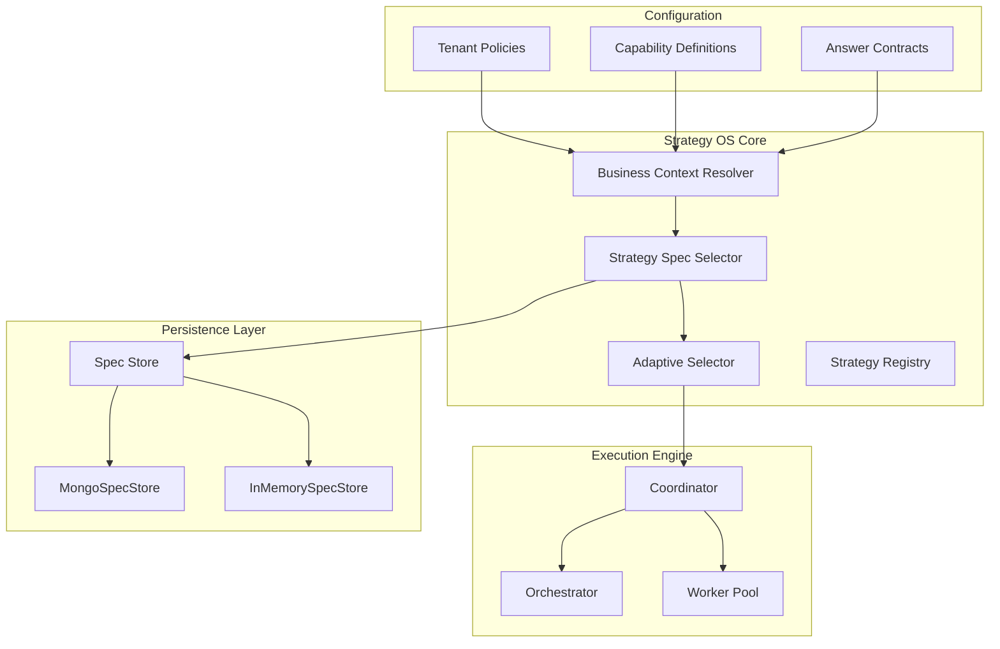
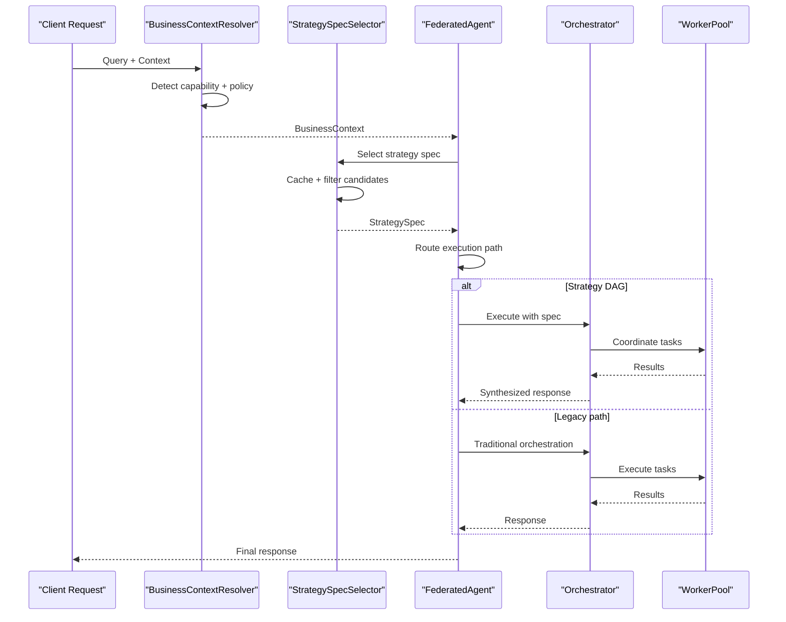
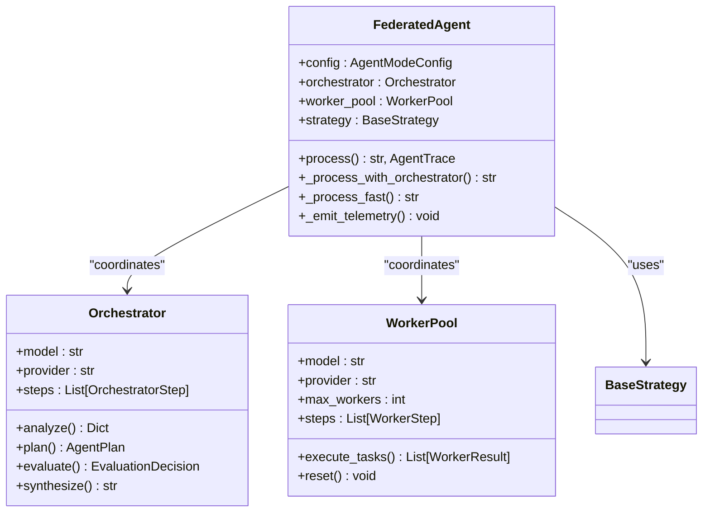
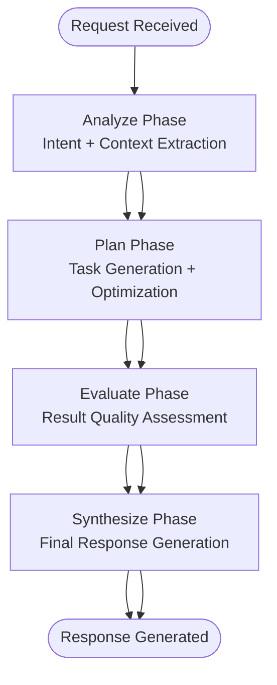
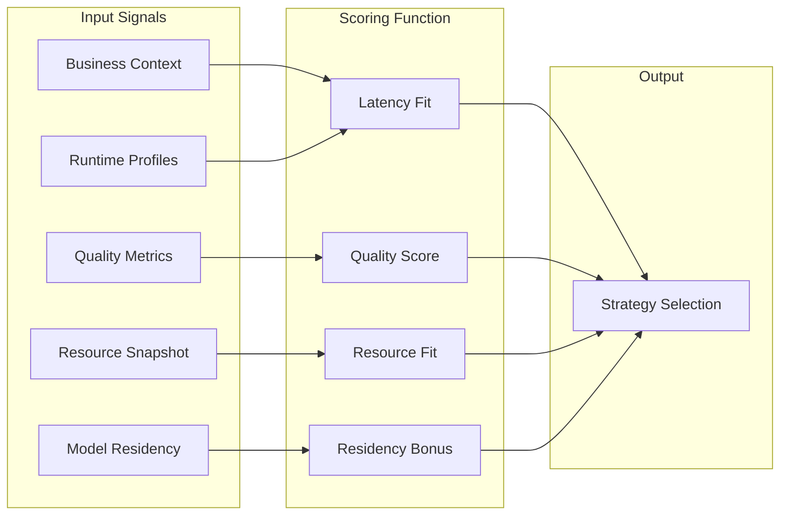
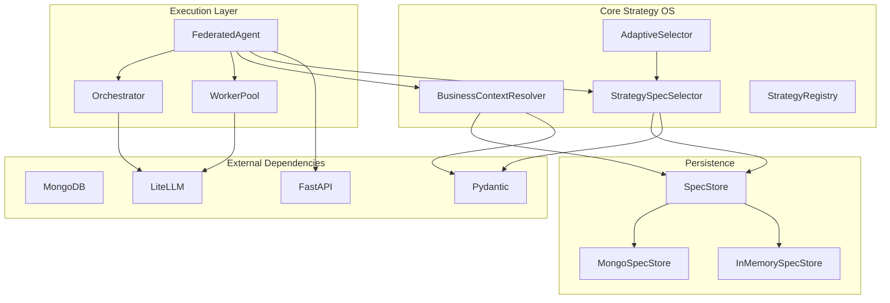

# Strategy Operating System

<cite>
**Referenced Files in This Document**
- [main.py](file://backend/main.py)
- [coordinator.py](file://backend/agent/coordinator.py)
- [orchestrator.py](file://backend/agent/orchestrator.py)
- [worker_pool.py](file://backend/agent/worker_pool.py)
- [tool_gate.py](file://backend/agent/tool_gate.py)
- [base.py](file://backend/agent/strategies/base.py)
- [registry.py](file://backend/agent/strategies/registry.py)
- [spec_store.py](file://backend/agent/strategy/spec_store.py)
- [spec_selector.py](file://backend/agent/strategy/spec_selector.py)
- [business_context_resolver.py](file://backend/agent/strategy/business_context_resolver.py)
</cite>

## Table of Contents
1. [Introduction](#introduction)
2. [Project Structure](#project-structure)
3. [Core Components](#core-components)
4. [Architecture Overview](#architecture-overview)
5. [Detailed Component Analysis](#detailed-component-analysis)
6. [Dependency Analysis](#dependency-analysis)
7. [Performance Considerations](#performance-considerations)
8. [Troubleshooting Guide](#troubleshooting-guide)
9. [Conclusion](#conclusion)

## Introduction
The Strategy Operating System (Strategy OS) is a sophisticated orchestration framework that powers intelligent, adaptive agent behavior within the RecallHub platform. It provides a modular, extensible architecture for selecting and executing domain-specific strategies based on business context, tenant policies, and runtime conditions. The system seamlessly integrates with the broader agent ecosystem, enabling dynamic routing between traditional orchestration and advanced strategy-driven execution paths.

The Strategy OS operates through several key phases: business context resolution, capability detection, strategy specification selection, adaptive routing, and execution orchestration. It maintains comprehensive observability through telemetry, supports tenant-specific configurations, and provides robust error handling and fallback mechanisms.

## Project Structure
The Strategy OS is organized into several interconnected subsystems within the backend agent architecture:

**Diagram sources**
- [business_context_resolver.py:31-164](file://backend/agent/strategy/business_context_resolver.py#L31-L164)
- [spec_selector.py:118-260](file://backend/agent/strategy/spec_selector.py#L118-L260)
- [coordinator.py:182-256](file://backend/agent/coordinator.py#L182-L256)

The system follows a layered architecture pattern with clear separation of concerns between business logic, persistence, and execution orchestration.

**Section sources**
- [main.py:300-391](file://backend/main.py#L300-L391)
- [coordinator.py:182-256](file://backend/agent/coordinator.py#L182-L256)

## Core Components

### Business Context Resolver
The Business Context Resolver serves as the intelligence engine that interprets user queries and organizational context to determine appropriate strategy execution. It processes tenant policies, capability definitions, and answer contracts to produce a comprehensive business context envelope.

Key capabilities include:
- **Capability Detection**: Uses deterministic keyword matching and pattern recognition to identify business domains
- **Ambiguity Resolution**: Provides confidence scores and alternative interpretations for ambiguous queries
- **Source Policy Intersection**: Combines tenant, profile, and strategy policies through restrictive semantics
- **Answer Contract Resolution**: Links detected capabilities to predefined response formats and requirements

**Section sources**
- [business_context_resolver.py:111-164](file://backend/agent/strategy/business_context_resolver.py#L111-L164)
- [business_context_resolver.py:166-218](file://backend/agent/strategy/business_context_resolver.py#L166-L218)

### Strategy Specification Store
The Spec Store provides persistent storage for strategy specifications with support for both in-memory and MongoDB backends. It implements optimistic locking through version counters and maintains audit trails for all modifications.

Core features:
- **Dual Backend Support**: InMemorySpecStore for testing and MongoSpecStore for production
- **Optimistic Locking**: Prevents concurrent write conflicts through version_counter validation
- **Snapshot Management**: Maintains complete version history with lazy hydration for MongoDB
- **Audit Logging**: Comprehensive tracking of all specification changes

**Section sources**
- [spec_store.py:326-506](file://backend/agent/strategy/spec_store.py#L326-L506)
- [spec_store.py:225-281](file://backend/agent/strategy/spec_store.py#L225-L281)

### Strategy Specification Selector
The Strategy Spec Selector implements intelligent routing logic that chooses optimal strategies based on capability, tenant context, and runtime constraints. It provides caching mechanisms and fallback capabilities for robust operation.

Selection criteria include:
- **Tenant Scope Matching**: Prefers exact tenant matches over broader scopes
- **Recency Priority**: Selects most recently updated specifications
- **Runtime Filters**: Applies privacy and agent-mode constraints
- **Adaptive Scoring**: Extensible framework for performance-based routing

**Section sources**
- [spec_selector.py:171-260](file://backend/agent/strategy/spec_selector.py#L171-L260)
- [spec_selector.py:436-459](file://backend/agent/strategy/spec_selector.py#L436-L459)

### Strategy Registry
The Strategy Registry manages the lifecycle of all available strategies, providing registration, discovery, and instantiation capabilities. It supports both domain-specific and general-purpose strategies with automatic detection based on query content.

**Section sources**
- [registry.py:112-160](file://backend/agent/strategies/registry.py#L112-L160)
- [registry.py:255-315](file://backend/agent/strategies/registry.py#L255-L315)

## Architecture Overview

The Strategy Operating System implements a multi-layered architecture that seamlessly integrates with the broader RecallHub agent ecosystem:

**Diagram sources**
- [coordinator.py:606-796](file://backend/agent/coordinator.py#L606-L796)
- [business_context_resolver.py:111-164](file://backend/agent/strategy/business_context_resolver.py#L111-L164)
- [spec_selector.py:171-260](file://backend/agent/strategy/spec_selector.py#L171-L260)

The architecture supports both traditional orchestration and advanced strategy-driven execution, with automatic fallback mechanisms and comprehensive observability.

**Section sources**
- [coordinator.py:367-452](file://backend/agent/coordinator.py#L367-L452)
- [orchestrator.py:341-385](file://backend/agent/orchestrator.py#L341-L385)

## Detailed Component Analysis

### Federated Agent Coordinator
The Federated Agent Coordinator serves as the central orchestrator that manages the interaction between the Orchestrator, WorkerPool, and Strategy OS components. It implements sophisticated routing logic that determines whether to use traditional orchestration or advanced strategy execution based on business context and system configuration.

Key responsibilities include:
- **Strategy Resolution**: Determining which strategy to execute based on business context
- **Execution Routing**: Deciding between legacy orchestration and strategy DAG execution
- **Telemetry Integration**: Capturing comprehensive execution metrics and traces
- **Error Handling**: Providing fallback mechanisms and graceful degradation

**Diagram sources**
- [coordinator.py:182-256](file://backend/agent/coordinator.py#L182-L256)
- [orchestrator.py:83-136](file://backend/agent/orchestrator.py#L83-L136)
- [worker_pool.py:39-106](file://backend/agent/worker_pool.py#L39-L106)

**Section sources**
- [coordinator.py:182-256](file://backend/agent/coordinator.py#L182-L256)
- [coordinator.py:606-796](file://backend/agent/coordinator.py#L606-L796)

### Strategy Execution Engine
The execution engine consists of two complementary components that work together to provide flexible and efficient processing capabilities.

The Orchestrator handles high-level reasoning and planning, using specialized prompts for each phase of the process. It implements sophisticated token management, repetition detection, and quality assessment to ensure reliable output generation.

The WorkerPool provides parallel task execution capabilities with support for various task types including database searches, web searches, content summarization, and query refinement. It implements intelligent dependency resolution and quality assessment for all executed tasks.

**Diagram sources**
- [orchestrator.py:341-385](file://backend/agent/orchestrator.py#L341-L385)
- [orchestrator.py:457-560](file://backend/agent/orchestrator.py#L457-L560)

**Section sources**
- [orchestrator.py:341-560](file://backend/agent/orchestrator.py#L341-L560)
- [worker_pool.py:114-194](file://backend/agent/worker_pool.py#L114-L194)

### Adaptive Strategy Selection
The adaptive selection system extends basic strategy routing with machine learning-inspired scoring mechanisms that consider multiple factors including latency performance, quality metrics, resource availability, and model residency.

**Diagram sources**
- [spec_selector.py:575-673](file://backend/agent/strategy/spec_selector.py#L575-L673)
- [spec_selector.py:676-800](file://backend/agent/strategy/spec_selector.py#L676-L800)

**Section sources**
- [spec_selector.py:575-800](file://backend/agent/strategy/spec_selector.py#L575-L800)

## Dependency Analysis

The Strategy Operating System exhibits a well-designed dependency structure with clear boundaries between components:

**Diagram sources**
- [spec_store.py:326-375](file://backend/agent/strategy/spec_store.py#L326-L375)
- [coordinator.py:182-256](file://backend/agent/coordinator.py#L182-L256)

The dependency analysis reveals a clean separation of concerns with minimal circular dependencies. The system leverages external libraries for LLM interactions and data validation while maintaining internal consistency through well-defined interfaces.

**Section sources**
- [main.py:28-50](file://backend/main.py#L28-L50)
- [coordinator.py:20-51](file://backend/agent/coordinator.py#L20-L51)

## Performance Considerations

The Strategy Operating System implements several performance optimization strategies:

### Caching Strategy
- **Spec Selection Cache**: 5-minute TTL for store-resolved entries, 1-minute for legacy fallback
- **Adaptive Decision Cache**: Shared cache across selector layers with configurable TTL
- **Strategy Instance Cache**: Singleton pattern for strategy instances to avoid repeated instantiation

### Concurrency Management
- **Thread Pool Configuration**: 32 concurrent workers for async operations
- **Worker Pool Parallelism**: Configurable max_workers with intelligent batching
- **Task Dependency Resolution**: Efficient parallel execution with dependency-aware scheduling

### Memory Optimization
- **Lazy Loading**: MongoDB mirror hydration only when needed
- **Snapshot Management**: In-memory mirrors reduce database round trips
- **Resource Cleanup**: Proper cleanup of HTTP clients and LLM connections

### Observability and Monitoring
- **Comprehensive Telemetry**: End-to-end tracing with detailed metrics
- **Performance Metrics**: Latency tracking, token usage monitoring, and quality assessment
- **Health Checks**: Built-in monitoring for LLM providers and database connectivity

**Section sources**
- [main.py:66-72](file://backend/main.py#L66-L72)
- [worker_pool.py:107-112](file://backend/agent/worker_pool.py#L107-L112)
- [spec_selector.py:81-84](file://backend/agent/strategy/spec_selector.py#L81-L84)

## Troubleshooting Guide

### Common Issues and Solutions

**Strategy Resolution Failures**
- Verify tenant policy configuration exists in `backend/config/tenant_strategy_policies/`
- Check capability definitions in `backend/config/capabilities/`
- Ensure strategy specifications are properly loaded in MongoDB

**Performance Degradation**
- Monitor thread pool utilization and adjust worker counts
- Check MongoDB connection pooling and index usage
- Review LLM provider response times and retry policies

**Execution Errors**
- Enable debug logging for detailed error traces
- Verify tool gate configurations for disabled operations
- Check model provider credentials and API limits

**Section sources**
- [business_context_resolver.py:60-73](file://backend/agent/strategy/business_context_resolver.py#L60-L73)
- [tool_gate.py:40-48](file://backend/agent/tool_gate.py#L40-L48)

### Debugging Tools and Techniques

The system provides comprehensive debugging capabilities:
- **Request ID Tracking**: Unique correlation IDs for end-to-end request tracing
- **Telemetry Integration**: Detailed metrics capture for performance analysis
- **Error Classification**: Structured error reporting with technical details for administrators
- **Fallback Mechanisms**: Graceful degradation when components fail

**Section sources**
- [coordinator.py:644-756](file://backend/agent/coordinator.py#L644-L756)
- [main.py:618-756](file://backend/main.py#L618-L756)

## Conclusion

The Strategy Operating System represents a sophisticated and well-architected solution for intelligent agent strategy management. Its modular design, comprehensive observability, and robust error handling mechanisms provide a solid foundation for scalable AI-powered applications.

Key strengths of the system include:
- **Modular Architecture**: Clear separation of concerns with well-defined interfaces
- **Adaptive Intelligence**: Machine learning-inspired routing with performance-based optimization
- **Tenant Flexibility**: Comprehensive configuration management for diverse organizational needs
- **Production Ready**: Robust error handling, caching, and monitoring capabilities
- **Extensible Design**: Plugin architecture supporting custom strategies and integrations

The system successfully balances flexibility with reliability, providing both powerful automation capabilities and comprehensive control mechanisms for enterprise deployment scenarios.