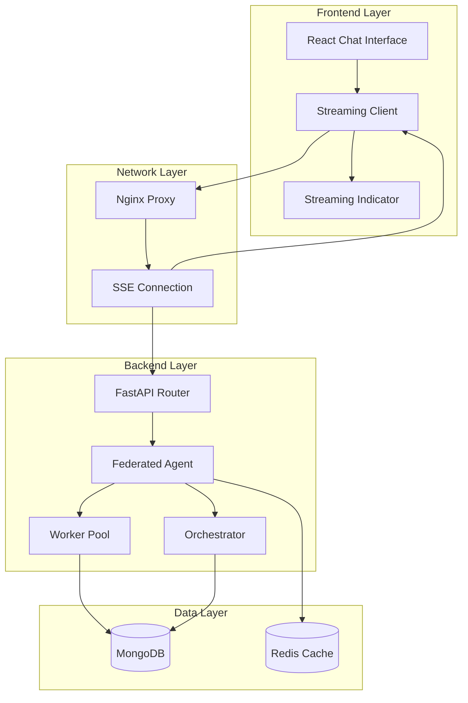
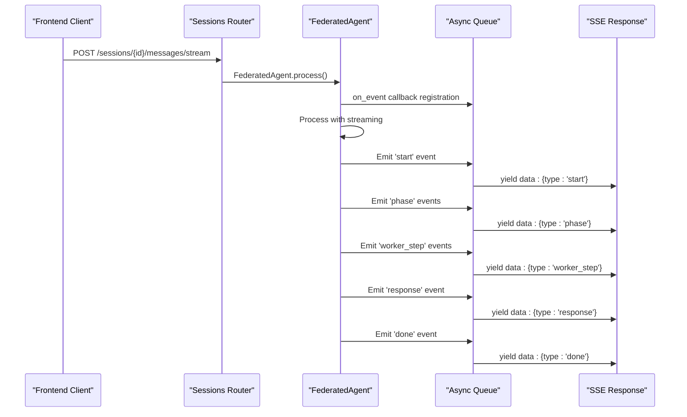
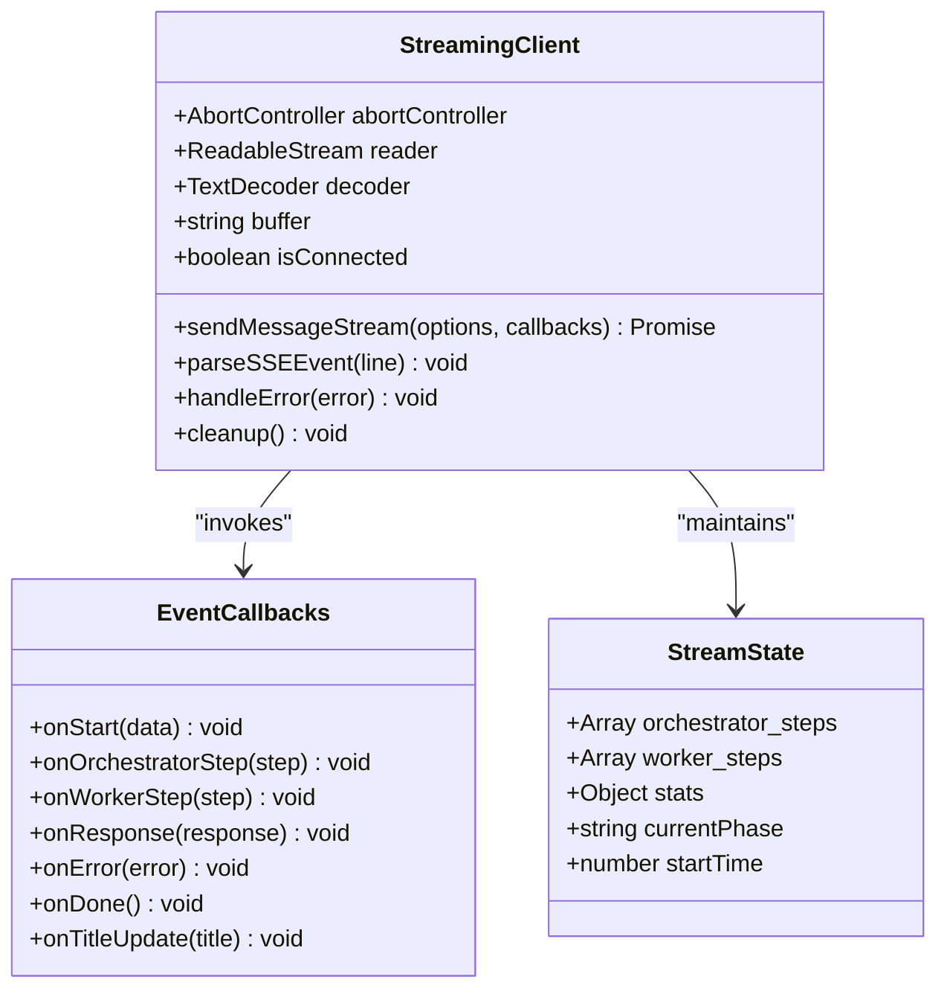
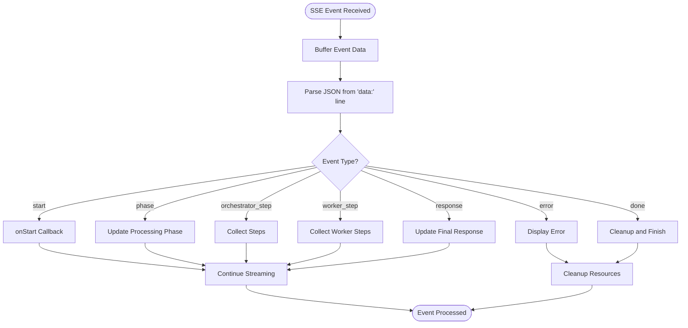
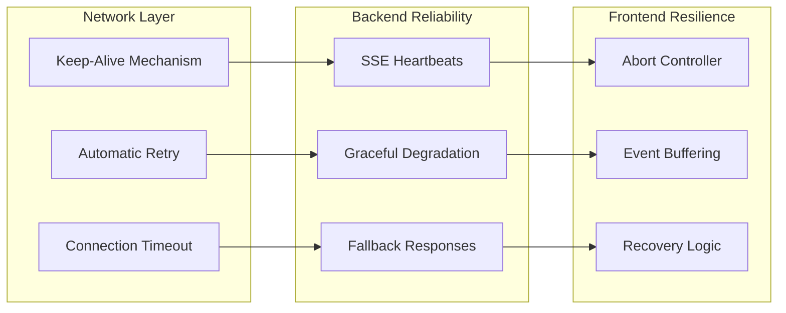
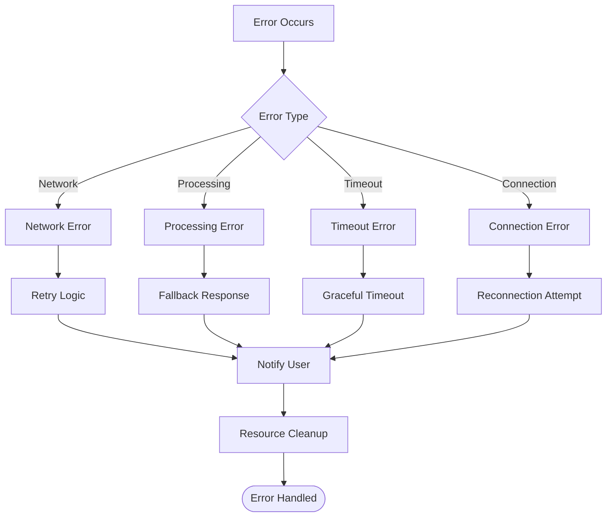
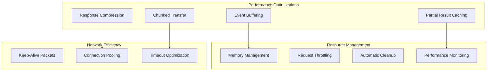
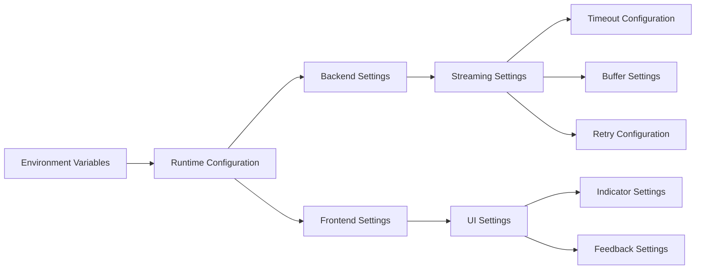
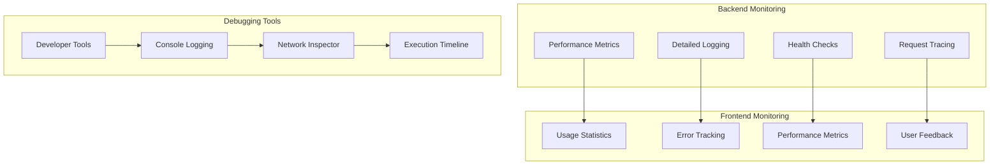

# Streaming Reliability Enhancements

<cite>
**Referenced Files in This Document**
- [sessions.py](file://backend/routers/sessions.py)
- [client.ts](file://frontend/src/api/client.ts)
- [ChatPageNew.tsx](file://frontend/src/pages/ChatPageNew.tsx)
- [StreamingIndicator.tsx](file://frontend/src/components/StreamingIndicator.tsx)
- [coordinator.py](file://backend/agent/coordinator.py)
- [orchestrator.py](file://backend/agent/orchestrator.py)
- [main.py](file://backend/main.py)
- [nginx.conf](file://frontend/nginx.conf)
- [SYSTEM_BLUEPRINT.md](file://SYSTEM_BLUEPRINT.md)
- [config.py](file://backend/core/config.py)
</cite>

## Table of Contents
1. [Introduction](#introduction)
2. [Streaming Architecture Overview](#streaming-architecture-overview)
3. [Backend Streaming Implementation](#backend-streaming-implementation)
4. [Frontend Streaming Client](#frontend-streaming-client)
5. [Reliability Mechanisms](#reliability-mechanisms)
6. [Error Handling and Recovery](#error-handling-and-recovery)
7. [Performance Optimizations](#performance-optimizations)
8. [Configuration Management](#configuration-management)
9. [Monitoring and Debugging](#monitoring-and-debugging)
10. [Best Practices](#best-practices)

## Introduction

The Streaming Reliability Enhancements project focuses on implementing robust, fault-tolerant streaming capabilities for the MongoDB RAG Agent system. This comprehensive solution ensures reliable real-time communication between the frontend and backend through Server-Sent Events (SSE), with built-in mechanisms for handling network interruptions, timeouts, and partial failures.

The system provides real-time streaming of AI agent processing phases, worker task execution updates, and final response delivery, while maintaining high availability and performance under various network conditions.

## Streaming Architecture Overview

The streaming architecture follows a client-server pattern using Server-Sent Events (SSE) for bidirectional real-time communication. The system consists of three main layers: frontend streaming client, backend event streaming service, and agent processing pipeline.

**Diagram sources**
- [sessions.py:1180-1379](file://backend/routers/sessions.py#L1180-L1379)
- [client.ts:1440-1639](file://frontend/src/api/client.ts#L1440-L1639)
- [ChatPageNew.tsx:327-456](file://frontend/src/pages/ChatPageNew.tsx#L327-L456)

## Backend Streaming Implementation

The backend streaming implementation centers around the `FederatedAgent` class and the `/sessions/{session_id}/messages/stream` endpoint. The system uses asynchronous queues and event callbacks to stream real-time updates during agent processing.

### Core Streaming Components

The streaming system employs several key components for reliable event delivery:

**Diagram sources**
- [sessions.py:1180-1379](file://backend/routers/sessions.py#L1180-L1379)
- [coordinator.py:184-251](file://backend/agent/coordinator.py#L184-L251)

### Event Streaming Protocol

The backend implements a structured event streaming protocol with specific event types:

| Event Type | Purpose | Payload Structure |
|------------|---------|-------------------|
| `start` | Initial connection acknowledgment | `{mode, models}` |
| `phase` | Processing phase transitions | `{phase, status}` |
| `orchestrator_step` | Orchestrator processing updates | `{phase, reasoning, duration_ms, tokens}` |
| `worker_step` | Worker task execution updates | `{task_id, task_type, documents_count, duration_ms}` |
| `response` | Final response with sources | `{content, sources, stats, trace}` |
| `error` | Error notifications | `{message}` |
| `done` | Stream completion signal | `{}` |

**Section sources**
- [sessions.py:1180-1379](file://backend/routers/sessions.py#L1180-L1379)
- [coordinator.py:280-372](file://backend/agent/coordinator.py#L280-L372)

## Frontend Streaming Client

The frontend streaming client provides a robust interface for consuming real-time events from the backend, with comprehensive error handling and retry mechanisms.

### Streaming Client Architecture

**Diagram sources**
- [client.ts:1440-1639](file://frontend/src/api/client.ts#L1440-L1639)
- [ChatPageNew.tsx:327-456](file://frontend/src/pages/ChatPageNew.tsx#L327-L456)

### Real-time Event Processing

The frontend client implements sophisticated event processing with automatic buffering and parsing:

**Diagram sources**
- [client.ts:1482-1519](file://frontend/src/api/client.ts#L1482-L1519)

**Section sources**
- [client.ts:1440-1639](file://frontend/src/api/client.ts#L1440-L1639)
- [ChatPageNew.tsx:327-456](file://frontend/src/pages/ChatPageNew.tsx#L327-L456)

## Reliability Mechanisms

The streaming system implements multiple reliability mechanisms to ensure robust operation under various failure scenarios.

### Network Resilience Features

### Keep-Alive and Timeout Management

The system implements intelligent keep-alive mechanisms to prevent connection drops:

| Mechanism | Purpose | Configuration |
|-----------|---------|---------------|
| SSE Keep-Alive | Prevent proxy timeouts | Every 15 seconds |
| Hard Timeout Limit | Maximum processing time | 10 minutes |
| Connection Buffering | Handle network interruptions | Automatic buffering |
| Graceful Degradation | Continue with partial results | Fallback responses |

**Section sources**
- [sessions.py:1220-1253](file://backend/routers/sessions.py#L1220-L1253)
- [nginx.conf:108-130](file://frontend/nginx.conf#L108-L130)

## Error Handling and Recovery

The streaming system provides comprehensive error handling at multiple levels, ensuring graceful degradation and recovery from various failure scenarios.

### Error Classification and Handling

### Frontend Error Recovery

The frontend implements sophisticated error recovery mechanisms:

| Error Scenario | Recovery Action | User Feedback |
|----------------|-----------------|---------------|
| SSE Connection Lost | Automatic reconnect with exponential backoff | "Reconnecting..." indicator |
| Processing Timeout | Show timeout error with retry option | "Request timed out" message |
| Network Interruption | Buffer events until reconnected | "Network disconnected" warning |
| Server Error | Display error and allow retry | "Server error - please try again" |

**Section sources**
- [client.ts:1519-1524](file://frontend/src/api/client.ts#L1519-L1524)
- [ChatPageNew.tsx:413-421](file://frontend/src/pages/ChatPageNew.tsx#L413-L421)

## Performance Optimizations

The streaming system incorporates several performance optimizations to ensure efficient resource utilization and responsive user experience.

### Streaming Performance Features

### Resource Management Strategies

The system implements efficient resource management:

| Optimization | Benefit | Implementation |
|--------------|---------|----------------|
| Event Buffering | Reduce memory pressure | Buffered event processing |
| Connection Pooling | Minimize connection overhead | Shared connection management |
| Response Compression | Reduce bandwidth usage | Gzip compression for SSE |
| Memory Cleanup | Prevent memory leaks | Automatic resource cleanup |
| Timeout Management | Prevent resource starvation | Configurable timeout limits |

**Section sources**
- [nginx.conf:108-130](file://frontend/nginx.conf#L108-L130)
- [config.py:121-124](file://backend/core/config.py#L121-L124)

## Configuration Management

The streaming system provides extensive configuration options for tuning reliability and performance characteristics.

### Configuration Parameters

| Parameter | Default Value | Description | Impact |
|-----------|---------------|-------------|---------|
| `KEEPALIVE_INTERVAL` | 15 seconds | SSE heartbeat interval | Prevents proxy timeouts |
| `max_total_timeout` | 600 seconds | Maximum processing time | Controls resource usage |
| `REQUEST_TIMEOUT_SECONDS` | 30 seconds | Standard request timeout | Balances responsiveness |
| `CHAT_TIMEOUT_SECONDS` | 300 seconds | Extended chat timeout | Allows long processing |
| `agent_total_timeout` | 300 seconds | Agent processing timeout | Controls AI generation |

### Environment Configuration

The system supports dynamic configuration through environment variables and runtime settings:

**Section sources**
- [config.py:121-124](file://backend/core/config.py#L121-L124)
- [main.py:106-153](file://backend/main.py#L106-L153)

## Monitoring and Debugging

The streaming system includes comprehensive monitoring and debugging capabilities to facilitate troubleshooting and performance optimization.

### Monitoring Components

### Debug Information Collection

The system collects comprehensive debug information:

| Information Type | Collection Point | Purpose |
|------------------|------------------|---------|
| Event Timing | Backend processing | Performance analysis |
| Network Latency | Frontend client | Connection quality |
| Error Details | Both ends | Troubleshooting |
| Resource Usage | Backend monitoring | Capacity planning |
| User Actions | Frontend analytics | UX improvement |

**Section sources**
- [coordinator.py:280-372](file://backend/agent/coordinator.py#L280-L372)
- [client.ts:1513-1515](file://frontend/src/api/client.ts#L1513-L1515)

## Best Practices

This section outlines best practices for implementing and maintaining reliable streaming functionality in the MongoDB RAG Agent system.

### Implementation Guidelines

1. **Event Design**: Design events with clear semantic meaning and minimal payload size
2. **Error Handling**: Implement comprehensive error handling with graceful degradation
3. **Resource Management**: Properly manage memory and connection resources
4. **Timeout Configuration**: Tune timeout values based on use case requirements
5. **Monitoring**: Implement comprehensive logging and metrics collection

### Operational Recommendations

1. **Network Configuration**: Optimize Nginx settings for SSE streaming
2. **Load Testing**: Regularly test streaming under various load conditions
3. **Backup Strategies**: Implement backup and recovery procedures
4. **Performance Monitoring**: Continuously monitor streaming performance
5. **User Experience**: Provide clear feedback during streaming operations

### Maintenance Procedures

1. **Regular Updates**: Keep streaming components updated with latest security patches
2. **Performance Reviews**: Regularly review and optimize streaming performance
3. **Capacity Planning**: Monitor and plan for streaming traffic growth
4. **Disaster Recovery**: Test and maintain disaster recovery procedures
5. **Documentation**: Maintain comprehensive documentation for streaming components

The Streaming Reliability Enhancements system provides a robust foundation for real-time AI agent interactions, with comprehensive reliability mechanisms, performance optimizations, and monitoring capabilities to ensure consistent and dependable operation in production environments.