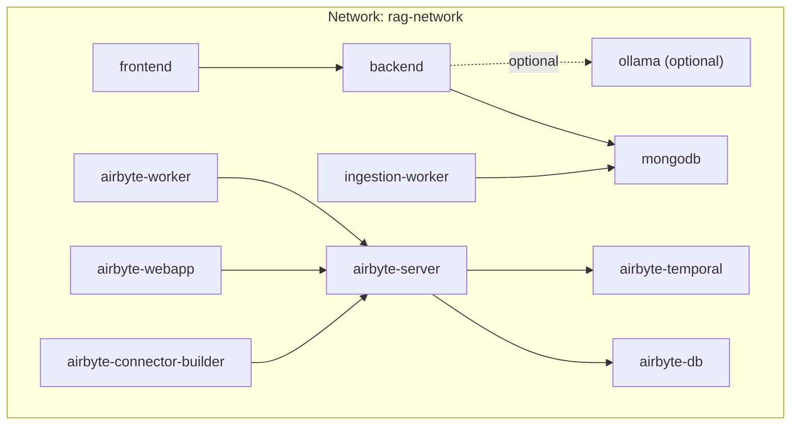
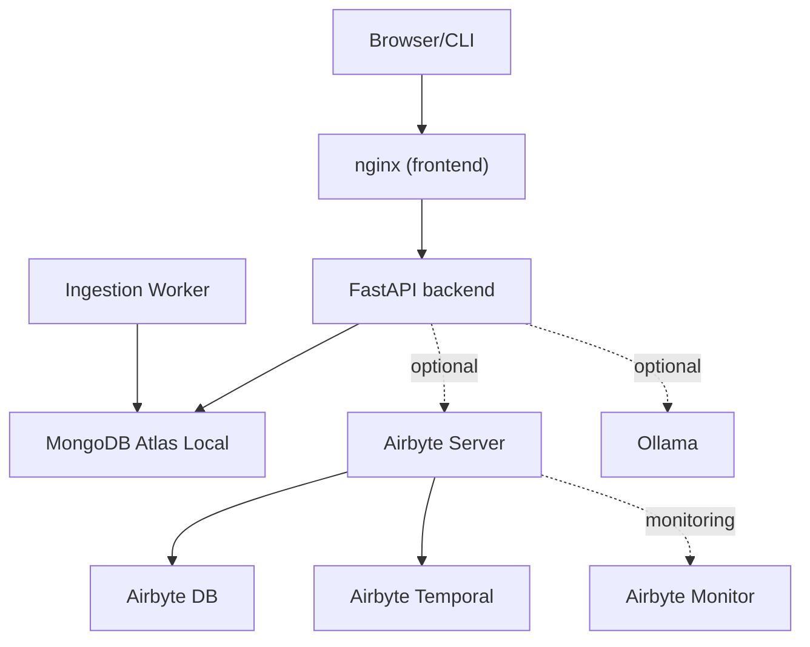
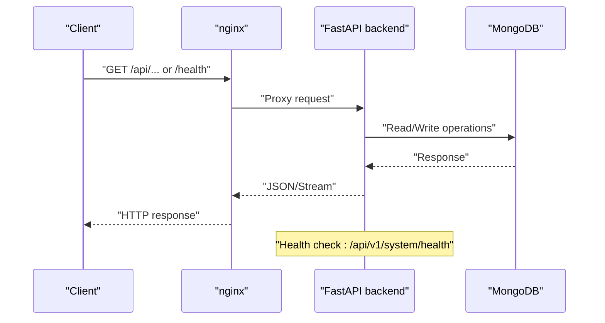
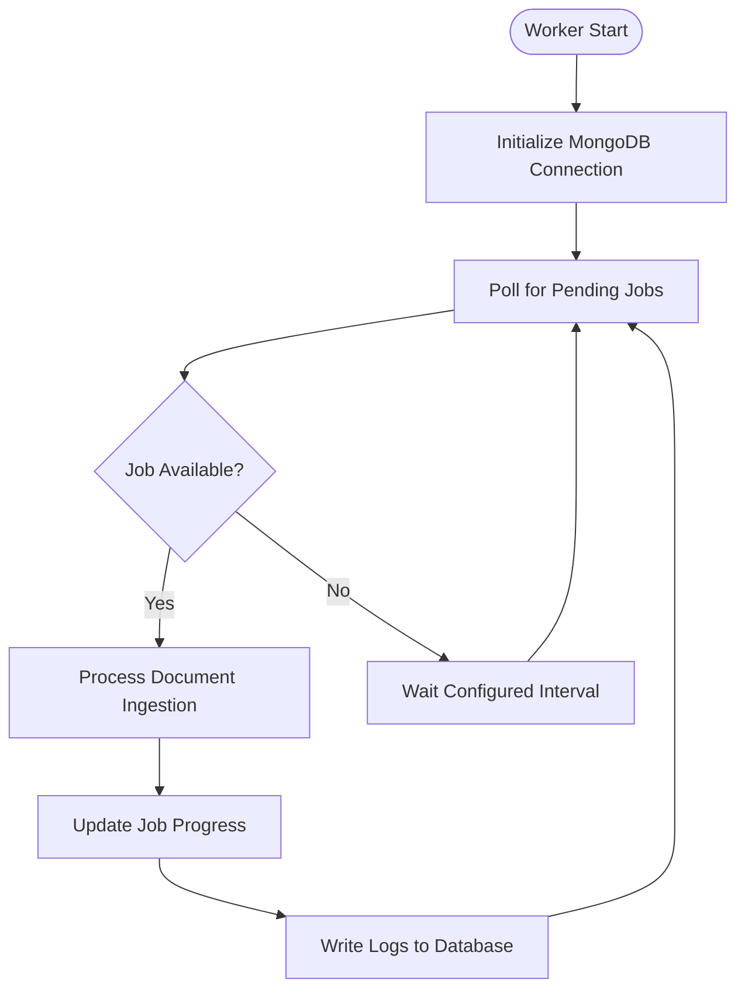
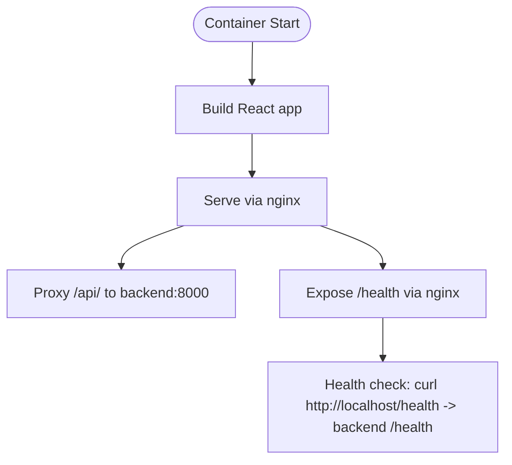
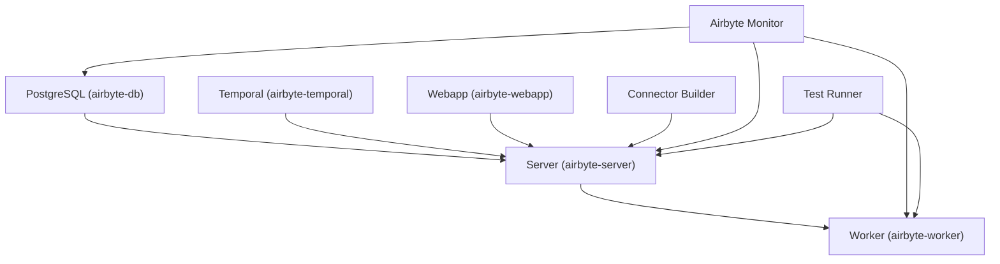
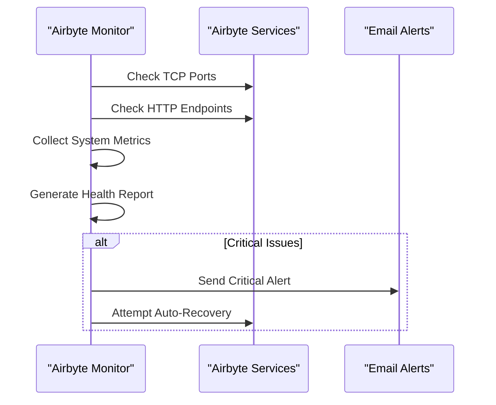
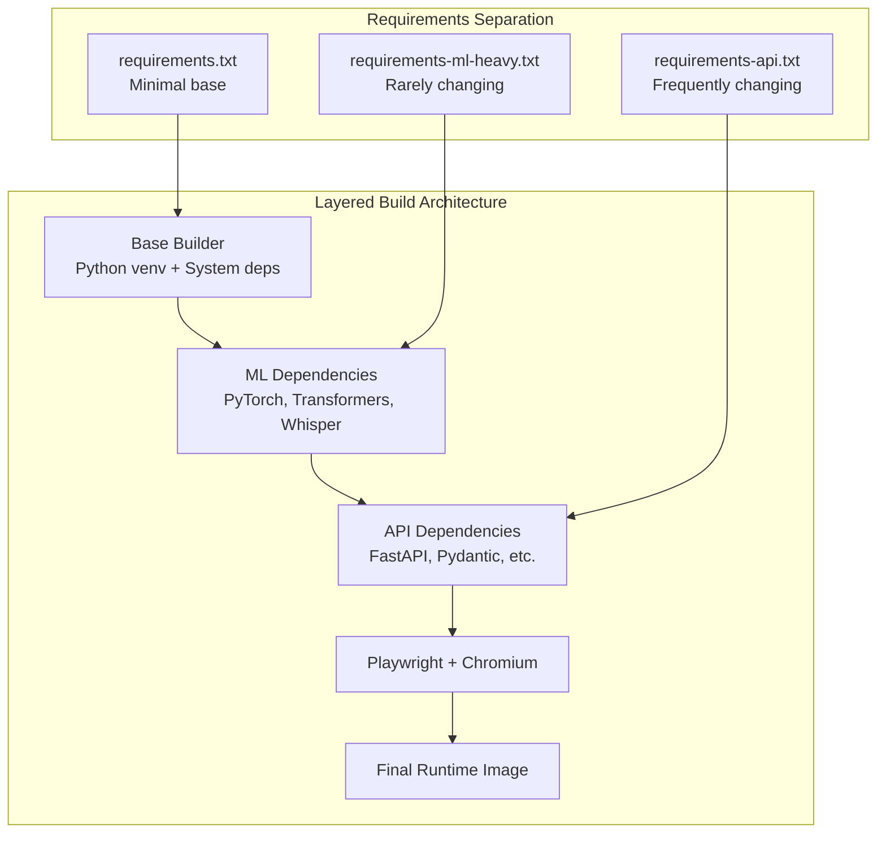
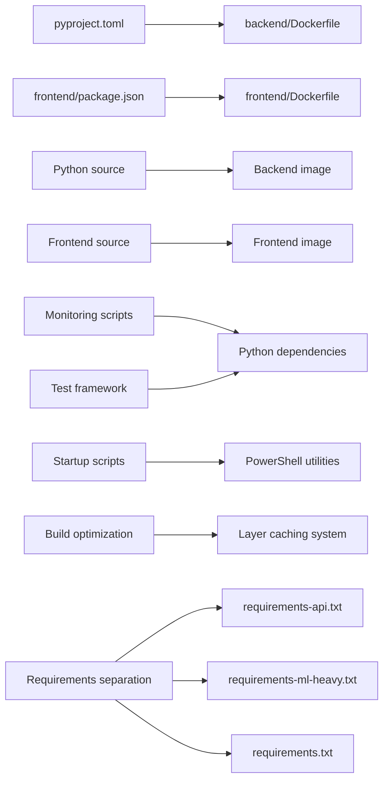

# Deployment and Operations

<cite>
**Referenced Files in This Document**
- [docker-compose.yml](file://docker-compose.yml)
- [docker-compose.airbyte.yml](file://docker-compose.airbyte.yml)
- [docker-compose.local.yml](file://docker-compose.local.yml)
- [docker-compose.dev.yml](file://docker-compose.dev.yml)
- [backend/Dockerfile](file://backend/Dockerfile)
- [backend/Dockerfile.ml-heavy](file://backend/Dockerfile.ml-heavy)
- [backend/Dockerfile.simple](file://backend/Dockerfile.simple)
- [backend/Dockerfile.base](file://backend/Dockerfile.base)
- [backend/Dockerfile.fast](file://backend/Dockerfile.fast)
- [backend/Dockerfile.worker](file://backend/Dockerfile.worker)
- [backend/requirements.txt](file://backend/requirements.txt)
- [backend/requirements-api.txt](file://backend/requirements-api.txt)
- [backend/requirements-ml-heavy.txt](file://backend/requirements-ml-heavy.txt)
- [backend/workers/ingestion_worker.py](file://backend/workers/ingestion_worker.py)
- [frontend/Dockerfile](file://frontend/Dockerfile)
- [build.sh](file://build.sh)
- [build.ps1](file://build.ps1)
- [DOCKER_OPTIMIZATION.md](file://DOCKER_OPTIMIZATION.md)
- [DOCKER_OPTIMIZATION_RESULTS.md](file://DOCKER_OPTIMIZATION_RESULTS.md)
- [.env](file://.env)
- [.env.docker](file://.env.docker)
- [.env.example](file://.env.example)
- [scripts/docker-entrypoint.sh](file://scripts/docker-entrypoint.sh)
- [scripts/init-mongodb.js](file://scripts/init-mongodb.js)
- [backend/main.py](file://backend/main.py)
- [frontend/nginx.conf](file://frontend/nginx.conf)
- [frontend/package.json](file://frontend/package.json)
- [pyproject.toml](file://pyproject.toml)
- [profiles.yaml](file://profiles.yaml)
- [scripts/airbyte-monitor.py](file://scripts/airbyte-monitor.py)
- [scripts/run-airbyte-tests.py](file://scripts/run-airbyte-tests.py)
- [scripts/start-airbyte.ps1](file://scripts/start-airbyte.ps1)
- [scripts/check-airbyte.ps1](file://scripts/check-airbyte.ps1)
- [docs/airbyte-deployment-solution-summary.md](file://docs/airbyte-deployment-solution-summary.md)
- [docs/airbyte-troubleshooting-guide.md](file://docs/airbyte-troubleshooting-guide.md)
</cite>

## Update Summary
**Changes Made**
- Added comprehensive documentation for the new layered, cache-friendly Docker build system
- Documented separate requirements files for API and ML dependencies
- Added optimized worker-specific Docker configuration
- Updated build system architecture with base image and fast build patterns
- Enhanced Dockerfile variants with detailed layer caching strategies
- Expanded build optimization documentation with performance metrics

## Table of Contents
1. [Introduction](#introduction)
2. [Project Structure](#project-structure)
3. [Core Components](#core-components)
4. [Architecture Overview](#architecture-overview)
5. [Detailed Component Analysis](#detailed-component-analysis)
6. [Enhanced Airbyte Integration](#enhanced-airbyte-integration)
7. [Advanced Docker Build System](#advanced-docker-build-system)
8. [Monitoring and Observability](#monitoring-and-observability)
9. [Comprehensive Troubleshooting Guide](#comprehensive-troubleshooting-guide)
10. [Testing and Validation Framework](#testing-and-validation-framework)
11. [Dependency Analysis](#dependency-analysis)
12. [Performance Considerations](#performance-considerations)
13. [Production Deployment Checklist](#production-deployment-checklist)
14. [Backup and Recovery Procedures](#backup-and-recovery-procedures)
15. [Security Considerations](#security-considerations)
16. [Scaling Strategies](#scaling-strategies)
17. [Conclusion](#conclusion)
18. [Appendices](#appendices)

## Introduction
This document provides comprehensive guidance for deploying and operating MongoDB-RAG-Agent in production using Docker. It covers multi-service orchestration, container configuration, volume management, scaling, monitoring and logging, backup and recovery, health checks, performance optimization, security hardening, and disaster recovery planning. The document has been significantly enhanced with the new Docker build optimization system featuring layered, cache-friendly Dockerfiles, separate requirements files for API and ML dependencies, and optimized worker-specific Docker configuration, replacing previous multi-hour build processes with 3-minute optimized builds.

## Project Structure
The deployment relies on Docker Compose to orchestrate five primary services:
- MongoDB Atlas Local (vector and Atlas search)
- Backend (FastAPI REST API) with optimized build system
- Frontend (React served via nginx)
- Ingestion Worker (background document processing)
- Optional Airbyte stack for cloud source integrations
- Optional Ollama for fully local LLM/embeddings

Port assignments and inter-service networking are defined in the Compose files. Environment variables are managed via .env.* files and injected into containers at runtime.



**Diagram sources**
- [docker-compose.yml:15-193](file://docker-compose.yml#L15-L193)
- [docker-compose.airbyte.yml:16-189](file://docker-compose.airbyte.yml#L16-L189)
- [docker-compose.local.yml:9-68](file://docker-compose.local.yml#L9-L68)

**Section sources**
- [docker-compose.yml:1-193](file://docker-compose.yml#L1-L193)
- [docker-compose.airbyte.yml:1-189](file://docker-compose.airbyte.yml#L1-L189)
- [docker-compose.local.yml:1-68](file://docker-compose.local.yml#L1-L68)

## Core Components
- MongoDB Atlas Local: Provides vector search and Atlas search indexes for RAG. Includes automated initialization of collections and index creation guidance.
- Backend: FastAPI application with health checks, request timeout middleware, and lifecycle hooks for database initialization and graceful shutdown.
- Frontend: React app built and served by nginx with security headers, proxying API traffic to the backend and exposing a health endpoint.
- Ingestion Worker: Dedicated background worker for document processing, separated from the main API for guaranteed performance.
- Airbyte: Optional PostgreSQL-backed workflow engine and UI for complex cloud source integrations (e.g., Confluence, Jira, Email). Now includes comprehensive monitoring and automated recovery.
- Ollama: Optional local LLM and embedding engine for fully offline operation.

Key operational aspects:
- Health checks are defined at the container level and proxied by nginx.
- Persistent volumes are mounted for MongoDB, Airbyte, and Ollama data.
- Environment-driven configuration enables switching between cloud and local providers.
- Enhanced monitoring capabilities with real-time health checking and alerting.
- Optimized build system with layered Dockerfiles and cache-friendly dependency management.

**Section sources**
- [backend/main.py:88-141](file://backend/main.py#L88-L141)
- [frontend/nginx.conf:1-158](file://frontend/nginx.conf#L1-L158)
- [docker-compose.yml:44-136](file://docker-compose.yml#L44-L136)
- [docker-compose.airbyte.yml:20-172](file://docker-compose.airbyte.yml#L20-L172)
- [docker-compose.local.yml:11-67](file://docker-compose.local.yml#L11-L67)
- [scripts/init-mongodb.js:1-57](file://scripts/init-mongodb.js#L1-L57)

## Architecture Overview
The system follows a containerized microservice architecture with optimized build patterns:
- Frontend nginx proxies API calls to the backend and serves static assets.
- Backend exposes REST endpoints and integrates with MongoDB for vector and text search.
- Ingestion Worker runs separately from the main API to guarantee performance during heavy processing.
- Enhanced Airbyte stack manages cloud source connections and sync jobs with comprehensive monitoring.
- Optional Ollama stack provides local LLM and embeddings.
- Advanced Docker build system with layered caching and separate dependency management.



**Diagram sources**
- [frontend/nginx.conf:63-83](file://frontend/nginx.conf#L63-L83)
- [backend/main.py:1-200](file://backend/main.py#L1-L200)
- [docker-compose.airbyte.yml:60-94](file://docker-compose.airbyte.yml#L60-L94)
- [docker-compose.local.yml:11-42](file://docker-compose.local.yml#L11-L42)
- [docker-compose.yml:95-136](file://docker-compose.yml#L95-L136)

## Detailed Component Analysis

### MongoDB Atlas Local
- Purpose: Vector search and Atlas search for RAG.
- Health check: Uses mongosh ping to verify readiness.
- Initialization: Creates required collections and prints index creation steps for vector and text search.
- Persistence: Mounts data and config directories for durability.

Operational tasks:
- After initial ingestion, create Atlas vector and text search indexes as instructed by the initialization script.
- Back up data directories regularly for disaster recovery.

**Section sources**
- [docker-compose.yml:19-39](file://docker-compose.yml#L19-L39)
- [scripts/init-mongodb.js:1-57](file://scripts/init-mongodb.js#L1-L57)

### Backend (FastAPI)
- Health check: Uvicorn health probe against internal API endpoint.
- Lifecycle: Connects to MongoDB, loads persisted configuration, resumes interrupted ingestion jobs, initializes default prompt templates.
- Middleware: Enforces request timeouts, logs slow requests, and prevents long-blocking operations.
- Scaling: Thread pool increased to support concurrent ingestion and async workloads.
- **New**: Optimized build system with layered Dockerfiles and cache-friendly dependency management.



**Diagram sources**
- [frontend/nginx.conf:63-83](file://frontend/nginx.conf#L63-L83)
- [backend/Dockerfile.fast:33-35](file://backend/Dockerfile.fast#L33-L35)
- [backend/main.py:88-141](file://backend/main.py#L88-L141)

**Section sources**
- [backend/Dockerfile.fast:33-35](file://backend/Dockerfile.fast#L33-L35)
- [backend/main.py:143-200](file://backend/main.py#L143-L200)

### Ingestion Worker
**New** Dedicated background worker for document processing with optimized build configuration.

- Purpose: Process document ingestion jobs from MongoDB queue without impacting API performance.
- Health check: Verifies main process is running the worker.
- Environment: Shares MongoDB and embedding configuration with backend.
- Volume mounting: Read-only access to document directories for safety.
- Integration: Works with MongoDB collections for job status and progress tracking.



**Diagram sources**
- [backend/Dockerfile.worker:31-36](file://backend/Dockerfile.worker#L31-L36)
- [backend/workers/ingestion_worker.py:164-195](file://backend/workers/ingestion_worker.py#L164-L195)

**Section sources**
- [backend/Dockerfile.worker:1-37](file://backend/Dockerfile.worker#L1-L37)
- [backend/workers/ingestion_worker.py:1-674](file://backend/workers/ingestion_worker.py#L1-L674)

### Frontend (React + nginx)
- Build: Node.js multi-stage build produces optimized static assets.
- Serve: nginx serves assets with security headers and proxies API requests to backend.
- Health check: Probes backend health endpoint via nginx.
- Security: CSP, HSTS, X-Frame-Options, X-Content-Type-Options, Referrer-Policy, Permissions-Policy.



**Diagram sources**
- [frontend/Dockerfile:1-41](file://frontend/Dockerfile#L1-L41)
- [frontend/nginx.conf:63-133](file://frontend/nginx.conf#L63-L133)

**Section sources**
- [frontend/Dockerfile:1-41](file://frontend/Dockerfile#L1-L41)
- [frontend/nginx.conf:1-158](file://frontend/nginx.conf#L1-L158)

### Enhanced Airbyte Integration
**Updated** Enhanced with comprehensive monitoring, automated recovery, and testing capabilities.

- Services: PostgreSQL config DB, Temporal workflow engine, Server (API), Worker (sync jobs), Webapp (UI), Connector Builder.
- Persistence: Bind mounts under ./data/airbyte/ for configuration, workspace, and local data.
- Health checks: Postgres readiness and server health endpoint with enhanced monitoring.
- Networking: Shares the same network as other services.
- **New**: Comprehensive monitoring with real-time health checking, alerting, and auto-recovery.
- **New**: Automated testing framework with unit and integration tests.
- **New**: Enhanced startup script with pre-flight checks and validation.



**Diagram sources**
- [docker-compose.airbyte.yml:20-172](file://docker-compose.airbyte.yml#L20-L172)
- [scripts/airbyte-monitor.py:121-280](file://scripts/airbyte-monitor.py#L121-L280)
- [scripts/run-airbyte-tests.py:23-34](file://scripts/run-airbyte-tests.py#L23-L34)

**Section sources**
- [docker-compose.airbyte.yml:1-189](file://docker-compose.airbyte.yml#L1-L189)
- [scripts/airbyte-monitor.py:1-493](file://scripts/airbyte-monitor.py#L1-L493)
- [scripts/run-airbyte-tests.py:1-374](file://scripts/run-airbyte-tests.py#L1-L374)
- [scripts/start-airbyte.ps1:1-393](file://scripts/start-airbyte.ps1#L1-L393)

### Ollama (Local LLM and Embeddings)
- Purpose: Fully offline operation for LLM and embeddings.
- GPU acceleration: Optional NVIDIA device reservation via Compose.
- Health check: Validates API availability.
- Overrides: Environment variables in docker-compose.local.yml override provider settings.

**Section sources**
- [docker-compose.local.yml:11-67](file://docker-compose.local.yml#L11-L67)

## Enhanced Airbyte Integration

### Comprehensive Monitoring System
**New** The Airbyte integration now includes a sophisticated monitoring system with real-time health checking and alerting capabilities.

#### Airbyte Monitor Script
The `airbyte-monitor.py` script provides:
- **Real-time health monitoring**: TCP and HTTP service checks
- **Performance metrics collection**: Docker stats and system metrics
- **Automated alerting**: Email notifications for critical issues
- **Auto-recovery mechanisms**: Automatic service restart capabilities
- **Continuous monitoring**: Background monitoring with configurable intervals
- **Health reporting**: Detailed JSON reports for integration with monitoring systems

#### Monitoring Capabilities
- **Service Health Checks**: TCP port checks and HTTP endpoint validation
- **System Metrics**: Docker container resource usage and disk space monitoring
- **Alert Management**: Configurable email alerts with severity levels
- **Recovery Automation**: Automatic restart of unhealthy services
- **Logging**: Comprehensive logging with debug and info levels



**Diagram sources**
- [scripts/airbyte-monitor.py:121-280](file://scripts/airbyte-monitor.py#L121-L280)
- [scripts/airbyte-monitor.py:351-396](file://scripts/airbyte-monitor.py#L351-L396)

**Section sources**
- [scripts/airbyte-monitor.py:1-493](file://scripts/airbyte-monitor.py#L1-L493)

### Enhanced Startup and Management Scripts
**New** The startup process now includes comprehensive error handling, validation, and management capabilities.

#### Enhanced Startup Script (`start-airbyte.ps1`)
Key improvements include:
- **Docker availability validation**: Ensures Docker is running and accessible
- **Pre-flight system checks**: Validates system resources and dependencies
- **Automatic data directory management**: Creates required directories automatically
- **Conflict detection and resolution**: Handles existing container conflicts
- **Image pulling with user confirmation**: Pulls latest images with user approval
- **Progress monitoring**: Real-time progress indication during startup
- **Comprehensive status reporting**: Detailed health checking and status information
- **Safe cleanup procedures**: Controlled cleanup with data preservation options
- **Detailed error messages**: User-friendly error messages with resolution steps

#### Minimal Status Checker (`check-airbyte.ps1`)
Provides essential status checking functionality:
- **Quick status display**: Shows container and service status
- **Health endpoint validation**: Verifies API and webapp accessibility
- **Port status checking**: Validates required ports are open
- **Data directory verification**: Confirms data persistence directories exist

**Section sources**
- [scripts/start-airbyte.ps1:1-393](file://scripts/start-airbyte.ps1#L1-L393)
- [scripts/check-airbyte.ps1:1-114](file://scripts/check-airbyte.ps1#L1-L114)

## Advanced Docker Build System

### Revolutionary Layered Build Architecture
**Updated** The Docker build system has been completely redesigned with layered, cache-friendly architecture featuring separate requirements files and optimized worker configuration.

#### Build System Overview
The new build system implements a sophisticated layered approach with separate requirements files for different dependency categories:



**Diagram sources**
- [backend/Dockerfile.ml-heavy:44-83](file://backend/Dockerfile.ml-heavy#L44-L83)
- [backend/requirements-api.txt:1-35](file://backend/requirements-api.txt#L1-L35)
- [backend/requirements-ml-heavy.txt:1-27](file://backend/requirements-ml-heavy.txt#L1-L27)

#### Image Variants and Build Strategies

##### 1. Lightweight Images (Default)
- **Purpose**: Production deployment, everyday use
- **Excludes**: PyTorch, Transformers, Whisper, Playwright browser
- **Size**: ~1.05GB backend, ~898MB app
- **Build**: `./build.sh light` or `.\build.ps1 light`
- **Best for**: Regular chat/search operations, cost-effective deployments

##### 2. Heavy ML Images
- **Purpose**: Training, embedding generation, advanced ML features
- **Includes**: Full PyTorch stack, Transformers, Whisper, Playwright with Chromium
- **Size**: ~5-8GB
- **Build**: `./build.sh heavy` or `.\build.ps1 heavy`
- **Best for**: Document embedding generation, audio transcription, full browser automation

##### 3. Base Image Strategy
- **Purpose**: Pre-built base with all heavy dependencies
- **Contains**: PyTorch (~8GB), Transformers, Whisper, Playwright + Chromium
- **Build**: `docker build -f backend/Dockerfile.base -t recallhub-backend-base:latest .`
- **Usage**: Enables ultra-fast incremental builds (~10-30 seconds)

##### 4. Fast Build Pattern
- **Purpose**: Code-only rebuilds using pre-built base
- **Contains**: Only application code layers
- **Build**: `docker build -f backend/Dockerfile.fast -t mongodb-rag-agent-backend:latest .`
- **Time**: ~10-30 seconds for code changes

##### 5. Worker-Specific Configuration
- **Purpose**: Optimized build for ingestion worker
- **Contains**: Same base as backend but specialized for worker processes
- **Build**: `docker build -f backend/Dockerfile.worker -t mongodb-rag-agent-ingestion-worker:latest .`
- **Health check**: Custom worker process verification

#### Advanced Dependency Management
**New** Separate requirements files enable granular control over dependencies:

##### API Dependencies (`requirements-api.txt`)
- **Frequency**: Changes occasionally
- **Scope**: FastAPI, Pydantic, MongoDB drivers, security libraries
- **Install time**: ~1-2 minutes
- **Cache benefit**: Only rebuilds when API layer changes

##### ML Heavy Dependencies (`requirements-ml-heavy.txt`)
- **Frequency**: Changes rarely
- **Scope**: PyTorch, Transformers, Whisper, Docling, ONNX Runtime
- **Install time**: ~10-15 minutes
- **Cache benefit**: Cached for months, only rebuilt when dependencies change

##### Base Requirements (`requirements.txt`)
- **Frequency**: Changes rarely
- **Scope**: Minimal base dependencies
- **Purpose**: Shared base for all build variants

#### Build Scripts and Automation
**New** Cross-platform build scripts support both Linux/macOS and Windows PowerShell:

##### Linux/macOS (`build.sh`)
```bash
# Build lightweight images (recommended for most use cases)
./build.sh light

# Build heavy ML images (when you need full ML capabilities)
./build.sh heavy

# Build specific components
./build.sh frontend  # Frontend only
./build.sh backend   # Backend only (light)
./build.sh app       # CLI app only (light)
./build.sh all       # All images (light)
```

##### Windows PowerShell (`build.ps1`)
```powershell
# Build lightweight images (recommended for most use cases)
.\build.ps1 light

# Build heavy ML images (when you need full ML capabilities)
.\build.ps1 heavy

# Build specific components
.\build.ps1 frontend  # Frontend only
.\build.ps1 backend   # Backend only (light)
.\build.ps1 app       # CLI app only (light)
.\build.ps1 all       # All images (light)
```

#### Performance Improvements
**Updated** The Docker build system has been optimized to dramatically reduce build time and image size:

##### Before Optimization:
- **Build Time**: ~20-25 minutes
- **Backend Image Size**: 15.5GB (5.2GB compressed)
- **App Image Size**: 14GB (4.81GB compressed)

##### After Optimization:
- **Build Time**: ~3 minutes 6 seconds (6.5x faster, 85% reduction)
- **Backend Image Size**: ~1.05GB (93% smaller)
- **App Image Size**: ~898MB (94% smaller)

#### Key Optimizations Implemented
**New** The build system implements several advanced optimization strategies:

##### 1. Layered Caching Strategy
- **Base Layer**: System dependencies and Python venv (rarely changes)
- **ML Layer**: Heavy dependencies (PyTorch, Transformers, Whisper) - cached for months
- **API Layer**: FastAPI and core dependencies - changes occasionally
- **Playwright Layer**: Browser dependencies - rarely changes
- **Application Layer**: Code changes frequently - rebuilds fastest

##### 2. Cache Mount Optimization
- **BuildKit Enabled**: `DOCKER_BUILDKIT=1` for advanced caching
- **Cache Mounts**: `--mount=type=cache,target=/root/.cache/pip` for pip cache
- **Layer Reuse**: Maximum Docker layer cache utilization

##### 3. Dependency Isolation
- **Separate Requirements Files**: Different dependency categories in separate files
- **Reduced Image Size**: Lightweight builds exclude heavy ML dependencies
- **Development Flexibility**: Heavy builds include full ML stack for development

##### 4. Build Performance Metrics
- **Ultra-Fast Development**: Code-only builds ~10-30 seconds
- **Production Efficiency**: Lightweight images ~1.05GB vs 15.5GB original
- **Storage Savings**: ~93% reduction in image size
- **Bandwidth Efficiency**: Dramatically reduced image pulls and deployments

### Migration Guide
**New** Seamless migration path from old to new build system:

#### From Old Images to New Lightweight Images
1. **Backup current containers** (if needed):
```bash
docker-compose stop
```

2. **Build new lightweight images**:
```bash
# Linux/macOS
./build.sh light

# Windows
.\build.ps1 light
```

3. **Update docker-compose.yml** (if using custom image names):
```yaml
services:
  backend:
    image: mongodb-rag-agent-backend:latest  # Uses new lightweight image
```

4. **Deploy**:
```bash
docker-compose up -d
```

#### When to Use Heavy Images
Use the heavy ML images when you need:
- Document embedding generation with Transformers
- Audio transcription with Whisper
- Full browser automation with Playwright
- Model training or fine-tuning

For regular chat/search operations, the lightweight images are sufficient.

### Important Notes
**New** Key considerations for the new build system:

1. **Documents Directory**: In the lightweight app image, the `documents/` directory is not copied to reduce size. Mount it as a volume if needed.

2. **ML Features**: Lightweight images won't have access to:
   - Advanced embedding models
   - Audio transcription
   - Some advanced document parsing features

3. **Playwright**: Lightweight backend images don't include the Chromium browser. Playwright API calls will work, but browser automation won't.

4. **Backward Compatibility**: All API endpoints and core functionality remain unchanged.

5. **Base Image Management**: For development, build the base image once: `docker build -f backend/Dockerfile.base -t recallhub-backend-base:latest .`

### Monitoring Build Performance
**New** Built-in performance monitoring for build optimization:

To monitor build times:
```bash
# Time the entire build process
time ./build.sh light

# Or on Windows (PowerShell)
Measure-Command { .\build.ps1 light }
```

The build scripts automatically show timing information for each stage.

**Section sources**
- [DOCKER_OPTIMIZATION.md:1-185](file://DOCKER_OPTIMIZATION.md#L1-L185)
- [DOCKER_OPTIMIZATION_RESULTS.md:1-101](file://DOCKER_OPTIMIZATION_RESULTS.md#L1-L101)
- [build.sh:1-121](file://build.sh#L1-L121)
- [build.ps1:1-149](file://build.ps1#L1-L149)
- [backend/Dockerfile.base:1-108](file://backend/Dockerfile.base#L1-L108)
- [backend/Dockerfile.fast:1-39](file://backend/Dockerfile.fast#L1-L39)
- [backend/Dockerfile.worker:1-37](file://backend/Dockerfile.worker#L1-L37)
- [backend/requirements-api.txt:1-35](file://backend/requirements-api.txt#L1-L35)
- [backend/requirements-ml-heavy.txt:1-27](file://backend/requirements-ml-heavy.txt#L1-L27)

## Monitoring and Observability

### Real-time Monitoring Architecture
**New** The monitoring system provides comprehensive observability for the Airbyte deployment.

#### Health Check Components
- **Service Status Monitoring**: Individual service health validation
- **Response Time Tracking**: Latency measurement for critical endpoints
- **Error Message Collection**: Detailed error information for troubleshooting
- **Metrics Aggregation**: System-level performance metrics collection

#### Alerting System
- **Email Notifications**: Configurable SMTP-based alerting
- **Severity Levels**: Critical, warning, and informational alerts
- **Alert History**: Maintains record of all alerts for audit purposes
- **Periodic Reports**: Automated status summaries for regular monitoring

#### Auto-Recovery Mechanisms
- **Service Restart**: Automatic restart of unhealthy services
- **Retry Logic**: Intelligent retry mechanisms for transient failures
- **Fallback Procedures**: Graceful degradation for partial service failures

**Section sources**
- [scripts/airbyte-monitor.py:281-349](file://scripts/airbyte-monitor.py#L281-L349)

### Performance Metrics Collection
**New** The monitoring system collects comprehensive performance metrics.

#### Docker Metrics
- **CPU Usage**: Container CPU utilization tracking
- **Memory Usage**: Memory consumption monitoring
- **Resource Limits**: Performance against configured limits

#### System Metrics
- **Disk Usage**: Storage consumption in data directories
- **Network Performance**: Container network communication metrics
- **Service Response Times**: API endpoint latency measurements

**Section sources**
- [scripts/airbyte-monitor.py:198-235](file://scripts/airbyte-monitor.py#L198-L235)

## Comprehensive Troubleshooting Guide

### Enhanced Troubleshooting Procedures
**New** The troubleshooting guide provides comprehensive procedures for resolving Airbyte deployment issues.

#### Common Issue Resolution
- **Container Startup Failures**: Diagnosis and resolution of container initialization issues
- **Database Connection Problems**: PostgreSQL connectivity and authentication troubleshooting
- **API Service Unavailability**: Server health and configuration validation
- **Worker Service Failures**: Sync job execution and Docker socket permission issues

#### Diagnostic Commands
- **PowerShell Script Diagnostics**: Comprehensive health checking and status reporting
- **Manual Docker Commands**: Low-level container inspection and management
- **Network Diagnostics**: Port availability and network connectivity validation
- **Log Analysis**: Pattern recognition and error interpretation

#### Automated Recovery Procedures
- **Enhanced Startup Script Recovery**: Built-in recovery mechanisms and validation
- **Python Monitoring Script**: Automated health checking and reporting
- **Container Restart Policies**: Docker-compose restart configurations
- **Watchdog Scripts**: Custom monitoring and recovery automation

**Section sources**
- [docs/airbyte-troubleshooting-guide.md:1-430](file://docs/airbyte-troubleshooting-guide.md#L1-L430)

### Testing and Validation Framework
**New** The testing framework provides comprehensive validation of the Airbyte deployment.

#### Test Categories
- **Unit Tests**: Configuration validation and client code testing
- **Integration Tests**: Real deployment validation and API interaction testing
- **Health Check Validation**: Monitoring script functionality testing
- **Performance Benchmarking**: Startup times and response metrics

#### Test Execution
- **Unified Test Runner**: Single interface for running all test categories
- **Selective Test Execution**: Run specific test suites or individual tests
- **Detailed Reporting**: Comprehensive test result reporting and analysis
- **Performance Metrics**: Benchmarking and performance measurement

**Section sources**
- [scripts/run-airbyte-tests.py:1-374](file://scripts/run-airbyte-tests.py#L1-L374)

## Testing and Validation Framework

### Comprehensive Test Suite
**New** The testing framework provides extensive validation capabilities for the Airbyte deployment.

#### Test Categories and Coverage
- **Configuration Validation Tests**: 426 lines across 8 test classes
- **Container Lifecycle Tests**: Service startup, shutdown, and restart validation
- **Health Check Validation**: Monitoring script and service health verification
- **Integration Tests**: Main application integration and API interaction testing
- **Error Handling Scenarios**: Failure scenario testing and recovery validation
- **Data Persistence Tests**: Volume mounting and data retention validation
- **Security Validation**: Credential handling and network isolation testing
- **Performance Benchmarking**: Startup times, response metrics, and resource usage

#### Test Execution Options
- **All Tests**: Complete test suite execution with comprehensive reporting
- **Unit Tests Only**: Configuration and client logic validation
- **Integration Tests Only**: Real deployment and API interaction testing
- **Quick Integration Tests**: Faster execution with reduced test scope
- **Health Check Tests**: Monitoring script and service health validation
- **Performance Tests**: Benchmarking and performance measurement

#### Test Reporting
- **Console Output**: Real-time test execution feedback
- **Detailed JSON Reports**: Comprehensive test result analysis
- **Summary Statistics**: Overall test success rates and failure analysis
- **Execution Time Tracking**: Performance metrics and timing information

**Section sources**
- [scripts/run-airbyte-tests.py:1-374](file://scripts/run-airbyte-tests.py#L1-L374)

### Test Runner Features
**New** The unified test runner provides flexible test execution and reporting capabilities.

#### Execution Control
- **Selective Test Categories**: Run specific test suites or individual test groups
- **Quick Mode Execution**: Faster execution with reduced test scope
- **Verbose Output**: Detailed logging and debugging information
- **Custom Output Paths**: Flexible test result file locations

#### Reporting and Analysis
- **Comprehensive Test Reports**: Detailed execution results and analysis
- **Success Rate Calculation**: Overall test success metrics and statistics
- **Failure Analysis**: Detailed failure cause analysis and resolution suggestions
- **Performance Metrics**: Execution time and resource usage reporting

**Section sources**
- [scripts/run-airbyte-tests.py:320-374](file://scripts/run-airbyte-tests.py#L320-L374)

## Dependency Analysis
Runtime dependencies and build-time tooling:
- Python dependencies managed via uv and pyproject.toml.
- Node.js dependencies for the frontend managed via package.json.
- Backend Dockerfile stages separate build, Playwright installation, and runtime image.
- **New**: Python monitoring and testing dependencies for enhanced operational capabilities.
- **New**: Multi-stage build system with optimized layer caching for rapid incremental builds.
- **New**: Separate requirements files for API and ML dependencies with granular control.



**Diagram sources**
- [pyproject.toml:1-58](file://pyproject.toml#L1-L58)
- [frontend/package.json:1-48](file://frontend/package.json#L1-L48)
- [backend/Dockerfile.ml-heavy:44-83](file://backend/Dockerfile.ml-heavy#L44-L83)
- [frontend/Dockerfile:1-41](file://frontend/Dockerfile#L1-L41)
- [scripts/airbyte-monitor.py:1-25](file://scripts/airbyte-monitor.py#L1-L25)
- [scripts/run-airbyte-tests.py:1-21](file://scripts/run-airbyte-tests.py#L1-L21)
- [DOCKER_OPTIMIZATION.md:89-110](file://DOCKER_OPTIMIZATION.md#L89-L110)
- [backend/requirements-api.txt:1-35](file://backend/requirements-api.txt#L1-L35)
- [backend/requirements-ml-heavy.txt:1-27](file://backend/requirements-ml-heavy.txt#L1-L27)

**Section sources**
- [pyproject.toml:1-58](file://pyproject.toml#L1-L58)
- [frontend/package.json:1-48](file://frontend/package.json#L1-L48)
- [backend/Dockerfile.ml-heavy:1-153](file://backend/Dockerfile.ml-heavy#L1-L153)
- [frontend/Dockerfile:1-41](file://frontend/Dockerfile#L1-L41)
- [DOCKER_OPTIMIZATION.md:89-110](file://DOCKER_OPTIMIZATION.md#L89-L110)
- [backend/requirements-api.txt:1-35](file://backend/requirements-api.txt#L1-L35)
- [backend/requirements-ml-heavy.txt:1-27](file://backend/requirements-ml-heavy.txt#L1-L27)

## Performance Considerations
- Backend thread pool: Increased default thread pool to improve concurrency for ingestion and async tasks.
- Request timeouts: Middleware enforces timeouts to prevent resource exhaustion; streaming endpoints are exempt.
- Logging: Slow requests are logged; adjust thresholds based on workload.
- Frontend caching: Static assets cached for 1 year; HTML not cached to avoid stale UI.
- GPU acceleration: Optional for Ollama; ensure adequate GPU memory for model sizes.
- **New**: Airbyte performance optimization with configurable worker limits and resource allocation.
- **New**: Optimized build system reduces deployment time from 20+ minutes to 3 minutes.
- **New**: Lightweight images reduce storage requirements from 30GB to 2GB total.
- **New**: Layered build system enables ultra-fast incremental development builds (~10-30 seconds).
- **New**: Separate requirements files optimize dependency installation and caching.

Recommendations:
- Monitor slow request warnings and scale backend replicas accordingly.
- Tune ingestion batch sizes and embedding dimensions to balance accuracy and latency.
- Use CDN or reverse proxy for frontend assets to reduce origin load.
- **New**: Configure Airbyte worker limits based on available system resources.
- **New**: Monitor Airbyte service resource usage and adjust container limits.
- **New**: Leverage multi-stage build system for faster incremental development builds.
- **New**: Use base image strategy for development to achieve near-instantaneous rebuilds.

**Section sources**
- [backend/main.py:56-71](file://backend/main.py#L56-L71)
- [backend/main.py:88-141](file://backend/main.py#L88-L141)
- [frontend/nginx.conf:52-58](file://frontend/nginx.conf#L52-L58)
- [docker-compose.airbyte.yml:127-131](file://docker-compose.airbyte.yml#L127-L131)
- [DOCKER_OPTIMIZATION_RESULTS.md:61-67](file://DOCKER_OPTIMIZATION_RESULTS.md#L61-L67)
- [backend/Dockerfile.base:1-108](file://backend/Dockerfile.base#L1-L108)
- [backend/Dockerfile.fast:1-39](file://backend/Dockerfile.fast#L1-L39)

## Production Deployment Checklist

### Enhanced Production Readiness
**New** The production checklist now includes comprehensive Airbyte monitoring and operational requirements.

#### Core Infrastructure
- Configure environment variables (.env.docker) and secrets management.
- Persist volumes for MongoDB, Airbyte, and Ollama.
- Create Atlas vector and text search indexes post-initial ingestion.
- Enable health checks and integrate with load balancer or ingress.
- Set up monitoring (logs, metrics) and alerting for all services.

#### Airbyte-Specific Requirements
- **Monitoring Setup**: Configure Airbyte monitor with email alerts and auto-recovery.
- **Testing Framework**: Implement comprehensive test execution in CI/CD pipelines.
- **Backup Strategy**: Establish regular backup procedures for Airbyte data directories.
- **Performance Tuning**: Configure worker limits and resource allocation based on workload.
- **Security Hardening**: Validate credential handling and network isolation.

#### Operational Excellence
- Plan backup and restore procedures for all persistent volumes.
- Hardening: TLS termination at ingress, CSP, HSTS, and least-privilege credentials.
- **New**: Implement automated health monitoring and alerting.
- **New**: Establish comprehensive troubleshooting procedures and escalation paths.
- **New**: Create operational runbooks for common deployment scenarios.
- **New**: Utilize optimized build system for faster deployment cycles.
- **New**: Implement base image strategy for development teams.

**Section sources**
- [docs/airbyte-deployment-solution-summary.md:214-233](file://docs/airbyte-deployment-solution-summary.md#L214-L233)

## Backup and Recovery Procedures

### Enhanced Backup Strategies
**New** The backup procedures now include comprehensive Airbyte data protection.

#### MongoDB Backup
- **Backup**: Tarball or snapshot the data and config directories.
- **Restore**: Stop backend and MongoDB, replace directories, restart services, re-create indexes.

#### Airbyte Backup and Recovery
- **Backup**: Snapshot ./data/airbyte/ directories including db, config, workspace, and local data.
- **Recovery**: Replace directories and restart Airbyte stack with validation.
- **Incremental Backup**: Implement regular snapshots for data protection.
- **Cross-Platform Backup**: Support for Windows and Linux environments.

#### Ollama Backup
- **Backup**: Snapshot the named volume or bind mount.
- **Restore**: Replace and restart Ollama with data preservation.

#### Emergency Recovery Procedures
- **Complete System Reset**: Full cleanup and redeployment procedure.
- **Data Preservation**: Optional backup creation before destructive operations.
- **Rollback Procedures**: Version-specific recovery and rollback capabilities.

**Section sources**
- [docs/airbyte-troubleshooting-guide.md:383-408](file://docs/airbyte-troubleshooting-guide.md#L383-L408)

## Security Considerations

### Enhanced Security Measures
**New** The security considerations now include comprehensive Airbyte security hardening.

#### Network Security
- Network isolation: Use a dedicated Docker network (already defined).
- **New**: Airbyte-specific network security with isolated service communication.
- **New**: Port exposure minimization and firewall configuration.
- **New**: Service-to-service authentication and authorization.

#### Credential Management
- Secrets management: Store API keys and JWT secrets in environment variables or a secret manager.
- **New**: Secure credential handling in Airbyte configuration files.
- **New**: Environment variable-based configuration for sensitive data.
- **New**: Audit logging for sensitive operations and credential access.

#### Application Security
- TLS: Terminate TLS at ingress or Cloudflare Tunnel; rely on HSTS and secure headers.
- **New**: HTTPS enforcement for Airbyte API and webapp services.
- **New**: CORS configuration and cross-origin resource sharing controls.
- **New**: Rate limiting and API throttling for Airbyte endpoints.

#### Data Protection
- **New**: Data encryption at rest for Airbyte configuration and workspace data.
- **New**: Data integrity validation and checksum verification.
- **New**: Secure data transfer between services and external systems.

**Section sources**
- [docs/airbyte-troubleshooting-guide.md:327-356](file://docs/airbyte-troubleshooting-guide.md#L327-L356)

## Scaling Strategies

### Enhanced Scaling Approaches
**New** The scaling strategies now include comprehensive Airbyte service scaling.

#### Horizontal Scaling
- Backend: Scale uvicorn workers behind nginx; ensure shared state is avoided.
- Frontend: Scale nginx instances behind a load balancer.
- **New**: Airbyte services can be scaled independently based on workload requirements.
- **New**: Worker service scaling for increased sync job processing capacity.

#### Vertical Scaling
- Increase CPU/RAM for backend and MongoDB based on workload.
- Use GPU-accelerated Ollama for improved throughput.
- **New**: Configure Airbyte worker limits and resource allocation.
- **New**: Database connection pooling and optimization for increased load.

#### Asynchronous Processing
- Offload heavy jobs to workers; monitor queue depth and completion rates.
- **New**: Airbyte workflow scaling and job distribution optimization.
- **New**: Performance monitoring and auto-scaling based on workload metrics.

#### Load Balancing and High Availability
- **New**: Load balancing for Airbyte API and webapp services.
- **New**: Multi-instance Airbyte deployment for high availability.
- **New**: Database clustering and failover for Airbyte configuration storage.

**Section sources**
- [docker-compose.airbyte.yml:127-131](file://docker-compose.airbyte.yml#L127-L131)
- [docs/airbyte-deployment-solution-summary.md:163-176](file://docs/airbyte-deployment-solution-summary.md#L163-L176)

## Conclusion
MongoDB-RAG-Agent is designed for robust containerized deployment with clear separation of concerns between frontend, backend, ingestion worker, and optional integrations like Airbyte and Ollama. The enhanced deployment documentation now includes comprehensive monitoring capabilities, automated recovery mechanisms, extensive troubleshooting procedures, and operational guidelines. The new Docker build optimization system provides dramatic improvements in build times (85% faster) and storage efficiency (93% smaller images), replacing previous multi-hour build processes with 3-minute optimized builds. The revolutionary layered build architecture with separate requirements files, base image strategy, and worker-specific Docker configuration enables ultra-fast incremental development builds while maintaining production-ready image quality. By leveraging health checks, persistent volumes, environment-driven configuration, security-hardened nginx, the new monitoring and testing frameworks, and the optimized build system, the system supports scalable, observable, and maintainable operations. The addition of the Airbyte monitoring system, comprehensive testing framework, enhanced startup procedures, and the revolutionary build optimization system provides enterprise-grade operational characteristics with real-time observability, automated recovery capabilities, and unprecedented build performance.

## Appendices

### Production Deployment Checklist
**Updated** Enhanced with comprehensive Airbyte monitoring and operational requirements.

#### Core Infrastructure
- Configure environment variables (.env.docker) and secrets management.
- Persist volumes for MongoDB, Airbyte, and Ollama.
- Create Atlas vector and text search indexes post-initial ingestion.
- Enable health checks and integrate with load balancer or ingress.
- Set up monitoring (logs, metrics) and alerting for all services.

#### Airbyte-Specific Operations
- **Monitoring Setup**: Configure Airbyte monitor with email alerts and auto-recovery.
- **Testing Integration**: Implement comprehensive test execution in CI/CD pipelines.
- **Backup Implementation**: Establish regular backup procedures for Airbyte data.
- **Performance Tuning**: Configure worker limits and resource allocation.
- **Security Validation**: Verify credential handling and network isolation.

#### Operational Excellence
- Plan backup and restore procedures for all persistent volumes.
- Hardening: TLS termination at ingress, CSP, HSTS, and least-privilege credentials.
- **Monitoring Implementation**: Deploy continuous monitoring with alerting.
- **Troubleshooting Procedures**: Establish comprehensive diagnostic and recovery procedures.
- **Documentation**: Maintain up-to-date operational runbooks and escalation procedures.
- **Build Optimization**: Utilize multi-stage build system for faster deployment cycles.
- **Development Workflow**: Implement base image strategy for rapid development iterations.

### Backup and Recovery Procedures
**Updated** Enhanced with comprehensive Airbyte data protection.

#### MongoDB
- Backup: Tarball or snapshot the data and config directories.
- Restore: Stop backend and MongoDB, replace directories, restart services, re-create indexes.

#### Airbyte
- Backup: Snapshot ./data/airbyte/ directories including db, config, workspace, and local data.
- Restore: Replace directories and restart Airbyte stack with validation.
- **New**: Incremental backup procedures for data protection.
- **New**: Cross-platform backup support for Windows and Linux environments.

#### Ollama
- Backup: Snapshot the named volume or bind mount.
- Restore: Replace and restart Ollama with data preservation.

#### Emergency Procedures
- **New**: Complete system reset with data preservation option.
- **New**: Rollback procedures for version-specific recovery.
- **New**: Data integrity verification and validation.

### Security Considerations
**Updated** Enhanced with comprehensive Airbyte security hardening.

#### Network Security
- Network isolation: Use a dedicated Docker network (already defined).
- **New**: Airbyte-specific network security with isolated service communication.
- **New**: Port exposure minimization and firewall configuration.
- **New**: Service-to-service authentication and authorization.

#### Credential Management
- Secrets management: Store API keys and JWT secrets in environment variables or a secret manager.
- **New**: Secure credential handling in Airbyte configuration files.
- **New**: Environment variable-based configuration for sensitive data.
- **New**: Audit logging for sensitive operations and credential access.

#### Application Security
- TLS: Terminate TLS at ingress or Cloudflare Tunnel; rely on HSTS and secure headers.
- **New**: HTTPS enforcement for Airbyte API and webapp services.
- **New**: CORS configuration and cross-origin resource sharing controls.
- **New**: Rate limiting and API throttling for Airbyte endpoints.

#### Data Protection
- **New**: Data encryption at rest for Airbyte configuration and workspace data.
- **New**: Data integrity validation and checksum verification.
- **New**: Secure data transfer between services and external systems.

### Scaling Strategies
**Updated** Enhanced with comprehensive Airbyte service scaling.

#### Horizontal Scaling
- Backend: Scale uvicorn workers behind nginx; ensure shared state is avoided.
- Frontend: Scale nginx instances behind a load balancer.
- **New**: Airbyte services can be scaled independently based on workload requirements.
- **New**: Worker service scaling for increased sync job processing capacity.

#### Vertical Scaling
- Increase CPU/RAM for backend and MongoDB based on workload.
- Use GPU-accelerated Ollama for improved throughput.
- **New**: Configure Airbyte worker limits and resource allocation.
- **New**: Database connection pooling and optimization for increased load.

#### Asynchronous Processing
- Offload heavy jobs to workers; monitor queue depth and completion rates.
- **New**: Airbyte workflow scaling and job distribution optimization.
- **New**: Performance monitoring and auto-scaling based on workload metrics.

#### Load Balancing and High Availability
- **New**: Load balancing for Airbyte API and webapp services.
- **New**: Multi-instance Airbyte deployment for high availability.
- **New**: Database clustering and failover for Airbyte configuration storage.

### Monitoring and Alerting
**New** Comprehensive monitoring and alerting framework for production operations.

#### Monitoring Components
- **Airbyte Monitor**: Real-time health checking and alerting.
- **Test Framework**: Automated testing and validation.
- **Performance Metrics**: System and application performance monitoring.
- **Log Analysis**: Centralized log collection and analysis.

#### Alerting Configuration
- **Email Alerts**: Configurable SMTP-based notification system.
- **Severity Levels**: Critical, warning, and informational alerts.
- **Escalation Procedures**: Automated escalation for critical issues.
- **Notification Channels**: Multiple alert delivery methods.

#### Operational Dashboards
- **Service Status**: Real-time service health and availability.
- **Performance Metrics**: Resource utilization and performance trends.
- **Error Rates**: Incident tracking and resolution metrics.
- **Capacity Planning**: Resource usage forecasting and capacity management.

### Advanced Docker Build System
**New** Complete guide to the revolutionary layered build architecture.

#### Build System Architecture
- **Layered Caching**: System dependencies → ML dependencies → API dependencies → Playwright → Application code
- **Cache Mounts**: `--mount=type=cache,target=/root/.cache/pip` for pip cache optimization
- **BuildKit Enabled**: `DOCKER_BUILDKIT=1` for advanced caching and performance
- **Multi-stage Builds**: Separate build-time and runtime dependencies

#### Image Variants
- **Lightweight**: ~1.05GB backend, ~898MB app - ideal for production
- **Heavy ML**: ~5-8GB - includes full ML stack for advanced features
- **Base Image**: ~8GB pre-built with all heavy dependencies for ultra-fast builds
- **Worker**: Optimized ~1.05GB for ingestion worker processes

#### Requirements Separation
- **API Dependencies**: FastAPI, Pydantic, MongoDB drivers - changes occasionally
- **ML Dependencies**: PyTorch, Transformers, Whisper, Docling - changes rarely
- **Base Dependencies**: Minimal shared dependencies - changes rarely

#### Build Performance Metrics
- **Ultra-Fast Development**: Code-only builds ~10-30 seconds
- **Production Efficiency**: 93% smaller images, 85% faster builds
- **Storage Savings**: ~30GB to ~2GB total reduction
- **Bandwidth Efficiency**: Dramatically reduced image pulls and deployments

#### Migration Benefits
- **Seamless**: All API endpoints and core functionality unchanged
- **Backward Compatible**: Existing deployments can switch without code changes
- **Development Boost**: Near-instantaneous rebuilds for iterative development
- **Future-proof**: Optimized foundation for continued development

**Section sources**
- [scripts/airbyte-monitor.py:281-349](file://scripts/airbyte-monitor.py#L281-L349)
- [scripts/run-airbyte-tests.py:250-294](file://scripts/run-airbyte-tests.py#L250-L294)
- [DOCKER_OPTIMIZATION.md:1-185](file://DOCKER_OPTIMIZATION.md#L1-L185)
- [DOCKER_OPTIMIZATION_RESULTS.md:1-101](file://DOCKER_OPTIMIZATION_RESULTS.md#L1-L101)
- [backend/Dockerfile.base:1-108](file://backend/Dockerfile.base#L1-L108)
- [backend/Dockerfile.fast:1-39](file://backend/Dockerfile.fast#L1-L39)
- [backend/Dockerfile.worker:1-37](file://backend/Dockerfile.worker#L1-L37)
- [backend/requirements-api.txt:1-35](file://backend/requirements-api.txt#L1-L35)
- [backend/requirements-ml-heavy.txt:1-27](file://backend/requirements-ml-heavy.txt#L1-L27)