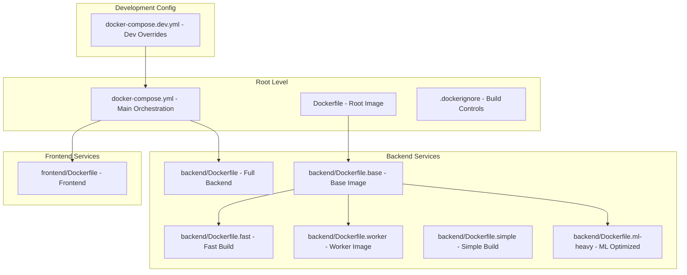
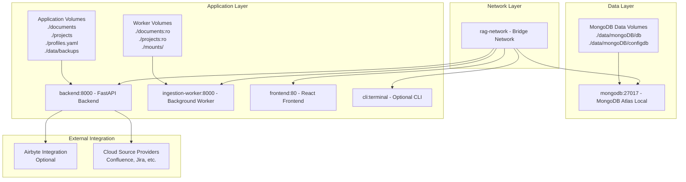
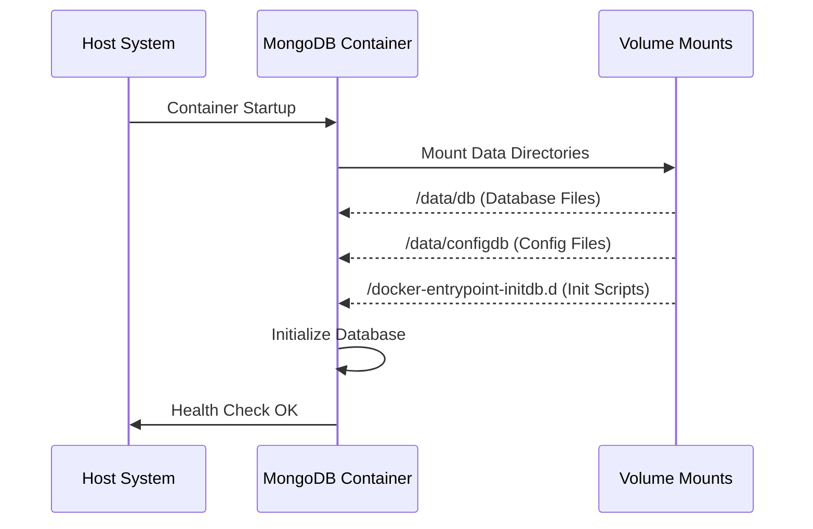
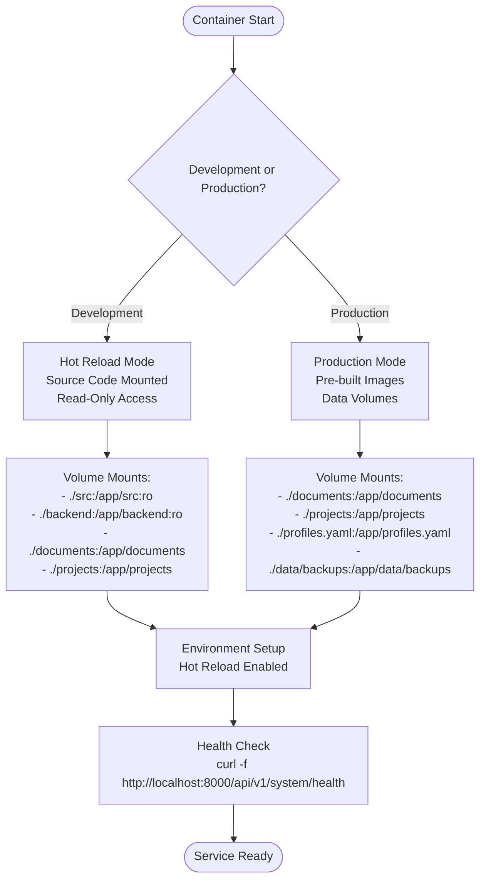
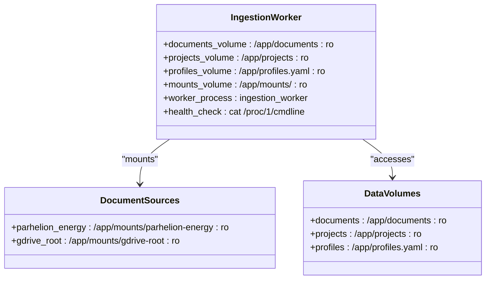
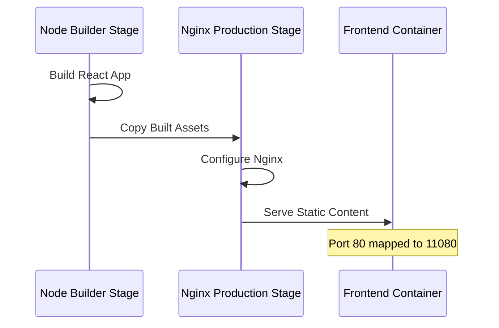
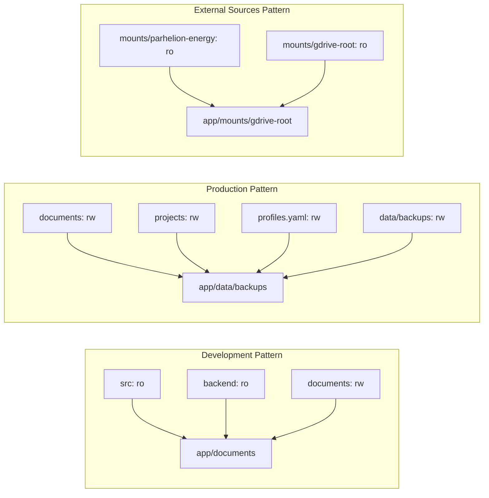
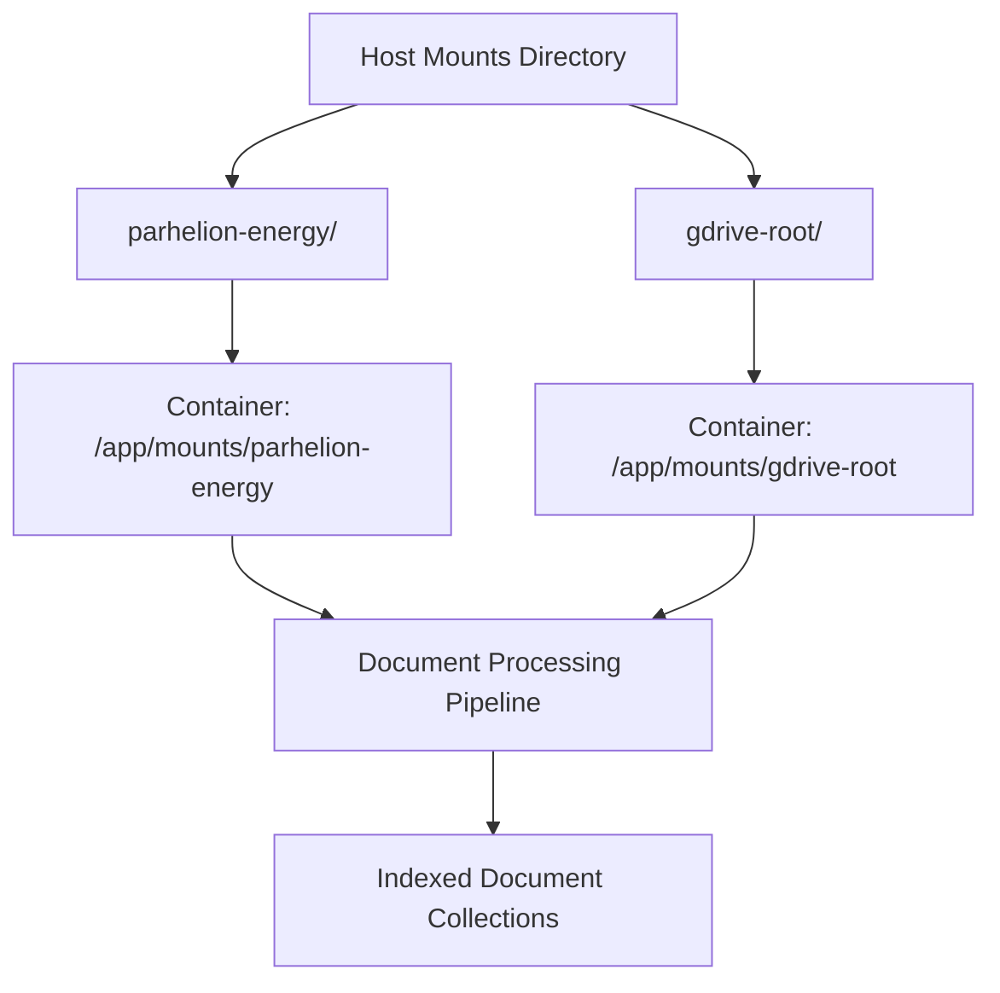

# Docker Path Mapping System

<cite>
**Referenced Files in This Document**
- [Dockerfile](file://Dockerfile)
- [backend/Dockerfile](file://backend/Dockerfile)
- [frontend/Dockerfile](file://frontend/Dockerfile)
- [docker-compose.yml](file://docker-compose.yml)
- [docker-compose.dev.yml](file://docker-compose.dev.yml)
- [backend/Dockerfile.base](file://backend/Dockerfile.base)
- [backend/Dockerfile.fast](file://backend/Dockerfile.fast)
- [backend/Dockerfile.worker](file://backend/Dockerfile.worker)
- [backend/Dockerfile.simple](file://backend/Dockerfile.simple)
- [backend/Dockerfile.ml-heavy](file://backend/Dockerfile.ml-heavy)
- [.dockerignore](file://.dockerignore)
- [profiles.yaml](file://profiles.yaml)
</cite>

## Table of Contents
1. [Introduction](#introduction)
2. [Project Structure](#project-structure)
3. [Core Components](#core-components)
4. [Architecture Overview](#architecture-overview)
5. [Detailed Component Analysis](#detailed-component-analysis)
6. [Path Mapping Strategies](#path-mapping-strategies)
7. [Volume Mounting Patterns](#volume-mounting-patterns)
8. [Development vs Production Configurations](#development-vs-production-configurations)
9. [Performance Considerations](#performance-considerations)
10. [Troubleshooting Guide](#troubleshooting-guide)
11. [Conclusion](#conclusion)

## Introduction

The Docker Path Mapping System in the MongoDB RAG Agent repository implements a sophisticated multi-container architecture with carefully designed volume mounting strategies. This system enables seamless development workflows while maintaining production-grade isolation and security. The architecture supports multiple deployment scenarios including development hot-reload, production deployments, and hardened security configurations.

The system utilizes a layered approach with pre-built base images containing heavy dependencies, allowing for rapid incremental builds during development while maintaining optimal production image sizes. Volume mounting strategies are implemented to support both development hot-reload capabilities and production data persistence.

## Project Structure

The Docker infrastructure is organized across multiple files and directories, each serving specific purposes in the containerization strategy:



**Diagram sources**
- [Dockerfile:1-58](file://Dockerfile#L1-L58)
- [backend/Dockerfile:1-100](file://backend/Dockerfile#L1-L100)
- [backend/Dockerfile.base:1-108](file://backend/Dockerfile.base#L1-L108)
- [backend/Dockerfile.fast:1-39](file://backend/Dockerfile.fast#L1-L39)
- [backend/Dockerfile.worker:1-37](file://backend/Dockerfile.worker#L1-L37)
- [backend/Dockerfile.simple:1-44](file://backend/Dockerfile.simple#L1-L44)
- [backend/Dockerfile.ml-heavy:1-153](file://backend/Dockerfile.ml-heavy#L1-L153)
- [docker-compose.yml:1-193](file://docker-compose.yml#L1-L193)
- [docker-compose.dev.yml:1-42](file://docker-compose.dev.yml#L1-L42)

**Section sources**
- [Dockerfile:1-58](file://Dockerfile#L1-L58)
- [backend/Dockerfile:1-100](file://backend/Dockerfile#L1-L100)
- [frontend/Dockerfile:1-41](file://frontend/Dockerfile#L1-L41)
- [docker-compose.yml:1-193](file://docker-compose.yml#L1-L193)
- [docker-compose.dev.yml:1-42](file://docker-compose.dev.yml#L1-L42)

## Core Components

The Docker Path Mapping System consists of several key components that work together to provide flexible deployment options:

### Container Orchestration Layer
The system manages five primary containers: MongoDB for data persistence, Backend API for application logic, Frontend for user interface, Ingestion Worker for background processing, and optional CLI container for terminal access.

### Image Building Strategy
Multiple Dockerfile variants serve different purposes:
- **Base Image**: Contains heavy ML dependencies for reuse across builds
- **Fast Build**: Leverages base image for ultra-fast development rebuilds
- **Worker Image**: Specialized for background document processing tasks
- **Simple Build**: Minimal configuration for straightforward deployments
- **ML-Heavy**: Optimized layer caching for development workflows

### Volume Management System
The system implements sophisticated volume mounting strategies supporting both development hot-reload and production data persistence with proper isolation.

**Section sources**
- [docker-compose.yml:15-193](file://docker-compose.yml#L15-L193)
- [backend/Dockerfile.base:1-108](file://backend/Dockerfile.base#L1-L108)
- [backend/Dockerfile.fast:1-39](file://backend/Dockerfile.fast#L1-L39)
- [backend/Dockerfile.worker:1-37](file://backend/Dockerfile.worker#L1-L37)

## Architecture Overview

The Docker Path Mapping System implements a comprehensive multi-container architecture with distinct deployment modes:



**Diagram sources**
- [docker-compose.yml:19-193](file://docker-compose.yml#L19-L193)
- [docker-compose.dev.yml:22-42](file://docker-compose.dev.yml#L22-L42)

The architecture supports three primary deployment scenarios:
1. **Development Mode**: Hot-reload enabled with source code mounting
2. **Production Mode**: Optimized images with persistent data volumes
3. **Hardened Mode**: Isolated network configuration with minimal external exposure

## Detailed Component Analysis

### MongoDB Container Configuration

The MongoDB container serves as the primary data store with comprehensive volume management:



**Diagram sources**
- [docker-compose.yml:19-40](file://docker-compose.yml#L19-L40)

Key characteristics:
- **Port Mapping**: 11017:27017 for external access
- **Data Persistence**: Separate volumes for database and config data
- **Initialization**: Scripts mounted from host system
- **Health Monitoring**: Automated ping checks

### Backend Service Architecture

The backend service implements a sophisticated multi-stage build process with specialized volume mounting:



**Diagram sources**
- [docker-compose.yml:47-94](file://docker-compose.yml#L47-L94)
- [docker-compose.dev.yml:22-36](file://docker-compose.dev.yml#L22-L36)

**Section sources**
- [docker-compose.yml:47-94](file://docker-compose.yml#L47-L94)
- [docker-compose.dev.yml:22-36](file://docker-compose.dev.yml#L22-L36)

### Ingestion Worker Configuration

The ingestion worker operates independently with read-only access to document sources:



**Diagram sources**
- [docker-compose.yml:100-136](file://docker-compose.yml#L100-L136)

**Section sources**
- [docker-compose.yml:100-136](file://docker-compose.yml#L100-L136)

### Frontend Service Implementation

The frontend service leverages a two-stage build process with nginx for production serving:



**Diagram sources**
- [frontend/Dockerfile:1-41](file://frontend/Dockerfile#L1-L41)

**Section sources**
- [frontend/Dockerfile:1-41](file://frontend/Dockerfile#L1-L41)

## Path Mapping Strategies

The system implements multiple path mapping strategies tailored to different deployment scenarios:

### Development Path Mapping

Development mode emphasizes rapid iteration with hot-reload capabilities:

| Host Path | Container Path | Mount Options | Purpose |
|-----------|----------------|---------------|---------|
| `./src` | `/app/src` | `ro` (read-only) | Application source code |
| `./backend` | `/app/backend` | `ro` (read-only) | Backend module code |
| `./documents` | `/app/documents` | read-write | Document storage |
| `./projects` | `/app/projects` | read-write | Project data |
| `./profiles.yaml` | `/app/profiles.yaml` | `ro` (read-only) | Configuration |

### Production Path Mapping

Production mode focuses on data persistence and security:

| Host Path | Container Path | Mount Options | Purpose |
|-----------|----------------|---------------|---------|
| `./documents` | `/app/documents` | read-write | Persistent document storage |
| `./projects` | `/app/projects` | read-write | Persistent project data |
| `./profiles.yaml` | `/app/profiles.yaml` | read-write | Configuration management |
| `./data/backups` | `/app/data/backups` | read-write | Backup storage |
| `./mounts/parhelion-energy` | `/app/mounts/parhelion-energy` | `ro` (read-only) | External document sources |
| `./mounts/gdrive-root` | `/app/mounts/gdrive-root` | `ro` (read-only) | External document sources |

### Volume Mounting Patterns

The system employs several volume mounting patterns for different use cases:



**Diagram sources**
- [docker-compose.yml:83-133](file://docker-compose.yml#L83-L133)
- [docker-compose.dev.yml:24-41](file://docker-compose.dev.yml#L24-L41)

**Section sources**
- [docker-compose.yml:83-133](file://docker-compose.yml#L83-L133)
- [docker-compose.dev.yml:24-41](file://docker-compose.dev.yml#L24-L41)

## Volume Mounting Patterns

The Docker Path Mapping System implements sophisticated volume mounting strategies that support multiple deployment scenarios:

### Read-Write vs Read-Only Mounts

The system distinguishes between data that needs modification and static content:

**Read-Write Mounts** (for development and production data):
- `./documents` → `/app/documents`: Document storage and updates
- `./projects` → `/app/projects`: Project metadata and processed data
- `./profiles.yaml` → `/app/profiles.yaml`: Configuration updates
- `./data/backups` → `/app/data/backups`: Backup generation and management

**Read-Only Mounts** (for external sources and development stability):
- `./src` → `/app/src:ro`: Application source code (development)
- `./backend` → `/app/backend:ro`: Backend modules (development)
- `./mounts/parhelion-energy` → `/app/mounts/parhelion-energy:ro`: External document sources
- `./mounts/gdrive-root` → `/app/mounts/gdrive-root:ro`: External document sources

### External Source Integration

The system supports mounting external document sources through dedicated mount points:



**Diagram sources**
- [docker-compose.yml:89-90](file://docker-compose.yml#L89-L90)
- [profiles.yaml:6-32](file://profiles.yaml#L6-L32)

**Section sources**
- [docker-compose.yml:89-90](file://docker-compose.yml#L89-L90)
- [profiles.yaml:6-32](file://profiles.yaml#L6-L32)

## Development vs Production Configurations

The system provides distinct configurations optimized for different operational modes:

### Development Configuration Features

Development mode prioritizes rapid iteration and debugging capabilities:

**Hot-Reload Implementation**:
- Source code mounted as volumes for instant changes
- Uvicorn configured with `--reload` flag
- Separate reload directories specified for backend and src

**Development-Specific Mounts**:
- Source code volumes mounted read-only to prevent accidental modifications
- Documents and projects volumes mounted read-write for testing
- Profiles mounted read-only to maintain configuration integrity

### Production Configuration Features

Production mode emphasizes security, performance, and reliability:

**Security Hardening**:
- Isolated internal networks with no external port exposure
- Read-only access to most mounted volumes
- Minimal service surface area

**Performance Optimization**:
- Pre-built base images eliminate dependency installation overhead
- Optimized layer caching for faster rebuilds
- Reduced attack surface through minimal base images

### Configuration Management

Both configurations utilize the same profiles.yaml structure with different access patterns:

```mermaid
graph TB
subgraph "Development Profiles"
DevProfiles[profiles.yaml: ro]
DevDocuments[/app/documents: rw]
DevProjects[/app/projects: rw]
end
subgraph "Production Profiles"
ProdProfiles[profiles.yaml: rw]
ProdDocuments[/app/documents: rw]
ProdProjects[/app/projects: rw]
ProdBackups[/app/data/backups: rw]
end
DevProfiles --> DevDocuments
DevProfiles --> DevProjects
ProdProfiles --> ProdDocuments
ProdProfiles --> ProdProjects
ProdProfiles --> ProdBackups
```

**Diagram sources**
- [docker-compose.yml:76-87](file://docker-compose.yml#L76-L87)
- [docker-compose.dev.yml:31-28](file://docker-compose.dev.yml#L31-L28)

**Section sources**
- [docker-compose.yml:76-87](file://docker-compose.yml#L76-L87)
- [docker-compose.dev.yml:31-28](file://docker-compose.dev.yml#L31-L28)

## Performance Considerations

The Docker Path Mapping System incorporates several performance optimization strategies:

### Image Build Optimization

**Layer Caching Strategy**:
- Heavy ML dependencies cached in base images
- API dependencies isolated in separate layers
- Application code as the final, frequently changing layer
- BuildKit utilization for parallel layer building

**Build Time Reduction**:
- Base image build: One-time comprehensive dependency installation
- Fast build: Code-only rebuilds taking 10-30 seconds
- Worker builds: Specialized optimized builds for background processing

### Volume Performance Optimization

**Mount Point Organization**:
- Separation of read-only and read-write volumes
- External source mounting for large document collections
- Data volume separation for backup and persistence operations

**Network Performance**:
- Internal network isolation reduces external overhead
- Container-to-container communication on private networks
- Minimized port exposure reduces security and performance overhead

### Memory and Resource Management

**Resource Allocation**:
- Container-specific resource requirements
- Database optimization for vector search operations
- Worker processes tuned for background task execution

## Troubleshooting Guide

Common issues and solutions for the Docker Path Mapping System:

### Volume Mount Issues

**Problem**: Containers cannot access mounted volumes
- **Solution**: Verify host directory permissions and existence
- **Check**: Ensure proper mount point syntax in docker-compose.yml
- **Verify**: Confirm volume paths match between host and container

**Problem**: Read-only mount not functioning as expected
- **Solution**: Review mount options (`:ro` vs default read-write)
- **Check**: Verify application requirements for write access
- **Verify**: Confirm external source mounting for read-only content

### Network Connectivity Problems

**Problem**: Containers cannot communicate with each other
- **Solution**: Verify network configuration in docker-compose.yml
- **Check**: Ensure all containers use the same network definition
- **Verify**: Confirm service dependencies and health checks

**Problem**: Port conflicts during startup
- **Solution**: Review port mapping assignments in docker-compose.yml
- **Check**: Verify ports are not already in use on host system
- **Verify**: Adjust port mappings if conflicts exist

### Build and Deployment Issues

**Problem**: Slow build times during development
- **Solution**: Utilize fast build images with pre-built base dependencies
- **Check**: Ensure base image is properly built and cached
- **Verify**: Use appropriate Dockerfile variant for current development stage

**Problem**: Hot-reload not triggering code changes
- **Solution**: Verify source code mounting configuration
- **Check**: Confirm uvicorn reload settings and reload directories
- **Verify**: Ensure proper file watching configuration

**Section sources**
- [docker-compose.yml:19-193](file://docker-compose.yml#L19-L193)
- [docker-compose.dev.yml:1-42](file://docker-compose.dev.yml#L1-L42)
- [backend/Dockerfile.base:1-108](file://backend/Dockerfile.base#L1-L108)

## Conclusion

The Docker Path Mapping System in the MongoDB RAG Agent repository demonstrates a sophisticated approach to containerized application deployment. The system successfully balances development agility with production reliability through its multi-layered architecture and strategic volume mounting patterns.

Key strengths of the implementation include:

**Flexibility**: Multiple deployment modes supporting development, production, and hardened configurations
**Performance**: Optimized build processes with pre-built base images and layer caching
**Scalability**: Modular architecture supporting independent scaling of different service components
**Security**: Proper isolation through network segmentation and volume access controls
**Maintainability**: Clear separation of concerns with specialized Dockerfile variants for different use cases

The path mapping strategies effectively support both development hot-reload capabilities and production data persistence requirements. The system's modular design enables easy adaptation to different deployment scenarios while maintaining consistent operational patterns across environments.

This implementation serves as a comprehensive example of modern containerization practices, demonstrating how thoughtful volume management and build optimization can significantly improve developer productivity while maintaining production-grade reliability and security standards.