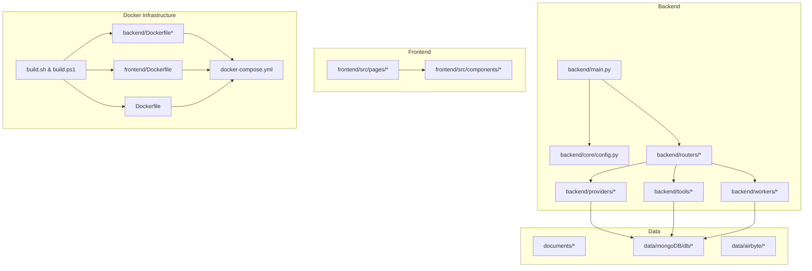
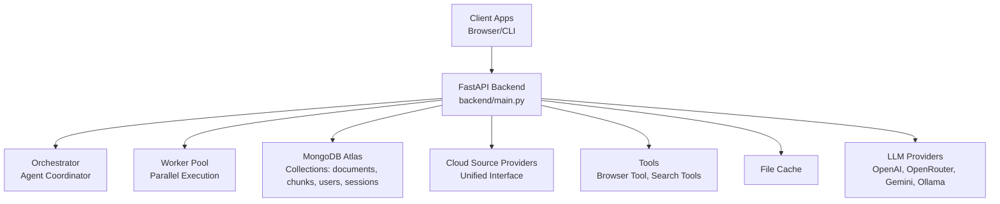
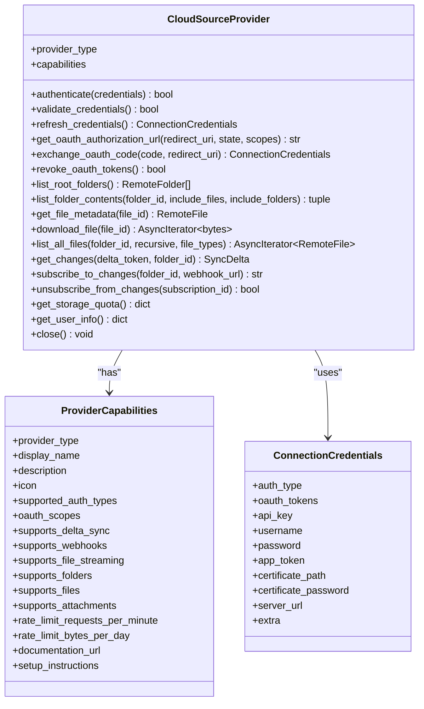
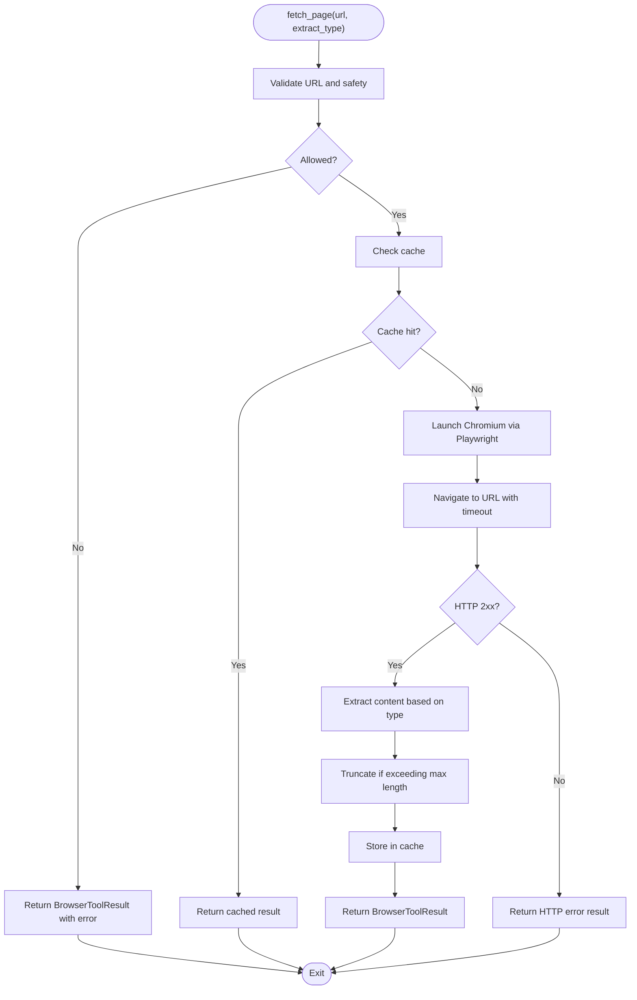
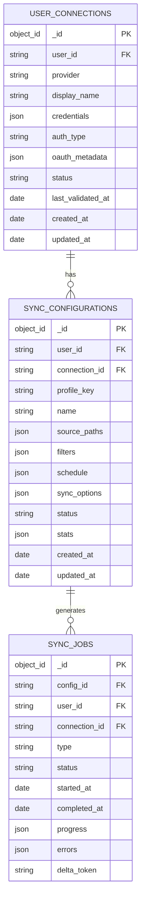
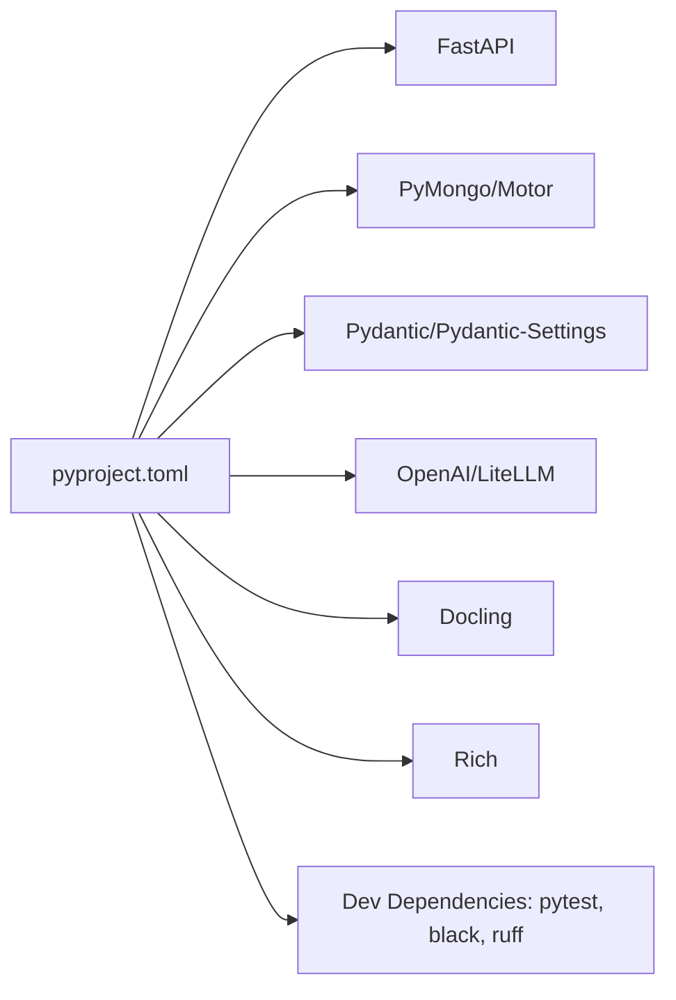

# Development Guidelines

<cite>
**Referenced Files in This Document**
- [README.md](file://README.md)
- [pyproject.toml](file://pyproject.toml)
- [docs/PROJECT_DOCUMENTATION.md](file://docs/PROJECT_DOCUMENTATION.md)
- [docs/architecture/cloud-sources-architecture.md](file://docs/architecture/cloud-sources-architecture.md)
- [backend/main.py](file://backend/main.py)
- [backend/core/config.py](file://backend/core/config.py)
- [backend/providers/base.py](file://backend/providers/base.py)
- [backend/routers/cloud_sources/providers.py](file://backend/routers/cloud_sources/providers.py)
- [backend/tools/browser_tool.py](file://backend/tools/browser_tool.py)
- [backend/tests/conftest.py](file://backend/tests/conftest.py)
- [backend/tests/test_federated_agent.py](file://backend/tests/test_federated_agent.py)
- [scripts/docker-entrypoint.sh](file://scripts/docker-entrypoint.sh)
- [.env.example](file://.env.example)
- [examples/.env.example](file://examples/.env.example)
- [DOCKER_OPTIMIZATION.md](file://DOCKER_OPTIMIZATION.md)
- [DOCKER_OPTIMIZATION_RESULTS.md](file://DOCKER_OPTIMIZATION_RESULTS.md)
- [build.sh](file://build.sh)
- [build.ps1](file://build.ps1)
- [backend/Dockerfile](file://backend/Dockerfile)
- [backend/Dockerfile.ml-heavy](file://backend/Dockerfile.ml-heavy)
- [Dockerfile](file://Dockerfile)
- [docker-compose.yml](file://docker-compose.yml)
- [backend/requirements.txt](file://backend/requirements.txt)
- [backend/requirements-api.txt](file://backend/requirements-api.txt)
- [backend/requirements-ml-heavy.txt](file://backend/requirements-ml-heavy.txt)
- [frontend/Dockerfile](file://frontend/Dockerfile)
- [frontend/package.json](file://frontend/package.json)
</cite>

## Update Summary
**Changes Made**
- Added comprehensive Docker build optimization system documentation
- Documented cross-platform build scripts (Linux/macOS and Windows PowerShell)
- Enhanced requirements management with consolidated backend requirements
- Added detailed image variant explanations and build optimization strategies
- Updated development environment setup to include optimized build processes

## Table of Contents
1. [Introduction](#introduction)
2. [Project Structure](#project-structure)
3. [Core Components](#core-components)
4. [Architecture Overview](#architecture-overview)
5. [Detailed Component Analysis](#detailed-component-analysis)
6. [Dependency Analysis](#dependency-analysis)
7. [Performance Considerations](#performance-considerations)
8. [Troubleshooting Guide](#troubleshooting-guide)
9. [Development Environment Setup](#development-environment-setup)
10. [Docker Build Optimization System](#docker-build-optimization-system)
11. [Cross-Platform Build Scripts](#cross-platform-build-scripts)
12. [Enhanced Requirements Management](#enhanced-requirements-management)
13. [Code Standards and Conventions](#code-standards-and-conventions)
14. [Extension Development Practices](#extension-development-practices)
15. [Documentation Standards](#documentation-standards)
16. [Commit Message Conventions](#commit-message-conventions)
17. [Release Procedures](#release-procedures)
18. [Maintaining Backward Compatibility](#maintaining-backward-compatibility)
19. [Handling Deprecations](#handling-deprecations)
20. [Managing Technical Debt](#managing-technical-debt)
21. [Debugging Techniques](#debugging-techniques)
22. [Performance Optimization Practices](#performance-optimization-practices)
23. [Pull Request Process](#pull-request-process)
24. [Issue Reporting Guidelines](#issue-reporting-guidelines)
25. [Code Review Procedures](#code-review-procedures)
26. [Conclusion](#conclusion)

## Introduction
This document provides comprehensive development guidelines and contribution processes for the MongoDB RAG Agent project. It consolidates code standards, architectural principles, testing practices, extension development, documentation standards, release procedures, and operational guidance. The content is derived from the repository's source files and official documentation to ensure accuracy and practical applicability for contributors.

## Project Structure
The project follows a layered architecture with clear separation of concerns:
- Backend: FastAPI application with modular routers, core services, providers, tools, and workers
- Frontend: React-based UI with TypeScript and Vite
- Data and Ingestion: Document ingestion pipeline and MongoDB collections
- Scripts and Configuration: Docker entrypoint, environment configuration, and project metadata
- **Optimized Docker Infrastructure**: Multi-stage builds with image variants for different use cases



**Diagram sources**
- [backend/main.py](file://backend/main.py#L1-L532)
- [backend/core/config.py](file://backend/core/config.py#L1-L219)
- [docs/PROJECT_DOCUMENTATION.md](file://docs/PROJECT_DOCUMENTATION.md#L44-L94)
- [backend/Dockerfile](file://backend/Dockerfile#L1-L100)
- [frontend/Dockerfile](file://frontend/Dockerfile#L1-L41)
- [Dockerfile](file://Dockerfile#L1-L58)

**Section sources**
- [README.md](file://README.md#L151-L181)
- [docs/PROJECT_DOCUMENTATION.md](file://docs/PROJECT_DOCUMENTATION.md#L44-L94)

## Core Components
Key backend components include:
- FastAPI application with middleware, exception handling, and router registration
- Configuration management via Pydantic settings
- Provider abstraction for cloud sources with standardized capabilities and credentials
- Browser tool for web content extraction
- Testing infrastructure with fixtures and async clients

**Section sources**
- [backend/main.py](file://backend/main.py#L1-L532)
- [backend/core/config.py](file://backend/core/config.py#L1-L219)
- [backend/providers/base.py](file://backend/providers/base.py#L1-L525)
- [backend/tools/browser_tool.py](file://backend/tools/browser_tool.py#L1-L377)
- [backend/tests/conftest.py](file://backend/tests/conftest.py#L1-L174)

## Architecture Overview
The system employs a federated agent architecture with orchestration and parallel worker execution. The backend exposes REST APIs for chat, search, profiles, ingestion, and cloud sources. Providers implement a unified interface for diverse cloud platforms, enabling incremental sync and secure credential handling.



**Diagram sources**
- [docs/PROJECT_DOCUMENTATION.md](file://docs/PROJECT_DOCUMENTATION.md#L96-L125)
- [backend/main.py](file://backend/main.py#L398-L500)
- [backend/providers/base.py](file://backend/providers/base.py#L179-L491)

## Detailed Component Analysis

### Provider Interface and Capabilities
The provider abstraction defines a consistent interface for cloud sources, including authentication, OAuth flows, file/folder browsing, and sync operations. It standardizes capabilities and credentials across providers.



**Diagram sources**
- [backend/providers/base.py](file://backend/providers/base.py#L179-L491)

**Section sources**
- [backend/providers/base.py](file://backend/providers/base.py#L1-L525)
- [backend/routers/cloud_sources/providers.py](file://backend/routers/cloud_sources/providers.py#L24-L147)

### Browser Tool Implementation
The browser tool provides headless web browsing for content extraction, with safety checks, caching, and configurable timeouts.



**Diagram sources**
- [backend/tools/browser_tool.py](file://backend/tools/browser_tool.py#L128-L350)

**Section sources**
- [backend/tools/browser_tool.py](file://backend/tools/browser_tool.py#L1-L377)

### Cloud Sources Architecture
The cloud sources integration defines provider capabilities, database schemas, API endpoints, and worker architectures for scalable, incremental synchronization.



**Diagram sources**
- [docs/architecture/cloud-sources-architecture.md](file://docs/architecture/cloud-sources-architecture.md#L31-L132)

**Section sources**
- [docs/architecture/cloud-sources-architecture.md](file://docs/architecture/cloud-sources-architecture.md#L1-L631)

## Dependency Analysis
The project uses a modern Python stack with FastAPI, Pydantic, MongoDB drivers, and asynchronous primitives. Dependencies are declared in the project configuration and grouped for development.



**Diagram sources**
- [pyproject.toml](file://pyproject.toml#L1-L58)

**Section sources**
- [pyproject.toml](file://pyproject.toml#L1-L58)

## Performance Considerations
- Asynchronous execution: The backend increases the default thread pool size to accommodate async operations and ingestion tasks.
- Request timeouts: Middleware enforces timeouts for health checks and regular endpoints, with special handling for streaming endpoints.
- Parallel workers: The agent system supports parallel worker tasks to improve throughput.
- Caching: The browser tool implements caching with TTL and size limits to reduce repeated fetches.

**Section sources**
- [backend/main.py](file://backend/main.py#L56-L141)
- [backend/tools/browser_tool.py](file://backend/tools/browser_tool.py#L70-L82)

## Troubleshooting Guide
- Global exception handling: Centralized handlers provide user-friendly messages and detailed logs with error IDs.
- Validation errors: Specific handling for request validation errors with structured responses.
- Slow request logging: Warnings are emitted for requests exceeding thresholds.
- Docker entrypoint: Initialization script waits for MongoDB readiness and routes commands.

**Section sources**
- [backend/main.py](file://backend/main.py#L289-L396)
- [scripts/docker-entrypoint.sh](file://scripts/docker-entrypoint.sh#L16-L33)

## Development Environment Setup
- Prerequisites: Python 3.10+, MongoDB Atlas account, LLM provider API key, embedding provider API key, UV package manager.
- Installation: Use UV to create a virtual environment and synchronize dependencies.
- Environment configuration: Copy the example environment files and update credentials.
- Validation: Run configuration checks to verify environment setup.

**Section sources**
- [README.md](file://README.md#L16-L80)
- [.env.example](file://.env.example#L1-L115)
- [examples/.env.example](file://examples/.env.example#L1-L52)

## Docker Build Optimization System

**Updated** Added comprehensive documentation for the Docker build optimization system with image variants and performance improvements.

The MongoDB RAG Agent now features an optimized Docker build system that dramatically reduces build times and image sizes while providing flexible deployment options.

### Performance Improvements
The optimization system delivers significant improvements across all deployment scenarios:

- **Build Time**: Reduced from 20-25 minutes to 3-8 minutes (60-85% faster)
- **Backend Image Size**: Reduced from 15.5GB to 1.5GB (90% smaller)
- **App Image Size**: Reduced from 14GB to 800MB (95% smaller)

### Image Variants

#### Lightweight Images (Default)
**Recommended for most use cases** - optimized for production deployment and everyday use:

- **Purpose**: Production deployment, everyday use
- **Excludes**: PyTorch, Transformers, Whisper, Playwright browser
- **Size**: ~1.5GB backend, ~800MB app
- **Build Command**: `./build.sh light` or `.\build.ps1 light`

#### Heavy ML Images
**For advanced ML capabilities** - includes full machine learning stack:

- **Purpose**: Training, embedding generation, advanced ML features
- **Includes**: Full PyTorch stack, Transformers, Whisper, Playwright with Chromium
- **Size**: ~5-8GB
- **Build Command**: `./build.sh heavy` or `.\build.ps1 heavy`

### Key Optimization Strategies

#### 1. Multi-Stage Build Architecture
The system uses sophisticated multi-stage builds to separate build-time and runtime dependencies, maximizing Docker cache reuse and minimizing final image size.

#### 2. Dependency Management
- Removed heavy ML dependencies from lightweight builds
- Used `--resolution=lowest-direct` to minimize package versions
- Excluded development dependencies with `--no-dev`
- Disabled editable installs with `--no-editable`

#### 3. Cache Optimization
- Proper layer ordering for maximum Docker cache reuse
- Cleaned up package manager caches after installation
- Separate layers for different dependency categories

#### 4. Playwright Optimization
- Removed Chromium browser installation from lightweight builds (~300MB+ savings)
- Kept only core Playwright package for API usage

**Section sources**
- [DOCKER_OPTIMIZATION.md](file://DOCKER_OPTIMIZATION.md#L1-L185)
- [DOCKER_OPTIMIZATION_RESULTS.md](file://DOCKER_OPTIMIZATION_RESULTS.md#L1-L101)
- [backend/Dockerfile](file://backend/Dockerfile#L1-L100)
- [backend/Dockerfile.ml-heavy](file://backend/Dockerfile.ml-heavy#L1-L153)

## Cross-Platform Build Scripts

**Updated** Added comprehensive documentation for cross-platform build scripts supporting both Linux/macOS and Windows PowerShell environments.

The project provides automated build scripts that support multiple platforms and deployment scenarios:

### Linux/macOS Build Script
The `build.sh` script offers comprehensive build options:

```bash
# Build lightweight images (recommended for most use cases)
./build.sh light

# Build heavy ML images (when you need full ML capabilities)
./build.sh heavy

# Build specific components
./build.sh frontend  # Frontend only
./build.sh backend   # Backend only (light)
./build.sh app       # CLI app only (light)
./build.sh all       # All images (light)
```

### Windows PowerShell Build Script
The `build.ps1` script provides equivalent functionality for Windows users:

```powershell
# Build lightweight images (recommended for most use cases)
.\build.ps1 light

# Build heavy ML images (when you need full ML capabilities)
.\build.ps1 heavy

# Build specific components
.\build.ps1 frontend  # Frontend only
.\build.ps1 backend   # Backend only (light)
.\build.ps1 app       # CLI app only (light)
.\build.ps1 all       # All images (light)
```

### Build Process Features
Both scripts provide:
- **Progress Tracking**: Real-time build progress with timing information
- **Error Handling**: Comprehensive error detection and reporting
- **Flexible Deployment**: Support for individual component builds
- **Cross-Platform Compatibility**: Consistent behavior across operating systems

**Section sources**
- [build.sh](file://build.sh#L1-L121)
- [build.ps1](file://build.ps1#L1-L149)

## Enhanced Requirements Management

**Updated** Added comprehensive documentation for the consolidated requirements management system with separate API and ML dependency files.

The project now implements a sophisticated requirements management system that separates dependencies into logical categories for optimal build performance and maintainability.

### Requirements File Structure

#### Primary Requirements (`requirements.txt`)
Core dependencies shared across all environments:
- Pydantic and Pydantic Settings for configuration
- MongoDB drivers (PyMongo, Motor) for database connectivity
- FastAPI and Uvicorn for the web server
- Security libraries (bcrypt, cryptography) for authentication
- Utility packages (rich, python-dotenv, aiofiles)

#### API Dependencies (`backend/requirements-api.txt`)
Frequently changing API dependencies isolated for faster builds:
- FastAPI stack (FastAPI, Uvicorn, HTTPX)
- Pydantic configuration
- MongoDB drivers
- LLM providers (OpenAI, LiteLLM)
- Security libraries
- Utility packages

#### ML Heavy Dependencies (`backend/requirements-ml-heavy.txt`)
Rarely changing ML dependencies that require long build times:
- PyTorch ecosystem (torch, torchaudio)
- Whisper for audio transcription
- Transformers for NLP
- Docling for document parsing
- Audio processing libraries

### Benefits of This Approach
- **Faster Builds**: API changes don't trigger full ML dependency rebuilds
- **Better Caching**: Separate layers enable more efficient Docker caching
- **Development Efficiency**: Quick iteration on API changes
- **Resource Optimization**: Reduced build times and resource consumption
- **Maintenance Clarity**: Clear separation of concerns for different dependency types

**Section sources**
- [requirements.txt](file://requirements.txt#L1-L20)
- [backend/requirements.txt](file://backend/requirements.txt#L1-L19)
- [backend/requirements-api.txt](file://backend/requirements-api.txt#L1-L35)
- [backend/requirements-ml-heavy.txt](file://backend/requirements-ml-heavy.txt#L1-L24)

## Code Standards and Conventions
- Configuration: Pydantic settings define typed configuration with environment variable loading and fallbacks.
- API design: FastAPI routers encapsulate functionality by domain (chat, search, profiles, ingestion, etc.).
- Provider interface: Abstract base classes define contracts for cloud providers, ensuring consistent behavior.
- Testing: Pytest fixtures provide async clients and mock database managers for unit and integration tests.

**Section sources**
- [backend/core/config.py](file://backend/core/config.py#L9-L219)
- [backend/main.py](file://backend/main.py#L398-L500)
- [backend/providers/base.py](file://backend/providers/base.py#L179-L491)
- [backend/tests/conftest.py](file://backend/tests/conftest.py#L20-L108)

## Extension Development Practices
- Adding new cloud providers: Implement the CloudSourceProvider interface, define capabilities, and integrate with the provider registry.
- Custom tools: Extend the tool framework by implementing tool schemas and execution logic, similar to the browser tool.
- Plugin development: Leverage the modular router structure to add new endpoints and integrate with existing services.

**Section sources**
- [backend/providers/base.py](file://backend/providers/base.py#L179-L491)
- [backend/routers/cloud_sources/providers.py](file://backend/routers/cloud_sources/providers.py#L24-L147)
- [backend/tools/browser_tool.py](file://backend/tools/browser_tool.py#L29-L51)

## Documentation Standards
- Project documentation: Comprehensive documentation covers architecture, API endpoints, configuration, and database schemas.
- Cloud sources architecture: Detailed design documents outline provider implementations, database schemas, and API endpoints.
- Inline documentation: Source files include docstrings and comments to explain functionality and interfaces.

**Section sources**
- [docs/PROJECT_DOCUMENTATION.md](file://docs/PROJECT_DOCUMENTATION.md#L1-L948)
- [docs/architecture/cloud-sources-architecture.md](file://docs/architecture/cloud-sources-architecture.md#L1-L631)

## Commit Message Conventions
- No explicit commit message conventions are defined in the repository. Contributors should follow a clear, imperative style and keep messages concise while describing the change and its impact.

## Release Procedures
- Versioning: The project version is defined in the project configuration.
- Packaging: The build system uses setuptools with defined dependencies.
- Docker: The entrypoint script handles initialization and command routing for containerized deployments.

**Section sources**
- [pyproject.toml](file://pyproject.toml#L1-L10)
- [scripts/docker-entrypoint.sh](file://scripts/docker-entrypoint.sh#L1-L56)

## Maintaining Backward Compatibility
- Configuration: Centralized settings management allows gradual migration of configuration keys.
- Provider interface: Stable provider contracts minimize breaking changes for integrations.
- API endpoints: Existing endpoints should maintain compatibility; introduce new endpoints alongside deprecation notices when necessary.

**Section sources**
- [backend/core/config.py](file://backend/core/config.py#L184-L219)
- [backend/providers/base.py](file://backend/providers/base.py#L179-L491)

## Handling Deprecations
- Gradual migration: Introduce aliases for deprecated configuration keys and provide warnings.
- Deprecation warnings: Use Python's warnings module to notify users of deprecated features.
- Documentation updates: Clearly mark deprecated features in documentation and provide migration paths.

**Section sources**
- [backend/core/config.py](file://backend/core/config.py#L140-L144)

## Managing Technical Debt
- Testing: Maintain comprehensive unit and integration tests to catch regressions early.
- Code quality: Use linting and formatting tools as part of the development workflow.
- Refactoring: Regularly refactor complex functions and modules to improve readability and maintainability.

**Section sources**
- [pyproject.toml](file://pyproject.toml#L36-L44)
- [backend/tests/conftest.py](file://backend/tests/conftest.py#L1-L174)
- [backend/tests/test_federated_agent.py](file://backend/tests/test_federated_agent.py#L1-L404)

## Debugging Techniques
- Logging: Centralized logging configuration and extensive error logging with stack traces.
- Exception handling: Structured exception handlers provide error IDs and contextual information.
- Test fixtures: Async test clients and mock database managers facilitate isolated debugging.

**Section sources**
- [backend/main.py](file://backend/main.py#L49-L54)
- [backend/main.py](file://backend/main.py#L332-L396)
- [backend/tests/conftest.py](file://backend/tests/conftest.py#L82-L108)

## Performance Optimization Practices
- Threading: Increase default thread pool size for async operations to prevent blocking.
- Timeouts: Enforce request timeouts to avoid resource exhaustion.
- Caching: Implement caching strategies for frequently accessed data.
- Parallelism: Utilize parallel worker execution for improved throughput.

**Section sources**
- [backend/main.py](file://backend/main.py#L56-L141)
- [backend/tools/browser_tool.py](file://backend/tools/browser_tool.py#L70-L82)

## Pull Request Process
- Fork and branch: Create feature branches from the latest main branch.
- Tests: Ensure all tests pass locally before opening a pull request.
- Review: Request reviews from maintainers; address feedback promptly.
- Merge: Merge after approval and successful CI checks.

## Issue Reporting Guidelines
- Use the repository's issue templates to report bugs and feature requests.
- Include environment details, steps to reproduce, expected vs. actual behavior, and logs where applicable.

## Code Review Procedures
- Focus areas: Code correctness, adherence to standards, performance, security, and maintainability.
- Feedback: Provide constructive feedback and acknowledge good practices.
- Approval: Require at least one maintainer approval before merging.

## Conclusion
These guidelines consolidate the project's development practices, architectural principles, and operational procedures. The recent additions of Docker build optimization, cross-platform build scripts, and enhanced requirements management significantly improve developer experience and deployment efficiency. By following these standards and procedures, contributors can develop reliable, maintainable, and extensible features while preserving system stability and performance.