# API Integration

<cite>
**Referenced Files in This Document**
- [client.ts](file://frontend/src/api/client.ts)
- [AuthContext.tsx](file://frontend/src/contexts/AuthContext.tsx)
- [server.ts](file://frontend/src/test/server.ts)
- [handlers.ts](file://frontend/src/test/handlers.ts)
- [main.py](file://backend/main.py)
- [auth.py](file://backend/routers/auth.py)
- [security.py](file://backend/core/security.py)
- [local_llm.py](file://backend/routers/local_llm.py)
- [ingestion.py](file://backend/routers/ingestion.py)
- [sessions.py](file://backend/routers/sessions.py)
- [test_api_integration.py](file://backend/tests/integration/test_api_integration.py)
- [integration.test.ts](file://frontend/src/test/integration.test.ts)
- [ChatPageNew.tsx](file://frontend/src/pages/ChatPageNew.tsx)
</cite>

## Update Summary
**Changes Made**
- Added comprehensive streaming API documentation covering SSE implementation
- Updated client-side streaming callback functionality with detailed event handling
- Enhanced error handling documentation for streaming API implementation
- Added real-time communication patterns with WebSocket/SSE integration details
- Updated architecture diagrams to reflect streaming capabilities

## Table of Contents
1. [Introduction](#introduction)
2. [Project Structure](#project-structure)
3. [Core Components](#core-components)
4. [Architecture Overview](#architecture-overview)
5. [Detailed Component Analysis](#detailed-component-analysis)
6. [Streaming API Implementation](#streaming-api-implementation)
7. [Real-time Communication Patterns](#real-time-communication-patterns)
8. [Dependency Analysis](#dependency-analysis)
9. [Performance Considerations](#performance-considerations)
10. [Troubleshooting Guide](#troubleshooting-guide)
11. [Conclusion](#conclusion)
12. [Appendices](#appendices)

## Introduction
This document explains the API integration patterns and client configuration used by the frontend to communicate with the backend. It covers HTTP client setup, request/response handling, error management, authentication and session handling, rate limiting, offline mode configuration, and testing strategies with mock servers. The system now includes comprehensive streaming support with Server-Sent Events (SSE) for real-time communication, enhanced error handling for streaming API implementations, and improved client-side streaming callback functionality.

## Project Structure
The API integration spans the frontend HTTP client and the backend FastAPI application with routers and middleware. The frontend uses Axios to build typed API modules and interceptors for auth and error handling. The backend exposes versioned routes under /api/v1 and applies security middleware for CORS, rate limiting, timeouts, and error normalization. The system now includes streaming endpoints for real-time communication.

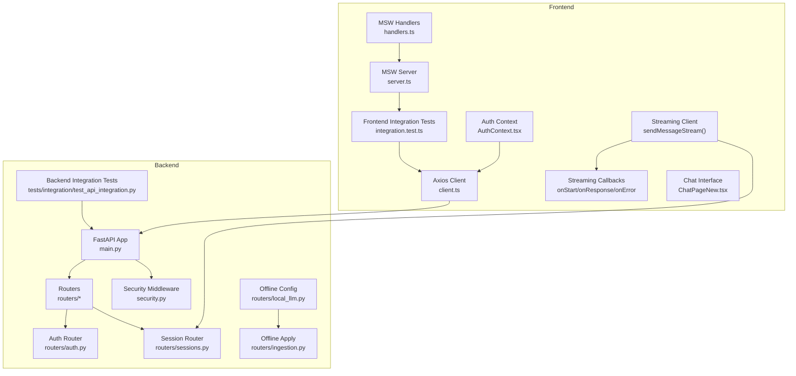

**Diagram sources**
- [client.ts](file://frontend/src/api/client.ts#L1296-L1427)
- [AuthContext.tsx](file://frontend/src/contexts/AuthContext.tsx#L1-L194)
- [server.ts](file://frontend/src/test/server.ts#L1-L9)
- [handlers.ts](file://frontend/src/test/handlers.ts#L1-L277)
- [main.py](file://backend/main.py#L200-L532)
- [security.py](file://backend/core/security.py#L147-L220)
- [auth.py](file://backend/routers/auth.py#L190-L285)
- [sessions.py](file://backend/routers/sessions.py#L1138-L1280)
- [local_llm.py](file://backend/routers/local_llm.py#L719-L756)
- [ingestion.py](file://backend/routers/ingestion.py#L371-L396)
- [test_api_integration.py](file://backend/tests/integration/test_api_integration.py#L1-L212)
- [integration.test.ts](file://frontend/src/test/integration.test.ts#L1-L271)
- [ChatPageNew.tsx](file://frontend/src/pages/ChatPageNew.tsx#L300-L360)

**Section sources**
- [client.ts](file://frontend/src/api/client.ts#L1-L200)
- [main.py](file://backend/main.py#L200-L532)

## Core Components
- Frontend HTTP client: Axios instance with base URL, interceptors for auth and error handling, and typed API modules for chat, search, profiles, ingestion, and system.
- Authentication: JWT bearer tokens stored in localStorage, validated via an auth endpoint, and cleared on 401 responses.
- Streaming API: Server-Sent Events (SSE) implementation with comprehensive callback functionality for real-time communication.
- Backend API: Versioned routes under /api/v1, CORS and security headers middleware, rate limiting, request timeouts, and centralized exception handling.
- Testing: MSW-based mock server for frontend tests and backend TestClient-based integration tests.

**Section sources**
- [client.ts](file://frontend/src/api/client.ts#L1-L200)
- [auth.py](file://backend/routers/auth.py#L190-L285)
- [main.py](file://backend/main.py#L227-L255)
- [sessions.py](file://backend/routers/sessions.py#L1138-L1280)

## Architecture Overview
The frontend communicates with the backend through Axios, which attaches Authorization headers and handles retries and error responses. The backend enforces CORS, rate limits, and timeouts, normalizes errors, and routes requests to domain-specific routers. The system now includes streaming endpoints that use Server-Sent Events for real-time communication.

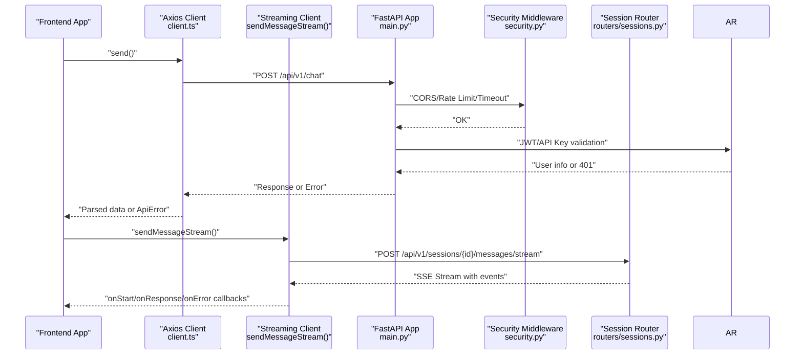

**Diagram sources**
- [client.ts](file://frontend/src/api/client.ts#L739-L765)
- [client.ts](file://frontend/src/api/client.ts#L1296-L1427)
- [main.py](file://backend/main.py#L227-L255)
- [security.py](file://backend/core/security.py#L147-L220)
- [auth.py](file://backend/routers/auth.py#L190-L285)
- [sessions.py](file://backend/routers/sessions.py#L1138-L1280)

## Detailed Component Analysis

### Frontend HTTP Client Setup and Interceptors
- Base URL: Uses a versioned prefix (/api/v1) and supports Vite proxy in development and nginx proxy in production.
- Auth interceptor: Adds Authorization: Bearer <token> when present in localStorage.
- Timeout: Standard timeout for most requests; a shorter timeout for auth-related checks.
- Retry: Automatic retry with exponential backoff for transient network errors.
- Error handling: Converts HTTP errors to a structured ApiError, dispatches a custom event on 401, and logs details in development.

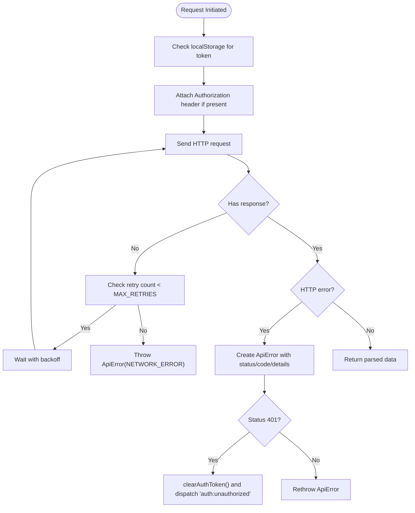

**Diagram sources**
- [client.ts](file://frontend/src/api/client.ts#L96-L159)

**Section sources**
- [client.ts](file://frontend/src/api/client.ts#L1-L194)

### Authentication and Session Handling
- Token storage: localStorage key for the JWT.
- Auth context lifecycle: Validates token on mount and visibility/focus changes, listens for 401 events, and manages a session expired modal.
- Backend auth endpoints: JWT creation on login/register, user retrieval, and logout.

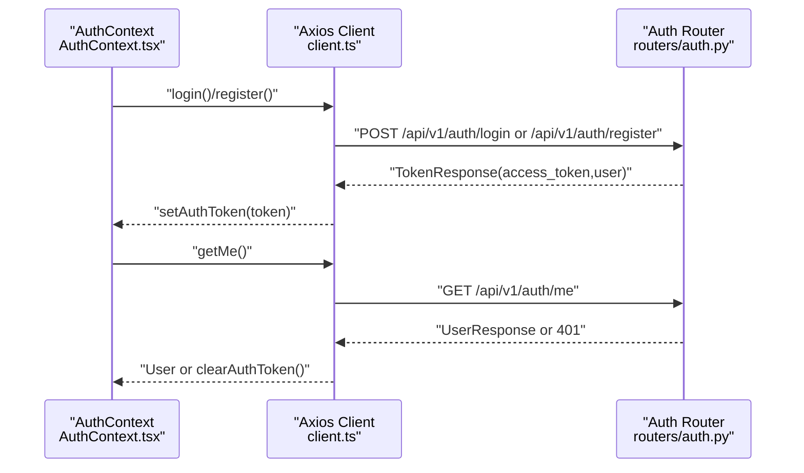

**Diagram sources**
- [AuthContext.tsx](file://frontend/src/contexts/AuthContext.tsx#L115-L157)
- [client.ts](file://frontend/src/api/client.ts#L183-L193)
- [auth.py](file://backend/routers/auth.py#L365-L422)

**Section sources**
- [AuthContext.tsx](file://frontend/src/contexts/AuthContext.tsx#L1-L194)
- [auth.py](file://backend/routers/auth.py#L190-L285)

### Backend Routing, Middleware, and Error Normalization
- Versioned routes: All routers mounted under /api/v1 with descriptive tags.
- Security middleware: CORS, security headers, rate limiting, and request timeout enforcement.
- Exception handling: Centralized handlers for validation, HTTP, and general exceptions with error IDs and optional technical details for admins.

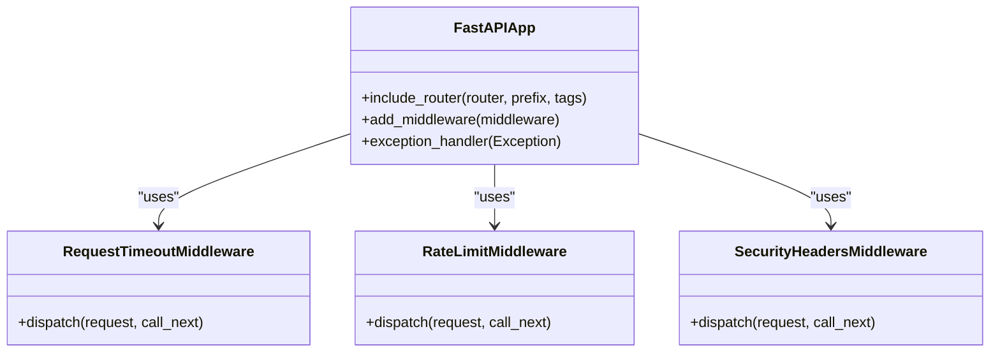

**Diagram sources**
- [main.py](file://backend/main.py#L88-L141)
- [security.py](file://backend/core/security.py#L147-L220)

**Section sources**
- [main.py](file://backend/main.py#L227-L396)
- [security.py](file://backend/core/security.py#L113-L220)

### Rate Limiting Strategy
- Categories: Separate limits for auth endpoints and general API endpoints.
- Enforcement: Per-IP sliding window with optional brute-force lockout for auth failures.
- Response: 429 with retry-after and standardized error payload.

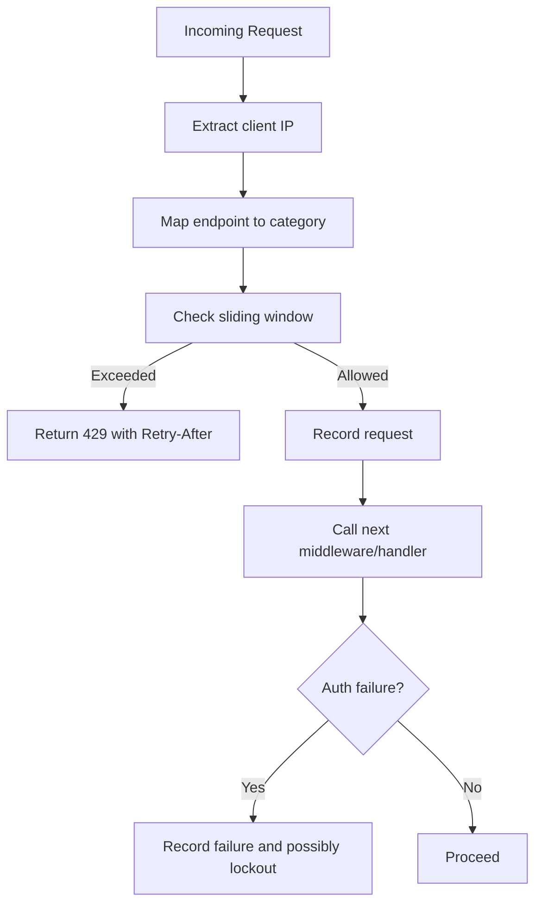

**Diagram sources**
- [security.py](file://backend/core/security.py#L147-L220)

**Section sources**
- [security.py](file://backend/core/security.py#L113-L220)

### Offline Mode Configuration and Environment Application
- Frontend configuration page allows enabling offline mode and selecting local providers/models.
- Backend stores offline configuration and applies it to runtime settings, including environment variables for local LLMs and ingestion behavior.

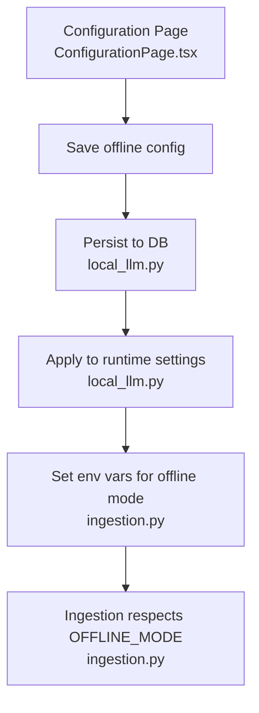

**Diagram sources**
- [local_llm.py](file://backend/routers/local_llm.py#L719-L756)
- [ingestion.py](file://backend/routers/ingestion.py#L371-L396)

**Section sources**
- [local_llm.py](file://backend/routers/local_llm.py#L719-L756)
- [ingestion.py](file://backend/routers/ingestion.py#L371-L396)

### Mock API Setup for Testing
- Frontend: MSW server with handlers for system, profiles, search, chat, and ingestion endpoints; includes error handlers for 503/500 scenarios.
- Backend: TestClient-based integration tests verifying health, profiles, search, chat, ingestion, and system stats.

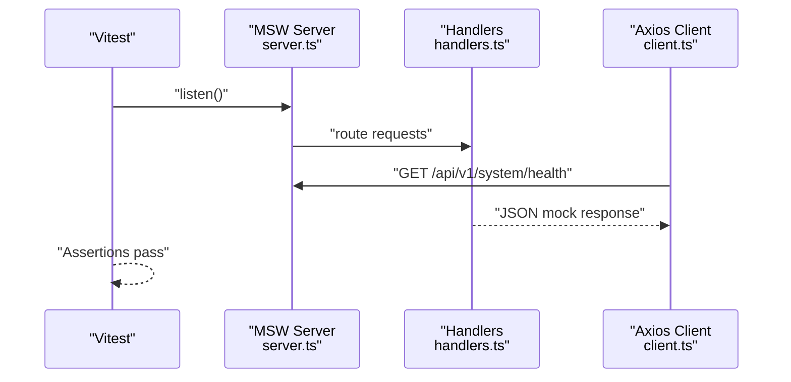

**Diagram sources**
- [server.ts](file://frontend/src/test/server.ts#L1-L9)
- [handlers.ts](file://frontend/src/test/handlers.ts#L121-L261)
- [integration.test.ts](file://frontend/src/test/integration.test.ts#L25-L55)

**Section sources**
- [server.ts](file://frontend/src/test/server.ts#L1-L9)
- [handlers.ts](file://frontend/src/test/handlers.ts#L1-L277)
- [test_api_integration.py](file://backend/tests/integration/test_api_integration.py#L1-L212)
- [integration.test.ts](file://frontend/src/test/integration.test.ts#L1-L271)

## Streaming API Implementation

### Server-Sent Events (SSE) Architecture
The system implements real-time communication using Server-Sent Events (SSE) for streaming responses. The backend generates events during federated agent processing, while the frontend consumes these events through a dedicated streaming client.

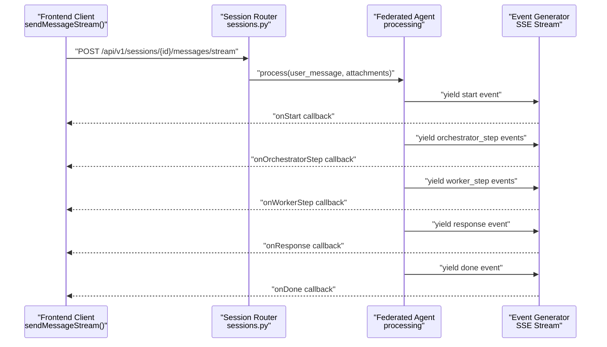

**Diagram sources**
- [client.ts](file://frontend/src/api/client.ts#L1296-L1427)
- [sessions.py](file://backend/routers/sessions.py#L1138-L1280)

### Streaming Event Types and Callbacks
The streaming implementation provides comprehensive callback functionality for different event types:

- **start**: Initial event containing agent mode and model information
- **orchestrator_step**: Individual steps from the orchestrator agent
- **worker_step**: Individual steps from worker agents performing tasks
- **response**: Final aggregated response with sources and statistics
- **error**: Error events with error messages
- **done**: Completion event indicating end of stream

**Section sources**
- [client.ts](file://frontend/src/api/client.ts#L1296-L1427)
- [sessions.py](file://backend/routers/sessions.py#L1138-L1280)

### Frontend Streaming Client Implementation
The frontend streaming client implements a robust SSE consumer with proper error handling and cancellation support:

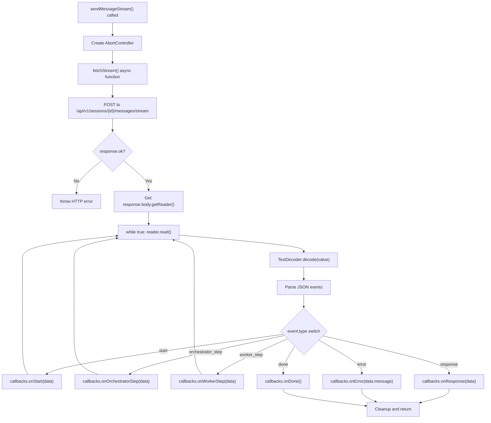

**Diagram sources**
- [client.ts](file://frontend/src/api/client.ts#L1348-L1427)

**Section sources**
- [client.ts](file://frontend/src/api/client.ts#L1296-L1427)

### Backend Streaming Endpoint Implementation
The backend streaming endpoint uses FastAPI's StreamingResponse with Server-Sent Events:

- **Media Type**: `text/event-stream`
- **Headers**: Cache-Control: no-cache, Connection: keep-alive, X-Accel-Buffering: no
- **Event Generation**: Yields JSON-encoded events with data: prefix
- **Error Handling**: Catches exceptions and sends error events

**Section sources**
- [sessions.py](file://backend/routers/sessions.py#L1272-L1280)

### Real-time Chat Interface Integration
The streaming functionality is integrated into the real-time chat interface with proper state management:

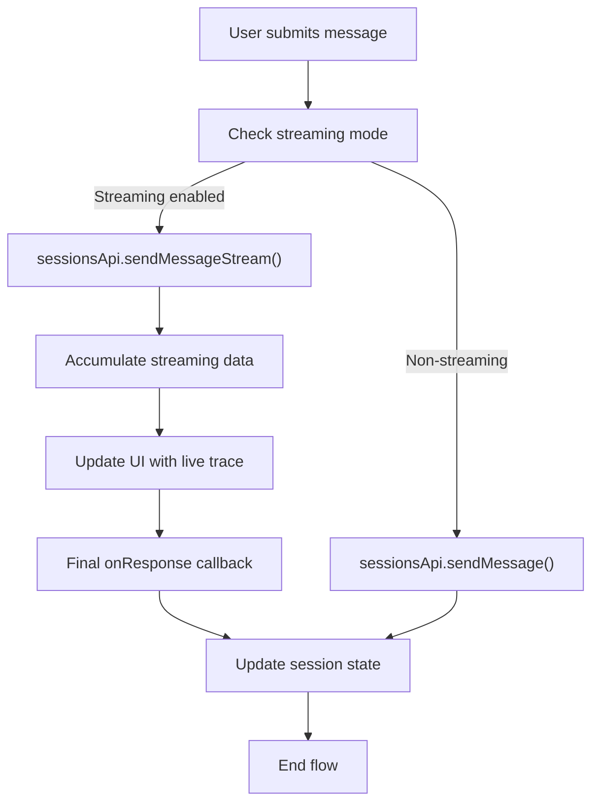

**Diagram sources**
- [ChatPageNew.tsx](file://frontend/src/pages/ChatPageNew.tsx#L300-L360)

**Section sources**
- [ChatPageNew.tsx](file://frontend/src/pages/ChatPageNew.tsx#L300-L360)

## Real-time Communication Patterns

### SSE Event Stream Processing
The system implements a sophisticated event stream processing mechanism:

- **Event Parsing**: Each line is expected to start with "data: " followed by JSON
- **Buffer Management**: Maintains buffer for partial lines and splits by newline
- **Error Recovery**: Continues processing even if individual events fail to parse
- **Abort Support**: Proper cleanup and cancellation through AbortController

### Live Trace Accumulation
The frontend accumulates streaming data to provide real-time feedback:

- **Orchestrator Steps**: Tokens usage and processing statistics
- **Worker Steps**: Tool execution results and document findings
- **Final Response**: Complete answer with sources and metadata
- **Error Handling**: Graceful degradation on stream errors

### WebSocket vs SSE Considerations
While WebSocket could provide bidirectional communication, SSE offers several advantages:
- **Simplicity**: One-way server-to-client streaming
- **Reliability**: Automatic reconnection and retry logic
- **Browser Support**: Native browser support with good fallback
- **Firewall Friendly**: HTTP-based communication

**Section sources**
- [client.ts](file://frontend/src/api/client.ts#L1348-L1427)
- [ChatPageNew.tsx](file://frontend/src/pages/ChatPageNew.tsx#L300-L360)

## Dependency Analysis
- Frontend depends on Axios for HTTP and MSW for test mocks.
- Backend depends on FastAPI, middleware modules, and MongoDB via a database manager.
- Authentication depends on JWT decoding and API key validation.
- Offline mode depends on persisted configuration and environment variable propagation.
- Streaming functionality depends on native fetch API with ReadableStream support.

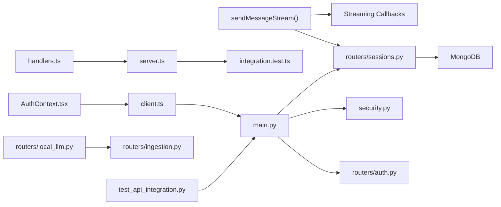

**Diagram sources**
- [client.ts](file://frontend/src/api/client.ts#L1-L200)
- [AuthContext.tsx](file://frontend/src/contexts/AuthContext.tsx#L1-L194)
- [server.ts](file://frontend/src/test/server.ts#L1-L9)
- [handlers.ts](file://frontend/src/test/handlers.ts#L1-L277)
- [main.py](file://backend/main.py#L200-L532)
- [security.py](file://backend/core/security.py#L147-L220)
- [auth.py](file://backend/routers/auth.py#L190-L285)
- [sessions.py](file://backend/routers/sessions.py#L1138-L1280)
- [local_llm.py](file://backend/routers/local_llm.py#L719-L756)
- [ingestion.py](file://backend/routers/ingestion.py#L371-L396)
- [test_api_integration.py](file://backend/tests/integration/test_api_integration.py#L1-L212)
- [integration.test.ts](file://frontend/src/test/integration.test.ts#L1-L271)

**Section sources**
- [main.py](file://backend/main.py#L200-L532)
- [security.py](file://backend/core/security.py#L147-L220)

## Performance Considerations
- Request timeouts: Short timeouts for health checks, standard timeouts for regular endpoints, and streaming endpoints excluded from timeout enforcement.
- Thread pool sizing: Larger default thread pool to support async operations and ingestion concurrency.
- Caching strategy: Local file cache for cloud sources with LFU eviction and persistent metadata.
- Parallel requests: Frontend integration tests demonstrate efficient parallel API calls.
- Streaming performance: SSE events are processed incrementally to minimize memory usage and provide immediate feedback.

**Section sources**
- [main.py](file://backend/main.py#L88-L141)
- [main.py](file://backend/main.py#L56-L72)
- [file_cache.py](file://backend/core/file_cache.py#L1-L445)
- [integration.test.ts](file://frontend/src/test/integration.test.ts#L231-L249)
- [client.ts](file://frontend/src/api/client.ts#L1348-L1427)

## Troubleshooting Guide
- Network errors: Automatic retries with backoff; if exhausted, an ApiError with NETWORK_ERROR is thrown.
- HTTP errors: ApiError populated with status, code, and optional technical details; 401 triggers token clearing and an unauthorized event.
- Backend errors: Centralized handlers return user-friendly messages with error IDs; admins receive technical details.
- Rate limiting: 429 responses include retry-after; auth failures may trigger progressive lockouts.
- Offline mode: Verify environment variables are set after saving configuration; ingestion respects OFFLINE_MODE.
- Streaming errors: SSE stream errors are caught and passed to onError callbacks; abort controller provides cancellation support.
- Event parsing: Individual event parsing failures don't interrupt the entire stream; system continues processing remaining events.

**Section sources**
- [client.ts](file://frontend/src/api/client.ts#L105-L159)
- [main.py](file://backend/main.py#L332-L396)
- [security.py](file://backend/core/security.py#L188-L220)
- [local_llm.py](file://backend/routers/local_llm.py#L719-L756)
- [ingestion.py](file://backend/routers/ingestion.py#L371-L396)
- [client.ts](file://frontend/src/api/client.ts#L1415-L1427)

## Conclusion
The frontend and backend implement a robust API integration pattern with a typed HTTP client, centralized authentication, comprehensive error handling, and strong operational controls like rate limiting and timeouts. The system now includes comprehensive streaming support with Server-Sent Events for real-time communication, enhanced error handling for streaming API implementations, and improved client-side streaming callback functionality. Testing is supported by MSW for frontend workflows and TestClient for backend integration. Offline mode is configurable and applied at runtime to enable local processing.

## Appendices
- API versioning: Routes are prefixed with /api/v1, enabling future version migrations.
- Real-time communication: SSE endpoints for streaming federated agent processing with comprehensive callback support.
- Additional testing: Backend integration tests validate health, profiles, search, chat, ingestion, and system stats.

**Section sources**
- [main.py](file://backend/main.py#L398-L500)
- [test_api_integration.py](file://backend/tests/integration/test_api_integration.py#L1-L212)
- [integration.test.ts](file://frontend/src/test/integration.test.ts#L1-L271)
- [sessions.py](file://backend/routers/sessions.py#L1138-L1280)
- [client.ts](file://frontend/src/api/client.ts#L1296-L1427)