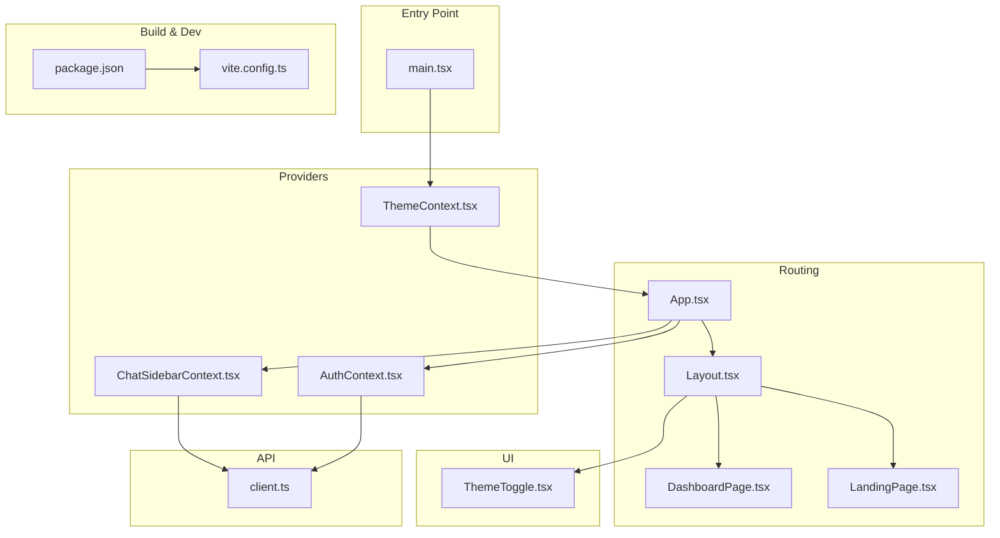
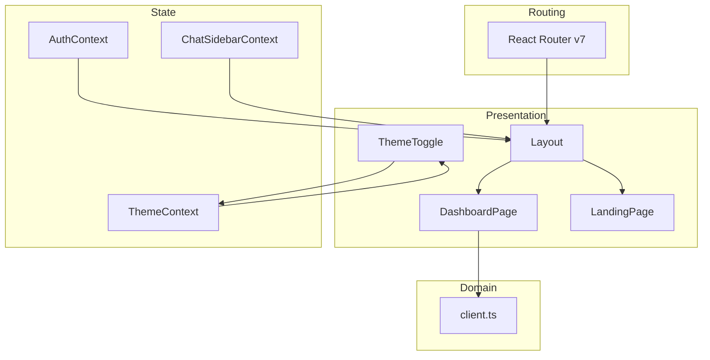
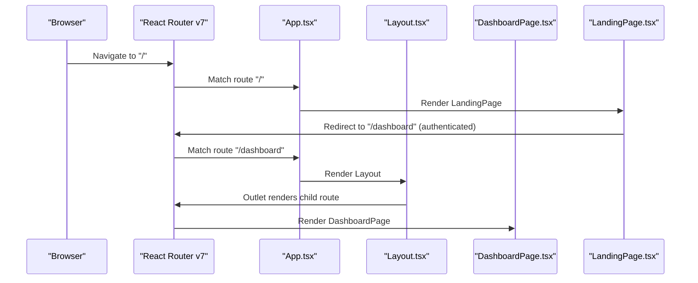
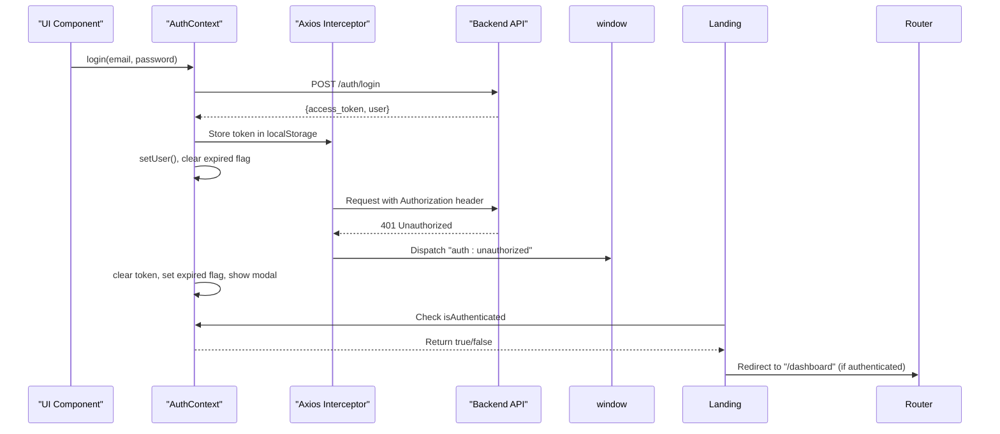
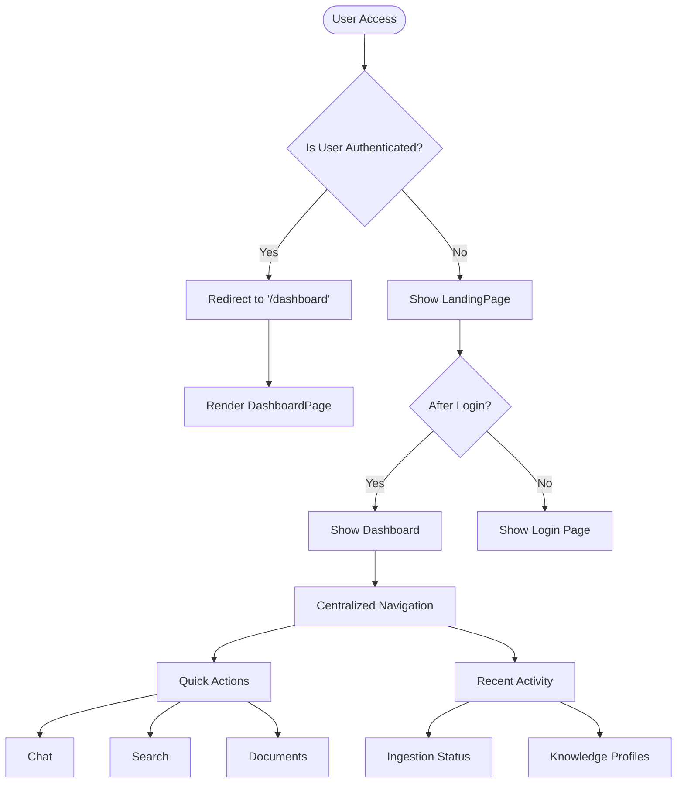
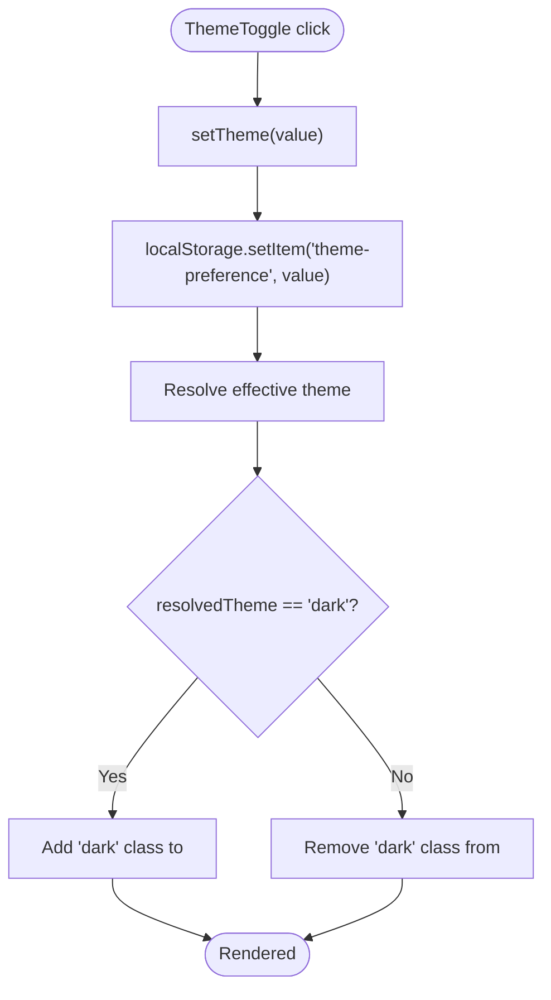
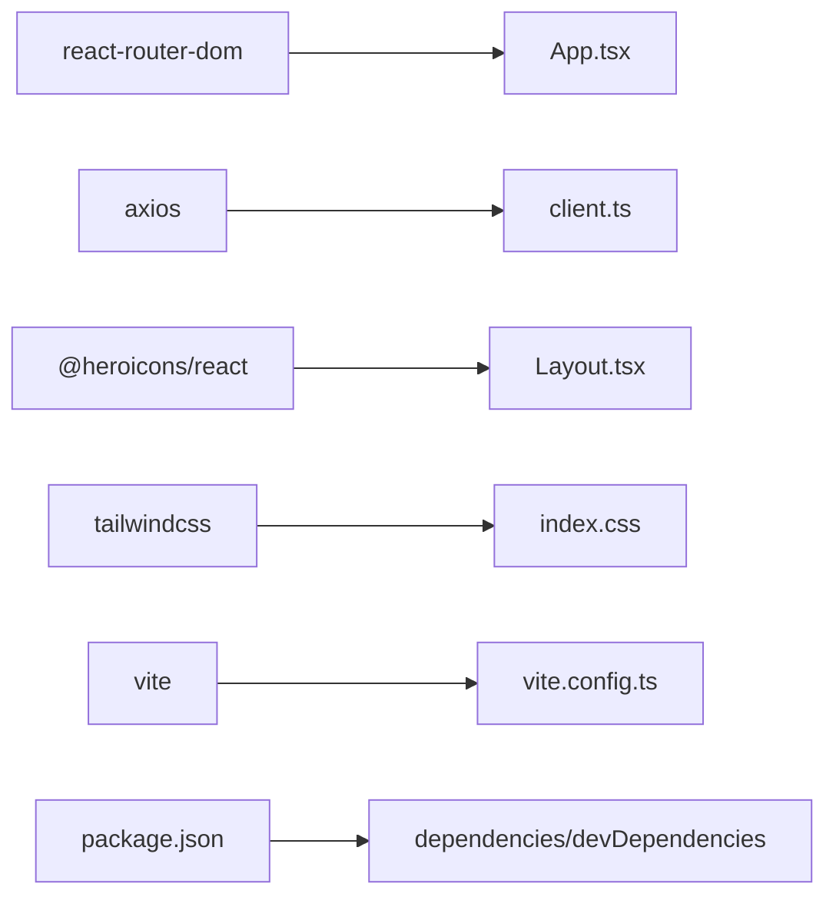

# Application Architecture

<cite>
**Referenced Files in This Document**
- [main.tsx](file://frontend/src/main.tsx)
- [App.tsx](file://frontend/src/App.tsx)
- [Layout.tsx](file://frontend/src/components/Layout.tsx)
- [AuthContext.tsx](file://frontend/src/contexts/AuthContext.tsx)
- [ChatSidebarContext.tsx](file://frontend/src/contexts/ChatSidebarContext.tsx)
- [ThemeContext.tsx](file://frontend/src/contexts/ThemeContext.tsx)
- [ThemeToggle.tsx](file://frontend/src/components/ThemeToggle.tsx)
- [client.ts](file://frontend/src/api/client.ts)
- [LandingPage.tsx](file://frontend/src/pages/LandingPage.tsx)
- [DashboardPage.tsx](file://frontend/src/pages/DashboardPage.tsx)
- [package.json](file://frontend/package.json)
- [vite.config.ts](file://frontend/vite.config.ts)
</cite>

## Update Summary
**Changes Made**
- Updated routing architecture section to reflect new '/dashboard' central hub design
- Removed references to HomePage component that has been eliminated
- Added documentation for LandingPage to Dashboard redirection flow
- Updated component hierarchy to show new nested routing structure
- Enhanced authentication flow documentation to reflect centralized dashboard approach

## Table of Contents
1. [Introduction](#introduction)
2. [Project Structure](#project-structure)
3. [Core Components](#core-components)
4. [Architecture Overview](#architecture-overview)
5. [Detailed Component Analysis](#detailed-component-analysis)
6. [Dependency Analysis](#dependency-analysis)
7. [Performance Considerations](#performance-considerations)
8. [Troubleshooting Guide](#troubleshooting-guide)
9. [Conclusion](#conclusion)
10. [Appendices](#appendices)

## Introduction
This document describes the React application architecture for the MongoDB RAG Agent frontend. It covers routing configuration with React Router, context providers for authentication and state management, layout components, and sidebar state management. The application now features a centralized dashboard architecture where '/dashboard' serves as the main hub for authenticated users, replacing the previous role-based landing pages. It explains the authentication flow, theme switching mechanism, build configuration, development workflow, and deployment considerations. The goal is to provide a clear understanding of the component hierarchy, prop drilling solutions, and state management patterns that support scalability and maintainability.

## Project Structure
The frontend is organized around a modern React + TypeScript stack with Vite for development and build. Key areas:
- Entry point initializes providers and router
- Routing defines nested routes under a shared Layout with '/dashboard' as the central hub
- Context providers encapsulate cross-cutting concerns (auth, theme, sidebar)
- Components are organized by feature and shared utilities



**Diagram sources**
- [main.tsx](file://frontend/src/main.tsx#L1-L17)
- [App.tsx](file://frontend/src/App.tsx#L1-L69)
- [Layout.tsx](file://frontend/src/components/Layout.tsx#L1-L757)
- [DashboardPage.tsx](file://frontend/src/pages/DashboardPage.tsx#L1-L535)
- [LandingPage.tsx](file://frontend/src/pages/LandingPage.tsx#L1-L300)
- [AuthContext.tsx](file://frontend/src/contexts/AuthContext.tsx#L1-L194)
- [ChatSidebarContext.tsx](file://frontend/src/contexts/ChatSidebarContext.tsx#L1-L400)
- [ThemeContext.tsx](file://frontend/src/contexts/ThemeContext.tsx#L1-L91)
- [ThemeToggle.tsx](file://frontend/src/components/ThemeToggle.tsx#L1-L39)
- [client.ts](file://frontend/src/api/client.ts#L1-L800)
- [package.json](file://frontend/package.json#L1-L48)
- [vite.config.ts](file://frontend/vite.config.ts#L1-L17)

**Section sources**
- [main.tsx](file://frontend/src/main.tsx#L1-L17)
- [App.tsx](file://frontend/src/App.tsx#L1-L69)
- [package.json](file://frontend/package.json#L1-L48)
- [vite.config.ts](file://frontend/vite.config.ts#L1-L17)

## Core Components
- Providers and Contexts
  - ThemeContext: Manages light/dark/system theme and applies CSS classes to the document root
  - AuthContext: Centralizes authentication state, token lifecycle, session validation, and unauthorized handling
  - ChatSidebarContext: Owns chat sessions, folders, current session, multi-select, and related actions
- Routing and Layout
  - App: Declares routes with nested structure where '/dashboard' serves as the central hub
  - Layout: Implements responsive sidebar, user menu, context menu, and top bar with centralized navigation
- Theme Toggle
  - ThemeToggle: Provides interactive theme switching with persisted preferences
- API Client
  - client.ts: Axios instance with interceptors, error handling, and typed APIs for auth, sessions, system, and search

Key patterns:
- Provider composition: ThemeProvider wraps the app; AuthProvider and ChatSidebarProvider wrap routes
- Context hooks: useAuth, useChatSidebar, useTheme encapsulate state and actions
- Prop drilling prevention: Shared state via contexts avoids passing props through multiple layers
- Centralized dashboard: '/dashboard' serves as the main entry point for authenticated users

**Section sources**
- [ThemeContext.tsx](file://frontend/src/contexts/ThemeContext.tsx#L1-L91)
- [AuthContext.tsx](file://frontend/src/contexts/AuthContext.tsx#L1-L194)
- [ChatSidebarContext.tsx](file://frontend/src/contexts/ChatSidebarContext.tsx#L1-L400)
- [App.tsx](file://frontend/src/App.tsx#L1-L69)
- [Layout.tsx](file://frontend/src/components/Layout.tsx#L1-L757)
- [ThemeToggle.tsx](file://frontend/src/components/ThemeToggle.tsx#L1-L39)
- [client.ts](file://frontend/src/api/client.ts#L1-L800)

## Architecture Overview
The application follows a layered architecture with a centralized dashboard approach:
- Presentation Layer: React components and layouts with '/dashboard' as the main hub
- State Management Layer: Context providers for theme, auth, and sidebar
- Domain Services Layer: API client module encapsulating HTTP interactions
- Routing Layer: React Router v7 with nested routes and outlets, featuring centralized dashboard



**Diagram sources**
- [Layout.tsx](file://frontend/src/components/Layout.tsx#L1-L757)
- [ThemeToggle.tsx](file://frontend/src/components/ThemeToggle.tsx#L1-L39)
- [DashboardPage.tsx](file://frontend/src/pages/DashboardPage.tsx#L1-L535)
- [LandingPage.tsx](file://frontend/src/pages/LandingPage.tsx#L1-L300)
- [ThemeContext.tsx](file://frontend/src/contexts/ThemeContext.tsx#L1-L91)
- [AuthContext.tsx](file://frontend/src/contexts/AuthContext.tsx#L1-L194)
- [ChatSidebarContext.tsx](file://frontend/src/contexts/ChatSidebarContext.tsx#L1-L400)
- [client.ts](file://frontend/src/api/client.ts#L1-L800)
- [App.tsx](file://frontend/src/App.tsx#L1-L69)

## Detailed Component Analysis

### Routing Configuration with React Router
- Root providers initialize ThemeProvider and BrowserRouter at the top level
- App declares routes with nested structure where '/dashboard' serves as the central hub
- Nested routes include chat, search, documents, system administration, cloud sources, and more
- A catch-all route renders NotFoundPage
- LandingPage provides initial landing experience and redirects authenticated users to '/dashboard'



**Diagram sources**
- [main.tsx](file://frontend/src/main.tsx#L1-L17)
- [App.tsx](file://frontend/src/App.tsx#L1-L69)
- [Layout.tsx](file://frontend/src/components/Layout.tsx#L1-L757)
- [DashboardPage.tsx](file://frontend/src/pages/DashboardPage.tsx#L1-L535)
- [LandingPage.tsx](file://frontend/src/pages/LandingPage.tsx#L1-L300)

**Section sources**
- [main.tsx](file://frontend/src/main.tsx#L1-L17)
- [App.tsx](file://frontend/src/App.tsx#L1-L69)

### Authentication Flow and Session Management
- AuthContext manages:
  - User state, loading, and session expiration flag
  - Login/register/logout actions
  - Periodic token validation with throttling
  - Visibility/focus-based revalidation
  - Unauthorized event handling to trigger session expired modal
- API client sets Authorization header and dispatches a custom event on 401
- SessionExpiredModal is rendered conditionally via the provider
- LandingPage redirects authenticated users to '/dashboard' for centralized access



**Diagram sources**
- [AuthContext.tsx](file://frontend/src/contexts/AuthContext.tsx#L1-L194)
- [client.ts](file://frontend/src/api/client.ts#L1-L800)
- [LandingPage.tsx](file://frontend/src/pages/LandingPage.tsx#L1-L300)

**Section sources**
- [AuthContext.tsx](file://frontend/src/contexts/AuthContext.tsx#L1-L194)
- [client.ts](file://frontend/src/api/client.ts#L1-L800)

### Centralized Dashboard Architecture
- '/dashboard' serves as the central hub for authenticated users
- DashboardPage provides overview of recent activities, quick actions, and system status
- LandingPage handles initial landing experience and redirects authenticated users
- Role-based access controls are handled within individual pages rather than separate landing pages
- Navigation flows through Layout component with centralized menu structure



**Diagram sources**
- [DashboardPage.tsx](file://frontend/src/pages/DashboardPage.tsx#L1-L535)
- [LandingPage.tsx](file://frontend/src/pages/LandingPage.tsx#L1-L300)
- [Layout.tsx](file://frontend/src/components/Layout.tsx#L1-L757)

**Section sources**
- [DashboardPage.tsx](file://frontend/src/pages/DashboardPage.tsx#L1-L535)
- [LandingPage.tsx](file://frontend/src/pages/LandingPage.tsx#L1-L300)

### Theme Switching Mechanism
- ThemeContext stores user preference in localStorage and resolves effective theme
- Applies a "dark" class to document.documentElement when resolved theme is dark
- ThemeToggle presents three options: light, dark, system
- Listens for system preference changes and updates resolved theme accordingly



**Diagram sources**
- [ThemeContext.tsx](file://frontend/src/contexts/ThemeContext.tsx#L1-L91)
- [ThemeToggle.tsx](file://frontend/src/components/ThemeToggle.tsx#L1-L39)

**Section sources**
- [ThemeContext.tsx](file://frontend/src/contexts/ThemeContext.tsx#L1-L91)
- [ThemeToggle.tsx](file://frontend/src/components/ThemeToggle.tsx#L1-L39)

### Sidebar State Management and Composition
- ChatSidebarContext centralizes:
  - Sessions and folders lists
  - Current session and loading state
  - Collapsed folders (persisted in localStorage)
  - Editing title, context menu position
  - Multi-select mode and selection set
  - Actions: create, select, delete, pin, update title, create/delete folders, toggle folder, archive/delete selected
- Layout composes:
  - Sidebar content with new chat, folders, pinned and regular chats
  - User menu with navigation and logout
  - Context menu for per-session actions
  - Top bar on mobile and non-chat pages
- DashboardPage integrates with sidebar for seamless navigation

```mermaid
classDiagram
class ChatSidebarContext {
+sessions : ChatSession[]
+folders : ChatFolder[]
+currentSession : ChatSession | null
+isSidebarLoading : boolean
+collapsedFolders : Set<string>
+editingTitle : string | null
+contextMenu : {x,y,sessionId} | null
+isSelectMode : boolean
+selectedSessions : Set<string>
+loadSessions()
+handleNewChat()
+handleSelectSession()
+handleDeleteSession()
+handleTogglePin()
+handleUpdateTitle()
+handleCreateFolder()
+handleDeleteFolder()
+toggleFolder()
+toggleSelectMode()
+toggleSessionSelection()
+selectAllSessions()
+clearSelection()
+archiveSelected()
+deleteSelected()
}
class Layout {
+sidebarOpen : boolean
+userMenuOpen : boolean
+systemMenuOpen : boolean
+getPageTitle()
+handleLogout()
}
class DashboardPage {
+recentDocs : Document[]
+ingestionRuns : IngestionRunSummary[]
+currentIngestion : IngestionStatus | null
+profiles : ProfileListResponse | null
+fetchData()
+getGreeting()
}
ChatSidebarContext --> Layout : "consumed via useChatSidebar()"
DashboardPage --> ChatSidebarContext : "uses for session data"
```

**Diagram sources**
- [ChatSidebarContext.tsx](file://frontend/src/contexts/ChatSidebarContext.tsx#L1-L400)
- [Layout.tsx](file://frontend/src/components/Layout.tsx#L1-L757)
- [DashboardPage.tsx](file://frontend/src/pages/DashboardPage.tsx#L1-L535)

**Section sources**
- [ChatSidebarContext.tsx](file://frontend/src/contexts/ChatSidebarContext.tsx#L1-L400)
- [Layout.tsx](file://frontend/src/components/Layout.tsx#L1-L757)
- [DashboardPage.tsx](file://frontend/src/pages/DashboardPage.tsx#L1-L535)

### Component Composition Patterns and Reusability
- Provider-first architecture reduces prop drilling by placing state higher in the tree
- Hooks like useAuth and useChatSidebar expose normalized actions and state
- Shared UI patterns:
  - SessionItem reused across folders and pinned lists
  - Context menu shared across sessions
  - ThemeToggle reused in user menu
- Feature-based organization:
  - Pages grouped under system/*, cloud-sources/*
  - Shared components under components/
  - Cross-cutting concerns under contexts/
- Centralized dashboard pattern eliminates role-based landing pages in favor of unified access

**Section sources**
- [Layout.tsx](file://frontend/src/components/Layout.tsx#L680-L757)
- [ThemeToggle.tsx](file://frontend/src/components/ThemeToggle.tsx#L1-L39)

## Dependency Analysis
External dependencies and tooling:
- React Router v7 for routing
- Axios for HTTP requests with interceptors
- Tailwind CSS for styling
- Vite for dev server and build
- TypeScript for type safety



**Diagram sources**
- [App.tsx](file://frontend/src/App.tsx#L1-L69)
- [client.ts](file://frontend/src/api/client.ts#L1-L800)
- [Layout.tsx](file://frontend/src/components/Layout.tsx#L1-L757)
- [vite.config.ts](file://frontend/vite.config.ts#L1-L17)
- [package.json](file://frontend/package.json#L1-L48)

**Section sources**
- [package.json](file://frontend/package.json#L1-L48)
- [vite.config.ts](file://frontend/vite.config.ts#L1-L17)

## Performance Considerations
- Auth validation throttling: Prevents frequent token checks by caching last validation time
- Lazy loading: Consider code-splitting routes for heavy pages
- Efficient rendering:
  - Memoized callbacks in contexts reduce unnecessary re-renders
  - Local storage persistence minimizes repeated fetches
- Network resilience:
  - Axios interceptors implement retry logic and user-friendly error messages
  - Shorter timeouts for auth-related checks improve perceived responsiveness
- Theming:
  - CSS class toggling on html element is efficient and avoids deep propagation
- Centralized dashboard optimization:
  - DashboardPage uses concurrent API calls for improved performance
  - Data filtering based on user permissions reduces unnecessary data transfer

## Troubleshooting Guide
Common issues and remedies:
- Authentication errors
  - 401 responses trigger a custom event; AuthContext clears token and shows session expired modal
  - Verify token presence in localStorage and Authorization header injection
- Network connectivity
  - Axios interceptor retries transient failures; check console for retry logs
- Session state inconsistencies
  - Ensure ChatSidebarContext loads sessions after auth is ready
  - Confirm collapsed folders persistence in localStorage
- Theme not applying
  - Verify "dark" class on document.documentElement and localStorage key presence
- Dashboard access issues
  - Ensure '/dashboard' route is properly nested under Layout component
  - Verify DashboardPage loads data only after authentication is complete
- LandingPage redirection
  - Check isAuthenticated state in LandingPage
  - Verify redirect logic to '/dashboard' for authenticated users

**Section sources**
- [AuthContext.tsx](file://frontend/src/contexts/AuthContext.tsx#L94-L106)
- [client.ts](file://frontend/src/api/client.ts#L105-L159)
- [ChatSidebarContext.tsx](file://frontend/src/contexts/ChatSidebarContext.tsx#L153-L159)
- [ThemeContext.tsx](file://frontend/src/contexts/ThemeContext.tsx#L67-L75)
- [DashboardPage.tsx](file://frontend/src/pages/DashboardPage.tsx#L128-L132)
- [LandingPage.tsx](file://frontend/src/pages/LandingPage.tsx#L107-L124)

## Conclusion
The frontend employs a clean, scalable architecture centered on context providers and React Router with a centralized dashboard approach. The elimination of role-based landing pages in favor of a unified '/dashboard' hub simplifies navigation and improves user experience. Authentication, theming, and sidebar state are encapsulated in dedicated contexts, minimizing prop drilling and improving modularity. The API client centralizes HTTP concerns with robust error handling and interceptors. The development and build toolchain (Vite, TypeScript, Tailwind) supports rapid iteration and reliable builds. These patterns collectively support maintainability and extensibility as the application evolves.

## Appendices

### Build Configuration and Development Workflow
- Scripts
  - dev: starts Vite dev server
  - build: compiles TypeScript then Vite build
  - preview: serves built assets locally
  - test/test:run/test:coverage: Vitest-based testing
- Proxy configuration
  - API requests to /api are proxied to http://localhost:11000 during development
- Environment
  - Development logs enabled via interceptors

**Section sources**
- [package.json](file://frontend/package.json#L1-L48)
- [vite.config.ts](file://frontend/vite.config.ts#L1-L17)