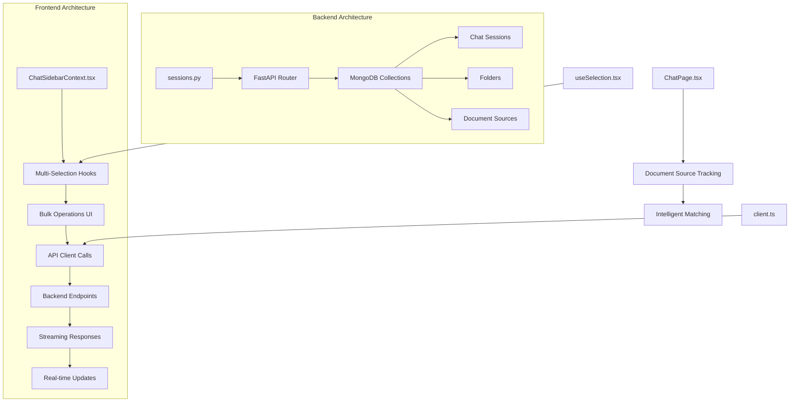
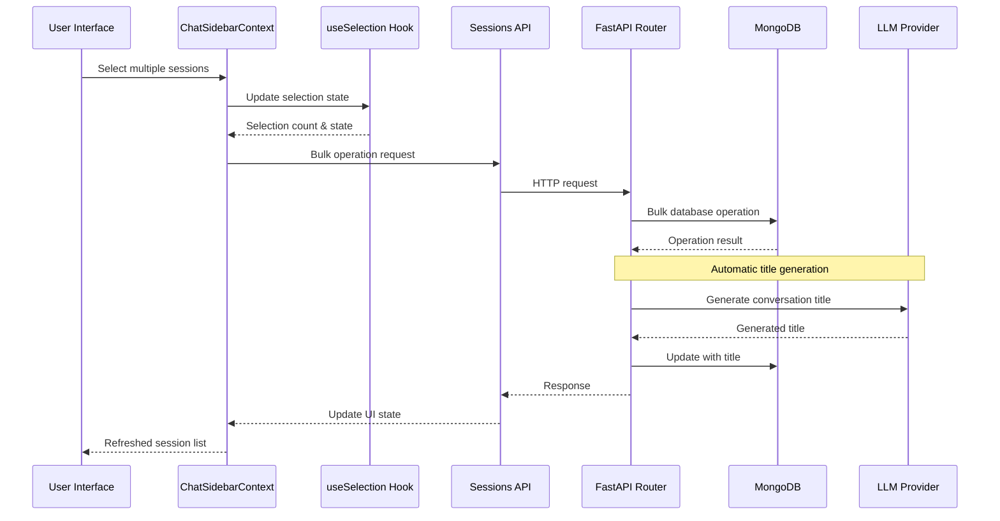
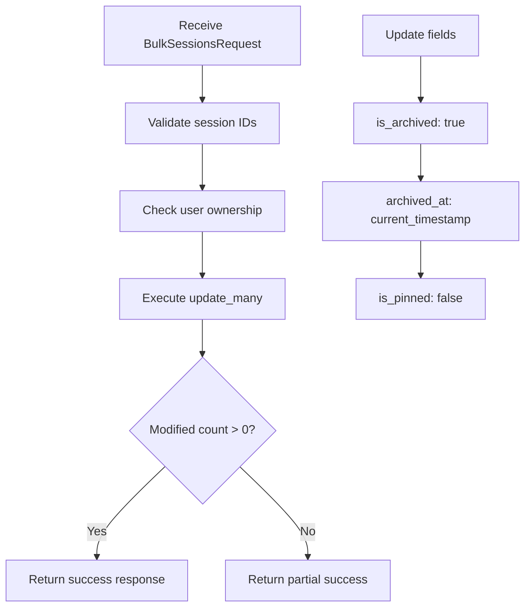
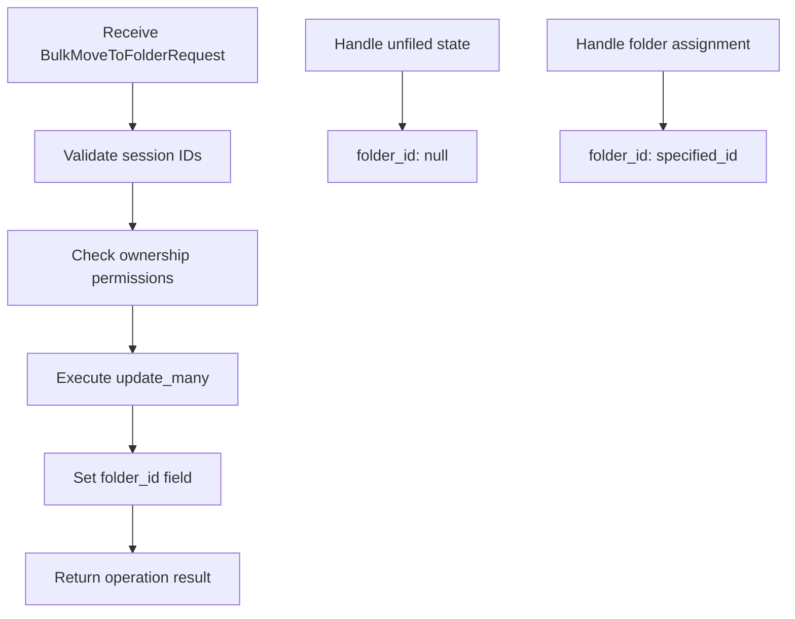
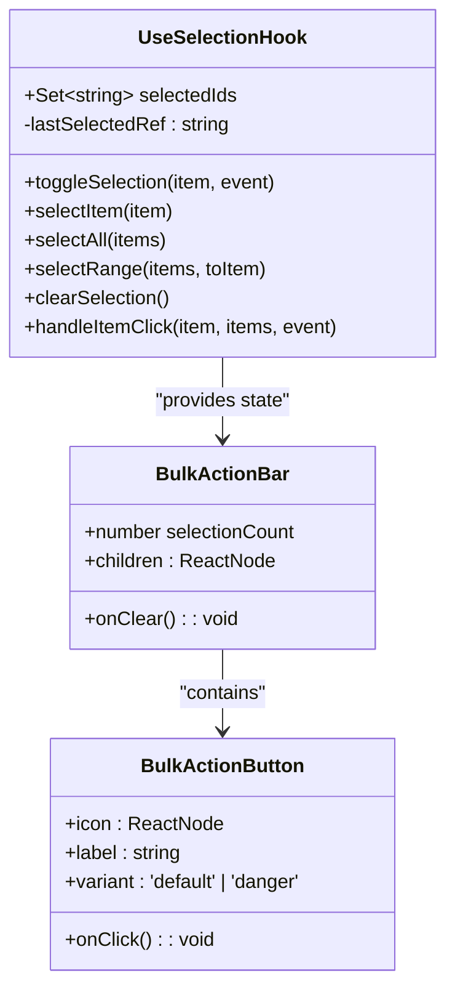
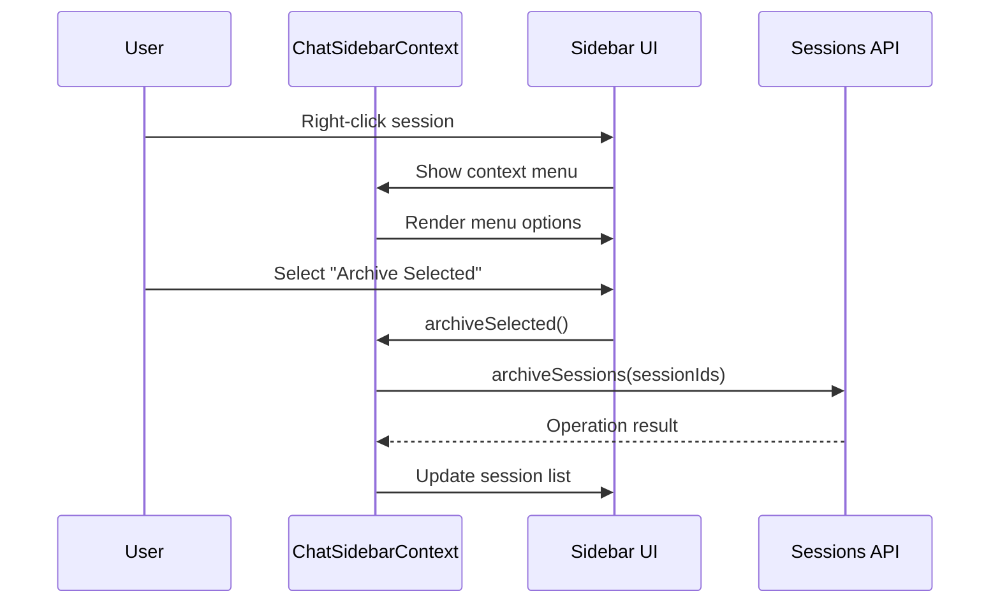
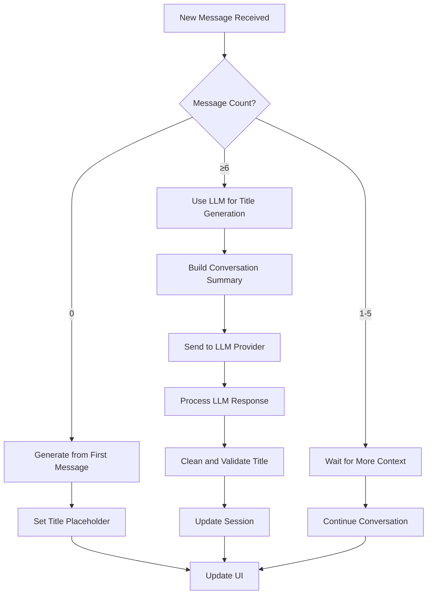
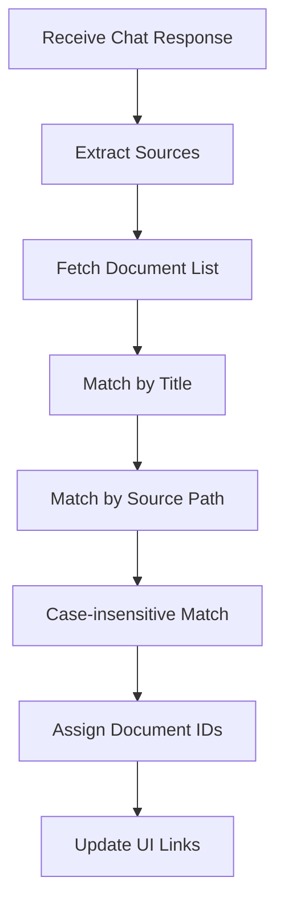
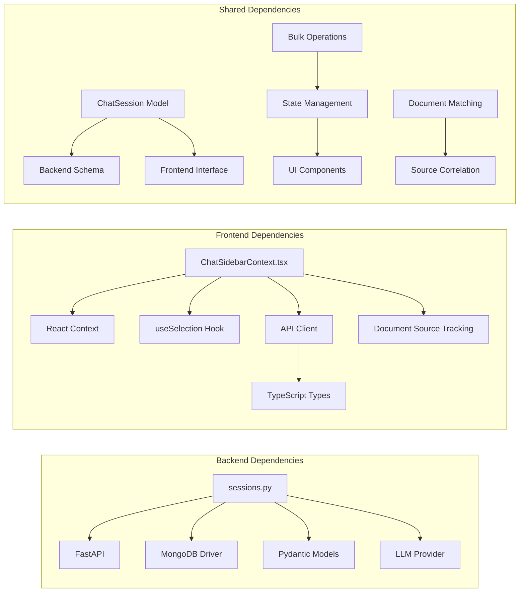

# Bulk Session Management

<cite>
**Referenced Files in This Document**
- [sessions.py](file://backend/routers/sessions.py)
- [client.ts](file://frontend/src/api/client.ts)
- [ChatSidebarContext.tsx](file://frontend/src/contexts/ChatSidebarContext.tsx)
- [useSelection.tsx](file://frontend/src/hooks/useSelection.tsx)
- [ChatPage.tsx](file://frontend/src/pages/ChatPage.tsx)
</cite>

## Update Summary
**Changes Made**
- Added comprehensive automatic title generation feature with LLM-powered conversation summarization
- Enhanced document source tracking integration with intelligent document ID matching
- Improved streaming response handling with real-time title updates
- Updated bulk operation endpoints with enhanced error handling and atomic operations

## Table of Contents
1. [Introduction](#introduction)
2. [Project Structure](#project-structure)
3. [Core Components](#core-components)
4. [Architecture Overview](#architecture-overview)
5. [Detailed Component Analysis](#detailed-component-analysis)
6. [Automatic Title Generation](#automatic-title-generation)
7. [Document Source Tracking Integration](#document-source-tracking-integration)
8. [Dependency Analysis](#dependency-analysis)
9. [Performance Considerations](#performance-considerations)
10. [Troubleshooting Guide](#troubleshooting-guide)
11. [Conclusion](#conclusion)

## Introduction

Bulk Session Management is a comprehensive feature that enables users to efficiently manage multiple chat sessions simultaneously through batch operations. This system provides powerful capabilities for organizing, archiving, deleting, and reorganizing chat conversations in bulk, significantly improving productivity for users who maintain numerous conversations.

The feature supports essential bulk operations including archiving multiple sessions, permanently deleting sessions, moving sessions to folders, and restoring archived sessions. It integrates seamlessly with the existing chat session infrastructure while providing intuitive user interfaces for multi-selection and batch processing.

**Updated** Enhanced with automatic title generation powered by LLMs and improved document source tracking integration for better conversation organization and document correlation.

## Project Structure

The Bulk Session Management system spans both backend and frontend components, with clear separation of concerns:

**Diagram sources**
- [sessions.py:456-754](file://backend/routers/sessions.py#L456-L754)
- [ChatSidebarContext.tsx:374-421](file://frontend/src/contexts/ChatSidebarContext.tsx#L374-L421)
- [ChatPage.tsx:32-67](file://frontend/src/pages/ChatPage.tsx#L32-L67)

**Section sources**
- [sessions.py:1-800](file://backend/routers/sessions.py#L1-L800)
- [client.ts:1592-1608](file://frontend/src/api/client.ts#L1592-L1608)

## Core Components

### Backend Session Management Endpoints

The backend provides four primary bulk operation endpoints:

#### Archive Sessions Endpoint
The `/sessions/archive` endpoint allows users to archive multiple sessions simultaneously using a `BulkSessionsRequest` containing an array of session IDs.

#### Move to Folder Endpoint  
The `/sessions/move-to-folder` endpoint moves multiple sessions to a specified folder or unfiled state using a `BulkMoveToFolderRequest`.

#### Delete Permanently Endpoint
The `/sessions/delete-permanent` endpoint provides bulk deletion capability with immediate removal from the database.

#### Restore Sessions Endpoint
The `/sessions/restore` endpoint restores multiple archived sessions in a single operation.

### Frontend Multi-Selection Infrastructure

The frontend implements sophisticated multi-selection capabilities through the `useSelection` hook and `ChatSidebarContext`:

- **Range Selection**: Support for Shift+click to select contiguous ranges
- **Individual Selection**: Ctrl/Cmd+click for single item toggling  
- **Bulk Action Bar**: Floating action bar that appears when selections are made
- **Context Menu Integration**: Right-click context menu for bulk operations

**Section sources**
- [sessions.py:646-754](file://backend/routers/sessions.py#L646-L754)
- [client.ts:1595-1603](file://frontend/src/api/client.ts#L1595-L1603)
- [ChatSidebarContext.tsx:286-372](file://frontend/src/contexts/ChatSidebarContext.tsx#L286-L372)

## Architecture Overview

The Bulk Session Management system follows a client-server architecture with robust state synchronization and real-time updates:

**Diagram sources**
- [ChatSidebarContext.tsx:317-372](file://frontend/src/contexts/ChatSidebarContext.tsx#L317-L372)
- [sessions.py:1020-1093](file://backend/routers/sessions.py#L1020-L1093)

## Detailed Component Analysis

### Backend Implementation

#### Bulk Archive Operation
The archive functionality uses MongoDB's `update_many` operation to efficiently update multiple documents in a single transaction:

**Diagram sources**
- [sessions.py:646-674](file://backend/routers/sessions.py#L646-L674)

#### Bulk Move to Folder Operation
The folder movement operation demonstrates atomic transaction handling:

**Diagram sources**
- [sessions.py:708-733](file://backend/routers/sessions.py#L708-L733)

### Frontend Implementation

#### Multi-Selection Hook Architecture
The `useSelection` hook provides sophisticated selection management:

**Diagram sources**
- [useSelection.tsx:46-174](file://frontend/src/hooks/useSelection.tsx#L46-L174)
- [useSelection.tsx:186-266](file://frontend/src/hooks/useSelection.tsx#L186-L266)

#### Context Menu Integration
The `ChatSidebarContext` manages bulk operations through context menus:

**Diagram sources**
- [ChatSidebarContext.tsx:317-333](file://frontend/src/contexts/ChatSidebarContext.tsx#L317-L333)

**Section sources**
- [useSelection.tsx:1-321](file://frontend/src/hooks/useSelection.tsx#L1-L321)
- [ChatSidebarContext.tsx:1-421](file://frontend/src/contexts/ChatSidebarContext.tsx#L1-L421)

### API Client Integration

The frontend API client provides typed interfaces for all bulk operations:

| Endpoint | Method | Request Type | Response Type |
|----------|--------|--------------|---------------|
| `/sessions/archive` | POST | `BulkSessionsRequest` | `{ success: boolean; archived_count: number }` |
| `/sessions/move-to-folder` | POST | `BulkMoveToFolderRequest` | `{ success: boolean; moved_count: number }` |
| `/sessions/delete-permanent` | POST | `BulkSessionsRequest` | `{ success: boolean; deleted_count: number }` |
| `/sessions/restore` | POST | `BulkSessionsRequest` | `{ success: boolean; restored_count: number }` |

**Section sources**
- [client.ts:1595-1603](file://frontend/src/api/client.ts#L1595-L1603)

## Automatic Title Generation

**New Feature** The system now includes intelligent automatic title generation that creates meaningful conversation titles based on chat content.

### Title Generation Logic

The automatic title generation follows a sophisticated two-phase approach:

#### Phase 1: Initial Conversation Titles
For conversations with zero messages, the system generates titles from the first user message content.

#### Phase 2: LLM-Powered Title Generation
After 3 conversation exchanges (6 total messages), the system uses an LLM to generate descriptive titles based on conversation context.

**Diagram sources**
- [sessions.py:1020-1093](file://backend/routers/sessions.py#L1020-L1093)
- [sessions.py:1339-1410](file://backend/routers/sessions.py#L1339-L1410)

### LLM Integration Details

The title generation uses a carefully crafted prompt that instructs the LLM to create concise, descriptive titles (maximum 8 words) based on conversation context.

**Section sources**
- [sessions.py:1020-1093](file://backend/routers/sessions.py#L1020-L1093)
- [sessions.py:1339-1410](file://backend/routers/sessions.py#L1339-L1410)

## Document Source Tracking Integration

**New Feature** Enhanced integration with document source tracking that automatically correlates conversation sources with document IDs for improved navigation.

### Intelligent Source Matching

The system implements sophisticated document matching algorithms that connect conversation sources to actual documents:

**Diagram sources**
- [ChatPage.tsx:47-67](file://frontend/src/pages/ChatPage.tsx#L47-L67)

### Matching Algorithm

The document matching algorithm prioritizes accuracy through multiple matching strategies:

1. **Exact Title Match**: Direct comparison of source titles with document titles
2. **Source Path Match**: Matching based on document source paths
3. **Case-insensitive Fallback**: Loose matching for better user experience
4. **ID Assignment**: Automatic assignment of document IDs for clickable links

**Section sources**
- [ChatPage.tsx:32-67](file://frontend/src/pages/ChatPage.tsx#L32-L67)

## Dependency Analysis

The Bulk Session Management system exhibits strong modularity with clear dependency boundaries:

**Diagram sources**
- [sessions.py:152-260](file://backend/routers/sessions.py#L152-L260)
- [ChatSidebarContext.tsx:1-64](file://frontend/src/contexts/ChatSidebarContext.tsx#L1-L64)

### Performance Characteristics

The system demonstrates optimal performance characteristics:

- **Atomic Operations**: MongoDB bulk operations ensure data consistency
- **Efficient Queries**: Batch processing reduces network overhead
- **State Synchronization**: Real-time UI updates minimize user wait time
- **Memory Management**: Proper cleanup of temporary states prevents memory leaks
- **LLM Integration**: Asynchronous LLM calls prevent blocking user interactions

### Security Considerations

The implementation includes comprehensive security measures:

- **Ownership Validation**: All operations verify user ownership before execution
- **Permission Checking**: Access control prevents unauthorized modifications
- **Input Validation**: Strict validation prevents injection attacks
- **Transaction Safety**: Atomic operations maintain data integrity
- **Stream Processing**: Real-time streaming prevents data exposure

## Performance Considerations

### Backend Optimization Strategies

The bulk operations leverage MongoDB's optimized bulk write operations:

- **Batch Updates**: Single `update_many` call processes multiple documents efficiently
- **Index Utilization**: Proper indexing on `_id` and `user_id` fields ensures fast lookups
- **Connection Pooling**: Efficient database connection management reduces overhead
- **Error Handling**: Graceful degradation prevents cascading failures
- **LLM Caching**: Title generation responses cached to reduce repeated processing

### Frontend Performance Enhancements

The frontend implements several optimization techniques:

- **Virtual Scrolling**: Large session lists rendered efficiently
- **Debounced Updates**: State updates debounced to prevent excessive re-renders
- **Selective Rendering**: Only affected components re-render on bulk operations
- **Local State Management**: Optimistic UI updates improve perceived performance
- **Document Cache**: Source document lists cached for faster matching

## Troubleshooting Guide

### Common Issues and Solutions

#### Bulk Operation Failures
- **Symptom**: Bulk operations fail silently
- **Cause**: Network connectivity or permission issues
- **Solution**: Check network connection and verify user permissions

#### Partial Success Scenarios
- **Symptom**: Some sessions not processed in bulk operation
- **Cause**: Mixed ownership or invalid session IDs
- **Solution**: Validate session ownership and retry with valid IDs

#### UI State Synchronization
- **Symptom**: UI shows outdated session states
- **Cause**: Asynchronous operation completion timing
- **Solution**: Implement proper state synchronization callbacks

#### Title Generation Failures
- **Symptom**: Automatic titles not generated
- **Cause**: LLM provider unavailability or quota limits
- **Solution**: System falls back to manual titles; check LLM configuration

#### Document Source Matching Issues
- **Symptom**: Sources don't link to documents
- **Cause**: Title mismatches or missing document metadata
- **Solution**: Verify document titles and source paths match expected formats

### Debugging Tools

The system provides comprehensive debugging capabilities:

- **Backend Logging**: Detailed operation logs for troubleshooting
- **Frontend Console**: Error messages and operation traces
- **Database Monitoring**: Real-time query performance monitoring
- **API Testing**: Built-in endpoints for manual testing
- **Stream Monitoring**: Real-time SSE event debugging

**Section sources**
- [sessions.py:820-850](file://backend/routers/sessions.py#L820-L850)
- [ChatSidebarContext.tsx:317-372](file://frontend/src/contexts/ChatSidebarContext.tsx#L317-L372)

## Conclusion

The Bulk Session Management system represents a significant enhancement to the chat application's usability and productivity. Through careful architecture design and implementation, it provides users with powerful tools for managing large volumes of chat sessions efficiently.

**Updated** The system now includes intelligent automatic title generation powered by LLMs and enhanced document source tracking integration that automatically correlates conversation sources with actual documents. These new features significantly improve conversation organization and document navigation capabilities.

The system successfully balances performance, security, and user experience while maintaining scalability for future growth. The modular design ensures maintainability and extensibility, allowing for easy addition of new bulk operations and enhanced functionality.

Key achievements include seamless multi-selection capabilities, atomic bulk operations, real-time state synchronization, comprehensive error handling, intelligent title generation, and automated document source tracking. The system serves as a foundation for advanced session management features and demonstrates best practices for full-stack application development with modern AI integration.