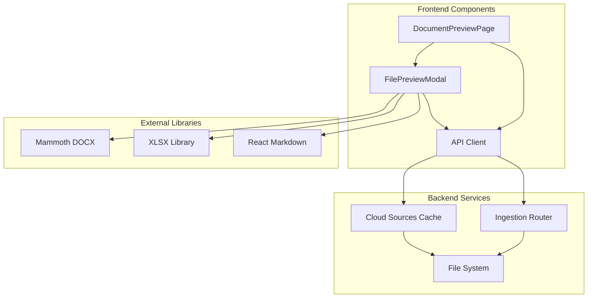
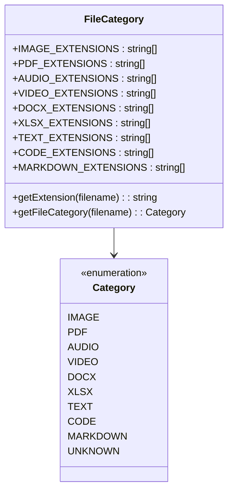
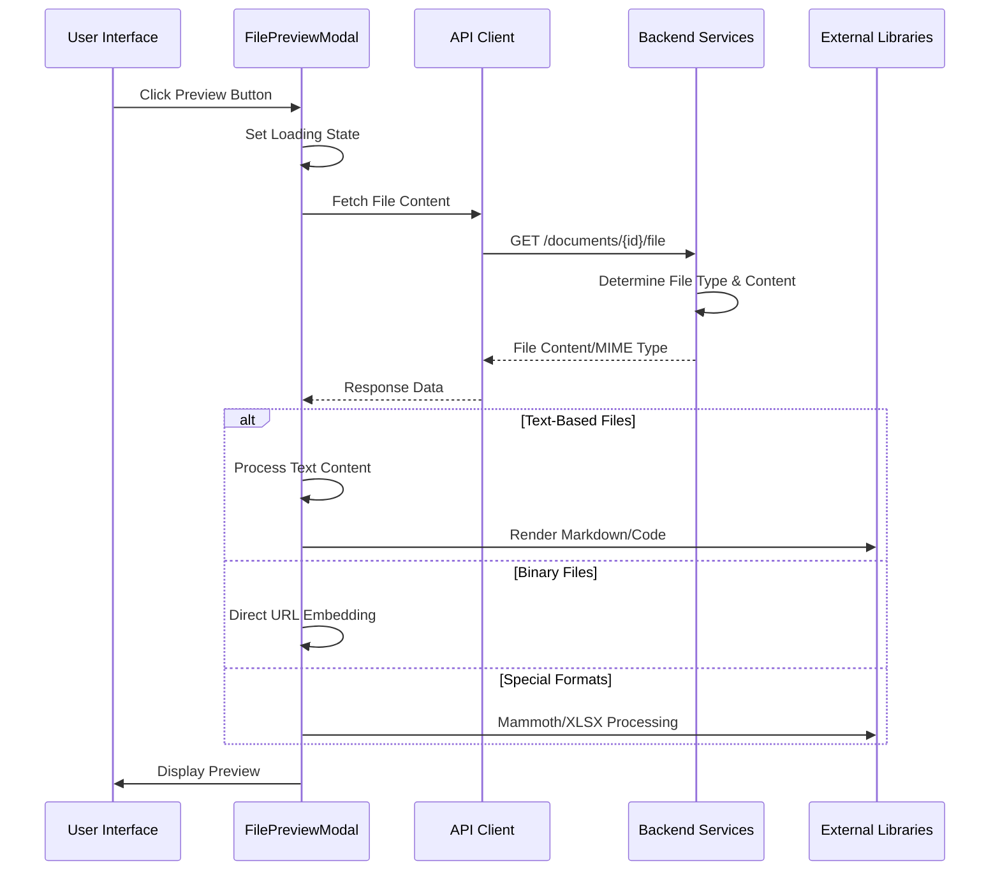
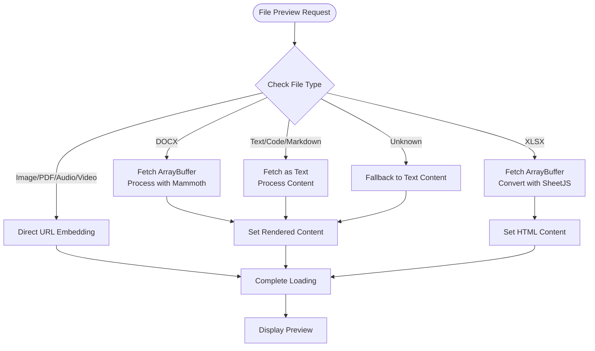
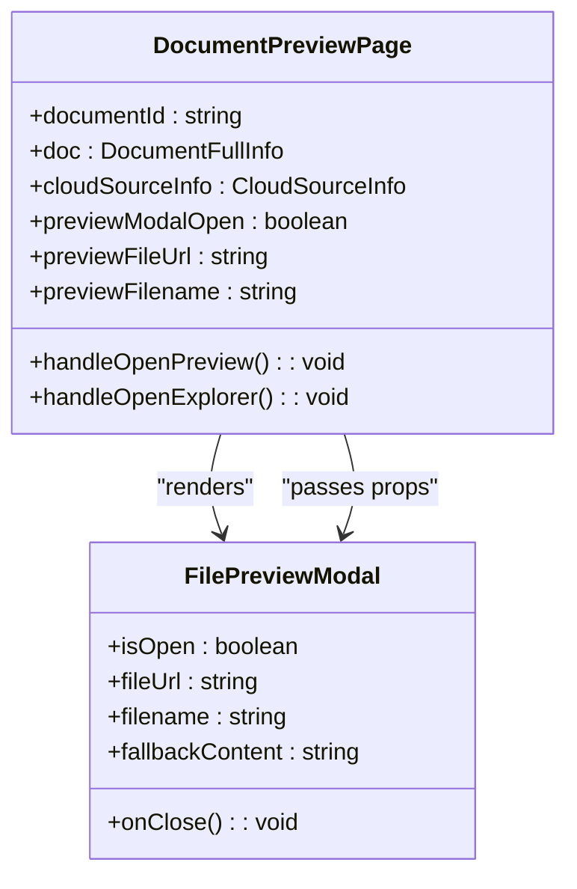
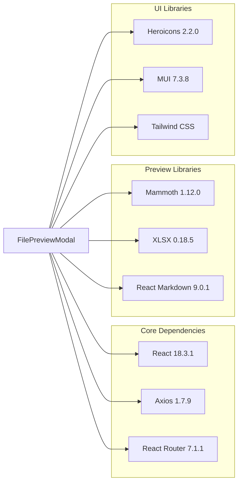

# File Preview Modal

<cite>
**Referenced Files in This Document**
- [FilePreviewModal.tsx](file://frontend/src/components/FilePreviewModal.tsx)
- [DocumentPreviewPage.tsx](file://frontend/src/pages/DocumentPreviewPage.tsx)
- [client.ts](file://frontend/src/api/client.ts)
- [ingestion.py](file://backend/routers/ingestion.py)
- [cache.py](file://backend/routers/cloud_sources/cache.py)
- [package.json](file://frontend/package.json)
</cite>

## Table of Contents
1. [Introduction](#introduction)
2. [Project Structure](#project-structure)
3. [Core Components](#core-components)
4. [Architecture Overview](#architecture-overview)
5. [Detailed Component Analysis](#detailed-component-analysis)
6. [Dependency Analysis](#dependency-analysis)
7. [Performance Considerations](#performance-considerations)
8. [Troubleshooting Guide](#troubleshooting-guide)
9. [Conclusion](#conclusion)

## Introduction

The File Preview Modal is a comprehensive React component that provides rich preview capabilities for various file types within the MongoDB RAG Agent application. This modal enables users to preview documents, images, audio files, videos, spreadsheets, and other supported formats directly within the application interface without leaving the current page.

The component supports multiple file categories including text files, code files, markdown documents, office documents (DOCX), spreadsheets (XLSX), images, PDFs, audio, and video files. It provides intelligent fallback mechanisms and handles both local and cloud-sourced files seamlessly.

## Project Structure

The File Preview Modal is part of the frontend React application and integrates with the backend API endpoints for file serving and cloud source caching. The component follows a modular architecture with clear separation of concerns:



**Diagram sources**
- [FilePreviewModal.tsx:1-353](file://frontend/src/components/FilePreviewModal.tsx#L1-L353)
- [DocumentPreviewPage.tsx:1-473](file://frontend/src/pages/DocumentPreviewPage.tsx#L1-L473)
- [client.ts:1018-1056](file://frontend/src/api/client.ts#L1018-L1056)

**Section sources**
- [FilePreviewModal.tsx:1-353](file://frontend/src/components/FilePreviewModal.tsx#L1-L353)
- [DocumentPreviewPage.tsx:1-473](file://frontend/src/pages/DocumentPreviewPage.tsx#L1-L473)

## Core Components

### File Type Classification System

The modal implements a sophisticated file classification system that categorizes files based on their extensions:



**Diagram sources**
- [FilePreviewModal.tsx:6-32](file://frontend/src/components/FilePreviewModal.tsx#L6-L32)

The classification system supports 15+ different file extensions across multiple categories, enabling appropriate rendering strategies for each file type.

### Modal State Management

The component manages several key states for optimal user experience:

- **Loading State**: Tracks preview loading progress with spinner indicators
- **Error State**: Handles preview failures with user-friendly error messages
- **Content State**: Stores processed content for text-based files
- **XLSX State**: Manages spreadsheet HTML rendering
- **Visibility State**: Controls modal open/close functionality

**Section sources**
- [FilePreviewModal.tsx:43-47](file://frontend/src/components/FilePreviewModal.tsx#L43-L47)

## Architecture Overview

The File Preview Modal operates within a three-tier architecture that spans frontend, backend, and external libraries:



**Diagram sources**
- [DocumentPreviewPage.tsx:174-201](file://frontend/src/pages/DocumentPreviewPage.tsx#L174-L201)
- [FilePreviewModal.tsx:67-145](file://frontend/src/components/FilePreviewModal.tsx#L67-L145)

**Section sources**
- [DocumentPreviewPage.tsx:174-201](file://frontend/src/pages/DocumentPreviewPage.tsx#L174-L201)
- [FilePreviewModal.tsx:67-145](file://frontend/src/components/FilePreviewModal.tsx#L67-L145)

## Detailed Component Analysis

### FilePreviewModal Component

The FilePreviewModal is a self-contained React component that handles all aspects of file preview functionality:

#### Props Interface

```typescript
interface FilePreviewModalProps {
  isOpen: boolean
  onClose: () => void
  fileUrl: string
  filename: string
  fallbackContent?: string
}
```

The component accepts four primary props plus an optional fallback content parameter for unsupported binary files.

#### File Processing Pipeline

The modal implements a sophisticated file processing pipeline that varies based on file type:



**Diagram sources**
- [FilePreviewModal.tsx:77-145](file://frontend/src/components/FilePreviewModal.tsx#L77-L145)

#### Rendering Strategies

Each file category employs specialized rendering strategies:

**Text and Code Files**: Rendered in monospace fonts with syntax highlighting support through React Markdown for markdown content.

**Images**: Displayed using responsive image containers with proper aspect ratio handling.

**PDFs**: Embedded using iframe elements for native browser PDF viewer integration.

**Audio/Video**: Utilize HTML5 media elements with built-in controls.

**Spreadsheets**: Converted to HTML tables using SheetJS library for interactive viewing.

**Office Documents**: Processed through Mammoth for DOCX conversion to HTML.

**Section sources**
- [FilePreviewModal.tsx:187-302](file://frontend/src/components/FilePreviewModal.tsx#L187-L302)

### DocumentPreviewPage Integration

The File Preview Modal integrates seamlessly with the DocumentPreviewPage component:



**Diagram sources**
- [DocumentPreviewPage.tsx:81-201](file://frontend/src/pages/DocumentPreviewPage.tsx#L81-L201)
- [FilePreviewModal.tsx:43-41](file://frontend/src/components/FilePreviewModal.tsx#L43-L41)

The integration handles both local files and cloud-sourced files through different preview strategies.

**Section sources**
- [DocumentPreviewPage.tsx:174-201](file://frontend/src/pages/DocumentPreviewPage.tsx#L174-L201)
- [FilePreviewModal.tsx:43-41](file://frontend/src/components/FilePreviewModal.tsx#L43-L41)

## Dependency Analysis

### Frontend Dependencies

The File Preview Modal relies on several key external libraries:



**Diagram sources**
- [package.json:15-33](file://frontend/package.json#L15-L33)

### Backend Integration Points

The component interacts with two primary backend endpoints:

1. **Local Files**: `/documents/{document_id}/file` endpoint with inline parameter support
2. **Cloud Sources**: `/cloud-sources/cache/serve/{connection_id}/{document_id}` for cached files

**Section sources**
- [client.ts:1018-1056](file://frontend/src/api/client.ts#L1018-L1056)
- [client.ts:2716-2718](file://frontend/src/api/client.ts#L2716-L2718)

## Performance Considerations

### Lazy Loading Strategy

The File Preview Modal implements lazy loading for heavy libraries to optimize initial load times:

- **Mammoth**: Dynamically imported only when DOCX files are previewed
- **SheetJS**: Dynamically imported only when XLSX files are previewed
- **React Markdown**: Loaded on-demand for markdown content

### Memory Management

The component includes proper cleanup mechanisms:

- **Keyboard Event Cleanup**: Removes event listeners when modal closes
- **Body Overflow Control**: Prevents background scrolling during modal display
- **State Reset**: Clears content and resets loading states when component unmounts

### Caching Strategy

For cloud-sourced files, the backend implements intelligent caching:

- **Automatic Caching**: Files are automatically cached upon first access
- **Cache Validation**: Checks cache status before serving files
- **Background Updates**: Allows concurrent file updates without blocking previews

**Section sources**
- [FilePreviewModal.tsx:56-65](file://frontend/src/components/FilePreviewModal.tsx#L56-L65)
- [cache.py:84-106](file://backend/routers/cloud_sources/cache.py#L84-L106)

## Troubleshooting Guide

### Common Issues and Solutions

#### Preview Loading Failures

**Issue**: Modal shows loading spinner indefinitely
**Causes**:
- Network connectivity problems
- File not found on server
- Incorrect file permissions

**Solutions**:
- Verify network connectivity
- Check file existence in document metadata
- Review file permissions and access rights

#### Unsupported File Types

**Issue**: Unknown file type displays fallback content
**Causes**:
- File extension not recognized
- Binary file format not supported

**Solutions**:
- Use supported file formats
- Download file for manual viewing
- Check file extension validity

#### Large File Performance Issues

**Issue**: Slow loading for large files
**Causes**:
- Large file size
- Limited browser memory
- Network bandwidth constraints

**Solutions**:
- Implement file size limits
- Use streaming for large files
- Optimize network connections

#### Cloud Source Access Problems

**Issue**: Cloud-sourced files fail to preview
**Causes**:
- Expired cloud credentials
- Network connectivity issues
- File not cached locally

**Solutions**:
- Refresh cloud source credentials
- Check network connectivity
- Force cache refresh operation

**Section sources**
- [FilePreviewModal.tsx:171-185](file://frontend/src/components/FilePreviewModal.tsx#L171-L185)
- [DocumentPreviewPage.tsx:180-195](file://frontend/src/pages/DocumentPreviewPage.tsx#L180-L195)

## Conclusion

The File Preview Modal represents a sophisticated solution for document preview functionality within the MongoDB RAG Agent ecosystem. Its modular architecture, comprehensive file type support, and robust error handling make it a reliable component for both local and cloud-sourced file previews.

The implementation demonstrates excellent separation of concerns with clear boundaries between file classification, content processing, and presentation layers. The use of lazy loading for heavy dependencies ensures optimal performance while maintaining a rich user experience.

Key strengths of the implementation include:
- Comprehensive file type support (15+ formats)
- Intelligent fallback mechanisms
- Seamless integration with cloud sources
- Responsive design for various screen sizes
- Proper accessibility support
- Efficient memory management

Future enhancements could include support for additional file formats, improved error recovery mechanisms, and enhanced customization options for different deployment scenarios.