# Frontend Application

<cite>
**Referenced Files in This Document**
- [main.tsx](file://frontend/src/main.tsx)
- [App.tsx](file://frontend/src/App.tsx)
- [package.json](file://frontend/package.json)
- [vite.config.ts](file://frontend/vite.config.ts)
- [client.ts](file://frontend/src/api/client.ts)
- [AuthContext.tsx](file://frontend/src/contexts/AuthContext.tsx)
- [ChatSidebarContext.tsx](file://frontend/src/contexts/ChatSidebarContext.tsx)
- [ThemeContext.tsx](file://frontend/src/contexts/ThemeContext.tsx)
- [LanguageContext.tsx](file://frontend/src/contexts/LanguageContext.tsx)
- [Layout.tsx](file://frontend/src/components/Layout.tsx)
- [LanguageSwitcher.tsx](file://frontend/src/components/LanguageSwitcher.tsx)
- [ThemeSwitcher.tsx](file://frontend/src/components/ThemeSwitcher.tsx)
- [LocalizedLink.tsx](file://frontend/src/components/LocalizedLink.tsx)
- [ModelVersionSelector.tsx](file://frontend/src/components/ModelVersionSelector.tsx)
- [CommandPalette.tsx](file://frontend/src/components/CommandPalette.tsx)
- [ConnectionStatus.tsx](file://frontend/src/components/ConnectionStatus.tsx)
- [CopyButton.tsx](file://frontend/src/components/CopyButton.tsx)
- [LoadingSkeleton.tsx](file://frontend/src/components/LoadingSkeleton.tsx)
- [ChatPageNew.tsx](file://frontend/src/pages/ChatPageNew.tsx)
- [SearchPage.tsx](file://frontend/src/pages/SearchPage.tsx)
- [DocumentsPage.tsx](file://frontend/src/pages/DocumentsPage.tsx)
- [SystemPage.tsx](file://frontend/src/pages/SystemPage.tsx)
- [DashboardPage.tsx](file://frontend/src/pages/DashboardPage.tsx)
- [LandingPage.tsx](file://frontend/src/pages/LandingPage.tsx)
- [BackupManagementPage.tsx](file://frontend/src/pages/BackupManagementPage.tsx)
- [EmbeddingBenchmarkPage.tsx](file://frontend/src/pages/EmbeddingBenchmarkPage.tsx)
- [StrategyABTestPage.tsx](file://frontend/src/pages/StrategyABTestPage.tsx)
- [LiveDebugPage.tsx](file://frontend/src/pages/LiveDebugPage.tsx)
- [FederatedAgentPanel.tsx](file://frontend/src/components/FederatedAgentPanel.tsx)
- [index.ts](file://frontend/src/i18n/index.ts)
- [en.json](file://frontend/src/i18n/locales/en.json)
- [de.json](file://frontend/src/i18n/locales/de.json)
- [tailwind.config.js](file://frontend/tailwind.config.js)
- [debug.py](file://backend/routers/debug.py)
</cite>

## Update Summary
**Changes Made**
- Added comprehensive LiveDebugPage component for real-time Strategy OS debugging with admin-only access
- Enhanced debug API integration with improved response handling and type safety
- Updated routing configuration to support new debug endpoint with proper authentication gating
- Implemented advanced debugging capabilities including live activity monitoring, system state visualization, and request detail inspection
- Added comprehensive error handling and loading states for debugging operations

## Table of Contents
1. [Introduction](#introduction)
2. [Project Structure](#project-structure)
3. [Core Components](#core-components)
4. [Architecture Overview](#architecture-overview)
5. [Detailed Component Analysis](#detailed-component-analysis)
6. [New UI Components](#new-ui-components)
7. [Specialized Administrative Pages](#specialized-administrative-pages)
8. [Debugging and API Integration](#debugging-and-api-integration)
9. [Internationalization and Localization](#internationalization-and-localization)
10. [Dependency Analysis](#dependency-analysis)
11. [Performance Considerations](#performance-considerations)
12. [Troubleshooting Guide](#troubleshooting-guide)
13. [Conclusion](#conclusion)
14. [Appendices](#appendices)

## Introduction
This document describes the React-based frontend application for the MongoDB RAG Agent. It covers the application architecture, component structure, state management patterns, routing configuration, and integration with backend APIs. The application now features enhanced internationalization support with multi-language capabilities, theme switching functionality, and improved user interface components. The application maintains a centralized routing system where authenticated users are automatically redirected to the comprehensive dashboard interface, while providing seamless language and theme customization options. Recent additions include comprehensive UI components for enhanced user experience, specialized administrative pages for system management, and advanced debugging capabilities for Strategy OS monitoring.

## Project Structure
The frontend is a Vite-powered React application with TypeScript, Tailwind CSS for styling, and React Router for navigation. The application bootstraps with internationalization support, wraps the React app in theme and routing providers, and mounts the main App component that defines routes for pages and nested layouts. The routing system now supports language-specific URLs and integrates with the internationalization framework. New UI components have been integrated throughout the application for enhanced functionality and user experience.

```mermaid
graph TB
A["main.tsx<br/>Bootstraps app with i18n"] --> B["App.tsx<br/>Defines routes"]
B --> C["LandingPage.tsx<br/>Main landing page"]
B --> D["Layout.tsx<br/>Enhanced layout with UI controls"]
B --> E["DashboardPage.tsx<br/>Comprehensive dashboard"]
B --> F["ChatPageNew.tsx<br/>Chat UI"]
B --> G["SearchPage.tsx<br/>Search UI"]
B --> H["DocumentsPage.tsx<br/>Document explorer"]
B --> I["SystemPage.tsx<br/>System hub"]
B --> J["BackupManagementPage.tsx<br/>Backup operations"]
B --> K["EmbeddingBenchmarkPage.tsx<br/>Provider testing"]
B --> L["StrategyABTestPage.tsx<br/>Strategy comparison"]
B --> M["LiveDebugPage.tsx<br/>Strategy OS debugging"]
A --> N["ThemeContext.tsx<br/>Theme provider"]
A --> O["AuthContext.tsx<br/>Auth provider"]
A --> P["ChatSidebarContext.tsx<br/>Chat sidebar provider"]
A --> Q["LanguageContext.tsx<br/>Language provider"]
R["vite.config.ts<br/>Dev server + proxy"] --> S["client.ts<br/>Axios client + interceptors"]
T["i18n/index.ts<br/>Internationalization setup"] --> U["LanguageSwitcher.tsx<br/>Language selector"]
V["Layout.tsx<br/>Enhanced with UI controls"] --> W["ThemeSwitcher.tsx<br/>Theme selector"]
V --> X["LocalizedLink.tsx<br/>Localized navigation"]
V --> Y["ModelVersionSelector.tsx<br/>Model management"]
V --> Z["CommandPalette.tsx<br/>Quick navigation"]
V --> AA["ConnectionStatus.tsx<br/>API connectivity"]
BB["CommandPalette.tsx<br/>Ctrl+K navigation"] --> CC["CopyButton.tsx<br/>Clipboard operations"]
DD["LoadingSkeleton.tsx<br/>Performance indicators"] --> EE["LiveDebugPage.tsx"]
FF["LiveDebugPage.tsx<br/>Admin debugging"] --> GG["debugApi integration"]
HH["LiveDebugPage.tsx<br/>Real-time monitoring"] --> II["WebSocket-like polling"]
```

**Diagram sources**
- [main.tsx:1-18](file://frontend/src/main.tsx#L1-L18)
- [App.tsx:1-160](file://frontend/src/App.tsx#L1-L160)
- [LandingPage.tsx:67-142](file://frontend/src/pages/LandingPage.tsx#L67-L142)
- [Layout.tsx:74-200](file://frontend/src/components/Layout.tsx#L74-L200)
- [DashboardPage.tsx:65-132](file://frontend/src/pages/DashboardPage.tsx#L65-L132)
- [ChatPageNew.tsx:53-528](file://frontend/src/pages/ChatPageNew.tsx#L53-L528)
- [SearchPage.tsx:1-158](file://frontend/src/pages/SearchPage.tsx#L1-L158)
- [DocumentsPage.tsx:158-900](file://frontend/src/pages/DocumentsPage.tsx#L158-L900)
- [SystemPage.tsx:43-102](file://frontend/src/pages/SystemPage.tsx#L43-L102)
- [BackupManagementPage.tsx:1-800](file://frontend/src/pages/BackupManagementPage.tsx#L1-L800)
- [EmbeddingBenchmarkPage.tsx:1-800](file://frontend/src/pages/EmbeddingBenchmarkPage.tsx#L1-L800)
- [StrategyABTestPage.tsx:1-541](file://frontend/src/pages/StrategyABTestPage.tsx#L1-L541)
- [LiveDebugPage.tsx:1-462](file://frontend/src/pages/LiveDebugPage.tsx#L1-L462)
- [ThemeContext.tsx:22-82](file://frontend/src/contexts/ThemeContext.tsx#L22-L82)
- [AuthContext.tsx:27-193](file://frontend/src/contexts/AuthContext.tsx#L27-L193)
- [ChatSidebarContext.tsx:75-399](file://frontend/src/contexts/ChatSidebarContext.tsx#L75-L399)
- [LanguageContext.tsx:14-71](file://frontend/src/contexts/LanguageContext.tsx#L14-L71)
- [index.ts:1-62](file://frontend/src/i18n/index.ts#L1-L62)
- [LanguageSwitcher.tsx:1-80](file://frontend/src/components/LanguageSwitcher.tsx#L1-L80)
- [ThemeSwitcher.tsx:1-95](file://frontend/src/components/ThemeSwitcher.tsx#L1-L95)
- [LocalizedLink.tsx:1-56](file://frontend/src/components/LocalizedLink.tsx#L1-L56)
- [ModelVersionSelector.tsx:1-404](file://frontend/src/components/ModelVersionSelector.tsx#L1-L404)
- [CommandPalette.tsx:1-364](file://frontend/src/components/CommandPalette.tsx#L1-L364)
- [ConnectionStatus.tsx:1-206](file://frontend/src/components/ConnectionStatus.tsx#L1-L206)
- [CopyButton.tsx:1-219](file://frontend/src/components/CopyButton.tsx#L1-L219)
- [LoadingSkeleton.tsx:1-229](file://frontend/src/components/LoadingSkeleton.tsx#L1-L229)
- [vite.config.ts:1-17](file://frontend/vite.config.ts#L1-L17)
- [client.ts:1-2379](file://frontend/src/api/client.ts#L1-L2379)

**Section sources**
- [main.tsx:1-18](file://frontend/src/main.tsx#L1-L18)
- [App.tsx:1-160](file://frontend/src/App.tsx#L1-L160)
- [vite.config.ts:1-17](file://frontend/vite.config.ts#L1-L17)

## Core Components
- Providers
  - ThemeProvider: Manages light/dark/system theme and applies CSS classes to the document root.
  - AuthProvider: Handles authentication state, token validation, and session expiration UX.
  - ChatSidebarProvider: Centralizes chat session management, folders, models, and multi-select actions.
  - LanguageProvider: Manages internationalization state, language detection, and URL-based localization.
- Enhanced Layout and Navigation
  - Layout: Provides a responsive sidebar with chat sessions, folders, user menu, and integrated UI controls including ThemeSwitcher, LanguageSwitcher, CommandPalette, and ConnectionStatus.
- New UI Components
  - CommandPalette: Quick navigation and command palette with keyboard shortcuts (Ctrl+K) for rapid page access.
  - ConnectionStatus: Real-time API connectivity monitoring with status indicators and latency tracking.
  - CopyButton: Multi-variant clipboard operations with visual feedback and toast notifications.
  - LoadingSkeleton: Comprehensive skeleton loading placeholders for improved perceived performance.
- Internationalization Components
  - LanguageSwitcher: Dropdown component for language selection with flag icons and compact/full display modes.
  - ThemeSwitcher: Dropdown component for theme selection (light/dark/system) with dynamic icon display.
  - LocalizedLink: Enhanced router link that automatically adds language prefixes to URLs.
  - ModelVersionSelector: Advanced component for browsing and switching between model versions with filtering and sorting capabilities.
- Specialized Administrative Pages
  - BackupManagementPage: Comprehensive database backup and restore operations with progress tracking.
  - EmbeddingBenchmarkPage: Provider performance testing and comparison with detailed metrics.
  - StrategyABTestPage: Agent strategy comparison with AI-powered evaluation and recommendations.
  - LiveDebugPage: Advanced debugging interface for Strategy OS with real-time monitoring and system state visualization.
- Pages
  - LandingPage: Main entry point that serves different content based on authentication status and provides navigation to dashboard.
  - DashboardPage: Comprehensive dashboard that replaces the previous HomePage, featuring quick actions, recent activities, and system overview.
  - ChatPageNew: Real-time chat UI with message history, attachments, model selection, and agent operation panels.
  - SearchPage: Semantic/text/hybrid search with result highlighting and metadata.
  - DocumentsPage: File explorer with folder tree, grid/list views, sorting, and metadata rebuild.
  - SystemPage: Administrative dashboard that redirects to system sub-pages.
  - LiveDebugPage: Admin-only debugging interface with live activity monitoring and system state visualization.
- Shared Components
  - FederatedAgentPanel: Visualizes orchestrator-worker agent traces with steps, sources, and costs.

**Section sources**
- [ThemeContext.tsx:22-82](file://frontend/src/contexts/ThemeContext.tsx#L22-L82)
- [AuthContext.tsx:27-193](file://frontend/src/contexts/AuthContext.tsx#L27-L193)
- [ChatSidebarContext.tsx:75-399](file://frontend/src/contexts/ChatSidebarContext.tsx#L75-L399)
- [LanguageContext.tsx:14-71](file://frontend/src/contexts/LanguageContext.tsx#L14-L71)
- [Layout.tsx:74-200](file://frontend/src/components/Layout.tsx#L74-L200)
- [CommandPalette.tsx:1-364](file://frontend/src/components/CommandPalette.tsx#L1-L364)
- [ConnectionStatus.tsx:1-206](file://frontend/src/components/ConnectionStatus.tsx#L1-L206)
- [CopyButton.tsx:1-219](file://frontend/src/components/CopyButton.tsx#L1-L219)
- [LoadingSkeleton.tsx:1-229](file://frontend/src/components/LoadingSkeleton.tsx#L1-L229)
- [LanguageSwitcher.tsx:1-80](file://frontend/src/components/LanguageSwitcher.tsx#L1-L80)
- [ThemeSwitcher.tsx:1-95](file://frontend/src/components/ThemeSwitcher.tsx#L1-L95)
- [LocalizedLink.tsx:1-56](file://frontend/src/components/LocalizedLink.tsx#L1-L56)
- [ModelVersionSelector.tsx:1-404](file://frontend/src/components/ModelVersionSelector.tsx#L1-L404)
- [BackupManagementPage.tsx:1-800](file://frontend/src/pages/BackupManagementPage.tsx#L1-L800)
- [EmbeddingBenchmarkPage.tsx:1-800](file://frontend/src/pages/EmbeddingBenchmarkPage.tsx#L1-L800)
- [StrategyABTestPage.tsx:1-541](file://frontend/src/pages/StrategyABTestPage.tsx#L1-L541)
- [LiveDebugPage.tsx:1-462](file://frontend/src/pages/LiveDebugPage.tsx#L1-L462)
- [LandingPage.tsx:67-142](file://frontend/src/pages/LandingPage.tsx#L67-L142)
- [DashboardPage.tsx:65-132](file://frontend/src/pages/DashboardPage.tsx#L65-L132)
- [ChatPageNew.tsx:53-528](file://frontend/src/pages/ChatPageNew.tsx#L53-L528)
- [SearchPage.tsx:1-158](file://frontend/src/pages/SearchPage.tsx#L1-L158)
- [DocumentsPage.tsx:158-900](file://frontend/src/pages/DocumentsPage.tsx#L158-L900)
- [SystemPage.tsx:43-102](file://frontend/src/pages/SystemPage.tsx#L43-L102)
- [FederatedAgentPanel.tsx:32-342](file://frontend/src/components/FederatedAgentPanel.tsx#L32-L342)

## Architecture Overview
The frontend follows a layered architecture with centralized routing and enhanced internationalization:
- Presentation Layer: React components and pages with internationalization support and comprehensive UI component library.
- State Management: Context providers for theme, auth, chat sidebar, and language management.
- Data Access: Axios-based HTTP client with interceptors for auth, retries, and error handling.
- Routing: React Router v7 with nested routes, protected areas, and language-specific URL handling.
- Internationalization: i18next framework with URL-based language detection and localStorage persistence.
- Enhanced UI Components: New components for improved user experience and system management.
- Debugging Integration: Specialized debug API with admin-only access and real-time monitoring capabilities.

```mermaid
graph TB
subgraph "Presentation Layer"
LP["LandingPage.tsx"]
DP["DashboardPage.tsx"]
L["Layout.tsx"]
CP["ChatPageNew.tsx"]
SP["SearchPage.tsx"]
DT["DocumentsPage.tsx"]
Sys["SystemPage.tsx"]
BMP["BackupManagementPage.tsx"]
EBP["EmbeddingBenchmarkPage.tsx"]
SAP["StrategyABTestPage.tsx"]
LDP["LiveDebugPage.tsx"]
LS["LanguageSwitcher.tsx"]
TS["ThemeSwitcher.tsx"]
LL["LocalizedLink.tsx"]
MVS["ModelVersionSelector.tsx"]
CMD["CommandPalette.tsx"]
CS["ConnectionStatus.tsx"]
CB["CopyButton.tsx"]
SK["LoadingSkeleton.tsx"]
end
subgraph "State Management"
T["ThemeContext.tsx"]
A["AuthContext.tsx"]
CSB["ChatSidebarContext.tsx"]
LC["LanguageContext.tsx"]
end
subgraph "Data Access"
AX["client.ts (Axios)"]
DA["debugApi (Debug Integration)"]
RT["React Router"]
I18N["i18n Framework"]
end
LP --> A
DP --> A
DP --> CSB
L --> A
L --> CSB
L --> LC
L --> TS
L --> LS
L --> LL
L --> CMD
L --> CS
CP --> CSB
CP --> AX
SP --> AX
DT --> AX
Sys --> A
BMP --> AX
EBP --> AX
SAP --> AX
LDP --> DA
CMD --> AX
CS --> AX
CB --> AX
SK --> AX
T --> L
RT --> LP
RT --> DP
RT --> L
RT --> CP
RT --> SP
RT --> DT
RT --> Sys
RT --> BMP
RT --> EBP
RT --> SAP
RT --> LDP
I18N --> LC
I18N --> LS
I18N --> TS
MVS --> AX
DA --> AX
```

**Diagram sources**
- [LandingPage.tsx:67-142](file://frontend/src/pages/LandingPage.tsx#L67-L142)
- [DashboardPage.tsx:65-132](file://frontend/src/pages/DashboardPage.tsx#L65-L132)
- [Layout.tsx:74-200](file://frontend/src/components/Layout.tsx#L74-L200)
- [ChatPageNew.tsx:53-528](file://frontend/src/pages/ChatPageNew.tsx#L53-L528)
- [SearchPage.tsx:1-158](file://frontend/src/pages/SearchPage.tsx#L1-L158)
- [DocumentsPage.tsx:158-900](file://frontend/src/pages/DocumentsPage.tsx#L158-L900)
- [SystemPage.tsx:43-102](file://frontend/src/pages/SystemPage.tsx#L43-L102)
- [BackupManagementPage.tsx:1-800](file://frontend/src/pages/BackupManagementPage.tsx#L1-L800)
- [EmbeddingBenchmarkPage.tsx:1-800](file://frontend/src/pages/EmbeddingBenchmarkPage.tsx#L1-L800)
- [StrategyABTestPage.tsx:1-541](file://frontend/src/pages/StrategyABTestPage.tsx#L1-L541)
- [LiveDebugPage.tsx:1-462](file://frontend/src/pages/LiveDebugPage.tsx#L1-L462)
- [LanguageSwitcher.tsx:1-80](file://frontend/src/components/LanguageSwitcher.tsx#L1-L80)
- [ThemeSwitcher.tsx:1-95](file://frontend/src/components/ThemeSwitcher.tsx#L1-L95)
- [LocalizedLink.tsx:1-56](file://frontend/src/components/LocalizedLink.tsx#L1-L56)
- [ModelVersionSelector.tsx:1-404](file://frontend/src/components/ModelVersionSelector.tsx#L1-L404)
- [CommandPalette.tsx:1-364](file://frontend/src/components/CommandPalette.tsx#L1-L364)
- [ConnectionStatus.tsx:1-206](file://frontend/src/components/ConnectionStatus.tsx#L1-L206)
- [CopyButton.tsx:1-219](file://frontend/src/components/CopyButton.tsx#L1-L219)
- [LoadingSkeleton.tsx:1-229](file://frontend/src/components/LoadingSkeleton.tsx#L1-L229)
- [ThemeContext.tsx:22-82](file://frontend/src/contexts/ThemeContext.tsx#L22-L82)
- [AuthContext.tsx:27-193](file://frontend/src/contexts/AuthContext.tsx#L27-L193)
- [ChatSidebarContext.tsx:75-399](file://frontend/src/contexts/ChatSidebarContext.tsx#L75-L399)
- [LanguageContext.tsx:14-71](file://frontend/src/contexts/LanguageContext.tsx#L14-L71)
- [client.ts:1-2379](file://frontend/src/api/client.ts#L1-L2379)
- [App.tsx:77-153](file://frontend/src/App.tsx#L77-L153)
- [index.ts:1-62](file://frontend/src/i18n/index.ts#L1-L62)

## Detailed Component Analysis

### Routing Configuration
- Root routes define landing page for unauthenticated users and dashboard for authenticated users.
- Protected routes are gated by authentication via AuthContext.
- Nested routes include chat, search, documents, profiles, system sub-pages, cloud sources, and new administrative pages.
- The routing system now centralizes authenticated users at `/dashboard` with automatic redirection.
- Language-specific URLs are supported with automatic language detection from URL paths.
- New administrative routes include backup management, embedding benchmarking, strategy testing, and live debugging.

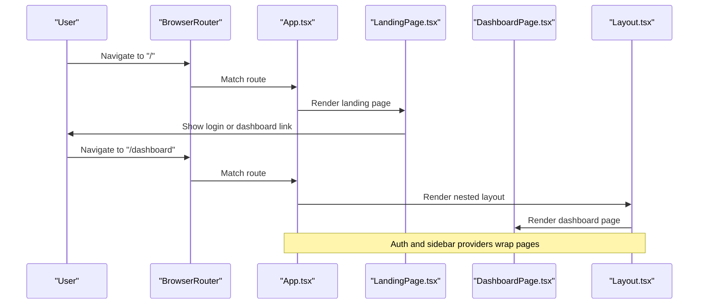

**Diagram sources**
- [App.tsx:88-129](file://frontend/src/App.tsx#L88-L129)
- [LandingPage.tsx:107-124](file://frontend/src/pages/LandingPage.tsx#L107-L124)
- [Layout.tsx:74-200](file://frontend/src/components/Layout.tsx#L74-L200)

**Section sources**
- [App.tsx:77-153](file://frontend/src/App.tsx#L77-L153)

### Authentication and Session Handling
- AuthContext manages user state, login/register/logout, token validation, and session expiration UX.
- Intercepts 401 responses globally and triggers a session expired modal.
- Uses localStorage for auth tokens and validates periodically.
- LandingPage provides conditional navigation based on authentication status.

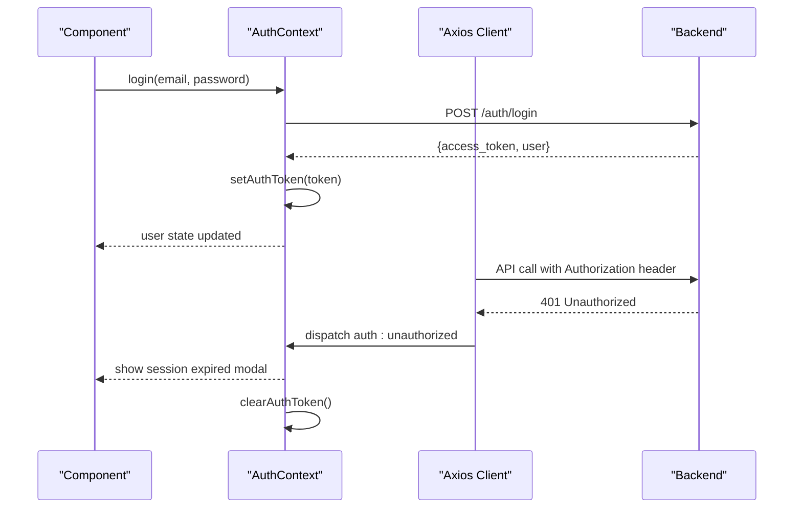

**Diagram sources**
- [AuthContext.tsx:115-142](file://frontend/src/contexts/AuthContext.tsx#L115-L142)
- [client.ts:105-159](file://frontend/src/api/client.ts#L105-L159)

**Section sources**
- [AuthContext.tsx:27-193](file://frontend/src/contexts/AuthContext.tsx#L27-L193)
- [client.ts:105-159](file://frontend/src/api/client.ts#L105-L159)
- [LandingPage.tsx:107-124](file://frontend/src/pages/LandingPage.tsx#L107-L124)

### HTTP Client and API Integration
- Axios instance configured with base URL, timeouts, and interceptors.
- Request interceptor adds Authorization header from localStorage.
- Response interceptor handles network errors with retries and converts HTTP errors to ApiError.
- Provides typed API modules for chat, search, documents, sessions, system, ingestion, administrative functions, and debugging operations.

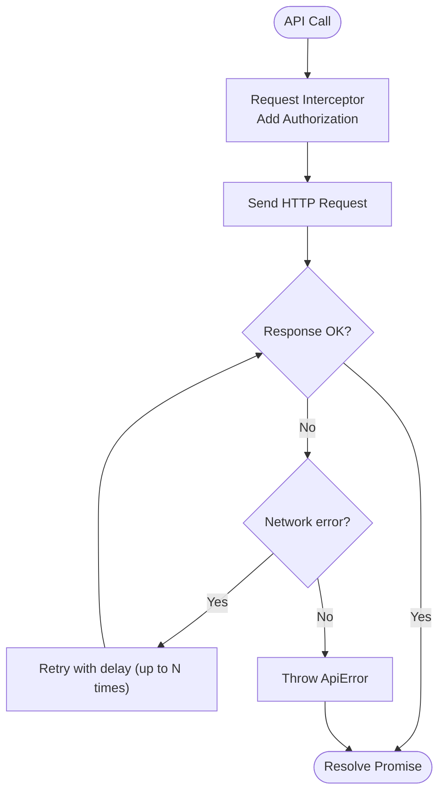

**Diagram sources**
- [client.ts:96-180](file://frontend/src/api/client.ts#L96-L180)

**Section sources**
- [client.ts:1-2379](file://frontend/src/api/client.ts#L1-L2379)

### Enhanced Layout Component with UI Controls
- Layout now includes ThemeSwitcher, LanguageSwitcher, CommandPalette, and ConnectionStatus in the user menu.
- Provides enhanced navigation with LocalizedLink for language-aware routing.
- Supports model version management through ModelVersionSelector integration.
- Maintains responsive design with mobile sidebar and desktop navigation.
- Integrates CommandPalette hook for global keyboard shortcuts (Ctrl+K).

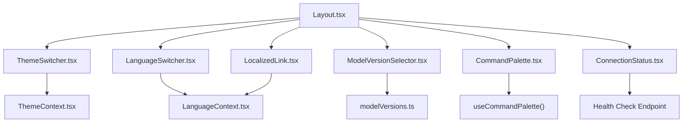

**Diagram sources**
- [Layout.tsx:74-200](file://frontend/src/components/Layout.tsx#L74-L200)
- [ThemeSwitcher.tsx:1-95](file://frontend/src/components/ThemeSwitcher.tsx#L1-L95)
- [LanguageSwitcher.tsx:1-80](file://frontend/src/components/LanguageSwitcher.tsx#L1-L80)
- [LocalizedLink.tsx:1-56](file://frontend/src/components/LocalizedLink.tsx#L1-L56)
- [ModelVersionSelector.tsx:1-404](file://frontend/src/components/ModelVersionSelector.tsx#L1-L404)
- [CommandPalette.tsx:1-364](file://frontend/src/components/CommandPalette.tsx#L1-L364)
- [ConnectionStatus.tsx:1-206](file://frontend/src/components/ConnectionStatus.tsx#L1-L206)

**Section sources**
- [Layout.tsx:74-200](file://frontend/src/components/Layout.tsx#L74-L200)

### Landing Page and Dashboard Centralization
- LandingPage serves as the main entry point, displaying different content based on authentication status.
- Authenticated users are automatically redirected to the comprehensive DashboardPage.
- Provides quick navigation to dashboard, chat, and other features.
- DashboardPage consolidates all system overview functionality previously scattered across multiple pages.

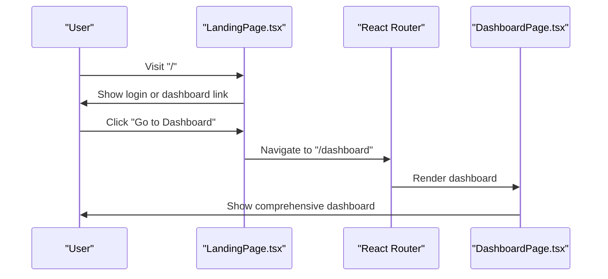

**Diagram sources**
- [LandingPage.tsx:107-124](file://frontend/src/pages/LandingPage.tsx#L107-L124)
- [App.tsx:95-97](file://frontend/src/App.tsx#L95-L97)

**Section sources**
- [LandingPage.tsx:67-142](file://frontend/src/pages/LandingPage.tsx#L67-L142)
- [App.tsx:95-97](file://frontend/src/App.tsx#L95-L97)

### DashboardPage - Comprehensive System Overview
- Replaces the previous HomePage with comprehensive system overview functionality.
- Features quick action buttons for common tasks (New Chat, Search, Documents, Ingestion).
- Displays recent chats, recently ingested documents, ingestion activity, and knowledge profiles.
- Provides filtering based on user profile access permissions.
- Includes productivity tips and guidance for optimal usage.

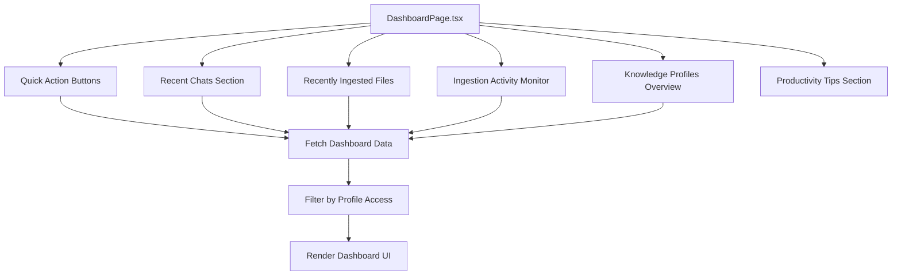

**Diagram sources**
- [DashboardPage.tsx:65-132](file://frontend/src/pages/DashboardPage.tsx#L65-L132)
- [DashboardPage.tsx:182-236](file://frontend/src/pages/DashboardPage.tsx#L182-L236)

**Section sources**
- [DashboardPage.tsx:65-535](file://frontend/src/pages/DashboardPage.tsx#L65-L535)

### Chat Interface
- Real-time messaging with optimistic UI updates and rollback on error.
- Supports file attachments with token estimates and previews.
- Integrates with FederatedAgentPanel to visualize agent operations.
- Uses ChatSidebarContext for session creation, selection, and management.

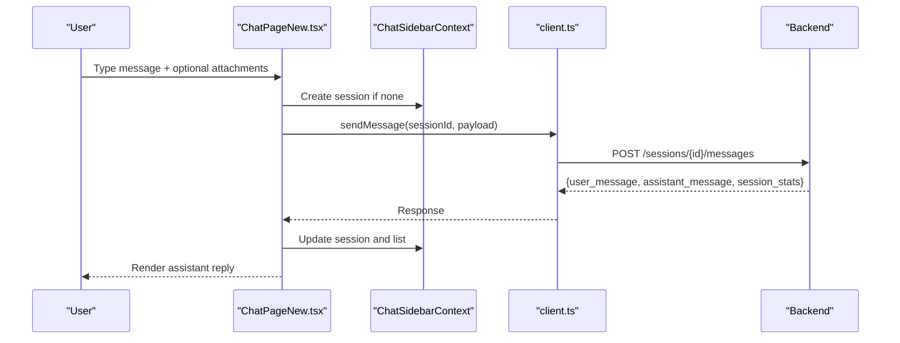

**Diagram sources**
- [ChatPageNew.tsx:206-293](file://frontend/src/pages/ChatPageNew.tsx#L206-L293)
- [ChatSidebarContext.tsx:161-188](file://frontend/src/contexts/ChatSidebarContext.tsx#L161-L188)
- [client.ts:738-765](file://frontend/src/api/client.ts#L738-L765)

**Section sources**
- [ChatPageNew.tsx:53-528](file://frontend/src/pages/ChatPageNew.tsx#L53-L528)
- [ChatSidebarContext.tsx:75-399](file://frontend/src/contexts/ChatSidebarContext.tsx#L75-L399)

### Search Interface
- Supports hybrid, semantic, and text search modes with adjustable result counts.
- Displays results with document metadata and similarity scores.

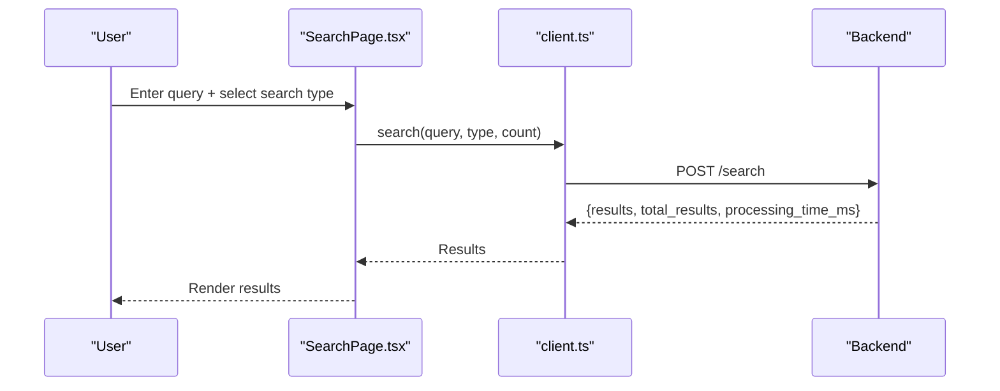

**Diagram sources**
- [SearchPage.tsx:16-34](file://frontend/src/pages/SearchPage.tsx#L16-L34)
- [client.ts:767-795](file://frontend/src/api/client.ts#L767-L795)

**Section sources**
- [SearchPage.tsx:1-158](file://frontend/src/pages/SearchPage.tsx#L1-L158)
- [client.ts:767-795](file://frontend/src/api/client.ts#L767-L795)

### Document Management
- Folder-aware document explorer with tree view and grid/list modes.
- Sorting, pagination, and search across folders.
- Metadata rebuild workflow with progress polling.

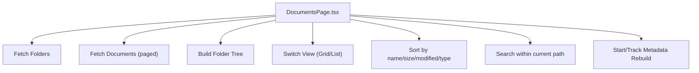

**Diagram sources**
- [DocumentsPage.tsx:158-900](file://frontend/src/pages/DocumentsPage.tsx#L158-L900)
- [client.ts:300-306](file://frontend/src/api/client.ts#L300-L306)

**Section sources**
- [DocumentsPage.tsx:158-900](file://frontend/src/pages/DocumentsPage.tsx#L158-L900)

### System Administration Pages
- SystemPage acts as a hub for admin-only system sub-pages.
- Redirects non-admin users to dashboard.
- Provides comprehensive system monitoring and management capabilities.
- New administrative pages include backup management, embedding benchmarking, strategy testing, and live debugging.

**Section sources**
- [SystemPage.tsx:43-102](file://frontend/src/pages/SystemPage.tsx#L43-L102)

### Federated Agent Panel
- Visualizes orchestrator phases, worker tasks, sources, and cost/timing metrics.
- Collapsible sections for deep inspection of agent operations.

**Section sources**
- [FederatedAgentPanel.tsx:32-342](file://frontend/src/components/FederatedAgentPanel.tsx#L32-L342)

## New UI Components

### CommandPalette Component
The CommandPalette provides a comprehensive quick navigation system with keyboard shortcuts and intelligent filtering:

- **Keyboard Shortcuts**: Activated with Ctrl+K (Cmd+K on Mac) for rapid access to all major application features.
- **Intelligent Filtering**: Searches across navigation items, recent visits, and action categories with fuzzy matching.
- **Category Organization**: Groups results into Recent, Navigation, and Actions categories for better discoverability.
- **Accessibility**: Full keyboard navigation support with arrow keys, enter selection, and escape closing.
- **Integration**: Seamlessly integrates with the existing navigation system and maintains language-aware routing.

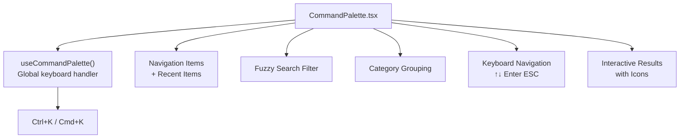

**Diagram sources**
- [CommandPalette.tsx:125-364](file://frontend/src/components/CommandPalette.tsx#L125-L364)

**Section sources**
- [CommandPalette.tsx:1-364](file://frontend/src/components/CommandPalette.tsx#L1-L364)

### ConnectionStatus Component
The ConnectionStatus component provides real-time API connectivity monitoring with multiple display variants:

- **Multi-Status Support**: Displays connected, disconnected, checking, and slow connection states with appropriate visual indicators.
- **Latency Tracking**: Measures and displays response times with thresholds for slow connection detection (>2000ms).
- **Dual Monitoring**: Combines health check endpoint verification with browser online/offline event handling.
- **Position Variants**: Inline positioning for integration or fixed positioning for prominent status display.
- **Responsive Design**: Multiple size variants (sm/md) with appropriate spacing and icon scaling.

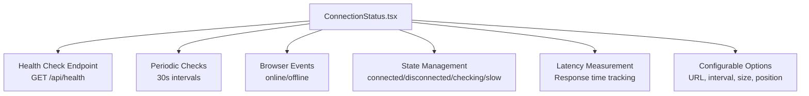

**Diagram sources**
- [ConnectionStatus.tsx:28-206](file://frontend/src/components/ConnectionStatus.tsx#L28-L206)

**Section sources**
- [ConnectionStatus.tsx:1-206](file://frontend/src/components/ConnectionStatus.tsx#L1-L206)

### CopyButton Component Variants
The CopyButton component family provides comprehensive clipboard operations with visual feedback and multiple interaction patterns:

- **Standard CopyButton**: Full-featured button with variants (ghost, outline, filled), size options, and toast notifications.
- **CopyIconButton**: Minimal icon-only variant for inline text and code blocks with subtle hover effects.
- **CopyCodeButton**: Specialized button positioned absolutely for code block copying with gradient backgrounds.
- **Visual Feedback**: Animated transitions between normal and copied states with checkmark indicators.
- **Fallback Support**: Automatic fallback to textarea-based copying for browsers without Clipboard API support.

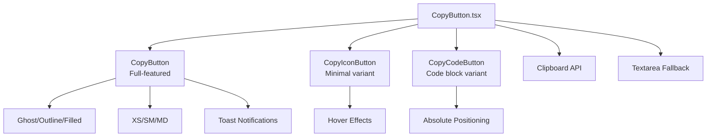

**Diagram sources**
- [CopyButton.tsx:30-219](file://frontend/src/components/CopyButton.tsx#L30-L219)

**Section sources**
- [CopyButton.tsx:1-219](file://frontend/src/components/CopyButton.tsx#L1-L219)

### LoadingSkeleton Component Library
The LoadingSkeleton component provides comprehensive skeleton loading placeholders for improved perceived performance:

- **Base Skeleton**: Configurable width/height, border radius variants (text, circular, rectangular, rounded), and optional shimmer animation.
- **Specialized Skeletons**: Pre-built skeletons for common UI patterns including text lines, avatars, cards, chat messages, search results, table rows, document lists, and sidebars.
- **Performance Optimization**: CSS-based animations with efficient rendering and minimal DOM overhead.
- **Consistent Styling**: Matches the application's design system with proper dark mode support and theme-aware colors.
- **Flexible Usage**: Exported as individual components for specific use cases and combined for complex loading scenarios.

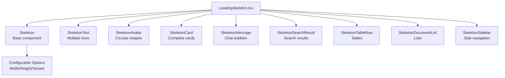

**Diagram sources**
- [LoadingSkeleton.tsx:23-229](file://frontend/src/components/LoadingSkeleton.tsx#L23-L229)

**Section sources**
- [LoadingSkeleton.tsx:1-229](file://frontend/src/components/LoadingSkeleton.tsx#L1-L229)

## Specialized Administrative Pages

### BackupManagementPage
The BackupManagementPage provides comprehensive database backup and restore operations with advanced features:

- **Backup Creation**: Supports full, incremental, checkpoint, and post-ingestion backup types with configurable options.
- **Profile Integration**: Links backups to knowledge profiles for organized management.
- **Progress Monitoring**: Real-time progress tracking with collection-by-collection status updates.
- **Restore Operations**: Granular restore controls with mode selection (full, selective) and target database specification.
- **Storage Analytics**: Comprehensive storage statistics including usage percentages and type distribution.
- **Configuration Management**: Centralized backup settings with retention policies, compression options, and automated backup scheduling.

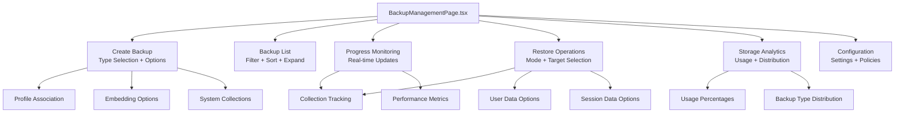

**Diagram sources**
- [BackupManagementPage.tsx:131-800](file://frontend/src/pages/BackupManagementPage.tsx#L131-L800)

**Section sources**
- [BackupManagementPage.tsx:1-800](file://frontend/src/pages/BackupManagementPage.tsx#L1-L800)

### EmbeddingBenchmarkPage
The EmbeddingBenchmarkPage enables comprehensive provider performance testing and comparison:

- **Multi-Provider Testing**: Supports OpenAI, Ollama (local), and custom vLLM providers with model selection.
- **Performance Metrics**: Comprehensive benchmarking including embedding time, average latency, dimension analysis, and estimated costs.
- **File-Based Testing**: Accepts various document formats (TXT, MD, PDF, DOCX) for realistic performance evaluation.
- **Configuration Control**: Adjustable chunk size, overlap, and token limits for testing different scenarios.
- **Historical Tracking**: Complete benchmark history with winner determination and performance comparisons.
- **Admin-Only Access**: Restricted to administrators for system-level provider evaluation.

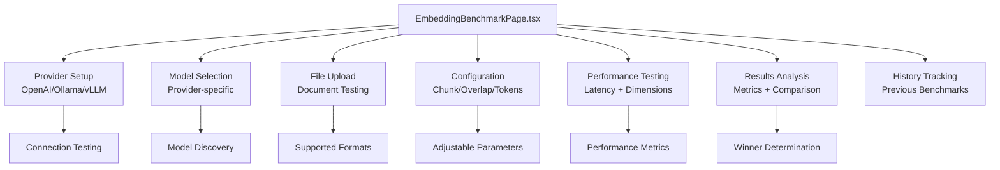

**Diagram sources**
- [EmbeddingBenchmarkPage.tsx:382-916](file://frontend/src/pages/EmbeddingBenchmarkPage.tsx#L382-L916)

**Section sources**
- [EmbeddingBenchmarkPage.tsx:1-916](file://frontend/src/pages/EmbeddingBenchmarkPage.tsx#L1-L916)

### StrategyABTestPage
The StrategyABTestPage enables systematic comparison of agent strategies with AI-powered evaluation:

- **Strategy Comparison**: Side-by-side testing of any two strategies with identical queries and sessions.
- **Response Analysis**: AI-powered evaluation of responses across multiple criteria (quality, hallucination, readability, factuality, relevance).
- **Performance Metrics**: Latency measurement and comparative analysis between strategies.
- **Administrative Access**: Restricted to administrators for system optimization and strategy evaluation.
- **Session Management**: Automated session creation for consistent testing conditions.
- **Recommendations**: AI-generated recommendations based on comparative analysis results.

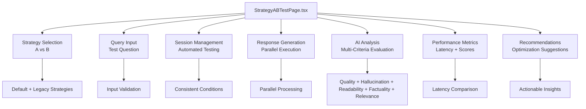

**Diagram sources**
- [StrategyABTestPage.tsx:111-541](file://frontend/src/pages/StrategyABTestPage.tsx#L111-L541)

**Section sources**
- [StrategyABTestPage.tsx:1-541](file://frontend/src/pages/StrategyABTestPage.tsx#L1-L541)

### LiveDebugPage - Advanced Strategy OS Debugging
The LiveDebugPage provides comprehensive real-time monitoring and debugging capabilities for the Strategy OS:

- **Admin-Only Access**: Requires administrator privileges with automatic redirection for non-admin users.
- **Real-Time Monitoring**: Five-second polling interval for live activity updates and system state refresh.
- **System State Visualization**: Displays orchestrator/worker models, active profile, database, uptime, and active request counts.
- **Active Request Tracking**: Shows currently processing requests with elapsed time counters and session information.
- **Activity Timeline**: Expandsable timeline of recent completed requests with detailed entry breakdowns.
- **Request Detail Inspection**: Loads verbose request details including full LLM prompts/responses for admin review.
- **Error Handling**: Comprehensive error states with user-friendly messages and automatic retry logic.
- **Performance Optimization**: Efficient polling with proper cleanup and loading state management.

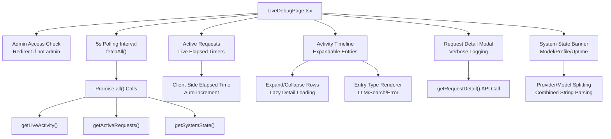

**Diagram sources**
- [LiveDebugPage.tsx:257-462](file://frontend/src/pages/LiveDebugPage.tsx#L257-L462)
- [client.ts:3686-3740](file://frontend/src/api/client.ts#L3686-L3740)

**Section sources**
- [LiveDebugPage.tsx:1-462](file://frontend/src/pages/LiveDebugPage.tsx#L1-L462)
- [client.ts:3686-3740](file://frontend/src/api/client.ts#L3686-L3740)

## Debugging and API Integration

### Enhanced Debug API Integration
The debug API provides comprehensive debugging capabilities with improved response handling and type safety:

- **Type Safety**: Strongly typed interfaces for all debug responses including DebugSystemState, DebugActiveRequest, DebugActivityItem, and DebugRequestDetail.
- **Response Normalization**: Backend response normalization with provider/model splitting and status determination logic.
- **Error Handling**: Comprehensive error handling with proper HTTP status code mapping and user-friendly error messages.
- **Admin-Only Endpoints**: All debug endpoints require administrator privileges with automatic access control.
- **Real-Time Data**: Live activity monitoring with recent request filtering and status tracking.

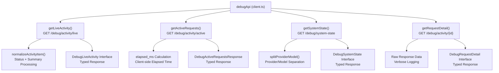

**Diagram sources**
- [client.ts:3686-3740](file://frontend/src/api/client.ts#L3686-L3740)
- [client.ts:3540-3615](file://frontend/src/api/client.ts#L3540-L3615)
- [client.ts:3664-3684](file://frontend/src/api/client.ts#L3664-L3684)

**Section sources**
- [client.ts:3540-3740](file://frontend/src/api/client.ts#L3540-L3740)

### Backend Debug Router Implementation
The backend debug router provides comprehensive admin-only debugging endpoints:

- **Admin Access Control**: All endpoints require administrator privileges with automatic 403 responses for non-admin users.
- **Active Request Registry**: In-memory registry tracking currently processing requests with metadata storage.
- **Live Activity Monitoring**: Recent activity filtering with 30-minute window and 50-item limit.
- **System State Snapshot**: Current system configuration including orchestrator/worker models, active profile, and uptime calculation.
- **Request Detail Inspection**: Full verbose logging access for specific request IDs with proper error handling.

```mermaid
flowchart TD
DR["debug.py Router"] --> AdminDep["require_admin()<br/>Admin Access Control"]
DR --> ActiveReg["active_requests Registry<br/>In-Memory Active Request Store"]
DR --> LiveEndpoint["/debug/activity/live<br/>Recent Activity Endpoint"]
DR --> ActiveEndpoint["/debug/activity/active<br/>Active Requests Endpoint"]
DR --> DetailEndpoint["/debug/activity/{id}<br/>Request Detail Endpoint"]
DR --> SystemEndpoint["/debug/system-state<br/>System State Endpoint"]
AdminDep --> AccessControl["403 Error for Non-Admins"]
ActiveReg --> Register["register_active_request()<br/>Request Registration"]
ActiveReg --> Unregister["unregister_active_request()<br/>Request Completion"]
LiveEndpoint --> MongoQuery["MongoDB Query<br/>30min Window + 50 Item Limit"]
ActiveEndpoint --> ActiveList["Active Request List<br/>Elapsed Time Calculation"]
DetailEndpoint --> MongoDetail["MongoDB Detail Query<br/>Full Verbose Logging"]
SystemEndpoint --> AppState["System State Snapshot<br/>Model + Profile + Uptime"]
```

**Diagram sources**
- [debug.py:1-168](file://backend/routers/debug.py#L1-L168)

**Section sources**
- [debug.py:1-168](file://backend/routers/debug.py#L1-L168)

### Live Debug Page Component Architecture
The LiveDebugPage component implements advanced debugging with comprehensive UI patterns:

- **Admin-Only Rendering**: Uses useEffect to check admin status and redirect non-admin users to dashboard.
- **Real-Time Polling**: Five-second polling interval with proper cleanup and loading state management.
- **Component Composition**: Modular components for system state, active requests, and activity timeline.
- **Error Boundaries**: Comprehensive error handling with user-friendly messages and automatic retry logic.
- **Performance Optimization**: Efficient rendering with expandable rows and lazy detail loading.

```mermaid
flowchart TD
LDP["LiveDebugPage.tsx"] --> AdminCheck["useEffect Admin Check<br/>navigate('/dashboard')"]
LDP --> Polling["useEffect Polling<br/>setInterval(fetchAll, 5000)"]
LDP --> LoadingState["isLoading + authLoading<br/>Loading States"]
LDP --> ErrorState["setError + Error Banner<br/>User-Friendly Messages"]
LDP --> SystemState["SystemStateBanner<br/>Model/Profile/Uptime Display"]
LDP --> ActiveRequests["ActiveRequestsList<br/>Live Elapsed Timers"]
LDP --> ActivityTimeline["ActivityTimeline<br/>Expandable Rows"]
LDP --> RequestDetail["RequestDetailModal<br/>Verbose Logging"]
AdminCheck --> Redirect["Non-Admin -> Dashboard"]
Polling --> Cleanup["useEffect Return Function<br/>clearInterval()"]
LoadingState --> Skeleton["LoadingSkeleton Components<br/>Improved Perceived Performance"]
ErrorState --> Toast["Toast Notifications<br/>Error Handling"]
SystemState --> ProviderDisplay["Provider/Model Display<br/>Formatted Strings"]
ActiveRequests --> TimerDisplay["Timer Display<br/>formatDuration()"]
ActivityTimeline --> EntryRenderer["EntryRenderer<br/>Type-Specific Rendering"]
RequestDetail --> LazyLoading["Lazy Loading<br/>onToggle() Detail Fetch"]
```

**Diagram sources**
- [LiveDebugPage.tsx:257-462](file://frontend/src/pages/LiveDebugPage.tsx#L257-L462)

**Section sources**
- [LiveDebugPage.tsx:1-462](file://frontend/src/pages/LiveDebugPage.tsx#L1-L462)

## Internationalization and Localization

### Language Detection and URL Handling
The application implements comprehensive internationalization support with automatic language detection and URL-based localization:

- **Language Detection**: Automatically detects language from URL path, localStorage, and browser preferences.
- **URL-Based Localization**: Routes are prefixed with language codes (e.g., `/en/dashboard`, `/de/dashboard`).
- **Automatic Translation**: All UI text is managed through i18next with automatic translation resolution.
- **Language Persistence**: Selected language is stored in localStorage and applied across sessions.

### LanguageSwitcher Component
Provides an intuitive dropdown interface for language selection:

- **Visual Indicators**: Displays flag emojis for quick language identification.
- **Compact Mode**: Minimal icon-only display for space-constrained interfaces.
- **Full Mode**: Shows language name and code for detailed selection.
- **State Management**: Integrates with LanguageContext for seamless language switching.

### ThemeSwitcher Component
Offers dynamic theme management with three modes:

- **Light/Dark/System Modes**: Traditional light/dark themes plus system preference detection.
- **Dynamic Icons**: Automatically switches between sun/moon icons based on current theme.
- **Persistent Settings**: Theme preferences are stored and applied across sessions.
- **Real-time Updates**: Immediate visual feedback when changing themes.

### LocalizedLink Component
Enhances navigation with automatic language awareness:

- **URL Prefixing**: Automatically adds language codes to navigation links.
- **Path Preservation**: Maintains existing path structure while adding language prefixes.
- **Route Parameter Support**: Works with React Router parameters and dynamic routes.
- **Navigation Hooks**: Provides `useLocalizedNavigate()` for programmatic navigation.

### ModelVersionSelector Component
Advanced model management interface:

- **Model Browsing**: Comprehensive list of available model versions with detailed information.
- **Filtering and Sorting**: Multiple filter options (provider, type, deprecation status) with sorting capabilities.
- **Model Comparison**: Visual indicators for provider and type categorization.
- **Switch Operations**: Direct model switching with success/error feedback.
- **Pricing and Capabilities**: Detailed display of model capabilities, pricing, and technical specifications.

**Section sources**
- [LanguageSwitcher.tsx:1-80](file://frontend/src/components/LanguageSwitcher.tsx#L1-L80)
- [ThemeSwitcher.tsx:1-95](file://frontend/src/components/ThemeSwitcher.tsx#L1-L95)
- [LocalizedLink.tsx:1-56](file://frontend/src/components/LocalizedLink.tsx#L1-L56)
- [ModelVersionSelector.tsx:1-404](file://frontend/src/components/ModelVersionSelector.tsx#L1-L404)
- [LanguageContext.tsx:14-71](file://frontend/src/contexts/LanguageContext.tsx#L14-L71)
- [index.ts:1-62](file://frontend/src/i18n/index.ts#L1-L62)
- [en.json:1-652](file://frontend/src/i18n/locales/en.json#L1-L652)
- [de.json:1-652](file://frontend/src/i18n/locales/de.json#L1-L652)

## Dependency Analysis
- Build and Dev Tools
  - Vite dev server with proxy to backend API.
  - TypeScript compilation and test runner.
- Runtime Dependencies
  - React, React Router, Axios, react-markdown, react-arborist, Material Tailwind components.
  - i18next for internationalization with language detection.
  - react-i18next for React integration.
- Styling
  - Tailwind CSS with Material Design-inspired color tokens and elevation shadows.
- New UI Component Dependencies
  - Heroicons for consistent iconography across all new components.
  - Clipboard API for modern copy operations with fallback support.
  - Intersection Observer for performance optimization in skeleton components.
- Debugging Dependencies
  - WebSocket-like polling for real-time debugging updates.
  - Admin-only access control with automatic redirection.
  - Comprehensive error handling with user-friendly messages.

```mermaid
graph LR
Pkg["package.json"] --> Vite["vite.config.ts"]
Pkg --> TS["TypeScript"]
Pkg --> Test["vitest"]
Pkg --> UI["@material-tailwind/react"]
Pkg --> Icons["@heroicons/react"]
Pkg --> Markdown["react-markdown"]
Pkg --> Tree["react-arborist"]
Pkg --> Axios["axios"]
Pkg --> Router["react-router-dom"]
Pkg --> Tailwind["tailwind.config.js"]
Pkg --> I18n["i18next"]
Pkg --> ReactI18n["react-i18next"]
Pkg --> Clipboard["Clipboard API"]
Pkg --> Skeleton["Performance Optimizations"]
Pkg --> Debug["Debug API Integration"]
Pkg --> Admin["Admin Access Control"]
```

**Diagram sources**
- [package.json:1-48](file://frontend/package.json#L1-L48)
- [vite.config.ts:1-17](file://frontend/vite.config.ts#L1-L17)
- [tailwind.config.js:1-57](file://frontend/tailwind.config.js#L1-L57)
- [index.ts:1-62](file://frontend/src/i18n/index.ts#L1-L62)

**Section sources**
- [package.json:1-48](file://frontend/package.json#L1-L48)
- [tailwind.config.js:1-57](file://frontend/tailwind.config.js#L1-L57)

## Performance Considerations
- Client-side caching and optimistic UI reduce perceived latency during chat interactions.
- Pagination and debounced search minimize unnecessary backend calls.
- Image previews for attachments are sized appropriately; consider lazy-loading for large lists.
- Tree rendering uses virtualization parameters; ensure large folder structures remain responsive.
- DashboardPage uses concurrent data fetching with proper error handling and loading states.
- Internationalization bundles are loaded on-demand to minimize initial bundle size.
- Theme switching operates without full page reloads for optimal user experience.
- New UI components utilize efficient rendering patterns with minimal DOM overhead.
- LoadingSkeleton components provide instant visual feedback during data fetching operations.
- CommandPalette uses memoization and debounced filtering for responsive search experience.
- ConnectionStatus components implement efficient polling with proper cleanup and browser event handling.
- LiveDebugPage implements efficient polling with proper cleanup and loading state management.
- Debug API responses are normalized client-side to reduce backend complexity.
- Admin-only access control prevents unnecessary API calls for non-admin users.

## Troubleshooting Guide
- Authentication Issues
  - 401 responses trigger a session expired modal; confirm token validity and re-login.
  - Use the custom event listener to handle unauthorized responses centrally.
  - LandingPage provides appropriate navigation based on authentication status.
- Network Failures
  - Automatic retries with exponential backoff for transient failures.
  - Inspect ApiError.getUserMessage for user-friendly messages.
  - ConnectionStatus component provides real-time connectivity feedback.
- UI State Stalls
  - Auth loading overlay indicates token validation in progress.
  - Chat sidebar loading spinner indicates sessions/models fetch.
  - DashboardPage shows loading states during data fetching operations.
  - LiveDebugPage implements proper loading states with skeleton components.
  - New LoadingSkeleton components provide immediate visual feedback.
- Internationalization Issues
  - Language detection falls back to URL path, then localStorage, then browser preferences.
  - Use `useLocalizedNavigate()` for programmatic navigation with language prefixes.
  - LanguageSwitcher persists selections in localStorage for cross-session consistency.
- Theme Issues
  - ThemeSwitcher respects system preferences when set to "system" mode.
  - Theme changes are immediately reflected without page refresh.
  - CSS variables ensure consistent theming across all components.
- New Component Issues
  - CommandPalette requires proper keyboard event handling; verify Ctrl+K shortcuts work.
  - ConnectionStatus polling intervals can be adjusted via props for different environments.
  - CopyButton variants may require Clipboard API permissions in some browsers.
  - LiveDebugPage implements proper cleanup for polling intervals and loading states.
  - Debug API integration handles all error states with user-friendly messages.
- Debugging Issues
  - LiveDebugPage requires administrator privileges; non-admin users are redirected to dashboard.
  - Debug endpoints may return 404 if request ID is invalid or not found.
  - System state may show "unknown" values if backend services are unavailable.
  - Active request timers may reset if backend restarts or loses state.

**Section sources**
- [AuthContext.tsx:93-106](file://frontend/src/contexts/AuthContext.tsx#L93-L106)
- [client.ts:105-159](file://frontend/src/api/client.ts#L105-L159)
- [Layout.tsx:556-564](file://frontend/src/components/Layout.tsx#L556-L564)
- [DashboardPage.tsx:145-151](file://frontend/src/pages/DashboardPage.tsx#L145-L151)
- [LanguageContext.tsx:42-64](file://frontend/src/contexts/LanguageContext.tsx#L42-L64)
- [ThemeSwitcher.tsx:34-41](file://frontend/src/components/ThemeSwitcher.tsx#L34-L41)
- [CommandPalette.tsx:342-363](file://frontend/src/components/CommandPalette.tsx#L342-L363)
- [ConnectionStatus.tsx:66-85](file://frontend/src/components/ConnectionStatus.tsx#L66-L85)
- [CopyButton.tsx:40-59](file://frontend/src/components/CopyButton.tsx#L40-L59)
- [LoadingSkeleton.tsx:23-53](file://frontend/src/components/LoadingSkeleton.tsx#L23-L53)
- [LiveDebugPage.tsx:270-275](file://frontend/src/pages/LiveDebugPage.tsx#L270-L275)
- [client.ts:3686-3740](file://frontend/src/api/client.ts#L3686-L3740)

## Conclusion
The frontend employs a clean separation of concerns with context providers managing global state, a robust HTTP client with interceptors ensuring consistent auth and error handling, and a responsive UI with Tailwind. The centralized routing system now provides a superior user experience by automatically directing authenticated users to the comprehensive dashboard interface, while maintaining separate routes for unauthenticated access. The enhanced internationalization framework provides seamless multi-language support with automatic language detection and URL-based localization. The theme switching capabilities offer users complete control over their visual experience. The routing structure supports a rich user experience across chat, search, document management, and system administration, with clear pathways for future enhancements and comprehensive UI customization options. Recent additions of CommandPalette, ConnectionStatus, CopyButton variants, LoadingSkeleton components, and LiveDebugPage significantly improve user experience, system observability, and debugging capabilities. The new administrative pages for backup management, embedding benchmarking, strategy testing, and live debugging provide powerful tools for system optimization and maintenance. The enhanced debug API integration with improved response handling and type safety ensures reliable debugging operations for Strategy OS monitoring.

## Appendices

### UI Design Principles and Accessibility
- Color Palette: Material Design 3-inspired primary/secondary/surface/background with dark-mode variants.
- Typography: Inter/Roboto-based sans-serif stack.
- Elevation: Consistent shadow levels for depth cues.
- Responsive: Sidebar collapses on mobile; grid/list views adapt to viewport.
- Accessibility: Semantic markup, focus management, keyboard navigation, and ARIA-compliant interactive elements.
- Internationalization: Right-to-left language support, screen reader compatibility, and accessible form controls.
- New Component Accessibility: All new UI components follow WCAG guidelines with proper ARIA labels and keyboard navigation.
- Debug Component Accessibility: LiveDebugPage implements proper ARIA labels and keyboard navigation for debugging interface.

**Section sources**
- [tailwind.config.js:9-53](file://frontend/tailwind.config.js#L9-L53)
- [Layout.tsx:590-612](file://frontend/src/components/Layout.tsx#L590-L612)
- [CommandPalette.tsx:286-312](file://frontend/src/components/CommandPalette.tsx#L286-L312)
- [ConnectionStatus.tsx:138-162](file://frontend/src/components/ConnectionStatus.tsx#L138-L162)
- [CopyButton.tsx:81-105](file://frontend/src/components/CopyButton.tsx#L81-L105)
- [LoadingSkeleton.tsx:42-53](file://frontend/src/components/LoadingSkeleton.tsx#L42-L53)
- [LiveDebugPage.tsx:325-352](file://frontend/src/pages/LiveDebugPage.tsx#L325-L352)

### Build and Deployment Workflow
- Development
  - Run dev server with Vite; proxy configured to backend API.
  - Use ESLint and Vitest for code quality and testing.
  - Internationalization files are bundled with the application.
  - New UI components are optimized for performance with efficient rendering.
  - Debug API integration is included in the main client bundle.
- Production Build
  - TypeScript transpilation followed by Vite build.
  - Output served via static hosting; ensure API proxy is configured in production environment.
  - Language files are optimized for minimal bundle size.
  - Theme switching operates without runtime dependencies.
  - New components are tree-shaken for optimal bundle size.
  - Debug components are included in production builds with proper error handling.

**Section sources**
- [vite.config.ts:1-17](file://frontend/vite.config.ts#L1-L17)
- [package.json:6-14](file://frontend/package.json#L6-L14)
- [CommandPalette.tsx:1-364](file://frontend/src/components/CommandPalette.tsx#L1-L364)
- [ConnectionStatus.tsx:1-206](file://frontend/src/components/ConnectionStatus.tsx#L1-L206)
- [CopyButton.tsx:1-219](file://frontend/src/components/CopyButton.tsx#L1-L219)
- [LoadingSkeleton.tsx:1-229](file://frontend/src/components/LoadingSkeleton.tsx#L1-L229)
- [LiveDebugPage.tsx:1-462](file://frontend/src/pages/LiveDebugPage.tsx#L1-L462)
- [client.ts:3686-3740](file://frontend/src/api/client.ts#L3686-L3740)

### Debugging API Endpoints and Responses
- Live Activity Endpoint (`/debug/activity/live`): Returns recent activity with summary fields and pagination control.
- Active Requests Endpoint (`/debug/activity/active`): Returns currently processing requests with elapsed time calculations.
- System State Endpoint (`/debug/system-state`): Returns current system configuration snapshot.
- Request Detail Endpoint (`/debug/activity/{id}`): Returns full verbose logging for specific request ID.
- Admin Access Control: All endpoints require administrator privileges with automatic 403 responses.

**Section sources**
- [debug.py:58-167](file://backend/routers/debug.py#L58-L167)
- [client.ts:3686-3740](file://frontend/src/api/client.ts#L3686-L3740)
- [LiveDebugPage.tsx:270-275](file://frontend/src/pages/LiveDebugPage.tsx#L270-L275)