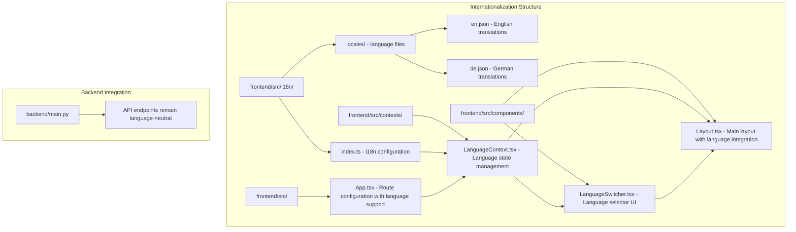
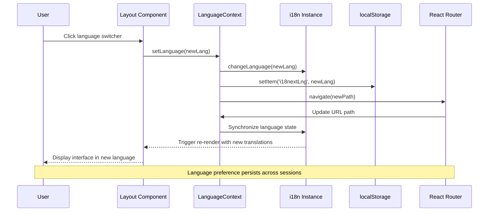
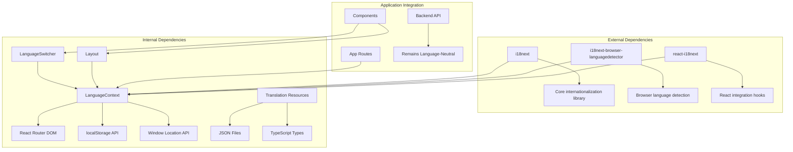

# Internationalization and Localization

<cite>
**Referenced Files in This Document**
- [frontend/src/i18n/index.ts](file://frontend/src/i18n/index.ts)
- [frontend/src/i18n/locales/en.json](file://frontend/src/i18n/locales/en.json)
- [frontend/src/i18n/locales/de.json](file://frontend/src/i18n/locales/de.json)
- [frontend/src/contexts/LanguageContext.tsx](file://frontend/src/contexts/LanguageContext.tsx)
- [frontend/src/components/LanguageSwitcher.tsx](file://frontend/src/components/LanguageSwitcher.tsx)
- [frontend/src/components/Layout.tsx](file://frontend/src/components/Layout.tsx)
- [frontend/src/App.tsx](file://frontend/src/App.tsx)
- [backend/main.py](file://backend/main.py)
</cite>

## Table of Contents
1. [Introduction](#introduction)
2. [Project Structure](#project-structure)
3. [Core Components](#core-components)
4. [Architecture Overview](#architecture-overview)
5. [Detailed Component Analysis](#detailed-component-analysis)
6. [Dependency Analysis](#dependency-analysis)
7. [Performance Considerations](#performance-considerations)
8. [Troubleshooting Guide](#troubleshooting-guide)
9. [Conclusion](#conclusion)

## Introduction

This document provides comprehensive documentation for the internationalization (i18n) and localization (l10n) implementation in the MongoDB RAG Agent project. The system currently supports English and German languages with a robust frontend-based internationalization framework built on React and i18next. The implementation includes automatic language detection, URL-based language routing, persistent language preferences, and a user-friendly language switcher interface.

The internationalization system is designed to be extensible, allowing for easy addition of new languages while maintaining consistency across the entire application. The current implementation focuses entirely on frontend localization, with backend services remaining language-neutral to ensure scalability and maintainability.

## Project Structure

The internationalization system is organized across three main areas of the frontend application:



**Diagram sources**
- [frontend/src/i18n/index.ts](file://frontend/src/i18n/index.ts#L1-L62)
- [frontend/src/contexts/LanguageContext.tsx](file://frontend/src/contexts/LanguageContext.tsx#L1-L96)
- [frontend/src/components/LanguageSwitcher.tsx](file://frontend/src/components/LanguageSwitcher.tsx#L1-L80)
- [frontend/src/components/Layout.tsx](file://frontend/src/components/Layout.tsx#L1-L767)
- [frontend/src/App.tsx](file://frontend/src/App.tsx#L53-L86)

**Section sources**
- [frontend/src/i18n/index.ts](file://frontend/src/i18n/index.ts#L1-L62)
- [frontend/src/contexts/LanguageContext.tsx](file://frontend/src/contexts/LanguageContext.tsx#L1-L96)
- [frontend/src/components/LanguageSwitcher.tsx](file://frontend/src/components/LanguageSwitcher.tsx#L1-L80)
- [frontend/src/components/Layout.tsx](file://frontend/src/components/Layout.tsx#L1-L767)
- [frontend/src/App.tsx](file://frontend/src/App.tsx#L53-L86)

## Core Components

### i18n Configuration System

The internationalization system is built around a centralized configuration that manages language resources, detection mechanisms, and initialization parameters.

**Supported Languages**: The system currently supports two languages with explicit type safety:
- English (`en`) - Primary language
- German (`de`) - Secondary language

**Language Detection Priority**: The system uses a hierarchical detection approach:
1. URL path detection (highest priority)
2. Local storage preference
3. Browser language detection (lowest priority)

**Resource Management**: Translation resources are organized in structured JSON files with semantic grouping for maintainability and scalability.

**Section sources**
- [frontend/src/i18n/index.ts](file://frontend/src/i18n/index.ts#L8-L14)
- [frontend/src/i18n/index.ts](file://frontend/src/i18n/index.ts#L48-L52)

### Language Context Provider

The LanguageContext provides centralized state management for language-related functionality including language switching, URL synchronization, and route handling.

**Key Features**:
- Automatic language detection from URL parameters
- Persistent language preferences via localStorage
- Dynamic URL path updates when language changes
- Type-safe language operations with React hooks

**Section sources**
- [frontend/src/contexts/LanguageContext.tsx](file://frontend/src/contexts/LanguageContext.tsx#L14-L71)

### Language Switcher Component

The LanguageSwitcher component provides an intuitive user interface for language selection with visual indicators and smooth transitions.

**User Experience Features**:
- Flag icons for visual language identification
- Compact and expanded display modes
- Active language highlighting
- Click-outside detection for menu dismissal
- Responsive design integration

**Section sources**
- [frontend/src/components/LanguageSwitcher.tsx](file://frontend/src/components/LanguageSwitcher.tsx#L10-L79)

### Layout Integration

The main Layout component integrates internationalization throughout the application interface, ensuring consistent language support across navigation, menus, and interactive elements.

**Integration Points**:
- Navigation menu items with localized labels
- User interface text throughout component hierarchies
- Context menus with translated actions
- System status and error messages
- Form labels and placeholders

**Section sources**
- [frontend/src/components/Layout.tsx](file://frontend/src/components/Layout.tsx#L45-L54)
- [frontend/src/components/Layout.tsx](file://frontend/src/components/Layout.tsx#L132-L137)

## Architecture Overview

The internationalization architecture follows a reactive pattern with automatic synchronization between language state, URL routing, and user interface components.



**Diagram sources**
- [frontend/src/contexts/LanguageContext.tsx](file://frontend/src/contexts/LanguageContext.tsx#L42-L64)
- [frontend/src/components/LanguageSwitcher.tsx](file://frontend/src/components/LanguageSwitcher.tsx#L56-L58)
- [frontend/src/App.tsx](file://frontend/src/App.tsx#L53-L62)

The architecture ensures seamless language switching without page reloads, maintaining application state while updating all localized content dynamically.

**Section sources**
- [frontend/src/contexts/LanguageContext.tsx](file://frontend/src/contexts/LanguageContext.tsx#L35-L40)
- [frontend/src/contexts/LanguageContext.tsx](file://frontend/src/contexts/LanguageContext.tsx#L49-L64)

## Detailed Component Analysis

### Translation Resource Structure

The translation system organizes content into logical categories for maintainability and scalability:

```mermaid
graph TD
A[Translation Resources] --> B[Common Terms]
A --> C[Navigation Elements]
A --> D[Component Labels]
A --> E[Form Fields]
A --> F[Status Messages]
A --> G[Error Messages]
A --> H[Confirmation Dialogs]
B --> B1[Basic UI terms]
B --> B2[Action verbs]
B --> B3[Status indicators]
C --> C1[Main navigation]
C --> C2[System navigation]
C --> C3[Contextual navigation]
D --> D1[Dashboard components]
D --> D2[Chat interface]
D --> D3[Document management]
D --> D4[Search interface]
E --> E1[Login forms]
E --> E2[Configuration forms]
E --> E3[User management]
F --> F1[System status]
F --> F2[Processing states]
F --> F3[Success notifications]
G --> G1[HTTP errors]
G --> G2[Validation errors]
G --> G3[Authentication errors]
H --> H1[Deletion confirmations]
H --> H2[Action confirmations]
H --> H3[System warnings]
```



**Diagram sources**
- [frontend/src/i18n/locales/en.json](file://frontend/src/i18n/locales/en.json#L1-L652)
- [frontend/src/i18n/locales/de.json](file://frontend/src/i18n/locales/de.json#L1-L652)

Each translation file contains approximately 650 lines of structured content organized into semantic groups, enabling developers to locate specific translations efficiently and maintain consistency across the application.

**Section sources**
- [frontend/src/i18n/locales/en.json](file://frontend/src/i18n/locales/en.json#L1-L652)
- [frontend/src/i18n/locales/de.json](file://frontend/src/i18n/locales/de.json#L1-L652)

### Language Detection Algorithm

The system implements a sophisticated language detection mechanism that prioritizes user intent while respecting browser preferences:

```mermaid
flowchart TD
Start([Language Detection Request]) --> CheckURL{Is URL Path Prefixed?}
CheckURL --> |Yes| ExtractURL[Extract Language from URL]
CheckURL --> |No| CheckStorage{Is Language in localStorage?}
ExtractURL --> ValidateURL{Is URL Language Valid?}
ValidateURL --> |Yes| ReturnURL[Return URL Language]
ValidateURL --> |No| CheckStorage
CheckStorage --> |Yes| ValidateStorage{Is Stored Language Valid?}
CheckStorage --> |No| CheckBrowser{Is Browser Language Supported?}
ValidateStorage --> |Yes| ReturnStorage[Return Stored Language]
ValidateStorage --> |No| CheckBrowser
CheckBrowser --> |Yes| ReturnBrowser[Return Browser Language]
CheckBrowser --> |No| ReturnFallback[Return Default (en)]
ReturnURL --> End([Language Determined])
ReturnStorage --> End
ReturnBrowser --> End
ReturnFallback --> End
```

**Diagram sources**
- [frontend/src/i18n/index.ts](file://frontend/src/i18n/index.ts#L16-L25)
- [frontend/src/contexts/LanguageContext.tsx](file://frontend/src/contexts/LanguageContext.tsx#L21-L31)

**Section sources**
- [frontend/src/i18n/index.ts](file://frontend/src/i18n/index.ts#L16-L33)
- [frontend/src/contexts/LanguageContext.tsx](file://frontend/src/contexts/LanguageContext.tsx#L21-L31)

### Route Configuration Integration

The application routes are configured to support language-prefixed URLs while maintaining backward compatibility and proper redirection:

```mermaid
graph LR
A[Root Path (/)] --> B[Language Redirect]
B --> C[/:lang/ (Language Validation)]
C --> D[/:lang/dashboard]
C --> E[/:lang/login]
C --> F[/:lang/search]
C --> G[/:lang/documents]
H[Direct Language Path] --> I[/:lang/* Routes]
I --> J[Layout Component]
J --> K[Localized Content]
L[Existing Content] --> M[Automatic Language Prefix]
M --> N[Preserved Query Parameters]
N --> O[Preserved Hash Fragments]
```

**Diagram sources**
- [frontend/src/App.tsx](file://frontend/src/App.tsx#L74-L85)
- [frontend/src/App.tsx](file://frontend/src/App.tsx#L53-L62)

**Section sources**
- [frontend/src/App.tsx](file://frontend/src/App.tsx#L53-L86)

## Dependency Analysis

The internationalization system has minimal external dependencies and maintains loose coupling with the broader application architecture:



**Diagram sources**
- [frontend/package-lock.json](file://frontend/package-lock.json#L4411-L4450)
- [frontend/src/contexts/LanguageContext.tsx](file://frontend/src/contexts/LanguageContext.tsx#L1-L4)
- [frontend/src/components/LanguageSwitcher.tsx](file://frontend/src/components/LanguageSwitcher.tsx#L1-L4)

The system leverages modern React patterns with hooks and context APIs, ensuring efficient re-renders and optimal performance. The backend remains completely agnostic to language preferences, maintaining separation of concerns and enabling future scalability.

**Section sources**
- [frontend/package-lock.json](file://frontend/package-lock.json#L4411-L4450)
- [frontend/src/contexts/LanguageContext.tsx](file://frontend/src/contexts/LanguageContext.tsx#L1-L4)

## Performance Considerations

The internationalization implementation is designed for optimal performance through several key strategies:

**Lazy Loading**: Translation resources are loaded on-demand through the i18next configuration, reducing initial bundle size and improving application startup performance.

**Efficient State Management**: The LanguageContext uses React's built-in memoization through useCallback hooks, preventing unnecessary re-renders when language state remains unchanged.

**Minimal DOM Manipulation**: Language switching operations primarily update React state and URL parameters, avoiding expensive DOM traversals or layout recalculations.

**Memory Efficiency**: The system stores only essential language preferences in localStorage, minimizing storage overhead while preserving user preferences across sessions.

**Scalability**: The modular architecture allows for easy addition of new languages without impacting existing functionality, supporting long-term growth and maintenance.

## Troubleshooting Guide

### Common Issues and Solutions

**Language Not Persisting Across Sessions**
- Verify localStorage is enabled in the browser
- Check for browser privacy settings blocking localStorage
- Ensure the `i18nextLng` key exists in localStorage

**URL Language Not Detected**
- Confirm URL follows the `/lang/path` format
- Verify language code matches supported languages array
- Check for trailing slashes or special characters in URL

**Translation Content Not Updating**
- Ensure components use the `useTranslation` hook correctly
- Verify translation keys exist in the appropriate JSON files
- Check for typos in translation key references

**Language Switcher Not Working**
- Confirm LanguageContext is properly wrapped around components
- Verify React Router is configured with language-prefixed routes
- Check for console errors in the browser developer tools

**Section sources**
- [frontend/src/contexts/LanguageContext.tsx](file://frontend/src/contexts/LanguageContext.tsx#L74-L79)
- [frontend/src/i18n/index.ts](file://frontend/src/i18n/index.ts#L48-L52)

### Debugging Internationalization

For debugging internationalization issues, developers can utilize several built-in mechanisms:

**Console Logging**: The system logs language detection attempts and changes to the browser console, aiding in troubleshooting language switching problems.

**Type Safety**: TypeScript integration provides compile-time checking of translation keys, preventing runtime errors from misspelled key references.

**Resource Validation**: JSON translation files are validated against their structure, ensuring all required keys are present and properly formatted.

**Section sources**
- [frontend/src/i18n/index.ts](file://frontend/src/i18n/index.ts#L38-L59)
- [frontend/src/contexts/LanguageContext.tsx](file://frontend/src/contexts/LanguageContext.tsx#L1-L4)

## Conclusion

The MongoDB RAG Agent implements a comprehensive internationalization system that provides a solid foundation for multilingual support. The current implementation successfully delivers English and German language support with automatic detection, persistent preferences, and seamless user interface integration.

The system's strength lies in its modular architecture, type-safe design, and React-centric implementation that ensures optimal performance and maintainability. The backend remains intentionally language-neutral, supporting future expansion without architectural constraints.

Key achievements of the current implementation include:
- Seamless language switching without page reloads
- Automatic language detection from multiple sources
- Persistent user preferences across sessions
- Comprehensive translation coverage across all UI components
- Scalable architecture supporting future language additions

Future enhancements could include dynamic loading of translation resources, pluralization support for different languages, and integration with backend services for locale-specific formatting. However, the current implementation provides a robust foundation that meets the immediate needs of the application while maintaining flexibility for future growth.