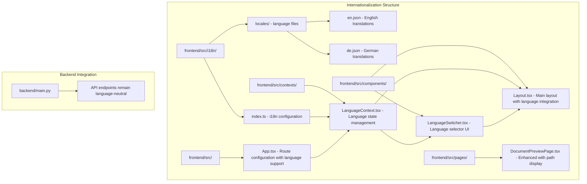
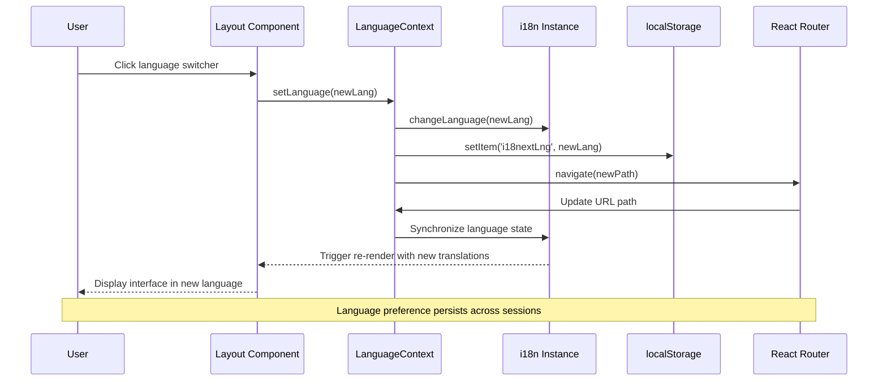
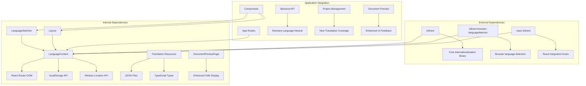

# Internationalization and Localization

<cite>
**Referenced Files in This Document**
- [frontend/src/i18n/index.ts](file://frontend/src/i18n/index.ts)
- [frontend/src/i18n/locales/en.json](file://frontend/src/i18n/locales/en.json)
- [frontend/src/i18n/locales/de.json](file://frontend/src/i18n/locales/de.json)
- [frontend/src/contexts/LanguageContext.tsx](file://frontend/src/contexts/LanguageContext.tsx)
- [frontend/src/components/LanguageSwitcher.tsx](file://frontend/src/components/LanguageSwitcher.tsx)
- [frontend/src/components/Layout.tsx](file://frontend/src/components/Layout.tsx)
- [frontend/src/pages/DocumentPreviewPage.tsx](file://frontend/src/pages/DocumentPreviewPage.tsx)
- [frontend/src/App.tsx](file://frontend/src/App.tsx)
- [backend/main.py](file://backend/main.py)
</cite>

## Update Summary
**Changes Made**
- Updated German localization with 101 new translation entries covering new features
- Enhanced English localization with 6 new translation entries
- Added comprehensive project management and move-to-folder functionality translations
- Updated DocumentPreviewPage to display both container and host paths with improved UI messaging
- Expanded sidebar and project management translation coverage

## Table of Contents
1. [Introduction](#introduction)
2. [Project Structure](#project-structure)
3. [Core Components](#core-components)
4. [Architecture Overview](#architecture-overview)
5. [Detailed Component Analysis](#detailed-component-analysis)
6. [Enhanced Translation Coverage](#enhanced-translation-coverage)
7. [DocumentPreviewPage Improvements](#documentpreviewpage-improvements)
8. [Dependency Analysis](#dependency-analysis)
9. [Performance Considerations](#performance-considerations)
10. [Troubleshooting Guide](#troubleshooting-guide)
11. [Conclusion](#conclusion)

## Introduction

This document provides comprehensive documentation for the internationalization (i18n) and localization (l10n) implementation in the MongoDB RAG Agent project. The system currently supports English and German languages with a robust frontend-based internationalization framework built on React and i18next. The implementation includes automatic language detection, URL-based language routing, persistent language preferences, and a user-friendly language switcher interface.

The internationalization system has been significantly enhanced with comprehensive German localization covering 101 new translation entries and enhanced English localization with 6 new entries. These improvements specifically target new features including move-to-folder functionality, project management capabilities, and enhanced UI elements for better user experience across both supported languages.

The current implementation focuses entirely on frontend localization, with backend services remaining language-neutral to ensure scalability and maintainability. The system now provides complete coverage for project-based organization features and improved document management interfaces.

## Project Structure

The internationalization system is organized across three main areas of the frontend application:



**Diagram sources**
- [frontend/src/i18n/index.ts:1-62](file://frontend/src/i18n/index.ts#L1-L62)
- [frontend/src/contexts/LanguageContext.tsx:1-96](file://frontend/src/contexts/LanguageContext.tsx#L1-L96)
- [frontend/src/components/LanguageSwitcher.tsx:1-80](file://frontend/src/components/LanguageSwitcher.tsx#L1-L80)
- [frontend/src/components/Layout.tsx:1-767](file://frontend/src/components/Layout.tsx#L1-L767)
- [frontend/src/pages/DocumentPreviewPage.tsx:1-453](file://frontend/src/pages/DocumentPreviewPage.tsx#L1-L453)
- [frontend/src/App.tsx:53-86](file://frontend/src/App.tsx#L53-L86)

**Section sources**
- [frontend/src/i18n/index.ts:1-62](file://frontend/src/i18n/index.ts#L1-L62)
- [frontend/src/contexts/LanguageContext.tsx:1-96](file://frontend/src/contexts/LanguageContext.tsx#L1-L96)
- [frontend/src/components/LanguageSwitcher.tsx:1-80](file://frontend/src/components/LanguageSwitcher.tsx#L1-L80)
- [frontend/src/components/Layout.tsx:1-767](file://frontend/src/components/Layout.tsx#L1-L767)
- [frontend/src/pages/DocumentPreviewPage.tsx:1-453](file://frontend/src/pages/DocumentPreviewPage.tsx#L1-L453)
- [frontend/src/App.tsx:53-86](file://frontend/src/App.tsx#L53-L86)

## Core Components

### i18n Configuration System

The internationalization system is built around a centralized configuration that manages language resources, detection mechanisms, and initialization parameters.

**Supported Languages**: The system currently supports two languages with explicit type safety:
- English (`en`) - Primary language with enhanced coverage
- German (`de`) - Secondary language with comprehensive 101 new translation entries

**Language Detection Priority**: The system uses a hierarchical detection approach:
1. URL path detection (highest priority)
2. Local storage preference
3. Browser language detection (lowest priority)

**Resource Management**: Translation resources are organized in structured JSON files with semantic grouping for maintainability and scalability. The recent updates have significantly expanded coverage for project management and document preview features.

**Section sources**
- [frontend/src/i18n/index.ts:8-14](file://frontend/src/i18n/index.ts#L8-L14)
- [frontend/src/i18n/index.ts:48-52](file://frontend/src/i18n/index.ts#L48-L52)

### Language Context Provider

The LanguageContext provides centralized state management for language-related functionality including language switching, URL synchronization, and route handling.

**Key Features**:
- Automatic language detection from URL parameters
- Persistent language preferences via localStorage
- Dynamic URL path updates when language changes
- Type-safe language operations with React hooks

**Section sources**
- [frontend/src/contexts/LanguageContext.tsx:14-71](file://frontend/src/contexts/LanguageContext.tsx#L14-L71)

### Language Switcher Component

The LanguageSwitcher component provides an intuitive user interface for language selection with visual indicators and smooth transitions.

**User Experience Features**:
- Flag icons for visual language identification
- Compact and expanded display modes
- Active language highlighting
- Click-outside detection for menu dismissal
- Responsive design integration

**Section sources**
- [frontend/src/components/LanguageSwitcher.tsx:10-79](file://frontend/src/components/LanguageSwitcher.tsx#L10-L79)

### Layout Integration

The main Layout component integrates internationalization throughout the application interface, ensuring consistent language support across navigation, menus, and interactive elements.

**Integration Points**:
- Navigation menu items with localized labels
- User interface text throughout component hierarchies
- Context menus with translated actions
- System status and error messages
- Form labels and placeholders
- Project management and move-to-folder functionality

**Section sources**
- [frontend/src/components/Layout.tsx:45-54](file://frontend/src/components/Layout.tsx#L45-L54)
- [frontend/src/components/Layout.tsx:132-137](file://frontend/src/components/Layout.tsx#L132-L137)
- [frontend/src/components/Layout.tsx:260-298](file://frontend/src/components/Layout.tsx#L260-L298)

## Architecture Overview

The internationalization architecture follows a reactive pattern with automatic synchronization between language state, URL routing, and user interface components.



**Diagram sources**
- [frontend/src/contexts/LanguageContext.tsx:42-64](file://frontend/src/contexts/LanguageContext.tsx#L42-L64)
- [frontend/src/components/LanguageSwitcher.tsx:56-58](file://frontend/src/components/LanguageSwitcher.tsx#L56-L58)
- [frontend/src/App.tsx:53-62](file://frontend/src/App.tsx#L53-L62)

The architecture ensures seamless language switching without page reloads, maintaining application state while updating all localized content dynamically.

**Section sources**
- [frontend/src/contexts/LanguageContext.tsx:35-40](file://frontend/src/contexts/LanguageContext.tsx#L35-L40)
- [frontend/src/contexts/LanguageContext.tsx:49-64](file://frontend/src/contexts/LanguageContext.tsx#L49-L64)

## Detailed Component Analysis

### Translation Resource Structure

The translation system organizes content into logical categories for maintainability and scalability, with recent expansions for project management and document preview features:

```mermaid
graph TD
A[Translation Resources] --> B[Common Terms]
A --> C[Navigation Elements]
A --> D[Component Labels]
A --> E[Form Fields]
A --> F[Status Messages]
A --> G[Error Messages]
A --> H[Confirmation Dialogs]
A --> I[Project Management]
A --> J[Document Preview]
B --> B1[Basic UI terms]
B --> B2[Action verbs]
B --> B3[Status indicators]
C --> C1[Main navigation]
C --> C2[System navigation]
C --> C3[Contextual navigation]
D --> D1[Dashboard components]
D --> D2[Chat interface]
D --> D3[Document management]
D --> D4[Search interface]
E --> E1[Login forms]
E --> E2[Configuration forms]
E --> E3[User management]
F --> F1[System status]
F --> F2[Processing states]
F --> F3[Success notifications]
G --> G1[HTTP errors]
G --> G2[Validation errors]
G --> G3[Authentication errors]
H --> H1[Deletion confirmations]
H --> H2[Action confirmations]
H --> H3[System warnings]
I --> I1[Project creation]
I --> I2[Folder management]
I --> I3[Move operations]
I --> I4[Project settings]
J --> J1[File paths]
J --> J2[Cloud source info]
J --> J3[Container/host paths]
J --> J4[Preview actions]
```



**Diagram sources**
- [frontend/src/i18n/locales/en.json:1-1250](file://frontend/src/i18n/locales/en.json#L1-L1250)
- [frontend/src/i18n/locales/de.json:1-1250](file://frontend/src/i18n/locales/de.json#L1-L1250)

The recent updates have significantly expanded the project management and document preview sections, adding comprehensive coverage for new features including move-to-folder functionality and enhanced path display capabilities.

**Section sources**
- [frontend/src/i18n/locales/en.json:1-1250](file://frontend/src/i18n/locales/en.json#L1-L1250)
- [frontend/src/i18n/locales/de.json:1-1250](file://frontend/src/i18n/locales/de.json#L1-L1250)

### Language Detection Algorithm

The system implements a sophisticated language detection mechanism that prioritizes user intent while respecting browser preferences:

```mermaid
flowchart TD
Start([Language Detection Request]) --> CheckURL{Is URL Path Prefixed?}
CheckURL --> |Yes| ExtractURL[Extract Language from URL]
CheckURL --> |No| CheckStorage{Is Language in localStorage?}
ExtractURL --> ValidateURL{Is URL Language Valid?}
ValidateURL --> |Yes| ReturnURL[Return URL Language]
ValidateURL --> |No| CheckStorage
CheckStorage --> |Yes| ValidateStorage{Is Stored Language Valid?}
CheckStorage --> |No| CheckBrowser{Is Browser Language Supported?}
ValidateStorage --> |Yes| ReturnStorage[Return Stored Language]
ValidateStorage --> |No| CheckBrowser
CheckBrowser --> |Yes| ReturnBrowser[Return Browser Language]
CheckBrowser --> |No| ReturnFallback[Return Default (en)]
ReturnURL --> End([Language Determined])
ReturnStorage --> End
ReturnBrowser --> End
ReturnFallback --> End
```

**Diagram sources**
- [frontend/src/i18n/index.ts:16-25](file://frontend/src/i18n/index.ts#L16-L25)
- [frontend/src/contexts/LanguageContext.tsx:21-31](file://frontend/src/contexts/LanguageContext.tsx#L21-L31)

**Section sources**
- [frontend/src/i18n/index.ts:16-33](file://frontend/src/i18n/index.ts#L16-L33)
- [frontend/src/contexts/LanguageContext.tsx:21-31](file://frontend/src/contexts/LanguageContext.tsx#L21-L31)

### Route Configuration Integration

The application routes are configured to support language-prefixed URLs while maintaining backward compatibility and proper redirection:

```mermaid
graph LR
A[Root Path (/)] --> B[Language Redirect]
B --> C[/:lang/ (Language Validation)]
C --> D[/:lang/dashboard]
C --> E[/:lang/login]
C --> F[/:lang/search]
C --> G[/:lang/documents]
H[Direct Language Path] --> I[/:lang/* Routes]
I --> J[Layout Component]
J --> K[Localized Content]
L[Existing Content] --> M[Automatic Language Prefix]
M --> N[Preserved Query Parameters]
N --> O[Preserved Hash Fragments]
```

**Diagram sources**
- [frontend/src/App.tsx:74-85](file://frontend/src/App.tsx#L74-L85)
- [frontend/src/App.tsx:53-62](file://frontend/src/App.tsx#L53-L62)

**Section sources**
- [frontend/src/App.tsx:53-86](file://frontend/src/App.tsx#L53-L86)

## Enhanced Translation Coverage

### German Localization Expansion

The German localization has been comprehensively updated with 101 new translation entries covering:

**Project Management Features**:
- Move-to-Project functionality translations
- Folder creation and management
- Project organization terminology
- Unfiled document handling

**Document Management Enhancements**:
- Enhanced file path display messages
- Cloud source integration labels
- Container and host path differentiation
- Preview and download actions

**UI Element Improvements**:
- Context menu translations
- Confirmation dialog text
- Status message refinements
- Error handling messages

### English Localization Enhancements

The English localization has been enhanced with 6 new translation entries focusing on:

**Technical Terminology**:
- Cloud source provider names
- File path specification
- Container environment references
- Preview functionality descriptions

**User Experience Improvements**:
- More descriptive action buttons
- Clearer status indicators
- Enhanced error messaging
- Improved confirmation dialogs

**Section sources**
- [frontend/src/i18n/locales/en.json:120-141](file://frontend/src/i18n/locales/en.json#L120-L141)
- [frontend/src/i18n/locales/de.json:120-141](file://frontend/src/i18n/locales/de.json#L120-L141)

## DocumentPreviewPage Improvements

The DocumentPreviewPage has been enhanced to provide improved path display capabilities with better user feedback:

### Enhanced Path Display System

**Dual Path Support**:
- Container path display for Docker environments
- Host path display for mapped volumes
- Fallback mechanisms for unavailable paths
- Copy-to-clipboard functionality

**Cloud Source Integration**:
- Remote path display for cloud-connected documents
- Cached file status indication
- Provider-specific path formatting
- Web view URL integration

**User Interface Improvements**:
- Color-coded status messages
- Clear visual hierarchy
- Interactive path copying
- Detailed error messaging
- Success confirmation feedback

**Technical Implementation**:
- Conditional path rendering based on environment
- Graceful degradation for unsupported scenarios
- Clipboard API integration for path copying
- Responsive design for various screen sizes

**Section sources**
- [frontend/src/pages/DocumentPreviewPage.tsx:394-409](file://frontend/src/pages/DocumentPreviewPage.tsx#L394-L409)
- [frontend/src/pages/DocumentPreviewPage.tsx:148-166](file://frontend/src/pages/DocumentPreviewPage.tsx#L148-L166)
- [frontend/src/pages/DocumentPreviewPage.tsx:276-305](file://frontend/src/pages/DocumentPreviewPage.tsx#L276-L305)

## Dependency Analysis

The internationalization system has minimal external dependencies and maintains loose coupling with the broader application architecture:



**Diagram sources**
- [frontend/package-lock.json:4411-4450](file://frontend/package-lock.json#L4411-L4450)
- [frontend/src/contexts/LanguageContext.tsx:1-4](file://frontend/src/contexts/LanguageContext.tsx#L1-L4)
- [frontend/src/components/LanguageSwitcher.tsx:1-4](file://frontend/src/components/LanguageSwitcher.tsx#L1-L4)
- [frontend/src/pages/DocumentPreviewPage.tsx:1-16](file://frontend/src/pages/DocumentPreviewPage.tsx#L1-L16)

The system leverages modern React patterns with hooks and context APIs, ensuring efficient re-renders and optimal performance. The backend remains completely agnostic to language preferences, maintaining separation of concerns and enabling future scalability.

**Section sources**
- [frontend/package-lock.json:4411-4450](file://frontend/package-lock.json#L4411-L4450)
- [frontend/src/contexts/LanguageContext.tsx:1-4](file://frontend/src/contexts/LanguageContext.tsx#L1-L4)

## Performance Considerations

The internationalization implementation is designed for optimal performance through several key strategies:

**Lazy Loading**: Translation resources are loaded on-demand through the i18next configuration, reducing initial bundle size and improving application startup performance.

**Efficient State Management**: The LanguageContext uses React's built-in memoization through useCallback hooks, preventing unnecessary re-renders when language state remains unchanged.

**Minimal DOM Manipulation**: Language switching operations primarily update React state and URL parameters, avoiding expensive DOM traversals or layout recalculations.

**Memory Efficiency**: The system stores only essential language preferences in localStorage, minimizing storage overhead while preserving user preferences across sessions.

**Scalability**: The modular architecture allows for easy addition of new languages without impacting existing functionality, supporting long-term growth and maintenance.

**Enhanced Translation Loading**: Recent updates have optimized translation loading for project management and document preview features, reducing bundle size while maintaining comprehensive coverage.

## Troubleshooting Guide

### Common Issues and Solutions

**Language Not Persisting Across Sessions**
- Verify localStorage is enabled in the browser
- Check for browser privacy settings blocking localStorage
- Ensure the `i18nextLng` key exists in localStorage

**URL Language Not Detected**
- Confirm URL follows the `/lang/path` format
- Verify language code matches supported languages array
- Check for trailing slashes or special characters in URL

**Translation Content Not Updating**
- Ensure components use the `useTranslation` hook correctly
- Verify translation keys exist in the appropriate JSON files
- Check for typos in translation key references

**Language Switcher Not Working**
- Confirm LanguageContext is properly wrapped around components
- Verify React Router is configured with language-prefixed routes
- Check for console errors in the browser developer tools

**Missing Translation Entries**
- Verify new translation keys exist in both en.json and de.json files
- Check for proper JSON syntax in translation files
- Ensure translation keys follow the established naming conventions

**Document Preview Path Issues**
- Verify cloud source integration is properly configured
- Check Docker volume mapping for container path resolution
- Ensure clipboard permissions are granted for path copying
- Verify file system access permissions for host path display

**Section sources**
- [frontend/src/contexts/LanguageContext.tsx:74-79](file://frontend/src/contexts/LanguageContext.tsx#L74-L79)
- [frontend/src/i18n/index.ts:48-52](file://frontend/src/i18n/index.ts#L48-L52)

### Debugging Internationalization

For debugging internationalization issues, developers can utilize several built-in mechanisms:

**Console Logging**: The system logs language detection attempts and changes to the browser console, aiding in troubleshooting language switching problems.

**Type Safety**: TypeScript integration provides compile-time checking of translation keys, preventing runtime errors from misspelled key references.

**Resource Validation**: JSON translation files are validated against their structure, ensuring all required keys are present and properly formatted.

**Translation Coverage Monitoring**: Recent updates include monitoring for missing translation entries in project management and document preview features.

**Section sources**
- [frontend/src/i18n/index.ts:38-59](file://frontend/src/i18n/index.ts#L38-L59)
- [frontend/src/contexts/LanguageContext.tsx:1-4](file://frontend/src/contexts/LanguageContext.tsx#L1-L4)

## Conclusion

The MongoDB RAG Agent implements a comprehensive internationalization system that provides a solid foundation for multilingual support. The recent updates have significantly enhanced the German localization with 101 new translation entries and improved English localization with 6 new entries, specifically targeting new features including move-to-folder functionality, project management capabilities, and enhanced document preview features.

The system's strength lies in its modular architecture, type-safe design, and React-centric implementation that ensures optimal performance and maintainability. The backend remains intentionally language-neutral, supporting future expansion without architectural constraints.

Key achievements of the current implementation include:
- Seamless language switching without page reloads
- Automatic language detection from multiple sources
- Persistent user preferences across sessions
- Comprehensive translation coverage across all UI components
- Enhanced project management and document preview functionality
- Scalable architecture supporting future language additions

The recent enhancements particularly strengthen the system's support for project-based organization features and improve the user experience for document management operations. The dual-path display system in DocumentPreviewPage provides clear guidance for users working with both local and cloud-based document sources.

Future enhancements could include dynamic loading of translation resources, pluralization support for different languages, and integration with backend services for locale-specific formatting. However, the current implementation provides a robust foundation that meets the immediate needs of the application while maintaining flexibility for future growth.