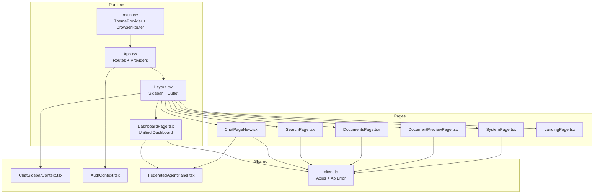
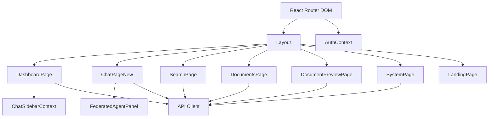
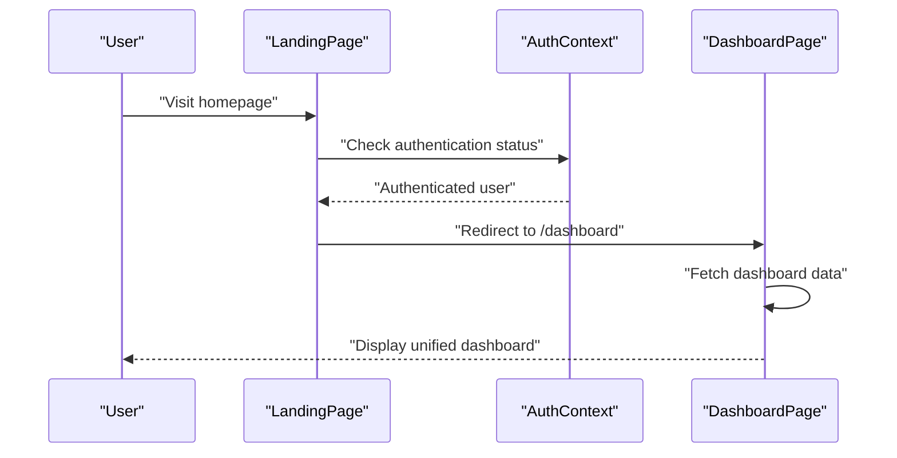
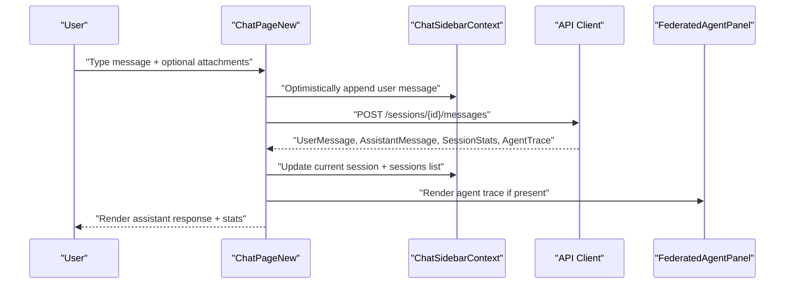
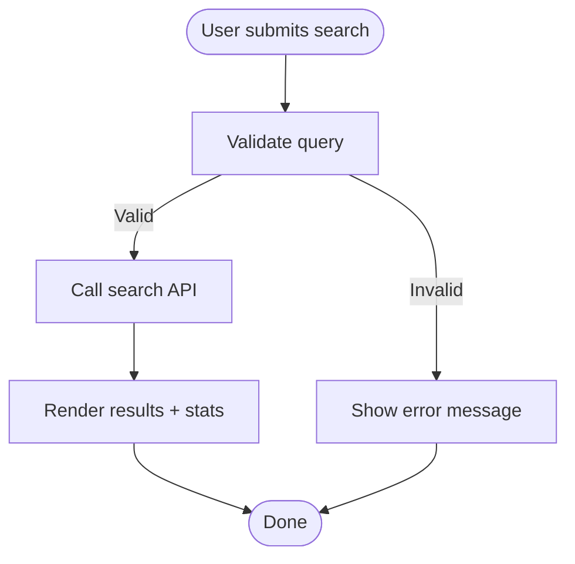
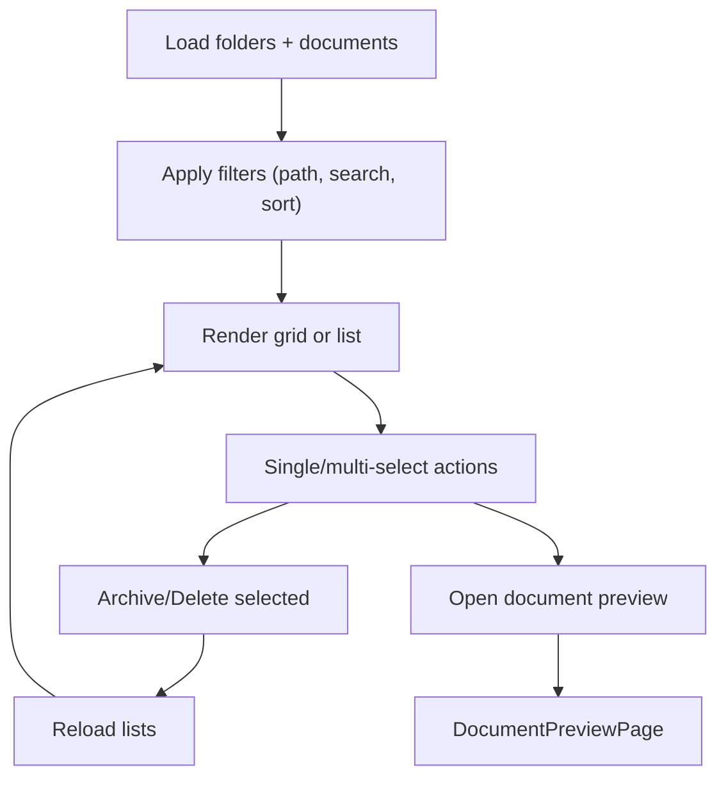
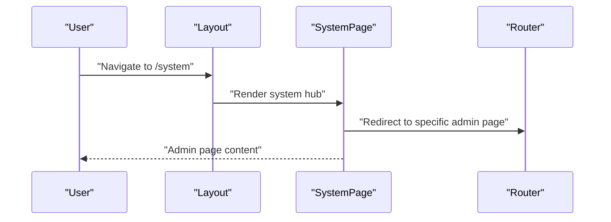
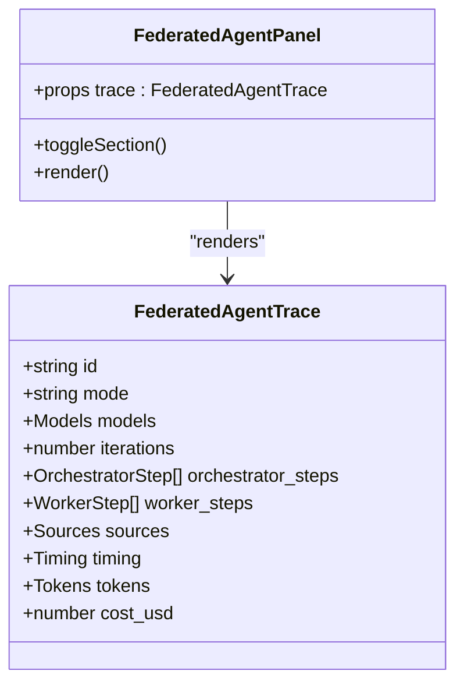
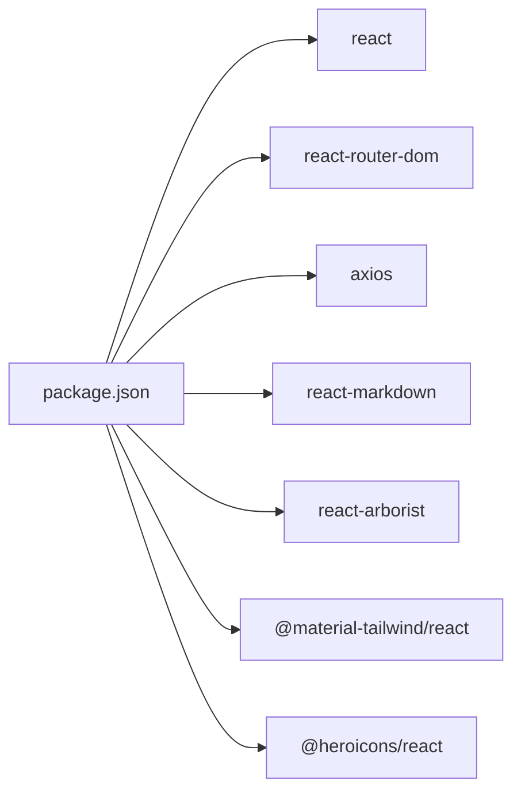

# Key User Interfaces

<cite>
**Referenced Files in This Document**
- [App.tsx](file://frontend/src/App.tsx)
- [main.tsx](file://frontend/src/main.tsx)
- [Layout.tsx](file://frontend/src/components/Layout.tsx)
- [ChatPageNew.tsx](file://frontend/src/pages/ChatPageNew.tsx)
- [SearchPage.tsx](file://frontend/src/pages/SearchPage.tsx)
- [DocumentsPage.tsx](file://frontend/src/pages/DocumentsPage.tsx)
- [DocumentPreviewPage.tsx](file://frontend/src/pages/DocumentPreviewPage.tsx)
- [SystemPage.tsx](file://frontend/src/pages/SystemPage.tsx)
- [DashboardPage.tsx](file://frontend/src/pages/DashboardPage.tsx)
- [LandingPage.tsx](file://frontend/src/pages/LandingPage.tsx)
- [FederatedAgentPanel.tsx](file://frontend/src/components/FederatedAgentPanel.tsx)
- [ChatSidebarContext.tsx](file://frontend/src/contexts/ChatSidebarContext.tsx)
- [AuthContext.tsx](file://frontend/src/contexts/AuthContext.tsx)
- [client.ts](file://frontend/src/api/client.ts)
- [package.json](file://frontend/package.json)
</cite>

## Update Summary
**Changes Made**
- Updated routing structure to reflect HomePage removal and DashboardPage unification
- Added comprehensive DashboardPage documentation covering unified landing experience
- Enhanced authentication flow documentation showing consistent dashboard access
- Updated landing page functionality to redirect authenticated users to dashboard
- Revised component composition patterns to reflect unified dashboard approach

## Table of Contents
1. [Introduction](#introduction)
2. [Project Structure](#project-structure)
3. [Core Components](#core-components)
4. [Architecture Overview](#architecture-overview)
5. [Detailed Component Analysis](#detailed-component-analysis)
6. [Dependency Analysis](#dependency-analysis)
7. [Performance Considerations](#performance-considerations)
8. [Troubleshooting Guide](#troubleshooting-guide)
9. [Conclusion](#conclusion)

## Introduction
This document presents the key user interface components and pages of the application, focusing on:
- Unified dashboard experience with real-time conversation handling, streaming responses, and agent panel integration
- Intelligent search with query processing, result ranking, and filtering
- Document management with upload workflows, preview, and batch operations
- System administration pages for configuration, user management, and monitoring
- Consistent authentication flow with dashboard-centric navigation
It also covers component composition patterns, state management, responsive design, accessibility, and UX principles.

## Project Structure
The frontend is a React application bootstrapped with Vite, styled with Tailwind CSS, and organized by feature pages and shared components. Routing is handled via React Router DOM, with a central layout wrapper and context providers for authentication and chat sidebar state. **Updated**: All authenticated users now consistently land on the unified DashboardPage interface regardless of entry point.

**Diagram sources**
- [main.tsx](file://frontend/src/main.tsx#L1-L17)
- [App.tsx](file://frontend/src/App.tsx#L1-L69)
- [Layout.tsx](file://frontend/src/components/Layout.tsx#L64-L757)
- [DashboardPage.tsx](file://frontend/src/pages/DashboardPage.tsx#L65-L535)
- [ChatPageNew.tsx](file://frontend/src/pages/ChatPageNew.tsx#L53-L528)
- [SearchPage.tsx](file://frontend/src/pages/SearchPage.tsx#L7-L158)
- [DocumentsPage.tsx](file://frontend/src/pages/DocumentsPage.tsx#L158-L900)
- [DocumentPreviewPage.tsx](file://frontend/src/pages/DocumentPreviewPage.tsx#L80-L419)
- [SystemPage.tsx](file://frontend/src/pages/SystemPage.tsx#L43-L106)
- [LandingPage.tsx](file://frontend/src/pages/LandingPage.tsx#L67-L300)
- [FederatedAgentPanel.tsx](file://frontend/src/components/FederatedAgentPanel.tsx#L32-L342)
- [ChatSidebarContext.tsx](file://frontend/src/contexts/ChatSidebarContext.tsx#L75-L400)
- [AuthContext.tsx](file://frontend/src/contexts/AuthContext.tsx#L27-L194)
- [client.ts](file://frontend/src/api/client.ts#L1-L2379)

**Section sources**
- [main.tsx](file://frontend/src/main.tsx#L1-L17)
- [App.tsx](file://frontend/src/App.tsx#L1-L69)

## Core Components
- **Unified Dashboard**: Centralized dashboard interface that serves as the main landing page for authenticated users, providing quick access to all major features
- **Layout and Navigation**: Central layout with collapsible sidebar, user menu, and system navigation. Provides chat session list, folder grouping, and contextual actions
- **Chat Interface**: Real-time messaging with optimistic UI, model selection, attachments, and agent transparency panels
- **Search Interface**: Query input with type selection (hybrid/semantic/text), match count control, and result rendering
- **Documents Interface**: Folder tree, grid/list views, search/filter, and batch operations
- **Document Preview**: Rich preview with metadata, chunks, and cloud/local file handling
- **System Pages**: Hub for admin-only system management pages
- **Authentication Flow**: Consistent login/logout experience with dashboard redirection
- **Context Providers**: Authentication and chat sidebar state management
- **API Client**: Axios-based client with interceptors, error handling, and typed models

**Updated** The dashboard now serves as the unified entry point, replacing the previous HomePage component and providing a comprehensive overview of user activities and quick action access.

**Section sources**
- [DashboardPage.tsx](file://frontend/src/pages/DashboardPage.tsx#L65-L535)
- [Layout.tsx](file://frontend/src/components/Layout.tsx#L64-L757)
- [ChatPageNew.tsx](file://frontend/src/pages/ChatPageNew.tsx#L53-L528)
- [SearchPage.tsx](file://frontend/src/pages/SearchPage.tsx#L7-L158)
- [DocumentsPage.tsx](file://frontend/src/pages/DocumentsPage.tsx#L158-L900)
- [DocumentPreviewPage.tsx](file://frontend/src/pages/DocumentPreviewPage.tsx#L80-L419)
- [SystemPage.tsx](file://frontend/src/pages/SystemPage.tsx#L43-L106)
- [LandingPage.tsx](file://frontend/src/pages/LandingPage.tsx#L67-L300)
- [ChatSidebarContext.tsx](file://frontend/src/contexts/ChatSidebarContext.tsx#L75-L400)
- [AuthContext.tsx](file://frontend/src/contexts/AuthContext.tsx#L27-L194)
- [client.ts](file://frontend/src/api/client.ts#L1-L2379)

## Architecture Overview
The UI follows a layered pattern with a unified dashboard approach:
- Routing layer mounts pages under a shared layout with dashboard as primary authenticated route
- Context providers supply global state (auth, chat sidebar)
- Pages orchestrate UI logic and API interactions
- Shared components encapsulate reusable UI and agent tracing
- API client abstracts HTTP calls, error handling, and typed models
- **Updated**: All authenticated users consistently land on the dashboard interface

**Diagram sources**
- [App.tsx](file://frontend/src/App.tsx#L29-L66)
- [Layout.tsx](file://frontend/src/components/Layout.tsx#L64-L757)
- [DashboardPage.tsx](file://frontend/src/pages/DashboardPage.tsx#L65-L535)
- [ChatPageNew.tsx](file://frontend/src/pages/ChatPageNew.tsx#L53-L528)
- [SearchPage.tsx](file://frontend/src/pages/SearchPage.tsx#L7-L158)
- [DocumentsPage.tsx](file://frontend/src/pages/DocumentsPage.tsx#L158-L900)
- [DocumentPreviewPage.tsx](file://frontend/src/pages/DocumentPreviewPage.tsx#L80-L419)
- [SystemPage.tsx](file://frontend/src/pages/SystemPage.tsx#L43-L106)
- [LandingPage.tsx](file://frontend/src/pages/LandingPage.tsx#L67-L300)
- [ChatSidebarContext.tsx](file://frontend/src/contexts/ChatSidebarContext.tsx#L75-L400)
- [AuthContext.tsx](file://frontend/src/contexts/AuthContext.tsx#L27-L194)
- [FederatedAgentPanel.tsx](file://frontend/src/components/FederatedAgentPanel.tsx#L32-L342)
- [client.ts](file://frontend/src/api/client.ts#L1-L2379)

## Detailed Component Analysis

### Unified Dashboard Interface
**Updated** The dashboard serves as the centralized hub for all authenticated users, replacing the previous HomePage component. It provides:
- Personalized welcome messages with time-based greetings
- Quick action buttons for common operations (New Chat, Search, Documents, Ingestion)
- Recent chats widget with direct navigation
- Recently ingested documents preview
- Ingestion activity monitoring with progress tracking
- Knowledge profiles overview
- Productivity tips and best practices

**Diagram sources**
- [LandingPage.tsx](file://frontend/src/pages/LandingPage.tsx#L107-L116)
- [AuthContext.tsx](file://frontend/src/contexts/AuthContext.tsx#L37-L63)
- [DashboardPage.tsx](file://frontend/src/pages/DashboardPage.tsx#L65-L132)

Key implementation highlights:
- Time-based greeting system ("Good morning/afternoon/evening")
- Quick action cards with icons and hover effects
- Recent activity widgets with navigation shortcuts
- Admin-only features (Ingestion management) for authorized users
- Profile-based data filtering for multi-tenant environments
- Real-time data refresh capability

**Section sources**
- [DashboardPage.tsx](file://frontend/src/pages/DashboardPage.tsx#L65-L535)
- [LandingPage.tsx](file://frontend/src/pages/LandingPage.tsx#L107-L116)
- [AuthContext.tsx](file://frontend/src/contexts/AuthContext.tsx#L37-L63)

### Chat Interface
The chat interface supports:
- Real-time conversation handling with optimistic UI updates
- Model selection and pricing display
- Attachment handling (images, text, others) with token estimates
- Agent transparency via thinking panels and federated agent traces
- Session lifecycle (create, select, rename, pin, archive, delete)
- Responsive input area with auto-resize and keyboard shortcuts

**Diagram sources**
- [ChatPageNew.tsx](file://frontend/src/pages/ChatPageNew.tsx#L206-L293)
- [ChatSidebarContext.tsx](file://frontend/src/contexts/ChatSidebarContext.tsx#L161-L174)
- [client.ts](file://frontend/src/api/client.ts#L730-L736)
- [FederatedAgentPanel.tsx](file://frontend/src/components/FederatedAgentPanel.tsx#L32-L342)

Key implementation highlights:
- Optimistic updates and rollback on error
- Auto-scroll to latest message
- Draft persistence per session
- Token and cost formatting helpers
- Attachment preview and removal
- Model switching with pricing lookup

**Section sources**
- [ChatPageNew.tsx](file://frontend/src/pages/ChatPageNew.tsx#L53-L528)
- [ChatSidebarContext.tsx](file://frontend/src/contexts/ChatSidebarContext.tsx#L75-L400)
- [client.ts](file://frontend/src/api/client.ts#L1-L2379)

### Search Interface
The search page enables:
- Query input with debounced processing
- Search type selection (hybrid, semantic, text)
- Match count control
- Result rendering with document metadata and excerpts
- Error handling and loading states

**Diagram sources**
- [SearchPage.tsx](file://frontend/src/pages/SearchPage.tsx#L16-L34)
- [client.ts](file://frontend/src/api/client.ts#L767-L795)

**Section sources**
- [SearchPage.tsx](file://frontend/src/pages/SearchPage.tsx#L7-L158)
- [client.ts](file://frontend/src/api/client.ts#L217-L233)

### Document Management Interface
The documents page provides:
- Folder tree explorer with expand/collapse and selection
- Grid and list view modes
- Search and sorting controls
- Batch operations (archive/delete) with multi-select
- Metadata rebuild workflow with polling
- Preview navigation to detailed document view

**Diagram sources**
- [DocumentsPage.tsx](file://frontend/src/pages/DocumentsPage.tsx#L191-L241)
- [DocumentsPage.tsx](file://frontend/src/pages/DocumentsPage.tsx#L383-L423)
- [DocumentPreviewPage.tsx](file://frontend/src/pages/DocumentPreviewPage.tsx#L80-L419)

**Section sources**
- [DocumentsPage.tsx](file://frontend/src/pages/DocumentsPage.tsx#L158-L900)
- [DocumentPreviewPage.tsx](file://frontend/src/pages/DocumentPreviewPage.tsx#L80-L419)

### System Administration Pages
The system hub consolidates admin-only pages:
- Status dashboard
- Search indexes metrics
- Ingestion queue and logs
- Configuration management
- User and prompt management
- API keys management

**Diagram sources**
- [SystemPage.tsx](file://frontend/src/pages/SystemPage.tsx#L43-L106)
- [Layout.tsx](file://frontend/src/components/Layout.tsx#L41-L62)

**Section sources**
- [SystemPage.tsx](file://frontend/src/pages/SystemPage.tsx#L43-L106)
- [Layout.tsx](file://frontend/src/components/Layout.tsx#L41-L62)

### Agent Panel Integration
The federated agent panel displays:
- Orchestrator phases and reasoning
- Worker task executions with inputs/results
- Found documents and web links
- Timing, tokens, and costs

**Diagram sources**
- [FederatedAgentPanel.tsx](file://frontend/src/components/FederatedAgentPanel.tsx#L28-L342)
- [client.ts](file://frontend/src/api/client.ts#L609-L672)

**Section sources**
- [FederatedAgentPanel.tsx](file://frontend/src/components/FederatedAgentPanel.tsx#L32-L342)
- [client.ts](file://frontend/src/api/client.ts#L609-L672)

## Dependency Analysis
External dependencies relevant to UI:
- React and React Router DOM for routing and component model
- Axios for HTTP requests with interceptors
- react-markdown for rendering assistant responses
- react-arborist for folder tree UI
- Material Tailwind and Heroicons for UI primitives
- Tailwind CSS for styling and responsive utilities

**Diagram sources**
- [package.json](file://frontend/package.json#L15-L46)

**Section sources**
- [package.json](file://frontend/package.json#L1-L48)

## Performance Considerations
- Debounced search input reduces API calls during typing
- Optimistic UI updates improve perceived responsiveness; rollback on error
- Pagination and server-side filtering in documents reduce payload sizes
- Memoization of derived data (e.g., folder tree) prevents unnecessary re-renders
- Lazy loading of agent panels and previews defers heavy rendering
- Token estimation for attachments helps users gauge impact on costs
- **Updated**: Dashboard data fetching uses concurrent promises for optimal performance
- **Updated**: Authentication validation includes caching to reduce server requests

## Troubleshooting Guide
Common issues and remedies:
- Authentication expiration triggers session expired modal; refresh or re-login
- API errors are normalized via ApiError; user-friendly messages are shown
- Network failures retry automatically; persistent failures surface clear messages
- Session operations (create/select/update/delete) handle errors gracefully
- Document preview handles missing files and cloud source fallbacks
- **Updated**: Dashboard data filtering ensures users only see accessible content
- **Updated**: Authentication redirects prevent unauthorized access to protected routes

**Section sources**
- [AuthContext.tsx](file://frontend/src/contexts/AuthContext.tsx#L94-L106)
- [client.ts](file://frontend/src/api/client.ts#L15-L94)
- [client.ts](file://frontend/src/api/client.ts#L105-L159)
- [ChatSidebarContext.tsx](file://frontend/src/contexts/ChatSidebarContext.tsx#L111-L131)
- [DocumentPreviewPage.tsx](file://frontend/src/pages/DocumentPreviewPage.tsx#L134-L181)
- [DashboardPage.tsx](file://frontend/src/pages/DashboardPage.tsx#L80-L126)

## Conclusion
The UI emphasizes clarity, transparency, and productivity with a unified dashboard approach:
- **Updated**: All authenticated users consistently land on the comprehensive dashboard interface
- Chat provides immediate feedback and agent visibility
- Search offers flexible query modes with clear result indicators
- Documents enable efficient discovery and batch management
- System pages centralize admin tasks behind role-based access
- **Updated**: Dashboard serves as the primary navigation hub with quick access to all features
Composition patterns, context providers, and a robust API client ensure maintainability and scalability across features.