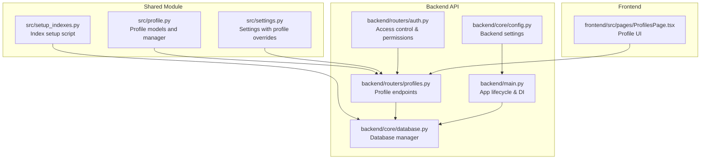
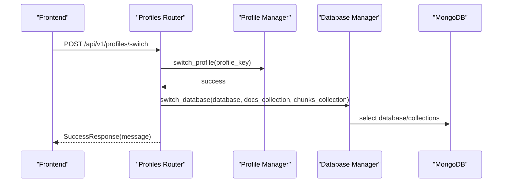
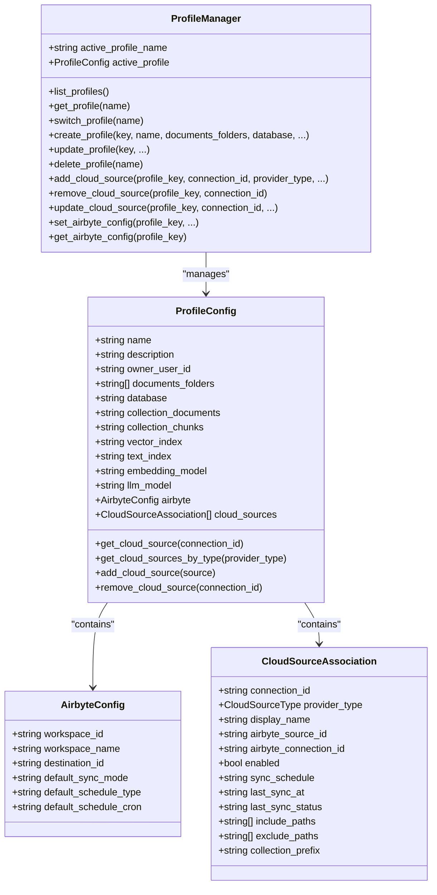
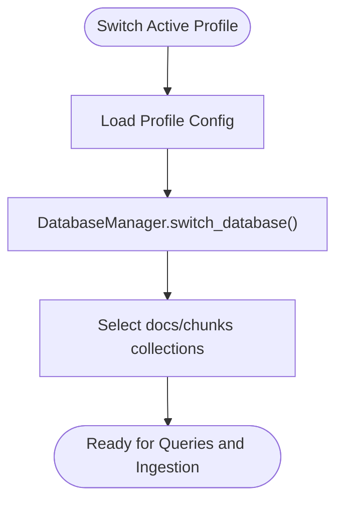
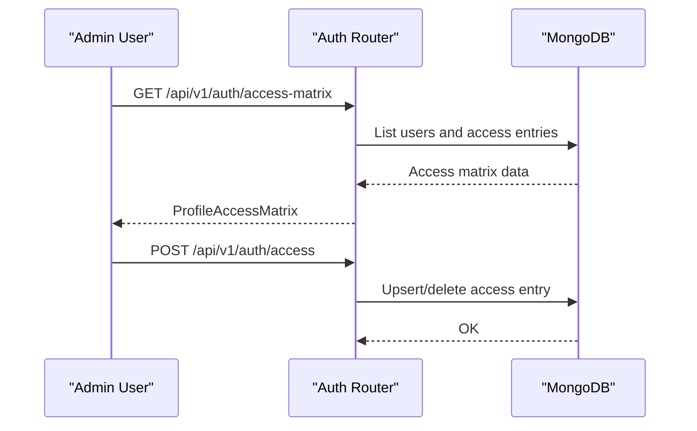
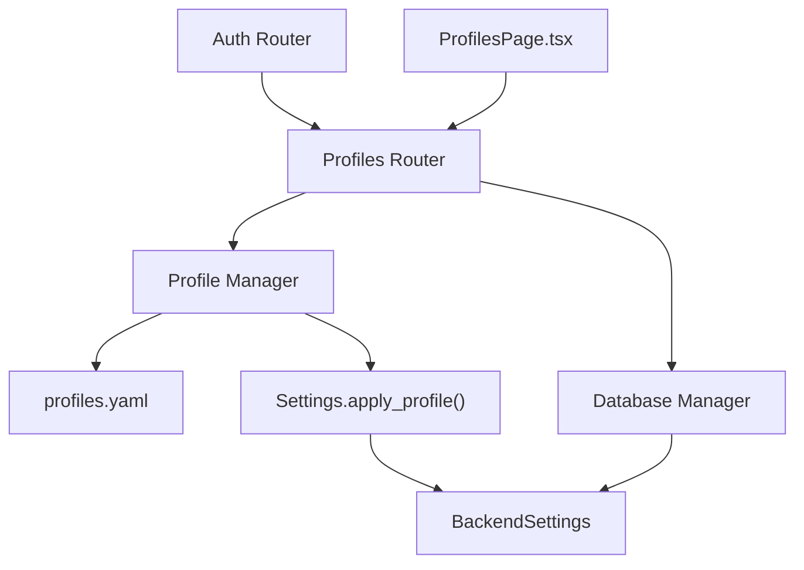

# Multi-Profile Management

<cite>
**Referenced Files in This Document**
- [src/profile.py](file://src/profile.py)
- [backend/routers/profiles.py](file://backend/routers/profiles.py)
- [profiles.yaml](file://profiles.yaml)
- [backend/core/database.py](file://backend/core/database.py)
- [backend/core/config.py](file://backend/core/config.py)
- [src/settings.py](file://src/settings.py)
- [backend/routers/auth.py](file://backend/routers/auth.py)
- [backend/main.py](file://backend/main.py)
- [frontend/src/pages/ProfilesPage.tsx](file://frontend/src/pages/ProfilesPage.tsx)
- [src/setup_indexes.py](file://src/setup_indexes.py)
- [backend/tests/test_profiles.py](file://backend/tests/test_profiles.py)
</cite>

## Table of Contents
1. [Introduction](#introduction)
2. [Project Structure](#project-structure)
3. [Core Components](#core-components)
4. [Architecture Overview](#architecture-overview)
5. [Detailed Component Analysis](#detailed-component-analysis)
6. [Dependency Analysis](#dependency-analysis)
7. [Performance Considerations](#performance-considerations)
8. [Troubleshooting Guide](#troubleshooting-guide)
9. [Conclusion](#conclusion)

## Introduction
This document explains the multi-profile management system that enables multiple knowledge bases within a single deployment. It covers database isolation mechanisms, access control patterns, resource management strategies for multi-tenancy, and profile configuration options including database naming conventions, collection organization, and index management. The system ensures each profile maintains separate document and chunk collections, while providing practical examples for setup, switching, and scaling across multiple knowledge bases.

## Project Structure
The multi-profile system spans three layers:
- Configuration and model definitions in the shared Python module
- API endpoints for profile management and access control
- Frontend UI for user interaction

**Diagram sources**
- [src/profile.py](file://src/profile.py#L1-L740)
- [src/settings.py](file://src/settings.py#L1-L211)
- [src/setup_indexes.py](file://src/setup_indexes.py#L1-L138)
- [backend/routers/profiles.py](file://backend/routers/profiles.py#L1-L732)
- [backend/routers/auth.py](file://backend/routers/auth.py#L537-L618)
- [backend/core/database.py](file://backend/core/database.py#L1-L228)
- [backend/core/config.py](file://backend/core/config.py#L1-L219)
- [backend/main.py](file://backend/main.py#L143-L200)
- [frontend/src/pages/ProfilesPage.tsx](file://frontend/src/pages/ProfilesPage.tsx#L1-L604)

**Section sources**
- [src/profile.py](file://src/profile.py#L1-L740)
- [backend/routers/profiles.py](file://backend/routers/profiles.py#L1-L732)
- [profiles.yaml](file://profiles.yaml#L1-L81)
- [backend/core/database.py](file://backend/core/database.py#L1-L228)
- [backend/core/config.py](file://backend/core/config.py#L1-L219)
- [src/settings.py](file://src/settings.py#L1-L211)
- [backend/routers/auth.py](file://backend/routers/auth.py#L537-L618)
- [backend/main.py](file://backend/main.py#L143-L200)
- [frontend/src/pages/ProfilesPage.tsx](file://frontend/src/pages/ProfilesPage.tsx#L1-L604)
- [src/setup_indexes.py](file://src/setup_indexes.py#L1-L138)

## Core Components
- Profile models and manager: Defines profile configuration, cloud source associations, Airbyte settings, and CRUD operations for profiles and cloud sources.
- Database manager: Provides database switching capability for profile isolation and exposes document/chunk collections.
- Backend settings: Integrates profile overrides into runtime settings for consistent configuration across the application.
- Authentication and access control: Enforces profile access matrices and user permissions.
- Frontend profiles page: Enables administrators to manage profiles and users’ access rights.

Key responsibilities:
- Database isolation via per-profile database names and collection names
- Access control via a dedicated access matrix stored in MongoDB
- Resource management through configurable document folders and Airbyte integration
- Index management via a dedicated script that creates vector and text search indexes

**Section sources**
- [src/profile.py](file://src/profile.py#L90-L171)
- [backend/core/database.py](file://backend/core/database.py#L63-L78)
- [src/settings.py](file://src/settings.py#L106-L155)
- [backend/routers/auth.py](file://backend/routers/auth.py#L537-L618)
- [frontend/src/pages/ProfilesPage.tsx](file://frontend/src/pages/ProfilesPage.tsx#L1-L604)

## Architecture Overview
The system separates concerns across modules and enforces isolation through profile-scoped configuration. The active profile determines the database and collection names used by the API and ingestion pipeline.

**Diagram sources**
- [backend/routers/profiles.py](file://backend/routers/profiles.py#L101-L162)
- [src/profile.py](file://src/profile.py#L292-L312)
- [backend/core/database.py](file://backend/core/database.py#L63-L78)

**Section sources**
- [backend/routers/profiles.py](file://backend/routers/profiles.py#L101-L162)
- [src/profile.py](file://src/profile.py#L292-L312)
- [backend/core/database.py](file://backend/core/database.py#L63-L78)

## Detailed Component Analysis

### Profile Configuration and Isolation
- Each profile defines:
  - Database name for complete separation
  - Document and chunk collection names
  - Search index names (vector and text)
  - Optional overrides for embedding and LLM models
  - Cloud source associations with Airbyte integration
- The active profile’s database and collections are applied to backend settings and used by the database manager.

**Diagram sources**
- [src/profile.py](file://src/profile.py#L90-L171)
- [src/profile.py](file://src/profile.py#L174-L740)

**Section sources**
- [src/profile.py](file://src/profile.py#L90-L171)
- [src/profile.py](file://src/profile.py#L174-L740)
- [profiles.yaml](file://profiles.yaml#L1-L81)

### Database Isolation and Collection Organization
- Database switching: The database manager supports switching databases and collection names at runtime, aligning with the active profile.
- Collection organization: Each profile maintains separate documents and chunks collections, ensuring isolation of ingestion and search data.
- Index management: Separate vector and text indexes are created per profile via a dedicated script.

**Diagram sources**
- [backend/core/database.py](file://backend/core/database.py#L63-L78)
- [backend/routers/profiles.py](file://backend/routers/profiles.py#L134-L143)

**Section sources**
- [backend/core/database.py](file://backend/core/database.py#L63-L78)
- [backend/routers/profiles.py](file://backend/routers/profiles.py#L134-L143)
- [src/setup_indexes.py](file://src/setup_indexes.py#L1-L138)

### Access Control Patterns and Multi-Tenant Strategies
- Access matrix: Administrators define which users have access to which profiles. Admin users automatically gain access to all profiles.
- Per-request enforcement: Profile endpoints check user access before performing operations.
- Resource isolation: Users can only operate within profiles they are granted access to.

**Diagram sources**
- [backend/routers/auth.py](file://backend/routers/auth.py#L537-L618)

**Section sources**
- [backend/routers/auth.py](file://backend/routers/auth.py#L537-L618)

### Practical Examples

#### Example: Profile Setup
- Create a new profile with a unique key, display name, document folders, and optional database name.
- The profile manager persists configuration to the profiles file and applies defaults when unspecified.

**Section sources**
- [src/profile.py](file://src/profile.py#L314-L362)
- [profiles.yaml](file://profiles.yaml#L26-L49)

#### Example: Switching Between Profiles
- Switching updates the active profile and rebinds the database connection to the new profile’s database and collections.

**Section sources**
- [backend/routers/profiles.py](file://backend/routers/profiles.py#L101-L162)
- [backend/core/database.py](file://backend/core/database.py#L63-L78)

#### Example: Managing Resources Across Multiple Knowledge Bases
- Use distinct database names per profile to isolate data.
- Configure document folders per profile to target different content sources.
- Leverage Airbyte integration to sync cloud sources into profile-specific collections.

**Section sources**
- [src/profile.py](file://src/profile.py#L125-L135)
- [src/profile.py](file://src/profile.py#L641-L696)

#### Example: Index Management
- Run the index setup script to create vector and text search indexes for the active profile’s chunks collection.

**Section sources**
- [src/setup_indexes.py](file://src/setup_indexes.py#L1-L138)

## Dependency Analysis
The multi-profile system integrates several components:
- Profile manager depends on the profiles configuration file and exposes CRUD operations.
- Database manager depends on backend settings and provides runtime switching.
- Backend settings integrate profile overrides to ensure consistent configuration.
- Authentication router manages access control and enforces profile permissions.
- Frontend interacts with the profiles API to manage profiles and access rights.

**Diagram sources**
- [src/profile.py](file://src/profile.py#L174-L740)
- [src/settings.py](file://src/settings.py#L106-L155)
- [backend/core/config.py](file://backend/core/config.py#L184-L218)
- [backend/core/database.py](file://backend/core/database.py#L40-L78)
- [backend/routers/profiles.py](file://backend/routers/profiles.py#L21-L25)
- [backend/routers/auth.py](file://backend/routers/auth.py#L537-L618)
- [frontend/src/pages/ProfilesPage.tsx](file://frontend/src/pages/ProfilesPage.tsx#L52-L81)

**Section sources**
- [src/profile.py](file://src/profile.py#L174-L740)
- [src/settings.py](file://src/settings.py#L106-L155)
- [backend/core/config.py](file://backend/core/config.py#L184-L218)
- [backend/core/database.py](file://backend/core/database.py#L40-L78)
- [backend/routers/profiles.py](file://backend/routers/profiles.py#L21-L25)
- [backend/routers/auth.py](file://backend/routers/auth.py#L537-L618)
- [frontend/src/pages/ProfilesPage.tsx](file://frontend/src/pages/ProfilesPage.tsx#L52-L81)

## Performance Considerations
- Thread pool separation: Dedicated thread pools for database operations prevent contention with ingestion workloads.
- Asynchronous operations: Database statistics and index checks run in thread pools to avoid blocking the event loop.
- Index readiness: Ensure indexes are created and ready before heavy queries to minimize latency.
- Scaling strategies:
  - Horizontal scaling: Deploy multiple API instances behind a load balancer; each instance binds to the active profile’s database.
  - Vertical scaling: Increase worker threads for database operations and adjust thread pool sizes according to workload.
  - Database sharding: For very large deployments, consider sharding the database per profile or by tenant.

**Section sources**
- [backend/core/database.py](file://backend/core/database.py#L15-L25)
- [backend/core/database.py](file://backend/core/database.py#L119-L134)
- [backend/core/database.py](file://backend/core/database.py#L181-L193)
- [src/setup_indexes.py](file://src/setup_indexes.py#L108-L131)

## Troubleshooting Guide
Common issues and resolutions:
- Profile not found when switching: Verify the profile key exists and the user has access.
- Access denied errors: Confirm the user has access to the target profile via the access matrix.
- Index creation failures: Ensure the chunks collection exists and indexes are created with correct names.
- Settings loading errors: Validate environment variables and ensure required keys are present.

**Section sources**
- [backend/routers/profiles.py](file://backend/routers/profiles.py#L117-L131)
- [backend/routers/auth.py](file://backend/routers/auth.py#L582-L618)
- [src/setup_indexes.py](file://src/setup_indexes.py#L49-L106)
- [src/settings.py](file://src/settings.py#L194-L202)
- [backend/tests/test_profiles.py](file://backend/tests/test_profiles.py#L15-L96)

## Conclusion
The multi-profile management system provides robust isolation and control for multiple knowledge bases within a single deployment. By leveraging profile-scoped databases, collections, and indexes—and enforcing access control through an access matrix—the system supports secure, scalable multi-tenant operations. Administrators can efficiently manage profiles, switch between knowledge bases, and maintain separate ingestion and search pipelines per tenant.