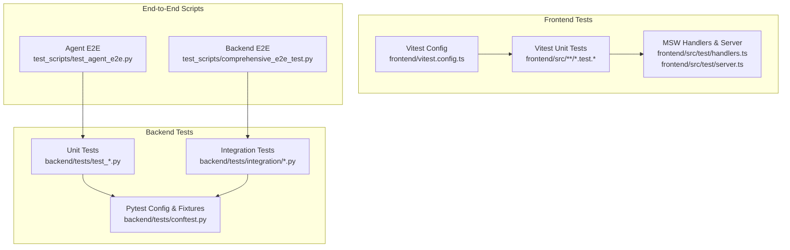
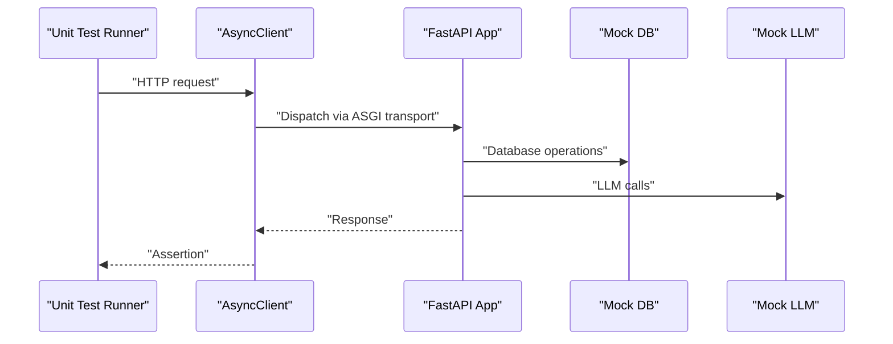
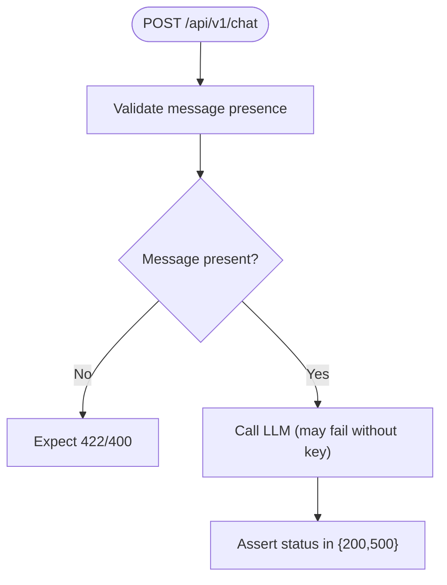
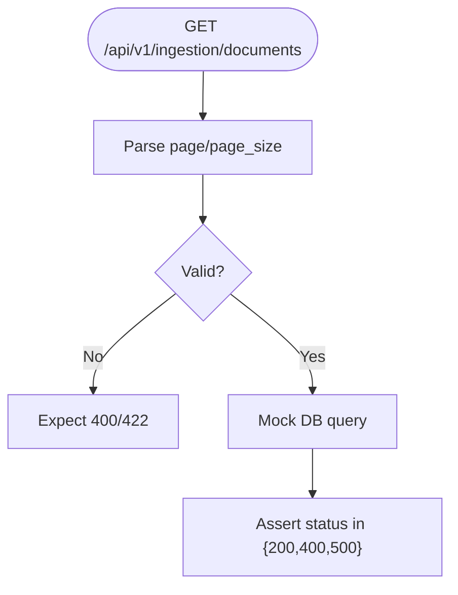
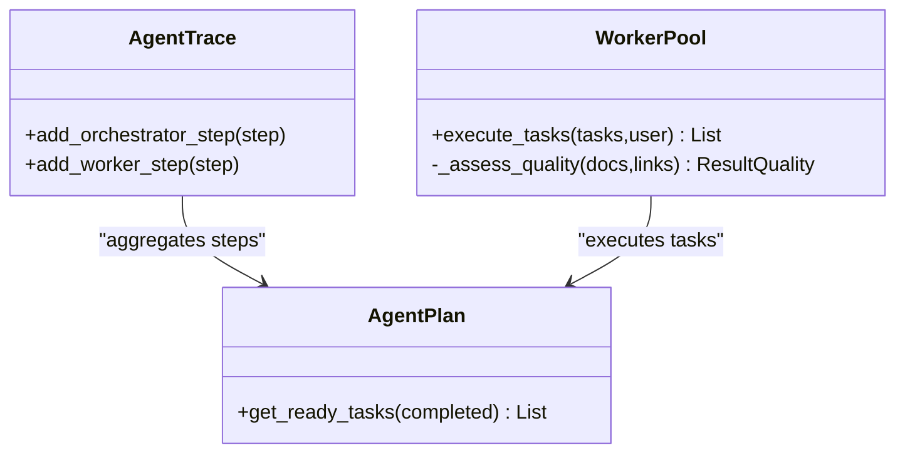
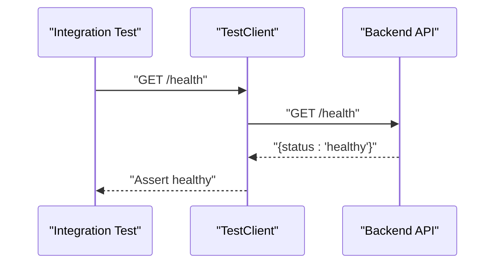
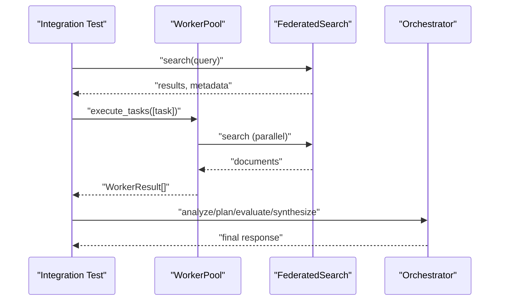
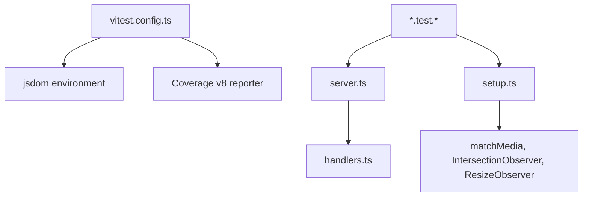
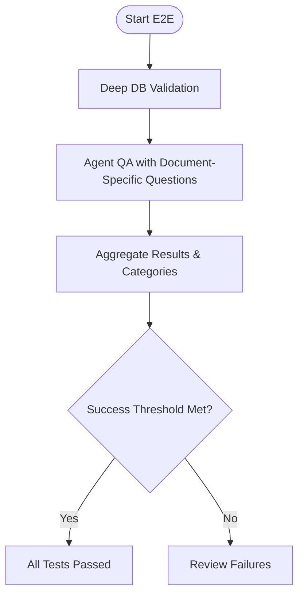
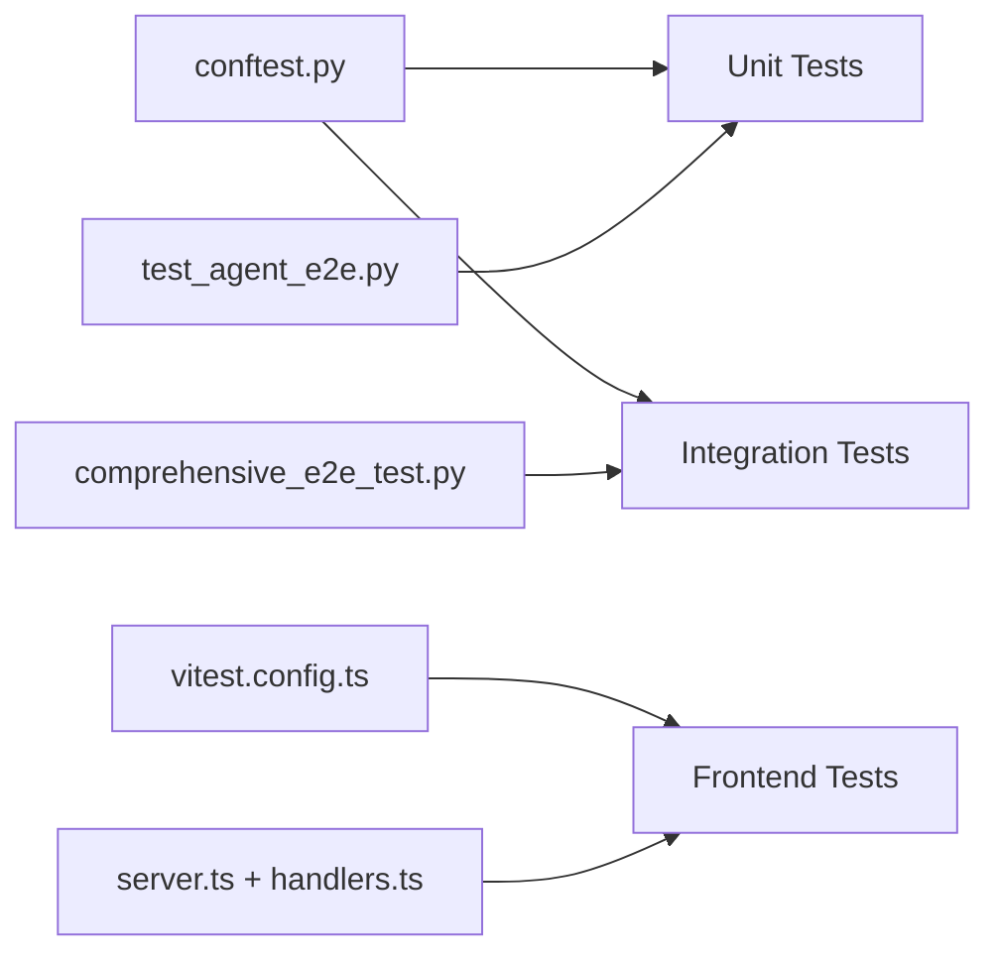

# Testing and Quality Assurance

<cite>
**Referenced Files in This Document**
- [backend/tests/conftest.py](file://backend/tests/conftest.py)
- [backend/tests/test_chat.py](file://backend/tests/test_chat.py)
- [backend/tests/test_federated_agent.py](file://backend/tests/test_federated_agent.py)
- [backend/tests/test_ingestion.py](file://backend/tests/test_ingestion.py)
- [backend/tests/integration/test_api_integration.py](file://backend/tests/integration/test_api_integration.py)
- [backend/tests/integration/test_federated_agent_integration.py](file://backend/tests/integration/test_federated_agent_integration.py)
- [test_scripts/comprehensive_e2e_test.py](file://test_scripts/comprehensive_e2e_test.py)
- [test_scripts/test_agent_e2e.py](file://test_scripts/test_agent_e2e.py)
- [frontend/package.json](file://frontend/package.json)
- [frontend/vitest.config.ts](file://frontend/vitest.config.ts)
- [frontend/src/test/setup.ts](file://frontend/src/test/setup.ts)
- [frontend/src/test/server.ts](file://frontend/src/test/server.ts)
- [frontend/src/test/handlers.ts](file://frontend/src/test/handlers.ts)
</cite>

## Table of Contents
1. [Introduction](#introduction)
2. [Project Structure](#project-structure)
3. [Core Components](#core-components)
4. [Architecture Overview](#architecture-overview)
5. [Detailed Component Analysis](#detailed-component-analysis)
6. [Dependency Analysis](#dependency-analysis)
7. [Performance Considerations](#performance-considerations)
8. [Troubleshooting Guide](#troubleshooting-guide)
9. [Conclusion](#conclusion)
10. [Appendices](#appendices)

## Introduction
This document describes the complete testing and quality assurance practices for the MongoDB RAG Agent project. It covers the entire test suite including unit tests, integration tests, and end-to-end testing strategies for both backend and frontend components. It also details the testing framework setup, quality assurance processes such as code coverage analysis, performance testing, and security auditing. Guidance is provided for writing effective tests, mocking strategies, test data management, debugging techniques, performance profiling, and quality metrics collection.

## Project Structure
The repository organizes tests across backend and frontend, with dedicated integration and end-to-end test scripts. The backend uses pytest fixtures and FastAPI TestClient/AsyncClient for synchronous and asynchronous testing. The frontend uses Vitest with MSW (Mock Service Worker) to mock API endpoints during unit and integration tests. End-to-end tests are implemented as standalone Python scripts that exercise the full RAG pipeline.

**Diagram sources**
- [backend/tests/conftest.py](file://backend/tests/conftest.py#L1-L174)
- [backend/tests/test_chat.py](file://backend/tests/test_chat.py#L1-L120)
- [backend/tests/test_federated_agent.py](file://backend/tests/test_federated_agent.py#L1-L404)
- [backend/tests/test_ingestion.py](file://backend/tests/test_ingestion.py#L1-L120)
- [backend/tests/integration/test_api_integration.py](file://backend/tests/integration/test_api_integration.py#L1-L212)
- [backend/tests/integration/test_federated_agent_integration.py](file://backend/tests/integration/test_federated_agent_integration.py#L1-L426)
- [frontend/vitest.config.ts](file://frontend/vitest.config.ts#L1-L23)
- [frontend/src/test/handlers.ts](file://frontend/src/test/handlers.ts#L1-L277)
- [frontend/src/test/server.ts](file://frontend/src/test/server.ts#L1-L9)
- [test_scripts/comprehensive_e2e_test.py](file://test_scripts/comprehensive_e2e_test.py#L1-L356)
- [test_scripts/test_agent_e2e.py](file://test_scripts/test_agent_e2e.py#L1-L218)

**Section sources**
- [backend/tests/conftest.py](file://backend/tests/conftest.py#L1-L174)
- [backend/tests/test_chat.py](file://backend/tests/test_chat.py#L1-L120)
- [backend/tests/test_federated_agent.py](file://backend/tests/test_federated_agent.py#L1-L404)
- [backend/tests/test_ingestion.py](file://backend/tests/test_ingestion.py#L1-L120)
- [backend/tests/integration/test_api_integration.py](file://backend/tests/integration/test_api_integration.py#L1-L212)
- [backend/tests/integration/test_federated_agent_integration.py](file://backend/tests/integration/test_federated_agent_integration.py#L1-L426)
- [frontend/vitest.config.ts](file://frontend/vitest.config.ts#L1-L23)
- [frontend/src/test/handlers.ts](file://frontend/src/test/handlers.ts#L1-L277)
- [frontend/src/test/server.ts](file://frontend/src/test/server.ts#L1-L9)
- [test_scripts/comprehensive_e2e_test.py](file://test_scripts/comprehensive_e2e_test.py#L1-L356)
- [test_scripts/test_agent_e2e.py](file://test_scripts/test_agent_e2e.py#L1-L218)

## Core Components
- Backend unit tests validate API endpoints for chat, ingestion, profiles, search, and system health. They use FastAPI TestClient and AsyncClient, with pytest fixtures for mocks and test data.
- Backend integration tests validate end-to-end flows with real or test database connectivity behind a guard flag.
- Frontend tests use Vitest with jsdom environment, MSW for API mocking, and a setup file to mock browser APIs.
- End-to-end scripts validate the full RAG pipeline, including ingestion verification and agent question-answering behavior.

Key testing capabilities:
- Synchronous and asynchronous HTTP testing via FastAPI TestClient and AsyncClient.
- Mocked database and LLM clients for deterministic unit tests.
- MSW handlers to simulate backend responses for frontend tests.
- Coverage reporting for frontend tests using v8 provider.

**Section sources**
- [backend/tests/conftest.py](file://backend/tests/conftest.py#L1-L174)
- [backend/tests/test_chat.py](file://backend/tests/test_chat.py#L1-L120)
- [backend/tests/test_ingestion.py](file://backend/tests/test_ingestion.py#L1-L120)
- [backend/tests/integration/test_api_integration.py](file://backend/tests/integration/test_api_integration.py#L1-L212)
- [frontend/package.json](file://frontend/package.json#L1-L48)
- [frontend/vitest.config.ts](file://frontend/vitest.config.ts#L1-L23)
- [frontend/src/test/handlers.ts](file://frontend/src/test/handlers.ts#L1-L277)

## Architecture Overview
The testing architecture separates concerns across unit, integration, and end-to-end layers. Backend tests rely on pytest fixtures to inject mocked dependencies. Frontend tests rely on MSW to intercept HTTP requests and return controlled responses. End-to-end scripts exercise the full pipeline from ingestion to agent responses.

**Diagram sources**
- [backend/tests/conftest.py](file://backend/tests/conftest.py#L102-L108)
- [backend/tests/test_chat.py](file://backend/tests/test_chat.py#L15-L38)

**Section sources**
- [backend/tests/conftest.py](file://backend/tests/conftest.py#L1-L174)
- [backend/tests/test_chat.py](file://backend/tests/test_chat.py#L1-L120)

## Detailed Component Analysis

### Backend Unit Tests: Chat Endpoints
- Validates request validation, conversation lifecycle, and optional parameters.
- Uses TestClient to send requests and asserts HTTP status codes and response shapes.

**Diagram sources**
- [backend/tests/test_chat.py](file://backend/tests/test_chat.py#L15-L29)

**Section sources**
- [backend/tests/test_chat.py](file://backend/tests/test_chat.py#L1-L120)

### Backend Unit Tests: Ingestion Endpoints
- Covers document listing, pagination, retrieval, deletion, ingestion control, and index setup.
- Validates parameter validation and error handling.

**Diagram sources**
- [backend/tests/test_ingestion.py](file://backend/tests/test_ingestion.py#L21-L28)

**Section sources**
- [backend/tests/test_ingestion.py](file://backend/tests/test_ingestion.py#L1-L120)

### Backend Unit Tests: Federated Agent Schemas and Workers
- Validates schema models, trace aggregation, and worker pool behaviors.
- Includes async tests for parallel task execution and dependency ordering.

**Diagram sources**
- [backend/tests/test_federated_agent.py](file://backend/tests/test_federated_agent.py#L50-L74)
- [backend/tests/test_federated_agent.py](file://backend/tests/test_federated_agent.py#L116-L163)
- [backend/tests/test_federated_agent.py](file://backend/tests/test_federated_agent.py#L292-L313)

**Section sources**
- [backend/tests/test_federated_agent.py](file://backend/tests/test_federated_agent.py#L1-L404)

### Backend Integration Tests: API End-to-End Flows
- Guarded by environment variable to enable integration tests.
- Validates health checks, profile management, search, chat, ingestion, and system stats.

**Diagram sources**
- [backend/tests/integration/test_api_integration.py](file://backend/tests/integration/test_api_integration.py#L41-L56)

**Section sources**
- [backend/tests/integration/test_api_integration.py](file://backend/tests/integration/test_api_integration.py#L1-L212)

### Backend Integration Tests: Federated Agent Orchestration
- Tests embedding generation, parallel task execution, and orchestration phases with mocked LLM calls.
- Ensures task dependencies are respected and evaluation/synthesis steps are invoked.

**Diagram sources**
- [backend/tests/integration/test_federated_agent_integration.py](file://backend/tests/integration/test_federated_agent_integration.py#L113-L195)
- [backend/tests/integration/test_federated_agent_integration.py](file://backend/tests/integration/test_federated_agent_integration.py#L227-L296)

**Section sources**
- [backend/tests/integration/test_federated_agent_integration.py](file://backend/tests/integration/test_federated_agent_integration.py#L1-L426)

### Frontend Testing: Vitest and MSW
- Vitest configuration enables jsdom environment, global setup, and coverage reporting.
- MSW server and handlers mock backend endpoints for predictable frontend tests.
- Setup file mocks browser APIs commonly missing in test environments.

**Diagram sources**
- [frontend/vitest.config.ts](file://frontend/vitest.config.ts#L4-L22)
- [frontend/src/test/setup.ts](file://frontend/src/test/setup.ts#L1-L39)
- [frontend/src/test/server.ts](file://frontend/src/test/server.ts#L1-L9)
- [frontend/src/test/handlers.ts](file://frontend/src/test/handlers.ts#L1-L277)

**Section sources**
- [frontend/package.json](file://frontend/package.json#L1-L48)
- [frontend/vitest.config.ts](file://frontend/vitest.config.ts#L1-L23)
- [frontend/src/test/setup.ts](file://frontend/src/test/setup.ts#L1-L39)
- [frontend/src/test/server.ts](file://frontend/src/test/server.ts#L1-L9)
- [frontend/src/test/handlers.ts](file://frontend/src/test/handlers.ts#L1-L277)

### End-to-End Testing: Backend and Agent
- Comprehensive E2E validates database content, chunk quality, and agent question-answering.
- Agent E2E tests query routing (tool calls vs. conversational), conversation context, and response validation.

**Diagram sources**
- [test_scripts/comprehensive_e2e_test.py](file://test_scripts/comprehensive_e2e_test.py#L269-L351)
- [test_scripts/test_agent_e2e.py](file://test_scripts/test_agent_e2e.py#L154-L213)

**Section sources**
- [test_scripts/comprehensive_e2e_test.py](file://test_scripts/comprehensive_e2e_test.py#L1-L356)
- [test_scripts/test_agent_e2e.py](file://test_scripts/test_agent_e2e.py#L1-L218)

## Dependency Analysis
- Backend unit tests depend on pytest fixtures defined in conftest.py, including mock database, settings, app, and test data.
- Integration tests depend on the backend app and environment configuration to connect to a database.
- Frontend tests depend on Vitest configuration, MSW server initialization, and handler definitions.
- End-to-end scripts depend on the RAG agent runtime and database dependencies.

**Diagram sources**
- [backend/tests/conftest.py](file://backend/tests/conftest.py#L82-L94)
- [backend/tests/integration/test_api_integration.py](file://backend/tests/integration/test_api_integration.py#L22-L29)
- [frontend/vitest.config.ts](file://frontend/vitest.config.ts#L4-L22)
- [frontend/src/test/server.ts](file://frontend/src/test/server.ts#L5-L9)
- [frontend/src/test/handlers.ts](file://frontend/src/test/handlers.ts#L121-L261)
- [test_scripts/comprehensive_e2e_test.py](file://test_scripts/comprehensive_e2e_test.py#L86-L91)
- [test_scripts/test_agent_e2e.py](file://test_scripts/test_agent_e2e.py#L50-L53)

**Section sources**
- [backend/tests/conftest.py](file://backend/tests/conftest.py#L1-L174)
- [backend/tests/integration/test_api_integration.py](file://backend/tests/integration/test_api_integration.py#L1-L212)
- [frontend/vitest.config.ts](file://frontend/vitest.config.ts#L1-L23)
- [frontend/src/test/server.ts](file://frontend/src/test/server.ts#L1-L9)
- [frontend/src/test/handlers.ts](file://frontend/src/test/handlers.ts#L1-L277)
- [test_scripts/comprehensive_e2e_test.py](file://test_scripts/comprehensive_e2e_test.py#L1-L356)
- [test_scripts/test_agent_e2e.py](file://test_scripts/test_agent_e2e.py#L1-L218)

## Performance Considerations
- Asynchronous tests leverage AsyncClient and asyncio event loops to minimize overhead and maximize throughput.
- Parallel task execution in the worker pool reduces end-to-end latency for multi-task scenarios.
- Frontend coverage uses v8 provider for efficient instrumentation and reporting.
- Integration tests can be conditionally enabled to avoid unnecessary database load during CI runs.

[No sources needed since this section provides general guidance]

## Troubleshooting Guide
Common issues and resolutions:
- Missing LLM API keys cause chat endpoints to fail; ensure environment variables are set for integration tests.
- Database connectivity failures in integration tests; verify MongoDB is running and credentials are correct.
- Frontend tests failing due to missing browser APIs; confirm setup.ts is loaded by Vitest configuration.
- MSW handler mismatches; verify route patterns and JSON payloads in handlers.ts align with frontend requests.
- End-to-end ingestion failures; validate that test documents exist and indexes are created before running E2E scripts.

**Section sources**
- [backend/tests/integration/test_api_integration.py](file://backend/tests/integration/test_api_integration.py#L15-L19)
- [frontend/src/test/setup.ts](file://frontend/src/test/setup.ts#L1-L39)
- [frontend/src/test/handlers.ts](file://frontend/src/test/handlers.ts#L1-L277)
- [test_scripts/comprehensive_e2e_test.py](file://test_scripts/comprehensive_e2e_test.py#L80-L174)

## Conclusion
The project employs a layered testing strategy with robust unit, integration, and end-to-end tests. Backend tests utilize pytest fixtures and FastAPI clients, while frontend tests leverage Vitest and MSW. End-to-end scripts validate the full RAG pipeline. The setup supports code coverage, mocking, and controlled test data, enabling reliable quality assurance across development and CI environments.

[No sources needed since this section summarizes without analyzing specific files]

## Appendices

### Test Script Execution and Automation
- Backend unit tests: run with pytest in the backend directory.
- Backend integration tests: enable via environment variable and run with pytest.
- Frontend tests: use npm/yarn scripts for dev/build/lint/test/coverage.
- End-to-end scripts: run with Python asyncio event loop.

**Section sources**
- [backend/tests/integration/test_api_integration.py](file://backend/tests/integration/test_api_integration.py#L15-L19)
- [frontend/package.json](file://frontend/package.json#L6-L14)
- [test_scripts/comprehensive_e2e_test.py](file://test_scripts/comprehensive_e2e_test.py#L353-L356)
- [test_scripts/test_agent_e2e.py](file://test_scripts/test_agent_e2e.py#L215-L218)

### Guidelines for Writing Effective Tests
- Use pytest fixtures to isolate dependencies and reduce duplication.
- Prefer mocking external systems (database, LLM) to ensure determinism.
- Validate both success and failure paths, including edge cases and invalid inputs.
- Keep tests focused and assert specific outcomes rather than broad behaviors.
- Use descriptive test names and group related tests under logical classes.

[No sources needed since this section provides general guidance]

### Mocking Strategies
- Backend: use unittest.mock to create AsyncMock/MagicMock for database and LLM clients.
- Frontend: use MSW handlers to mock API responses and simulate network conditions.
- Integration: selectively patch components to test orchestration and coordination.

**Section sources**
- [backend/tests/conftest.py](file://backend/tests/conftest.py#L28-L59)
- [frontend/src/test/handlers.ts](file://frontend/src/test/handlers.ts#L121-L261)
- [frontend/src/test/server.ts](file://frontend/src/test/server.ts#L5-L9)

### Test Data Management
- Centralize sample data in pytest fixtures for reuse across tests.
- Maintain separate datasets for unit and integration tests to avoid cross-contamination.
- Use controlled mock data in MSW handlers for frontend tests.

**Section sources**
- [backend/tests/conftest.py](file://backend/tests/conftest.py#L111-L174)
- [frontend/src/test/handlers.ts](file://frontend/src/test/handlers.ts#L9-L83)

### Debugging Techniques
- Enable verbose logging in tests and scripts to capture detailed execution traces.
- Use pytest’s built-in assertion introspection and captured logs.
- For frontend tests, inspect network requests via browser devtools or MSW logs.

[No sources needed since this section provides general guidance]

### Performance Profiling and Metrics
- Measure processing time in backend endpoints and agent flows.
- Track token usage and iteration counts in orchestration phases.
- Monitor frontend rendering performance using Vitest timing and coverage metrics.

[No sources needed since this section provides general guidance]

### Security Auditing Practices
- Validate input sanitization and validation layers in API endpoints.
- Audit LLM prompt injection risks by testing malformed inputs.
- Review MSW handlers to ensure they do not expose sensitive data.

[No sources needed since this section provides general guidance]